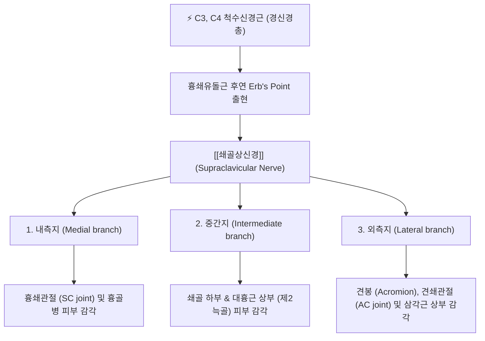
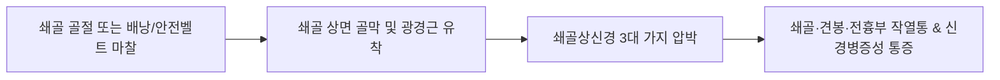

---
aliases:
  - Supraclavicular nerve
  - 쇄골상신경
tags:
  - 신경
  - 경신경총
  - 견관절
  - 쇄골
  - 해부학
---

# ⚡ [[쇄골상신경]] (Supraclavicular Nerve / 鎖骨上神經, C3~C4)

> **핵심 3줄 요약 (Key Summary)**:
> - 🗺️ 신경 기원 & 해부학적 주행: C3~C4 척수신경 전지(경신경총)에서 기원하여, [[흉쇄유돌근]] 후연 중앙(Erb's point)에서 천층으로 출현한 뒤 광경근 심부를 지나 쇄골 상면을 부채꼴로 가로지르며 내측·중간·외측지로 분지.
> - 🎯 운동 지배(근육군) & 감각 지배 영역: 순수 감각 신경으로 쇄골 상하부, 흉골병 및 전흉부 제2늑골 상부, 견봉(Acromion), 견쇄관절(AC joint) 및 삼각근 상부 피하 감각 관할.
> - ⚠️ 호발 포착 부위 & 관련 임상 질환: 쇄골 골절 및 수술 후 반흔 유착, 무거운 배낭 끈이나 안전벨트 마찰 압박에 의한 [[쇄골상신경]] 포착 증후군, 회전근개 파열로 오인되는 전견부 신경통.
> - 🔍 주요 이학적 검사 & 신경학적 징후: 쇄골 상연 틴넬 징후(Tinel's sign), Erb's point 압통, 쇄골 및 전흉부 감각과민/둔마, 견관절 운동 범위 제한 없음(회전근개 질환과 감별점).

---

## 📌 목차
1. [신경 기원 & 해부학적 분지 경로 (Anatomy & Course)](#1-신경-기원--해부학적-분지-경로-anatomy--course)
2. [신경 지배 맵 & 기능 네트워크 (Innervation Map)](#2-신경-지배-맵--기능-네트워크-innervation-map)
3. [호발 포착 부위 & 터널 증후군 병태생리](#3-호발-포착-부위--터널-증후군-병태생리)
4. [손상 레벨별 임상 증상 & 신경학적 결손](#4-손상-레벨별-임상-증상--신경학적-결손)
5. [관련 이학적 검사 & 신경 감별 매트릭스](#5-관련-이학적-검사--신경-감별-매트릭스)
6. [한의 신경 치료 프로토콜 (약침·침도·신경수기)](#6-한의-신경-치료-프로토콜-약침침도신경수기)
7. [💡 사용자 진료실 핵심 필기 & 임상 팁 (원문 보존)](#7--사용자-진료실-핵심-필기--임상-팁-원문-보존)
8. [출처 및 학술 참고 문헌 (References)](#8-출처-및-학술-참고-문헌-references)

---

## 1. 신경 기원 & 해부학적 분지 경로 (Anatomy & Course)

![[쇄골하신경-20240918005752153.png|400]]
> [그림 1] 쇄골 및 견갑대 주변 신경총 주행과 [[쇄골상신경]]의 피하 분지 경로

![[어깨 추나-20240926180601163.png|400]]
> [그림 2] 견봉(Acromion), 쇄골, 견쇄관절 및 [[삼각근]] 상부와 쇄골상신경 외측지의 해부학적 관계

![[어깨 추나-20240926180955085.png|400]]
> [그림 3] 흉골병 및 쇄골 하부 전흉부 근막과 쇄골상신경 내측/중간지의 주행

* **신경 기원 (Spinal Origin)**:
  * 제3 및 제4 경신경(C3, C4) 척수신경 전지(Anterior rami)의 공통 줄기에서 기원하는 경신경총(Cervical plexus)의 표재 감각 가지입니다.
* **Erb's Point (신경점) 출현 및 경부 주행**:
  * [[흉쇄유돌근]](Sternocleidomastoid, SCM)의 후연 중점(Erb's point)에서 천경막(Investing layer of deep cervical fascia)을 뚫고 피하로 빠져나옵니다.
  * [[광경근]](Platysma) 심부와 경추 후삼각(Posterior cervical triangle)의 지방 조직을 통과하여 쇄골 방향으로 부채꼴(Fan shape)로 펼쳐지며 비스듬히 하행합니다.
* **쇄골 통과 및 3대 종말가지 분지 (3 Major Branches)**:
  * 쇄골(Clavicle)의 상연을 가로지를 때 일부 섬유는 쇄골 골질 내부의 선천적 뼈 터널(Osseous tunnel / canal) 또는 홈(Groove)을 통과하기도 합니다 (인구의 약 2~4%).
  * 쇄골 높이에서 3개의 주요 가지로 나뉩니다:
    1. **내측 쇄골상신경 (Medial / Anterior branch)**: 흉골병(Manubrium sterni) 및 흉쇄관절(SC joint) 부위로 하행.
    2. **중간 쇄골상신경 (Intermediate / Middle branch)**: 쇄골 중앙부를 가로질러 대흉근 상부(제2늑골 높이) 피부로 분포.
    3. **외측 쇄골상신경 (Lateral / Posterior branch)**: 견봉(Acromion), 견쇄관절(AC joint) 및 삼각근 상부 외측으로 주행.

---

## 2. 신경 지배 맵 & 기능 네트워크 (Innervation Map)

### 1) 감각 신경 지배 영역 (Sensory Distribution)
* **내측지 (Medial branch)**: 흉쇄관절, 흉골병 상부, 쇄골 내측 1/3 상하면의 피부 감각.
* **중간지 (Intermediate branch)**: 쇄골 중앙 1/3 하방, 흉벽의 제2늑골 높이까지(유두선 상부)의 흉골 전면 피부 감각.
* **외측지 (Lateral branch)**: 견봉(Acromion), 견쇄관절, 상완외측 [[삼각근]] 상부 절반의 피부 감각.

### 2) 견관절 질환과의 감별 진단적 의의
* 어깨 통증 환자에서 회전근개 파열이나 오십견(유착성 관절낭염)으로 진단받았으나 견관절 수동 운동 범위(PROM)가 정상이고 쇄골 주변의 작열통을 호소하는 경우, **쇄골상신경 외측지의 포착성 신경통**인 경우가 흔합니다.

---

## 3. 호발 포착 부위 & 터널 증후군 병태생리

* **제1 포착 부위: 쇄골 골절 및 수술 후 흉터 조직 (Clavicle Fracture & Post-op Scar)**:
  * 쇄골 골절 환자에서 수술적 금속판 고정술(ORIF)을 시행할 때 횡절개창으로 인해 쇄골상신경 가지가 절단되거나, 수술 후 형성된 반흔 유착(Scar tissue)에 신경이 단단히 얽히면서 만성 신경통이 발생합니다.
* **제2 포착 부위: 쇄골 상면의 뼈 터널 (Osseous Canal) 및 홈 (Groove)**:
  * 쇄골 발생 과정에서 신경이 골질 내 관(Canal)을 뚫고 지나가는 해부학적 변이가 있는 환자에서, 쇄골 인대 긴장이나 미세 골절 시 신경이 골관 내에서 끼이는 구획 증후군이 유발됩니다.
* **제3 포착 부위: 흉쇄유돌근 후연 Erb's Point**:
  * 흉쇄유돌근의 단축 및 근막 유착으로 인해 신경 출구부가 조여지는 부위입니다.
* **제4 포착 요인: 외부 압박 (배낭 끈, 안전벨트, 브래지어 끈)**:
  * 무거운 배낭을 멘 등산객이나 군인, 운전 시 안전벨트가 쇄골 상면을 지속 압박할 때 신경 허혈성 압박 손상이 촉발됩니다.

---

## 4. 손상 레벨별 임상 증상 & 신경학적 결손

| 손상/포착 부위 | 주요 임상 증상 | 신경학적 소견 | 호발 원인 |
| :--- | :--- | :--- | :--- |
| **쇄골상신경 외측지 포착** | 어깨 외측(견봉 부위)의 화끈거리는 작열통, 겉 피부를 건드리기만 해도 쓰라림, 옷 솔기가 닿을 때 통증 | 견봉 및 삼각근 상부 감각과민(Hyperesthesia) 또는 둔마, 틴넬 징후 양성 | 무거운 가방 끈 압박, 견쇄관절 손상 |
| **쇄골 골절 수술 후 신경통** | 쇄골 수술 흉터 주변의 무감각, 찌릿함, 개미가 기어가는 듯한 이상감각(Paresthesia), 만성 흉벽통 | 흉터 부위 가벼운 타진 시 전흉부로 전기가 통함 | 쇄골 수술 시 신경 절단 및 신경종(Neuroma) 형성 |
| **Erb's Point 경부 포착** | 목 옆에서 쇄골, 가슴 위쪽까지 넓게 퍼지는 찌릿한 당김과 저림 | 흉쇄유돌근 후연 압통, 고개 반대측 회전 시 통증 유발 | 흉쇄유돌근 과긴장, 일자목, 거북목 증후군 |

---

## 5. 관련 이학적 검사 & 신경 감별 매트릭스

| 이학적 검사명 | 검사 방법 및 유발 기전 | 양성 반응 | 관련 감별 질환 |
| :--- | :--- | :--- | :--- |
| **쇄골 상연 틴넬 징후 (Tinel's sign)** | 쇄골의 내측, 중간, 외측 상면을 손가락 끝이나 타진기로 가볍게 두드림 | 쇄골 하부, 가슴 위쪽, 견봉으로 찌릿한 방사통 재현 | [[쇄골상신경]] 포착 및 신경종 |
| **Erb's Point 압박 유발 검사** | 흉쇄유돌근 후연 중간 지점을 5초간 지속 압박 | 쇄골 부위 전체로 뻗치는 신경통 재현 | 경신경총 피하지각신경 포착 |
| **견관절 충돌 검사 (Neer / Hawkins)** | 견관절을 수동으로 굴곡 및 내회전 | 견봉하 공간의 기계적 충돌 통증 유발 | 회전근개 질환 (음성이면 쇄골상신경 포착 의심) |

---

## 6. 한의 신경 치료 프로토콜 (약침·침도·신경수기)

### 6.1 Erb's Point 및 쇄골 상연 약침 수압박리술 (Hydrodissection)
* **자침 타겟 및 랜드마크**:
  * 1차 포인트: 흉쇄유돌근 후연 중점(Erb's point, 천정혈 부위).
  * 2차 포인트: 쇄골 중간 1/3 상연의 압통점 및 틴넬 양성 부위(결분혈 외측, 거골혈 내측).
* **약침 제제 및 주입 기법**:
  * 중성어혈약침 또는 신바로약침 0.5~1.0cc 사용.
  * 30G 미세 주사기로 쇄골 골막 상면을 스치듯이 피하층에 진입하여 약침액을 부드럽게 주입, 유착된 반흔 근막과 신경 줄기를 수압으로 유리시킵니다.

### 6.2 쇄골 골절 수술 반흔 침도 유리술 (Acupotomy)
* 쇄골 수술 후 단단하게 굳은 켈로이드성 흉터 및 쇄골 상면의 섬유성 밴드를 소침도로 세밀하게 십자 박리하여 신경 감압을 유도합니다.

### 6.3 흉쇄유돌근 및 광경근 이완 도수 수기요법
* 흉쇄유돌근을 집게 손가락으로 가볍게 쥐어 유양돌기에서 쇄골 부착부까지 마사지 이완하고, 쇄골 하부 대흉근 건막을 스트레칭하여 신경 활주성을 개선합니다.

---

## 7. 💡 사용자 진료실 핵심 필기 & 임상 팁 (원문 보존)

### 7.1 진료실 3대 핵심 문진 및 감별 포인트
1. **쇄골 골절 및 수술 병력 청취**:
   * "예전에 쇄골이 부러져서 핀을 박았거나 수술을 받은 적이 있습니까?" (수술 후 1년이 지나서도 어깨가 시리고 아픈 환자의 80%는 쇄골상신경 포착증).
2. **어깨 옷 솔기 마찰 통증 확인**:
   * "어깨나 쇄골 쪽에 옷 솔기가 스치기만 해도 따갑거나 살을 에이는 듯합니까?" (신경병증성 이질통의 전형적 특징).
3. **가방 및 배낭 착용 습관 지도**:
   * 치료 기간 동안 한쪽 어깨로 메는 무거운 숄더백이나 배낭 착용을 금지하고, 쇄골 부위 패딩 쿠션 사용 지도.

---

## 8. 출처 및 학술 참고 문헌 (References)

* Trikoilis G, Lyrtzis C, Tavlaridis DG, Natsis K. Variants of the intermediate supraclavicular nerve: a cadaveric case series and clinical implications. *Folia Morphol (Warsz)*. 2026;85(1):e112930. [PMID: 42494248](https://pubmed.ncbi.nlm.nih.gov/42494248/) | [DOI: 10.5603/fm.112930](https://doi.org/10.5603/fm.112930)
  * `[연구 요약]` 중간 쇄골상신경의 사체 해부학적 주행 변이와 쇄골 관통 골관(Osseous canal)의 빈도를 분석하여 쇄골 골절 고정술 및 국소 약침 차단술의 손상 예방 랜드마크를 제시한 2026년 최신 연구.

* Khadanovich A, Kamlerova J, Havlikova S, et al. Canals and grooves for the supraclavicular nerves revisited: Anatomical and radiological study outlining their topography for clinical practice. *Ann Anat*. 2026 Jan;257:e152742. [PMID: 41067543](https://pubmed.ncbi.nlm.nih.gov/41067543/) | [DOI: 10.1016/j.aanat.2025.152742](https://doi.org/10.1016/j.aanat.2025.152742)
  * `[연구 요약]` 쇄골 표면의 쇄골상신경 통과용 홈(Groove)과 골관(Canal)을 방사선학 및 사체 해부학으로 정밀 맵핑하여, 비특이적 전견부 통증의 주요 원인인 신경 포착 메커니즘을 규명.

* Tunnels and grooves for supraclavicular nerves within the clavicle: review of the literature and clinical impact. *Surg Radiol Anat*. 2016 Aug;38(6):667-74. [PMID: 26702936](https://pubmed.ncbi.nlm.nih.gov/26702936/) | [DOI: 10.1007/s00276-015-1602-9](https://doi.org/10.1007/s00276-015-1602-9)
  * `[연구 요약]` 쇄골 내 쇄골상신경 터널의 유병률 및 쇄골 골절 수술 후 의인성 신경 손상(Iatrogenic nerve injury)의 위험 인자를 체계적으로 검토한 임상 해부학 종설.
