---
aliases:
  - Supraorbital nerve
  - 안와상신경
tags:
  - 신경
  - 삼차신경
  - 안면부
  - 두통
  - 미릉골통
  - 해부학
---

# ⚡ [[안와상신경]] (Supraorbital Nerve / 眼窩上神經, CN V1)

> **핵심 3줄 요약 (Key Summary)**:
> - 🗺️ 신경 기원 & 해부학적 주행: 삼차신경 제1분지인 안신경(CN V1)의 주 분지인 전두신경(Frontal nerve)에서 기원하여, 안와 상벽을 주행한 뒤 안와상절흔/공(Supraorbital notch/foramen)을 빠져나와 [[추미근]]과 [[전두근]]을 관통하여 두피로 상행.
> - 🎯 운동 지배(근육군) & 감각 지배 영역: 순수 감각 신경으로 이마 전면, 눈썹 부위, 두정골 관상봉합까지의 전방 두피, 윗눈꺼풀 중앙부 피부 및 전두동(Frontal sinus) 점막 감각 관할.
> - ⚠️ 호발 포착 부위 & 관련 임상 질환: 섬유골성 안와상절흔 및 [[추미근]](눈썹주름근) 비후에 의한 신경 포착, [[미릉골통]](眉稜骨痛), 전두부 편두통 발통점, [[안와상신경통]].
> - 🔍 주요 이학적 검사 & 신경학적 징후: 안와상절흔 압통 및 틴넬 징후(Tinel's sign), 눈썹을 찌푸릴 때 이마로 뻗치는 찌릿한 방사통, 전두부 감각과민.

---

## 📌 목차
1. [신경 기원 & 해부학적 분지 경로 (Anatomy & Course)](#1-신경-기원--해부학적-분지-경로-anatomy--course)
2. [신경 지배 맵 & 기능 네트워크 (Innervation Map)](#2-신경-지배-맵--기능-네트워크-innervation-map)
3. [호발 포착 부위 & 터널 증후군 병태생리](#3-호발-포착-부위--터널-증후군-병태생리)
4. [손상 레벨별 임상 증상 & 신경학적 결손](#4-손상-레벨별-임상-증상--신경학적-결손)
5. [관련 이학적 검사 & 신경 감별 매트릭스](#5-관련-이학적-검사--신경-감별-매트릭스)
6. [한의 신경 치료 프로토콜 (약침·침도·신경수기)](#6-한의-신경-치료-프로토콜-약침침도신경수기)
7. [💡 사용자 진료실 핵심 필기 & 임상 팁 (원문 보존)](#7--사용자-진료실-핵심-필기--임상-팁-원문-보존)
8. [출처 및 학술 참고 문헌 (References)](#8-출처-및-학술-참고-문헌-references)

---

## 1. 신경 기원 & 해부학적 분지 경로 (Anatomy & Course)

![[7. 얼굴신경-20240915222603541.png|400]]
> [그림 1] 두면부 삼차신경 분지 및 [[안와상신경]]의 안와상절흔 출현과 피하 주행

![[청강의감26_06_두통_편두통_두풍_미릉골통.jpg|400]]
> [그림 2] 청강의감 임상 필기 도해: [[미릉골통]](눈썹 뼈 통증)과 전두부 안와상신경 포착의 병태생리

![[청강의감15_21_간주목_눈.gif|350]]
> [그림 3] 간주목(肝主目)과 안와 주위 감각 신경 및 눈 통증 연계

* **신경 기원 (Origin)**:
  * 제5 뇌신경인 삼차신경(Trigeminal nerve, CN V)의 제1분지인 안신경(Ophthalmic nerve, V1)의 가장 큰 분지인 **전두신경(Frontal nerve)**에서 유래합니다.
* **안와 내 주행 (Intraorbital Course)**:
  * 상안와열(Superior orbital fissure)을 통해 안와강으로 진입하여, 상안검거근(Levator palpebrae superioris) 바로 위, 안와 상벽 골막 아래를 따라 전방으로 주행합니다.
* **안와 탈출 및 근육 관통 (Exit & Muscular Piercing)**:
  * 안와 상연(Superior orbital rim)의 내측 1/3 지점에 위치한 **안와상절흔(Supraorbital notch) 또는 안와상공(Supraorbital foramen)**을 통해 안와 밖으로 빠져나옵니다. (인구의 약 25~35%에서는 뼈로 둘러싸인 구멍(Foramen) 형태로 존재).
  * 출현 직후 [[추미근]](Corrugator supercilii)과 [[안륜근]](Orbicularis oculi), [[전두근]](Frontalis)의 근육 섬유를 가로질러 뚫고 나옵니다.
* **두피 종말 분지 (Superficial & Deep Branches)**:
  * **천지 (Superficial/Medial branch)**: 전두근을 뚫고 모상건막(Galea aponeurotica) 표층으로 주행하여 전두부 중간 두피 감각 관할.
  * **심지 (Deep/Lateral branch)**: 모상건막과 두개골막 사이를 타고 두정부 관상봉합(Coronal suture) 및 람다봉합 직전까지 길게 상행.

---

## 2. 신경 지배 맵 & 기능 네트워크 (Innervation Map)

```mermaid
graph TD
    CNV1["⚡ 삼차신경 제1분지 (안신경, CN V1)"] --> FrontalNerve["전두신경 (Frontal Nerve)"]
    FrontalNerve --> SON["[[안와상신경]] (Supraorbital Nerve)"]
    
    SON --> Notch["안와상절흔 / 안와상공 통과 (제1 관문)"]
    Notch --> Corrugator["추미근 & 전두근 관통 (제2 관문)"]
    
    Corrugator --> Superficial["천지 (Superficial branch) -> 전두부 피부 감각"]
    Corrugator --> Deep["심지 (Deep branch) -> 정수리 두피 감각"]
    
    SON --> EyelidSensory["윗눈꺼풀 (상안검) 중앙 피부"]
    SON --> SinusSensory["전두동 (Frontal sinus) 점막 감각"]
```

### 1) 감각 신경 지배 영역 (Sensory Distribution)
* **이마 및 두피**: 눈썹 상방부터 정수리 관상봉합에 이르는 이마 전면과 두정부 전반의 피부 감각.
* **안검**: 상안검(윗눈꺼풀) 중앙부 피부 및 결막 일부.
* **부비동**: 전두동(Frontal sinus) 점막의 고유 감각 및 통각.

---

## 3. 호발 포착 부위 & 터널 증후군 병태생리

* **제1 포착 터널: 안와상절흔 (Supraorbital Notch) 및 인대**:
  * 안와상절흔 상부를 가로지르는 골화된 섬유성 인대(Supraorbital ligament)에 의해 신경이 뼈와 인대 사이에 끼여 압박을 받습니다.
* **제2 포착 터널: [[추미근]](Corrugator Supercilii) 관통부 (임상 최다빈도)**:
  * 눈부심, 스마트폰 시청, 미간을 찡그리는 표정 습관, 만성 스트레스로 인해 추미근이 비후되면 근육 내부를 통과하는 안와상신경이 집게에 물린 듯 압박을 받습니다.
  * 이는 성형외과 및 신경과 편두통 수술에서 **전두부 편두통의 제1 발통점(Trigger Site I)**으로 공인되어 있습니다.
* **제3 포착 요인: 외부 압박 (모자, 헬멧, 수영 안경)**:
  * 꽉 끼는 모자, 오토바이 헬멧, 수경(Goggles)의 테두리가 안와상절흔을 직접 눌러 신경통이 촉발됩니다.

---

## 4. 손상 레벨별 임상 증상 & 신경학적 결손

| 질환 / 장애 유형 | 주요 임상 증상 | 신경학적 소견 | 호발 원인 |
| :--- | :--- | :--- | :--- |
| **[[미릉골통]] (眉稜骨痛)** | 눈썹 뼈 부위가 깨질 듯이 아프고, 오후나 밤이 되면 이마가 조여들며 눈을 뜨기 힘듦 | 어요혈/찬죽혈 부위 극심한 압통, 눈 피로 동반 | 담음(痰飮), 풍열(風熱), 추미근 과긴장 |
| **[[안와상신경통]] (Supraorbital Neuralgia)** | 눈썹 위에서 이마로 번지는 칼로 베는 듯한 발작성 통증, 찌릿한 전기 통증 | 안와상절흔 틴넬 징후 양성, 눈썹 두피 이질통 | 외상, 대상포진 후 신경통, 신경 포착 |
| **수술 후 전두부 무감각** | 이마에 감각이 없고 남의 살 같음, 이마를 긁어도 시원하지 않음 | 전두부 촉각/통각 소실 | 이마 거상술, 눈썹하 절개술 중 신경 손상 |

---

## 5. 관련 이학적 검사 & 신경 감별 매트릭스

| 이학적 검사명 | 검사 방법 및 유발 기전 | 양성 반응 | 관련 감별 질환 |
| :--- | :--- | :--- | :--- |
| **안와상절흔 압박 틴넬 징후** | 눈썹 안쪽 1/3 상연의 절흔 부위를 엄지손가락으로 5초간 강하게 압박 | 이마와 정수리로 전기가 찌릿하게 방사됨 | [[안와상신경]] 포착 및 [[미릉골통]] |
| **추미근 핀치 검사 (Pinch Test)** | 눈썹 안쪽 추미근 근복을 손가락으로 집어 비틀어 봄 | 극심한 국소 압통과 함께 두통 재현 | 추미근 발통점 증후군 |
| **전두동 두드림 검사** | 이마 전두동 부위를 가볍게 타진 | 둔탁한 통증과 코막힘 악화 | 급성 전두동염 (부비동 질환) 감별 |

---

## 6. 한의 신경 치료 프로토콜 (약침·침도·신경수기)

### 6.1 안와상절흔 신경수압박리술 (Hydrodissection)
* **자침 타겟 및 랜드마크**:
  * 안와 상연 내측 1/3의 안와상절흔(어요혈과 찬죽혈 사이).
* **약침 제제 및 주입 기법**:
  * 황련해독탕 약침, 중성어혈약침 또는 저농도 봉약침 0.3~0.5cc 사용.
  * 30G 13mm 미세 주사기를 절흔 바로 상방에서 골막을 향해 45도 각도로 진입하여 신경 주위 결합조직에 미세 주입 (안구 내부로 침습되지 않도록 반드시 상방 두피 방향으로 자침).

### 6.2 소침도(Acupotomy)를 통한 추미근 섬유 터널 유리술
* 추미근의 단단한 경결 밴드를 신경 종축 방향과 평행하게 미세 절개하여 갇힌 안와상신경을 즉각 감압합니다.

### 6.3 미릉골통 한약 처방 배오
* **[[반하백출천마탕]]**: 비위 허약으로 담음(痰飮)이 차서 눈썹 뼈가 아프고 어지러운 두통 치료.
* **[[천궁차조산]]**: 풍열(風熱)로 인한 초기 외감성 전두부 두통 치료.
* **[[청상견통탕]]**: 안와 주위 열감과 안구 충혈을 동반한 완고한 미릉골통 치료.

---

## 7. 💡 사용자 진료실 핵심 필기 & 임상 팁 (원문 보존)

### 7.1 진료실 3대 핵심 문진 및 감별 포인트
1. **눈썹 뼈 압통 확인**:
   * "머리 아플 때 눈썹 안쪽 뼈를 꾹 누르면 눈이 번쩍 뜨이거나 이마가 찌릿합니까?" (양성이면 안와상신경 포착 확진).
2. **미간 주름 습관 문진**:
   * 무의식중에 미간을 찌푸리는 환자는 보톡스 효과처럼 침 치료로 추미근을 마비·이완시켜야 두통이 재발하지 않습니다.
3. **안구 건조 및 시력 저하 동반 여부**:
   * 안와상신경 포착 환자는 눈물샘 분비 이상 및 눈 침침함을 흔히 호소하므로 안과 질환과의 감별 설명 필수.

---

## 8. 출처 및 학술 참고 문헌 (References)

* Treatment of Frontal Secondary Headache Attributed to Supratrochlear and Supraorbital Nerve Entrapment With Oral Medication or Botulinum Toxin Type A vs Endoscopic Decompression Surgery. *JAMA Facial Plast Surg*. 2018 Sep 1;20(5):372-378. [PMID: 29801115](https://pubmed.ncbi.nlm.nih.gov/29801115/) | [DOI: 10.1001/jamafacial.2018.0268](https://doi.org/10.1001/jamafacial.2018.0268)
  * `[연구 요약]` 추미근에 의한 안와상신경 및 상활차신경 포착으로 발생하는 전두부 이차성 두통에서 신경 감압 및 국소 차단술이 두통 일수와 강도를 80% 이상 감소시킴을 입증한 랜드마크 임상 연구.

* Migraine Surgery at the Frontal Trigger Site: An Analysis of Intraoperative Anatomy. *Plast Reconstr Surg*. 2020 Feb;145(2):503-511. [PMID: 31985652](https://pubmed.ncbi.nlm.nih.gov/31985652/) | [DOI: 10.1097/PRS.0000000000006475](https://doi.org/10.1097/PRS.0000000000006475)
  * `[연구 요약]` 전두부 두통 환자의 수술 중 해부학 분석을 통해 추미근 내 안와상신경의 4가지 관통 패턴과 섬유성 결합 밴드에 의한 기계적 압박 위치를 정밀 규명.
