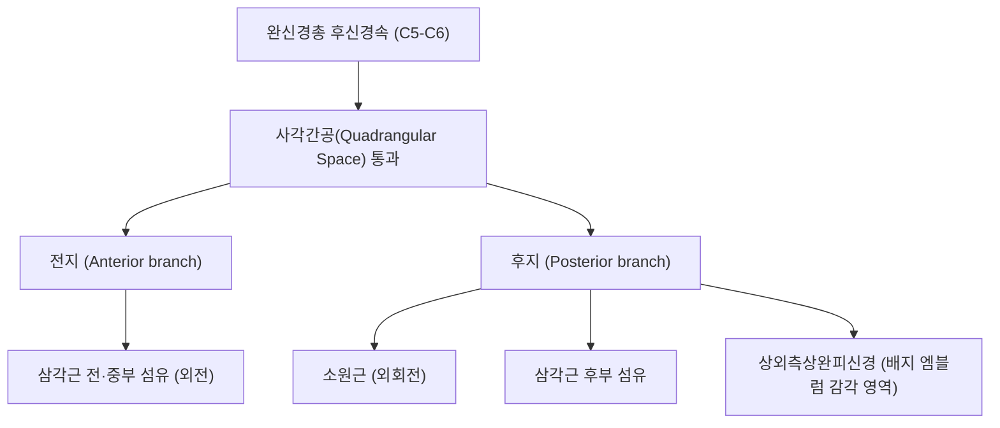

# ⚡ [[액와신경]] (Axillary Nerve)

> **핵심 요약 (Key Summary)**:
> 완신경총 후신경속(C5-C6)에서 기원하여 사각간공을 통과한 후 상완골 외측으로 주행하는 혼합 척수신경.
> 삼각근과 소원근을 운동 지배하여 어깨 외전 및 외회전을 담당하고 상외측상완피신경을 통해 삼각근 하부 피부 감각을 전담.
> 사각공 증후군(소원근 비후) 및 견관절 전방 탈구 시 포착·손상이 호발하여 삼각근 위축을 유발하며 사각간공 이완 추나와 견우·견료혈 약침의 핵심 표적.

---
## 📌 목차
1. [기존 메모 및 해부학 도해](#1-기존-메모-및-해부학-도해)
2. [해부학적 기원 및 사각간공(Quadrangular Space) 주행](#2-해부학적-기원-및-사각간공quadrangular-space-주행)
3. [운동 및 감각 신경 지배 분지](#3-운동-및-감각-신경-지배-분지)
4. [사각공 증후군(QSS)과 견관절 외상성 손상 기전](#4-사각공-증후군qss과-견관절-외상성-손상-기전)
5. [초음파 해부학(Sonoanatomy) 및 중재 시술 랜드마크](#5-초음파-해부학sonoanatomy-및-중재-시술-랜드마크)
6. [추나·도수치료(사각간공 감압술) & 침구·약침 치료 프로토콜](#6-추나도수치료사각간공-감압술--침구약침-치료-프로토콜)
7. [출처 및 학술 참고 문헌 (References)](#7-출처-및-학술-참고-문헌-references)

---
## 1. 기존 메모 및 해부학 도해

- C5-6 척수신경 앞가지에서 기원하여 [[상완신경총]]에서 분지
- [[견갑하근]] 앞으로 주행하여 내려오다가 뒤로가 [[소원근]], [[대원근]], [[상완삼두근]], 상완골로 둘러싸인 공간을 통과
- [[상완삼두근]]의 장두, [[소원근]], [[삼각근]] 운동지배, [[삼각근]] 피부영역 감각지배, 어깨관절 아랫면, 뒷면, 앞면, 아랫부분 관절지
- 주로 [[소원근]]에서 포착됨

![[Pasted image 20240113154116.png|450]]
> [사각간공을 통과하는 액와신경과 후상완회선동맥]

---
## 2. 해부학적 기원 및 사각간공(Quadrangular Space) 주행

| 해부학적 구분 | 상세 내용 |
| :--- | :--- |
| **신경근 기원** | 완신경총 후신경속(Posterior cord, C5, C6 전지 유래) |
| **동행 혈관** | 후상완회선동맥(Posterior circumflex humeral artery, PCHA) |
| **사각간공 상계** | [[소원근]](Teres minor) 및 견갑하신근 하연 |
| **사각간공 하계** | [[대원근]](Teres major) 상연 |
| **사각간공 내측계** | [[상완삼두근]] 장두(Triceps brachii long head) 외측연 |
| **사각간공 외측계** | 상완골 외과경(Surgical neck of humerus) 내측면 |

---
## 3. 운동 및 감각 신경 지배 분지

* **운동 신경 지배**:
  * [[삼각근]] (Deltoid): 어깨의 주된 외전(15~90도), 굴곡 및 신전력을 제공하는 최대 근육.
  * [[소원근]] (Teres minor): 상완골 외회전 및 견관절 후방 안정화 담당.
  * 관절지: 견관절낭의 전방, 후방 및 하방 관절지에 감각 섬유 분지.
* **피부 감각 신경 지배 (상외측상완피신경, Superior Lateral Cutaneous Nerve of Arm)**:
  * 군복의 견장(Regimental badge) 영역인 삼각근 하부 1/2 외측 피부 감각을 전담합니다.
  * 액와신경 손상 여부를 침 찌름(Pinprick)으로 확인하는 핵심 피부 감각 랜드마크입니다.

---
## 4. 사각공 증후군(QSS)과 견관절 외상성 손상 기전

* **사각공 증후군 (Quadrangular Space Syndrome, QSS)**:
  * 야구, 배구, 수영 등 오버헤드 투구 동작의 반복으로 인해 [[소원근]] 또는 대원근이 비후되거나 섬유성 띠가 형성되어 신경과 PCHA가 압박받는 증후군.
  * 어깨 후외측의 둔통, 외전 및 외회전 시 통증 악화, 삼각근 부위의 이상감각 및 근력 약화 유발.
* **견관절 전방 탈구 및 상완골 외과경 골절**:
  * 상완골두가 관절와 전하방으로 탈구될 때, 상완골 경부를 감아 도는 액와신경이 심하게 견인되거나 열상(Tear) 손상을 입습니다.
  * 견관절 정복 전후 반드시 삼각근 엠블럼 부위의 피부 감각과 삼각근 수축 여부를 필수 확인해야 합니다.

---
## 5. 초음파 해부학(Sonoanatomy) 및 중재 시술 랜드마크

* **초음파 스캔 뷰 (후방 종단/횡단)**:
  * 환자 좌위에서 상완골 후외측에 탐촉자를 거치하고 소원근, 대원근, 상완삼두근 장두가 만나는 사각간공 공간을 식별합니다.
  * 후상완회선동맥의 박동(Color Doppler)을 확인하고 그 바로 옆을 지나는 원형의 액와신경 단면을 관찰합니다.
* **초음파 유도하 수압박리술**:
  * 소원근과 삼두근 장두 사이 근막 간격으로 Out-of-plane 또는 In-plane 접근하여 유착 해소 약침 시술을 시행합니다.

---
## 6. 추나·도수치료(사각간공 감압술) & 침구·약침 치료 프로토콜

### 1) 추나요법 (Chuna Manual Therapy)
* **소원근 및 대원근 능동이완기법 (Active Release Technique)**:
  * 견관절을 내회전·외전시킨 상태에서 시술자의 엄지손가락으로 소원근 및 사각간공 부위를 압박 고정.
  * 환자가 스스로 견관절을 천천히 외회전·내전시키도록 유도하여 신경 주위 근막 유착을 동적으로 박리.
* **견관절 후방 관절낭 가동술**:
  * 상완골두 후방 활주 추나를 적용하여 사각간공에 가해지는 장력을 완화.

### 2) 침구 및 약침 치료
* **주요 혈위**:
  * 견정(肩貞, SI9): 사각간공 진입로 직하방 핵심 혈위.
  * 노회(臑會, TE13), 견료(肩髎, TE14): 삼각근 후부 및 액와신경 분지 주행 혈위.
  * 견우(肩髃, LI15): 삼각근 전중부 지배 분지 및 어깨 관절낭 자극.
* **약침 프로토콜**:
  * 견정(SI9) 사각간공 입구 및 소원근 압통점에 신바로 약침 또는 중성어혈 약침을 0.3~0.5cc 정밀 주입하여 신경 부종을 신속히 가라앉히고 미세 순환을 촉진.

---
## 7. 출처 및 학술 참고 문헌 (References)

* Standring S. *Gray's Anatomy: The Anatomical Basis of Clinical Practice*. 42nd ed. Elsevier; 2020.
  * `[연구 요약]` 액와신경의 완신경총 기원, 사각간공 통과 주행, 전지·후지 분지 및 상외측상완피신경 분포 해부학.
* Cahill BR, Palmer RE. Quadrangular space syndrome. *J Hand Surg Am*. 1983;8(1):65-69.
  * `[연구 요약]` 사각간공에서 발생하는 액와신경 및 후상완회선동맥 포착 증후군의 원인, 진단 및 외과적/보존적 감압술 검토.
* 대한침구의학회 교재편찬위원회. *침구의학*. 집문당; 2020.
  * `[연구 요약]` 수소양삼초경 및 수태양소장경 어깨 혈위(견정, 견료, 노회)의 액와신경 마비 및 사각공 증후군 임상 치료 연구.