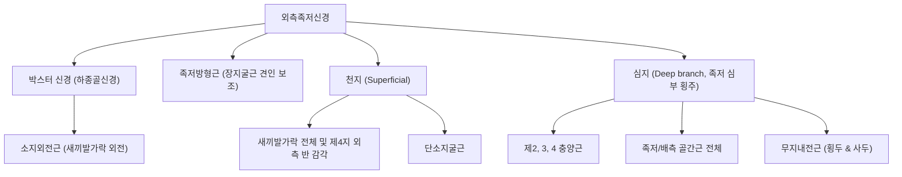

# ⚡ [[외측족저신경]] (Lateral Plantar Nerve)

> **핵심 요약 (Key Summary)**:
> 경골신경이 족근관 통과 후 외측으로 갈라지는 종말 신경으로 상지의 척골신경에 상응하는 족부 심부 제어 신경.
> 소지외전근, 족저방형근, 골간근, 제2-4충양근 및 무지내전근을 운동 지배하고 족저 외측부 및 제4·5발가락 감각을 담당.
> 첫 번째 분지인 박스터 신경의 포착 시 만성 난치성 발뒤꿈치 통증을 유발하여 족저방형근 이완 추나와 곤륜·신맥혈 약침의 핵심 표적.

---
## 📌 목차
1. [해부학적 기원 및 주행 분지 경로](#1-해부학적-기원-및-주행-분지-경로)
2. [운동 및 감각 신경 지배 (천지·심지)](#2-운동-및-감각-신경-지배-천지심지)
3. [박스터 신경(하종골신경)과 난치성 후족부 통증](#3-박스터-신경하종골신경과-난치성-후족부-통증)
4. [상지의 척골신경과의 상동성 및 족부 아치 안정화](#4-상지의-척골신경과의-상동성-및-족부-아치-안정화)
5. [초음파 해부학(Sonoanatomy) 및 감별 진단](#5-초음파-해부학sonoanatomy-및-감별-진단)
6. [추나·도수치료(외측 족궁 교정) & 침구·약침 치료 프로토콜](#6-추나도수치료외측-족궁-교정--침구약침-치료-프로토콜)
7. [출처 및 학술 참고 문헌 (References)](#7-출처-및-학술-참고-문헌-references)

---
## 1. 해부학적 기원 및 주행 분지 경로

| 해부학적 구분 | 상세 내용 |
| :--- | :--- |
| **신경근 기원** | [[경골신경]](Tibial nerve, S1-S2 주성분 유래) |
| **주행 경로** | [[무지외전근]] 심층을 지나 외측 전방으로 사선 주행, [[족저방형근]](Quadratus plantae)과 [[단지굴근]] 사이 공간 통과 |
| **동행 혈관** | 외측족저동맥(Lateral plantar artery)과 함께 족저동맥궁 형성 기여 |
| **핵심 분지** | ① 하종골신경(Inferior calcaneal nerve / Baxter's nerve), ② 천지(Superficial branch), ③ 심지(Deep branch) |

---
## 2. 운동 및 감각 신경 지배 (천지·심지)

* **천지 (Superficial Branch)**:
  * 피부 감각: 족저부 외측 1/3 및 제5발가락 전체와 제4발가락 외측 절반의 바닥면 감각 지배.
  * 근육 운동: 단소지굴근(Flexor digiti minimi brevis) 지배.
* **심지 (Deep Branch)**:
  * 족저 심부 근막 아래를 가로질러 내측으로 역주행하며 수부의 척골신경 심지와 완전히 동일하게 발의 골간근(Interossei) 전수, 제2~4충양근, [[무지내전근]]을 운동 지배합니다.

---
## 3. 박스터 신경(하종골신경)과 난치성 후족부 통증

* **박스터 신경 포착 (Baxter's Nerve Entrapment)**:
  * 외측족저신경의 첫 번째 분지인 하종골신경이 무지외전근의 깊은 근막과 족저방형근의 내측 모서리 사이를 90도로 꺾여 내려가며 통과할 때 포착됩니다.
  * 만성 발뒤꿈치 통증 환자의 약 15~20%를 차지하는 주요 원인 질환입니다.
* **임상 양상 및 족저근막염과의 감별**:
  * **통증 위치**: 종골 결절 전내측 및 발뒤꿈치 바닥 외측으로 방사되는 작열통.
  * **신경학적 증상**: 아침 첫 발 통증 외에도 휴식 시 및 야간에도 지속되는 욱신거림, 발바닥 외측 이상감각.
  * **근력 약화**: 만성화 시 [[소지외전근]]의 지방 변성 및 위축 초래(MRI/초음파 확인 가능).

---
## 4. 상지의 척골신경과의 상동성 및 족부 아치 안정화

* **척골신경(Ulnar Nerve)과의 발생학적 상동**:
  * 손바닥에서 척골신경이 골간근과 소지구근, 무지내전근을 지배하며 미세 집기 동작과 아치 형태를 유지하듯, 족부의 외측족저신경은 발가락 벌림/모음 및 횡아치(Transverse arch)를 단단히 조여주는 핵심 역할을 합니다.
* **족저방형근의 생체역학적 교정**:
  * 사선 방향으로 주행하는 장지굴근(FDL)의 견인 벡터를 종골 축에 맞추어 직선으로 당겨지도록 교정하는 족저방형근을 지배하여 발가락의 정렬된 굴곡력을 완성합니다.

---
## 5. 초음파 해부학(Sonoanatomy) 및 감별 진단

* **초음파 스캔 랜드마크**:
  * 탐촉자를 종골 내측 결절 바로 전방에 거치하고 무지외전근 심층과 족저방형근 사이 공간을 스캔합니다.
  * 외측족저신경과 박스터 신경이 족저방형근 근막 위를 지나 외측으로 주행하는 점상 신경 다발을 식별합니다.
  * 소지외전근의 근위축(Hyperechoic fat infiltration) 여부를 대조측과 비교 관찰합니다.
* **초음파 유도하 박리 치료**:
  * 족저방형근과 무지외전근 사이 근막 간격으로 접근하여 신경 감압 약침 시술을 시행합니다.

---
## 6. 추나·도수치료(외측 족궁 교정) & 침구·약침 치료 프로토콜

### 1) 추나요법 (Chuna Manual Therapy)
* **족저방형근 및 족저근막 외측 띠 근막이완술**:
  * 종골 전방 족저 심부의 족저방형근 기시부를 심부 마찰 마사지(Cross-friction)로 이완하여 신경 압박 경로를 해소.
* **입방골 및 종입방관절 가동술 (Cuboid Whip / Mobilization)**:
  * 외측 종아치의 쐐기돌 역할을 하는 입방골(Cuboid)의 하방 아탈구를 배측으로 교정하여 외측족저신경 심지의 압박성 긴장을 완화.

### 2) 침구 및 약침 치료
* **주요 혈위**:
  * 신맥(申脈, BL62), 곤륜(崑崙, BL60), 복삼(僕參, BL61): 외측 후족부 및 종골 주위 신경 자극 혈위.
  * 속골(束骨, BL65), 경골(京骨, BL64): 제5중족골 외측 외측족저신경 천지 지배 영역의 근막 긴장 해소.
  * 용천(KI1) 외측 함요처 및 족저방형근 압통점.
* **약침 프로토콜**:
  * 박스터 신경 포착점(종골 내측 전방 2cm 지점)에 신바로 약침 또는 중성어혈 약침을 0.3~0.5cc 분주하여 신경 주위 염증을 흡수시키고 미세 순환을 촉진.

---
## 7. 출처 및 학술 참고 문헌 (References)

* Standring S. *Gray's Anatomy: The Anatomical Basis of Clinical Practice*. 42nd ed. Elsevier; 2020.
  * `[연구 요약]` 외측족저신경의 주행 분지, 천지·심지 분포 양상 및 상지 척골신경과의 구조적 상동성 분석.
* Chundru N, Liebeskind A, Seidelmann F, et al. Plantar fasciitis and calcaneal spur formation are associated with abductor digiti minimi muscle atrophy on MRI of the foot. *Skeletal Radiol*. 2008;37(6):505-510.
  * `[연구 요약]` 하종골신경(박스터 신경) 포착에 따른 소지외전근 신경성 근위축과 족저근막염 간의 영상의학적 연관성.
* 대한침구의학회 교재편찬위원회. *침구의학*. 집문당; 2020.
  * `[연구 요약]` 족태양방광경 외측 족부 혈위(신맥, 경골, 속골)의 족통증 및 신경성 마비 치료 메커니즘.
