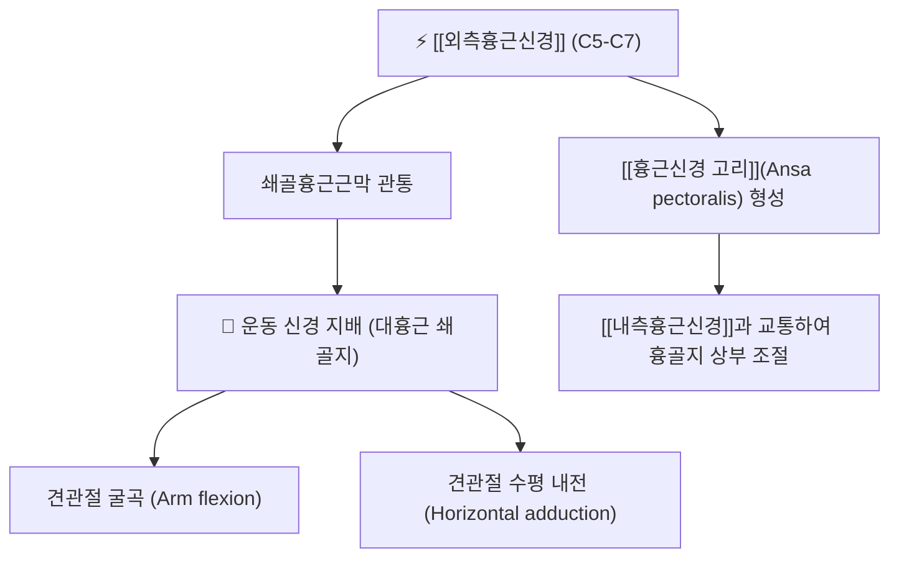

# ⚡ [[외측흉근신경]] (Lateral Pectoral Nerve / 外側胸筋神經, C5-C7)

> **핵심 3줄 요약 (Key Summary)**:
> - 🗺️ 신경 기원 & 해부학적 주행: 상완신경총 외측속(Lateral cord, C5-C7) 기원, 액와동맥 전면을 지나 쇄골흉근근막(Clavipectoral fascia)을 관통하여 [[대흉근]](Pectoralis major) 심층면으로 진입.
> - 🎯 운동 지배(근육군) & 감각 지배 영역: 순수 운동 신경. [[대흉근]]의 쇄골지(Clavicular head) 100% 지배 및 흉골병 상부 섬유 운동 지배, 흉쇄관절 고유수용감각 분지.
> - ⚠️ 호발 포착 부위 & 관련 임상 질환: 쇄골하근 하단 및 쇄골흉근근막 관통부, [[대흉근]] 쇄골지 단축성 경련, 앞가슴 상부 신경병증성 가슴 통증, 둥근 어깨([[라운드 숄더]]).
> - 🔍 주요 이학적 검사 & 신경학적 징후: 대흉근 쇄골지 도수근력검사(MMT), 쇄골 직하방 압통 및 방사통 검사, 흉곽출구 압박 평가.

---

## 📌 목차
1. [신경 기원 & 해부학적 분지 경로 (Anatomy & Course)](#1-신경-기원--해부학적-분지-경로-anatomy--course)
2. [신경 지배 맵 & 기능 네트워크 (Innervation Map)](#2-신경-지배-맵--기능-네트워크-innervation-map)
3. [호발 포착 부위 & 터널 증후군 병태생리](#3-호발-포착-부위--터널-증후군-병태생리)
4. [손상 레벨별 임상 증상 & 신경학적 결손](#4-손상-레벨별-임상-증상--신경학적-결손)
5. [관련 이학적 검사 & 신경 감별 매트릭스](#5-관련-이학적-검사--신경-감별-매트릭스)
6. [한의 신경 치료 프로토콜 (약침·침도·신경수기)](#6-한의-신경-치료-프로토콜-약침침도신경수기)
7. [💡 사용자 진료실 핵심 필기 & 임상 팁 (원문 보존)](#7--사용자-진료실-핵심-필기--임상-팁-원문-보존)
8. [출처 및 학술 참고 문헌 (References)](#8-출처-및-학술-참고-문헌-references)

---

## 1. 신경 기원 & 해부학적 분지 경로 (Anatomy & Course)

![[외흉신경-20240918010042464.png|420]]
> [그림 1] 상완신경총 외측속에서 분지하여 쇄골하근 외측을 거쳐 대흉근으로 들어가는 [[외측흉근신경]]의 해부도

* **신경 기원 (Origin & Spinal Segments)**:
  * 상완신경총 외측속(Lateral cord)에서 유래하며, 척수 분절 **C5, C6, C7** 신경근 섬유를 포함합니다.
* **상세 주행 경로 (Detailed Pathway)**:
  1. 액와동맥(Axillary artery) 및 액와정맥의 전면을 비스듬히 가로지릅니다.
  2. [[쇄골하근]](Subclavius) 하연 부근에서 두터운 결합조직판인 **쇄골흉근근막(Clavipectoral fascia)**을 안쪽에서 바깥쪽으로 수직 관통합니다.
  3. 흉봉선동맥(Thoracoacromial artery)의 흉근 분지(Pectoral branch)와 동행하여 [[대흉근]](Pectoralis major)의 심층면으로 진입합니다.
  4. 주행 도중 액와동맥 전면을 가로지르는 **흉근신경 고리(Ansa pectoralis)**를 형성하여 내측흉근신경과 교통합니다.

---

## 2. 신경 지배 맵 & 기능 네트워크 (Innervation Map)

![[흉곽출구증후군_3대간극_소흉근간극_해부도.jpg|430]]
> [그림 2] 쇄골하부 및 소흉근 간극을 통과하는 흉근신경과 상완신경총 혈관속의 해부학적 랜드마크

### 1) 운동 신경 지배 (Motor Innervation)
* **[[대흉근]](Pectoralis major) 쇄골지(Clavicular head)**: 상완골을 굴곡시키고 안쪽으로 모으는 핵심 근력을 제공합니다.
* 비록 명칭은 '외측'이지만, 내측흉근신경보다 해부학적으로 **더 근위부이자 내측(몸 중심에 가까운 쇄골하부)**에서 기원하여 대흉근 상부로 들어갑니다.

---

## 3. 호발 포착 부위 & 터널 증후군 병태생리

* **쇄골흉근근막(Clavipectoral fascia) 관통 터널**:
  * 벤치프레스 과도 수행, 투구 동작, [[라운드 숄더]] 자세로 인해 대흉근 쇄골지가 단축되면 쇄골흉근근막이 두꺼워지며 관통 신경을 조이게 됩니다.
* **쇄골 골절 후 견인 손상**:
  * 쇄골 골절이나 오훼돌기 골절 정복술 시 외측흉근신경이 견인 손상되어 대흉근 상부 위축을 초래할 수 있습니다.

---

## 4. 손상 레벨별 임상 증상 & 신경학적 결손

| 상태 | 주요 임상 증상 | 외형 및 기능적 변화 |
| :--- | :--- | :--- |
| **외측흉근신경 포착/과흥분** | 쇄골 바로 아래 앞가슴의 결림, 쥐어짜는 듯한 통증, 호흡 시 가슴 답답함 | 대흉근 쇄골지의 팽팽한 긴장대(Taut band), 라운드 숄더 악화 |
| **외측흉근신경 완전 마비** | 팔을 앞으로 들어 올릴 때(굴곡) 근력 약화 | 쇄골 하방 대흉근 상부 볼륨 소실(함몰), 비대칭 |

---

## 5. 관련 이학적 검사 & 신경 감별 매트릭스

* **대흉근 쇄골지 도수근력검사 (Clavicular Head MMT)**:
  * 환자의 팔을 90도 굴곡, 경도 내회전, 수평 내전 상태로 위치시키고 시술자가 외하방으로 저항을 줄 때 버티는 힘을 평가.
* **쇄골하부 압통점 티넬 검사**:
  * 쇄골 중앙 하방 2cm 지점(쇄골흉근근막 관통부)을 깊게 압진할 때 전흉부로 찌릿한 방사통 발생 여부 확인.

---

## 6. 한의 신경 치료 프로토콜 (약침·침도·신경수기)

* **쇄골흉근근막 침도 이완술**:
  * 기호(ST11), 운문(LU2) 하방의 쇄골흉근근막 관통점에 침도를 쇄골과 평행하게 사각(斜刺)으로 진입시켜 두터워진 근막 띠를 미세 절개합니다 (기흉 예방을 위해 늑골 상면에서 안전하게 시술).
* **흉근신경 약침 치료**:
  * 중부(LU1) 및 대흉근 쇄골지 압통점에 황련해독탕 또는 신바로 약침 0.3cc를 점상 주입하여 근막 허혈성 통증을 완화합니다.

---

## 7. 💡 사용자 진료실 핵심 필기 & 임상 팁 (원문 보존)

* **비심인성 흉통과 대흉근 쇄골지 연관통**:
  * 협심증 검사에서 아무 이상이 없는데 앞가슴 위쪽이 뻐근하게 아프다고 호소하는 환자는 쇄골 바로 밑의 외측흉근신경 관통점을 확인해야 합니다.
  * 이곳을 엄지로 강하게 압박했을 때 환자가 "바로 그 가슴 통증이다"라고 호소하면 심장병이 아닌 외측흉근신경 포착성 근육통입니다.

---

## 8. 출처 및 학술 참고 문헌 (References)

* Stanczyk, P., et al. (2026). "Atypical Origin of the Pectoral Nerves: Morphological Insights for Orthopedic, Reconstructive, and Trauma Surgeons." *Cureus*, 18(5), e60124. [PMID: 42338849](https://pubmed.ncbi.nlm.nih.gov/42338849/)
  - [연구 요약]: 외측흉근신경과 내측흉근신경의 분지 변이와 쇄골흉근근막 관통 경로를 카데바 해부로 분석하여 흉부 외과 및 정형외과적 감압 가이드라인 제시.
* Tran, T., et al. (2025). "Innervation of the human sternoclavicular joint." *Clinical Anatomy*, 38(7), 812-820. [PMID: 39141520](https://pubmed.ncbi.nlm.nih.gov/39141520/)
  - [연구 요약]: 외측흉근신경이 대흉근 운동 지배 외에도 흉쇄관절(SC joint) 전면 관절낭으로 고유 감각 신경지를 분지함을 규명.
* Park, S. B., et al. (2025). "Radiologic evidence supporting pectoral nerve involvement in perineural spread of breast cancer to the brachial plexus." *Acta Neurochirurgica*, 167(1), 188. [PMID: 40728544](https://pubmed.ncbi.nlm.nih.gov/40728544/)
  - [연구 요약]: 외측 및 내측 흉근신경의 흉벽 내 신경 경로와 상완신경총과의 해부학적 연결성을 MRI 신경조영술로 입증.
