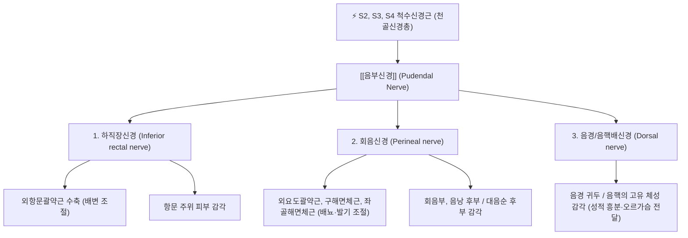
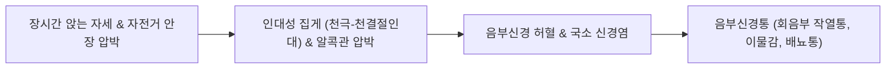

---
aliases:
  - Pudendal nerve
  - 음부신경
tags:
  - 신경
  - 골반
  - 회음부
  - 음부신경통
  - 알콕관증후군
  - 해부학
---

# ⚡ [[음부신경]] (Pudendal Nerve / 陰部神經, S2~S4)

> **핵심 3줄 요약 (Key Summary)**:
> - 🗺️ 신경 기원 & 해부학적 주행: 천골신경총 전지(S2, S3, S4)에서 기원하여, 대좌골공을 통해 골반을 빠져나와 좌골극과 천극인대를 감아 돈 뒤, 소좌골공을 통해 내폐쇄근막의 음부신경관(알콕관, Alcock's canal)으로 주행.
> - 🎯 운동 지배(근육군) & 감각 지배 영역: 외항문괄약근, 외요도괄약근, 구해면체근, 좌골해면체근 등 골반저 근육군의 운동 지배 및 회음부, 외음부, 음경/음핵, 항문 주위의 체성 감각 총괄.
> - ⚠️ 호발 포착 부위 & 관련 임상 질환: 천극인대-천결절인대 간극(인대성 집게) 및 알콕관(Alcock's canal) 포착에 의한 [[음부신경통]](Pudendal Neuralgia), 만성 골반통증증후군(CPPS), 이상근 증후군 동반 골반통.
> - 🔍 주요 이학적 검사 & 신경학적 징후: 좌골결절 내측 압통 및 틴넬 징후, 낭트 진단 기준(Nantes criteria: 앉을 때 악화, 변기 시트나 서 있을 때 완화, 감각 결손 없음).

---

## 📌 목차
1. [신경 기원 & 해부학적 분지 경로 (Anatomy & Course)](#1-신경-기원--해부학적-분지-경로-anatomy--course)
2. [신경 지배 맵 & 기능 네트워크 (Innervation Map)](#2-신경-지배-맵--기능-네트워크-innervation-map)
3. [호발 포착 부위 & 터널 증후군 병태생리](#3-호발-포착-부위--터널-증후군-병태생리)
4. [손상 레벨별 임상 증상 & 신경학적 결손](#4-손상-레벨별-임상-증상--신경학적-결손)
5. [관련 이학적 검사 & 신경 감별 매트릭스](#5-관련-이학적-검사--신경-감별-매트릭스)
6. [한의 신경 치료 프로토콜 (약침·침도·신경수기)](#6-한의-신경-치료-프로토콜-약침침도신경수기)
7. [💡 사용자 진료실 핵심 필기 & 임상 팁 (원문 보존)](#7--사용자-진료실-핵심-필기--임상-팁-원문-보존)
8. [출처 및 학술 참고 문헌 (References)](#8-출처-및-학술-참고-문헌-references)

---

## 1. 신경 기원 & 해부학적 분지 경로 (Anatomy & Course)

![[요골반 추나-20240913201018882.png|400]]
> [그림 1] 천골(Sacrum) 및 좌골결절, 골반저 인대 복합체와 [[음부신경]]의 해부학적 통로

![[요골반 추나-20240926095045472.png|400]]
> [그림 2] 이상근 하공 및 천결절인대, 천극인대 사이를 통과하는 음부신경의 삼차원 주행

![[요골반 추나-20240926095559797.png|400]]
> [그림 3] 골반저 근막과 내폐쇄근막의 음부신경관(알콕관, Alcock's canal) 내부 구조

* **신경 기원 (Spinal Origin)**:
  * 천골신경총(Sacral plexus)의 전지인 제2, 제3, 제4 천골신경(S2, S3, S4)에서 기원합니다.
  * 소변, 대변 및 성기능의 수의적 조절을 담당하는 핵심 신경으로, *"S2, 3, 4 keeps the pee and poop off the floor"*라는 의학 격언으로 대표됩니다.
* **골반 탈출 및 재진입 경로 (Pelvic Exit & Re-entry)**:
  * 골반 내에서 합쳐진 단일 신경 줄기는 [[이상근]](Piriformis) 하연의 대좌골공(Greater sciatic foramen)을 통해 골반강 밖으로 빠져나옵니다.
  * 둔부에서 매우 짧은 구간(약 1~2cm)을 노출하며 **좌골극(Ischial spine)과 천극인대(Sacrospinous ligament)의 후방을 바깥에서 안쪽으로 감아 돕니다**.
  * 직후 천결절인대(Sacrotuberous ligament) 심부를 지나 소좌골공(Lesser sciatic foramen)을 통해 다시 골반 내강(회음부)으로 재진입합니다.
* **음부신경관 (Alcock's Canal) 주행**:
  * 소좌골공을 통과한 신경은 좌골항문와(Ischioanal fossa) 외측벽에 위치한 **[[내폐쇄근]](Obturator internus) 근막이 두 겹으로 갈라지며 형성하는 섬유성 터널인 음부신경관(알콕관, Pudendal canal)** 내부로 진입합니다.
  * 이곳에서 내음부동정맥(Internal pudendal vessels)과 함께 주행하며 주요 3대 종말가지로 분지합니다.

---

## 2. 신경 지배 맵 & 기능 네트워크 (Innervation Map)

### 1) 3대 종말가지 및 운동/감각 기능
* **하직장신경 (Inferior Rectal Nerve)**:
  * **운동**: 외항문괄약근(External anal sphincter) 및 항문거근 일부 지배 (배변 참기 기능).
  * **감각**: 빗살선(Pectinate line) 하방의 항문관 점막 및 항문 주위 피부 감각.
* **회음신경 (Perineal Nerve)**:
  * **운동**: 외요도괄약근(External urethral sphincter), 구해면체근(Bulbospongiosus), 좌골해면체근(Ischiocavernosus), 회음천횡근(Superficial transverse perineal) 지배 (소변 참기 및 사정/발기 유지).
  * **감각**: 회음부 피부, 남성의 음낭 후부 피부, 여성의 대음순 후부 피부 감각.
* **음경배신경 / 음핵배신경 (Dorsal Nerve of Penis/Clitoris)**:
  * 비뇨생식격막을 관통하여 음경/음핵의 배면으로 주행하는 순수 감각 신경.
  * 음경 귀두(Glans penis)와 음핵(Clitoris)의 촉각 및 성적 쾌감 감각을 척수로 전달하는 핵심 경로.

---

## 3. 호발 포착 부위 & 터널 증후군 병태생리

* **제1 포착 터널: 인대성 집게 (Ligamentous Clamp - 천극인대 vs 천결절인대)**:
  * 좌골극을 지날 때 음부신경은 앞쪽의 천극인대와 뒤쪽의 천결절인대 사이에 끼어 가위처럼 압박을 받습니다.
  * 골반의 회전 비틀림, 천장관절 기능부전, 골반저 긴장증이 있을 때 인대 간극이 좁아지며 가장 빈번하게 포착됩니다.
* **제2 포착 터널: 알콕관 (Alcock's Canal - 음부신경관)**:
  * 내폐쇄근막이 두꺼워져 형성된 알콕관 내부에서 신경이 갇힙니다.
  * 좁고 딱딱한 자전거 안장에 장시간 앉아 체중이 회음부에 직접 실리거나(Cyclist's syndrome), 사무직 환자가 단단한 의자에 오래 앉아 있을 때 내폐쇄근 경련과 함께 신경이 압박됩니다.
* **제3 포착 터널: 겸상돌기 (Falciform Process) 하부**:
  * 천결절인대의 겸상돌기 아래를 지날 때 인대의 골화 또는 섬유성 비후에 의해 신경이 눌립니다.

---

## 4. 손상 레벨별 임상 증상 & 신경학적 결손

| 질환 / 장애 유형 | 주요 임상 증상 | 악화 / 완화 요인 | 호발 원인 |
| :--- | :--- | :--- | :--- |
| **[[음부신경통]] (Pudendal Neuralgia)** | 회음부, 항문, 외음부, 음경/음핵의 타는 듯한 작열통(Burning pain), 전기가 통하는 찌릿함, "항문이나 요도에 골프공이 끼어 있는 듯한 이물감" | **앉을 때 극심하게 악화**, 서 있거나 누우면 완화, **변기 시트(가운데가 뚫린 좌대)에 앉으면 통증 소실** | 자전거 라이딩, 장시간 좌식 생활, 출산 손상, 골반 낙상 |
| **만성 골반통증증후군 (CPPS)** | 회음부 둔통, 사정통, 배뇨통, 고환통, 골반저 근육 경련 | 스트레스, 사정 후, 소변 참을 때 악화 | 골반저 근육 긴장 및 음부신경 미세 신경염 |
| **신경성 배뇨·배변 장애** | 요실금, 변실금, 배뇨 후 잔뇨감, 항문 조임력 약화 | 복압 상승 시 악화 | 분만 중 신경 견인 손상, 척수 마미총 병변 |

---

## 5. 관련 이학적 검사 & 낭트 진단 기준 (Nantes Criteria)

### 5.1 낭트 기준 (Nantes Criteria - 음부신경통 확진 5대 필수 요건)
1. **해부학적 통증 부위**: 음부신경 지배 영역(항문에서 음핵/음경 사이의 회음부)에 국한된 통증.
2. **자세에 따른 통증 양상**: **앉을 때 현저하게 악화됨 (Worse with sitting)**.
3. **수면 중 양호**: 밤에 자다가 통증으로 깨지 않음 (Night pain absent).
4. **객관적 감각 결손 없음**: 단순 신경통 단계에서는 임상적 감각 마비가 없음.
5. **진단적 신경 차단 양성**: 리도카인을 이용한 음부신경 차단술 시 즉각적인 통증 소실.

### 5.2 진료실 이학적 유발 검사
* **알콕관 압통 유발 검사 (Alcock's Sign)**:
  * 환자를 쇄석위 또는 측와위로 눕히고 좌골결절(Ischial tuberosity) 바로 내측을 깊숙이 촉진하여 압박했을 때 회음부나 외음부로 뻗치는 극심한 통증 재현.
* **질/직장 수기 촉진 검사**:
  * 직장 수지 검사(DRE) 시 좌골극(Ischial spine) 부위를 누르면 환자가 비명을 지를 정도의 통증(Tinel's sign) 재현.

---

## 6. 한의 신경 치료 프로토콜 (약침·침도·신경수기)

### 6.1 알콕관 및 천결절인대 포착 해제 약침술
* **자침 타겟 및 랜드마크**:
  * 앙와위 또는 복와위에서 좌골결절(Ischial tuberosity) 내측 1.5~2.0cm, 항문 외측 3cm 지점(알콕관 입구).
* **약침 제제 및 주입 기법**:
  * 중성어혈약침, 신바로약침 또는 저농도 봉약침 1.0~2.0cc 사용.
  * 30G 30mm 주사기를 좌골결절 내측 골막을 스치며 전내측(내폐쇄근막 방향)으로 20~25mm 자입하여 저항이 소실되는 결합조직 공간에 약침액을 주입(수압박리).

### 6.2 침도 치료 (Acupotomy)를 통한 천결절인대 유리술
* 천결절인대의 좌골결절 부착부 비후 조직을 침도로 종방향 절개하여 인대성 집게의 압박 장력을 낮춥니다 (직장 및 대혈관 손상 방지를 위해 골막에 닿은 상태에서만 미세 절개).

### 6.3 골반저 이완 추나 요법 (Pelvic Floor Tuina)
* 환자의 천장관절(SI joint) 변위를 교정하고, 장골의 후하방 회전을 전상방으로 정렬하여 천극인대와 천결절인대의 과긴장을 해소합니다.
* [[이상근]] 및 대둔근 심부의 허혈성 압박 이완술을 병행합니다.

---

## 7. 💡 사용자 진료실 핵심 필기 & 임상 팁 (원문 보존)

### 7.1 진료실 3대 핵심 문진 및 감별 포인트
1. **변기 시트(Donut cushion) 문진**:
   * "의자에 앉으면 아픈데, 가운데가 뚫린 변기에 앉거나 도넛 방석에 앉으면 통증이 덜합니까?" (이 문진에 "그렇다"고 답하면 95% 이상 음부신경통 확진).
2. **비뇨기과/산부인과 검사 음성 환자**:
   * 소변 검사, 전립선액 검사, 질염 검사에서 아무런 균이나 염증이 없는데도 회음부가 화끈거리고 소변볼 때 아프다고 호소하는 환자는 방광염/전립선염이 아닌 **음부신경 포착증**입니다.
3. **자전거 안장 및 자세 교정 티칭**:
   * 치료 기간 동안 자전거 라이딩 절대 금지, 푹신한 도넛 방석 사용, 50분 착석 후 10분 기립 스트레칭 지도.

---

## 8. 출처 및 학술 참고 문헌 (References)

* Labat JJ, Riant T, Robert R, Amarenco G, Lefaucheur JP, Rigaud J. Diagnostic criteria for pudendal neuralgia by pudendal nerve entrapment (Nantes criteria). *Neurourol Urodyn*. 2008;27(7):667-73. [PMID: 17828787](https://pubmed.ncbi.nlm.nih.gov/17828787/) | [DOI: 10.1002/nau.20505](https://doi.org/10.1002/nau.20505)
  * `[연구 요약]` 음부신경통 진단의 전 세계 표준으로 사용되는 '낭트 기준(Nantes criteria)'을 정립한 랜드마크 논문으로, 착석 시 악화, 야간 통증 부재, 변기 시트 완화 등의 5대 필수 진단 지표를 확립.

* Mulayim B, Mulayim S. Pudendal nerve entrapment at the level of sacrospinous ligament or Alcock's canal; laparoscopic management. *Obstet Gynecol Sci*. 2026 Aug 20;69(4):e26396. [PMID: 42687408](https://pubmed.ncbi.nlm.nih.gov/42687408/) | [DOI: 10.5468/ogs.26396](https://doi.org/10.5468/ogs.25396)
  * `[연구 요약]` 천극인대와 알콕관 부위의 음부신경 포착에 대한 복강경 감압 수술 결과를 분석하여, 두 해부학적 터널이 음부신경 허혈성 압박의 가장 결정적인 병소임을 규명한 2026년 최신 연구.

* Okoye J, Hamid Mohammed MI, Subhedar D, et al. Pudendal Nerve Entrapment Within Alcock's Canal as a Compartment-Like Syndrome: A Systematic Review. *Cureus*. 2026 Jul;18(7):e112846. [PMID: 42605488](https://pubmed.ncbi.nlm.nih.gov/42605488/) | [DOI: 10.7759/cureus.112846](https://doi.org/10.7759/cureus.112846)
  * `[연구 요약]` 알콕관 내 음부신경 포착을 근막 구획증후군(Compartment-like syndrome)의 관점에서 재해석하고, 비수술적 중재술(수압박리술, 신경차단술)의 임상적 치료 알고리즘을 제시한 최신 메타분석.

* Catheter-Based Sacral Nerve Block Versus Pudendal Nerve Block in the Treatment of Pudendal Neuralgia: A Randomized Double-Blinded Controlled Trial. *Eur J Pain*. 2026 Aug;30(8):e70355. [PMID: 42559665](https://pubmed.ncbi.nlm.nih.gov/42559665/) | [DOI: 10.1002/ejp.70355](https://doi.org/10.1002/ejp.70355)
  * `[연구 요약]` 난치성 음부신경통 환자 120명을 대상으로 천골 신경 차단과 말초 음부신경 수압 차단의 유효성을 비교한 무작위 이중맹검 RCT로, 신경 주위 국소 감압술의 통증 완화 지속성을 검증.
