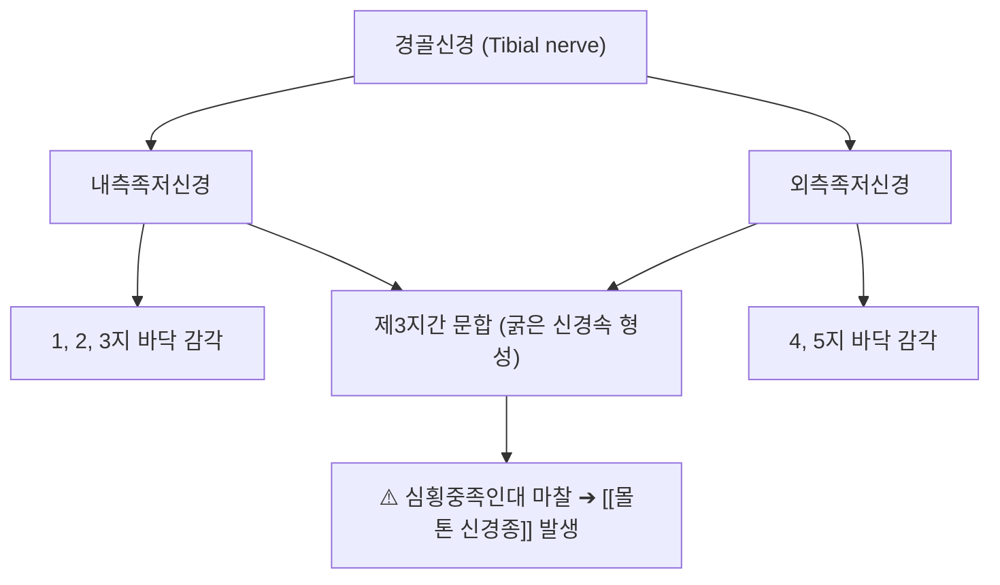

# ⚡ [[지간신경]] (Interdigital Nerve / 指間神經, L4-S2)

> **핵심 3줄 요약 (Key Summary)**:
> - 🗺️ 신경 기원 & 해부학적 주행: 경골신경 말초 분지인 내측·외측 족저신경(Plantar nerves) 기원, 중족골두(Metatarsal head) 사이 심횡중족인대(Deep transverse metatarsal ligament) 하단을 지나 발가락으로 주행.
> - 🎯 운동 지배(근육군) & 감각 지배 영역: 순수 감각 신경. 제1~5 발가락 바닥면 및 발가락 마디 피부 감각 지배.
> - ⚠️ 호발 포착 부위 & 관련 임상 질환: 제3-4 중족골두 사이 지간강, [[몰톤 신경종]](Morton's Neuroma / 지간신경종, 걸을 때 자갈을 밟는 듯한 앞발바닥 통증), 중족골통.
> - 🔍 주요 이학적 검사 & 신경학적 징후: 멀더 클릭 검사(Mulder's sign, 중족골 횡압박 시 딸깍 소리와 통증), 중족골간 압통 검사.

---

## 📌 목차
1. [신경 기원 & 해부학적 분지 경로 (Anatomy & Course)](#1-신경-기원--해부학적-분지-경로-anatomy--course)
2. [신경 지배 맵 & 기능 네트워크 (Innervation Map)](#2-신경-지배-맵--기능-네트워크-innervation-map)
3. [호발 포착 부위 & 터널 증후군 병태생리](#3-호발-포착-부위--터널-증후군-병태생리)
4. [손상 레벨별 임상 증상 & 신경학적 결손](#4-손상-레벨별-임상-증상--신경학적-결손)
5. [관련 이학적 검사 & 신경 감별 매트릭스](#5-관련-이학적-검사--신경-감별-매트릭스)
6. [한의 신경 치료 프로토콜 (약침·침도·신경수기)](#6-한의-신경-치료-프로토콜-약침침도신경수기)
7. [💡 사용자 진료실 핵심 필기 & 임상 팁 (원문 보존)](#7--사용자-진료실-핵심-필기--임상-팁-원문-보존)
8. [출처 및 학술 참고 문헌 (References)](#8-출처-및-학술-참고-문헌-references)

---

## 1. 신경 기원 & 해부학적 분지 경로 (Anatomy & Course)

![[지간신경-족저신경분지-Gray833.png|420]]
> [그림 1] 내측 및 외측 족저신경에서 갈라져 중족골두 사이를 지나 발가락으로 뻗는 [[지간신경]]의 족저 해부도 (출처: Gray's Anatomy)

* **신경 기원 (Origin & Spinal Segments)**:
  * 경골신경(Tibial nerve)이 족근관을 통과한 후 갈라지는 **내측족저신경(Medial plantar nerve)**과 **외측족저신경(Lateral plantar nerve)**의 총족저지신경(Common plantar digital nerves)에서 유래합니다.
* **상세 주행 경로**:
  1. 족저근막 심부의 중족골간 공간을 따라 전방으로 주행합니다.
  2. 중족골두 부근에서 **심횡중족인대(Deep transverse metatarsal ligament, DTML)**의 바로 아래쪽(발바닥 쪽)을 통과합니다.
  3. 제3-4 중족골 사이에서 내측족저신경의 분지와 외측족저신경의 분지가 합류하여 문합 신경을 형성합니다 (이로 인해 제3지간신경이 가장 굵고 포착에 취약).
  4. 발가락 갈림길에서 고유족저지신경(Proper plantar digital nerves)으로 나뉘어 인접한 발가락 양쪽 측면으로 주행합니다.

---

## 2. 신경 지배 맵 & 기능 네트워크 (Innervation Map)

![[몰톤신경종_지간신경_발생부위_도해.jpg|420]]
> [그림 2] 제3-4 중족골두 사이 심횡중족인대 아래에서 발생하는 몰톤 신경종의 해부학적 발생 부위

---

## 3. 호발 포착 부위 & 터널 증후군 병태생리

![[지간신경-몰톤신경종-모식도.jpg|400]]
> [그림 3] 심횡중족인대 아래에서 신경이 반복 압박되어 방추형으로 비후된 몰톤 신경종의 병태 단면

* **심횡중족인대(DTML) 하방 마찰 터널**:
  * 좁은 볼의 구두나 하이힐을 착용하면 중족골두들이 서로 맞부딪히며 인대 아래의 지간신경을 강하게 짓누릅니다.
  * 신경내막의 반복된 기계적 마찰로 신경초 섬유화(Perineural fibrosis)와 신경종성 비후가 발생합니다.

---

## 4. 손상 레벨별 임상 증상 & 신경학적 결손

* 셋째·넷째 발가락 바닥이 화끈거리고 저림, "신발 속에 자갈이나 모래알이 들어있는 것 같다"고 호소, 맨발로 딱딱한 바닥을 디딜 때 심한 작열통.

---

## 5. 관련 이학적 검사 & 신경 감별 매트릭스

* **멀더 징후 (Mulder's Click Sign)**:
  * 검사자가 한 손으로 환자의 중족골두 양측을 안쪽으로 쥐어짜듯 모으면서, 다른 손 엄지로 제3-4 중족골 사이 발바닥을 누를 때 뼈 사이에서 신경종이 튕기며 '딸깍'하는 소리와 함께 극통이 유발되면 양성.

---

## 6. 한의 신경 치료 프로토콜 (약침·침도·신경수기)

* **지간 인대 침도 절개술**:
  * 발등 쪽에서 제3-4 중족골 사이로 침도를 진입시켜 신경을 누르고 있는 심횡중족인대의 전방 섬유를 미세 절개하여 감압합니다.
* **팔풍혈(EX-LE10) 약침 치료**:
  * 해당 발가락 갈림길 팔풍혈에 황련해독탕 약침 0.3cc를 주입하여 국소 신경 부종을 가라앉힙니다.
* **발 횡아치 테이핑 및 지간 패드 처방**:
  * 중족골두 후방에 패드를 거치하여 횡아치를 복원시킵니다.

---

## 7. 💡 사용자 진료실 핵심 필기 & 임상 팁 (원문 보존)

* **"양말이 뭉쳐있는 것 같아요" - 몰톤 신경종의 전형적 증상**:
  * 발바닥 앞쪽이 아픈 환자가 신발을 벗고 손으로 발가락을 쥐어짜며 주무르면 통증이 일시적으로 편해진다고 말하면 족저근막염이 아니라 100% 지간신경종(몰톤 신경종)입니다.
  * 멀더스 클릭으로 제3지간을 확인하고 앞볼이 넓은 신발과 맞춤 인솔을 즉시 착용하도록 지도해야 합니다.

---

## 8. 출처 및 학술 참고 문헌 (References)

* Ruiz-Santiago, F., et al. (2025). "Anatomical Validation of a Selective Anesthetic Block Test to Differentiate Morton's Neuroma from Mechanical Metatarsalgia." *Reports*, 8(4), 62. [PMID: 41133552](https://pubmed.ncbi.nlm.nih.gov/41133552/)
  - [연구 요약]: 지간신경 선택적 마취 차단을 통한 몰톤 신경종과 기계적 중족골통의 해부학적 감별 진단 검증.
* Bignotti, B., et al. (2024). "A Characteristic Magnetic Resonance Imaging Finding to Identify Morton Neuroma: The Slug Sign." *Foot & Ankle Orthopaedics*, 9(3), 24730114241265890. [PMID: 39193453](https://pubmed.ncbi.nlm.nih.gov/39193453/)
  - [연구 요약]: MRI 상 심횡중족인대 하방 지간신경의 방추형 비후를 진단하는 핵심 영상학적 특징 규명.
* Beggs, I. (2024). "Sonographic anatomy and technique to image the plantar digital nerves and aid identification of a Morton's neuroma." *Ultrasound*, 32(2), 98-105. [PMID: 38694832](https://pubmed.ncbi.nlm.nih.gov/38694832/)
  - [연구 요약]: 족저지간신경의 고해상도 초음파 주행로 영상화 기법 및 신경종 중재술 가이드라인 제시.
