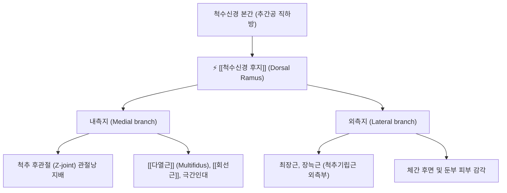

---
aliases:
  - 척수신경 후지
  - 척수신경 등쪽가지
  - Dorsal ramus
  - Posterior ramus
  - Dorsal rami of spinal nerves
tags:
  - 신경
  - 척추
  - 후관절
  - 다열근
  - 협척혈
  - 해부학
---

# ⚡ [[척수신경 후지]] (Dorsal Ramus of Spinal Nerve, 후지, 등쪽가지)

> **핵심 요약 (Key Summary)**:
> 척수신경(Spinal nerve)이 추간공(IVF)을 빠져나온 직후 분지하여 척추 후방으로 향하는 혼합 말초신경 가지
> 내측지(Medial branch)와 외측지(Lateral branch)로 나뉘어 척추 후관절(Facet joint) 피막, [[다열근]], [[회선근]], 척추기립근 및 체간 배부 피부 감각을 전담 지배
> 척추 후관절 증후군(Facet syndrome) 및 만성 축성 요통의 핵심 통증 전달 경로이자 한의학적 협척혈(夾脊穴) 침구·도침 치료의 해부학적 표적

---

## 📌 목차
1. [해부학적 기시 및 분지 경로 (Anatomy & Course)](#1-해부학적-기시-및-분지-경로-anatomy--course)
2. [내측지 vs 외측지 지배 영역 (Medial vs Lateral Branches)](#2-내측지-vs-외측지-지배-영역-medial-vs-lateral-branches)
3. [부위별 특수 후지 신경 (Specialized Dorsal Rami)](#3-부위별-특수-후지-신경-specialized-dorsal-rami)
4. [임상 질환 & 신경 포착 병증 (Clinical Conditions)](#4-임상-질환--신경-포착-병증-clinical-conditions)
5. [협척혈(夾脊穴) 침구·도침 치료 및 중재술 연계](#5-협척혈夾脊穴-침구도침-치료-및-중재술-연계)
6. [출처 및 학술 참고 문헌 (References)](#6-출처-및-학술-참고-문헌-references)

---

## 1. 해부학적 기시 및 분지 경로 (Anatomy & Course)

- **기시**:
  - 척수 전근(운동)과 후근(감각)이 합쳐져 형성된 척수신경 본간(Spinal nerve trunk)이 척추간공(Intervertebral foramen, IVF)을 통과한 직후 분기.
  - 전방으로 주행하여 신경총(완신경총, 요천추신경총) 및 늑간신경을 형성하는 **전지(Ventral/Anterior ramus)**에 비해 굵기가 얇음.
- **주행**:
  - 횡돌기(Transverse process) 사이의 추간횡돌기인대(Intertransverse ligament) 상부 또는 골간구를 감아 후방으로 주행.
  - 상관절돌기(SAP)와 횡돌기 접합부(요추 기준 Mamillo-accessory ligament 하방 골간구)를 지나며 **내측지(Medial branch)**와 **외측지(Lateral branch)**로 분기.

---

## 2. 내측지 vs 외측지 지배 영역 (Medial vs Lateral Branches)

### 1) 내측지 (Medial Branch) — 척추 안정성 및 후관절 통증의 핵심
* **운동 지배**: 척추 심부 고유근군인 [[다열근]](Multifidus), 회선근(Rotatores), 극간근(Interspinales).
* **감각 지배**:
  * 척추 후관절(Zygapophysial joint / Facet joint)의 관절낭 및 극간인대, 황색인대 후면.
  * **이중 신경 지배 (Dual innervation)**: 특정 분절의 후관절은 동측 해당 분절의 내측지와 바로 위 분절 내측지 등 최소 2개 이상의 척수신경 후지 분지로부터 이중 지배를 받음 (예: L4-L5 후관절은 L3 및 L4 내측지의 동시 지배).

### 2) 외측지 (Lateral Branch)
* **운동 지배**: [[장늑근]](Iliocostalis), [[최장근]](Longissimus) 등 척추기립근의 표층·외측부.
* **감각 지배**: 등과 허리의 후외측 피부 감각.

---

## 3. 부위별 특수 후지 신경 (Specialized Dorsal Rami)

* **제1경신경(C1) 후지**: [[후두하신경]](Suboccipital nerve)
  * 피하지각 분지가 없는 순수 운동신경으로, 후두하삼각을 구성하는 [[대후두직근]], [[소후두직근]], [[상두사근]], [[하두사근]]을 전담 지배.
* **제2경신경(C2) 후지 내측지**: [[대후두신경]](Greater occipital nerve, GON)
  * 하두사근 하연을 감아 돌고 두반극근과 승모근 건막을 관통하여 후두부~두정부 두피 감각을 지배하며, 포착 시 극심한 후두신경통 및 [[경추성 두통]] 유발.
* **제3경신경(C3) 후지 내측지**: [[제3후두신경]](Third occipital nerve, TON)
  * C2-C3 후관절을 감싸며 후두하부 정중선 피부 감각 지배.
* **상부 요신경(L1~L3) 후지 외측지**: 상둔피신경(Superior cluneal nerve)
  * 요배건막을 뚫고 장골능(Iliac crest)을 넘어 둔부 상부 피부 감각을 지배하며, 장골능 부위에서 포착 시 요둔부 가성 좌골신경통 유발.

---

## 4. 임상 질환 & 신경 포착 병증 (Clinical Conditions)

### 1) 척추 후관절 증후군 (Facet Joint Syndrome)
* 후관절의 퇴행성 마모, 관절낭 비후, 활막 감돈으로 인해 후지 내측지가 기계적·화학적으로 자극되어 발생.
* 허리를 뒤로 젖히거나(신전) 회전할 때 요통이 악화되며, 둔부 및 대퇴 후면으로 방사통(비근원성 연관통) 유발.

### 2) 다열근 위축 및 만성 축성 요통
* 후지 내측지 손상 또는 지속적 신경병증성 압박은 지배 근육인 [[다열근]]의 지방 침윤(Fatty infiltration)과 급격한 근위축을 초래하여 척추 분절 불안정성을 가속화.

---

## 5. 협척혈(夾脊穴) 침구·도침 치료 및 중재술 연계

* **협척혈(華佗夾脊穴)의 해부학적 실체**:
  * 척추 극돌기 하연 외측 0.5촌(요추는 약 1~1.5cm 외측)에 위치하는 협척혈 자침 시, 침첨이 다열근을 관통하여 횡돌기 기저부 골면에 닿으며 척수신경 후지 내측지 바로 인접 부위에 도달.
* **도침(Acupotomy) 치료**:
  * 유양돌기-횡돌기 간 인대(Mamillo-accessory ligament) 비후 및 골간구 섬유화로 인한 후지 내측지 포착부를 미세 박리하여 만성 난치성 요통을 근원적으로 해소.
* **전침 요법**: 협척혈 간 저주파(2Hz) 전침 통전으로 다열근의 율동적 수축을 유도하고 척수 후각 내 아편계 펩타이드 방출을 촉진하여 통증 억제.

---

## 6. 출처 및 학술 참고 문헌 (References)
* Bogduk N. *Clinical and Radiological Anatomy of the Lumbar Spine*. 5th ed. Churchill Livingstone; 2012.
  - [연구 요약]: 척수신경 후지 내측지의 상세 주행 궤적, 후관절 이중 신경 지배 원리 및 요통 발생 병태생리 정립.
* Cohen SP, Raja SN. Pathogenesis, diagnosis, and treatment of lumbar zygapophysial (facet) joint pain. *Anesthesiology*. 2007;106(3):591-614.
  - [연구 요약]: 척수신경 후지 내측지 차단술(MBB)의 신경해부학적 기초 및 후관절통의 임상 진단 지침.
* 한방척추신경추수의학회. *추나요법 의학*. 제3판. 군자출판사; 2017.
  - [연구 요약]: 척수신경 후지와 척추 심부 안정화 근육(다열근, 회선근)의 연계 및 협척혈 자침의 신경생리학적 효과 규명.
