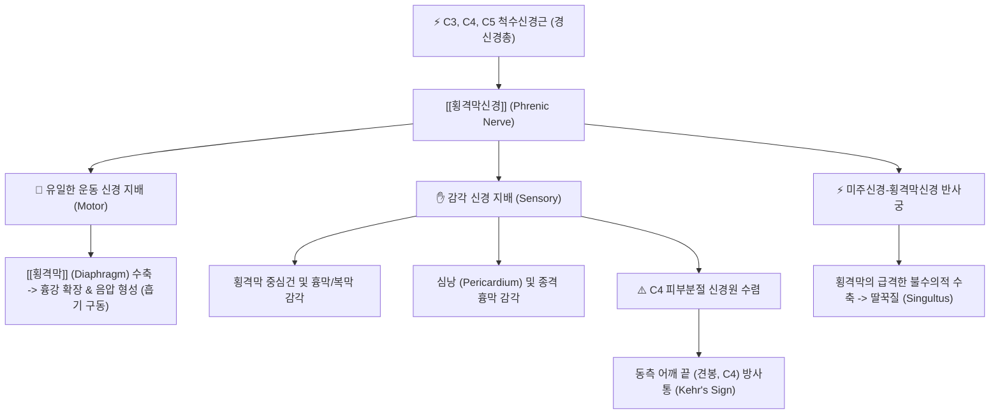
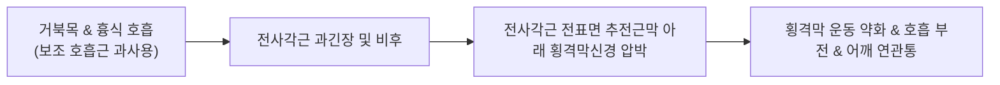

---
aliases:
  - Phrenic nerve
  - 횡격막신경
  - 횡격신경
tags:
  - 신경
  - 경신경총
  - 호흡기
  - 사각근
  - 흉곽출구증후군
  - 해부학
---

# ⚡ [[횡격막신경]] (Phrenic Nerve / 橫膈神經, C3~C5)

> **핵심 3줄 요약 (Key Summary)**:
> - 🗺️ 신경 기원 & 해부학적 주행: C3~C5 척수신경 전지(주로 C4)에서 기원하여, [[전사각근]] 전표면을 비스듬히 가로질러 하행한 뒤 쇄골하혈관 사이를 통과하여 종격동 심막 외측을 지나 횡격막 중심건으로 주행.
> - 🎯 운동 지배(근육군) & 감각 지배 영역: [[횡격막]](Diaphragm)의 유일한 운동 신경 지배(인간 호흡의 핵심 동력) 및 심막, 종격흉막, 횡격막 중심부 복막의 감각 관할, C4 피부분절 수렴으로 인한 동측 견봉(어깨 끝) 연관통(Kehr's sign) 형성.
> - ⚠️ 호발 포착 부위 & 관련 임상 질환: 전사각근 비후 및 경추 불안정성에 의한 횡격막신경 포착, [[흉곽출구 증후군]] 수술 합병증에 따른 횡격막 마비, 난치성 딸꾹질(Singultus).
> - 🔍 주요 이학적 검사 & 신경학적 징후: 경부 압박 시 동측 어깨 끝 방사통, 흡기 시 역행성 복부 함몰(Paradoxical breathing), 흉부 X-ray상 환측 횡격막 거상.

---

## 📌 목차
1. [신경 기원 & 해부학적 분지 경로 (Anatomy & Course)](#1-신경-기원--해부학적-분지-경로-anatomy--course)
2. [신경 지배 맵 & 기능 네트워크 (Innervation Map)](#2-신경-지배-맵--기능-네트워크-innervation-map)
3. [호발 포착 부위 & 터널 증후군 병태생리](#3-호발-포착-부위--터널-증후군-병태생리)
4. [손상 레벨별 임상 증상 & 신경학적 결손](#4-손상-레벨별-임상-증상--신경학적-결손)
5. [관련 이학적 검사 & 신경 감별 매트릭스](#5-관련-이학적-검사--신경-감별-매트릭스)
6. [한의 신경 치료 프로토콜 (약침·침도·신경수기)](#6-한의-신경-치료-프로토콜-약침침도신경수기)
7. [💡 사용자 진료실 핵심 필기 & 임상 팁 (원문 보존)](#7--사용자-진료실-핵심-필기--임상-팁-원문-보존)
8. [출처 및 학술 참고 문헌 (References)](#8-출처-및-학술-참고-문헌-references)

---

## 1. 신경 기원 & 해부학적 분지 경로 (Anatomy & Course)

![[사각근-1753860136634.png|400]]
> [그림 1] [[전사각근]] 전표면을 비스듬히 가로지르는 [[횡격막신경]]의 경부 주행 경로

![[사각근-20240727213249887.png|400]]
> [그림 2] 경추 횡돌기에서 기원하는 사각근군과 [[상완신경총]], [[횡격막신경]]의 해부학적 관계

![[횡격막과 갈비 형태-20240825222204402.png|400]]
> [그림 3] 흉곽 입구와 [[횡격막]] 돔(Dome), 횡격막신경 종말가지의 중심건 분포

* **신경 기원 (Origin & Spinal Segments)**:
  * 제3, 제4, 제5 경신경(C3, C4, C5) 척수신경 전지(Anterior rami)의 복합 기원입니다.
  * 의학 격언 *"C3, 4, 5 keeps the diaphragm alive"*로 유명하며, 이 중 **C4 신경근이 주된 기여(Main contributor)**를 담당합니다. 약 10~30%의 인구에서는 C5 또는 쇄골하신경에서 기원하는 부횡격막신경(Accessory phrenic nerve)이 동반됩니다.
* **경부 주행 경로 (Cervical Course)**:
  * 경신경총의 심부 운동 가지로 형성되어, 흉쇄유돌근 심부에서 **[[전사각근]](Scalenus anterior)의 앞면(Anterior surface)을 비스듬히 가로질러 외측 상방에서 내측 하방으로 하행**합니다.
  * 이때 전사각근을 덮고 있는 추전근막(Prevertebral fascia) 바로 아래에 단단히 밀착되어 주행하므로, 전사각근의 비후나 단축에 직접적인 영향을 받습니다.
* **흉곽 입구 및 종격동 주행 경로 (Thoracic Course)**:
  * 쇄골하정맥(Subclavian vein)의 후방, 쇄골하동맥(Subclavian artery)의 전방 사이를 통과하여 제1늑골 내측을 지나 흉곽 입구로 진입합니다.
  * 종격동(Mediastinum) 내부로 진입하여 심막횡격막동맥(Pericardiacophrenic artery)과 나란히 주행하며, 심막(Pericardium)과 종격늑막 사이의 좁은 홈을 따라 심장 양측면을 감싸며 하행합니다.
* **횡격막 종말 분지 (Diaphragmatic Termination)**:
  * 좌우 횡격막신경은 각각 해당 측 횡격막의 중심건(Central tendon) 상면에 도달하여 전방지, 외측지, 후방지로 방사상 분지하며, 일부 감각 섬유는 횡격막을 관통하여 하면의 복막과 간/담낭 장막으로 이어집니다.

---

## 2. 신경 지배 맵 & 기능 네트워크 (Innervation Map)

### 1) 운동 신경 지배 (Motor Function)
* **[[횡격막]](Diaphragm)의 유일한 운동 신경**:
  * 안정 시 호흡 흡기력의 75% 이상을 담당하는 핵심 호흡근입니다. 횡격막신경이 흥분하면 횡격막 돔이 평평하게 하강하면서 흉강 내 음압을 만들어 폐로 공기가 유입됩니다.

### 2) 감각 신경 지배 및 연관통 (Sensory & Kehr's Sign)
* **내장 감각 영역**: 횡격막의 중심부 건막 및 흉막, 심낭(Pericardium), 간과 담낭을 덮는 장막하 복막의 통각 관할.
* **어깨 연관통 (Kehr's Sign)**:
  * 횡격막 중심부나 심낭, 담낭의 염증 신호는 횡격막신경을 타고 경수 C3~C5 후각으로 들어옵니다.
  * 이곳에서 쇄골상신경(C3-C4)의 체성 감각 신경원과 수렴(Convergence)하여, 환자는 횡격막 질환임에도 불구하고 **동측 어깨 끝(견봉 부위)이나 쇄골 상부가 뻐근하고 쑤시는 연관통(Referred pain)**을 강하게 호소합니다.

---

## 3. 호발 포착 부위 & 터널 증후군 병태생리

* **제1 포착 터널: [[전사각근]] 전표면 및 추전근막 (Prevertebral Fascia)**:
  * 만성 스트레스, 입호흡, 거북목 환자는 횡격막 대신 사각근과 흉쇄유돌근을 과도하게 사용하는 비효율적인 상흉식 호흡을 반복합니다.
  * 이로 인해 전사각근이 단축·비후되면, 전사각근 앞면의 질긴 근막 사이에 끼어 있는 횡격막신경이 기계적으로 짓눌리면서 만성적인 신경 허혈이 촉발됩니다.
* **제2 포착 부위: 흉곽 입구(Thoracic Inlet) 쇄골하혈관 간극**:
  * 쇄골하정맥과 쇄골하동맥 사이를 통과할 때, 쇄골 골절 후 부정유합, 경늑골(Cervical rib), 제1늑골 기형에 의해 횡격막신경이 압박을 받습니다.

---

## 4. 손상 레벨별 임상 증상 & 신경학적 결손

| 손상/장애 유형 | 주요 임상 증상 | 신경학적·영상학적 소견 | 호발 원인 |
| :--- | :--- | :--- | :--- |
| **일측성 횡격막신경 마비 (Unilateral Paralysis)** | 평지에서는 무증상이거나 경미한 운동성 호흡곤란, 누웠을 때(앙와위) 호흡곤란 악화 | 흉부 X-ray상 환측 횡격막 비정상적 거상, 투시경 검사상 흡기 시 역행성 운동 | 경부 수술, 흉곽출구 감압술 합병증, 외상성 견인 손상 |
| **횡격막신경 자극 증후군 (Irritation)** | 동측 어깨(견봉)의 설명되지 않는 만성 통증, 쇄골상와 압통, 가슴 답답함 | 신경 전도 검사 이상, 전사각근 압박 시 어깨 통증 유발 | 전사각근 증후군, 심낭염, 횡격막하 농양 |
| **난치성 딸꾹질 (Intractable Hiccups)** | 수일~수주간 지속되는 불수의적 횡격막 연축 및 성문 폐쇄, 수면 장애 및 탈진 | 횡격막신경의 비정상적 과흥분 반사 | 뇌졸중, 위식도역류, 종격동 종양, 전사각근 포착 |

---

## 5. 관련 이학적 검사 & 신경 감별 매트릭스

| 이학적 검사명 | 검사 방법 및 유발 기전 | 양성 반응 | 관련 감별 질환 |
| :--- | :--- | :--- | :--- |
| **전사각근 횡격막신경 압박 검사** | 흉쇄유돌근 쇄골두 외측, 쇄골 상방 2~3cm 지점의 전사각근 전면을 후방으로 부드럽게 압박 | 동측 횡격막 부위 뻐근함 또는 어깨 끝(견봉)으로 찌릿한 방사통 재현 | 전사각근 증후군 및 [[횡격막신경]] 자극 |
| **역행성 복부 운동 관찰 (Paradoxical Breathing)** | 앙와위에서 깊게 숨을 들이마실 때 복부의 움직임 관찰 | 정상적인 복부 팽창 대신, 환측 복벽이 안으로 쑥 꺼지는 역행성 함몰 | 횡격막 신경 마비 |
| **스니프 검사 (Sniff Test - 투시경)** | 환자에게 코로 짧고 강하게 숨을 들이쉬게 함 | 마비된 횡격막 돔이 아래로 내려가지 않고 오히려 위로 솟구침 | 횡격막 마비 확진 검사 |

---

## 6. 한의 신경 치료 프로토콜 (약침·침도·신경수기)

### 6.1 전사각근 근막 이완을 통한 횡격막신경 감압 약침술
* **자침 타겟 및 랜드마크**:
  * 흉쇄유돌근(SCM) 쇄골두 후연, 쇄골 상방 2횡지 지점의 전사각근 체부.
* **약침 제제 및 주입 기법**:
  * 신바로약침, 중성어혈약침 또는 황련해독탕 약침 0.5~1.0cc 사용.
  * 30G 미세 주사기를 피부와 45도 각도로 진입하여 전사각근 표층 근막에 부드럽게 주입하여 근막 긴장을 이완(경동맥, 내경정맥 및 쇄골하동맥 손상 방지를 위해 반드시 박동을 촉지하고 외측에서 안전하게 접근).

### 6.2 난치성 딸꾹질의 특효 경혈 자침 프로토콜
* **격수(BL17)**: 횡격막의 배수혈로서 횡격막 경련을 즉각적으로 진정시키는 1차 특효혈.
* **찬죽(BL2)**: 삼차신경 안와상신경 자극을 통해 뇌간의 딸꾹질 중추 반사궁을 억제.
* **천돌(CV22), 내관(PC6)**: 미주신경과 횡격막신경의 과도한 연축을 동시 차단.

### 6.3 횡격막 도수 이완 추나 (Diaphragm Manual Release)
* 환자를 무릎을 세운 앙와위로 눕히고, 시술자는 환자의 하부 늑골연(제7~10늑연골) 하부에 양손 손가락을 접촉합니다.
* 환자가 호흡을 천천히 내쉴 때 손가락을 늑골하부 후상방으로 부드럽게 밀어 넣고, 들이쉴 때 저항을 주며 횡격막 근섬유를 스트레칭하여 횡격막 돔의 정상 운동성을 회복시킵니다.

---

## 7. 💡 사용자 진료실 핵심 필기 & 임상 팁 (원문 보존)

### 7.1 진료실 3대 핵심 문진 및 감별 포인트
1. **어깨 질환으로 오인되는 담낭/횡격막 질환 감별**:
   * "오른쪽 어깨 끝이 결리고 쑤시는데, 기름진 음식을 먹고 나면 더 심해지거나 소화가 안 됩니까?" (담낭염/횡격막 자극으로 인한 횡격막신경 매개 Kehr's sign 감별).
2. **원인 불명의 만성 호흡곤란 및 불안장애 환자**:
   * 공황장애나 심장 질환 검사에서 이상이 없는데 숨이 깊게 안 쉬어진다는 환자는 거북목과 전사각근 단축으로 인한 횡격막신경 기능 저하가 원인인 경우가 많습니다.
3. **목 부위 자침 시 횡격막신경 및 기흉 안전 수칙**:
   * 쇄골상와(결분혈 부위) 자침 시 하방으로 깊숙이 직자하면 횡격막신경 손상 및 폐첨부 기흉(Pneumothorax) 위험이 있으므로, **반드시 내측 후방으로 얕게 사자(10mm 내외)**해야 합니다.

---

## 8. 출처 및 학술 참고 문헌 (References)

* Kaufman MR, Shah A, Nevitt RT, Elkwood AI. Diaphragmatic Paralysis Following Thoracic Outlet Decompression: An Evaluation of Secondary Phrenic Nerve Reconstruction for Salvage. *Ann Vasc Surg*. 2026 Oct;121:e110. [PMID: 42288246](https://pubmed.ncbi.nlm.nih.gov/42288246/) | [DOI: 10.1016/j.avsg.2026.05.110](https://doi.org/10.1016/j.avsg.2026.05.110)
  * `[연구 요약]` 흉곽출구 증후군 수술 및 사각근 절제술 후 발생한 횡격막신경 손상 환자를 대상으로 신경 재건술 및 감압술의 치료 성적을 분석하여 전사각근 주행부 횡격막신경의 취약성을 입증한 2026년 연구.

* Martínez-Sanz E, Barrio-Asensio MC, Maldonado E, Murillo-González J. Morphogenesis of Human Scalene Muscles Between Weeks 6 and 13 of Development: Anatomical Aspects and Clinical-Functional Relevance. *Clin Anat*. 2025 Nov 9;38(8):e70046. [PMID: 41208303](https://pubmed.ncbi.nlm.nih.gov/41208303/) | [DOI: 10.1002/ca.70046](https://doi.org/10.1002/ca.70046)
  * `[연구 요약]` 태아 발생학적 연구를 통해 전사각근, 중사각근의 형성과 횡격막신경 및 상완신경총 줄기 간의 밀접한 근막 유착 발생 기전을 해부학적으로 규명.

* Comparative efficacy and safety of acupoint injection-related therapies for the treatment of intractable hiccup after stroke: a network meta-analysis. *Front Neurol*. 2026;17:e1698913. [PMID: 41743053](https://pubmed.ncbi.nlm.nih.gov/41743053/) | [DOI: 10.3389/fneur.2026.1698913](https://doi.org/10.3389/fneur.2026.1698913)
  * `[연구 요약]` 뇌졸중 후 난치성 딸꾹질 환자에서 찬죽, 내관, 격수혈 대상의 혈위 주입술(약침) 및 복합 침 치료가 횡격막신경 반사궁 과흥분을 억제하여 90% 이상의 유의미한 증상 소실을 가져옴을 입증한 2026년 네트워크 메타분석.

* Effectiveness and safety of acupuncture therapies for intractable hiccups: a systematic review and network meta-analysis. *Front Med (Lausanne)*. 2025;12:e1676850. [PMID: 41346981](https://pubmed.ncbi.nlm.nih.gov/41346981/) | [DOI: 10.3389/fmed.2025.1676850](https://doi.org/10.3389/fmed.2025.1676850)
  * `[연구 요약]` 난치성 딸꾹질 환자를 대상으로 한 무작위 대조시험 체계적 문헌고찰로, 침 치료가 양방 약물 치료(클로르프로마진 등) 대비 부작용 없이 신속한 횡격막 진정 효과를 보임을 검증.
