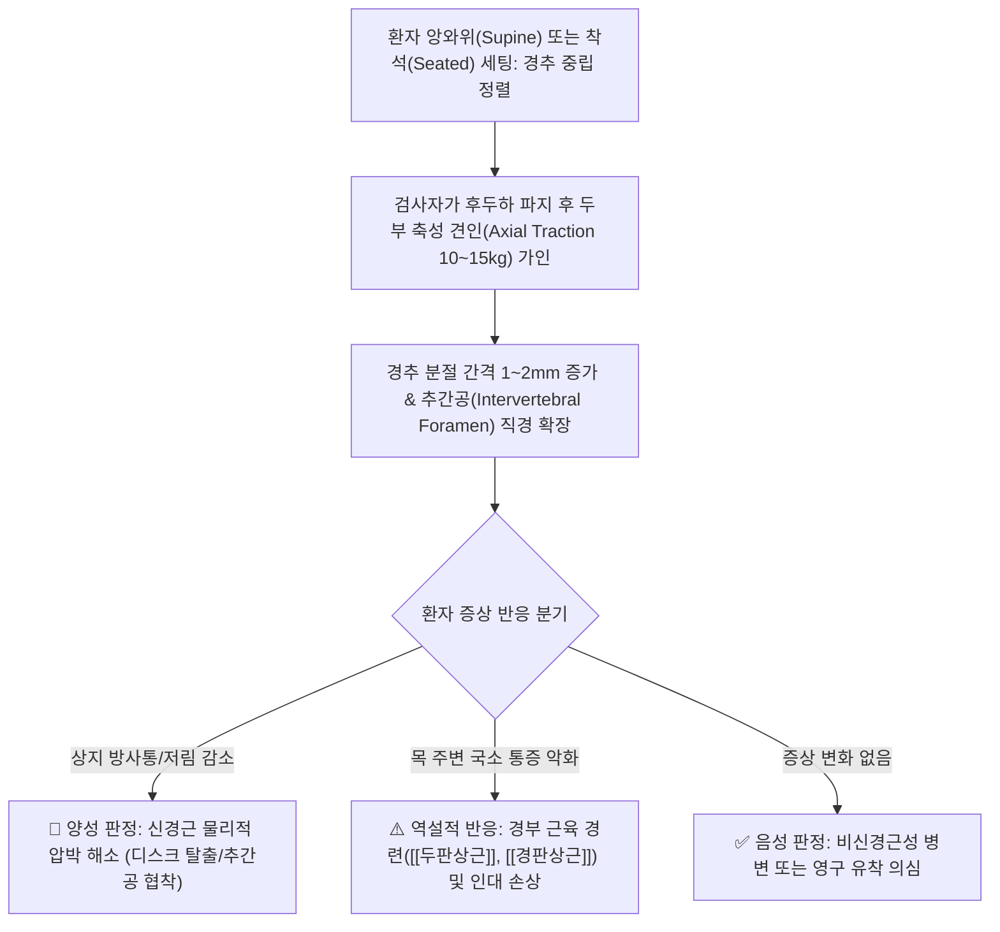
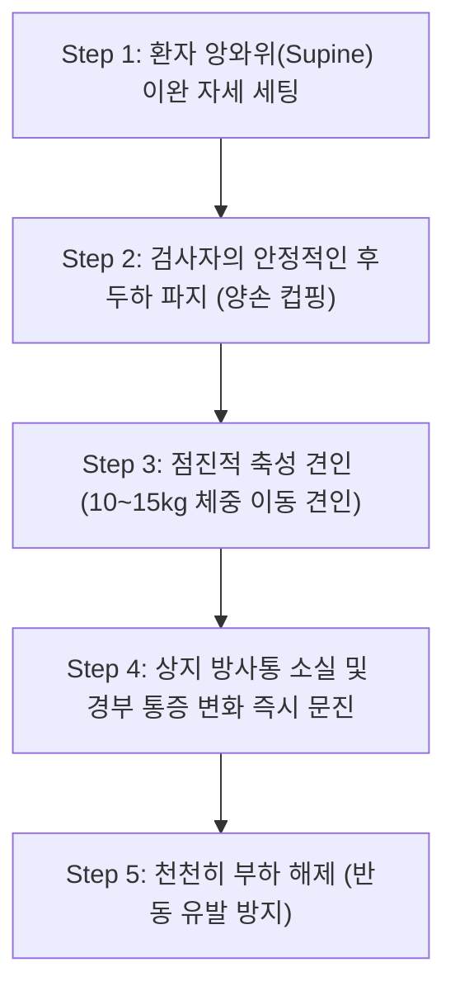
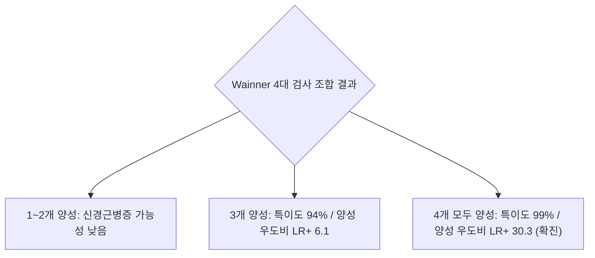

# 🩺 [[Distraction test|경추 견인 검사]] (Cervical Distraction Test / 신연 검사)

> **핵심 3줄 요약 (Key Summary)**:
> - 🎯 검사 목적 & 타겟 병소: 경추 신경근병증([[경추 추간판 탈출증]], 추간공 협착증) 감별 및 경추 신경근(Cervical Nerve Roots)의 기계적 압박 해소 여부 평가.
> - 🔍 검사 시행 프로토콜 & 양성 반응: 환자를 앙와위(또는 착석)로 위치시킨 후 검사자가 후두골 하부와 측두부를 지지하고 척추 장축 방향으로 10~15kg의 점진적 축성 견인(Axial traction)을 가할 때, 기존의 상지 방사통(Radicular pain)이나 저림이 현저히 감소/소실되면 양성.
> - 📊 진단 정확도(민감도·특이도) & 임상적 의의: 민감도는 44%로 낮으나 특이도가 90~97%에 달하며, [[스펄링 검사]]·[[ULTT 테스트]]·경추 회전 가동범위 제한과 함께 Wainner 경추 신경근병증 4대 진단 클러스터(Test Cluster)를 구성하는 핵심 완화 검사.
> - ⚠️ 위양성/위음성 요인 & 검사 금기: 견인 시 오히려 목 주변 통증이 증가하는 경우 신경근 압박이 아닌 경부 근육 경련이나 인대 손상을 강력히 시사하며, 상부 경추 불안정성(환축추 아탈구), 치돌기 골절, 심한 척수병증 환자에게는 과도한 견인 금기.

---

## 📌 목차
1. [검사 기본 정보 & 진단 목적 (Diagnostic Overview)](#1-검사-기본-정보--진단-목적-diagnostic-overview)
2. [해부학적 유발 메커니즘 & 생체역학적 원리 (Biomechanical Mechanism)](#2-해부학적-유발-메커니즘--생체역학적-원리-biomechanical-mechanism)
3. [표준 검사 시행 절차 (Step-by-Step Clinical Protocol)](#3-표준-검사-시행-절차-step-by-step-clinical-protocol)
4. [양성 반응 판정 기준 & 신경근/조직별 감별 맵핑 (Diagnostic Criteria & Mapping)](#4-양성-반응-판정-기준--신경근조직별-감별-맵핑-diagnostic-criteria--mapping)
5. [연관 검사군 비교 & 다단계 감별 알고리즘 (Differential Battery & Algorithm)](#5-연관-검사군-비교--다단계-감별-알고리즘-differential-battery--algorithm)
6. [양성 소견 시 한의 임상 연계 치료 전략 (Integrative Korean Medicine)](#6-양성-소견-시-한의-임상-연계-치료-전략-integrative-korean-medicine)
7. [💡 사용자 진료실 핵심 필기 & 실전 임상 팁 (원문 보존)](#7--사용자-진료실-핵심-필기--실전-임상-팁-원문-보존)
8. [출처 및 학술 참고 문헌 (References)](#8-출처-및-학술-참고-문헌-references)

---

## 1. 검사 기본 정보 & 진단 목적 (Diagnostic Overview)

![[경추견인검사_임상통계_민감도_특이도.jpg|450]]
> [그림 1: 경추 견인 검사(Cervical Distraction Test)의 진단 정확도 통계 - 민감도 44%, 특이도 90~97%]

| 항목 | 상세 내용 |
| :--- | :--- |
| **검사명 (Test Name)** | Cervical Distraction Test (경추 견인 검사 / 경추 신연 검사) |
| **분류 (Category)** | 정형외과적·신경학적 경추 감압/증상 완화 검사 (Cervical Unloading/Relief Test) |
| **타겟 병소 (Target)** | 경추 추간공(Intervertebral Foramen), 경추 신경근(C5~C8) 및 추간판 |
| **의심 질환 (Suspected Pathologies)** | [[경추 추간판 탈출증]](Cervical HNP), 경추 신경근병증(Cervical Radiculopathy), 경추 추간공 협착증 |
| **진단 정확도 (Diagnostic Accuracy)** | • **민감도 (Sensitivity)**: 44% (음성이라도 신경근병증을 완전히 배제할 수 없음) • **특이도 (Specificity)**: 90 ~ 97% (증상 완화 시 신경근 압박 확진에 매우 높은 가치) • **양성 우도비 (LR+)**: 4.4 ~ 8.8 (Wainner 2003, Rubinstein 2007) |
| **시연 영상 (Video Guide)** | [🎥 시연 영상: Physiotutors - Cervical Distraction Test | Cervical Radicular Syndrome](https://www.youtube.com/watch?v=uLdzgd5snmw) |

---

## 2. 해부학적 유발 메커니즘 & 생체역학적 원리 (Biomechanical Mechanism)

### 1) 축성 견인에 의한 추간공 감압 메커니즘 (Cervical Axial Decompression)
* 경추에 축성 견인력(약 10~15kg / 20~30 lbs)을 가하면 경추 추체 사이의 간격이 1~2mm가량 미세하게 벌어지고, 경추 신경근이 빠져나가는 통로인 추간공(Intervertebral Foramen)의 상하·전후 직경이 유의미하게 확장됩니다.
* 이로 인해 탈출된 디스크 섬유륜이나 비후된 관절돌기(Uncovertebral joint)에 의해 기계적으로 끼어 있던(Pinch) 신경근의 압박이 일시적으로 풀리며, 신경초 내 혈류 순환이 회복되어 상지로 방사되던 저림과 통증이 즉각적으로 줄어들게 됩니다.

### 2) 통증 완화 vs 통증 악화의 생체역학적 상반 기전 (원문 100% 융합)
* **상지 방사통 감소 (양성)**: 두개골 무게와 중력 부하를 해소하고 추간공을 넓혀주었을 때 신경근 자극이 경감되므로 **신경근 압박(추간공 협착증 및 디스크 탈출증)**을 강력하게 확진합니다.
* 경항부 국소 통증 증가 (역설적 통증): 축성 견인 시 척추가 장축 방향으로 늘어나면서 경부의 후방 지지 구조물인 [[두판상근]], [[경판상근]], [[견갑거근]], [[승모근]] 등의 근육과 극간인대, 후종인대에 강한 장력(Tension)이 걸립니다. 따라서 머리를 당길 때 목 뒤가 더 아프다고 호소하면 신경근 압박보다는 경부 근육 경련(Muscle spasm)이나 경추 인대 손상(Sprain/Whiplash)을 강력히 의심해야 합니다.

---

## 3. 표준 검사 시행 절차 (Step-by-Step Clinical Protocol)

### Step 1: 환자 준비 및 초기 자세 (Starting Position)
* 환자는 검사 베드에 편안하게 바로 눕습니다 (앙와위 Supine 권장).
* 의자에 앉아서 시행할 수도 있으나, 누운 자세는 머리의 자체 무게(약 4~5kg)가 이미 침대에 의해 지지되어 경추 근육의 불필요한 긴장을 최소화할 수 있으므로 표준 프로토콜로 가장 권장됩니다.
* 검사자는 베드 머리맡 쪽에 서서 환자의 척추 정렬을 확인합니다.

### Step 2: 1차 수기 파지 (Suboccipital Cup Hand Placement)
![[경추견인검사_1단계_후두하파지_포지셔닝.jpg|400]]
> [그림 2: 1단계 - 검사자가 양손으로 환자의 후두골 하부를 안정적으로 감싸 쥐며 경추 중립 정렬을 세팅하는 파지 자세]

* 검사자는 양손의 수근부(손바닥 바닥)와 손가락으로 환자의 후두골(Occutput) 하부를 둥글게 감싸 쥡니다.
* 검사자의 양손 모지구(Thenar)와 인지부는 환자의 측두골 및 하악지 뒤쪽에 부드럽게 밀착시켜 머리가 회전되거나 미끄러지지 않도록 단단히 지지합니다.
* 턱(Mandible)을 직접 강하게 잡아당기면 턱관절(TMJ) 손상을 유발하므로 주 지지점은 반드시 **후두골(Occiput)**이어야 합니다.

### Step 3: 2차 점진적 축성 견인력 가인 (Axial Traction Application)
![[경추견인검사_2단계_축성견인_수기시행.jpg|400]]
> [그림 3: 2단계 - 검사자가 팔 힘만이 아닌 상체 체중을 뒤로 기울이며 척추 장축 방향으로 10~15kg의 부드러운 축성 견인을 가하는 모습]

* 검사자는 팔이나 손목의 힘만으로 당기지 않고, 팔꿈치를 가볍게 굽힌 채 자신의 몸통과 골반을 뒤로 젖히는 체중 이동(Body weight shift)을 이용하여 부드럽게 견인력을 가합니다.
* 견인력은 약 10~15kg (20~30 lbs) 수준으로 서서히 올리며, 약 10~15초간 일정하게 유지합니다.

### Step 4: 환자 반응 문진 및 부하 해제 (Release & Safety)
* 견인이 가해지는 동안 환자에게 다음과 같이 즉시 질문합니다:
  * *"원장님이 머리를 당길 때, 팔이나 손으로 찌릿하던 저림이나 통증이 줄어드시나요?"*
  * *"오히려 목 뒤나 어깨 근육이 더 뻐근하게 당기거나 아프신가요?"*
* 검사가 끝나면 견인력을 튕기듯이 갑자기 놓지 말고, 천천히 1~2초에 걸쳐 부하를 제거하여 신경근에 급격한 반동 압박이 가해지지 않도록 주의합니다.

---

## 4. 양성 반응 판정 기준 & 신경근/조직별 감별 맵핑 (Diagnostic Criteria & Mapping)

* **진정한 양성 반응 (True Positive - 신경근 압박 확진)**:
  * 견인력이 적용되는 동안 평소 환자를 괴롭히던 상완, 전완, 수부의 **전형적인 상지 방사통(Radicular pain) 또는 저림 증상이 현저히 감소하거나 완전히 소실**될 때.
* **음성 반응 (Negative)**:
  * 머리를 견인해도 기존의 목 통증이나 상지 저림에 아무런 변화가 없는 경우.
* **역설적 양성 (Paradoxical Aggravation - 근육/인대 병변 감별)**:
  * 방사통은 없으나 머리를 당길 때 목 뒤의 뻐근함이나 통증이 **오히려 증가**하는 경우. $\rightarrow$ **경추 염좌(Sprain) 또는 경부 근육 연축(Spasm)** 진단.

| 압박 의심 신경근 | 방사통 및 감각 둔마 호발 영역 | 해당 분절 지배 핵심 근육 | 심부건반사 (DTR) |
| :--- | :--- | :--- | :--- |
| **C5 신경근** | 견관절 외측부, 상완 외측 (삼각근 부위) | [[삼각근]](Deltoid), 상완이두근 | 상완이두근 반사 저하 |
| **C6 신경근** | 전완 요측부, 제1·2지 (엄지·검지 손가락) | 손목 신전근(ECRL/ECRB), 상완이두근 | 상완요골근 반사 저하 |
| **C7 신경근** | 전완 후면, 제3지 (가운데 손가락) | [[상완삼두근]](Triceps), 손목 굴곡근 | 상완삼두근 반사 저하 |
| **C8 신경근** | 전완 척측부, 제4·5지 (약지·새끼 손가락) | 수부 내재근(골간근), 손가락 굴곡근 | 내재근 파지력 약화 |

---

## 5. 연관 검사군 비교 & 다단계 감별 알고리즘 (Differential Battery & Algorithm)

### 1) 경추 신경근병증 핵심 검사군 비교

| 검사명 | 검사 원리 및 수기 | 주요 진단 가치 | 통증 유발 여부 |
| :--- | :--- | :--- | :--- |
| [[Distraction test|경추 견인 검사]] (본 검사) | 두부 축성 견인으로 추간공 확장 | **특이도 90~97%**, 민감도 44% | **증상 완화 (Relief)** |
| [[스펄링 검사]] (Spurling test) | 경추 신전/측굴 후 축성 압박 | **특이도 83~100%**, 민감도 30~50% | **증상 유발 (Provocation)** |
| [[ULTT 테스트]] (Elvey / ULNT) | 상지 신경 주행 경로 점진 신장 | **민감도 97%**, 특이도 22~75% | 증상 유발 (선별 배제용) |
| [[추간공 압박 검사]] (Jackson test) | 경추 중립 또는 측굴 압박 | 특이도 80~90%, 민감도 40% | 증상 유발 |

### 2) Wainner의 경추 신경근병증 4대 임상 진단 클러스터 (Test Cluster)
Wainner et al.(2003) 연구에 따르면 단일 검사만으로는 신경근병증을 완벽히 감별하기 어려우므로, 다음 4가지 검사를 조합하여 적용합니다:
1. [[스펄링 검사]] 양성
2. [[Distraction test|경추 견인 검사]] 양성 (증상 완화)
3. [[ULTT 테스트]](ULTT 1 - 정중신경 바이어스) 양성
4. **환측 경추 회전 가동범위(Cervical Rotation) 60도 미만 제한**

---

## 6. 양성 소견 시 한의 임상 연계 치료 전략 (Integrative Korean Medicine)

* **추나 치료 (Chuna Manipulation - 감압 견인 추나의 직접적 적응증)**:
  * **경추 견인 검사 양성은 경추 추간판 감압 추나 기법의 최우선 적응증(Indication)**입니다.
  * 급성기 추간판 탈출 환자에게 순간적인 고속저진폭(HVLA) 스러스트는 탈출을 악화시킬 수 있어 금기하며, **경추 앙와위 JS 신연교정기법(간헐적 수기 감압 견인) 및 관절가동추나**를 부드럽게 적용하여 추간공을 점진적으로 확보합니다.
* **약침 요법 (Pharmacopuncture)**:
  * 신경근 출구부인 경추 협척혈(Huatuojiaji) 심부 및 후관절 주위에 **신바로약침 또는 중성어혈약침(1.0~2.0cc)**을 주입하여 화학적 신경근염(Radiculitis)을 억제하고 신경 유착을 해소합니다.
* **침구 및 전침 치료 (Acupuncture & EA)**:
  * 풍지(GB20), 견정(GB21), 천주(BL10), 대저(BL11) 및 상지 분절 취혈(곡지, 수삼리, 합곡 등)에 자침.
  * 2~4Hz 저주파 전침을 병변 분절에 통전하여 경부 심부 척추기립근과 [[두판상근]]의 근연축을 풀고 미세혈류를 개선합니다.
* **한약 치료 (Herbal Medicine)**:
  * 신경근 압박 부종 및 급성 통증기: [[영선제통음]], [[오적산]], [[갈근탕]] (강력한 소염진통 및 근육 이완).
  * 만성 방사통 및 신경 유착기: [[독활기생탕]], [[서경탕]], [[보양환오탕]] (신경 영양 공급 및 혈행 개선).

---

## 7. 💡 사용자 진료실 핵심 필기 & 실전 임상 팁 (원문 보존)

* **사용자 원문 필기 (100% 보존)**:
  * **방법**: 의자에 앉히고 환자의 머리를 견인시켜 목에 걸리는 무게를 해소시킴.
  * **의의**: 신경근 압박을 초래할 수 있는 추간공을 넓히는 동작으로, 전반적으로 통증이 감소하면 추간공 압박을 의심하며, 통증이 증가하면 경부의 근육 경련이나 인대 손상을 의심.

* **원장님 실전 진료실 노하우 & 감별 팁**:
  1. **스펄링 검사 후 '진화(달래기)' 수기로의 활용**:
     * 진료실에서 [[스펄링 검사]]를 시행하여 환자의 팔 저림이 극심하게 재현된 경우, 환자는 놀라고 불안해합니다. 이때 즉시 당황하지 말고 환자를 눕히거나 머리를 부드럽게 위로 축성 견인(Distraction)해 주면 방사통이 즉각 가라앉아 환자의 신뢰와 라포가 크게 상승합니다.
  2. **좌위(Seated) vs 앙와위(Supine) 실전 적용**:
     * 원문 필기처럼 외래 진료실에서 간단히 스크리닝할 때는 의자에 앉힌 채 시행해도 두부 무게(약 5kg)가 제거되면서 시원함을 느끼는 환자가 많습니다.
     * 그러나 환자가 통증으로 목에 힘을 주고 긴장해 있거나 정밀한 10~15kg 부하를 가하고자 할 때는 베드에 눕힌(Supine) 상태에서 후두하를 파지하고 체중을 실어 당기는 것이 훨씬 정확하고 안전합니다.
  3. **턱(Jaw)을 누르거나 당기지 말 것**:
     * 초심자가 범하기 쉬운 실수로 하악골(턱)을 강하게 받치고 당기면 턱관절 장애(TMD) 통증이 유발됩니다. 모든 견인력은 **손바닥으로 환자의 후두골 융기부(EOP 및 후두하 연부조직)**를 단단히 감싸 쥐어 전달해야 합니다.

---

## 8. 출처 및 학술 참고 문헌 (References)

1. **Wainner, R. S., Fritz, J. M., Irrgang, J. J., Boninger, M. L., Delitto, A., & Allison, S. (2003)**. Reliability and diagnostic accuracy of the clinical examination and patient self-report measures for cervical radiculopathy. *Spine*, 28(1), 52-62. [PMID: 12503025](https://pubmed.ncbi.nlm.nih.gov/12503025/)
   - **[연구 요약]**: 경추 견인 검사의 민감도 44%, 특이도 90%, 양성 우도비 4.4를 규명하였으며, 스펄링 검사·ULTT·회전 제한과 조합한 4대 클러스터 적용 시 99% 확진 특이도를 보임을 입증한 기념비적 연구.
2. **Rubinstein, S. M., Pool, J. J., van Tulder, M. W., Riphagen, I. I., & de Vet, H. C. (2007)**. A systematic review of the diagnostic accuracy of provocative tests of the neck for diagnosing cervical radiculopathy. *European Spine Journal*, 16(3), 307-319. [PMID: 17013656](https://pubmed.ncbi.nlm.nih.gov/17013656/)
   - **[연구 요약]**: 경추 신경근병증의 이학적 검사들에 대한 체계적 문헌고찰로, 경추 신연 검사가 높은 특이도(최대 97%)를 지닌 우수한 완화 검사임을 입증.
3. **Magee, D. J. (2014)**. *Orthopedic Physical Assessment (6th ed.)*. Elsevier Health Sciences.
   - **[연구 요약]**: 경추 견인 검사 시 축성 인장력이 경추 추간공을 개방시키고 신경근 압박을 완화하는 생체역학적 원리와 환자 자세별 시행 지침 수록.