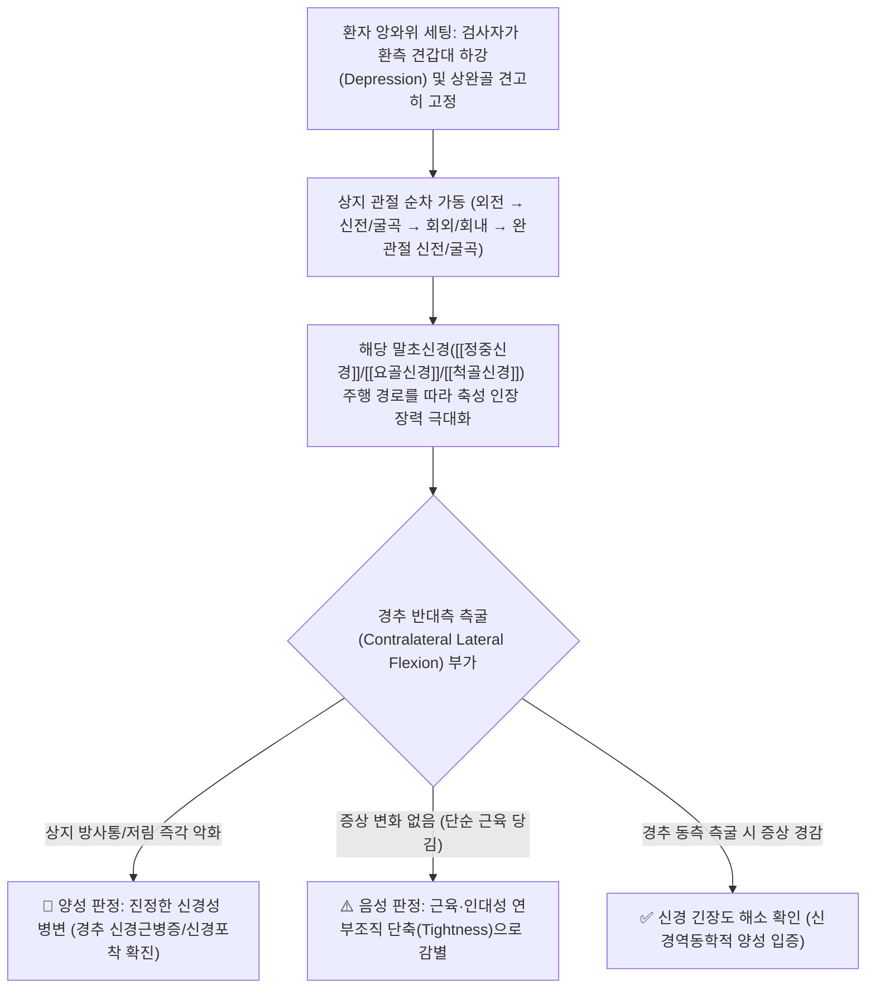

---
aliases:
  - 상지 신경긴장 검사
  - 상지 신경역동학 검사
  - 엘베이 검사
  - Upper Limb Tension Test
  - Upper Limb Neurodynamic Test
  - ULTT
  - ULNT
  - Elvey Test
tags:
  - 근골격계
  - 이학적 검사
  - 경추
  - 신경근병증
  - 신경포착
title: ULTT 테스트
date: 2026-09-24
출처: "PMID: 12503025"
---

# 🩺 [[ULTT 테스트]] (Upper Limb Tension Test / 상지 신경긴장 검사, Elvey Test)

> **핵심 3줄 요약 (Key Summary)**:
> - 🎯 검사 목적 & 타겟 병소: 경추 신경근병증([[경추 추간판 탈출증]], C5~T1) 및 상완신경총, 말초신경([[정중신경]], [[요골신경]], [[척골신경]])의 비정상적 기계적 민감도(Mechanosensitivity)와 신경 활주(Nerve Gliding) 장애 평가.
> - 🔍 검사 시행 프로토콜 & 양성 반응: 앙와위에서 견갑골을 하강 고정한 후 각 신경 주행에 맞추어 견관절, 주관절, 완관절, 수지를 순차적으로 신장시키며, 경추 반대측 측굴(Sensitizing maneuver) 시 상지 방사통/저림이 악화되고 동측 측굴 시 완화되면 양성.
> - 📊 진단 정확도(민감도·특이도) & 임상적 의의: 민감도가 97%에 달해 경추 신경근병증을 조기 배제(Rule-Out)하는 데 최적의 선별 검사(Wainner 4대 클러스터 제1선별 검사, 음성 시 신경근 압박 가능성 극히 희박).
> - ⚠️ 위양성/위음성 요인 & 검사 금기: 정상인에서도 끝범위 신장 시 연부조직 당김이 발생하므로 반드시 경추 측굴에 따른 증상 변화(구조적 감별, Structural Differentiation)를 확인해야 하며, 급성 신경초 손상이나 심한 불안정성 시 급격한 견인 금기.

---

## 📌 목차
1. [검사 기본 정보 & 진단 목적 (Diagnostic Overview)](#1-검사-기본-정보--진단-목적-diagnostic-overview)
2. [해부학적 유발 메커니즘 & 생체역학적 원리 (Biomechanical Mechanism)](#2-해부학적-유발-메커니즘--생체역학적-원리-biomechanical-mechanism)
3. [표준 검사 시행 절차 (3대 신경별 상세 프로토콜)](#3-표준-검사-시행-절차-3대-신경별-상세-프로토콜)
4. [양성 반응 판정 기준 & 구조적 감별 원리 (Diagnostic Criteria & Differentiation)](#4-양성-반응-판정-기준--구조적-감별-원리-diagnostic-criteria--differentiation)
5. [연관 검사군 비교 & 다단계 감별 알고리즘 (Differential Battery & Algorithm)](#5-연관-검사군-비교--다단계-감별-알고리즘-differential-battery--algorithm)
6. [양성 소견 시 한의 임상 연계 치료 전략 (Integrative Korean Medicine)](#6-양성-소견-시-한의-임상-연계-치료-전략-integrative-korean-medicine)
7. [💡 사용자 진료실 핵심 필기 & 실전 임상 팁 (원문 보존)](#7--사용자-진료실-핵심-필기--실전-임상-팁-원문-보존)
8. [출처 및 학술 참고 문헌 (References)](#8-출처-및-학술-참고-문헌-references)

---

## 1. 검사 기본 정보 & 진단 목적 (Diagnostic Overview)

![[Pasted image 20240121051741.png|400]]
> [그림 1: 상지 3대 신경([[정중신경]], [[척골신경]], [[요골신경]])의 주행 경로 및 신경 긴장 유발 자세 도해]

| 항목 | 상세 내용 |
| :--- | :--- |
| **검사명 (Test Name)** | Upper Limb Tension Test (상지 신경긴장 검사 / ULNT / Elvey Test) |
| **분류 (Category)** | 정형외과적·신경역동학적 유발 및 감별 검사 (Neurodynamic Provocation Test) |
| **타겟 병소 (Target)** | 경추 신경근(C5~T1), 상완신경총, 말초 3대 신경([[정중신경]], [[요골신경]], [[척골신경]]) |
| **의심 질환 (Suspected Pathologies)** | [[경추 추간판 탈출증]](Cervical HNP), 경추 신경근병증, [[흉곽출구 증후군]](TOS), [[수근관 증후군]], 주관 증후군 |
| **진단 정확도 (Diagnostic Accuracy)** | • **민감도 (Sensitivity)**: **97%** (ULTT 1 정중신경 기준, 음성 시 디스크 배제에 결정적) • **특이도 (Specificity)**: 22 ~ 75% (단독 확진용으로는 위양성 주의 필요) • **음성 우도비 (LR-)**: 0.12 (Wainner et al., 2003) |
| **시연 영상 (Video Guide)** | [🎥 시연 영상: Physiotutors - All Upper Limb Tension Tests | ULTT | ULNT](https://www.youtube.com/watch?v=rir6x6Iiqc4) |

---

## 2. 해부학적 유발 메커니즘 & 생체역학적 원리 (Biomechanical Mechanism)

### 1) 신경의 물리적 연속성(Continuity)과 신경역동학(Neurodynamics)
* 말초 신경계와 척수는 기계적으로 하나로 연결된 연속된 관(Continuous mechanical tract)입니다.
* 하지의 [[SLR test]](하지직거상 검사)가 좌골신경을 당겨 요추 신경근을 자극하듯, ULTT는 상지의 여러 관절을 복합적으로 신장시켜 말초신경의 말단에서부터 상완신경총을 거쳐 경추 신경근(C5~T1)까지 물리적 인장력(Tensile stress)을 연속적으로 전달합니다.
* 신경초에 염증이 있거나 추간공에서 포착되어 활주(Gliding)가 차단된 경우, 정상적인 신장 범위에서도 신경 내압이 급상승하여 허혈성 통증과 이소성 방전이 발생합니다.

### 2) 구조적 감별(Structural Differentiation)의 원리
* 단순히 팔을 뻗었을 때 느껴지는 뻐근함은 상완이두근, 전완 굴곡근, 흉근 등의 **근막 단축(Myofascial tightness)**일 수 있습니다.
* 이를 완벽히 감별하기 위해 팔의 자세를 그대로 고정한 상태에서 **환자의 목(경추)을 반대쪽으로 측굴(Contralateral bending)**시킵니다.
  * 이때 증상이 뚜렷하게 악화되고, 목을 동측으로 기울였을 때 증상이 즉시 풀린다면 통증의 원인이 근육이 아닌 **신경(Nerve) 그 자체**임을 명확히 증명할 수 있습니다.

---

## 3. 표준 검사 시행 절차 (3대 신경별 상세 프로토콜)

### ❶ ULTT 1: 정중신경 바이어스 (Median Nerve Bias - ULTT A)
![[ULTT_1형_정중신경_신경긴장검사.jpg|400]]
> [그림 2: ULTT 1 (정중신경) - 견갑골 하강, 견관절 90~110도 외전 및 외회전, 완관절·수지 신전, 전완 회외, 주관절 신전]

* **타겟 신경 및 분절: [[정중신경]](Median Nerve), 경추 C5, C6, C7 신경근.
* **시행 순서**:
  1. 환자는 앙와위로 침대 가장자리에 바르게 눕습니다.
  2. 검사자의 한 손(또는 허벅지/팔)으로 환자의 **견갑대를 아래로 하강(Depression)시키고 견고히 고정**합니다 (쇄골과 늑골 사이가 벌어지지 않도록 고정하는 것이 핵심).
  3. 견관절을 약 90~110도 외전(Abduction)시키고 외회전(External rotation)합니다.
  4. 완관절(손목)과 손가락을 최대한 신전(Extension)시키고 전완을 회외(Supination)시킵니다.
  5. 마지막으로 주관절(팔꿈치)을 천천히 신전(Extension)시키며 환자의 증상 발현을 관찰합니다.

### ❷ ULTT 2b: 요골신경 바이어스 (Radial Nerve Bias - ULTT 3)
![[ULTT_2형_요골신경_신경긴장검사.jpg|400]]
> [그림 3: ULTT 2b (요골신경) - 견갑골 하강, 견관절 10도 외전 및 내회전, 주관절 신전, 전완 회내, 완관절 굴곡 및 척측 편위]

* **타겟 신경 및 분절: [[요골신경]](Radial Nerve), 경추 C5, C6 신경근.
* **시행 순서**:
  1. 환자는 앙와위로 누워 어깨를 침대 밖으로 살짝 뺍니다.
  2. 검사자의 고관절이나 대퇴부로 환자의 어깨를 아래로 눌러 하강 고정합니다.
  3. 견관절을 약 10~20도 가볍게 외전시킨 상태에서 팔 전체를 **안쪽으로 최대한 내회전(Internal rotation)**시킵니다.
  4. 주관절을 곧게 신전시키고, 전완을 회내(Pronation)시킵니다.
  5. 완관절(손목)과 엄지손가락을 손바닥 쪽으로 강하게 굴곡(Flexion)시키고 척측으로 편위(Ulnar deviation)시켜 요골신경을 극대 신장합니다.

### ❸ ULTT 3: 척골신경 바이어스 (Ulnar Nerve Bias - ULTT 4)
![[ULTT_3형_척골신경_신경긴장검사.jpg|400]]
> [그림 4: ULTT 3 (척골신경) - 견갑골 하강, 완관절 신전 및 회외, 주관절 최대 굴곡, 견관절 외전 및 외회전 (Waiter's tip / 가면 자세)]

* **타겟 신경 및 분절: [[척골신경]](Ulnar Nerve), 경추 C8, T1 신경근.
* **시행 순서**:
  1. 환자는 앙와위로 눕고 검사자는 환자의 견갑골을 하강 고정합니다.
  2. 환자의 완관절(손목)과 손가락을 신전(Extension)시키고 전완을 회외(Supination)시킵니다.
  3. 주관절(팔꿈치)을 **최대한 굴곡(Flexion)**시킵니다 (내측상과 뒤 주관 터널에서 척골신경 장력 극대화).
  4. 주관절을 굴곡한 상태 그대로 견관절을 90도 이상 외전 및 외회전시켜 손바닥이 환자의 귀나 머리 옆으로 향하도록 위치시킵니다(웨이터가 쟁반을 받치는 듯한 자세).

---

## 4. 양성 반응 판정 기준 & 구조적 감별 원리 (Diagnostic Criteria & Differentiation)

* **진정한 양성 판정 3대 필수 조건**:
  1. 검사 동작 시 환자가 평소 호소하던 **상지의 전형적인 통증, 저림, 이상감각(Paresthesia)이 100% 재현**될 때.
  2. 건측(반대쪽 정상 팔)과 비교했을 때 관절 가동 범위의 뚜렷한 제한(Resistance)이나 비대칭적 통증 역치가 존재할 때.
  3. **경추 구조적 감별(Structural Differentiation)**: 팔을 고정한 채 경추를 반대측으로 측굴시키면 증상이 악화되고, 동측으로 측굴시키면 증상이 호전되는 신경역동학적 반응이 확인될 때.

| 검사 유형 | 타겟 말초신경 | 신경근 분절 | 양성 시 전형적 저림/통증 호발 구역 |
| :--- | :--- | :--- | :--- |
| **ULTT 1** (정중신경) | [[정중신경]](Median N.) | C5, C6, C7 | 제1·2·3지 및 4지 요측부, 수장부, 전완 전면 |
| **ULTT 2b** (요골신경) | [[요골신경]](Radial N.) | C5, C6 | 제1·2·3지 수배부(손등), 전완 후외측면 |
| **ULTT 3** (척골신경) | [[척골신경]](Ulnar N.) | C8, T1 | 제4지 척측부 및 제5지(새끼손가락), 전완 내측 |

---

## 5. 연관 검사군 비교 & 다단계 감별 알고리즘 (Differential Battery & Algorithm)

### 1) 경추 신경근병증 검사군 특성 비교

| 검사명 | 검사 메커니즘 | 민감도 | 특이도 | 임상적 주 역할 |
| :--- | :--- | :--- | :--- | :--- |
| [[ULTT 테스트]] (본 검사) | 신경 주행 경로 점진 신장 (Tension) | **97%** | 22~75% | **초기 배제(Rule-Out) 선별 검사** |
| [[스펄링 검사]] (Spurling) | 신전 + 환측 측굴 + 축성 압박 | 30~50% | **83~100%** | **최종 확진(Rule-In) 도발 검사** |
| [[Distraction test|경추 견인 검사]] | 축성 수기 견인 (Decompression) | 44% | **90~97%** | **증상 완화 평가 (치료 적응증)** |
| [[추간공 압박 검사]] (Jackson) | 회전 + 축성 압박 | 40~55% | 80~90% | 신경근 vs 후관절 감별 |

### 2) Wainner 4대 클러스터에서의 진단적 의미
* **ULTT 1이 음성(Negative)인 경우**: 경추 신경근병증의 가능성은 3% 미만으로 거의 배제할 수 있습니다.
* **ULTT 1이 양성(Positive)인 경우: 신경근병증의 가능성이 열리므로, 이어서 높은 특이도를 지닌 [[스펄링 검사]]와 [[Distraction test|경추 견인 검사]]를 시행하여 확진 단계로 진입합니다.

---

## 6. 양성 소견 시 한의 임상 연계 치료 전략 (Integrative Korean Medicine)

* **신경 활주 추나 요법 (Neurodynamic Gliding Technique - 치료적 활용)**:
  * 원문 필기에 명시된 바와 같이, **ULTT의 자세는 평가 도구인 동시에 최고의 치료 도구**입니다.
  * **슬라이더(Slider) 기법**: 경추를 환측으로 측굴시키면서 동시에 완관절을 신전시키는 방식으로 신경의 장력을 일정하게 유지하며 유착된 신경 터널을 미끄러지듯 통과시킵니다.
  * **텐셔너(Tensioner) 기법**: 급성 염증기가 지난 만성 포착기 환자에게 점진적 탄성을 회복시키는 신장 기법을 부드럽게 적용.
* **약침 요법 (Pharmacopuncture - 신경 주행 포착 터널 전수 타겟)**:
  * 경추 협척혈(C5~C8 출구부), [[전사각근]]·[[중사각근]] 간극(사각근삼각), [[소흉근]] 하 공간(오훼돌기 하부), 회외근(Frohse 아케이드), 원회내근, 수근관(횡수근인대) 등 신경 주행 경로의 압박 호발점에 신바로약침 또는 중성어혈약침(1.0~2.0cc)**을 단계별로 주입.
* **침구 및 전침 치료 (Acupuncture & EA)**:
  * 병변 신경 라인을 따라 곡지, 수삼리, 외관, 내관, 합곡, 후계 취혈.
  * 2Hz 저주파 전침을 통전하여 신경 내 부종을 배출하고 축삭 내 미세혈류를 증진.
* **한약 치료 (Herbal Medicine)**:
  * 상완신경총 및 말초 신경 포착: [[서경탕]](상지 견비통 및 저림의 대표 방제), [[영선제통음]], [[오적산]].
  * 만성 신경 손상 및 감각 마비: [[보양환오탕]](혈행 개선 및 신경 재생), [[독활기생탕]].

---

## 7. 💡 사용자 진료실 핵심 필기 & 실전 임상 팁 (원문 보존)

* **사용자 원문 필기 (100% 보존)**:
  * **방법**: 앙와위에서 환측 상지를 침대의 가장자리로 오게 한 후 한 손은 시술자의 쇄골과 견갑골을 고정하고 다른 한 손은 환자의 손을 잡은 후
    - ❶ 견관절 90도 외전, 외회전, 주관절 신전, 완관절 신전, 전완부 회외([[정중신경]] 긴장 유발)
    - ❷ 견관절 10도 외전, 내회전, 주관절 신전, 완관절 굴곡([[요골신경]] 긴장 유발)
    - ❸ 견관절 90도 외전, 완관절 신전, 전완부 회외된 상태에서 주관절을 최대한 굴곡하고 견관절을 외회전 시킴([[척골신경]] 긴장 유발)
  * **의의**:
    - 각 자세에서 환측으로 상지의 통증이나 신경학적 증상이 나타나는 경우에는 상완신경총이나 경추의 신경근 병증을 의심.
    - 상지 신경의 최대 긴장 자세를 만들어 신경근 병증에 대한 평가 목적 외에도 긴장을 감소시켜 증상을 완화시키는데도 유용함.
    - 신경 주행을 고려하여 신전.
    - 견갑 고정하여 쇄골과 늑골 사이가 벌어지지 않게 하는 것이 중요(무릎과 팔로 상완골, 견봉 고정).

* **원장님 실전 진료실 노하우 & 감별 팁**:
  1. **'무릎과 팔로 상완골, 견봉 고정'의 생체역학적 핵심 (원문 심화)**:
     * 팔을 외전시키거나 손목을 당길 때 환자는 무의식적으로 통증을 피하기 위해 어깨(견봉)를 으쓱 위로 올리는 보상 작용(Shrugging compensation)을 합니다.
     * 어깨가 위로 딸려 올라가면 신경에 걸리던 장력이 즉시 풀려버려 위음성(False Negative)이 발생합니다.
     * 따라서 원장님 필기처럼 **검사자의 팔뚝이나 허벅지(무릎)로 환자의 견봉과 쇄골을 단단히 눌러 하강 고정**해야만 쇄골-늑골 간극의 비정상적 벌어짐을 방지하고 순수한 신경 장력만을 정밀하게 평가할 수 있습니다.
  2. **평가에서 치료(Nerve Gliding)로 즉시 전환하는 꿀팁**:
     * 환자에게 ULTT를 시행하여 저림이 유발된 특정 각도를 확인한 후, 그 가동 범위의 80% 수준에서 손목과 목을 번갈아 까닥거리는 **신경 활주 자가 운동법(Sliders Exercise)**을 티칭해 주면 환자의 치료 만족도와 복약 순응도가 극대화됩니다.

---

## 8. 출처 및 학술 참고 문헌 (References)

1. **Wainner, R. S., Fritz, J. M., Irrgang, J. J., Boninger, M. L., Delitto, A., & Allison, S. (2003)**. Reliability and diagnostic accuracy of the clinical examination and patient self-report measures for cervical radiculopathy. *Spine*, 28(1), 52-62. [PMID: 12503025](https://pubmed.ncbi.nlm.nih.gov/12503025/)
   - **[연구 요약]**: ULTT 1(정중신경)이 경추 신경근병증 진단에서 민감도 97%, 음성 우도비 0.12를 기록하여 가장 강력한 선별 배제 검사임을 임상적으로 입증.
2. **Elvey, R. L. (1997)**. Physical evaluation of neural tissue in disorders of the neuromusculoskeletal system. *Journal of Hand Therapy*, 10(2), 122-129. [PMID: 12544957](https://pubmed.ncbi.nlm.nih.gov/9188049/)
   - **[연구 요약]**: 상지 신경긴장 검사(Elvey test)의 창시 논문으로, 상지 3대 신경에 대한 점진적 신장 평가 및 구조적 감별의 기전 제시.
3. **Shacklock, M. (2005)**. *Clinical Neurodynamics: A new system of musculoskeletal treatment*. Elsevier Health Sciences.
   - **[연구 요약]**: 신경역동학의 생체역학적 원리와 신경 긴장(Tensioner) 및 신경 활주(Slider) 기법의 임상 평가 및 치료 적용 체계화.
4. **Schmid, A. B., Brunner, F., Luomajoki, H., Held, U., Bachmann, L. M., Künzer, S., & Coppieters, M. W. (2009)**. Reliability of clinical tests to evaluate nerve function and mechanosensitivity in patients with cervical radiculopathy or carpal tunnel syndrome. *BMC Musculoskeletal Disorders*, 10(1), 11. [PMID: 19166627](https://pubmed.ncbi.nlm.nih.gov/19166627/)
   - **[연구 요약]**: 경추 신경근병증 및 수근관 증후군 환자에서 신경역동학 검사의 검사자 간 신뢰도와 임상적 타당성을 규명.

<!-- 보관 태그(1회용·링크오류, 필요시 복원): 상지신경 -->
