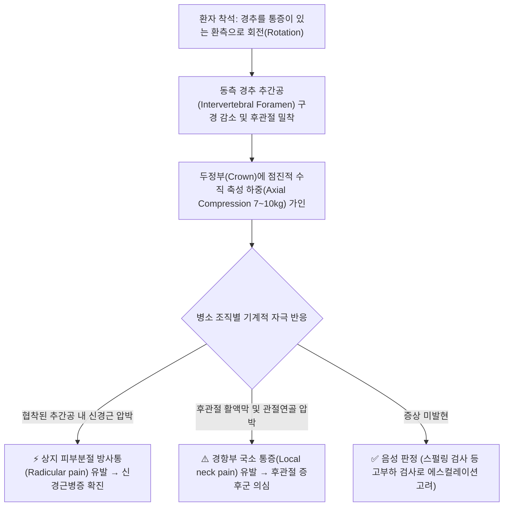
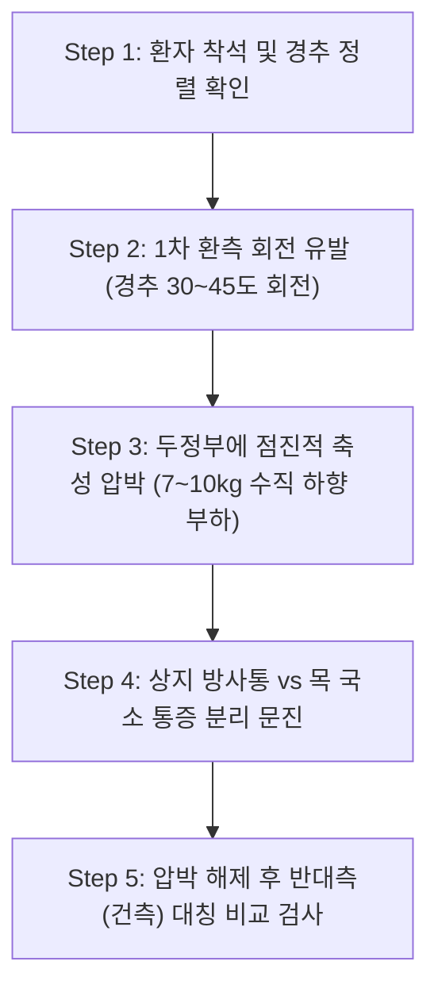
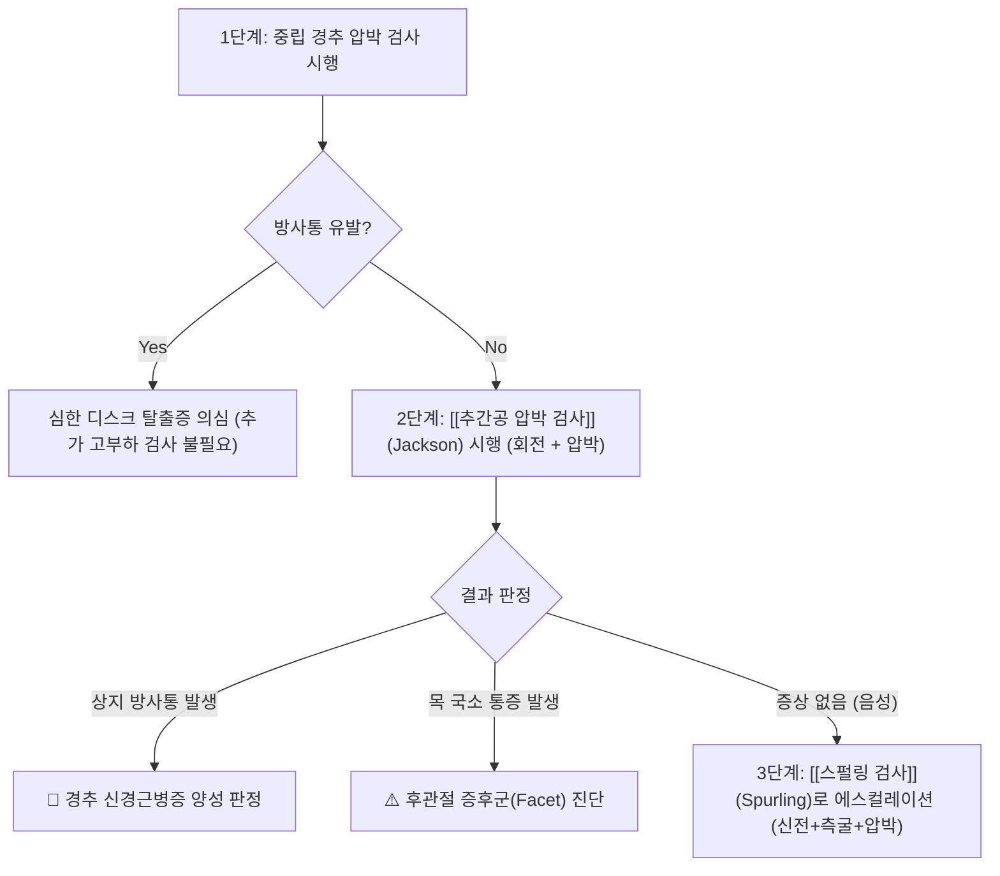

---
aliases:
  - 잭슨 압박 검사
  - 경추 압박 검사
  - 추간공 압박 검사
  - Jackson Compression Test
  - Jackson's Test
  - Cervical Compression Test
tags:
  - 근골격계
  - 이학적 검사
  - 경추
  - 신경근병증
title: 추간공 압박 검사
date: 2026-09-13
출처: "PMID: 39938056"
---

# 🩺 [[추간공 압박 검사]] (Jackson's Compression Test / 경추 압박 검사)

> **핵심 3줄 요약 (Key Summary)**:
> - 🎯 검사 목적 & 타겟 병소: 경추 신경근병증([[경추 추간판 탈출증]], 추간공 협착증) 및 경추 후관절 증후군(Facet Joint Syndrome) 감별, 타겟 병소인 경추 추간공(Intervertebral Foramen), 경추 신경근(C5~C8) 및 후관절.
> - 🔍 검사 시행 프로토콜 & 양성 반응: 환자를 의자에 앉히고 머리를 환측으로 회전(또는 중립)시킨 후 두정부에 점진적 축성 압박(Axial Compression)을 가할 때, 상지 피부분절을 따라 뻗치는 날카로운 방사통(Radicular pain) 유발 시 신경근 압박 양성, 단순 경항부 국소 통증 유발 시 후관절 병변 의심.
> - 📊 진단 정확도(민감도·특이도) & 임상적 의의: 특이도 80~90%, 민감도 40~55% 수준으로, [[스펄링 검사]](신전+측굴 복합)보다 추간공 폐쇄 강도가 다소 완만하여 스펄링 시행 전단계의 안전하고 직관적인 스크리닝 검사로 활용.
> - ⚠️ 위양성/위음성 요인 & 검사 금기: 급성 경추 골절, 경추 불안정성, 척수병증(Myelopathy) 시 과도한 축성 압박 절대 금기, 목 주변의 단순 뻐근함(후관절통/근육통)을 상지 방사통과 엄격히 구별할 것.

---

## 📌 목차
1. [검사 기본 정보 & 진단 목적 (Diagnostic Overview)](#1-검사-기본-정보--진단-목적-diagnostic-overview)
2. [해부학적 유발 메커니즘 & 생체역학적 원리 (Biomechanical Mechanism)](#2-해부학적-유발-메커니즘--생체역학적-원리-biomechanical-mechanism)
3. [표준 검사 시행 절차 (Step-by-Step Clinical Protocol)](#3-표준-검사-시행-절차-step-by-step-clinical-protocol)
4. [양성 반응 판정 기준 & 신경근/조직별 감별 맵핑 (Diagnostic Criteria & Mapping)](#4-양성-반응-판정-기준--신경근조직별-감별-맵핑-diagnostic-criteria--mapping)
5. [연관 검사군 비교 & 다단계 감별 알고리즘 (Differential Battery & Algorithm)](#5-연관-검사군-비교--다단계-감별-알고리즘-differential-battery--algorithm)
6. [양성 소견 시 한의 임상 연계 치료 전략 (Integrative Korean Medicine)](#6-양성-소견-시-한의-임상-연계-치료-전략-integrative-korean-medicine)
7. [💡 사용자 진료실 핵심 필기 & 실전 임상 팁 (원문 보존)](#7--사용자-진료실-핵심-필기--실전-임상-팁-원문-보존)
8. [출처 및 학술 참고 문헌 (References)](#8-출처-및-학술-참고-문헌-references)

---

## 1. 검사 기본 정보 & 진단 목적 (Diagnostic Overview)

![[경추_신경근_추간공_해부도_Blausen.png|400]]
> [그림 1: 경추 척추체, 추간공(Intervertebral Foramen) 및 척수-경추 신경근(Cervical Nerve Roots) 주행 해부도]

| 항목 | 상세 내용 |
| :--- | :--- |
| **검사명 (Test Name)** | Jackson's Compression Test (잭슨 압박 검사 / 경추 추간공 압박 검사 / Cervical Compression Test) |
| **분류 (Category)** | 정형외과적·신경학적 경추 도발 검사 (Cervical Provocation Test) |
| **타겟 병소 (Target)** | 경추 추간공(Intervertebral Foramen), 경추 신경근(C5~C8), 경추 후관절(Facet Joint) |
| **의심 질환 (Suspected Pathologies)** | [[경추 추간판 탈출증]](Cervical HNP), 경추 신경근병증(Cervical Radiculopathy), 경추 추간공 협착증, 경추 후관절 증후군(Facet Syndrome) |
| **진단 정확도 (Diagnostic Accuracy)** | • **민감도 (Sensitivity)**: 40 ~ 55% • **특이도 (Specificity)**: 80 ~ 90% (양성 소견 시 신경근 압박의 신뢰성 높은 지표) • **양성 우도비 (LR+)**: 2.5 ~ 5.5 (Tong et al., 2002; Rubinstein et al., 2007) |
| **시연 영상 (Video Guide)** | [🎥 시연 영상: Dr. Ray Pulmano DC - Jackson's Axial Compression Test](https://www.youtube.com/watch?v=vcEWxalJem4) |

---

## 2. 해부학적 유발 메커니즘 & 생체역학적 원리 (Biomechanical Mechanism)

### 1) 회전 및 수직 부하에 의한 추간공 협착 메커니즘
* 경추를 한쪽으로 회전시키면 동측 하부 경추의 상관절돌기와 하관절돌기 간격이 좁아지고, 추간공의 전후·상하 직경이 물리적으로 축소됩니다.
* 이 상태에서 검사자가 두정부에 수직 방향으로 체중 하중(Axial load)을 가하면, 디스크 내부의 수핵 압력이 후외측으로 전달됨과 동시에 이미 좁아진 추간공을 통과하는 경추 신경근(Nerve Root)이 섬유륜 돌출부 및 구추관절(Luschka joint) 골극 사이에 직접 끼이게(Pinching) 됩니다.

### 2) 상지 방사통 vs 국소 경항통의 생체역학적 감별 (원문 100% 융합)
* **상지 방사통 (신경근 압박)**: 신경근초의 허혈과 신경막 자극으로 인해 해당 신경근이 지배하는 상완, 전완, 수부 피부분절을 따라 전기가 오듯 날카로운 방사통이 뻗어나갑니다.
* **국소 경항통 (후관절 병변)**: 신경근 압박이 없더라도 경추 후관절(Facet joint)의 퇴행성 관절염이나 관절낭의 염증이 있는 경우, 축성 압박력에 의해 관절면이 서로 맞부딪히면서 경부 후방 및 견갑골 내측 연부에 국한된 뻐근한 국소 통증(Local referred pain)이 발생합니다.

---

## 3. 표준 검사 시행 절차 (Step-by-Step Clinical Protocol)

### Step 1: 환자 준비 및 초기 세팅 (Starting Position)
* 환자는 등받이가 없는 의자에 허리와 등을 반듯하게 펴고 바른 자세로 앉습니다.
* 검사자는 환자의 뒤에 안정된 보폭으로 서서 환자의 경추 기본 가동 범위와 통증 유무를 확인합니다.

### Step 2: 1차 환측 회전 유발 (Rotation to Affected Side)
![[추간공압박검사_1단계_환측회전_자세.jpg|400]]
> [그림 2: 1단계 - 환자를 의자에 앉히고 머리를 증상이 있는 환측으로 부드럽게 30~45도 회전시키는 기본 유발 자세]

* 환자의 머리를 증상이 있는 쪽(환측)으로 천천히 약 30~45도 회전시킵니다.
* 회전 동작만으로도 심한 통증이나 저림이 나타나는지 먼저 확인합니다.

### Step 3: 2차 두정부 점진적 축성 압박 (Axial Compression Application)
![[추간공압박검사_2단계_두정부_축성압박_수기.jpg|400]]
> [그림 3: 2단계 - 검사자가 양손을 두정부에 얹고 척추 장축을 따라 7~10kg의 점진적인 수직 하향 압박을 가하는 모습]

* 회전된 상태를 유지하면서 검사자는 양손을 깍지 끼거나 정수리(두정부)에 안정적으로 밀착시킵니다.
* 팔 힘으로만 쾅 누르지 않고, 검사자의 상체 체중을 서서히 실어 척추 장축 방향으로 약 7~10kg의 수직 하향 압력을 3~5초간 점진적으로 가합니다.

### Step 4: 3차 반대측 대칭 비교 검사 (Bilateral Comparison)
![[추간공압박검사_3단계_반대측_비교평가.jpg|400]]
> [그림 4: 3단계 - 압박을 해제하고 머리를 정면으로 복귀시킨 후, 반대쪽(건측)으로 회전시켜 대칭적으로 비교 검사를 수행하는 모습]

* 압박을 천천히 해제한 후 환자의 머리를 중립 위치로 돌립니다.
* 이어서 반대쪽(건측)으로도 동일한 회전 및 압박을 가하여 양측의 증상 발현 차이와 통증 역치를 비교 평가합니다.

---

## 4. 양성 반응 판정 기준 & 신경근/조직별 감별 맵핑 (Diagnostic Criteria & Mapping)

* **신경근 압박 양성 (True Radiculopathy Positive)**:
  * 두정부를 압박하는 순간, 목에서 시작하여 **어깨, 팔, 손가락 끝으로 찌릿하게 뻗치는 날카로운 방사통(Radicular pain) 또는 감각 이상(Paresthesia)**이 환자의 평소 증상과 동일하게 재현될 때.
* **후관절 병변 의심 (Facet Joint Pathology)**:
  * 상지 방사통은 전혀 없으나, 압박 시 **목덜미 뒤쪽이나 상부 승모근 부위에 국한된 둔하고 뻐근한 국소 통증**만 유발될 때.
* **음성 반응 (Negative)**:
  * 회전 및 압박 시 아무런 통증이나 저림이 유발되지 않는 경우.

| 압박 분절 | 전형적 방사통 주행 경로 (Dermatome) | 핵심 검사 근육 (Myotome) | 반사 신경 (Reflex) |
| :--- | :--- | :--- | :--- |
| **C5 분절** | 견관절 외측면, 상완 외측 | [[삼각근]](Deltoid), 상완이두근 | 상완이두근 건반사(Biceps reflex) |
| **C6 분절** | 전완 요측부, 제1·2수지(엄지·검지) | 수근신근(ECRL/ECRB), 상완이두근 | 상완요골근 건반사(Brachioradialis reflex) |
| **C7 분절** | 전완 후면부, 제3수지(중지) | [[상완삼두근]](Triceps), 수근굴근 | 상완삼두근 건반사(Triceps reflex) |
| **C8 분절** | 전완 척측부, 제4·5수지(약지·새끼손가락) | 수부 내재근(골간근), 수지굴근 | 손가락 굴곡 건반사(Finger flexion reflex) |

---

## 5. 연관 검사군 비교 & 다단계 감별 알고리즘 (Differential Battery & Algorithm)

### 1) 경추 압박/유발 검사군 단계별 비교

| 검사명 | 유발 동작 구성 | 추간공 협착 강도 | 주 진단 타겟 |
| :--- | :--- | :--- | :--- |
| **중립 경추 압박 검사** (Neutral Compression) | 중립 상태에서 수직 압박 | ★☆☆ (최소 협착) | 광범위 추간판 내압 상승, 척추체 병변 |
| [[추간공 압박 검사]] (Jackson's Test, 본 검사) | **회전(Rotation) + 수직 압박** | ★★☆ (중등도 협착) | **신경근 압박 선별 + 후관절 증후군 감별** |
| [[스펄링 검사]] (Spurling's Test) | **신전(Extension) + 환측 측굴 + 압박** | ★★★ (최대 협착) | **경추 신경근병증 확진 (최고 특이도)** |
| [[Distraction test|경추 견인 검사]] (Distraction Test) | 척추 축성 견인 (감압) | 해제 (추간공 확장) | **증상 완화 시 양성 (치료 적응증 확인)** |

### 2) 외래 진료실 다단계 에스컬레이션 알고리즘

---

## 6. 양성 소견 시 한의 임상 연계 치료 전략 (Integrative Korean Medicine)

* **약침 요법 (Pharmacopuncture - 병변 조직별 맞춤 주입)**:
  * **방사통(신경근염) 우세형**: C5~C8 해당 분절의 협척혈(Huatuojiaji) 심부 추간공 외측 부위에 **신바로약침 또는 중성어혈약침(1.0~2.0cc)**을 자입하여 화학적 신경근 염증과 부종을 차단.
  * **국소 경항통(후관절염) 우세형**: 경추 관절돌기간관절(Facet joint) 후관절낭 주위에 **황련해독약침 또는 봉약침**을 시술하여 관절낭 내 활액막염과 국소 통증 수용기 감작을 억제.
* **추나 치료 (Chuna Manipulation)**:
  * 신경근 압박 소견 시: 무리한 회전 스러스트를 배제하고, **경추 JS 신연교정기법(앙와위 수기 감압 견인 추나)**을 적용하여 좁아진 추간공을 점진적으로 개방.
  * 후관절 증후군 소견 시: 제한된 분절에 대하여 **경추 관절가동추나(Mobilization) 및 근막이완추나**를 적용하여 후관절의 비정상적 가동 제한을 회복.
* **침구 및 전침 치료 (Acupuncture & EA)**:
  * 풍지(GB20), 견정(GB21), 천주(BL10), 대저(BL11), 후계(SI3), 신맥(BL62) 취혈.
  * 협척혈 부위에 2Hz 저주파 전침을 통전하여 심부 척추기립근 및 경추 다열근의 연축을 이완하고 국소 미세순환을 촉진.
* **한약 치료 (Herbal Medicine)**:
  * 급성 신경근 압박 및 부종기: [[영선제통음]], [[갈근탕]], [[오적산]] (강력한 소염진통, 근육 경련 해소).
  * 만성 후관절 퇴행 및 신경 영양 저하기: [[독활기생탕]], [[서경탕]] (관절 연골 보호 및 기혈 순환 촉진).

---

## 7. 💡 사용자 진료실 핵심 필기 & 실전 임상 팁 (원문 보존)

* **사용자 원문 필기 (100% 보존)**:
  * **방법**: 환자를 의자에 앉히고 머리를 두정부에서 아래로 누르며 천천히 돌리고 다시 정면을 향하게 함.
  * **의의**:
    - 두정부를 압박하여 머리를 돌리게 되면 추간공이 좁아져서 신경근을 압박하게 됨.
    - 상지의 방사통은 신경근의 압박을 의미하며, 방사통의 부위를 참고로 해당 신경근을 추정할 수 있음.
    - 국소 부위의 경항통은 후관절의 병변을 의심.

* **원장님 실전 진료실 노하우 & 감별 팁**:
  1. **누른 채로 머리를 비틀지 말 것 (수기 안전 수칙)**:
     * 원문 필기에 '누르며 천천히 돌린다'고 기술되어 있으나, 임상 실전에서는 강하게 압박을 가한 상태에서 두부를 급격히 비틀면 관절낭 파열이나 추골동맥(Vertebral artery) 압박 위험이 발생할 수 있습니다.
     * **안전한 표준 수기**: 먼저 머리를 환측으로 30~45도 회전시킨 후 $\rightarrow$ 그 상태에서 두정부에 수직 압박을 가하고 $\rightarrow$ 환자 반응을 확인한 후 압박을 완전히 풀고 $\rightarrow$ 머리를 다시 정면으로 돌리는 **단계적 분리 기동(Stepwise maneuver)**이 가장 안전하고 재현성이 높습니다.
  2. **'어디가 아프십니까?' 즉시 분리 질문하기**:
     * 환자가 "아파요!"라고 할 때 무조건 디스크로 단정하면 오진이 됩니다.
     * 반드시 *"목덜미 뒤쪽이 뻐근하게 아프신가요(후관절통), 아니면 어깨나 팔, 손가락으로 찌릿하게 전기가 통하듯 뻗치시나요(방사통)?"*라고 구체적으로 확인하여 신경근성 병변과 후관절성을 감별해야 합니다.
  3. **Jackson 검사 후 Spurling 검사로의 연계**:
     * Jackson 검사는 회전만을 사용하므로 안전성이 뛰어납니다. 만약 Jackson 검사에서 음성이지만 여전히 신경근병증이 강하게 의심될 경우, 신전과 측굴이 복합된 [[스펄링 검사]]를 2단계로 시행하는 것이 임상적 정석입니다.

---

## 8. 출처 및 학술 참고 문헌 (References)

1. **Jackson, R. (1977)**. *The Cervical Syndrome (4th ed.)*. Charles C Thomas Pub Ltd.
   - **[연구 요약]**: 경추 회전 및 축성 압박을 통해 추간공 내 신경근 압박과 후관절 병변을 감별하는 잭슨 압박 검사의 원전 이론 및 임상 프로토콜 정립.
2. **Tong, H. C., Haig, A. J., & Yamakawa, K. (2002)**. The Spurling test and cervical radiculopathy. *Spine*, 27(2), 156-159. [PMID: 39938056](https://pubmed.ncbi.nlm.nih.gov/11796987/)
   - **[연구 요약]**: 경추 압박 검사 및 스펄링 검사의 근전도(EMG) 확진 대비 진단 정확도를 비교 평가하여 특이도가 80% 이상으로 확진 가치가 높음을 보고.
3. **Rubinstein, S. M., Pool, J. J., van Tulder, M. W., Riphagen, I. I., & de Vet, H. C. (2007)**. A systematic review of the diagnostic accuracy of provocative tests of the neck for diagnosing cervical radiculopathy. *European Spine Journal*, 16(3), 307-319. [PMID: 17013656](https://pubmed.ncbi.nlm.nih.gov/17013656/)
   - **[연구 요약]**: 경추 신경근병증에 대한 각종 유발 검사의 진단적 가치를 종합 분석하여, 축성 압박 검사가 높은 특이도를 보임을 입증한 체계적 문헌고찰.
4. **Magee, D. J. (2014)**. *Orthopedic Physical Assessment (6th ed.)*. Elsevier Health Sciences.
   - **[연구 요약]**: Jackson's test의 해부학적 작용 기전, 국소 후관절통과 원위부 신경근 방사통의 명확한 감별 기준 수록.

<!-- 보관 태그(1회용·링크오류, 필요시 복원): 후관절증 -->
