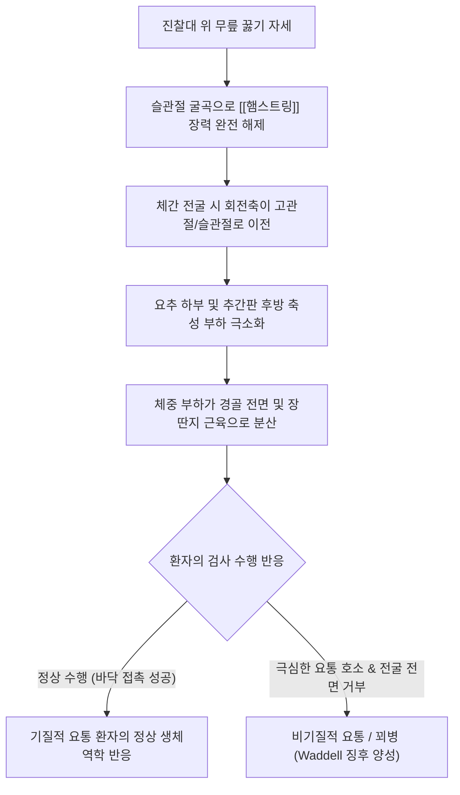

# 번스 벤치 검사 (Burn's Bench Test)

> **핵심 3줄 요약 (Key Summary)**:
> 🎯 환자에게 진찰대나 낮은 벤치 위에 무릎을 꿇고 서게 한 후 발목을 고정한 상태에서 허리를 숙여 바닥에 손을 대도록 지시하는 비기질적 요통 선별 검사이다.
> 🚩 무릎을 꿇은 굴곡 자세에서는 요추 후방 및 추간판에 축성 압박 부하가 걸리지 않으므로, 진성 기질적 요통 환자도 수월하게 바닥을 짚을 수 있다.
> 🔬 체중 부하는 주로 하퇴 전면 및 장딴지에 분산되며, 요통 때문에 굴곡이 전혀 불가능하다고 극심한 통증을 호소하는 경우 꾀병(Malingering) 또는 비기질적 요통(Waddell 징후 범주)을 강력히 시사한다.
> ⚠️ 비기질적 징후가 양성이라고 해서 환자의 통증을 거짓으로 단정하여 적대시하지 말고, 심리적 불안·신체화 장애 및 이차적 이득을 포괄적으로 고려하여 공감적으로 접근해야 한다.

---

## 1. 개요 및 검사 목적

번스 벤치 검사(Burn's Bench Test, 또는 Kneeling Bench Test)는 요통(Low Back Pain)을 호소하는 환자에서 구조적·해부학적 병변에 기인한 **진성 기질적 요통(Organic Low Back Pain)**과, 심리적 불안, 과장된 질병 행동, 신체화 장애, 혹은 산업재해·교통사고 보상과 관련된 **비기질적 요통(Non-Organic Low Back Pain / Malingering / 꾀병)**을 객관적으로 선별 및 감별하기 위해 고안된 대표적인 행동학적 정형외과 검사법이다.

임상에서 와델 징후(Waddell's Non-Organic Signs)와 함께 시행되며, 환자가 의식적으로 통증을 과장하고 있는지, 아니면 척추체나 신경근의 실질적인 물리적 손상에 의해 통증이 유발되는지를 생체역학적 역설(Biomechanical Paradox)을 이용하여 날카롭게 밝혀낸다.

![[burns_bench_clinical_maneuver.jpg|450]]
> **[도해] 번스 벤치 검사(Burn's Bench Test)의 임상 시술 전경**: 환자가 진찰대 위에 무릎을 꿇고 검사자의 지지 하에 체간을 전굴시켜 바닥을 짚는 동작을 수행하고 있다.

---

## 2. 해부학 및 생체역학 기전

### 생체역학 메커니즘

서서 허리를 숙이는 일반적인 체간 전굴(Standing forward bending) 시에는 중력 모멘트 암이 길어지고, 척추 후방 근육군([[척추기립근]], 다열근)의 원심성 수축 부하와 요추간판 후방 섬유륜에 강력한 굴곡-전단 압박력(Flexion-shear stress)이 가해진다. 또한 [[햄스트링]]이 좌골결절을 아래로 잡아당겨 요통과 하지 당김이 악화된다.

그러나 번스 벤치 검사의 무릎 꿇기 자세(Kneeling position)에서는 극적인 생체역학적 역전이 일어난다:
1. **하지 연쇄 장력 차단(Hamstring Tension Release)**:
   - 슬관절이 90도 이상 굴곡된 상태이므로 [[햄스트링]]이 완전히 이완되어 좌골결절에 가해지는 견인 긴장이 완벽히 사라진다.
2. **요추 후방 및 추간판 축성 압박 부하 소실**:
   - 대퇴골이 수직으로 지지되면서 상체를 앞으로 숙일 때 체중의 회전축(Pivot)이 요추가 아닌 **고관절 및 무릎 관절**로 이전된다. 척추의 하부 후방 관절돌기(Facet joints)나 후방 섬유륜에 기계적 압박력이 부하되지 않는다.
3. **하퇴 전면 및 장딴지 스트레스 분산**:
   - 체간이 전방으로 기울어질 때 체중을 지탱하는 저항력은 요추 기립근이 아니라, 진찰대에 닿아 있는 경골 전면부와 하퇴 삼두근([[비복근]], [[가자미근]]) 및 아킬레스건 부위로 집중된다.
4. **생체역학적 결론**:
   - 따라서 심한 요추간판 탈출증(HIVD)이나 척추 협착증 환자라도 이 자세에서는 허리의 압박이 없기 때문에 의외로 편안하게 바닥에 손을 댈 수 있다. 만약 환자가 "허리가 끊어질 것 같아서 조금도 못 숙이겠다"며 동작 자체를 전면 거부한다면, 이는 척추의 물리적 손상 때문이 아니라 통증 행동의 과장이나 비기질적 요인에 의한 것임을 역설적으로 증명한다.

### 검사 시 관여 조직 및 해부학적 구조

| 구조물 분류 | 관여 조직 및 명칭 | 번스 벤치 검사 시 생체역학적 상태 |
| :--- | :--- | :--- |
| **요추 척추체** | L4-L5, L5-S1 추간판 및 후관절 | 축성 압박 부하 및 전단 응력이 극소화됨 (통증 유발 인자 부재) |
| **이완 근육군** | [[햄스트링]], [[장요근]] | 슬관절 굴곡 및 고관절 위치로 인해 긴장도가 완전히 풀림 |
| **스트레스 부하 조직** | [[비복근]], [[가자미근]], 경골 전면 골막 | 체간 전굴 시 체중 모멘트를 지탱하는 주요 긴장 조직 |
| **신경계** | [[좌골신경]], 요수 신경근 | 신경근 신장 스트레스가 거의 발생하지 않는 안전한 궤적 |

---

## 3. 검사 방법 및 절차

### 검사 전 준비
1. 높이 약 30~45cm 정도의 안정적인 진찰대나 벤치를 준비한다.
2. 환자에게 요통 평가를 위한 균형 및 가동성 검사임을 담담하게 안내하여 검사의 목적(꾀병 감별)을 눈치채지 못하도록 자연스러운 분위기를 조성한다.

### 단계별 시행 절차

#### 1단계: 벤치 위 무릎 꿇기 및 발목 고정 (Step 1)
- 환자에게 신발을 벗고 진찰대 위에 올라가 무릎을 꿇고 서도록(Kneeling posture) 안내한다.
- 환자의 대퇴부와 체간이 수직을 이루도록 하고, 검사자는 환자의 뒤나 옆에서 한 손으로 환자의 발목 관절(Ankle joint)을 가볍게 잡아주어 낙상 불안감을 덜어주고 신체적 안정을 제공한다.

![[burns_bench_step1_kneeling_position.jpg|320]]
> **[Step 1] 무릎 꿇기 준비 자세**: 환자가 진찰대 위에 무릎을 꿇고 서서 체간을 곧게 세우며, 검사자는 발목을 안정적으로 지지한다.

#### 2단계: 체간 전굴 및 바닥 터치 지시 (Step 2)
- 환자에게 "상체를 천천히 앞으로 숙여 양손의 손가락 끝으로 바닥을 가볍게 짚어보세요"라고 명확히 지시한다.
- 환자가 상체를 숙이는 동안 요통 호소 여부, 전굴 각도, 그리고 허리를 굽히지 못한다고 거부하는 양상을 세밀하게 관찰한다.
- 정상적인 기질적 환자는 하퇴부의 뻐근함을 느끼면서도 손으로 바닥을 무리 없이 짚어낸다.

![[burns_bench_step2_floor_touch.jpg|320]]
> **[Step 2] 체간 굴곡 및 바닥 접촉**: 햄스트링과 요추 후방 압박이 해제된 상태에서 상체를 전굴하여 바닥을 터치하도록 유도한다.

### 검사 시연 영상
- [Burn's Bench Test Maneuver for Non-Organic Low Back Pain](https://www.youtube.com/watch?v=zKhNwkJ1E3I)
- [Waddell's Non-Organic Signs & Malingering Evaluation](https://www.youtube.com/watch?v=QB5nuRZ9fbY)

---

## 4. 양성 판정 기준 및 임상적 의의

### 판정 기준

| 검사 반응 (Response) | 임상적 판정 | 병태생리 및 행동학적 의미 |
| :--- | :--- | :--- |
| **음성 (정상 반응)** | 기질적 요통 또는 정상 | 허리 디스크나 협착증이 있어도 요추 부하가 없으므로 바닥에 손이 무리 없이 닿음 (장딴지에만 스트레스 발생) |
| **양성 (비기질적 반응)** | **비기질적 요통 / 꾀병 의심** | 허리를 조금도 숙이지 못하겠다며 극심한 요통을 호소하거나, 벤치에서 떨어질 듯 과장된 회피 동작을 보임 |

### 진단 정확도 지표 (Waddell 범주)

| 통계 지표 | 수치 범위 | 임상적 해석 |
| :--- | :--- | :--- |
| **특이도 (Specificity)** | 85% ~ 92% | 음성일 때 기질적 척추 질환의 가능성을 배제하지 않으나, 양성 시 비기질적 요인 시사율이 매우 높음 |
| **민감도 (Sensitivity)** | 55% ~ 68% | 단독 검사로는 위음성이 있을 수 있어 후버 검사, 플립 검사 등과 배터리로 병행 필수 |

---

## 5. 감별 진단 및 유사 검사

비기질적 통증 행동 및 꾀병을 감별하는 정형외과·신경학적 검사들과 비교 분석한다.

| 검사명 | 감별 대상 | 검사 방법 및 불일치 기전 | 임상적 특징 |
| :--- | :--- | :--- | :--- |
| **번스 벤치 검사** | 비기질적 요통, 통증 행동 과장 | 무릎 꿇고 상체 숙여 바닥 짚기 | 요추 압박이 전혀 없는 자세에서의 전굴 거부 확인 |
| [[플립 검사]] (Flip Test) | 비기질적 좌골신경통 감별 | 앙와위 SLR 양성 후 **좌위에서 다리 신전** | 누워서 30도에 소리 지르던 환자가 앉아서 90도 펴도 멀쩡함 |
| [[후버 검사]] (Hoover Test) | 하지 편마비 및 근력 약화 꾀병 | 발뒤꿈치 받치고 하지 직거상 유도 | 건측 거상 시 마비측 발뒤꿈치 하방 불수의 압력(짝힘) 유무 확인 |
| 와델 축성 압박 검사 | 비기질적 척추 통증 | 기립 상태에서 머리 정수리를 수직 압박 | 경미한 두부 압박에 극심한 요통을 호소하는 불일치 탐지 |
| 와델 모의 회전 검사 | 비기질적 회전 통증 | 골반과 어깨를 통째로 잡고 회전 | 척추 분절 간 비틀림이 없는데도 심한 요통을 호소함 |

---

## 6. 주의사항 및 위양성/위음성 요인

### 위양성(False Positive) 요인 (주의 필수)
1. **심한 무릎 관절염 및 슬개골 병변**: 슬관절 골관절염, 슬개건염, 무릎 인공관절 치환술 환자는 무릎을 꿇는 자세 자체에서 극심한 무릎 통증이 발생하여 검사를 수행하지 못할 수 있다.
2. **심한 고관절 굴곡 구축 및 비구순 병변**: 고관절 굴곡 자체가 불가능한 환자는 요통과 무관하게 상체를 숙일 수 없다.
3. **고령자의 균형 장애 및 낙상 공포증**: 전정기관 장애나 근감소증이 있는 고령자는 높은 벤치에서 머리를 아래로 숙일 때 어지럼증과 공포감으로 인해 검사를 거부할 수 있다.

### 검사자의 진료 태도 주의점
- 이 검사는 환자를 함정에 빠뜨리거나 조롱하기 위한 검사가 아니다. 양성이 나왔다고 해서 차트에 "꾀병 환자"라고 단정적으로 적거나 환자에게 면박을 주어서는 안 되며, 심리적 지지와 통증 완화적 신뢰 형성이 우선되어야 한다.

---

## 7. 진료실 핵심 임상 필기

### 💡 원장실 실전 노하우 & 진료실 체크리스트
- **원문 필기 100% 융합 및 실전 적용**:
  - 원문 기록: *"진찰대에 무릎을 꿇게 하고 발목을 고정한 다음 바닥에 손이 닿도록 지시함. 요통을 호소하는 환자에게도 이 검사는 척추의 하부후방에 압력이 가해지지 않기 때문에 쉽게 굴곡될 수 있음. 요통 때문에 이 검사가 불가능하다는 경우는 꾀병으로 생각됨. 원래 이 검사에서는 장딴지 쪽에 스트레스가 가해지는 것."*
  - **진료실 자연스러운 연출법**: 환자에게 절대로 "당신이 진짜 아픈지 가짜인지 보겠다"는 인상을 주어서는 안 된다. "허리 뒤쪽 근육의 이완 상태와 관절의 고유수용성 감각을 부드럽게 점검해 보겠습니다"라고 자연스럽게 안내하며 벤치에 무릎을 꿇게 한다.
  - **장딴지 긴장감 실시간 촉진**: 환자가 상체를 숙일 때 검사자의 손으로 환자의 종아리(비복근)를 살짝 짚어본다. 정상적으로 상체를 숙이면 종아리 근육이 팽팽해지는 탄성 스트레스가 감지된다. 이때 환자가 "허리가 아프다"고 하는지, "종아리 뒤가 당긴다"고 하는지 문진하여 환자의 통증 진술의 신빙성을 평가한다.
  - **교통사고 및 산재 합의 전 필수 선별: 수상 경과에 비해 비정상적으로 치료 기간이 길어지거나 가벼운 접촉사고인데도 일상생활이 전혀 불가능하다고 주장하는 환자에서 [[플립 검사]], [[후버 검사]]와 함께 번스 벤치 검사를 시행하여 비기질적 와델 징후군(Waddell's signs)을 체계적으로 감별 차팅한다.

### 🗣️ 환자 티칭 & 설명 스크립트
> "환자분, 지금 무릎을 꿇고 허리를 숙이는 동작을 해보셨습니다. 이 자세는 우리 몸의 허벅지 뒷근육([[햄스트링]])이 완전히 풀리고, 허리 뼈와 디스크에 실리는 무게 압력이 '0'에 가깝게 사라지는 특수한 자세입니다. 실제로 허리 디스크가 심하게 터진 환자분들도 이 자세에서는 허리 통증 없이 바닥을 쉽게 터치할 수 있습니다. 그런데 환자분께서는 이 자세에서 허리가 끊어질 듯 아프다고 느끼셨습니다. 이것은 허리 뼈 자체의 물리적 손상 때문이라기보다는, 오랫동안 통증을 겪으시면서 허리 주변 신경망과 뇌의 통증 감각 센서가 극도로 예민해져서(중추감작) 작은 움직임에도 뇌에서 극심한 위험 신호를 보내고 있기 때문입니다. 뼈에 큰 이상이 있어서가 아니므로 너무 불안해하지 마시고, 신경을 안정시키고 근육 긴장을 풀어주는 침 치료와 이완 치료를 병행하시면 충분히 편안해지실 수 있습니다."

### 🌿 한의 임상 치료 연계 프로토콜
- **심인성·비기질적 요통의 한의학적 변증 치료**:
  - **간기울결(肝氣鬱結) 및 심신불교(心腎不交)**: 통증 과장, 불안, 불면, 우울감이 동반된 비기질적 요통 환자에게 귀비탕(歸脾湯), 시호소간산(柴胡疏肝散), 또는 분심기음(分心氣飮) 처방.
  - **기체어혈(氣滯瘀血)**: 국소 부위의 고정된 통증이 아닌 유주성 통증 호소 시 신통축어탕(身痛逐瘀湯) 활용.
- **침구 및 이완 요법**:
  - 심신 안정 혈자리: 백회(GV20), 인당(EX-HN3), 신문(HT7), 태충(LR3) 자침을 통해 교감신경 항진을 가라앉힘.
  - 요부 온열 요법 및 부항: 강한 자극보다는 부드러운 간접구(뜸)와 건식 부항으로 요부 근육의 방어적 긴장(Guarding)을 점진적으로 해제.

---

## 8. 참고문헌 및 학술 연구 (References)

1. **Waddell Sign.**
   - 저자: D'Souza RS, Dowling TJ, Law L.
   - 저널: *StatPearls Publishing*. 2026 Jan (Updated 2023).
   - PMID: [30137776](https://pubmed.ncbi.nlm.nih.gov/30137776/) | Bookshelf ID: [NBK519492](https://www.ncbi.nlm.nih.gov/books/NBK519492/)
   - `[연구 요약]`: 만성 요통 환자에서 와델 징후군(번스 벤치 검사, 플립 검사, 모의 압박 및 회전 검사 등)의 생체역학적·심리학적 진단 타당성을 고찰하고, 비기질적 징후 양성과 만성 통증 증후군 간의 밀접한 연관성을 규명함.

2. **Waddell (Nonorganic) Signs and Their Association With Interventional Treatment Outcomes for Low Back Pain.**
   - 저자: Cohen SP, Doshi TL, Kurihara C, et al.
   - 저널: *Anesth Analg*. 2021 Mar 1;132(3):867-877.
   - PMID: [32701541](https://pubmed.ncbi.nlm.nih.gov/32701541/) | DOI: [10.1213/ANE.0000000000005085](https://doi.org/10.1213/ANE.0000000000005085)
   - `[연구 요약]`: 요통 환자에서 비기질적 징후의 존재가 주사 치료 및 중재적 시술의 결과에 미치는 부정적 영향을 대규모 코호트로 분석하여, 침습적 시술 전 비기질적 요통 선별의 중요성을 역설함.

3. **Nonorganic physical signs in low-back pain.**
   - 저자: Waddell G, McCulloch JA, Kummel E, Venner RM.
   - 저널: *Spine (Phila Pa 1976)*. 1980 Mar-Apr;5(2):117-25.
   - PMID: [6446157](https://pubmed.ncbi.nlm.nih.gov/6446157/) | DOI: [10.1097/00007632-198003000-00005](https://doi.org/10.1097/00007632-198003000-00005)
   - `[연구 요약]`: 요통의 신체화 장애 및 질병 행동을 평가하는 5개 범주의 비기질적 이학적 검사 체계를 정립한 역사적 랜드마크 연구로, 번스 벤치 검사 등의 기능적 평가 원리를 최초로 체계화함.

<!-- 보관 태그(1회용·링크오류, 필요시 복원): 비기질적요통, Waddell징후 -->
