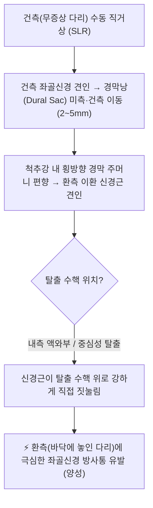
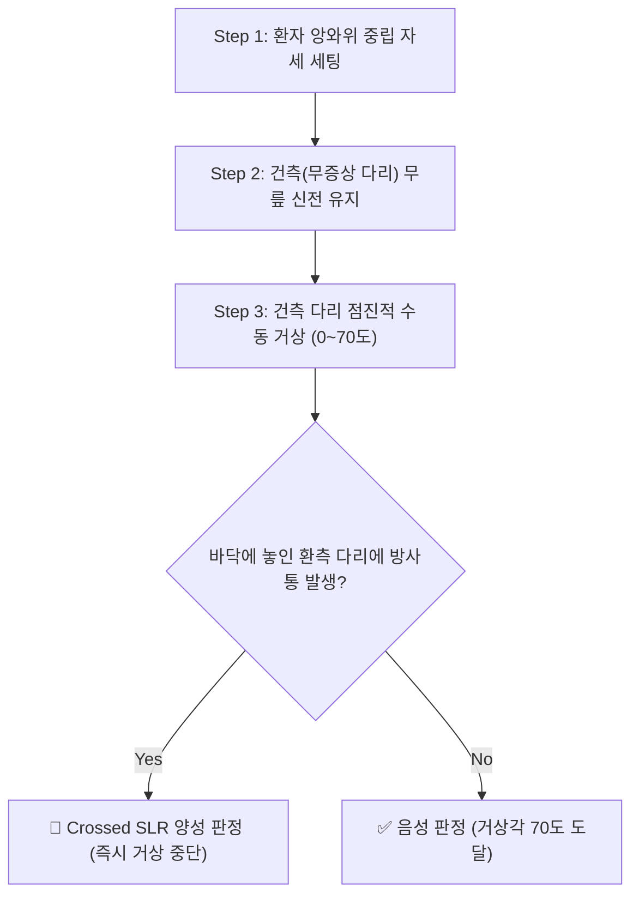

# 🩺 [[Crossed Straight Leg Raise Test]] (교차 하지직거상 검사 / Well Leg Raising Test)

> **핵심 3줄 요약 (Key Summary)**:
> - 🎯 **검사 목적 & 타겟 병소**: [[요추 추간판 탈출증]](HNP)으로 인한 L4, L5, S1 [[좌골신경]] 신경근 압박 및 거대 수핵 탈출(중심성·액와부 탈출) 감별.
> - 🔍 **검사 시행 프로토콜 & 양성 반응**: 건측(무증상 다리)을 수동으로 직거상할 때, 이환된 반대편 환측 다리 및 요부에 전형적인 좌골신경 방사통이 재현됨.
> - 📊 **진단 정확도(민감도·특이도) & 임상적 의의**: 민감도는 23~43%로 낮으나 **특이도가 88~98%**에 달해, 양성 시 추간판 탈출증을 사실상 확진할 수 있는 강력한 확진(Rule-In) 검사.
> - ⚠️ **위양성/위음성 요인 & 검사 주의**: 햄스트링 단축에 의한 단순 후면 당김은 음성이며, 양성 확인 시 급격한 회전 추나는 신경근 손상 위험으로 절대 금기.

---

## 📌 목차
1. [검사 기본 정보 & 진단 목적 (Diagnostic Overview)](#1-검사-기본-정보--진단-목적-diagnostic-overview)
2. [해부학적 유발 메커니즘 & 생체역학적 원리 (Biomechanical Mechanism)](#2-해부학적-유발-메커니즘--생체역학적-원리-biomechanical-mechanism)
3. [표준 검사 시행 절차 (Step-by-Step Clinical Protocol)](#3-표준-검사-시행-절차-step-by-step-clinical-protocol)
4. [양성 반응 판정 기준 & 신경근/조직별 감별 맵핑 (Diagnostic Criteria & Mapping)](#4-양성-반응-판정-기준--신경근조직별-감별-맵핑-diagnostic-criteria--mapping)
5. [연관 검사군 비교 & 다단계 감별 알고리즘 (Differential Battery & Algorithm)](#5-연관-검사군-비교--다단계-감별-알고리즘-differential-battery--algorithm)
6. [양성 소견 시 한·양방 임상 연계 전략 (Integrative Korean Medicine & Referral)](#6-양성-소견-시-한양방-임상-연계-전략-integrative-korean-medicine--referral)
7. [💡 사용자 진료실 핵심 필기 & 실전 임상 팁 (원문 보존)](#7--사용자-진료실-핵심-필기--실전-임상-팁-원문-보존)
8. [출처 및 학술 참고 문헌 (References)](#8-출처-및-학술-참고-문헌-references)

---

## 1. 검사 기본 정보 & 진단 목적 (Diagnostic Overview)

![[건측하지직거상_2단계_경막견인_중심성디스크병태도해.jpg|450]]
> [그림 1: ① 타겟 해부 도해 — 건측 하지 거상 시 경막낭과 척수신경근이 반대측(하방 및 건측)으로 견인되며, 환측의 이환된 신경근이 탈출된 수핵 덩어리에 강하게 압박되는 생체역학적 기전. 출처: Wikimedia Commons (CC BY-SA 4.0)]

| 항목 | 상세 내용 |
| :--- | :--- |
| **검사명 (Test Name)** | Crossed Straight Leg Raise Test (교차 하지직거상 검사 / Well Leg Raising Test / Fajersztajn Test) |
| **분류 (Category)** | 신경학적 유발 검사 / 경막 및 신경근 장력 검사 (Dural Tension Test) |
| **타겟 병소 (Target)** | L4, L5, S1 척수 신경근, 경막낭(Dural sac), 요추 [[추간판]] |
| **의심 질환 (Suspected Pathologies)** | [[요추 추간판 탈출증]](HNP), 요추 신경근병증, 마미총 압박 |
| **진단 정확도 (Diagnostic Accuracy)** | • **민감도 (Sensitivity)**: 23% ~ 43% (선별 가치는 낮음) • **특이도 (Specificity)**: **88% ~ 98%** (확진 가치 극도로 우수) • **양성 우도비 (LR+)**: **4.0 ~ 12.0** |
| **시연 영상 (Video Guide)** | [🎥 시연 영상: Physiotutors - Crossed Straight Leg Raise Test](https://www.youtube.com/watch?v=F_f9m9U6k8c) |

---

## 2. 해부학적 유발 메커니즘 & 생체역학적 원리 (Biomechanical Mechanism)

### 1) 해부학적 스트레스 전달 경로
* 정상적으로 하지직거상 시 35도 이상에서 동측의 [[좌골신경]]과 요천추 신경근이 미측으로 약 2~5mm 활주 견인됨.
* 통증이 없는 건강한 쪽(건측) 다리를 들어 올릴 때도 경막관의 해부학적 연속성으로 인해 요추 척추강 내 경막 주머니 전체가 건측 및 미측으로 편향 견인됨.
* 이때 환측의 이환된 신경근이 척추관 중심 방향으로 끌려오면서, 척추강 내측 액와부(Axilla)나 중심부에 돌출된 수핵 덩어리에 걸려 강하게 압박을 받음.

### 2) 통증 유발의 신경생리학적 기전
* 탈출된 디스크에 의해 이미 만성 화학적 염증(PLA2, TNF-alpha)으로 감작된 환측 신경근에 기계적 신장 응력이 순간적으로 가해짐.
* 신경근 혈류 차단에 따른 허혈(Ischemia)과 이소성 축삭 방전(Ectopic axonal discharge)이 격발되어 환측 피부분절을 따라 전형적인 방사통이 재현됨.

---

## 3. 표준 검사 시행 절차 (Step-by-Step Clinical Protocol)

### Step 1: 환자 준비 및 초기 자세 (Starting Position)
![[하지직거상검사_1단계_앙와위_시작자세세팅.jpg|400]]
> [그림 2: 1단계 — 환자를 검사 테이블에 편안히 눕히고 목과 허리를 중립위로 유지하며 양다리를 곧게 펴는 시작 자세 세팅 — 출처: Physiotutors (Crossed Straight Leg Raise Test Demonstration)]

* 환자를 검사 테이블에 편안히 바로 눕힘(앙와위, Supine position).
* 베개는 낮게 받치고 목이나 허리가 과도하게 굴곡되지 않도록 중립위를 유지하며, 양다리를 곧게 폄.

### Step 2: 1차 유발 기동 (Maneuver - 건측 수동 거상)
![[건측하지직거상_1단계_건측다리거상_실사.jpg|400]]
> [그림 3: 2단계 — 검사자가 통증이 없는 건강한 쪽(건측) 다리를 잡고 슬관절 신전을 유지한 채 천천히 수동 거상하는 모습 — 출처: Wikimedia Commons / Physiotutors]

* 검사자는 환자의 통증이 없는 건강한 쪽(건측) 다리 옆에 위치함.
* 한 손은 환자의 무릎 전면을 가볍게 받쳐 슬관절이 굽혀지지 않도록 신전 상태를 유지하고, 다른 손은 발목 뒤쪽(아킬레스건 부위)을 감싸 쥠.
* 건측 다리를 천천히 수동으로 들어 올림.

### Step 3: 2차 각도별 반응 확인 및 각도 측정 (Assessment)
![[하지직거상검사_3단계_방사통유발_거상각도측정.jpg|400]]
> [그림 4: 3단계 — 건측 하지 거상 각도를 점진적으로 증가시키며 바닥에 놓인 환측(반대쪽 다리)에 전형적인 좌골신경 방사통이 유발되는 순간의 각도를 측정하는 모습 — 출처: Wikimedia Commons (CC BY-SA 3.0)]

* 들어 올리는 동안 환자에게 들고 있는 다리가 아니라 **바닥에 놓여 있는 반대쪽(환측) 다리에 통증이나 저림이 발생하는지** 확인함.
* 환측 다리의 둔부, 대퇴 후면, 종아리, 족부로 찌릿한 방사통이 유발되는 순간 즉시 거상을 멈추고 각도를 기록함.

---

## 4. 양성 반응 판정 기준 & 신경근/조직별 감별 맵핑 (Diagnostic Criteria & Mapping)

![[Crossed_SLR_하지직거상검사_동작도해.gif|320]]
> [그림 5: 교차 하지직거상 검사 거상 각도별(30°~70°) 신경근 장력 발생 및 양성 판정 기준 모식도 — 출처: Wikimedia Commons (CC BY-SA 4.0)]

* **진정한 양성 반응 (True Positive)**:
  * 건측 다리를 30~70도 거상하는 도중, **바닥에 놓인 환측 하지에 전형적인 좌골신경 방사통**이 명확히 유발되는 경우.
* **음성 반응 (Negative)**:
  * 건측 다리를 70도 이상 거상해도 환측 하지에 아무런 통증이 유발되지 않음.
* **가양성 (False Positive) 감별**:
  * 거상하고 있는 건측 허벅지 뒤쪽의 단순 햄스트링 당김이나 요통은 음성으로 판정.

| 병변 분절 / 신경근 | 전형적 방사통 및 감각 이상 부위 | 주요 근력 저하 지표 | 심부건반사 (DTR) 변화 |
| :--- | :--- | :--- | :--- |
| **L4 신경근 (L3-L4 HNP)** | 대퇴 전면부, 슬개골 내측, 하퇴 전내측 | 대퇴사두근 (무릎 신전 약화) | 슬개건반사(PTR) 저하 |
| **L5 신경근 (L4-L5 HNP)** | 둔부 외측, 대퇴 외측, 하퇴 전외측, 족배부(엄지발가락) | [[전경골근]], 장무지신근 (족배굴곡 약화, 족하수) | 특이적 건반사 없음 |
| **S1 신경근 (L5-S1 HNP)** | 둔부 후면, 대퇴 후면, 종아리 후면, 발바닥 및 외측연 | 비복근, 가자미근 (족저굴곡 약화, 까치발 불가) | 아킬레스건반사(ATR) 저하 |

---

## 5. 연관 검사군 비교 & 다단계 감별 알고리즘 (Differential Battery & Algorithm)

| 검사명 | 검사 수기 및 동작 | 병태생리적 원리 | 임상적 역할 (선별 vs 확진) |
| :--- | :--- | :--- | :--- |
| **[[Crossed Straight Leg Raise Test]] (본 검사)** | 건측 다리 수동 거상 | 경막 횡방향 견인으로 환측 신경근을 수핵에 압박 | **특이도 88~98% (확진용 Rule-In 검사)** |
| **일반 [[하지직거상 검사]](SLR)** | 환측 다리 수동 거상 | 환측 좌골신경 직접 신장 | **민감도 75~90% (선별용 Rule-Out 검사)** |
| **[[브라가드 검사]](Bragard's Test)** | SLR 양성 각도 직전 발목 족배굴곡 | 경골신경 추가 견인으로 신경성 감별 | 가양성 햄스트링 단축 감별 |
| **[[슬럼프 검사]](Slump Test)** | 척추 전굴 + 무릎 신전 + 발목 족배굴곡 | 전 척수 신경축 최대 긴장 유발 | 초기 또는 잠재적 신경근 장력 선별 |

* **[[이상근 증후군]](Piriformis Syndrome)과의 감별**:
  * 이상근 증후군은 국소 근육의 좌골신경 포착이므로, 환측 SLR 시 둔부 통증이 나타날 수 있으나 건측을 들어 올리는 Crossed SLR에서는 절대로 반대편 통증이 재현되지 않음.
* **[[척추관 협착증]](Spinal Stenosis)과의 감별**:
  * 협착증 환자는 신경인성 간헐적 파행(Claudication)이 주증상이며, Crossed SLR은 음성임.

---

## 6. 양성 소견 시 한·양방 임상 연계 전략 (Integrative Korean Medicine & Referral)

* **침구 및 전침 치료 (Acupuncture & EA)**:
  * 요추 4~5번 및 요천추 협척혈(Huatuojiaji), 대장수(BL25), 관원수(BL26), 환도(GB30), 위중(BL40), 양릉천(GB34) 배혈.
  * 2Hz 저주파 전침 통전으로 신경근 압박 부위 미세 순환 촉진 및 신경 부종 완화.
* **약침 요법 (Pharmacopuncture)**:
  * 신경근 출구부([[추간공]]) 및 관절돌기 부근에 [[신바로약침]] 또는 [[중성어혈약침]](1.0~2.0cc)을 심부 주입하여 무균성 신경근염 제어.
* **추나 치료 (Chuna Therapy)**:
  * ⚠️ **급성기 고속저진폭(HVLA) 요추 회전 추나 절대 금기**: 수핵 파편을 신경근 쪽으로 더 밀어넣어 영구적 마비를 초래할 수 있음.
  * **굴곡-신연 추나(Cox Table Decompression)**: 척추강 내압을 음압(-100mmHg)으로 유도하는 안전한 축성 감압 기법 적용.
* **한약 치료 (Herbal Medicine)**:
  * 급성 신경근 염증기: 어혈과 부종을 배출하는 [[당귀수산]], 활혈지통 처방.
  * 만성 신경근 압박기: 신경 재생을 돕는 [[독활기생탕]], [[오적산]] 가감.
* **양방 치료 연계 & 전문과 의뢰 기준 (Referral Criteria)**:
  * Crossed SLR 양성은 수핵 파열(Sequestration) 또는 대형 탈출의 가능성이 높으므로 요추 [[MRI]] 및 [[근전도 검사]](EMG) 정밀 영상 의뢰.
  * 🚨 **즉각적 응급 수술 의뢰 (Red Flags)**:
    * 배뇨 장애, 항문 괄약근 톤 소실, 안장 감각 마비(Saddle anesthesia) 동반 시 **[[마미 증후군]]** 의심으로 48시간 이내 응급 감압술 의뢰.
    * 족하수(Foot drop, 발목 족배굴곡 근력 Grade 3 이하의 급격한 진행).

---

## 7. 💡 사용자 진료실 핵심 필기 & 실전 임상 팁 (원문 보존)

* **진료실 예후 판정의 결정적 잣대**:
  * 일반 SLR만 양성인 환자는 보존적 한의 치료(침, 약침, 당귀수산)로 4~8주 내에 80% 이상 호전된다.
  * 그러나 **Crossed SLR이 양성인 환자**는 수핵이 척추관 안쪽 액와부로 심하게 터져 나온 중증 파열인 경우가 대부분이다.
  * 환자에게 치료 기간을 최소 2~3달 이상 길게 설명해야 하며, 수술적 치료 가능성을 사전에 고지해야 의료 분쟁을 예방할 수 있다.
* **검사 안전 가이드**:
  * 건측 다리를 급격하게 차올리듯 들어 올리면 환측 신경근에 가위질하듯 날카로운 충격 손상이 가해지므로, 반드시 5초 이상에 걸쳐 아주 부드럽고 천천히 거상해야 한다.

---

## 8. 출처 및 학술 참고 문헌 (References)

1. **Devillé WL, et al**. (2000). The test of Lasegue: systematic review of the accuracy in predicting herniated discs. *Spine (Phila Pa 1976)*, 25(9):1140-1147. [PMID 10788860](https://pubmed.ncbi.nlm.nih.gov/10788860/)
   - **[연구 요약]**: 요추 추간판 탈출증 환자를 대상으로 한 하지직거상 및 교차 하지직거상 검사의 진단적 정확도에 대한 체계적 문헌고찰. Crossed SLR의 특이도가 88~98%에 달하여 디스크 확진에 가장 우수한 검사임을 통계적으로 규명함.
2. **Rabin CA, et al**. (2007). Sensitivity and specificity of physical examination tests for lumbar disc herniation. *J Man Manip Ther*, 15(2):E33-E41. [PMID 19066655](https://pubmed.ncbi.nlm.nih.gov/19066655/)
   - **[연구 요약]**: 요추 신경근병증 환자군에서 다양한 정형외과적 이학 검사의 민감도와 특이도를 전향적으로 비교 분석하고, Crossed SLR의 높은 양성 우도비(LR+ > 4.0)를 입증함.
3. **Magee, D. J**. (2014). *Orthopedic Physical Assessment* (6th ed.). Saunders. 요추 및 골반 신경학적 검사 단원 (pp. 570-620).
4. **Physiopedia**. *Well Leg Raise Test / Crossed Straight Leg Raise Test*. [Physiopedia Reference](https://www.physio-pedia.com/Well_Leg_Raise_Test)
