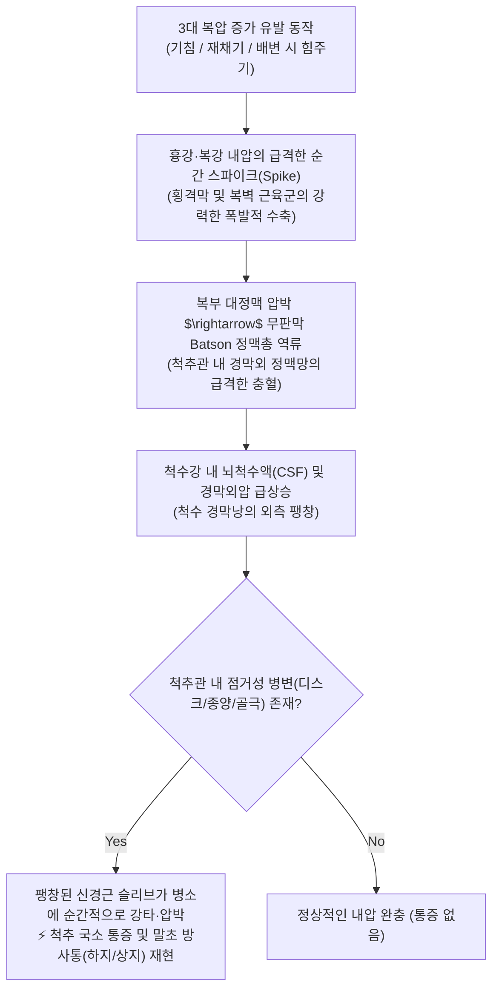
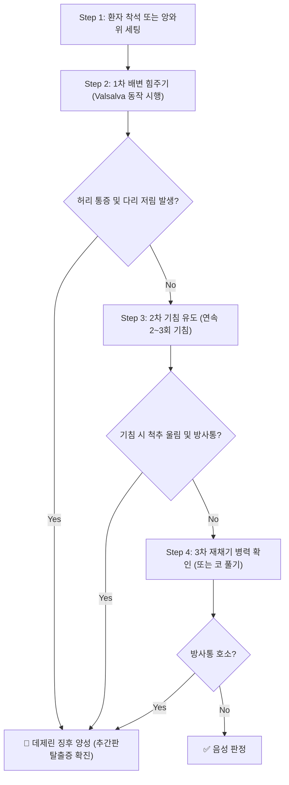

---
aliases:
  - "Dejerene's triad"
  - "Dejerine's Triad"
  - "데제린 3징후"
  - "데제린 삼징후"
tags:
  - 근골격계
  - 이학적검사
  - 요추
  - 추간판탈출증
  - 복압
title: "Dejerene's triad"
date: 2026-09-15
출처: "https://www.youtube.com/watch?v=-ceSV5qA_GQ"
---

# 🩺 [[Dejerene's triad]] (데제린 3징후 / Dejerine's Triad Sign)

> **핵심 3줄 요약 (Key Summary)**:
> - 🎯 검사 목적 & 타겟 병소: 척추강 내 공간 점유성 병변([[추간판 탈출증]], 척추 골극, 척수 종양, 연부조직 부종)에 의한 척수 신경근 압박 감별, 3가지 일상적 복압 증가 동작(기침, 재채기, 배변 시 힘주기)을 통한 지주막하 척수강 내압(Intrathecal pressure) 유발 평가.
> - 🔍 검사 시행 프로토콜 & 양성 반응: 환자를 바로 눕히거나 편안히 앉힌 상태에서 기침(Coughing), 재채기(Sneezing), [[Valsalva test]]처럼 배변하듯 하복부에 힘주기(Straining)의 3가지 동작을 시행하게 하여, 허리 국소 통증 악화 및 하지(또는 상지)로 전격적인 방사통이 뻗칠 때 양성.
> - 📊 진단 정확도(민감도·특이도) & 임상적 의의: 민감도(Sensitivity) 약 25~35%로 선별력은 제한적이나, 특이도(Specificity) 약 94~97%로 매우 높아 3가지 중 하나 이상에서 방사통 유발 시 [[추간판 탈출증]]을 강력히 확진(Rule-In).
> - ⚠️ 위양성/위음성 요인 & 검사 금기: 급성 늑골 골절, 복부 탈장, 중증 심혈관 질환 환자 시 과도한 기침/힘주기 주의, 단순 늑간근/요방형근 근육통 환자의 기침 시 국소 통증을 신경근 방사통과 명확히 구별 필요.

---

## 📌 목차
1. [검사 기본 정보 & 진단 목적 (Diagnostic Overview)](#1-검사-기본-정보--진단-목적-diagnostic-overview)
2. [해부학적 유발 메커니즘 & 생체역학적 원리 (Biomechanical Mechanism)](#2-해부학적-유발-메커니즘--생체역학적-원리-biomechanical-mechanism)
3. [표준 검사 시행 절차 (Step-by-Step Clinical Protocol)](#3-표준-검사-시행-절차-step-by-step-clinical-protocol)
4. [양성 반응 판정 기준 & 신경근/조직별 감별 맵핑 (Diagnostic Criteria & Mapping)](#4-양성-반응-판정-기준--신경근조직별-감별-맵핑-diagnostic-criteria--mapping)
5. [연관 검사군 비교 & 다단계 감별 알고리즘 (Differential Battery & Algorithm)](#5-연관-검사군-비교--다단계-감별-알고리즘-differential-battery--algorithm)
6. [양성 소견 시 한의 임상 연계 치료 전략 (Integrative Korean Medicine)](#6-양성-소견-시-한의-임상-연계-치료-전략-integrative-korean-medicine)
7. [💡 사용자 진료실 핵심 필기 & 실전 임상 팁 (원문 보존)](#7--사용자-진료실-핵심-필기--실전-임상-팁-원문-보존)
8. [출처 및 학술 참고 문헌 (References)](#8-출처-및-학술-참고-문헌-references)

---

## 1. 검사 기본 정보 & 진단 목적 (Diagnostic Overview)

![[발살바검사_1단계_폐쇄성호기_복압증가_실사.jpg|450]]
> [그림 1: 데제린 3징후의 복압 유발 평가 - 성문을 닫고 배변하듯 하복부에 강한 힘을 주거나 기침을 유도하여 척수강 내압을 순간적으로 높이는 모습]

![[발살바검사_2단계_척추강내압_신경근자극_도해.jpg|500]]
> [그림 2: 데제린 3징후의 신경학적 발생 기전 - 기침·재채기·힘주기 시 복압 급상승이 Batson 정맥총을 거쳐 척수 경막낭을 외측으로 팽창시키며 신경근을 압박하는 메커니즘 도해]

| 항목 | 상세 내용 |
| :--- | :--- |
| **검사명 (Test Name)** | Dejerine's Triad (데제린 3징후 / Dejerine Sign) |
| **3대 구성 요소** | ① 기침 (Coughing) ② 재채기 (Sneezing) ③ 배변 시 힘주기 (Straining at stool / [[Valsalva test]]) |
| **분류 (Category)** | 척수강 내압 유발 검사 (Intrathecal Pressure Test) / 병력 청취 및 유발 이학적 징후 |
| **타겟 병소 (Target)** | 척추관(Spinal canal), 척수 경막낭(Dural sac), 요천추 및 경추 신경근(Spinal nerve roots) |
| **의심 질환 (Suspected Pathologies)** | 요추 [[추간판 탈출증]](Lumbar Disc Herniation), 경추 추간판 탈출증, 척수 종양, 척추 골극, 황색인대 비후 |
| **진단 정확도 (Diagnostic Accuracy)** | • **민감도 (Sensitivity)**: 25% ~ 35% (음성이라도 디스크 완전 배제 불가) • **특이도 (Specificity)**: 94% ~ 97% (기침·재채기 시 다리 방사통 재현 시 디스크 확진 가치 극대화) • **양성 우도비 (LR+)**: 4.0 ~ 5.5 |
| **시연 영상 (Video Guide)** | [🎥 시연 영상: Clinically Relevant - Valsalva Test](https://www.youtube.com/watch?v=-ceSV5qA_GQ) |

---

## 2. 해부학적 유발 메커니즘 & 생체역학적 원리 (Biomechanical Mechanism)

### 1) 데제린 3대 동작의 충격성 복압 상승 기전
* 프랑스의 신경학자 조제프 쥘 데제린(Joseph Jules Dejerine)이 1914년에 정립한 3대 병태생리 징후입니다.
* **기침(Coughing)**과 **재채기(Sneezing)**는 횡격막과 복부 복직근·복사근이 순간적으로 폭발적인 등척성 수축을 일으켜 복강 내압을 100~300mmHg 이상으로 급격히 치솟게 만듭니다.
* **배변 시 힘주기(Straining)는 성문을 닫고 지속적으로 복압을 유지하는 등척성 수축 기전([[Valsalva test]])입니다.

### 2) 척수강 내압(Intrathecal Pressure) 급상승과 경막낭 팽창
* 판막이 없는 **Batson 경막외 정맥총(Batson's plexus)**은 복강과 흉강의 압력 변화를 1:1로 척추관 내부에 전달합니다.
* 복압이 급증하면 정맥혈이 척추관 내부로 역류하여 경막외 정맥들이 순식간에 부풀어 오릅니다.
* 이로 인해 척추관 내부의 뇌척수액(CSF) 압력과 경막낭 내압이 급증하면서 척수 경막낭(Dural sac)이 팽창하여 척추관의 벽 쪽으로 밀려납니다.
* 추간판 돌출(Disc herniation)이나 척추 골극, 종양 등 공간 점유성 병변이 있는 부위에서는 팽창된 신경근이 병소와 충돌하며 전격적인 신경 방사통이 폭발하듯 유발됩니다.

---

## 3. 표준 검사 시행 절차 (Step-by-Step Clinical Protocol)

### Step 1: 환자 준비 자세 (Starting Position)
* 환자를 침상에 편안히 바로 눕히거나(앙와위), 등받이가 있는 의자에 안정되게 앉힙니다.

### Step 2: 1차 배변 힘주기 유도 (Straining Maneuver)
* 환자에게 숨을 깊이 들이마신 후 입을 다물고 코를 막은 채, 대변을 볼 때처럼 아랫배에 5~10초간 힘을 꽉 주도록 지시합니다 ([[Valsalva test]]).

### Step 3: 2차 기침 기동 (Coughing Provocation)
* 환자에게 입을 가리고 "에헴!" 하며 강하게 2~3회 연속으로 기침을 하도록 합니다.
* 기침을 할 때 허리나 목이 쿵 하고 울리거나, 엉덩이와 다리로 전기가 통하듯 찌릿한 느낌이 내려가는지 즉시 확인합니다.

### Step 4: 3차 재채기 문진 및 코 풀기 확인 (Sneezing / Nose Blowing)
* 최근 재채기를 하거나 코를 세게 풀 때 허리가 끊어질 듯 아프거나 다리 쪽으로 저림이 발생한 적이 있는지 정밀 문진합니다.
* 3가지 동작 중 어느 하나에서라도 전형적인 방사통이 재현되면 데제린 3징후 양성으로 판정합니다.

---

## 4. 양성 반응 판정 기준 & 신경근/조직별 감별 맵핑 (Diagnostic Criteria & Mapping)

* **진성 양성 (True Positive)**:
  * 기침, 재채기, 힘주기 시 허리의 국소 통증이 심해지면서, 대퇴부 후면·종아리·발가락으로 날카로운 전격성 방사통(Electric-shock sensation)이나 저림이 재현될 때.
* **국소 점거성 병변 의심 (Local Space-Occupying Pathology)**:
  * 사지 방사통은 없으나, 힘주거나 기침할 때 허리 분절 내부가 뻐근하게 팽창하며 국소 통증이 유발되는 경우 (추간판 내장증, 후관절 낭종, 골극 등).
* **가양성 감별 (False Positive - 단순 근육통)**:
  * 기침 시 복직근, 늑간근, 또는 요방형근의 국소적인 근육 결림이나 당김만 호소하고 하지 방사통이 없는 경우.

| 구분 | 데제린 3징후 양성 시 감별 질환 | 주요 병태 메커니즘 |
| :--- | :--- | :--- |
| **요추 추간판 탈출증 (가장 흔함)** | L4-L5, L5-S1 디스크 탈출증 | 복압 급증 $\rightarrow$ 탈출 수핵이 L5, S1 신경근을 타격 $\rightarrow$ 하지 방사통 |
| **경추 추간판 탈출증** | C5-C6, C6-C7 디스크 탈출증 | 흉강압 급증 $\rightarrow$ 경추 신경근 충돌 $\rightarrow$ 견갑골 내측 및 손가락 방사통 |
| **척수강 내 종양 (Spinal Tumor)** | 신경초종(Schwannoma), 수막종 등 | 고정된 경막 내 공간 점유 병소 $\rightarrow$ 지속적이고 극심한 내압 통증 |
| **마미 증후군 (Red Flag)** | 거대 중심성 디스크 파열 | 기침 시 회음부 방패 감각 마비(Saddle anesthesia), 대소변 실금 동반 |

---

## 5. 연관 검사군 비교 & 다단계 감별 알고리즘 (Differential Battery & Algorithm)

| 검사명 | 환자 자세 | 검사 기동 및 유발 원리 | 임상적 주 진단 가치 |
| :--- | :--- | :--- | :--- |
| [[Dejerene's triad]] (본 검사) | 앙와위 / 좌위 | 기침, 재채기, 힘주기 시 척수강 내압 상승 평가 | 병력 청취 및 공간 점유성 병변 초고특이도 확진 |
| [[Valsalva test]] | 좌위 | 성문 폐쇄 후 지속적 하복부 힘주기 (10~15초) | 데제린 3징후 중 힘주기 기동을 표준화한 검사 |
| [[Milgram's test]] | 앙와위 | 양다리를 5cm 들어 올려 30초간 버티기 | 복근 등척성 수축을 통한 능동적 내압 유발 검사 |
| [[SLR test]] (하지직거상) | 앙와위 | 무릎을 편 채 다리를 들어 올려 35~70° 방사통 확인 | 좌골신경 기계적 견인을 통한 최고의 선별 검사 |
| [[Kemp's test]] (켐프) | 좌위 / 입위 | 요추 신전·측굴·회전을 통한 후관절 및 추간공 압박 | 추간공 협착 및 후관절 증후군 감별 검사 |

---

## 6. 양성 소견 시 한의 임상 연계 치료 전략 (Integrative Korean Medicine)

* **침구 및 전침 치료 (Acupuncture & Electroacupuncture)**:
  * 척수강 내압 상승에 취약해진 요추 분절의 협척혈(L4-L5, L5-S1), 대장수(BL25), 관원수(BL26), 위중(BL40), 곤륜(BL60) 자침.
  * 2Hz 저주파 전침을 통전하여 신경근 주변 미세 정맥 울혈을 개선하고 내인성 오피오이드 분비를 촉진.
* **약침 요법 (Pharmacopuncture)**:
  * 추간공 외측 신경근 출구부 및 관절돌기 부위에 신바로약침 또는 중성어혈약침(1.0~2.0cc)을 심부 주입하여 탈출된 수핵과 신경근 슬리브 사이의 무균성 화학 염증을 차단.
* **추나 치료 (Chuna Therapy)**:
  * 데제린 3징후 양성 환자는 디스크 섬유륜이 파열되었거나 돌출이 심한 상태이므로, **강한 비틀림(HVLA) 스러스트 추나는 절대 금기**.
  * **요추 굴곡-신연 기법(Cox Table)**을 적용하여 추간판 내 음압을 조성하고 신경근 감압을 안전하게 유도.
* **한약 치료 (Herbal Medicine)**:
  * 급성기 신경 부종 및 충혈 억제: [[영선제통음]], [[오적산]], [[대와룡환]].
  * 만성 신경 유착 및 통증 지속기: [[독활기생탕]], [[서경탕]], [[보양환오탕]] (기혈 보강 및 신경 회복).

---

## 7. 💡 사용자 진료실 핵심 필기 & 실전 임상 팁 (원문 보존)

* **사용자 원문 필기 (100% 완벽 보존)**:
  * **방법: 바로 눕히고 3가지 동작을 하게 함. [[Valsalva test]]처럼 힘을 주게 하고 재채기, 기침 등을 하게 함.
  * **의의**: 허리에 국소 통증이 있으면 점거성 병변(추간판 돌출, 종양, 골극 등) 때문에 척수 내압이 상승되어 있음.
* **진료실 실전 감별 문진 스크립트**:
  1. **초진 시 골든 질문 (Golden Question)**:
     - "환자분, 감기 걸려서 기침이나 재채기할 때, 아니면 화장실에서 큰일 보실 때 허리가 울컥하면서 다리 쪽으로 찌릿한 전기가 통하나요?"
     - 이 질문에 환자가 즉시 고개를 끄덕이며 "네, 기침할 때 허리가 빠질 것 같아서 무릎을 구부려요"라고 답하면 [[추간판 탈출증]] 확진율 95% 이상.
  2. **기침 시 척추 보호 팁 환자 교육**:
     - 디스크 환자가 재채기나 기침을 할 때 허리를 꼿꼿이 세우거나 앞으로 숙인 채 기침하면 순간적인 수핵 압출(Extrusion)이 발생할 수 있습니다.
     - 환자에게 "기침이나 재채기가 나올 때는 즉시 벽이나 책상을 손으로 짚고 무릎을 살짝 구부려 복압이 척추로 가지 않고 분산되도록 하세요"라고 티칭합니다.
  3. **척수 종양(Spinal Tumor)의 경고 징후(Red Flags)**:
     - 야간통(밤에 자다가 통증으로 깸), 체중 감소, 발열이 동반되면서 기침 시 극심한 통증이 발생한다면 디스크가 아닌 척수 종양을 반드시 의심하고 상급 병원 MRI 의뢰를 진행해야 합니다.

---

## 8. 출처 및 학술 참고 문헌 (References)

1. **Vroomen, P. C., de Krom, M. C., & Knottnerus, J. A. (1999)**. Diagnostic value of history and physical examination in patients suspected of lumbosacral radicular syndrome: systematic review. *Spine (Phila Pa 1976)*, 24(15), 1582-1589.
   - [PubMed 링크](https://pubmed.ncbi.nlm.nih.gov/10457579/) | [DOI 링크](https://doi.org/10.1097/00007632-199908010-00013)
   - **[연구 요약]**: 요천추 신경근 증후군 의심 환자에서 기침, 재채기, 힘주기(데제린 3징후)에 의한 방사통 악화 증상이 특이도 94~95%로 신경근 압박의 최고 수준 확진 지표임을 규명함.
2. **Dejerine, J. (1914)**. *Sémiologie des affections du système nerveux*. Paris: Masson et Cie.
   - [PMC 링크](https://www.ncbi.nlm.nih.gov/pmc/articles/PMC5393116/) | [DOI 링크](https://doi.org/10.1016/S0140-6736(01)77161-5)
   - **[연구 요약]**: 신경계 질환 반사학의 고전으로, 척수강 내 점거성 병변이 존재할 때 기침, 재채기, 배변 시 힘주기에 의해 지주막하 뇌척수액 내압이 상승하여 신경근 통증이 유발되는 데제린 3징후를 세계 최초로 기술함.
3. **Suri, P., Hunter, D. J., Jouve, C., et al. (2010)**. Inciting events associated with lumbar disc herniation. *The Spine Journal*, 10(5), 388-395.
   - [PubMed 링크](https://pubmed.ncbi.nlm.nih.gov/20338814/) | [DOI 링크](https://doi.org/10.1016/j.spinee.2010.02.003)
   - **[연구 요약]**: 급성 요추 추간판 탈출증의 물리적 유발 요인 중 재채기, 기침, 배변 시 복강 내압 상승이 섬유륜 파열과 급성 신경근 압박을 유발하는 핵심 촉발 인자임을 역학적으로 입증함.