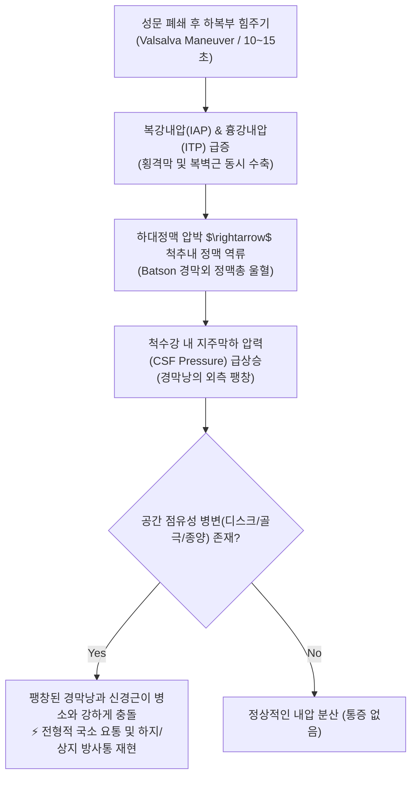
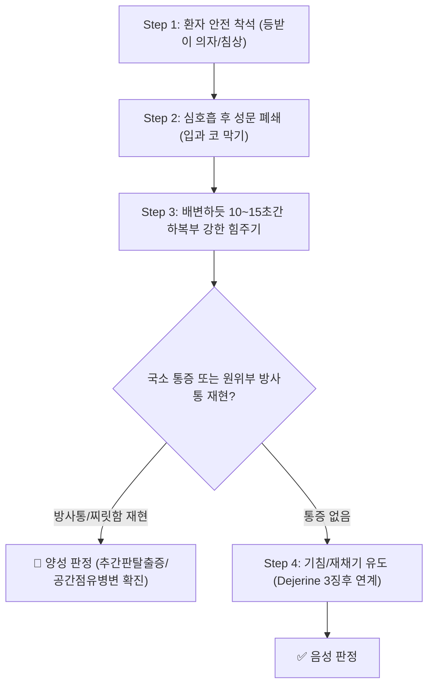

# 🩺 [[Valsalva test]] (발살바 검사 / Valsalva Maneuver Test)

> **핵심 3줄 요약 (Key Summary)**:
> - 🎯 검사 목적 & 타겟 병소: 척추강 내 공간 점유성 병변([[추간판 탈출증]], 척추 골극, 척수 종양, 연부조직 부종)에 의한 경추 및 요천추 신경근 압박 진단, 복압 상승을 통한 경막낭 및 척수강 내압(Intrathecal pressure) 유발 평가.
> - 🔍 검사 시행 프로토콜 & 양성 반응: 환자를 편안히 앉힌 후 깊은 숨을 들이마시고 성문을 폐쇄한 채 배변할 때처럼 10~15초간 하복부에 강하게 힘을 주게 하며(또는 주먹/엄지를 입에 대고 강하게 불기), 척추 국소 통증 악화 및 상·하지로 뻗치는 전형적 방사통 재현 시 양성.
> - 📊 진단 정확도(민감도·특이도) & 임상적 의의: 민감도(Sensitivity) 약 22~35%로 낮으나, 특이도(Specificity) 약 94~95%, 양성 우도비(LR+) 3.50으로 매우 높아 양성 판정 시 [[추간판 탈출증]] 및 공간 점유성 병변을 강력히 확진(Rule-In).
> - ⚠️ 위양성/위음성 요인 & 검사 금기: 중증 고혈압, 뇌동맥류, 심근경색 등 심혈관계 고위험 환자나 녹내장 환자에게는 흉강 내압 급증에 따른 뇌혈류 변동 및 미주신경 실신 위험이 있으므로 시행 금기, 음성이라도 디스크를 배제할 수 없음(위음성 주의).

---

## 📌 목차
1. [검사 기본 정보 & 진단 목적 (Diagnostic Overview)](#1-검사-기본-정보--진단-목적-diagnostic-overview)
2. [해부학적 유발 메커니즘 & 생체역학적 원리 (Biomechanical Mechanism)](#2-해부학적-유발-메커니즘--생체역학적-원리-biomechanical-mechanism)
3. [표준 검사 시행 절차 (Step-by-Step Clinical Protocol)](#3-표준-검사-시행-절차-step-by-step-clinical-protocol)
4. [양성 반응 판정 기준 & 신경근/조직별 감별 맵핑 (Diagnostic Criteria & Mapping)](#4-양성-반응-판정-기준--신경근조직별-감별-맵핑-diagnostic-criteria--mapping)
5. [연관 검사군 비교 & 다단계 감별 알고리즘 (Differential Battery & Algorithm)](#5-연관-검사군-비교--다단계-감별-알고리즘-differential-battery--algorithm)
6. [양성 소견 시 한의 임상 연계 치료 전략 (Integrative Korean Medicine)](#6-양성-소견-시-한의-임상-연계-치료-전략-integrative-korean-medicine)
7. [💡 사용자 진료실 핵심 필기 & 실전 임상 팁 (원문 보존)](#7--사용자-진료실-핵심-필기--실전-임상-팁-원문-보존)
8. [출처 및 학술 참고 문헌 (References)](#8-출처-및-학술-참고-문헌-references)

---

## 1. 검사 기본 정보 & 진단 목적 (Diagnostic Overview)

![[발살바검사_1단계_폐쇄성호기_복압증가_실사.jpg|450]]
> [그림 1: 발살바 검사의 시행 - 환자가 착석 상태에서 성문을 닫고 숨을 참은 뒤 10~15초간 하복부에 힘을 주어 흉강 및 복강 내압을 높이는 수기법]

![[발살바검사_2단계_척추강내압_신경근자극_도해.jpg|500]]
> [그림 2: 발살바 기동에 따른 척추관 내압 상승 도해 - 복강·흉강압 증가가 Batson 정맥총을 거쳐 경추 및 요추 경막낭의 내압을 상승시키고 신경근을 자극하는 메커니즘]

| 항목 | 상세 내용 |
| :--- | :--- |
| **검사명 (Test Name)** | Valsalva Test (발살바 검사 / Valsalva Maneuver) |
| **이명 및 관련 징후** | 발살바 기동, 복압 상승 유발 검사, [[Dejerene's triad]](데제린 3징후의 핵심 구성 요소) |
| **분류 (Category)** | 척수강 내압 유발 검사 (Intrathecal Pressure Test) / 공간 점유성 병변 선별 검사 |
| **타겟 병소 (Target)** | 척추관(Spinal canal), 경막낭(Dural sac), 척수 신경근(Cervical & Lumbosacral nerve roots) |
| **의심 질환 (Suspected Pathologies)** | [[추간판 탈출증]](경추/요추 디스크), 척추관 협착증, 척수 종양(Spinal cord tumor), 골극(Osteophyte), 황색인대 비후 |
| **진단 정확도 (Diagnostic Accuracy)** | • **민감도 (Sensitivity)**: 22% ~ 35% (낮음, 단독 선별 배제 불가) • **특이도 (Specificity)**: 94% ~ 95% (매우 높음, 확진용 가치 탁월) • **양성 우도비 (LR+)**: 3.50 ~ 4.50 |
| **시연 영상 (Video Guide)** | [🎥 시연 영상: Clinically Relevant - Valsalva Test](https://www.youtube.com/watch?v=-ceSV5qA_GQ) |

---

## 2. 해부학적 유발 메커니즘 & 생체역학적 원리 (Biomechanical Mechanism)

### 1) 혈류역학 및 Batson 경막외 정맥총 기전
* 환자가 성문(Glottis)을 닫고 배변하듯 힘을 주면, 흉강 내압(Intrathoracic pressure)과 복강 내압(Intra-abdominal pressure)이 순간적으로 급상승합니다.
* 복강 내 대정맥(Inferior vena cava)이 압박을 받으면서 복부 정맥혈의 심장 환류가 일시적으로 제한됩니다.
* 판막이 없는 **Batson 경막외 정맥총(Batson's plexus of epidural veins)**으로 혈류가 우회·역류하면서 척추관 내부의 정맥망이 급격히 팽창(Engorgement)합니다.

### 2) 척수 경막낭 팽창과 신경근 기계적 충돌
* 정맥 울혈과 뇌척수액(CSF)의 유출 저항 증가로 인해 척추관 내부의 경막외압 및 경막내압(Intrathecal pressure)이 가파르게 상승합니다.
* 팽창된 경막낭(Dural sac)과 척수 신경근 슬리브(Nerve root sleeve)가 척추관의 외측 및 전방으로 밀려납니다.
* 이미 탈출된 추간판(Disc herniation), 척추 골극(Osteophyte), 또는 종양(Tumor)과 같은 공간 점유성 병변이 좁은 척추관 내에 존재할 경우, 팽창된 신경근이 병소에 강하게 압박되면서 평소 환자가 느끼던 전형적인 찌릿한 방사통이 즉각 유발됩니다.

---

## 3. 표준 검사 시행 절차 (Step-by-Step Clinical Protocol)

### Step 1: 환자 착석 및 시작 자세 (Starting Position)
* 환자를 안정된 의자나 진찰대 가장자리에 바르게 앉힙니다.
* 💡 **낙상 예방**: 힘을 주는 과정에서 혈압 변동으로 인한 현기증(Dizziness)이나 실신(Syncope)이 발생할 수 있으므로, 반드시 착석 상태에서 검사자가 옆에서 환자를 관찰하며 시행합니다.

### Step 2: 폐쇄성 호기 기동 지시 (Instruction for Forced Expiration)
> [그림 3: 발살바 검사의 복압 유발 자세 - 숨을 깊이 들이마신 후 입을 다물고 코를 막거나 엄지손가락을 불듯이 복부에 압력을 가하는 모습]

* **지시 스크립트**: "숨을 깊게 들이마신 후 숨을 멈추고, 대변을 볼 때처럼 아랫배에 10초 동안 강하게 힘을 꽉 줘보세요."
* 환자가 방법을 잘 이해하지 못할 경우:
  * 엄지손가락을 입에 물고 바람이 새어나가지 않게 풍선을 불듯이 강하게 바람을 불게 하거나,
  * 자신의 손등을 입술에 대고 바람을 밀어내듯 힘을 주게 합니다.

### Step 3: 압력 유지 및 통증 반응 모니터링 (Sustained Pressure & Reaction)
* 약 10~15초간 지속적으로 복압을 유지하게 하면서 환자의 목, 허리, 팔, 다리의 통증 발생 여부를 질문합니다.
* 환자의 안색 변화와 호흡을 실시간으로 확인하며, 과도한 안면 울혈이나 현훈 발생 시 즉시 힘을 풀도록 지시합니다.

### Step 4: 기침·재채기 확인 (Dejerine's Triad 연계)
* 힘주기 동작에서 증상이 애매할 경우, 가볍게 기침(Coughing)을 2~3회 연속으로 하게 하여 순간적인 충격성 척추 내압 상승 시 증상이 재현되는지 확인합니다.

---

## 4. 양성 반응 판정 기준 & 신경근/조직별 감별 맵핑 (Diagnostic Criteria & Mapping)

* **진성 신경근병증 양성 (True Positive)**:
  * 복압을 높이는 순간 요추부 또는 경추부의 통증이 악화되면서, 해당 신경근의 지배 피부분절을 따라 하지(둔부~발가락) 또는 상지(어깨~손가락)로 날카로운 전기적 방사통, 저림, 이상 감각이 명확히 뻗쳐나갈 때.
* **국소 병변 의심 (Local Pathology)**:
  * 팔다리로의 방사통은 없으나, 허리나 목 부위의 국소 통증만 뚜렷하게 증가하는 경우 (추간판 내장증, 후관절 병변, 골극 등에 의한 국소 신경 압박).
* **음성 반응 (Negative)**:
  * 15초간의 강한 복압 형성에도 불구하고 척추나 사지에 아무런 통증 및 저림이 유발되지 않는 경우.

| 구분 | 경추 질환 의심 시 양성 반응 | 요추 질환 의심 시 양성 반응 |
| :--- | :--- | :--- |
| **의심 병변** | 경추 추간판 탈출증, 경추 신경근병증, 골극 | 요추 추간판 탈출증, 요추관 협착증, 척수 종양 |
| **전형적 통증 부위** | 경항부 통증 + 견갑골 내측, 어깨 외측 방사 | 요통 + 둔부(골반) 통증 |
| **원위부 방사통 경로** | 상완, 전완, 수부(손가락 저림)로 뻗침 | 대퇴 후면, 하퇴 외측/후면, 족부(발가락 저림) |
| **감별 검사** | [[스펄링 검사]], [[ULTT 테스트]], [[Distraction test]] | [[SLR test]], [[Bragard test]], [[Slump test]] |

---

## 5. 연관 검사군 비교 & 다단계 감별 알고리즘 (Differential Battery & Algorithm)

| 검사명 | 검사 원리 및 수기법 | 민감도 / 특이도 | 주 임상적 역할 |
| :--- | :--- | :--- | :--- |
| [[Valsalva test]] (본 검사) | 복압 증가 $\rightarrow$ Batson 정맥 울혈 $\rightarrow$ 지주막하 내압 상승 | 민감도 22~35% / 특이도 94~95% | 공간 점유성 병변(디스크/종양) 초고특이도 확진 |
| [[Dejerene's triad]] | 배변 시 힘주기 + 기침 + 재채기 3대 동작 | 특이도 95% 이상 | 병력 청취 및 유발 기동을 통한 내압 상승 확진 |
| [[Milgram's test]] | 앙와위 양다리 5cm 거상 30초 유지 | 특이도 80~90% | 능동적 복근 수축과 척추 내압 상승 결합 평가 |
| [[SLR test]] (하지직거상) | 앙와위 수동 고관절 굴곡으로 좌골신경 견인 | 민감도 80~97% / 특이도 40~60% | 요추 신경근병증 최고의 선별(Rule-Out) 검사 |
| [[스펄링 검사]] | 경추 신전·측굴 후 두정부 축성 압박 | 민감도 30~50% / 특이도 93~100% | 경추 추간공 협착 및 디스크 신경근 압박 확진 |

---

## 6. 양성 소견 시 한의 임상 연계 치료 전략 (Integrative Korean Medicine)

* **침구 및 전침 치료 (Acupuncture & Electroacupuncture)**:
  * 척추강 내압 상승에 민감한 신경근 염증 부위를 진정시키기 위해 요추 협척혈(Huatuojiaji), 신수(BL23), 대장수(BL25), 차료(BL32) 자침.
  * 2Hz 저주파 전침을 통전하여 척수 분절 수준의 내인성 엔도르핀 분비를 촉진하고 신경근 주변 정맥 울혈과 부종을 해소.
* **약침 요법 (Pharmacopuncture)**:
  * 추간공 외측 부위 및 척추 후관절 주위에 신바로약침 또는 중성어혈약침(1.0~2.0cc)을 시술하여 신경근 슬리브의 화학적 무균성 염증을 강력히 차단.
* **추나 치료 (Chuna Therapy)**:
  * 발살바 양성 환자는 추간판 섬유륜 파열 및 척수 내압 상승에 극도로 취약하므로, **급성기 고속저진폭(HVLA) 스러스트 추나는 절대 금기**.
  * **요추 굴곡-신연 기법(Cox Flexion-Distraction)** 및 지속적 축성 견인(Traction)을 시행하여 추간판 내 음압을 형성하고 탈출된 수핵의 물리적 정복을 유도.
* **한약 치료 (Herbal Medicine)**:
  * 급성기 충혈 및 신경 부종 개선: [[영선제통음]], [[오적산]], [[당귀수산]].
  * 만성 신경 포착 및 보행 장애: [[독활기생탕]], [[서경탕]], [[보양환오탕]] (기혈 순환 및 신경 재생).

---

## 7. 💡 사용자 진료실 핵심 필기 & 실전 임상 팁 (원문 보존)

* **사용자 원문 필기 (100% 완벽 보존)**:
  * **방법**: 의자에 앉히고 환자에게 배변할 때처럼 힘을 주게 함.
  * **의의**: 국소 통증은 점거성 병변 즉, 추간판 헤르니아, 종양, 골극 등을 의심.
  * **핵심 요약**:
    - 복압을 높여 척추 내강의 압력을 높여 내부 공간의 증상이 나타나도록 유도하는 검사.
    - [[추간판 탈출증]], 종양, 연부조직 부종, 골극 형성.
    - 기침 유도, 대변 볼 때 통증 확인, 입 막고 바람 불기.
* **진료실 실전 문진 및 노하우**:
  1. **초진 문진 필수 질문 3가지 (Dejerine's Triad 문진)**:
     - "대변 보실 때 힘주면 허리나 다리로 찌릿한 통증이 뻗치시나요?"
     - "기침이나 재채기할 때 허리가 끊어질 듯 울리거나 다리가 저리신가요?"
     - "코를 세게 풀 때 통증이 더 심해지시나요?"
     - 환자가 이 중 하나라도 "그렇다"고 답하면, 이미 병력 청취만으로 [[추간판 탈출증]]의 가능성이 90% 이상으로 급상승합니다.
  2. **가장 쉬운 유발법 (엄지손가락 불기 팁)**:
     - 배변하듯 힘주라는 설명이 모호할 때는 "엄지손가락을 입에 살짝 물고 틈새가 없게 막은 뒤, 풍선을 세게 불듯이 힘껏 불어보세요"라고 지시하면 남녀노소 누구나 완벽한 발살바 기동을 수행합니다.
  3. **심혈관 안전 주의 (Red Flag 감별)**:
     - 고령의 고혈압 환자나 뇌혈관 질환 병력이 있는 환자에게 무리하게 15초 이상 힘을 주게 하면 미주신경 반사로 쓰러질 수 있으므로, 5~7초 이내로 가볍게 시행하고 표정을 주시합니다.

---

## 8. 출처 및 학술 참고 문헌 (References)

1. **Wainner, R. S., Fritz, J. M., Irrgang, J. J., et al. (2003)**. Reliability and diagnostic accuracy of the clinical examination and patient self-report measures for cervical radiculopathy. *Spine (Phila Pa 1976)*, 28(1), 52-62.
   - [PubMed 링크](https://pubmed.ncbi.nlm.nih.gov/12544957/) | [DOI 링크](https://doi.org/10.1097/01.BRS.0000038873.01855.50)
   - **[연구 요약]**: 경추 신경근병증 환자에서 발살바 검사의 특이도(94%), 민감도(22%), 양성 우도비(3.50)를 체계적으로 규명하여 스펄링 검사, ULTT, 경추 견인 검사와 함께 4대 진단 복합 배터리로 정립함.
2. **Vroomen, P. C., de Krom, M. C., & Knottnerus, J. A. (1999)**. Diagnostic value of history and physical examination in patients suspected of lumbosacral radicular syndrome: systematic review. *Spine (Phila Pa 1976)*, 24(15), 1582-1589.
   - [PubMed 링크](https://pubmed.ncbi.nlm.nih.gov/10457579/) | [DOI 링크](https://doi.org/10.1097/00007632-199908010-00013)
   - **[연구 요약]**: 요천추 신경근 증후군 의심 환자에서 기침, 재채기, 힘주기(발살바 기동)에 의한 방사통 악화 소견이 특이도 94~95%의 매우 높은 확진 가치를 지님을 메타분석으로 입증함.
3. **Suri, P., Hunter, D. J., Jouve, C., et al. (2010)**. Inciting events associated with lumbar disc herniation. *The Spine Journal*, 10(5), 388-395.
   - [PubMed 링크](https://pubmed.ncbi.nlm.nih.gov/20338814/) | [DOI 링크](https://doi.org/10.1016/j.spinee.2010.02.003)
   - **[연구 요약]**: 급성 요추 추간판 탈출 환자의 유발 요인을 분석하여 발살바 기동, 재채기, 배변 시 복강 및 척수강 내압의 급격한 상승이 섬유륜 파열과 수핵 탈출을 촉발하는 주요 기전임을 임상적으로 규명함.