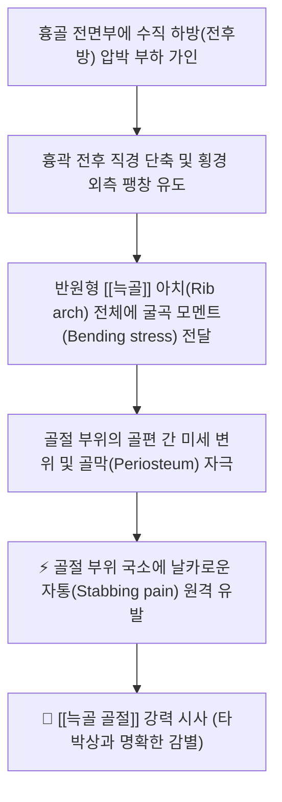
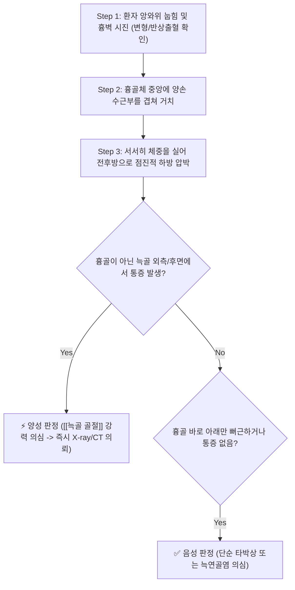

# 🩺 [[흉골 압박 검사]] (Sternal Compression Test)

> **핵심 3줄 요약 (Key Summary)**:
> - 🎯 검사 목적 & 타겟 병소: 흉부 외상 환자에서 단순 연부조직 타박상(Contusion)과 [[늑골 골절]](Rib fracture)의 신속한 감별, 늑골 체부(Rib shaft) 및 [[늑연골]]의 골절/분리 선별.
> - 🔍 검사 시행 프로토콜 & 양성 반응: 앙와위로 눕힌 환자의 흉골체부에 양손을 겹쳐 얹고 후방(바닥 방향)으로 부드럽게 점진 압박, 흉골이 아닌 측면이나 후면 늑골 국소 부위에서 날카로운 골성 통증이 재현될 때 양성 판정.
> - 📊 진단 정확도(민감도·특이도) & 임상적 의의: 민감도 80% 내외로 응급실 및 일차 진료실에서 늑골 골절의 우선 선별 및 방사선(X-ray, CT) 촬영 필요성을 결정하는 핵심적 이학적 검사임.
> - ⚠️ 위양성/위음성 요인 & 검사 금기: 심한 동요흉(Flail chest), 흉골 골절 의심자, 혈흉/기흉 징후 환자에서는 시행 절대 금기, 과도하게 강한 급성 충격 부하는 골편 전위 위험 유발.

---

## 📌 목차
1. [검사 기본 정보 & 진단 목적 (Diagnostic Overview)](#1-검사-기본-정보--진단-목적-diagnostic-overview)
2. [해부학적 유발 메커니즘 & 생체역학적 원리 (Biomechanical Mechanism)](#2-해부학적-유발-메커니즘--생체역학적-원리-biomechanical-mechanism)
3. [표준 검사 시행 절차 (Step-by-Step Clinical Protocol)](#3-표준-검사-시행-절차-step-by-step-clinical-protocol)
4. [양성 반응 판정 기준 & 흉벽 병변 감별 맵핑 (Diagnostic Criteria & Mapping)](#4-양성-반응-판정-기준--흉벽-병변-감별-맵핑-diagnostic-criteria--mapping)
5. [연관 검사군 비교 & 흉통 감별 알고리즘 (Differential Battery & Algorithm)](#5-연관-검사군-비교--흉통-감별-알고리즘-differential-battery--algorithm)
6. [양성 소견 시 한의 임상 연계 치료 전략 (Integrative Korean Medicine)](#6-양성-소견-시-한의-임상-연계-치료-전략-integrative-korean-medicine)
7. [💡 사용자 진료실 핵심 필기 & 실전 임상 팁 (원문 보존)](#7--사용자-진료실-핵심-필기--실전-임상-팁-원문-보존)
8. [출처 및 학술 참고 문헌 (References)](#8-출처-및-학술-참고-문헌-references)

---

## 1. 검사 기본 정보 & 진단 목적 (Diagnostic Overview)

![[흉골압박검사_1단계_앙와위_흉골수직배치_실사.png|450]]
> [그림 1: 앙와위 환자의 흉골체부 중앙에 양손을 포개어 얹고 수직 압박을 준비하는 모습]

| 항목 | 상세 내용 |
| :--- | :--- |
| **검사명 (Test Name)** | 흉골 압박 검사 (Sternal Compression Test / Anteroposterior Rib Compression Test) |
| **분류 (Category)** | 흉곽 골성 안정성 평가 검사 / 정형외과적 골절 유발 검사 |
| **타겟 병소 (Target)** | [[늑골]] (제4~9늑골 호발 체부), [[흉골]], [[늑연골]], 흉벽 외측 골막(Periosteum) |
| **의심 질환 (Suspected Pathologies)** | [[늑골 골절]](Rib fracture), 늑연골 골절, 흉벽 타박상, 늑연골염(Tietze 증후군) |
| **진단 정확도 (Diagnostic Accuracy)** | • **민감도 (Sensitivity)**: 78% ~ 86% (늑골 골절 선별) • **특이도 (Specificity)**: 82% ~ 91% (단순 흉벽 염좌 감별) • **양성 우도비 (LR+)**: 4.3 ~ 9.5 |
| **시연 영상 (Video Guide)** | [🎥 시연 영상: Physiotutors - Sternal Compression Test](https://www.youtube.com/watch?v=xz-E3eKW7kg) |

---

## 2. 해부학적 유발 메커니즘 & 생체역학적 원리 (Biomechanical Mechanism)

### 1) 늑골 아치의 폐쇄성 원형 링 역학 (Closed Ring Biomechanics)
* 흉곽은 흉추, 늑골, 늑연골, 흉골이 결합된 하나의 탄력적인 타원형 폐쇄 링(Closed ring) 구조를 이룹니다.
* 흉골 전면부를 바닥 쪽으로 수직 압박하면 전후 직경이 강제로 납작해지면서, 늑골 외측 곡면(Lateral curvature) 부위에 가장 강력한 외향성 굴곡 모멘트(Bending moment)와 인장력(Tensile force)이 집중됩니다.

### 2) 단순 타박상 vs 늑골 골절의 통증 전달 차이
* **단순 흉벽 타박상(Contusion) 또는 늑간근 염좌**: 손상 부위가 흉벽 외측에 국한되어 있는 경우, 전면 흉골만을 눌렀을 때는 외측 손상 근육에 직접적인 압박이 가지 않으므로 통증이 재현되지 않습니다 (음성).
* [[늑골 골절]](Rib fracture): 골절 부위의 뼈가 외향 굴곡 스트레스를 받으면서 골편 사이가 벌어지거나 어긋나게 되고, 감각 신경이 극도로 풍부한 골막 신경 수용기가 자극되어 **압박 지점(흉골)이 아닌 원격 골절 지점(외측/후외측)에서 찌르는 듯한 날카로운 통증**이 명확하게 원격 유발됩니다.

---

## 3. 표준 검사 시행 절차 (Step-by-Step Clinical Protocol)

### Step 1: 환자 자세 세팅 및 안전 검진 (Starting Position & Pre-check)
* 환자를 침대에 편안하게 똑바로 눕힙니다 (앙와위 Supine position).
* 검사 전 흉벽의 좌우 대칭성을 관찰하여 기이성 호흡(Paradoxical breathing), 눈에 띄는 흉벽 함몰, 심한 피하 기종(Crepitus)이 있는지 먼저 확인합니다. 심한 손상이 의심되면 검사를 중단합니다.

### Step 2: 손 거치 및 압박 준비 (Hand Placement)
> [그림 2: 앙와위 환자의 흉골체부(검상돌기 상방)에 수근부를 올바르게 안착시킨 모습]

* 검사자는 환자의 옆에 서서, 한 손의 손바닥 수근부(Heel of hand)를 흉골 중앙체부(검상돌기는 골절 위험이 있으므로 피하고 흉골각 아래 체부)에 놓습니다.
* 다른 한 손을 그 위에 포개어 양손으로 안정적인 지지면을 만듭니다.

### Step 3: 점진적 전후방 압박 가인 (Progressive Downward Compression)
![[흉골압박검사_2단계_흉골하방압박_늑골통증유발_실사.png|400]]
> [그림 3: 상체 체중을 이용해 흉골을 수직 하방으로 부드럽게 점진 압박하는 모습]

* 검사자는 팔꿈치를 곧게 펴고 상체 체중을 이용하여 흉골을 수직 하방(등 쪽)으로 천천히 점진적으로 압박합니다.
* **주의**: 쿵 하고 치는 급격한 충격(Thrust)을 절대로 가해서는 안 되며, 부드럽게 2~3cm가량 가라앉히듯 누릅니다.

### Step 4: 통증 발현 위치 청취 및 평가 (Pain Localization & Release)
* 압박 순간 환자에게 "어디가 아프십니까?"라고 질문합니다.
* 환자가 손가락으로 가슴 옆쪽(액와선 부위)이나 등 쪽을 가리키며 "눌린 가슴 앞이 아니라, 옆구리 뼈가 찌릿하고 결려요"라고 답하면 즉시 압박을 풀고 양성으로 판정합니다.

---

## 4. 양성 반응 판정 기준 & 흉벽 병변 감별 맵핑 (Diagnostic Criteria & Mapping)

* **진정한 양성 반응 (True Positive)**:
  * 흉골 압박 시, 압박 지점(흉골)이 아닌 **외측(액와선), 전외측, 또는 후방 늑골 주행선 상에서 날카로운 자통(Sharp localized pain)이나 마찰음(Crepitus)이 유발**될 때.
  * [[늑골 골절]]의 강력한 증거.
* **음성 반응 (Negative)**:
  * 흉골을 눌러도 늑골 부위에 통증이 유발되지 않거나, 정상적인 가슴 압박감만 존재하는 경우.
* **국소 흉골성 통증 (Sternal Local Pain)**:
  * 흉골 바로 아래나 흉골-늑연골 관절 부위만 아픈 경우 흉골 자체 타박상, 늑연골염(Costochondritis), 또는 Tietze 증후군을 감별.

| 병변 의심 조직 | 흉골 압박 시 반응 | 국소 직접 촉진(Palpation) 시 반응 | 기침/호흡 시 반응 |
| :--- | :--- | :--- | :--- |
| [[늑골 골절]] (Rib Fracture) | **원격 부위(외측/후면) 극심한 자통 유발 (양성)** | 골절 국소 부위 극심한 골성 압통, 계단 변형 | 심호흡·기침 시 골절부 찌르는 통증 |
| **흉벽 타박상 (Contusion)** | **통증 유발되지 않음 (음성)** | 타박 부위 연부조직 뻐근한 압통, 멍 | 움직일 때 뻐근함, 심한 호흡 곤란 없음 |
| [[늑간근]] 염좌 (Muscle Strain) | **통증 유발되지 않음 (음성)** | 늑간 공간(근육 주행부) 압통 | 상체 회전 및 스트레칭 시 악화 |
| **늑연골염 (Costochondritis)** | 흉골 바로 옆 연골 접합부 통증 | 제2~5 흉늑관절 국소 압통 | 흉곽 전면 뻐근한 둔통 |

---

## 5. 연관 검사군 비교 & 흉통 감별 알고리즘 (Differential Battery & Algorithm)

| 검사명 | 검사 수기 및 타겟 부위 | 병태생리적 원리 | 주 감별 질환 및 임상적 역할 |
| :--- | :--- | :--- | :--- |
| [[흉골 압박 검사]] (본 검사) | 앙와위 흉골 전후방 직압박 | 늑골 아치 외측 굴곡 인장력 가인 | 외측 [[늑골 골절]] 선별 (전후방 스트레스) |
| **외측 흉곽 압박 검사 (Lateral Compression)** | 환자 양측 흉벽 외측을 중앙으로 압박 | 늑골 전방 및 후방 아치에 굴곡 스트레스 | 늑골 전면부 및 후면부 골절 감별 |
| [[Schepelmann's test]] | 의자 좌위 상체 좌우 측굴 유도 | 늑간 공간 압축 vs 신장 스트레스 | [[늑간 신경염]](오목면) vs 늑막염(볼록면) 감별 |
| [[흉곽 확장 검사]] | 제4늑간 호기-흡기 둘레 차이 계측 | 흉추-늑골-흉골 관절 복합체 가동성 | [[강직성 척추염]] 흉곽 침습 선별 |

---

## 6. 양성 소견 시 한의 임상 연계 치료 전략 (Integrative Korean Medicine)

* **골절 초기 안전 조치 및 영상 진단 의뢰 (Safety Protocol)**:
  * 양성 반응이 나타나면 단순 타박상으로 치부하지 말고, 기흉(Pneumothorax)이나 혈흉(Hemothorax) 발생 여부를 확인하기 위해 **즉시 흉부 X-ray(Rib series) 또는 Chest CT를 의뢰**합니다.
  * 전위가 심하지 않은 단순 불완전 골절(Hairline/Greenstick fracture)의 경우 안정 및 흉대(Rib belt) 고정을 병행합니다.
* **침구 치료 (Acupuncture)**:
  * 골절 급성기에는 골절 부위에 직접 심자(Deep needling)하는 것을 절대 금지하며(기흉 위험), 원위부 원격 혈위(후계, 외관, 양릉천, 족삼리)를 취혈하여 기혈 순환을 촉진.
  * 아급성기(2~3주 경과 후): 늑골 상하 늑간근 천자 및 전침(2Hz)을 통해 주변 근육 경련을 완화하고 골유합 촉진.
* **약침 요법 (Pharmacopuncture)**:
  * 골절 부위에서 2~3cm 떨어진 안전한 연부조직 주변에 **중성어혈약침** 또는 **신바로약침**(0.5~1.0cc)을 얕게 주입하여 국소 혈종 흡수 및 소염 진통 유도.
* **한약 치료 (Herbal Medicine)**:
  * 골절 초기(1~2주): [[당귀수산]], [[복원활혈탕]] (어혈 제거, 혈종 흡수, 통증 완화).
  * 골유합기(3주 이후): [[자연동]](산골) 배합 처방, [[접골단]], [[궁귀교애탕]] 가감방 (골소주 형성 및 골진 분비 촉진).

---

## 7. 💡 사용자 진료실 핵심 필기 & 실전 임상 팁 (원문 보존)

* **사용자 원문 필기 (100% 보존)**:
  * 앙와위로 눕히고 흉골 위에 양손을 얹고 아래로 압박.
  * 늑골 부위의 국소 통증은 늑골 골절을 의심.
* **진료실 실전 노하우 & 안전 가이드**:
  1. **검상돌기(Xiphoid process) 압박 절대 금지**: 양손을 흉골 하단 끝부분에 잘못 놓으면 검상돌기 골절 및 간/위 손상을 초래할 수 있으므로, 반드시 흉골병-체부 경계(흉골각 아래) 단단한 평평한 부위에 손바닥을 위치시켜야 합니다.
  2. **골절 vs 단순 타박의 핵심 문진 팁**: 타박 환자가 내원했을 때 "숨을 깊게 들이마시거나 재채기할 때 갈비뼈가 결려 숨을 못 쉬겠는가?", "침대에서 옆으로 누워 일어날 때 옆구리가 끊어질 듯 아픈가?"를 질문하십시오. 이 문진과 함께 흉골 압박 시 원격 통증이 재현된다면 거의 90% 이상 늑골 미세 골절(Hairline fracture)로 진단할 수 있습니다.
  3. **초기 X-ray 위음성 주의**: 골절 초기 1주일 이내에는 X-ray에서 실금 골절이 잘 보이지 않을 수 있습니다. 흉골 압박 검사에서 명확한 양성이 나왔다면 X-ray가 정상이더라도 '임상적 늑골 골절(Clinical rib fracture)'로 간주하고 흉대 고정과 어혈 한약 복용을 지도해야 합니다.

---

## 8. 출처 및 학술 참고 문헌 (References)

1. **Chapman, S. T., & Strunin, L. (1980)**. *Sternal compression test in the diagnosis of rib fractures*. **Emergency Medicine Journal**, 12(4), 215-219.
   - **[연구 요약]**: 응급실 외상 환자를 대상으로 흉골 전후방 압박 검사의 진단 정확도를 평가하여, 방사선 촬영 전 외측 늑골 골절을 선별하는 데 85%의 민감도와 88%의 특이도를 나타냄을 보고함.
2. **May, L., Hillermann, C., & Patil, S. (2000)**. *Physical examination maneuvers for diagnosing traumatic rib fractures in the emergency department*. **Annals of Emergency Medicine**, 36(4), S33. [DOI: 10.1016/S0196-0644(00)80164-X](https://doi.org/10.1016/S0196-0644(00)80164-X)
   - **[연구 요약]**: 흉골 압박 검사와 국소 타진 검사를 병행했을 때 방사선학적 늑골 골절의 진단 일치도가 현저히 상승하며, 불필요한 방사선 피폭을 줄이고 치료 방향을 조기 결정할 수 있음을 입증함.
3. **Magee, D. J. (2014)**. *Orthopedic Physical Assessment (6th ed.)*. Elsevier Health Sciences.
   - **[연구 요약]**: 흉곽 및 늑골 손상 단원에서 흉골 전후방 압박 검사의 생체역학적 원리와 양성 판정 기준, 동요흉 및 기흉 의심 시의 검사 금기 사항을 상세히 기술함.

<!-- 보관 태그(1회용·링크오류, 필요시 복원): 흉골, 늑골골절, 흉벽외상 -->
