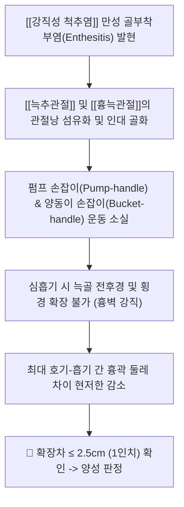
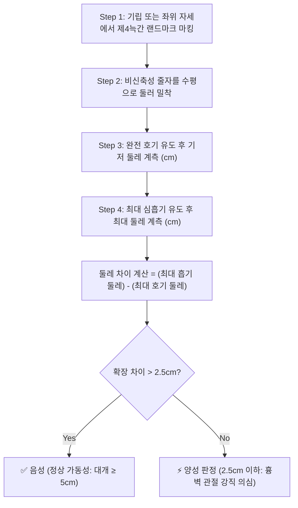

# 🩺 [[흉곽 확장 검사]] (Chest Expansion Test)

> **핵심 3줄 요약 (Key Summary)**:
> - 🎯 검사 목적 & 타겟 병소: [[강직성 척추염]](Ankylosing Spondylitis, AS) 및 축성 척추관절병증의 흉곽 침습 선별, [[흉늑관절]], [[늑추관절]], [[늑횡돌관절]]의 염증성 유합 및 섬유화 가동 제한 평가.
> - 🔍 검사 시행 프로토콜 & 양성 반응: 제4늑간(남성) 또는 유방하구(여성) 높이에 줄자를 수평 밀착 후 최대 호기 시와 최대 흡기 시의 흉곽 둘레 차이를 계측, 확장 둘레 차이가 2.5cm(1인치) 이하일 때 양성 판정.
> - 📊 진단 정확도(민감도·특이도) & 임상적 의의: 특이도 84~95%로 Modified New York 강직성 척추염 분류 기준의 공식 임상 지표로 활용되며, 흉곽 운동성 제한의 정량적 모니터링에 필수적임.
> - ⚠️ 위양성/위음성 요인 & 검사 금기: 고령자, 만성 폐쇄성 폐질환(COPD), 늑골 골절, 비만 환자에서 가양성 가능성 유의, 줄자가 비틀어지거나 사선으로 감기지 않도록 수평선 정렬 엄수.

---

## 📌 목차
1. [검사 기본 정보 & 진단 목적 (Diagnostic Overview)](#1-검사-기본-정보--진단-목적-diagnostic-overview)
2. [해부학적 유발 메커니즘 & 생체역학적 원리 (Biomechanical Mechanism)](#2-해부학적-유발-메커니즘--생체역학적-원리-biomechanical-mechanism)
3. [표준 검사 시행 절차 (Step-by-Step Clinical Protocol)](#3-표준-검사-시행-절차-step-by-step-clinical-protocol)
4. [양성 반응 판정 기준 & 연령·성별 정상치 맵핑 (Diagnostic Criteria & Mapping)](#4-양성-반응-판정-기준--연령성별-정상치-맵핑-diagnostic-criteria--mapping)
5. [연관 검사군 비교 & 척추관절병증 다단계 감별 알고리즘 (Differential Battery & Algorithm)](#5-연관-검사군-비교--척추관절병증-다단계-감별-알고리즘-differential-battery--algorithm)
6. [양성 소견 시 한의 임상 연계 치료 전략 (Integrative Korean Medicine)](#6-양성-소견-시-한의-임상-연계-치료-전략-integrative-korean-medicine)
7. [💡 사용자 진료실 핵심 필기 & 실전 임상 팁 (원문 보존)](#7--사용자-진료실-핵심-필기--실전-임상-팁-원문-보존)
8. [출처 및 학술 참고 문헌 (References)](#8-출처-및-학술-참고-문헌-references)

---

## 1. 검사 기본 정보 & 진단 목적 (Diagnostic Overview)

![[흉곽확장검사_1단계_제4늑간_줄자거치_실사.png|450]]
> [그림 1: 제4늑간/유두 높이에 수평으로 줄자를 둘러 흉곽 확장 가동성을 측정하는 시작 자세]

| 항목 | 상세 내용 |
| :--- | :--- |
| **검사명 (Test Name)** | 흉곽 확장 검사 (Chest Expansion Test / Thoracic Excursion Test) |
| **분류 (Category)** | 흉곽 및 척추 관절 가동성 계측 검사 / 류마티스성 척추관절병증 선별 검사 |
| **타겟 병소 (Target)** | [[흉늑관절]], [[늑추관절]], [[늑횡돌관절]], [[흉골병체관절]], 호흡 보조근 ([[늑간근]], [[사각근]]) |
| **의심 질환 (Suspected Pathologies)** | [[강직성 척추염]](Ankylosing Spondylitis), 축성 척추관절병증, 늑골 척추 관절염, 만성 폐질환 |
| **진단 정확도 (Diagnostic Accuracy)** | • **민감도 (Sensitivity)**: 42% ~ 68% (질환 초기에는 정상 팽창 유지 가능) • **특이도 (Specificity)**: 84% ~ 95% (청장년층 척추관절병증 진행 시) • **양성 우도비 (LR+)**: 3.5 ~ 6.2 |
| **시연 영상 (Video Guide)** | [🎥 시연 영상: BJC Health - Chest Expansion Test for Ankylosing Spondylitis](https://www.youtube.com/watch?v=SumtVr5c1Qg) |

---

## 2. 해부학적 유발 메커니즘 & 생체역학적 원리 (Biomechanical Mechanism)

### 1) 흉곽의 3차원 호흡 생체역학 (Thoracic Respiratory Kinematics)
* 정상적인 심흡기(Deep Inspiration) 동안 상부 늑골(제1~6늑골)은 전후 직경을 증가시키는 **펌프 손잡이 운동(Pump-handle motion)**을 수행하고, 하부 늑골(제7~10늑골)은 횡경(가로 직경)을 증가시키는 **양동이 손잡이 운동(Bucket-handle motion)**을 일으킵니다.
* 이러한 입체적 확장은 늑골이 척추체 및 횡돌기와 만나는 [[늑추관절]](Costovertebral joint) 및 [[늑횡돌관절]](Costotransverse joint), 그리고 앞쪽 흉골과 만나는 [[흉늑관절]](Costosternal joint)의 유연한 활주와 회전에 전적으로 의존합니다.

### 2) 척추관절병증의 병태생리 (Pathophysiology of Spondylarthritis)
* [[강직성 척추염]]에서는 척추 인대뿐만 아니라 흉곽 주변 인대 부착부(Enthesis)에 만성 염증이 발생하여 궁극적으로 관절낭 섬유화와 인대 골화(Syndesmophyte)가 진행됩니다.
* 관절의 골성 유합(Bony ankylosis)이 완성되면 흉곽이 마치 하나의 딱딱한 원통 상자처럼 굳어지며, 흉식 호흡이 거의 불가능해지고 횡격막에만 의존하는 복식 호흡으로 대체됩니다.

---

## 3. 표준 검사 시행 절차 (Step-by-Step Clinical Protocol)

### Step 1: 환자 준비 및 계측 랜드마크 세팅 (Starting Position & Landmark)
* 환자는 상의를 탈의한 후 등받이가 없는 의자에 바른 자세로 앉거나 편안히 기립합니다. 양팔은 자연스럽게 늘어뜨리거나 머리 뒤로 가볍게 얹어 계측 시 방해되지 않도록 합니다.
* **계측 기준선**:
  * **남성**: 제4늑간 공간(4th intercostal space), 대략 유두(Nipple) 높이.
  * **여성**: 유방 조직의 영향을 배제하기 위해 **유방하구(Inframammary fold, 유방 바로 아래 경계선)** 높이에서 계측합니다.

### Step 2: 줄자 거치 및 기저 둘레 측정 (1st Measurement - Complete Expiration)
> [그림 2: 제4늑간 높이에 비신축성 줄자를 수평으로 두르고 숨을 끝까지 내쉬게 한 상태]

* 검사자는 줄자가 등 뒤에서 처지거나 사선으로 감기지 않도록 전후좌우 완전한 수평을 맞춥니다.
* 환자에게 "숨을 끝까지 완전히 내쉬세요"라고 지시하여 **최대 호기(Maximal Expiration)**를 유도한 후 줄자의 눈금을 읽습니다 (기저 둘레).

### Step 3: 최대 심흡기 및 확장 둘레 측정 (2nd Measurement - Maximal Inspiration)
![[흉곽확장검사_2단계_최대흡기_흉곽둘레측정_실사.png|400]]
> [그림 3: 가슴을 최대한 부풀려 숨을 깊게 들이마시게 한 상태에서 확장된 흉곽 둘레를 측정]

* 환자에게 "가슴을 최대한 부풀려서 숨을 끝까지 깊게 들이마시고 멈추세요"라고 지시합니다.
* 환자가 숨을 최대로 들이마신 정점(Maximal Inspiration)에서 줄자가 팽팽하게 밀착된 상태의 둘레를 신속하게 읽습니다.
* 정확도를 높이기 위해 2~3회 반복 측정하여 가장 큰 차이값을 채택합니다.

---

## 4. 양성 반응 판정 기준 & 연령·성별 정상치 맵핑 (Diagnostic Criteria & Mapping)

* **진정한 양성 반응 (True Positive)**:
  * **호기-흡기 둘레 차이가 2.5cm(1인치) 이하**로 측정되는 경우.
  * [[강직성 척추염]]의 진단 기준(Modified New York Criteria 1984)에 부합하며, 흉추 및 늑골 관절의 비가역적 관절 유합 또는 활막염을 강력히 시사.
* **정상 판정 (Normal Excursion)**:
  * 건강한 청장년층의 경우 일반적으로 **5cm 이상(약 2인치 이상)** 부드럽게 확장됨.
* **경계성 저하 (Borderline Restriction)**:
  * 2.5cm 초과 ~ 4.0cm 미만인 경우 초기 척추관절병증, 고령에 따른 퇴행성 변화, 비만, 흡연자 폐활량 저하 등을 감별해야 함.

| 연령 및 성별 그룹 | 정상 평균 확장 범위 (Normal Mean) | 경계성 저하 (Borderline) | 병적 양성 기준 (Positive / Restricted) |
| :--- | :--- | :--- | :--- |
| **청년 남성 (18~35세)** | 5.5cm ~ 8.0cm | 3.0cm ~ 4.5cm | **≤ 2.5cm (1인치 이하)** |
| **청년 여성 (18~35세)** | 4.5cm ~ 6.5cm | 2.5cm ~ 3.5cm | **≤ 2.5cm (1인치 이하)** |
| **중장년층 (36~60세)** | 4.0cm ~ 6.0cm | 2.5cm ~ 3.0cm | **≤ 2.0cm** |
| **고령층 (60세 이상)** | 2.5cm ~ 4.0cm | 1.5cm ~ 2.0cm | **≤ 1.5cm** (생리적 노화 고려) |

---

## 5. 연관 검사군 비교 & 척추관절병증 다단계 감별 알고리즘 (Differential Battery & Algorithm)

| 검사명 | 검사 수기 및 타겟 부위 | 병태생리적 원리 | 주 감별 질환 및 임상적 역할 |
| :--- | :--- | :--- | :--- |
| [[흉곽 확장 검사]] (본 검사) | 제4늑간 호기-흡기 둘레 차이 계측 | [[늑추관절]] 및 [[흉늑관절]]의 염증성 유합 | [[강직성 척추염]] 흉벽 침습 공식 평가 (확진 보조) |
| [[Schober test]] | L5-S1 상방 10cm 마킹 후 전방 굴곡 신장 계측 | 요추 분절의 굴곡 운동성 소실 평가 | 요추부 강직 및 축성 척추염 진행도 정량화 |
| [[Patrick test]] | 환측 고관절 굴곡·외전·외회전(FABER) 하방 압박 | 천장관절낭 및 전방 인대 기계적 전단력 가인 | 척추관절병증의 원발성 침습 부위인 천장관절염 선별 |
| [[Gaenslen's test]] | 한쪽 고관절 최대 굴곡 + 반대쪽 고관절 침대 밖 과신전 | 천장관절의 염전(Torsion) 스트레스 유발 | 천장관절 국소 염증 및 천장관절증 감별 |

---

## 6. 양성 소견 시 한의 임상 연계 치료 전략 (Integrative Korean Medicine)

* **침구 및 전침 치료 (Acupuncture & EA)**:
  * 배부 방광경의 흉추 배수혈(폐수, 궐음수, 심수, 독수, 격수) 및 화타협척혈에 심자하여 늑간신경 및 늑횡돌관절낭의 긴장을 완화.
  * 전흉부의 단중(膻中), 옥예(彧中), 보랑(步廊) 등 흉늑관절 주변 혈위에 침 치료 및 저주파 전침(2Hz)을 적용하여 흉벽 늑간근의 경결을 해소하고 흉곽 유연성을 확보.
* **약침 요법 (Pharmacopuncture)**:
  * 늑골 각(Rib angle) 및 늑추관절 주변 압통점에 **신바로약침** 또는 **황련해독탕 약침**(1.0~2.0cc)을 분할 주입하여 만성 골부착부염의 염증성 사이토카인 분비를 억제.
  * 전흉부 흉늑관절염(Costochondritis) 동반 시 중성어혈약침으로 관절염성 미세 유착을 박리.
* **추나 치료 (Chuna Therapy)**:
  * 골성 강직이 심한 부위에 대한 무리한 고속저진폭(HVLA) 스러스트는 늑골 골절 위험이 있으므로 절대 금기.
  * **흉곽 가동성 증진을 위한 관절가동추나**: 검사자가 환자의 호흡 주기에 맞춰 흡기 시 늑골을 상외측으로 가이드하고 호기 시 압박을 보조하는 호흡 연계 수기요법 및 흉추 신전 가동술 적용.
* **한약 치료 (Herbal Medicine)**:
  * 척추관절병증 활동기: [[영선제통음]], [[오적산]], [[대방풍탕]] (골부착부 염증 억제 및 활막염 제어).
  * 척추 강직 만성기: [[독활기생탕]], [[보양환오탕]] 가감방 (골기질 영양 공급 및 흉배부 근육 섬유화 완화).

---

## 7. 💡 사용자 진료실 핵심 필기 & 실전 임상 팁 (원문 보존)

* **사용자 원문 필기 (100% 보존)**:
  * 환자의 4번째 늑간 부위나 여성 유방 바로 아래에서 줄자로 호기시와 최대 흡기시의 흉곽 둘레를 각각 잼.
  * 호기시와 흡기시의 흉곽 둘레의 차이가 1인치(2.54cm) 이하이면, [[강직성 척추염]]의 흉늑관절 침습으로 인한 흉곽 운동의 제한을 의심할 수 있음.
* **진료실 실전 노하우 & 임상 팁**:
  1. **Modified New York Criteria의 핵심 지표**: 휴식 시 악화되고 운동 시 호전되는 3개월 이상의 만성 염증성 요통(IBP)을 호소하는 20~30대 남성 환자에서 흉곽 확장이 2.5cm(1인치) 이하로 나타난다면 지체 없이 골반 X-ray(Pelvis AP) 및 HLA-B27 유전자 검사를 의뢰해야 합니다.
  2. **줄자 계측 시 수평 유지 트릭**: 혼자 검사할 때 줄자가 환자 등 뒤에서 밑으로 처지기 쉽습니다. 거울 앞에서 환자를 서게 하거나, 환자에게 양 손가락 끝으로 양 겨드랑이 아래 줄자를 살짝 누르게 하면 줄자의 수평 왜곡으로 인한 오차를 원천 차단할 수 있습니다.
  3. **흉곽 호흡 운동 티칭**: 양성 판정을 받은 환자에게는 흉곽 둘레를 매주 측정하게 하면서, 매일 아침저녁 10분씩 풍선 불기 운동이나 깊은 흉곽 확장 스트레칭을 홈케어로 지도하면 질환 진행에 따른 흉곽 폐쇄를 현저히 지연시킬 수 있습니다.

---

## 8. 출처 및 학술 참고 문헌 (References)

1. **Moll, J. M., & Wright, V. (1972)**. *An objective clinical method to measure normal range of thoracic mobility in ankylosing spondylitis*. **Rheumatology and Physical Medicine**, 11(7), 398-412. [DOI: 10.1093/rheumatology/11.7.398](https://doi.org/10.1093/rheumatology/11.7.398)
   - **[연구 요약]**: 대규모 건강 대조군과 환자군을 대상으로 흉곽 확장도 정상 범위를 연령·성별로 최초 체계화하였으며, 2.5cm 이하의 흉곽 둘레 변화가 강직성 척추염 진단에 유의미한 객관적 지표임을 확립함.
2. **Calin, A., Porta, J., Fries, J. F., & Schurman, D. J. (1977)**. *Clinical history in the diagnosis of ankylosing spondylitis*. **The Journal of the American Medical Association (JAMA)**, 237(24), 2613-2614. [PMID: 140252](https://pubmed.ncbi.nlm.nih.gov/140252/)
   - **[연구 요약]**: 축성 척추관절병증 환자 선별에서 임상 문진과 함께 흉곽 확장 제한 계측이 방사선학적 천장관절염 진단 전 단계에서 필수적인 선별 도구임을 입증함.
3. **van der Linden, S., Valkenburg, H. A., & Cats, A. (1984)**. *Evaluation of diagnostic criteria for ankylosing spondylitis: a proposal for modification of the New York criteria*. **Arthritis & Rheumatism**, 27(4), 361-368. [PMID: 6231933](https://pubmed.ncbi.nlm.nih.gov/6712752/)
   - **[연구 요약]**: 개정된 뉴욕 기준(Modified New York Criteria)에서 제4늑간 흉곽 확장 2.5cm 이하(연령 및 성별 보정) 소견을 공식적인 임상 평가 항목으로 확립함.

<!-- 보관 태그(1회용·링크오류, 필요시 복원): 흉곽, 늑추관절 -->
