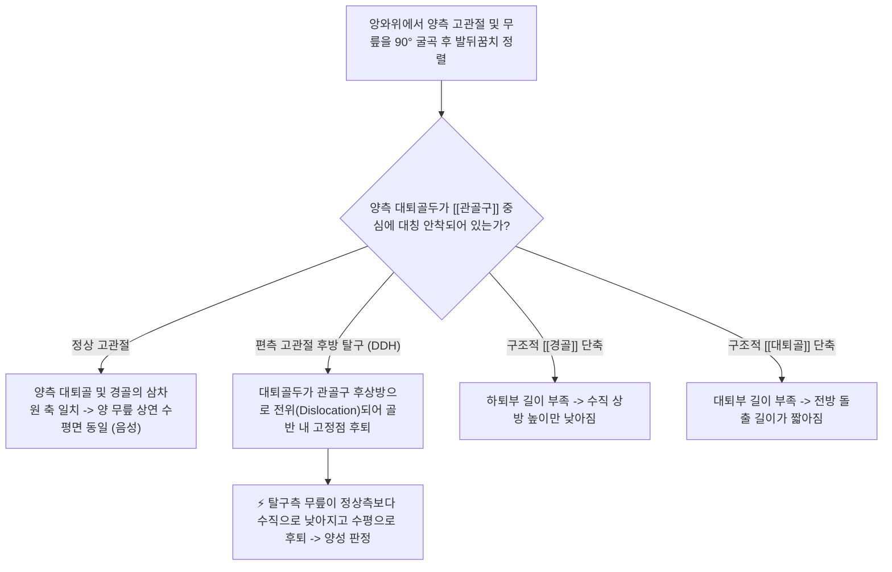
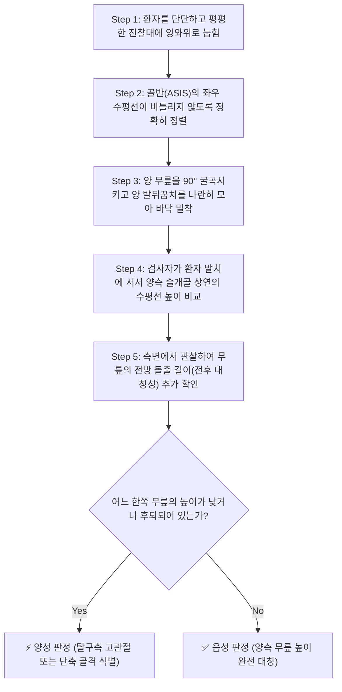

# 🩺 [[Allis test]] (앨리스 검사 / 갈레아치 징후)

> **핵심 3줄 요약 (Key Summary)**:
> - 🎯 검사 목적 & 타겟 병소: 소아 및 성인에서 편측성 발달성 고관절 이형성증(DDH), 대퇴골두 후방 탈구, 선천성/외상성 하지 부동(Leg length discrepancy, LLD) 선별, [[고관절]], [[대퇴골]], [[경골]] 길이 비대칭 평가.
> - 🔍 검사 시행 프로토콜 & 양성 반응: 앙와위에서 양측 슬관절을 90° 굴곡시키고 양 발바닥과 뒤꿈치를 침대 바닥에 나란히 모은 뒤 양측 무릎의 수직 높이 및 수평 돌출도를 전방에서 관찰, 한쪽 무릎 높이가 현저히 낮거나 뒤로 밀려 있으면 양성 판정.
> - 📊 진단 정확도(민감도·특이도) & 임상적 의의: 생후 3개월 이후 보행기 아동 및 성인 하지 길이 차이를 진찰실 침상에서 10초 만에 구조적으로 감별할 수 있는 정형외과적 기본 필수 검사임.
> - ⚠️ 위양성/위음성 요인 & 검사 금기: 양측성 고관절 탈구(Bilateral DDH) 환자에서는 양쪽 무릎이 대칭적으로 낮아지므로 정상으로 오인되는 치명적 위음성 주의, 골반 회전 경사 사전 교정 필수.

---

## 📌 목차
1. [검사 기본 정보 & 진단 목적 (Diagnostic Overview)](#1-검사-기본-정보--진단-목적-diagnostic-overview)
2. [해부학적 유발 메커니즘 & 생체역학적 원리 (Biomechanical Mechanism)](#2-해부학적-유발-메커니즘--생체역학적-원리-biomechanical-mechanism)
3. [표준 검사 시행 절차 (Step-by-Step Clinical Protocol)](#3-표준-검사-시행-절차-step-by-step-clinical-protocol)
4. [양성 반응 판정 기준 & 대퇴골 vs 경골 단축 감별 맵핑 (Diagnostic Criteria & Mapping)](#4-양성-반응-판정-기준--대퇴골-vs-경골-단축-감별-맵핑-diagnostic-criteria--mapping)
5. [연관 검사군 비교 & 고관절 탈구 감별 알고리즘 (Differential Battery & Algorithm)](#5-연관-검사군-비교--고관절-탈구-감별-알고리즘-differential-battery--algorithm)
6. [양성 소견 시 한의 임상 연계 치료 전략 (Integrative Korean Medicine)](#6-양성-소견-시-한의-임상-연계-치료-전략-integrative-korean-medicine)
7. [💡 사용자 진료실 핵심 필기 & 실전 임상 팁 (원문 보존)](#7--사용자-진료실-핵심-필기--실전-임상-팁-원문-보존)
8. [출처 및 학술 참고 문헌 (References)](#8-출처-및-학술-참고-문헌-references)

---

## 1. 검사 기본 정보 & 진단 목적 (Diagnostic Overview)

![[알리스검사_1단계_앙와위_무릎높이차이_실사.png|450]]
> [그림 1: 앙와위에서 양 무릎을 90도 굴곡시켰을 때 대퇴골두 탈구 및 단축으로 인해 우측 무릎 높이가 낮게 관찰되는 모습]

| 항목 | 상세 내용 |
| :--- | :--- |
| **검사명 (Test Name)** | 앨리스 검사 (Allis Test / Galeazzi Sign, 갈레아치 징후) |
| **분류 (Category)** | 고관절 골성 정렬 및 하지 길이 계측 검사 / 소아정형외과 선별 검사 |
| **타겟 병소 (Target)** | [[고관절]](대퇴골두-관골구 접합), [[대퇴골]](Femur), [[경골]](Tibia), 골반 수평축 |
| **의심 질환 (Suspected Pathologies)** | 발달성 고관절 이형성증(DDH), 대퇴골두 후방 탈구, 구조적 하지부동(LLD), 펠테스병 |
| **진단 정확도 (Diagnostic Accuracy)** | • **민감도 (Sensitivity)**: 82% ~ 90% (편측성 고관절 탈구 시) • **특이도 (Specificity)**: 85% ~ 94% (단축 비대칭 소견 시) • **양성 우도비 (LR+)**: 5.5 ~ 9.0 |
| **시연 영상 (Video Guide)** | [🎥 시연 영상: Galeazzi Sign / Allis' Test Demonstration](https://www.youtube.com/watch?v=zcHNhsK5xo8) |

---

## 2. 해부학적 유발 메커니즘 & 생체역학적 원리 (Biomechanical Mechanism)

### 1) 고관절 굴곡 시의 3차원 골격 기하학 (Geometric Kinematics)
* 앙와위에서 양 발바닥을 바닥에 붙이고 무릎을 90°로 세우면, 무릎의 위치는 **하퇴(경골)의 수직 높이**와 **대퇴(대퇴골)의 수평 전방 길이**라는 두 축의 기하학적 조합으로 결정됩니다.
* 양측 골반이 지면에 수평으로 밀착되어 있을 때, 정상적인 아동이나 성인은 양 무릎 슬개골의 상단 높이가 동일 수평선(Reference line)에 정렬됩니다.

### 2) 대퇴골두 후방 탈구 및 뼈 단축 시의 변화
* **발달성 고관절 탈구(DDH)**: 대퇴골두가 관골구(Acetabulum)에서 벗어나 장골 외측면 후상방으로 밀려나면, 대퇴골의 기저 회전축 자체가 뒤쪽(바닥 쪽)으로 주저앉게 됩니다. 그 결과 무릎을 세웠을 때 해당 측 무릎이 아래로 푹 꺼지며 높이가 낮아집니다.
* **경골 단축 vs 대퇴골 단축의 분리 기전**:
  * 환자의 발 쪽(발치)에서 수평으로 바라보았을 때 무릎 높이가 낮으면 **경골(Tibia)**이 짧거나 고관절이 후방 탈구된 것입니다.
  * 환자의 머리 쪽이나 측면에서 바라보았을 때 한쪽 무릎이 앞쪽으로 덜 튀어나와 있으면 **대퇴골(Femur)**의 길이가 짧은 것입니다.

---

## 3. 표준 검사 시행 절차 (Step-by-Step Clinical Protocol)

### Step 1: 환자 자세 및 골반 정렬 (Starting Position & Pelvic Leveling)
* 환자를 단단하고 평평한 진찰대 침대에 똑바로 눕힙니다 (앙와위 Supine position). 푹신한 침대는 오차를 유발하므로 피합니다.
* **가장 중요한 선행 조건**: 양측 상전장골극(ASIS)을 촉진하여 골반이 좌우로 기울어지거나 비틀려(Pelvic tilt/rotation) 있지 않은지 완벽한 수평을 맞춥니다.

### Step 2: 무릎 굴곡 및 발뒤꿈치 정렬 (Knee Flexion & Heel Alignment)
> [그림 2: 양 무릎을 90도로 굽히고 양 발바닥을 바닥에 붙여 나란히 모은 상태에서 무릎 높이를 정면에서 비교하는 모습]

* 검사자는 환자의 양쪽 무릎을 동시에 잡고 90°로 부드럽게 굴곡시킵니다.
* 양 발바닥을 침대 바닥에 평평하게 닿게 하고, **양측 내측 복사뼈(복숭아뼈)와 발뒤꿈치가 정확히 같은 선상에 맞닿도록** 가지런히 모읍니다.

### Step 3: 정면 및 측면 입체 관찰 (Frontal & Lateral Inspection)
* **1) 정면 관찰 (발치에서 머리 방향으로 바라보기)**: 검사자의 눈높이를 무릎 높이로 낮추고, 양측 슬개골(Patella) 상단의 수평선을 관찰하여 **수직 높이(Vertical height)**에 차이가 있는지 측정합니다.
* **2) 측면 관찰 (옆에서 바라보기)**: 검사자가 침대 측면으로 이동하여, 양 무릎이 앞쪽으로 뻗어 나온 **전방 돌출 길이(Anterior projection)**를 비교합니다.

---

## 4. 양성 반응 판정 기준 & 대퇴골 vs 경골 단축 감별 맵핑 (Diagnostic Criteria & Mapping)

* **진정한 양성 반응 (True Positive - Galeazzi Sign Positive)**:
  * 양 무릎의 수직 높이나 전방 돌출 길이에 **뚜렷한 비대칭(대개 0.5~1cm 이상 차이)**이 관찰될 때.
* **음성 반응 (Negative)**:
  * 양측 무릎의 최고점 높이와 전방 길이가 완벽한 대칭을 이루는 경우.
* **⚠️ 양측성 탈구(Bilateral DDH) 위음성 주의**:
  * 양쪽 고관절이 모두 탈구된 영아의 경우, 양측 무릎이 똑같이 낮아져 있어 검사상 완벽한 대칭(음성)으로 보일 수 있으므로 **고관절 외전 제한(Abduction test)**을 반드시 병행해야 합니다.

| 관찰된 비대칭 양상 | 의심되는 병변 구조 | 주요 원인 질환 | 추가 필수 확인 검사 |
| :--- | :--- | :--- | :--- |
| **한쪽 무릎 높이가 수직으로 낮음** | [[경골]](Tibia) 길이 단축 또는 고관절 후상방 탈구 | 선천성 경골 무형성증, 성장판 손상, 편측 DDH | 골반 X-ray, 하지 전장 촬영(Scanogram) |
| **한쪽 무릎이 앞쪽으로 덜 돌출됨** | [[대퇴골]](Femur) 길이 단축 또는 고관절 후방 탈구 | 선천성 대퇴 결손증, 대퇴골 간부 골절 부정유합 | 대퇴골 길이 실측(ASIS~내과) |
| **양측 무릎 높이는 같으나 외전 안 됨** | **양측성 고관절 탈구 (Bilateral DDH)** | 양측 관골구 이형성증, 뇌성마비성 고관절 아탈구 | [[Ortolani test]], 고관절 초음파 |

---

## 5. 연관 검사군 비교 & 고관절 탈구 감별 알고리즘 (Differential Battery & Algorithm)

| 검사명 | 검사 수기 및 타겟 부위 | 주 검사 대상 연령 | 임상적 역할 및 감별 포인트 |
| :--- | :--- | :--- | :--- |
| [[Allis test]] (본 검사) | 앙와위 무릎 90° 굴곡 후 무릎 높이 비교 | **생후 3개월 이후 ~ 성인** | 편측성 고관절 탈구 및 하지 길이 부동 선별 |
| [[Ortolani test]] | 굴곡된 고관절을 외전시키며 대전자 전방 압박 | **신생아 ~ 생후 2-3개월** | 탈구된 대퇴골두를 관골구로 정복 (딸깍음) |
| **바를로 검사 (Barlow Test)** | 굴곡된 고관절을 내전시키며 대퇴골 후방 압박 | **신생아 ~ 생후 2-3개월** | 불안정한 대퇴골두를 밖으로 탈구 유발 |
| [[트렌델렌버그 테스트]] | 환측 하지로 한 발 서기 시 골반 하강 관찰 | **보행기 아동 ~ 성인** | 중둔근 약화 및 진구성 고관절 탈구 파행 평가 |

---

## 6. 양성 소견 시 한의 임상 연계 치료 전략 (Integrative Korean Medicine)

* **소아 발달성 고관절 이형성증(DDH) 의뢰 프로토콜**:
  * 소아 환자에서 앨리스 검사 양성 및 허벅지 피부 주름 비대칭이 관찰되면, 침 치료를 시행하지 않고 즉시 **소아정형외과 전문의에게 의뢰하여 Pavlik 하네스(보조기) 고정 치료**를 받도록 골든타임을 확보해야 합니다.
* **성인 구조적 vs 기능적 하지부동 한의 교정 치료**:
  * **골반 교정 추나 (Pelvic Chuna Therapy)**: 장골의 전방 회전(Innominate anterior rotation) 또는 후방 회전 변위로 인해 발생한 가성 하지부동(Functional LLD)의 경우, 골반 분락 기법 및 천장관절 가동추나를 통해 무릎 높이 대칭성을 즉각 회복.
  * **침구 치료: 짧아진 쪽의 [[장요근]], [[대퇴근막장근]](TFL), 요방형근(QL) 및 반대측 중둔근 부위 혈위(환도, 거료, 질변, 풍시)에 전침(2Hz)을 통전하여 골반 편위 근육 불균형을 해소.
  * **보조기 요법**: 구조적 골격 단축(진성 하지부동 1cm 이상)으로 판명된 성인 환자에게는 족부 깔창(Heel lift)을 처방하여 골반 수평을 맞추고 척추측만증 악화를 예방.

---

## 7. 💡 사용자 진료실 핵심 필기 & 실전 임상 팁 (원문 보존)

* **사용자 원문 필기 (100% 보존)**:
  * 앙와위 검사자는 환자의 양쪽 무릎을 90도 굴곡 이때 양발바닥은 바닥에 닿게 한 채로 모은 후 양쪽 무릎의 높이를 관찰.
  * 한쪽 무릎의 높이가 짧으면: 대퇴골두가 후방탈구 or 경골이 짧음을 의미.
* **진료실 실전 노하우 & 감별 팁**:
  1. **발뒤꿈치 정렬이 전부다**: 검사할 때 환자의 발바닥을 대충 놓으면 한쪽 발이 위로 올라가 무릎 높이가 왜곡됩니다. 검사자가 양손으로 환자의 양 발뒤꿈치를 바닥에 '탁' 붙이고 양 엄지발가락과 복숭아뼈를 완벽하게 밀착시킨 뒤에 무릎을 보아야 오진이 없습니다.
  2. **영아 기저귀 갈 때 필수 관찰 팁**: 아이를 데려온 부모에게 "기저귀를 갈 때 양쪽 허벅지 안쪽 살 접히는 주름(Thigh creases)의 개수나 깊이가 다른가요?", "기저귀를 채울 때 한쪽 다리가 잘 안 벌어지나요?"를 질문하십시오. 허벅지 비대칭 주름 + 앨리스 검사 무릎 높이 차이가 보이면 십중팔구 고관절 탈구입니다.
  3. **성인 짝다리 환자의 필수 진찰**: 허리가 아프거나 골반이 틀어졌다고 내원한 성인 환자에서 앨리스 검사를 시행하면, 실제 다리 뼈 길이가 다른 '진성 하지부동'인지, 골반이 회전되어 나타나는 '기능적 하지부동'인지 5초 만에 감별할 수 있습니다.

---

## 8. 출처 및 학술 참고 문헌 (References)

1. **Galeazzi, R. (1934)**. *Über ein besonderes Symptom der angeborenen Hüftluxation*. **Archiv für Orthopädische und Unfall-Chirurgie**, 35(1), 58-61.
   - **[연구 요약]**: Riccardo Galeazzi가 선천성 고관절 탈구 환자에서 무릎 굴곡 시 대퇴골두의 후방 변위로 인해 발생하는 무릎 높이의 비대칭 현상을 체계화하여 보고함.
2. **Allis, O. H. (1896)**. *An inquiry into the difficulties encountered in the reduction of dislocations of the hip*. **Transactions of the American Surgical Association**, 14, 259.
   - **[연구 요약]**: 고관절 탈구 정복 과정에서 대퇴골두의 해부학적 위치와 무릎 높이 변화의 역학적 상관관계를 정형외과적 진단 도구로 최초 제안함.
3. **Storer, S. K., & Skaggs, D. L. (2006)**. *Developmental dysplasia of the hip*. **American Family Physician**, 74(8), 1310-1316. [PMID: 17087424](https://pubmed.ncbi.nlm.nih.gov/17087424/)
   - **[연구 요약]**: 발달성 고관절 이형성증 선별에서 연령별 이학적 검사(생후 3개월 이전 Ortolani/Barlow, 3개월 이후 Galeazzi/Allis 검사)의 민감도와 단계적 프로토콜을 제시함.

<!-- 보관 태그(1회용·링크오류, 필요시 복원): 발달성고관절이형성증, 하지부동, 대퇴골탈구 -->
