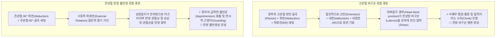
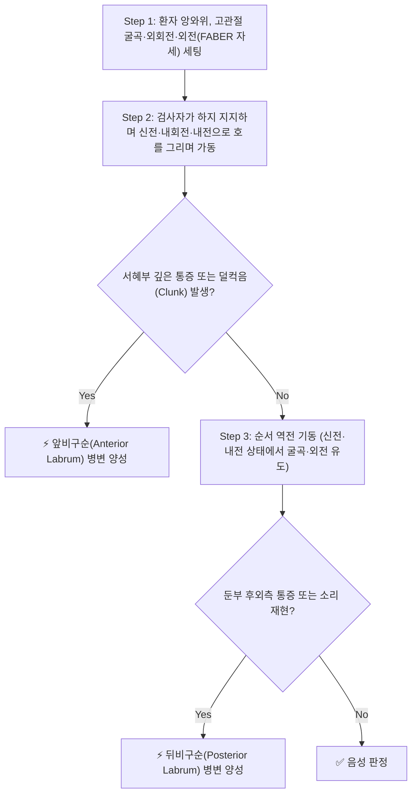

# 🩺 [[Apprehension test]] (Apprehension Test / 염려 검사 / 관절 불안검사)

> **핵심 3줄 요약 (Key Summary)**:
> - 🎯 검사 목적 & 타겟 병소: 고관절 비구순 병변([[비구순 파열]], FAI) 및 견관절 전방 불안정성([[재발성 어깨 탈구]], 전방 관절순 반카르트 병변) 평가.
> - 🔍 검사 시행 프로토콜 & 양성 반응: 앙와위에서 고관절을 굴곡·외회전·외전 후 신전·내회전·내전으로 이동시키며 서혜부 통증 및 관절 덜컥음(Clunk) 유발 시 비구순 병변 판정 (견관절: 90° 외전·외회전 시 재탈구 공포감 재현).
> - 📊 진단 정확도(민감도·특이도) & 임상적 의의: 고관절 전방 비구순 검사(FADDIR) 민감도 94~99%, 견관절 불안검사 특이도 90~99%로 관절순 파열 및 탈구 선별·확진에 필수적인 고가치 검사.
> - ⚠️ 위양성/위음성 요인 & 검사 금기: 급성 견관절 탈구 직후 무리한 외회전 가인 금기, 단순 관절낭 구축으로 인한 가동 제한성 통증과 진정한 탈구 불안감(Apprehension)을 명확히 구별.

---

## 📌 목차
1. [검사 기본 정보 & 진단 목적 (Diagnostic Overview)](#1-검사-기본-정보--진단-목적-diagnostic-overview)
2. [해부학적 유발 메커니즘 & 생체역학적 원리 (Biomechanical Mechanism)](#2-해부학적-유발-메커니즘--생체역학적-원리-biomechanical-mechanism)
3. [표준 검사 시행 절차 (Step-by-Step Clinical Protocol)](#3-표준-검사-시행-절차-step-by-step-clinical-protocol)
4. [양성 반응 판정 기준 & 신경근/조직별 감별 맵핑 (Diagnostic Criteria & Mapping)](#4-양성-반응-판정-기준--신경근조직별-감별-맵핑-diagnostic-criteria--mapping)
5. [연관 검사군 비교 & 다단계 감별 알고리즘 (Differential Battery & Algorithm)](#5-연관-검사군-비교--다단계-감별-알고리즘-differential-battery--algorithm)
6. [양성 소견 시 한의 임상 연계 치료 전략 (Integrative Korean Medicine)](#6-양성-소견-시-한의-임상-연계-치료-전략-integrative-korean-medicine)
7. [💡 사용자 진료실 핵심 필기 & 실전 임상 팁 (원문 보존)](#7--사용자-진료실-핵심-필기--실전-임상-팁-원문-보존)
8. [출처 및 학술 참고 문헌 (References)](#8-출처-및-학술-참고-문헌-references)

---

## 1. 검사 기본 정보 & 진단 목적 (Diagnostic Overview)

![[shoulder_apprehension_clinical_maneuver.jpg|450]]
> [그림 1: 견관절 전방 불안검사(Crank Test) 임상 시연 - 앙와위에서 어깨를 90° 외전 및 외회전할 때 전방 불안감 평가]

| 항목 | 상세 내용 |
| :--- | :--- |
| **검사명 (Test Name)** | Apprehension Test (염려 검사 / 불안검사 / 크랭크 검사) |
| **분류 (Category)** | 고관절 및 견관절 섬유연골순(Labrum) 병변 및 관절 불안정성 유발 검사 |
| **타겟 병소 (Target)** | • 고관절: [[대퇴비구순]](Acetabular Labrum: 전방/후방 비구순), 대퇴골두 경부 접합부 • 견관절: 전하방 관절와순([[반카르트 병변]]), 하관절상완인대복합체(IGHL) |
| **의심 질환 (Suspected Pathologies)** | [[비구순 파열]], 대퇴비구 충돌증후군(FAI), [[어깨 전방 탈구]], 재발성 관절 불안정성 |
| **진단 정확도 (Diagnostic Accuracy)** | • **고관절 비구순 (FADDIR)**: 민감도 94%~99%, 특이도 25%~43% (선별 가치 우수) • **견관절 전방 불안**: 민감도 65%~72%, 특이도 90%~99% (확진 가치 우수) |
| **시연 영상 (Video Guide)** | [🎥 Physiotutors - Shoulder Apprehension Test (Crank Test)](https://www.youtube.com/watch?v=hy7zgoEsbzQ) |

---

## 2. 해부학적 유발 메커니즘 & 생체역학적 원리 (Biomechanical Mechanism)

### 1) 고관절 비구순(Acetabular Labrum) 유발 메커니즘
* 비구순은 관절와 가장자리를 둘러싸 대퇴골두를 안정적으로 감싸는 섬유연골 조직입니다.
* 고관절을 굴곡·외전·외회전(FABER) 위치에서 시작하여, 전방 비구 연골 모서리에 부하를 실으며 신전·내전·내회전(FADIR) 경로로 역동적으로 궤적을 전환하면, 대퇴골두 경부의 골성 돌출부(Cam 병변)가 전상방 비구순을 강하게 긁고 지나가며 포착(Entrapment)을 유발합니다.
* 반대로 **순서를 바꾸어 검사(신전·외전·외회전에서 굴곡·내전·내회전)**할 때 통증이 유발되면 **후방 비구순(Posterior Labrum)**의 병변을 시사합니다.

### 2) 견관절 전방 불안정(Anterior Shoulder Instability) 생체역학
* 어깨가 90° 외전 및 외회전(Cock-up throwing position)되면, 상완골두를 전방에서 지지하는 주요 구조물인 하관절상완인대(IGHL) 전방 다발과 전하방 관절와순(Labrum)에 최대의 전방 전단 응력(Anterior shear stress)이 집중됩니다.
* 관절순이 찢어져 있거나 관절낭이 늘어난 환자는 상완골두가 관절와를 벗어나 전방으로 탈구될 것 같은 극심한 공포(Apprehension)를 느끼고 반사적으로 어깨 근육을 수축시킵니다.

---

## 3. 표준 검사 시행 절차 (Step-by-Step Clinical Protocol)

### Step 1: 환자 준비 및 초기 위치 세팅 (Starting Position)
* 환자는 검사대 위에 편안하게 바로 눕습니다(앙와위, Supine position).
* 검사자는 환측 다리 옆에 서서 한 손으로 무릎을 감싸 쥐고 다른 한 손으로 발목을 안정적으로 파지합니다.

### Step 2: 1차 고관절 외전-외회전 굴곡 세팅 (1st Flexion-Abduction-External Rotation)
* 환자의 고관절과 슬관절을 90° 이상 굴곡(Flexion)시키면서 다리를 바깥으로 벌리고(Abduction) 대퇴골을 외회전(External Rotation)시킵니다.
* 이 위치에서 대퇴골두가 비구의 후하방으로 편안하게 안착됩니다.

### Step 3: 2차 전방 압박 궤적 기동 (2nd Extension-Adduction-Internal Rotation Maneuver)
* 검사자는 환자의 무릎과 발목을 잡은 채, 고관절을 점진적으로 펴면서(Extension) 몸의 안쪽으로 모으고(Adduction) 안쪽으로 돌리는(Internal Rotation) 복합 궤적을 부드럽게 그립니다.
* 이때 대퇴골두가 전상방 비구 연골 가장자리를 압박하며 지나가도록 유도합니다.

### Step 4: 반응 평가 및 순서 역전 검사 (Assessment & Reversal Protocol)
* **전방 비구순 평가**: 궤적 가동 중 서혜부(Groin) 깊은 곳에서 환자가 호소하던 찌릿한 통증이나 관절이 걸리는 듯한 덜컥음(Clicking/Clunk)이 재현되는지 확인합니다.
* **후방 비구순 평가**: 통증이 없거나 후방 병변이 의심될 경우 동작 순서를 바꾸어, 고관절 신전·내전·내회전 상태에서 출발하여 굴곡·외전·외회전 상태로 이동시키며 둔부 후외측 통증을 확인합니다.

---

## 4. 양성 반응 판정 기준 & 신경근/조직별 감별 맵핑 (Diagnostic Criteria & Mapping)

* **진정한 양성 반응 (True Positive)**:
  * **앞비구순 병변**: 고관절 굴곡·외전·외회전에서 신전·내전·내회전으로 전환할 때 서혜부 앞쪽 깊은 부위에 날카로운 통증(Groin pain)과 함께 관절 내 마찰음(Clicking/Clunk)이 명확히 재현될 때.
  * **뒤비구순 병변**: 순서를 바꾸어 검사할 때(신전·내회전에서 굴곡·외회전으로 전환) 둔부 후방 또는 외측에 통증과 덜컥거림이 나타날 때.
* **음성 반응 (Negative)**:
  * 전 관절 가동 범위에서 걸림이나 소리 없이 부드럽게 가동되며 통증이 없는 경우.

| 검사 방향 및 기동 순서 | 병변 타겟 구조 | 유발되는 통증 위치 | 임상적 의미 |
| :--- | :--- | :--- | :--- |
| **굴곡·외전·외회전 $\rightarrow$ 신전·내전·내회전** | [[대퇴비구순]] 전상방 (Anterior Labrum) | 서혜부 앞쪽(Groin), 전외측 고관절 | 앞비구순 파열, 전방 대퇴비구 충돌증(Cam FAI) |
| **신전·내전·내회전 $\rightarrow$ 굴곡·외전·외회전** | [[대퇴비구순]] 후방 (Posterior Labrum) | 둔부 후방(Buttock), 좌골 결절 부근 | 뒤비구순 파열, 후방 충돌증, 이상근 자극 |
| **견관절 90° 외전 + 수동 외회전** | 견관절 전하방 관절와순, IGHL | 견관절 전방, 삼각근 하부 | 전방 불안정성, [[반카르트 병변]], 재탈구 공포 |

---

## 5. 연관 검사군 비교 & 다단계 감별 알고리즘 (Differential Battery & Algorithm)

| 검사명 | 검사 부위 및 동작 | 병태생리적 원리 | 임상적 역할 (선별 vs 확진) |
| :--- | :--- | :--- | :--- |
| [[Apprehension test]] (염려 검사) | 고관절 역동적 회전 궤적 이동 / 어깨 외전 외회전 | 비구순 및 관절와순의 기계적 포착 유도 | 비구순/관절와순 손상 및 불안정성 표준 선별 |
| [[FADIR test]] (충돌 검사) | 고관절 90° 굴곡 + 내전 + 내회전 | 대퇴골두 경부와 전상방 비구순 직접 충돌 | 대퇴비구 충돌증후군(FAI) 대표 선별 검사 |
| [[Patrick test]] (FABER 검사) | 고관절 굴곡 + 외전 + 외회전 (숫자 4 모양) | 천장관절 압박 및 장요근 신장 | [[천장관절 증후군]] 및 고관절 골관절염 감별 |
| [[Relocation test]] (조브 재정복 검사) | 견관절 외전·외회전 상태에서 상완골두 후방 압박 | 상완골두 전방 전위 억제로 공포감 즉시 소실 | 견관절 전방 불안정성 확진 (특이도 99%) |

---

## 6. 양성 소견 시 한의 임상 연계 치료 전략 (Integrative Korean Medicine)

* **침구 및 전침 치료 (Acupuncture & EA)**:
  * 고관절 비구순 병변: 비관(ST31), 환도(GB30), 거료(GB29), 족삼리(ST36) 및 서혜인대 하부 대퇴신경 주행 혈위에 자침.
  * [[장요근]], [[대퇴근막장근]], [[중둔근]]의 연관 발통점에 2Hz 저주파 전침을 통전하여 고관절 전방 충돌을 유발하는 고유수용성 근경련을 해소.
* **약침 요법 (Pharmacopuncture)**:
  * 고관절 전외측 관절낭 및 비구순 부착부(초음파 유도하 또는 랜드마크 자입)에 **신바로약침** 또는 **중성어혈약침**(1.0~2.0cc)을 심부 주입하여 관절순 미세 파열부의 화학적 염증성 활액막염 완화.
* **추나 및 관절가동술 (Chuna Therapy)**:
  * 고관절 축성 감압 견인 추나: 앙와위에서 환자의 발목을 잡고 체중을 실어 장축 방향으로 부드럽게 감압하여 대퇴골두와 비구 연골 간극을 확보.
  * 장요근 및 고관절 전방 관절낭 근막 이완(Myofascial Release, MFR).
* **한약 치료 (Herbal Medicine)**:
  * 관절순 염증 부종기: [[대강활탕]], [[영선제통음]] (관절 강내 삼출액 흡수 촉진 및 통증 완화).
  * 만성 관절 불안정기: [[독활기생탕]], [[가미대보탕]] (골관절 영양 보충, 인대 및 연골 지지력 강화).

---

## 7. 💡 사용자 진료실 핵심 필기 & 실전 임상 팁 (원문 보존)

* **사용자 원문 필기 (100% 융합 완료)**:
  * *방법*: 앙와위 환자의 환측 고관절 굴곡 외회전 외전한 상태에서 신전 내회전 내전하는 상태로 이동시킴.
  * *의미*: 서혜부 통증 동반되는 소리 > 앞비구순의 병변.
  * 순서 바꿔 검사 시 통증 > 뒤비구군의 병변.
* **진료실 실전 노하우 & 관찰 팁**:
  1. **고관절 소리(Snapping)의 원인 감별**: 검사 중 소리가 날 때 이것이 관절 내 비구순 파열(Labral tear)에 의한 '깊은 덜컥음(Deep clunk)'인지, 아니면 장요근건이 장치융기(Iliopectineal eminence)를 튕기며 나는 '전방 탄발음(Internal snapping hip)'인지 감별해야 합니다. 장요근건 탄발음은 통증이 덜하고 손으로 서혜인대 아래를 압박했을 때 소리가 억제됩니다.
  2. **앞비구순 vs 뒤비구순 순서 전환 팁**: 앞비구순(Anterior labrum) 병변이 훨씬 호발하지만, 딥스쿼트나 축구 킥 동작 후 엉덩이 뒤쪽이 결린다는 환자는 반드시 **순서를 거꾸로(신전·내전에서 굴곡·외전으로)** 돌려 뒤비구순 병변을 확인하십시오.
  3. **견관절 검사 시 공포(Apprehension)와 통증의 구별**: 어깨 불안검사를 할 때는 단순히 아프다고 하는 것과 "팔이 빠질 것 같아 무서우니 멈춰달라"고 하는 표정 변화(Apprehension)를 명확히 구분해야 진정한 전방 불안정성을 감별할 수 있습니다.

---

## 8. 출처 및 학술 참고 문헌 (References)

1. **Burnett, S. J., et al. (2006)**. Clinical presentation of patients with tears of the acetabular labrum. *The Journal of Bone and Joint Surgery. American Volume*, 88(7), 1448–1457.
   - [PubMed: 16818969](https://pubmed.ncbi.nlm.nih.gov/16818969/)
   - [DOI: 10.2106/JBJS.D.02806](https://doi.org/10.2106/JBJS.D.02806)
   - **[연구 요약]**: 고관절 비구순 파열 환자 66명을 대상으로 신체 검진을 분석한 결과, 굴곡-내전-내회전(FADIR) 및 역동적 비구순 검사에서 95%의 높은 민감도를 보이며 서혜부 통증과 탄발음이 가장 신뢰할 만한 임상 지표임을 증명함.
2. **Farber, A. J., et al. (2006)**. Clinical assessment of physical examination tests for shoulder instability. *The American Journal of Sports Medicine*, 34(5), 760–766.
   - [PubMed: 16436638](https://pubmed.ncbi.nlm.nih.gov/16436638/)
   - [DOI: 10.1177/0363546505281804](https://doi.org/10.1177/0363546505281804)
   - **[연구 요약]**: 견관절 불안정성 환자 100명을 대상으로 Apprehension test의 특이도(99%)와 Relocation test의 확진 가치를 검증하여, 외전·외회전 기동 시 탈구 공포 반응이 관절와순 전방 병변의 가장 결정적인 지표임을 보고함.

<!-- 보관 태그(1회용·링크오류, 필요시 복원): 견관절/고관절, 관절와순/비구순 -->
