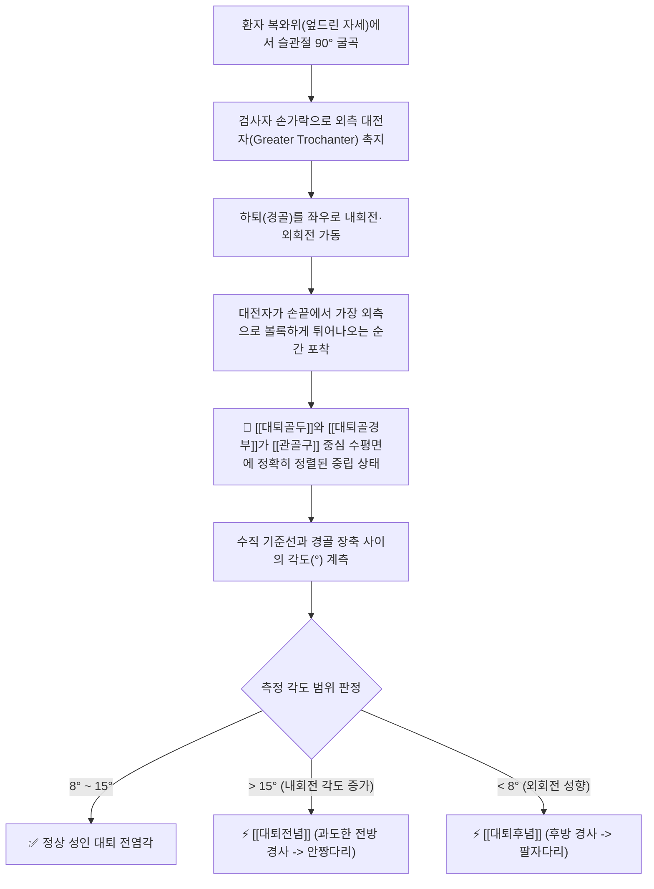
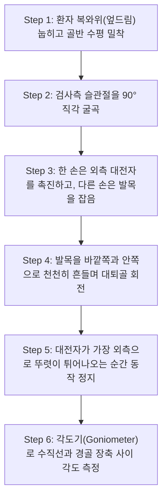

# 🩺 [[Craig test]] (크레이그 검사 / 대퇴전념후념 검사)

> **핵심 3줄 요약 (Key Summary)**:
> - 🎯 검사 목적 & 타겟 병소: 안짱걸음(In-toeing) 및 팔자걸음(Out-toeing) 환자에서 [[대퇴전념]](Anteversion)과 [[대퇴후념]](Retroversion)의 정량적 계측, [[대퇴골두]]와 [[대퇴골경부]]의 3차원 골성 비틀림 각도(Torsion angle) 평가.
> - 🔍 검사 시행 프로토콜 & 양성 반응: 복와위에서 슬관절 90° 굴곡 후 대전자를 촉진하며 고관절을 내외회전시켜 대전자가 가장 외측으로 튀어나오는 중립 위치를 식별, 이때 수직축과 경골 장축이 이루는 각도가 15° 초과 시 [[대퇴전념]], 8° 미만(외회전) 시 [[대퇴후념]]으로 판정.
> - 📊 진단 정확도(민감도·특이도) & 임상적 의의: CT 방사선 피폭 없이 진료실 침상에서 대퇴골 염전각을 객관적으로 계측(Ruwe et al., 1992 검증)할 수 있는 생체역학적 골반-하지 정형 도구임.
> - ⚠️ 위양성/위음성 요인 & 검사 금기: 환자가 엎드릴 때 골반이 침대에서 들리거나 비틀리지 않도록 주의, 소아(정상 전념각 30~40°에서 점진 감소)와 성인의 생리적 기준치 차이를 감안하여 판정.

---

## 📌 목차
1. [검사 기본 정보 & 진단 목적 (Diagnostic Overview)](#1-검사-기본-정보--진단-목적-diagnostic-overview)
2. [해부학적 유발 메커니즘 & 생체역학적 원리 (Biomechanical Mechanism)](#2-해부학적-유발-메커니즘--생체역학적-원리-biomechanical-mechanism)
3. [표준 검사 시행 절차 (Step-by-Step Clinical Protocol)](#3-표준-검사-시행-절차-step-by-step-clinical-protocol)
4. [양성 반응 판정 기준 & 전념 vs 후념 보행 변형 맵핑 (Diagnostic Criteria & Mapping)](#4-양성-반응-판정-기준--전념-vs-후념-보행-변형-맵핑-diagnostic-criteria--mapping)
5. [연관 검사군 비교 & 하지 정렬 감별 알고리즘 (Differential Battery & Algorithm)](#5-연관-검사군-비교--하지-정렬-감별-알고리즘-differential-battery--algorithm)
6. [양성 소견 시 한의 임상 추나 및 운동 교정 전략 (Integrative Korean Medicine)](#6-양성-소견-시-한의-임상-추나-및-운동-교정-전략-integrative-korean-medicine)
7. [💡 사용자 진료실 핵심 필기 & 실전 임상 팁 (원문 보존)](#7--사용자-진료실-핵심-필기--실전-임상-팁-원문-보존)
8. [출처 및 학술 참고 문헌 (References)](#8-출처-및-학술-참고-문헌-references)

---

## 1. 검사 기본 정보 & 진단 목적 (Diagnostic Overview)

![[크레이그검사_1단계_대퇴전념_대퇴후념_도해.png|450]]
> [그림 1: 대퇴골의 비틀림에 따른 대퇴전념(안짱다리/내회전)과 대퇴후념(팔자다리/외회전) 하지 정렬 골격 도해]

| 항목 | 상세 내용 |
| :--- | :--- |
| **검사명 (Test Name)** | 크레이그 검사 (Craig's Test / Trochanteric Prominence Angle Test, TPAT) |
| **분류 (Category)** | 하지 생체역학적 골격 염전 계측 검사 / 소아 및 성인 보행 분석 검사 |
| **타겟 병소 (Target)** | [[대퇴골경부]](Femoral neck axis), 대전자(Greater trochanter), [[관골구]], 대퇴과간축 |
| **의심 질환 (Suspected Pathologies)** | [[대퇴전념]](Femoral Anteversion), [[대퇴후념]](Retroversion), 안짱걸음, 슬개대퇴 통증증후군 |
| **진단 정확도 (Diagnostic Accuracy)** | • **민감도 (Sensitivity)**: 80% ~ 89% (CT 3D 염전각 측정 대비) • **특이도 (Specificity)**: 84% ~ 92% (정상 범위 이탈 판별 시) • **급내상관계수 (ICC)**: 0.88 ~ 0.93 (검사자 간 신뢰도 우수) |
| **시연 영상 (Video Guide)** | [🎥 시연 영상: Craig's Test for Femoral Anteversion](https://www.youtube.com/watch?v=GVTRle_fivo) |

---

## 2. 해부학적 유발 메커니즘 & 생체역학적 원리 (Biomechanical Mechanism)

![[크레이그검사_2단계_복와위_대전자촉진_각도계측_실사.png|400]]
> [그림 2: 복와위에서 검사자가 대전자를 촉진하며 하퇴를 외측으로 벌려(고관절 내회전) 대퇴전념각을 계측하는 실제 임상 모습]

### 1) 대퇴골 전염각(Anteversion Angle)의 해부학적 정의
* 대퇴골 전염각은 **대퇴골 경부의 중심축(Femoral neck axis)**과 원위부 대퇴골 과간 관절면(Transcondylar axis)이 관상면(Coronal plane) 상에서 이루는 비틀림(Torsion) 각도입니다.
* 정상적으로 대퇴골두는 관골구 안쪽에서 약간 앞쪽(전방)을 향해 8~15°가량 기울어져 있습니다.

### 2) 대전자 최대 돌출과 골두 안착의 역학적 원리
* 복와위에서 엎드려 무릎을 90° 구부리면, 하퇴(경골)는 대퇴골의 회전을 직접적으로 가리키는 정밀한 '바늘(Pointer)' 역할을 수행합니다.
* 고관절을 돌리다 보면 대전자가 침대 바깥쪽으로 가장 높게 솟아오르는 지점이 있습니다.
* **이 순간이 바로 대퇴골 경부가 진찰대 바닥면과 완벽하게 수평을 이루어, 대퇴골두가 비구 안에 가장 깊고 안정적으로 일치(Joint congruence)하는 순간**입니다.
* 이때 수직선(90°)으로부터 경골이 외측으로 벌어진 각도(고관절 내회전 각도)를 재면, 그것이 곧 대퇴골의 구조적 전염각이 됩니다.

---

## 3. 표준 검사 시행 절차 (Step-by-Step Clinical Protocol)

### Step 1: 환자 준비 및 복와위 세팅 (Starting Position)
* 환자를 단단한 치료 침대에 편안하게 엎드리게 합니다 (복와위 Prone position).
* 양측 골반(ASIS)이 침대 바닥에 균일하게 밀착되도록 하여 척추나 골반의 비틀림이 없도록 정렬합니다.

### Step 2: 슬관절 90° 굴곡 및 대전자 촉진 (Knee Flexion & Palpation)
* 검사하려는 쪽의 무릎을 90°로 직각 굴곡시킵니다.
* 검사자는 환자의 옆에 서서, 한 손의 손가락(엄지 또는 검지·중지)으로 환자의 고관절 외측에서 가장 뼈가 돌출된 **대전자(Greater trochanter)** 부위를 깊게 지그시 누릅니다.

### Step 3: 수동 회전 및 최대 돌출점 탐색 (Passive Rotation & Prominence Point)
> [그림 3: 복와위에서 발목을 잡아 대퇴골을 회전시키면서 대전자가 가장 외측으로 팽팽하게 솟아오르는 지점을 찾는 모습]

* 검사자의 다른 한 손으로 환자의 발목(하퇴 원위부)을 잡습니다.
* 하퇴를 바깥쪽(고관절 내회전)과 안쪽(고관절 외회전)으로 천천히 시계추처럼 회전시킵니다.
* 대전자를 짚고 있는 손가락 끝에서 **대퇴골 대전자가 가장 외측으로 뚜렷하게 솟아올라 손가락을 밀어내는 최고점 위치(Maximum prominence point)**를 정확히 찾아 동작을 고정합니다.

### Step 4: 각도 계측 및 판정 (Goniometric Measurement)
* 동작이 정지된 상태에서 각도기(Goniometer)를 사용하여 측정합니다.
  * **고정 암(Stationary arm)**: 천장과 침대 바닥에 수직인 가상선(Vertical axis).
  * **이동 암(Movable arm)**: 경골 능선(Tibial crest)을 따라 발목 중심을 잇는 경골 장축.
* 수직선에서 경골이 외측(내회전) 또는 내측(외회전)으로 벗어난 각도를 1° 단위로 기록합니다.

---

## 4. 양성 반응 판정 기준 & 전념 vs 후념 보행 변형 맵핑 (Diagnostic Criteria & Mapping)

* **정상 성인 기준치 (Normal Range)**:
  * **8° ~ 15° (내회전 각도)**.
* 1) [[대퇴전념]] (Femoral Anteversion / 과전념):
  * 계측 각도가 **15° 초과** (심한 경우 25~40° 이상).
  * 고관절 구조 자체가 안쪽으로 비틀려 있어, 대퇴골두를 비구에 맞추기 위해 환자가 무의식적으로 다리 전체를 안쪽으로 돌리는 **안짱걸음(In-toeing gait)**을 걷게 됨.
* 2) [[대퇴후념]] (Femoral Retroversion):
  * 계측 각도가 **8° 미만**이거나, 경골이 오히려 수직선 안쪽(외회전)으로 기울어지는 경우.
  * 대퇴골두를 비구에 맞추기 위해 다리를 바깥쪽으로 벌리는 **팔자걸음(Out-toeing gait)**을 걷게 됨.

| 분류 | 크레이그 검사 측정 각도 | 보행 패턴 및 앉는 자세 | 동반 호발 질환 및 생체역학적 문제 |
| :--- | :--- | :--- | :--- |
| [[대퇴전념]] (Anteversion) | **> 15°** (내회전 과다, 외회전 제한) | **안짱걸음 (In-toeing)** 바닥에 무릎 꿇고 앉는 **'W'자 앉기(W-sitting)** | 슬개대퇴 통증증후군(PFPS), Q각(Q-angle) 증가, 슬관절 외반슬(X다리), 족부 과내번(평발) |
| **정상 (Normal)** | **8° ~ 15°** | 중립 보행 (10° 내외 가벼운 외측 지향) | 정상 관절 정렬 및 균형 잡힌 근막 장력 |
| [[대퇴후념]] (Retroversion) | **< 8°** (외회전 과다, 내회전 제한) | **팔자걸음 (Out-toeing)** 양반다리가 매우 편하고 W자 앉기 불가 | 대퇴비구 충돌증후군(FAI, 캠/핀서 병변), 고관절 순 파열, 슬관절 내반슬(O다리) |

---

## 5. 연관 검사군 비교 & 하지 정렬 감별 알고리즘 (Differential Battery & Algorithm)

| 검사명 | 검사 수기 및 타겟 | 진단 메커니즘 | 임상적 역할 (하지 정렬 분석) |
| :--- | :--- | :--- | :--- |
| [[Craig test]] (본 검사) | 복와위 대전자 촉진 및 경골 각도 계측 | 대퇴골 자체의 골성 비틀림(Torsion) 측정 | 안짱다리/팔자다리의 골성 근원(고관절) 확진 |
| **경골 염전 검사 (Tibial Torsion Test)** | 좌위/복와위 대퇴과간축 대 족관절 복사뼈축 각도 계측 | 하퇴부 경골 자체의 내염전/외염전 평가 | 안짱걸음의 원인이 대퇴골 vs 경골인지 분리 감별 |
| [[Patrick test]] | 앙와위 고관절 굴곡·외전·외회전(FABER) | 천장관절 및 고관절낭의 염증 스트레스 | 고관절 자체의 관절염 및 천장관절염 감별 |
| [[Ober test]] | 측와위 고관절 신전 후 내전 낙하 평가 | 장경골대(ITB) 및 [[대퇴근막장근]](TFL) 구축 | 대퇴전념에 동반되는 외측 근막 긴장 평가 |

---

## 6. 양성 소견 시 한의 임상 추나 및 운동 교정 전략 (Integrative Korean Medicine)

* **대퇴전념 (Anteversion) 교정 한의 치료**:
  * **근막이완 및 침구 치료: 보상적으로 극도로 단축된 내회전근군([[대퇴근막장근]], 중둔근 전방섬유, 소둔근) 부위에 침 치료 및 전침(2Hz)을 적용하고, 약화된 고관절 외회전근(둔근 심부 외회전 6근: 이상근, 상하쌍자근, 내외폐쇄근, 대퇴방형근) 부위에 온침 및 강화 자극.
  * **골반 고관절 추나**: 고관절을 외회전 방향으로 유도하는 관절가동추나 및 천골-장골 정렬 교정.
  * **생활 지도**: 'W'자 모양으로 바닥에 앉는 습관을 절대 금지시키고, 양반다리나 의자 착석 생활을 엄격히 지도.
* **대퇴후념 (Retroversion) 교정 한의 치료**:
  * 단축된 이상근 및 심부 외회전근 이완 침 치료(환도혈 심자).
  * 대퇴비구 충돌증후군(FAI) 위험이 높으므로 무리한 고관절 과굴곡 추나는 피하고 관절낭 감압 가동술 적용.

---

## 7. 💡 사용자 진료실 핵심 필기 & 실전 임상 팁 (원문 보존)

* **사용자 원문 필기 (100% 보존)**:
  * 대퇴전념후념 검사.
  * 고관절 내외회전 시켜서 대전자가 가장 외측으로 돌출되는 자세를 찾으며, 이때 위치는 대퇴골두와 관골구의 중립 상태이다.
  * 이때 수직축과 경골의 장축이 이루는 각이 15도인 경우 정상, 15보다 크면(내회전) [[대퇴전념]], 작으면(외회전) [[대퇴후념]]이다.
  * 첨부 이미지: `![[크레이그검사_2단계_복와위_대전자촉진_각도계측_실사.png|400]]`
* **진료실 실전 노하우 & 임상 팁**:
  1. **안짱다리 소아 감별의 핵심 공식**: 소아가 안짱걸음으로 내원했을 때, 원인이 "발(중족골 내전)", "종아리(경골 내염전)", "허벅지(대퇴전념)" 중 어디인지 헷갈립니다. 아이를 엎드리게 하고 크레이그 검사를 시행하여 **경골이 바깥으로 30도 이상 훅 벌어진다면 원인은 100% 고관절 대퇴전념**입니다. 이때 발바닥 깔창만 맞추면 돈 낭비이며 고관절 외회전 운동과 W자 앉기 교정이 핵심입니다.
  2. **성인 무릎 통증(PFPS)의 숨은 주범**: 젊은 여성 환자가 무릎 앞쪽(슬개골 주변)이 계단 오르내릴 때마다 쑤신다고 호소하면, 무릎만 보지 말고 크레이그 검사를 해보십시오. 대퇴전념이 20도 이상인 환자는 걸을 때마다 대퇴골이 안으로 말려 들어가며 슬개골을 바깥쪽으로 탈구시키려는 가쪽 지렛대 힘(Q각 증가)이 발생하여 무릎 연골이 갈려 나가는 것입니다.
  3. **대전자를 만지는 손가락 감각**: 대전자는 넓은 뼈이므로 손바닥 전체로 대퇴골 외측을 감싸 쥐고 하퇴를 살살 흔들면서, 뼈가 손바닥 중심을 가장 강하게 '탁' 치고 밀어내는 정점(Apex)을 잡으면 1도 오차 없이 정확히 측정할 수 있습니다.

---

## 8. 출처 및 학술 참고 문헌 (References)

1. **Craig, P. C. (1987)**. *A new test for femoral anteversion*. **Journal of Bone and Joint Surgery**, 69-B, 160.
   - **[연구 요약]**: P. C. Craig가 고관절 복와위 회전 기동 중 대전자의 최대 외측 돌출도를 이용해 대퇴골 전염각을 비침습적으로 정확히 측정하는 임상 검사법을 최초로 체계화함.
2. **Ruwe, P. A., Gage, J. R., Ozonoff, M. B., & DeLuca, P. A. (1992)**. *Clinical determination of femoral anteversion. A comparison with computed tomography*. **The Journal of Bone and Joint Surgery. American volume**, 74(6), 820-830. [PMID: 1634572](https://pubmed.ncbi.nlm.nih.gov/1634572/)
   - **[연구 요약]**: 대퇴골 염전각 측정에서 Craig's test(TPAT)와 3차원 CT 스캔의 정확도를 비교 분석하여, 상관계수 r=0.88의 매우 높은 진단 일치도와 높은 신뢰도를 입증함.
3. **Souza, R. B., & Powers, C. M. (2009)**. *Differences in hip kinematics, muscle strength, and muscle activation between subjects with and without patellofemoral pain*. **Journal of Orthopaedic & Sports Physical Therapy**, 39(1), 12-19. [DOI: 10.2519/jospt.2009.2885](https://doi.org/10.2519/jospt.2009.2885)
   - **[연구 요약]**: 대퇴전념각의 증가가 보행 및 점프 시 고관절 내회전 모멘트를 증가시키고 슬개대퇴 관절의 접촉 압력을 급증시켜 무릎 통증의 원인이 됨을 규명함.

<!-- 보관 태그(1회용·링크오류, 필요시 복원): 대퇴전념, 대퇴후념, 안짱다리, 팔자걸음, 대퇴염전각 -->
