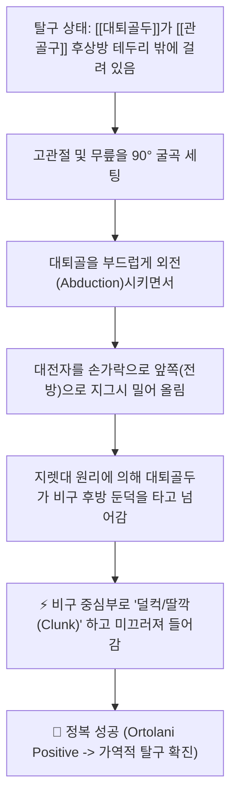
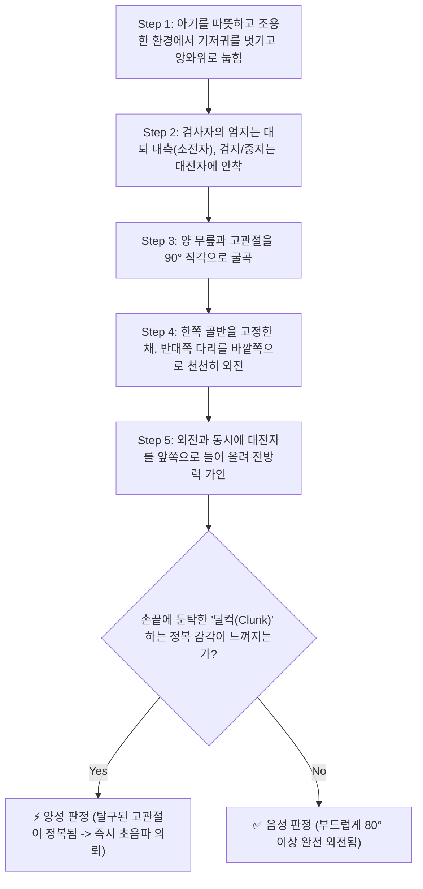

# 🩺 [[Ortolani test]] (오르톨라니 검사)

> **핵심 3줄 요약 (Key Summary)**:
> - 🎯 검사 목적 & 타겟 병소: 신생아 및 초기 영아에서 선천성/발달성 고관절 이형성증(DDH)의 조기 선별, 관골구 후방으로 탈구된 [[대퇴골두]]의 비구강 내 정복 가능성 평가.
> - 🔍 검사 시행 프로토콜 & 양성 반응: 앙와위 신생아의 대퇴부를 잡고 엄지는 대퇴 내측(소전자), 검지·중지는 대전자에 위치시킨 뒤 고관절을 90° 굴곡 상태에서 천천히 외전(Abduction)시키며 전방으로 거상, 대퇴골두가 비구 안으로 '딸깍(Clunk)' 하고 미끄러져 들어가면 양성 판정.
> - 📊 진단 정확도(민감도·특이도) & 임상적 의의: 생후 3개월 이내 영아에서 특이도 99%에 달하는 전 세계 소아과/정형외과 표준 필수 영아 검진 검사이며, 침묵의 고관절 탈구를 발견하는 결정적 도구임.
> - ⚠️ 위양성/위음성 요인 & 검사 금기: 무릎/인대의 무해한 미세 딸깍음(Click)과 골두가 뼈 둔덕을 넘는 둔탁한 덜컥음(Clunk)을 명확히 구별, 생후 3개월 이후에는 관절낭 구축으로 음성화되므로 앨리스 검사로 전환.

---

## 📌 목차
1. [검사 기본 정보 & 진단 목적 (Diagnostic Overview)](#1-검사-기본-정보--진단-목적-diagnostic-overview)
2. [해부학적 유발 메커니즘 & 생체역학적 원리 (Biomechanical Mechanism)](#2-해부학적-유발-메커니즘--생체역학적-원리-biomechanical-mechanism)
3. [표준 검사 시행 절차 (Step-by-Step Clinical Protocol)](#3-표준-검사-시행-절차-step-by-step-clinical-protocol)
4. [양성 반응 판정 기준 & 딸깍음(Clunk vs Click) 감별 맵핑 (Diagnostic Criteria & Mapping)](#4-양성-반응-판정-기준--딸깍음clunk-vs-click-감별-맵핑-diagnostic-criteria--mapping)
5. [연관 검사군 비교 & DDH 선별 복합 프로토콜 (Differential Battery & Algorithm)](#5-연관-검사군-비교--ddh-선별-복합-프로토콜-differential-battery--algorithm)
6. [양성 소견 시 한의 임상 연계 및 응급 소아정형외과 프로토콜 (Integrative Management)](#6-양성-소견-시-한의-임상-연계-및-응급-소아정형외과-프로토콜-integrative-management)
7. [💡 사용자 진료실 핵심 필기 & 실전 임상 팁 (원문 보존)](#7--사용자-진료실-핵심-필기--실전-임상-팁-원문-보존)
8. [출처 및 학술 참고 문헌 (References)](#8-출처-및-학술-참고-문헌-references)

---

## 1. 검사 기본 정보 & 진단 목적 (Diagnostic Overview)

![[오르톨라니검사_1단계_영아고관절굴곡외전_실사.png|450]]
> [그림 1: 검사자가 양손으로 영아의 양측 대퇴부를 부드럽게 감싸 쥐고 고관절 굴곡 및 외전 정복을 시행하는 실제 모습]

| 항목 | 상세 내용 |
| :--- | :--- |
| **검사명 (Test Name)** | 오르톨라니 검사 (Ortolani Test / Ortolani Maneuver, 올토라니 검사) |
| **분류 (Category)** | 소아 신경근골격계 이학적 검사 / 신생아 고관절 도수 정복 유발 검사 |
| **타겟 병소 (Target)** | [[고관절]](대퇴골두-관골구 결합), [[대퇴골두]], 관골구 연골순(Labrum), 대전자 |
| **의심 질환 (Suspected Pathologies)** | 발달성 고관절 이형성증(DDH), 선천성 고관절 탈구, 영아 고관절 아탈구 |
| **진단 정확도 (Diagnostic Accuracy)** | • **민감도 (Sensitivity)**: 87% ~ 96% (생후 0~3개월 신생아) • **특이도 (Specificity)**: 98% ~ 99% (대퇴골두 정복 덜컥음 감지 시) • **양성 우도비 (LR+)**: 15.0 ~ 45.0 이상 |
| **시연 영상 (Video Guide)** | [🎥 시연 영상: Ortolani and Barlow Test for DDH](https://www.youtube.com/watch?v=fBq9LaCEOic) |

---

## 2. 해부학적 유발 메커니즘 & 생체역학적 원리 (Biomechanical Mechanism)

![[오르톨라니검사_2단계_바로프_오르톨라니_도해.png|400]]
> [그림 2: Barlow 검사(탈구 유도: 내전 및 후방 압박)와 Ortolani 검사(정복 유도: 외전 및 전방 거상)의 상반된 기전 도해]

### 1) 탈구된 대퇴골두의 병태생리학적 위치
* 발달성 고관절 이형성증(DDH)을 가진 신생아는 관골구(비구, Acetabulum)가 얕고 편평하며 관절낭이 느슨합니다.
* 이로 인해 체중이나 근육 긴장에 의해 대퇴골두가 비구 뒤쪽 모서리(Posterior rim)를 넘어 골반 뼈 바깥에 빠져 있는 상태(탈구)가 됩니다.

### 2) 외전과 전방 거상에 의한 정복(Reduction) 기전
* 영아의 고관절을 90° 굽힌 상태에서 다리를 바깥쪽으로 벌리면(외전 Abduction), 관절낭과 내전근의 긴장이 풀립니다.
* 이때 검사자의 손가락이 대전자(Greater trochanter)를 뒤에서 앞으로 들어 올려주면, 지렛대 원리가 작동하면서 **대퇴골두가 비구 연골 모서리를 툭 타고 넘어 원래 자리인 오목한 비구강 한가운데로 빨려 들어가듯 쏙 들어갑니다(Reduction)**.
* 이 뼈가 제자리를 찾으며 발생하는 묵직하고 둔탁한 촉각적 감각을 **'오르톨라니 정복음(Ortolani clunk)'**이라고 부릅니다.

---

## 3. 표준 검사 시행 절차 (Step-by-Step Clinical Protocol)

### Step 1: 아기 안정화 및 손 파지 세팅 (Starting Position & Grip)
* 아기가 울거나 다리에 힘을 주면 근육 경련으로 정복이 불가능하므로, 따뜻하고 조용한 방에서 수유 직후 편안한 상태로 앙와위(Supine)로 눕힙니다.
* **표준 파지법 (Grip)**:
  * 검사자의 **엄지손가락(Thumb)**: 아기의 허벅지 안쪽, 대퇴골 소전자(Lesser trochanter) 부위에 놓습니다.
  * 검사자의 **검지와 중지(Index & Middle fingers)**: 아기의 허벅지 바깥쪽, 뼈가 만져지는 대전자(Greater trochanter) 부위를 감싸 쥡니다.

### Step 2: 90° 굴곡 및 외전 기동 (Flexion & Abduction Maneuver)
> [그림 3: 아기의 고관절을 90도 굽힌 채 부드럽게 바깥쪽으로 외전시키며 대전자를 전방으로 들어 올리는 모습]

* 아기의 고관절과 무릎을 90° 각도로 직각 굴곡시킵니다.
* 한 번에 한 다리씩 검사하며, 반대쪽 다리는 움직이지 않도록 골반을 안정적으로 지지합니다.
* 다리를 바깥쪽 침대 바닥 쪽으로 천천히 부드럽게 벌립니다 (외전 Abduction).

### Step 3: 대전자 전방 거상 및 정복 감지 (Anterior Lifting & Clunk Detection)
* 외전을 진행하는 동안, 대전자에 위치한 검지와 중지 손가락 끝으로 **대퇴골 상단을 위쪽(천장 방향)으로 지그시 들어 올립니다**.
* 빠져 있던 대퇴골두가 비구 안으로 넘어가면서 손끝에 **'덜컥(Clunk)' 하고 뼈가 맞아 들어가는 둔탁한 충격감**이 전해지는지 집중하여 감지합니다.
* 무리하게 힘을 주거나 비틀어서는 안 되며, 정상적인 아기는 저항 없이 양 무릎이 침대 바닥에 거의 닿을 정도로 80~90° 활짝 외전됩니다.

---

## 4. 양성 반응 판정 기준 & 딸깍음(Clunk vs Click) 감별 맵핑 (Diagnostic Criteria & Mapping)

* **진정한 양성 반응 (True Positive - Ortolani Clunk)**:
  * 다리를 외전시킬 때 **'덜컥/딸깍(Clunk)' 하는 묵직한 뼈의 정복 촉각과 함께, 덜 벌어지던 다리가 비구에 들어가면서 완전히 활짝 외전**될 때.
  * 발달성 고관절 탈구의 결정적 증거.
* **음성 반응 (Negative)**:
  * 아무런 걸림이나 소리 없이 양다리가 대칭적으로 부드럽게 80° 이상 끝까지 외전되는 상태.
* **⚠️ 양성 Clunk vs 무해한 Click의 결정적 감별 (CRITICAL)**:
  * **Clunk (병적 정복음)**: 대퇴골두가 골성 비구 턱을 넘어갈 때 생기는 깊고 둔탁한 '덜컥' 느낌. 눈으로도 대퇴골두가 쑥 들어가는 것이 보임.
  * **Click (양성 무해음)**: 슬관절 인대나 치골-대퇴 인대의 미세한 마찰로 나는 고음의 '딱딱/짤깍' 소리. 고관절 탈구와 무관한 정상 생리적 현상임.

| 감별 항목 | 병적 정복음 (Ortolani Clunk) | 양성 인대음 (Benign Click) |
| :--- | :--- | :--- |
| **촉각적 성상** | 묵직하게 뼈가 제자리에 들어가는 '덜컥' 충격감 | 가볍게 스쳐 지나가는 날카로운 '딱' 소리 |
| **가동 범위 변화** | 정복 직후 멈칫하던 **외전 가동 범위가 갑자기 확 열림** | 관절 가동 범위의 변화가 전혀 없음 |
| **발생 위치** | 깊숙한 고관절 비구 부위 | 표재성 슬관절 외측 인대 또는 대퇴근막 |
| **임상적 의미** | **발달성 고관절 이형성증 (즉시 전문의 의뢰)** | 정상 생리적 인대 이완 (경과 관찰) |

---

## 5. 연관 검사군 비교 & DDH 선별 복합 프로토콜 (Differential Battery & Algorithm)

| 검사명 | 검사 수기 및 동작 | 병태생리적 원리 | 임상적 역할 (영아 검진 콤보) |
| :--- | :--- | :--- | :--- |
| [[Ortolani test]] (본 검사) | 굴곡 상태에서 외전 + 대전자 전방 거상 | **탈구된 골두를 비구 내로 '정복'** | 탈구성 고관절 확인 (가장 특이적) |
| **바를로 검사 (Barlow Test)** | 굴곡 상태에서 내전 + 대퇴골 축성 후방 압박 | **비구 내 안착된 골두를 '탈구 유발'** | 불안정성/아탈구성 고관절 선별 |
| [[Allis test]] (갈레아치 징후) | 앙와위 무릎 90° 굴곡 후 무릎 높이 비교 | 탈구에 따른 대퇴부 수직/수평 단축 | 생후 3개월 이후 보행기 아동 선별 |
| **고관절 초음파 (Graf Method)** | 영아 고관절 관골구 각도(알파/베타각) 영상 계측 | 연골성 비구 및 골두의 3D 형태학 계측 | 생후 6개월 이전 DDH 표준 확진 도구 |

---

## 6. 양성 소견 시 한의 임상 연계 및 응급 소아정형외과 프로토콜 (Integrative Management)

* **소아정형외과 즉시 전원 골든타임 (Emergency Referral)**:
  * 오르톨라니 양성은 한의 침/추나의 적응증이 절대 아니며, **생후 6개월 이전 조기 진단 시 비수술적 보조기(Pavlik harness)만으로 95% 이상 완치**될 수 있는 골든타임 질환입니다.
  * 방치하여 보행기(생후 12개월 이후)로 넘어가면 비구가 납작하게 굳어버려 전신마취 하 절골술 및 관혈적 정복술이라는 대수술을 받아야 합니다.
  * 양성 감지 즉시 소아정형외과 전문 병원으로 고관절 초음파(Hip US) 및 파블릭 보조기 치료를 의뢰합니다.
* **가정 내 부모 지도 (Home Education)**:
  * 한국 전통 포대기나 다리를 쭉 펴서 꽁꽁 싸매는 **'쭉쭉이' 자세는 고관절 탈구를 악화시키는 최악의 요인**임을 부모에게 강력히 경고합니다.
  * 아기의 다리가 개구리 다리 모양(M자형 자세, 고관절 굴곡 및 외전)을 자유롭게 유지할 수 있도록 기저귀를 넉넉하게 채우도록 지도합니다.

---

## 7. 💡 사용자 진료실 핵심 필기 & 실전 임상 팁 (원문 보존)

* **사용자 원문 필기 (100% 보존)**:
  * 앙와위 검사자는 환자 대퇴골 소전자에 엄지손가락 대고 대퇴부를 잡은 후 고관절을 굴곡 외전 외회전 시켜본다.
  * 대퇴골두가 관골구에서 벗어나면 딸깍하는 소리가 나며 주로 신생아 선천성 고관절탈구.
* **진료실 실전 노하우 & 감별 팁**:
  1. **원장님의 정확한 손가락 위치 비결**: 원문 필기대로 **엄지손가락은 허벅지 안쪽(소전자 부위)**에, **가운데 손가락은 허벅지 바깥쪽(대전자 부위)**에 정확히 올려놓아야 합니다. 다리를 벌리면서 바깥쪽 가운데 손가락으로 대전자를 지그시 받쳐 올려줄 때 대퇴골두가 비구 속으로 쏙 들어가는 감각이 손가락 끝에 전율처럼 느껴집니다.
  2. **절대로 다리를 억지로 찢지 마세요**: 아기가 울어서 다리를 오므리고 있을 때 강제로 외전시키면 대퇴골두 무혈성 괴사(AVN)를 초래할 수 있습니다. 아기에게 노리개 젖꼭지를 물리거나 따뜻한 손으로 허벅지를 마사지하여 긴장이 완전히 풀린 틈을 타서 부드럽게 넘겨야 합니다.
  3. **생후 3개월의 유효기간**: 오르톨라니 검사는 관절낭이 느슨한 **생후 3개월 이내에만 유효합니다. 생후 3~4개월이 지나면 탈구된 상태 그대로 주변 근육(내전근)과 관절낭이 단단하게 굳어버려(구축 Contracture), 탈구되어 있어도 비구 안으로 정복되지 않아 오르톨라니 검사가 음성으로 나옵니다. 이때는 무릎 높이를 비교하는 [[Allis test]](갈레아치 검사)와 외전 제한 검사로 전환해야 합니다.

---

## 8. 출처 및 학술 참고 문헌 (References)

1. **Ortolani, M. (1937)**. *Un segno poco noto e sua importanza per la diagnosi precoce di prelussazione congenita dell'anca*. **La Pediatria**, 45, 129-136.
   - **[연구 요약]**: 이탈리아 소아과 의사 Marino Ortolani가 고관절 탈구 영아에서 굴곡-외전 시 대퇴골두가 비구로 정복되며 발생하는 둔탁한 딸깍음 징후를 세계 최초로 학계에 보고함.
2. **Barlow, T. G. (1962)**. *Early diagnosis and treatment of congenital dislocation of the hip*. **The Journal of Bone and Joint Surgery. British volume**, 44(2), 292-301. [PMID: 9973673](https://pubmed.ncbi.nlm.nih.gov/14037992/)
   - **[연구 요약]**: 신생아 9,000명 이상을 대상으로 Ortolani 및 Barlow 검사의 정형외과적 임상 정확도를 확립하고, 조기 보조기 착용을 통한 완전 정복 치료 프로토콜을 체계화함.
3. **American Academy of Pediatrics. (2000)**. *Clinical practice guideline: early detection of developmental dysplasia of the hip*. **Pediatrics**, 105(4), 896-905. [PMID: 11283326](https://pubmed.ncbi.nlm.nih.gov/10742337/)
   - **[연구 요약]**: 미국소아과학회(AAP)의 공식 임상 지침으로 생후 초기 영아 검진 시 Ortolani 수기법을 모든 신생아의 필수 스크리닝 검사로 공식 권고함.

<!-- 보관 태그(1회용·링크오류, 필요시 복원): 선천성고관절탈구, 신생아검진, 대퇴골두정복 -->
