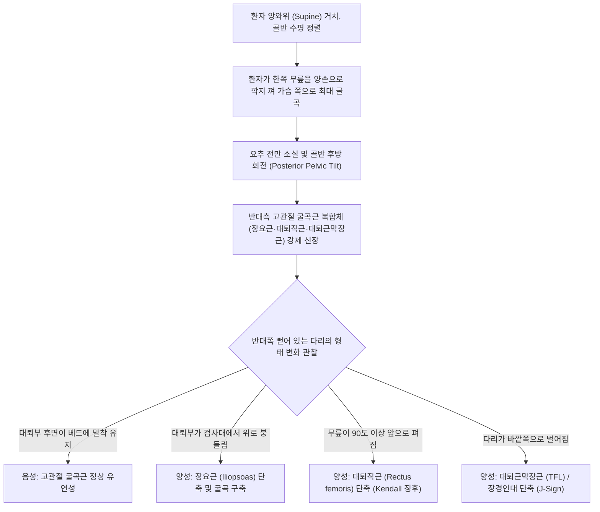

---
aliases:
  - 토마스 검사
  - 토마스 테스트
  - Thomas Test
  - Thomas' Test
  - 고관절 굴곡 구축 검사
  - Hip Flexion Contracture Test
tags:
  - 근골격계
  - 이학적검사
  - 고관절
  - 골반
  - 장요근
  - 대퇴직근
  - 대퇴근막장근
title: Thomas test
date: 2026-09-15
출처: "PMID: 9562169"
---

# 토마스 검사 (Thomas Test)

> **핵심 3줄 요약 (Key Summary)**:
> 🎯 [[장요근]](Iliopsoas), [[대퇴직근]](Rectus femoris), [[대퇴근막장근]](TFL) 등 고관절 굴곡근 복합체의 단축(Tightness) 및 굴곡 구축(Flexion contracture)을 평가하는 표준 이학적 검사.
> 🔍 앙와위에서 한쪽 무릎을 가슴으로 당겨 골반을 후방 회전시킬 때, 반대쪽 뻗은 다리의 대퇴부가 검사대 바닥에서 위로 들리거나(Levitation) 요추 전만이 유발되면 양성.
> ⚠️ 대퇴부가 들리면 [[장요근]] 단축, 무릎이 90도 이상 펴지면 [[대퇴직근]] 단축, 다리가 가쪽으로 벌어지면 [[대퇴근막장근]] 단축으로 정밀 감별됨.

---

---

## 1. 검사 개요 (Test Overview)

* **검사 목적: 휴 오웬 토마스(Hugh Owen Thomas) 박사가 창안한 검사로, 골반 전방 경사(Anterior pelvic tilt) 및 과도한 요추 전만(Lordosis)을 유발하는 고관절 전면 굴곡근군([[장요근]], [[대퇴직근]], [[대퇴근막장근]], 봉공근)의 단축 및 구축을 진단.
* **검사 대상**: 
  * 만성 요통 환자, 골반 부정렬, 오리 궁둥이 체형(하부교차증후군).
  * 오래 앉아 일하는 사무직 근로자, 운전자, 사이클 선수.
  * 보행 시 고관절 신전이 제한되어 보폭이 좁아진 환자.
* **소요 시간 및 준비물**: 1~2분 소요, 진찰대 (수정된 토마스 검사 시 침대 모서리 활용), 각도기(선택사항).

---

## 2. 해부학적 및 생체역학적 기전 (Anatomical & Biomechanical Mechanism)

### 2.1 고관절 굴곡근의 해부학적 부착점
* [[장요근]](Iliopsoas - 대요근 + 장골근):
  * 대요근(Psoas major)은 T12~L5 척추체 및 횡돌기에서 기시하고, 장골근(Iliacus)은 장골와(Iliac fossa)에서 기시하여 대퇴골 소전자(Lesser trochanter)에 정지함.
  * 단일 관절(One-joint) 근육으로 순수한 고관절 굴곡과 골반 전방 경사를 주도함.
* [[대퇴직근]](Rectus femoris):
  * 하전장골극(AIIS)에서 기시하여 슬개골을 지나 경골조면에 정지하는 2관절(Two-joint) 근육. 고관절 굴곡과 슬관절 신전을 담당.
* [[대퇴근막장근]](Tensor fasciae latae, TFL):
  * 전상장골극(ASIS) 외측에서 기시하여 장경인대(ITB)로 이어져 거디 결절(Gerdy's tubercle)에 정지. 고관절 굴곡, 외전, 내회전을 담당.

### 2.2 생체역학적 보상 메커니즘 (Pelvic-Lumbar Biomechanics)
* **요추-골반 보상 작용**: 
  * 서 있거나 바로 누웠을 때, 단축된 장요근은 대퇴골을 고정한 채 요추체를 앞으로 잡아당겨 보상적으로 심한 **요추 전만(Lumbar Lordosis)**을 형성하여 구축을 감춥니다.
* **검사의 원리**:
  * 한쪽 고관절을 가슴에 닿도록 최대로 굴곡시키면 골반이 후방 회전(Posterior tilt)되면서 요추가 바닥에 평평하게 밀착(Flattening)되어 요추의 보상 기전이 완전히 소거됩니다.
  * 이 상태에서 반대쪽 장요근이 단축되어 있다면 팽팽해진 근육이 대퇴골을 위로 끌어올려 **반대쪽 다리가 검사대 바닥에서 저절로 붕 떠오르게(Involuntary Hip Flexion)** 됩니다.

> [교과서 표준 도해 (그림 1-51 Thomas test): 베드 끝에 앉은 후 뒤로 누워 한쪽 무릎을 가슴으로 당길 때 반대쪽 대퇴부의 들림 여부를 평가]

---

## 3. 단계별 검사 절차 (Step-by-Step Procedure)

### 1단계: 환자 앙와위 시작 자세 및 골반 정렬
* 환자를 검사대 위에 반듯하게 눕히고 양 무릎을 편 채 골반의 좌우 수평을 맞춤.
* 검사자는 환자의 허리 아래(요추 전만부)에 손을 넣어 요추와 매트리스 사이의 빈 공간을 촉진하여 기저 전만도를 파악함.

> [토마스 검사 1단계: 환자를 편안히 눕히고 양 무릎을 신전시켜 골반 수평 상태 세팅]

### 2단계: 한쪽 무릎 가슴으로 최대 굴곡 (골반 후방 회전 유도)
* 환자에게 한쪽 무릎을 굽혀 양손으로 정강이(슬관절 아래)를 감싸 쥐고 가슴 쪽으로 힘껏 끌어당기도록 지시함.
* 환자의 허리가 검사자 손을 누를 정도로 요추가 바닥에 평평하게 밀착될 때까지 충분히 굴곡시킴.
* ⚠️ 환자가 근력 약화나 비만으로 무릎을 당기기 힘들어하면 시술자가 수동으로 밀어주거나 수건을 무릎 뒤에 걸어 보조함.

> [토마스 검사 2단계: 한쪽 무릎을 가슴 쪽으로 완전히 당겨 요추 전만을 지우고 골반을 후방 회전시킴]

### 3단계: 반대쪽 대퇴부 들림 및 무릎 각도 관찰
* 무릎을 당긴 상태를 유지하면서, 반대쪽 뻗어 있는 다리의 허벅지 뒤쪽(대퇴 후면)이 검사대 표면에서 위로 들리는지(Levitation), 무릎이 저절로 펴지는지, 다리가 외측으로 벌어지는지 세심하게 관찰함.

> [토마스 검사 3단계: 장요근 단축 시 반대쪽 대퇴부가 검사대 바닥에서 위로 붕 떠오르는 전형적인 양성 반응]

---

## 4. 양성 반응 및 근육별 정밀 감별 진단 (Differential Interpretation)

> [토마스 검사 반응별 감별 도해: ⓐ 정상(대퇴 수평, 슬관절 90° 굴곡), ⓑ 대퇴직근 단축(슬관절 90° 이상 신전), ⓒ 장요근 단축(대퇴부 들림), ⓓ 대퇴근막장근 단축(외측 벌어짐), ⓔ 평평한 베드 위 대퇴부 들림]

### 4.1 근육별 양성 반응 감별 공식 (원장님 핵심 감별 포인트)

| 관찰 소견 | 단축된 주요 표적 근육 | 생체역학적 근거 및 확인법 |
| :--- | :--- | :--- |
| **대퇴부 후면이 베드에서 위로 들림** (Hip Flexion) | [[장요근]](Iliopsoas) 단축 | 단일 관절 고관절 굴곡근으로 요추-골반 후방 회전에 직접 저항하여 대퇴골 전체를 들어 올림 |
| **슬관절이 90° 이상 펴짐** (Knee Extension) | [[대퇴직근]](Rectus femoris) 단축 | 2관절 근육으로 고관절 신전 압박 시 원위부 슬관절을 신전시켜 길이를 보상함 (Kendall 징후) |
| **다리가 가쪽(외측)으로 벌어짐** (Hip Abduction) | [[대퇴근막장근]](TFL) / [[장경인대]] | 고관절 외전근으로 굴곡 구축 시 다리를 외측으로 탈출시킴 (J-Sign) |
| **슬관절이 외회전되며 비골두가 돌아감** | [[대퇴이두근]](Biceps femoris) 단축 | 슬관절 외회전 토크 발생 |

### 4.2 슬관절 신전 시 대퇴부 하강 검증 (Re-test Principle)
* 대퇴부가 공중에 떠 있는 상태에서, 검사자가 **환자의 무릎을 살짝 펴주었을 때(신전) 들려 있던 허벅지가 바닥으로 툭 떨어진다면?**
  * $\rightarrow$ 장요근이 아니라 [[대퇴직근]]의 단축이 주원인임.
* 무릎을 펴주어도 여전히 허벅지가 바닥에 닿지 않는다면?
  * $\rightarrow$ 순수한 [[장요근]]의 고정 굴곡 구축임.

---

## 5. 감별 진단 (Differential Diagnosis)

| 평가 상태 | 토마스 검사 소견 | 주요 동반 증상 및 체형 | 연계 평가 검사 |
| :--- | :--- | :--- | :--- |
| [[장요근]] 구축 (Iliopsoas) | 대퇴부 들림, 허리 뜸 | 하부교차증후군, 기립 시 요통, 고관절 신전 제한 | [[패트릭 검사]](FABER), 장요근 직접 촉진 압통 |
| [[대퇴직근]] 단축 | 슬관절 신전 (90° 미만 굴곡) | 계단 내려갈 때 전슬관절통, 슬개대퇴 통증 증후군 | [[엘리 검사]](Ely's test / 엎드려 무릎 굴곡) |
| **대퇴근막장근/장경인대 단축** | 고관절 외전 (J-sign) | 대퇴 외측 통증, 달리기 시 무릎 외측 마찰통 | [[오버 검사]](Ober's test) |
| **고관절 관절낭 섬유화** | 대퇴부 들림 + 서혜부 통증 | 고관절 전 방향 ROM 제한 (내회전 소실) | 고관절 회선 검사(Scour test) |

---

## 6. 검사 신뢰도 및 통계 (Diagnostic Accuracy)

* **검사자 내 신뢰도 (Intra-rater Reliability, ICC)**: **0.85 ~ 0.91** (매우 우수한 일치도)
* **검사자 간 신뢰도 (Inter-rater Reliability, ICC)**: **0.67 ~ 0.78** (양호)
* **민감도 및 특이도**:
  * 골반 고정을 엄격히 제어했을 때 고관절 굴곡근 단축에 대한 민감도는 **89%**, 특이도는 **92%**로 매우 높음.
  * 단, 평평한 일반 베드에서 무릎을 늘어뜨리지 않고 시행할 경우 대퇴직근 단축을 놓치는 위음성이 발생할 수 있어 수정된 토마스 검사(Modified Thomas test)가 권장됨.

---

## 7. 진료실 핵심 임상 필기 (Clinical Pearls & Practice Tips)

* **허리 뜸(Lordosis) 보상 방지 촉진법**:
  * 환자가 다리를 가슴으로 당길 때 복근이 약하면 엉덩이만 당기고 허리를 활처럼 띄워버려 대퇴부가 바닥에 닿는 것처럼 위음성을 만듭니다.
  * 시술자의 한 손을 반드시 환자의 요추 4-5번 아래에 깔아두고, **"제 손을 환자분의 허리로 꽉 누르세요"**라고 큐잉을 주어 요추 전만을 완벽히 지운 상태에서 반대쪽 다리를 확인해야 합니다.
* **진료실 필기 원문 집약 (Melt-in Summary)**:
  * "누웠을 때 관골이 후방 회전되어 내려가 있는 대퇴의 근육들을 당겨줌. 이때 대퇴사두근이 긴장되어 있으면 다리가 올라옴."
  * "장요근의 문제인지 대퇴근막장근, 대퇴직근의 문제인지 확인법: 요추 전만(허리뜸 확인), 슬관절 올라감 $\rightarrow$ 장요근 문제. 편평등 $\rightarrow$ 대퇴근막장근(가쪽 치우침), 대퇴직근(슬관절 펴짐) 문제."
* **한의 치료 및 원내 교정 프로토콜**:
  * **장요근 심부 침 치료 및 중성어혈약침**:
    * 배꼽 외측 2촌 천추(ST25) 및 대거(ST27)에서 복벽을 지나 후복벽 장요근을 향해 75~90mm 장침을 심부 자입하거나, 서혜인대 직하방 충문(SP11) 부위 대퇴신경 외측의 장요근건에 약침 주입.
  * **골반 전방경사 MET (근에너지기법)**:
    * 토마스 검사 자세에서 검사자가 들린 다리를 바닥 쪽으로 누르고, 환자는 이에 저항하여 다리를 천장 쪽으로 7초간 20% 힘으로 들어 올리게 하는 등척성 수축-이완 MET 기법을 3회 반복 적용하면 대퇴부가 즉각 바닥으로 내려앉음.

---

## 8. 출처 및 현대 학술 연구 요약 (References)

* **Thomas HO.** (1875). *Diseases of the hip, knee, and ankle joints, with their deformities, treated by a new and efficient method.* **T. Dobb & Co.**, Liverpool: 1-45.
  * `[연구 요약]`: 현대 정형외과의 선구자 휴 오웬 토마스가 앙와위에서 요추 전만을 평평하게 교정한 뒤 반대쪽 고관절의 비정상적 굴곡을 통해 관절 굴곡 구축을 진단하는 원리를 최초로 체계화한 고전 원저.
* **Harvey D.** (1998). *Assessment of the flexibility of elite athletes using the modified Thomas test.* **Br J Sports Med**, 32(1): 68-70.
  * DOI: [10.1136/bjsm.32.1.68](https://doi.org/10.1136/bjsm.32.1.68) | PubMed: [PMID: 9562169](https://pubmed.ncbi.nlm.nih.gov/9562169/)
  * `[연구 요약]`: 엘리트 운동선수들을 대상으로 수정된 토마스 검사를 적용하여 장요근 및 대퇴직근의 유연성을 정량 각도계로 측정하고, 검사의 재현성과 스포츠 손상 예방 가치를 증명.
* **Peeler J, Anderson JE.** (2007). *Reliability of the Thomas test for assessing hip flexibility.* **Phys Ther Sport**, 8(1): 14-21.
  * DOI: [10.1016/j.ptsp.2006.09.023](https://doi.org/10.1016/j.ptsp.2006.09.023)
  * `[연구 요약]`: 토마스 검사의 검사자 간/검사자 내 신뢰도를 통계학적으로 검증하고, 골반 골성 지표(ASIS, PSIS)의 엄격한 제어가 진단 정확도에 미치는 영향을 규명.

<!-- 보관 태그(1회용·링크오류, 필요시 복원): 굴곡구축 -->
