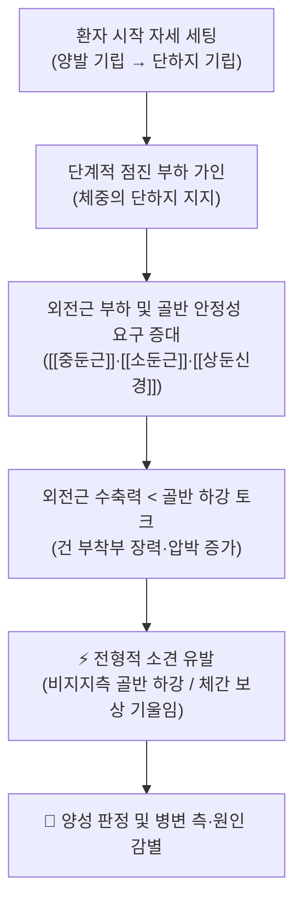
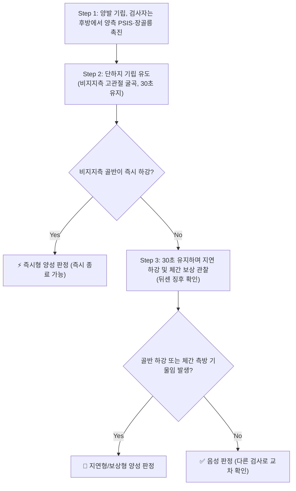
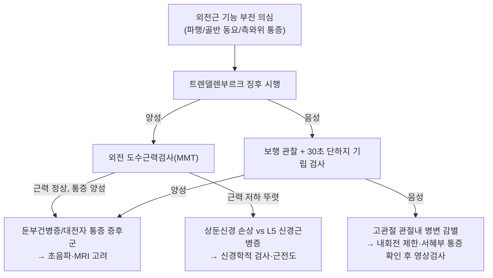

# 🩺 [[트렌델렌부르크 징후]] (Trendelenburg Sign / 特倫德倫伯氏徵, TS)

> **핵심 3줄 요약 (Key Summary)**:
> - 🎯 검사 목적 & 타겟 병소: 단하지(單脚) 지지 시 골반의 안정성을 유지하지 못하는지를 관찰하여 **고관절 외전근(abductor) 기능 부전**을 선별한다. 타겟 구조물은 [[중둔근]](gluteus medius), [[소둔근]](gluteus minimus), [[대퇴근막장근]](tensor fasciae latae), 그리고 이들을 지배하는 [[상둔신경]](superior gluteal nerve, L4~S1) 및 [[고관절]] 관절면이다. 의심 질환으로 [[대전자 통증 증후군]](GTPS)/[[둔부건병증]], [[고관절 골관절염]], [[발달성 고관절 이형성증]], [[대퇴골 경부 골절]], [[L5 신경근병증]], 상둔신경 손상 등을 들 수 있다 (Gogu & Gandbhir, 2022, PMID: 32310447; Sunil Kumar & Rawal, 2021, PMID: 33341914).
> - 🔍 검사 시행 프로토콜 & 양성 반응: 환자를 편평한 바닥에 세우고 검사자는 후방에서 양측 후상장골극(PSIS)·장골릉 높이를 촉진한 상태에서, 환자가 한쪽 다리를 들어 단하지로 30초간 체중을 지지하게 한다. **비(非)지지측 골반이 하강하거나(전형적 양성), 환자가 체간을 지지측으로 기울여 보상하는 경우(뒤센 보상)** 양성으로 판정한다 (Gogu & Gandbhir, 2022, PMID: 32310447; Gandbhir & Lam, 2026, PMID: 31082138; Golub, 1947, PMID: 18902317).
> - 📊 진단 정확도(민감도·특이도) & 임상적 의의: **제공된 참고 문헌에서는 민감도·특이도·양성 우도비(LR+)의 정량 수치가 확인되지 않는다(근거 미확인).** 다만 정상 고관절에서도 트렌델렌부르크 징후가 양성으로 나타날 수 있음이 보고되어 있어(Vasudevan & Vaidyalingam, 1997, PMID: 9180330), **단독 확진(Rule-In) 검사가 아니라 병력·도수근력검사·영상검사와 병행하는 선별(Rule-Out 보조) 검사**로 운용해야 한다.
> - ⚠️ 위양성/위음성 요인 & 검사 금기: 급성 [[대퇴골 경부 골절]], 최근 고관절 치환술 직후, 심한 통증성 관절염으로 체중 지지 자체가 불가한 경우는 검사를 연기하거나 금기한다. 통증 회피를 위한 체간 보상(Duchenne)은 골반 하강을 가려 **위음성**을 만들고, 하지 길이 차이·고관절 굴곡 구축·통증성 억제는 **위양성**을 만들 수 있다.

---

## 📌 목차
1. [검사 기본 정보 & 진단 목적 (Diagnostic Overview)](#1-검사-기본-정보--진단-목적-diagnostic-overview)
2. [해부학적 유발 메커니즘 & 생체역학적 원리 (Biomechanical Mechanism)](#2-해부학적-유발-메커니즘--생체역학적-원리-biomechanical-mechanism)
3. [표준 검사 시행 절차 (Step-by-Step Clinical Protocol)](#3-표준-검사-시행-절차-step-by-step-clinical-protocol)
4. [양성 반응 판정 기준 & 신경근/조직별 감별 맵핑 (Diagnostic Criteria & Mapping)](#4-양성-반응-판정-기준--신경근조직별-감별-맵핑-diagnostic-criteria--mapping)
5. [연관 검사군 비교 & 다단계 감별 알고리즘 (Differential Battery & Algorithm)](#5-연관-검사군-비교--다단계-감별-알고리즘-differential-battery--algorithm)
6. [양성 소견 시 한의 임상 연계 치료 전략 (Integrative Korean Medicine)](#6-양성-소견-시-한의-임상-연계-치료-전략-integrative-korean-medicine)
7. [💡 사용자 진료실 핵심 필기 & 실전 임상 팁 (원문 보존)](#7--사용자-진료실-핵심-필기--실전-임상-팁-원문-보존)
8. [출처 및 학술 참고 문헌 (References)](#8-출처-및-학술-참고-문헌-references)

---

![[트렌델렌버그_1단계_정상반응_골반수평유지_실사.jpg]]
![[트렌델렌버그_2단계_양성반응_반대측골반하강_실사.jpg]]

## 1. 검사 기본 정보 & 진단 목적 (Diagnostic Overview)

| 항목 | 상세 내용 |
| :--- | :--- |
| **검사명 (Test Name)** | Trendelenburg Sign / Trendelenburg Test (트렌델렌부르크 징후 / 트렌델렌버그 검사, TS) |
| **분류 (Category)** | 정형외과적 이학적 검사 / 고관절 외전근 기능 및 골반 안정성 검사 / 동적 보행 분석 보조 검사 |
| **타겟 병소 (Target)** | [[중둔근]]·[[소둔근]] (고관절 주 외전근), [[대퇴근막장근]], [[상둔신경]] (L4~S1), [[고관절]] 관절면 및 [[대전자]] 활액낭 |
| **의심 질환 (Suspected Pathologies)** | [[대전자 통증 증후군]](GTPS) 및 [[둔부건병증]], [[고관절 골관절염]], [[발달성 고관절 이형성증]](DDH), [[대퇴골 경부 골절]] 및 불유합, [[상둔신경 손상]], [[L5 신경근병증]], 고관절 치환술 후 외전근 기능 부전 |
| **진단 정확도 (Diagnostic Accuracy)** | • **민감도 (Sensitivity)**: 제공 문헌 내 정량 수치 확인되지 않음 — **근거 미확인** • **특이도 (Specificity)**: 정량 수치 근거 미확인. 단, **고관절이 정상인 환자에서도 양성으로 나타날 수 있음**이 보고되어 특이도가 낮은 편으로 해석된다 (Vasudevan & Vaidyalingam, 1997, PMID: 9180330) • **양성 우도비 (LR+)**: **근거 미확인** • **검사 성격**: 단독 확진 불가. 도수근력검사·단하지 기립 검사·영상검사와 조합하여 해석 |
| **시연 영상 (Video Guide)** | 제공된 참고 자료에 시연 영상 없음 — **근거 미확인** |

> **임상적 의의 요약**: 트렌델렌부르크 징후는 "고관절 외전근이 골반을 수평으로 유지할 수 있는가"라는 단일 기능 질문에 대한 기능적 답변이다. 따라서 이 검사는 **특정 질환 하나를 지목하는 검사가 아니라, 외전근 기능 부전이라는 최종 공통 경로(final common pathway)를 확인하는 기능 검사**로 이해하는 것이 정확하다 (Gogu & Gandbhir, 2022, PMID: 32310447).

---

## 2. 해부학적 유발 메커니즘 & 생체역학적 원리 (Biomechanical Mechanism)

### 1) 생체역학적 스트레스 전달 경로
* **지렛대 모델**: 단하지 지지 시 고관절은 회전축(fulcrum)이 되고, 체중(center of gravity)은 지지측 고관절의 **내측**에 위치하며, 외전근 군은 고관절의 **외측**에서 당긴다. 즉 체중은 골반을 지지측으로 기울이려는 토크를 만들고, 중둔근·소둔근은 이에 대항하는 반대 토크를 만들어 골반을 수평으로 유지한다.
* **힘의 비대칭**: 이 구조 때문에 단하지 지지 시 외전근은 체중보다 큰 힘을 내야 하며, 그 결과 [[대전자]] 부착부 건(tendon)에는 반복적 인장 부하가 집중된다. 이 부하 집중이 [[둔부건병증]]과 [[대전자 통증 증후군]]의 병태생리로 연결된다 (Sunil Kumar & Rawal, 2021, PMID: 33341914).
* **정량 수치 주의**: 체중 대비 외전근 힘의 배수, 고관절 반력(joint reaction force)의 구체적 배율 등은 **제공된 참고 문헌에서 확인되지 않는다(근거 미확인)**. 따라서 진료실에서는 "체중보다 큰 힘이 필요하다"는 정성적 원리로 설명하고, 특정 배수를 환자에게 단정적으로 제시하지 않는다.

### 2) 징후 발현의 병태생리학적 기전
* **근수축 실패 기전**: 중둔근·소둔근의 근력 저하, 건 파열, 또는 통증성 억제(pain inhibition)로 필요한 토크를 만들지 못하면 비지지측 골반이 중력 방향으로 하강한다 → 이것이 **전형적 트렌델렌부르크 징후**다.
* **신경성 기전**: [[상둔신경]](L4~S1)은 중둔근·소둔근·대퇴근막장근을 지배하므로, 이 신경의 손상(예: 후방 접근 고관절 수술, 둔부 근육주사 합병증) 또는 [[L5 신경근병증]]은 동일한 기능 부전을 만든다 (Gogu & Gandbhir, 2022, PMID: 32310447).
* **보상 기전(뒤센 징후)**: 환자가 골반 하강을 스스로 감지하고 **체간을 지지측으로 기울이면** 체중선이 고관절 위로 이동하여 외전근 요구량이 줄어든다. 이때 골반 하강은 오히려 관찰되지 않을 수 있어, 보상 자세 자체를 양성 소견의 일부로 읽어야 한다 (Golub, 1947, PMID: 18902317; Gandbhir & Lam, 2026, PMID: 31082138).
* **보행으로의 확장**: 동일한 기능 부전이 보행 중에 나타나면 체간이 지지측으로 크게 흔들리는 [[트렌델렌부르크 보행]](중둔근 보행)이 된다 (Gandbhir & Lam, 2026, PMID: 31082138).

---

## 3. 표준 검사 시행 절차 (Step-by-Step Clinical Protocol)

![[Pasted image 20240122140653.png|500]]
> [그림: 검사 준비 자세 도해]

### Step 1: 환자 준비 및 초기 자세 (Starting Position)
* 환자는 **신발을 벗고** 편평하고 단단한 바닥에 서며, 양발을 어깨너비로 벌려 체중을 균등하게 싣는다. 시선은 정면, 팔은 자연스럽게 늘어뜨리거나 필요 시 지지대를 가볍게 잡게 한다(고령자 안전).
* 검사자는 환자의 **뒤에 서서** 양측 [[후상장골극]](PSIS)과 장골릉(iliac crest) 높이를 **양손 엄지로 동시에 촉진**하여 좌우 수평 기준선을 확립한다. 이 기준선 확보가 검사의 정확도를 좌우하는 핵심 단계다.
* 하지 길이 차이(LLD), 골반 비대칭, 척추 측만이 기저선에 영향을 줄 수 있으므로 미리 기록해 둔다.

### Step 2: 단하지 기립 유도 (Single-Leg Stance – 1차 부하)
* 환자에게 한쪽 하지를 들어 **고관절을 굴곡(약 30~90°)** 한 상태로 유지하게 하고, 남은 한쪽 다리로 체중을 완전히 지지하게 한다. 검사자는 지지측 골반과 비지지측 골반의 높이 차를 계속 촉진·관찰한다.
* **즉시 하강이 관찰되면** 그 자체로 양성이며, 환자가 통증·불안정을 호소하면 즉시 중단한다.
* **중요**: 환자가 비지지측 골반을 무의식적으로 들어 올리거나 체간을 기울여 보상하지 않도록, "골반을 편하게 두고 그대로 서 있어 달라"고 구두 지시를 준다.

### Step 3: 유지 시간 및 지연 반응 평가 (Delayed Response)
* 증상 없이 즉시 하강이 관찰되지 않으면 **약 30초간 단하지 지지를 유지**시키며 지연성 하강(delayed drop)을 관찰한다. 지연성 하강은 외전근의 지구력(endurance) 저하를 시사하는 소견으로 해석된다.
* 동시에 **체간이 지지측으로 기울어지는 보상(뒤센 징후)** 이 나타나는지 확인한다. 보상 자세가 나타나면 "근력은 부족하지만 보상으로 버티고 있는 상태"로 판독한다.
* 좌우를 **반드시 교대 시행**하여 양측을 비교한다. 한쪽만 시행하면 위양성/위음성을 판별할 수 없다.

### Step 4: 부하 해제 및 안전 확인 (Release & Safety)
* 검사 종료 시 환자를 즉시 앉히거나 지지대를 잡게 하여 낙상 위험을 제거한다.
* 검사 중 **날카로운 서혜부 통증, 갑작스러운 무력감, 어지럼**이 발생하면 즉시 중단하고 골절·관절 불안정성 여부를 감별한다.
* 부가 변형: 단하지 기립이 어려운 고령·허약 환자에서는 지지대를 잡은 상태로 시행하거나, 앙와위에서 검사자가 골반을 지지하며 하지를 들어 올려 골반 하강을 관찰하는 변형을 고려한다(변형 프로토콜의 정량적 타당도는 **근거 미확인**).

---

> [그림: 검사 단계 실사]
> [그림: 검사 단계 실사]
## 4. 양성 반응 판정 기준 & 신경근/조직별 감별 맵핑 (Diagnostic Criteria & Mapping)

* **진정한 양성 반응 (True Positive)**:
  * 단하지 지지 중 **비지지측 골반(PSIS·장골릉)이 지지측 대비 뚜렷하게 하강**할 때.
  * 또는 골반 하강을 감추기 위해 **체간이 지지측으로 기울어지는 보상(뒤센 징후)** 이 관찰될 때 (Golub, 1947, PMID: 18902317).
* **음성 반응 (Negative)**:
  * 30초 유지 동안 양측 골반 높이가 수평을 유지하고, 체간 보상 기울임도 없는 경우.
* **가양성(False Positive) 감별**:
  * 통증성 억제(고관절 골관절염, 대전자 압통), 하지 길이 차이, 고관절 굴곡 구축, 검사자 촉진 위치 오류에 의해 실제 외전근 손상 없이도 하강이 관찰될 수 있다. 이 경우 외전근 도수근력검사(MMT)에서 근력이 정상이라면 **관절 병변 또는 통증성 억제에 의한 이차성 양성**으로 해석한다.
* **정상 고관절에서의 양성**: 고관절 자체가 정상인 환자에서도 트렌델렌부르크 징후가 양성으로 나타날 수 있음이 보고되어 있어(Vasudevan & Vaidyalingam, 1997, PMID: 9180330), **양성 소견만으로 고관절 병변을 단정하지 않는다.**

| 병변 분절 / 조직 | 골반 하강 및 자세 양상 | 주요 근력 저하 지표 | 동반 감별 포인트 |
| :--- | :--- | :--- | :--- |
| **상둔신경 (L4~S1) 손상** | 비지지측 골반 하강 + 뚜렷한 체간 보상 기울임 | [[중둔근]]·[[소둔근]] 위축 및 외전 MMT 저하 | 후방/전외측 고관절 수술력, 둔부 근육주사력, 둔부 근육 위축 |
| **중둔근·소둔근 건병증 (GTPS)** | 경미~중등도 하강, 30초 유지 실패(지구력 저하) | 통증으로 인한 외전 MMT 저하(억제성) | [[대전자]] 압통, 측와위 시 통증, 야간통, 계단·측방 보행 시 악화 (Sunil Kumar & Rawal, 2021, PMID: 33341914) |
| **고관절 골관절염** | 관절 통증 회피성 하강(이차성) | 외전력 저하보다 관절 운동 제한이 우세 | 서혜부 통증, 내회전 제한, 관절 잠김·파행 |
| **발달성 고관절 이형성증 / 탈구** | 일측성 지속적 하강 | 외전근 발달 부전 | 소아·청소년기 보행 지연, 하지 단축, 피부 주름 비대칭 |
| **대퇴골 경부 골절 / 불유합** | 급성기에는 검사 자체가 금기 | 체중 지지 불가 | 하지 외회전·단축, 극심한 통증 (검사 연기) |
| **L5 신경근병증** | 외전근 근력 저하에 의한 하강 | 족배굴곡·족지신전 약화 동반 | 하지 방사통, 감각 저하, 심부건반사 이상 (신경학적 검사 필수) |
| **고관절 치환술 후** | 외전근 지연 회복으로 양성 지속 가능 | 외전 MMT 단계적 회복 | 탈구 위험 자세 회피, 수술 접근법(후방 접근 시 상둔신경 위험) 확인 |

---

## 5. 연관 검사군 비교 & 다단계 감별 알고리즘 (Differential Battery & Algorithm)

| 검사명 | 검사 수기 및 동작 | 병태생리적 원리 | 임상적 역할 (선별 vs 확진) |
| :--- | :--- | :--- | :--- |
| [[트렌델렌부르크 징후]] (본 검사) | 단하지 기립 + 검사자 후방 PSIS 촉진, 골반 하강 관찰 | 외전근 토크 < 골반 하강 토크 | 기능 부전 확인용. 특이도 낮아 단독 확진 불가 |
| [[뒤센 징후]] (Duchenne sign) | 단하지 기립 시 체간이 지지측으로 기울어지는지 관찰 | 체중선 이동을 통한 외전근 요구량 감소 보상 | 본 검사와 세트로 판독하는 보상 지표 |
| [[단하지 기립 검사]] (Single-leg stance test) | 30초간 단하지 지지, 통증 발생 여부로 판정 | 건 부착부 부하 누적에 따른 통증 유발 | [[둔부건병증]] 선별에 민감도 우위 |
| [[고관절 외전 도수근력검사]] (Hip abduction MMT) | 측와위 또는 좌위에서 능동 외전 저항 검사 | 근 자체의 수축력 정량 평가 | 근력 vs 통증성 억제 감별 |
| [[트렌델렌부르크 보행]] (Trendelenburg gait) | 보행 관찰(체간 동요, 골반 하강) | 보행 주기 중 단하지 지지기의 외전근 실패 | 기능 장애의 일상생활 영향도 평가 |
| [[오버 검사]] (Ober test) | 측와위에서 고관절 신전·외전 후 내전 이완 관찰 | 장경인대·[[대퇴근막장근]] 긴장도 평가 | 외전근 자체 약화와 긴장성 제한 감별 |

---

## 6. 양성 소견 시 한의 임상 연계 치료 전략 (Integrative Korean Medicine)

> 아래 전략은 **트렌델렌부르크 징후 양성 = 고관절 외전근 기능 부전(둔부건병증·관절 병변·신경성 원인)** 이라는 해석을 전제로 한 한의 임상 연계 접근이다. 제공된 참고 문헌은 이학적 검사 및 병태생리에 관한 것으로, 한의 치료법의 유효성 근거는 별도 문헌 확인이 필요하다(**근거 미확인**).

* **침구 및 전침 치료 (Acupuncture & EA)**:
  * 둔부 외전근 및 대전자 주변의 근위 혈위를 중심으로 자침한다: [[환도]](GB30), [[거료]](GB29), [[질변]](BL54), [[승부]](KI11), [[중도]](GB32), [[양릉천]](GB34) 및 국소 [[아시혈]](대전자 압통점).
  * 만성 건병증 국면에서는 2~4Hz 저주파 전침을 통전하여 국소 혈류 개선 및 통증성 억제 완화를 도모한다.
* **약침 요법 (Pharmacopuncture)**:
  * 대전자 부착부 및 둔부 근육 내에 [[신바로약침]] 또는 [[중성어혈약침]] 1.0~2.0cc를 주입하여 국소 염증성 매개물질 완화를 목표로 한다. 초음파 유도 하 주입이 안전하며, 혈관·신경 주행을 반드시 확인한다.
* **추나 치료 (Chuna Therapy)**:
  * 고관절 측방 관절가동추나, 견인(감압) 기법, 근에너지기법(MET)을 이용하여 외전근의 과긴장과 관절낭 제한을 완화한다.
  * 급성 [[대퇴골 경부 골절]] 의심, 최근 인공관절 치환술 직후, 심한 골다공증에서는 **고속저진폭(HVLA) 스러스트를 금기**하고 저강도 가동 기법만 적용한다.
* **한약 치료 (Herbal Medicine)**:
  * 급성 염증·통증기: [[오적산]], [[영선제통음]], [[갈근탕]] — 소염진통 및 근 긴장 이완 목적.
  * 만성 위축·기력 저하기: [[독활기생탕]], [[보양환오탕]], [[서경탕]] — 기혈 순환 촉진 및 근육 영양 공급 목적.
* **운동·생활 지도 (Rehabilitation)**:
  * 외전근 점진적 강화(측와위 외전, 클램셸, 스텝업), 30초 단하지 지지 지구력 훈련, 계단·측방 보행 시 체간 기울임 자세 교정을 병행한다.
  * 체중 감량, 좌위 시 다리 꼬기 회피, 딱딱한 의자 장시간 착석 회피 등 대전자 압박 감소 교육을 시행한다.

---

## 7. 💡 사용자 진료실 핵심 필기 & 실전 임상 팁 (원문 보존)

* **사용자 원문 필기 (100% 보존)**:
  * *현재 제공된 사용자 원문 필기 없음* — 향후 진료실 관찰 기록이 확보되면 이 항목에 원문 그대로 보존하여 기재한다.
* **진료실 실전 노하우 & 안전 가이드**:
  1. **시선이 아니라 손으로 판정하라**: 눈으로만 보면 골반 하강을 놓치기 쉽다. 양손 엄지를 양측 PSIS에固定하고, 촉진 높이 차이로 판정한다.
  2. **30초를 반드시 채워라**: 즉시 하강이 없어도 지연성 하강이 나타나는 환자가 많다. 30초 유지 중 지구력 저하로 서서히 떨어지는 양상을 놓치면 위음성이 된다.
  3. **보상 자세를 소견으로 읽어라**: 골반이 안 떨어져 보이는데 체간이 지지측으로 크게 기울어져 있다면, 그것은 음성이 아니라 **뒤센 보상이 작동 중인 양성**이다 (Golub, 1947, PMID: 18902317).
  4. **좌우 교대 시행을 생략하지 마라**: 일측만 검사하면 기저 하지 길이 차이와 외전근 약화를 구분할 수 없다.
  5. **급성 골절·수술 직후는 연기하라**: 체중 지지 자체가 손상 위험이 있으므로 검사를 미루고 영상검사를 우선한다.
  6. **양성이라고 단정하지 마라**: 정상 고관절에서도 양성이 나올 수 있으므로(Vasudevan & Vaidyalingam, 1997, PMID: 9180330), 반드시 도수근력검사·보행 관찰·영상 소견과 종합하여 원인을 계층화한다.

---

### 📚 구버전 노트에서 이관된 원장님 심화 필기 (보존)

#### 병태생리 및 생체역학적 기전 (Melt-in 원장님 심화 필기)

원장님 강의 필기에서 집약된 척추-골반-하지 생체역학 사슬의 정밀 분석입니다:

##### 1) 정상 보행 사슬 (Normal Biomechanical Chain)
* 한쪽 다리를 들어 올릴 때, 지지하는 쪽의 [[중둔근]]이 단단히 지탱해 주어야 골반(관골)이 반대 방향으로 측굴(Lateral pelvic tilt)하고, 이에 대한 보상으로 **요추(Lumbar)에서 올린 다리 쪽으로 측굴하면서 반대쪽 회전**이 자연스럽게 유도됩니다.
* 이 유기적인 회전 결합이 일어나야 요추의 보상성 안정성이 확보되면서 **"다리를 앞으로 힘차게 내지르는 유각기 전진 동작(Swing phase propulsion)"**이 매끄럽게 완성됩니다.
* 이때 뒤에서 보면 **다리 올린 쪽의 반대 방향 허리(지지측 척추기립근 부위)가 살짝 튀어나오는 정상 융기**가 관찰됩니다.

![[Pasted image 20240221172530.png|500]]
> [그림 4: 원장님 판서 도해 1 - 관골의 측굴(A: Lateral pelvic tilt)과 골반-요추의 회전(B: Pelvic rotation) 상호작용. 지탱측 [[중둔근]]이 안정화될 때 요추의 건전한 회전 결합이 발생함]

##### 2) 중둔근 약화 시의 병리적 붕괴 사슬
* 지탱하는 쪽의 [[중둔근]]이 약화되면 관골이 다리를 올린 방향으로 오히려 주저앉아 측굴합니다.
* 이에 따라 요추는 억지스러운 과도한 보상성 회전(Pathological hyper-rotation)을 일으키게 되며, **올린 다리 방향과 같은 쪽의 허리가 불룩하게 튀어나오는 비정상 변위**가 발생합니다.
* 이 상태가 만성화되면 요추 4-5번 및 요천추 관절의 전단력(Shearing stress)이 급증하여 [[요추 디스크 탈출증]](HIVD)이나 천장관절 증후군, 후관절 증후군으로 직결됩니다.

##### 3) 골반 구조와 내전근(Adductors)의 불균형 영향
* 여성처럼 골반이 선천적으로 넓은 체형(Wide pelvis)은 생체역학적으로 [[중둔근]]보다 [[내전근]](대내전근·장내전근)이 상대적으로 더 우세하게 발달하는 경향이 있습니다.
* **내전근의 단축 및 과긴장**이 동반되면 고관절을 안쪽으로 잡아당겨 반대 방향으로 관골 회전을 왜곡시키므로, 중둔근 약화와 합쳐져 트렌델렌버그 징후를 한층 더 심화시킵니다.
* **핵심 결론**: **"올린 다리 방향 관골 측굴 = 지탱하는 다리 중둔근 약화 + 내전근 단축 + 넓은 골반 구조"**의 3대 복합 결함.

![[Pasted image 20240221172754.png|300]]
> [그림 5: 원장님 판서 도해 2 - 넓은 골반과 내전근 단축이 중둔근 약화와 결합하여 비정상 골반 회전 및 관골 측굴을 증폭시키는 병태생리 모식도]

---

## 8. 출처 및 학술 참고 문헌 (References)

1. **Gogu S, Gandbhir VN (2022)**. *Trendelenburg Sign*. StatPearls. PMID: 32310447
   - **[연구 요약]**: 트렌델렌부르크 징후의 정의(단하지 지지 시 비지지측 골반 하강), 검사 방법, 그리고 외전근 기능 부전을 유발하는 원인 질환(상둔신경 손상, 둔부건병증, 고관절 병변, L5 신경근병증 등)을 정리한 개설 문헌. 본 노트의 검사 프로토콜 및 감별 표의 기본 골격으로 사용.
2. **Golub BS (1947)**. *The Duchenne-Trendelenburg sign*. Bull Hosp Joint Dis. PMID: 18902317
   - **[연구 요약]**: 골반 하강(트렌델렌부르크)과 체간 보상 기울임(뒤센)을 구분하여 '뒤센-트렌델렌부르크 징후' 개념을 정립한 고전 문헌. 보상 자세를 양성 소견의 일부로 판독해야 하는 근거.
3. **Sunil Kumar KH, Rawal J (2021)**. *Pathogenesis and contemporary diagnoses for lateral hip pain: a scoping review*. Knee Surg Sports Traumatol Arthrosc. PMID: 33341914
   - **[연구 요약]**: 외측 고관절 통증(대전자 통증 증후군, 둔부건병증 등)의 병태생리와 현대적 진단 접근을 정리한 스코핑 리뷰. 단하지 지지 시 대전자 부착부에 부하가 집중되는 기전 및 이학적 검사 조합의 임상적 위치를 뒷받침.
4. **Vasudevan PN, Vaidyalingam KV (1997)**. *Can Trendelenburg's sign be positive if the hip is normal?* J Bone Joint Surg Br. PMID: 9180330
   - **[연구 요약]**: 고관절이 정상인 환자에서도 트렌델렌부르크 징후가 양성으로 나타날 수 있음을 다룬 연구로, 본 검사의 **특이도 한계**와 단독 확진 불가 원칙의 근거가 된다.
5. **Gandbhir VN, Lam JC (2026)**. *Trendelenburg Gait*. StatPearls. PMID: 31082138
   - **[연구 요약]**: 트렌델렌부르크 보행(중둔근 보행)의 정의, 보상성 체간 기울임의 역학, 관련 신경·근육 해부 및 감별 보행 패턴을 정리. 본 검사 양성 소견이 보행 장애로 확장되는 임상적 연결고리 제공.

> **문헌 근거 한계 명시**: 위 5편(중복 문헌 1편 제외)에는 트렌델렌부르크 검사의 **민감도·특이도·양성 우도비 정량 수치가 제시되어 있지 않다.** 따라서 본 노트의 해당 항목은 모두 **근거 미확인**으로 표기하였으며, 향후 진단 정확도 연구(예: 둔부건병증 코호트 대상 검사 정확도 연구)를 확보하면 갱신이 필요하다.

<!-- 보관 태그(1회용·링크오류, 필요시 복원): 둔부근, 외전근 -->
