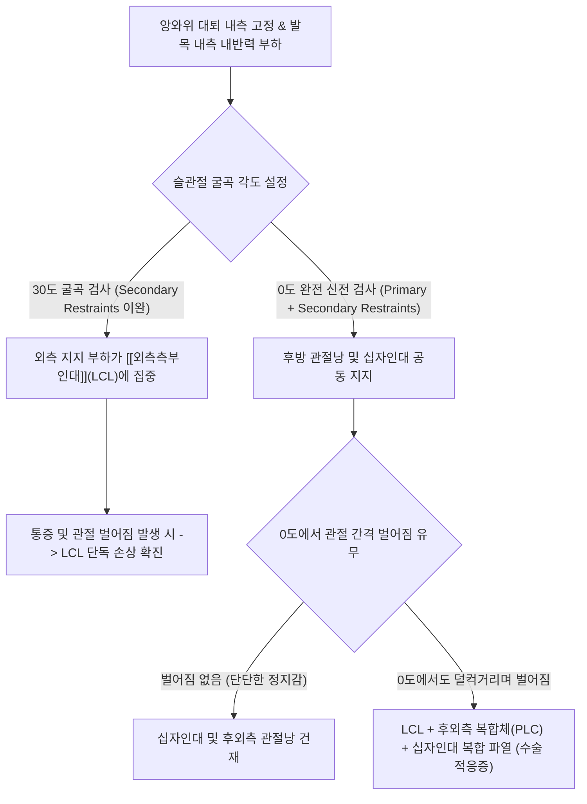

---
aliases:
  - "내선 스트레스 검사"
  - "내반 스트레스 검사"
  - "슬관절 내반 스트레스 검사"
  - "Varus Stress Test"
  - "LCL Stress Test"
  - "외측측부인대 스트레스 검사"
tags:
  - 근골격계
  - 이학적검사
  - 슬관절
  - 외측측부인대
created: "2024-02-27"
updated: "2026-09-15"
title: 내선 스트레스 검사
date: 2026-09-15
출처: "https://www.youtube.com/watch?v=kZm5VEHKMPQ"
---

# 내선 스트레스 검사 (슬관절 내반 스트레스 검사 / Varus Stress Test)

> **핵심 3줄 요약 (Key Summary)**:
> 🎯 앙와위에서 검사자가 한 손으로 대퇴부 내측을 안정되게 고정한 채, 다른 손으로 발목을 쥐고 하퇴를 내측 방향으로 밀어 무릎에 내반력(Varus force)을 가하는 외측 인대 평가 검사이다.
> 🚩 무릎 외측 관절선의 날카로운 통증이나 관절 간격의 비정상적 벌어짐(Laxity)은 [[외측측부인대]](LCL)의 손상 및 외측 관절 불안정성을 시사한다.
> 🔬 20~30도 굴곡 상태에서의 벌어짐은 순수 LCL 단독 손상을 반영하며, 0도 완전 신전 상태에서도 벌어진다면 LCL과 함께 후외측 복합체(PLC) 및 십자인대의 복합 파열을 의미한다.
> ⚠️ 비골신경(Peroneal nerve)이 비골두 주변을 주행하므로 과도한 내반 스트레스 손상 시 족하수(Foot drop) 등 비골신경 마비 동반 여부를 반드시 함께 확인해야 한다.

---

## 1. 개요 및 검사 목적

내선 스트레스 검사(일명 **슬관절 내반 스트레스 검사 / Varus Stress Test)는 무릎 관절의 외측 안정성을 담당하는 핵심 구조물인 [[외측측부인대]](Lateral Collateral Ligament, LCL)와 후외측 회전 불안정성을 제어하는 후외측 복합체(Posterolateral Corner, PLC)의 파열, 염좌 및 이완도(Laxity)를 평가하기 위한 표준 정형외과 이학적 검사법이다.

임상에서 축구, 스키, 격투기 등 외측에서 내측으로 가해지는 내반 외상(Varus trauma)이나 과도한 회전 손상 후 무릎 외측의 통증과 보행 시 외측 무릎이 덜컥거리며 빠지는 불안정감을 호소하는 환자에게 필수적으로 시행된다.

![[varus_stress_test_clinical_maneuver.jpg|450]]
> **[도해] 슬관절 내반 스트레스 검사(Varus Stress Test)의 임상 시술**: 검사자의 한 손이 대퇴부 내측을 받침점(Fulcrum)으로 단단히 고정하고, 다른 손으로 발목을 잡아 하퇴를 안쪽으로 당기며 외측 관절 간격을 벌리고 있다.

---

## 2. 해부학 및 생체역학 기전

### 생체역학 메커니즘

[[외측측부인대]](LCL)는 대퇴골 외상과(Lateral epicondyle)에서 기시하여 비골두(Fibula head)에 부착되는 원통형의 강력한 인대 띠(Cord-like band)이다. 관절낭과 융합되어 있는 내측측부인대(MCL)와 달리, LCL은 외측 관절낭 및 외측 반월판과 분리되어 있어 독립적인 밧줄 역할을 한다.
1. **내반 모멘트(Varus Torque)와 외측 관절 간격 개방**:
   - 검사자가 대퇴부 내측을 고정점으로 지지하고 하퇴 원위부를 내측(Adduction)으로 밀면, 무릎 외측 관절면에 강력한 인장력(Tension)이 집중되면서 대퇴골 외과와 경골 외측 고평부 사이의 간격이 벌어지려는 힘(Lateral joint space opening)이 발생한다.
2. **0도 완전 신전 vs 30도 굴곡의 생체역학적 차이**:
   - 0° 완전 신전(Full Extension) 상태: LCL뿐만 아니라 후외측 관절낭, [[후방십자인대]](PCL), [[전방십자인대]](ACL), 장경인대(ITB), 대퇴이두근 건이 모두 팽팽하게 긴장하여 외반/내반 저항에 공동 참여한다. 만약 0도에서도 외측 관절이 5mm 이상 덜컥거리며 벌어진다면 이는 LCL 단독 손상이 아니라 PLC 및 십자인대까지 동반 파열된 중증 복합 인대 파열(Multiligament injury)을 확진한다.
   - **20°~30° 굴곡(Flexion) 상태: 후방 관절낭과 십자인대의 긴장이 느슨하게 풀리면서 외측을 지지하는 억제력이 오직 [[외측측부인대]](LCL)에만 집중된다. 따라서 LCL의 순수한 단독 손상(Isolated LCL tear) 및 미세 이완도를 평가하기 위해서는 반드시 30도 굴곡 상태에서 검사해야 한다.

### 검사 시 관여 조직 및 해부학적 구조

| 구조물 분류 | 관여 조직 및 명칭 | 내선 스트레스 검사 시 생체역학적 역할 |
| :--- | :--- | :--- |
| **핵심 표적 인대** | [[외측측부인대]](LCL) | 내반력에 대한 제1차 억제 구조물(Primary stabilizer) |
| **복합 지지체** | 후외측 복합체(PLC), [[슬와근]] 건, 슬와비골인대 | 30도 및 0도 신전 시 후외측 회전 및 내반 억제 |
| **원위 부착 랜드마크** | 비골두(Fibula head), 대퇴골 외상과 | LCL의 해부학적 기시 및 정지점, 파열 시 압통점 |
| **인접 신경계** | 총비골신경(Common peroneal nerve) | 비골경을 감싸고 주행하므로 견인 손상 동반 위험성 높음 |

---

## 3. 검사 방법 및 절차

### 검사 전 준비
1. 환자를 진찰대 위에 편안하게 앙와위(Supine)로 눕히고, 양다리의 근육을 완전히 이완시킨다.
2. 검사하려는 쪽 다리를 진찰대 바깥쪽 모서리로 살짝 빼내어 하퇴가 자유롭게 움직일 수 있는 공간을 확보한다.

### 단계별 시행 절차

#### 1단계: 30도 굴곡 내반 스트레스 (LCL 단독 평가)
- 환자의 무릎을 약 **20°~30° 굴곡**시킨다.
- 검사자는 한 손의 손바닥을 환자의 무릎 관절 바로 위쪽 **대퇴부 내측(Medial femur)**에 단단히 밀착하여 외측으로 밀리지 않도록 고정 받침점(Fulcrum)을 만든다.
- 다른 손으로 환자의 하퇴 원위부(발목 외과 직상부)를 쥐고, 발목을 환자의 몸 안쪽(Medial direction)으로 부드럽고 단단하게 당겨 무릎에 내반력(Varus force)을 가한다.
- 이때 대퇴 내측을 받치고 있는 손의 손가락 끝은 외측 관절선(LCL 주행 부위)에 가볍게 대어 관절 간격이 벌어지는 유격(Laxity)과 끝느낌(End-feel)을 감지한다.

#### 2단계: 0도 완전 신전 내반 스트레스 (복합 손상 평가)
- 무릎을 완전히 편 **0° 완전 신전(Full extension)** 상태로 만든다.
- 동일하게 대퇴 내측을 고정하고 발목을 안쪽으로 당겨 내반력을 가한다.
- 0도에서도 관절 간격이 비정상적으로 벌어지는지, 아니면 단단한 골성 정지감(Firm end-feel)이 유지되는지 확인한다.

### 검사 시연 영상
- [Varus Stress Test of the Knee (LCL Examination)](https://www.youtube.com/watch?v=kZm5VEHKMPQ)
- [Assessment of Knee Lateral Stability](https://www.youtube.com/watch?v=d9MZC6UMWXQ)

---

## 4. 양성 판정 기준 및 임상적 의의

### 등급별 손상 판정 기준 (건측과 비교 평가)

양성 판정은 반드시 **반대쪽 정상 무릎(건측)의 관절 간격 개방 정도와 비교**하여 등급(Grade)을 분류한다:

| 손상 등급 | 관절 간격 벌어짐 (Opening) | 정지감 (End-feel) | 손상 정도 및 병리 상태 |
| :--- | :--- | :--- | :--- |
| **Grade I (경도 염좌)** | 0 ~ 5 mm 미만 (정상과 유사) | 단단함 (Firm) | 인대 섬유의 미세 손상, 통증은 있으나 관절 이완 없음 |
| **Grade II (부분 파열)** | 5 ~ 10 mm | 부드러움 (Soft / Sluggish) | LCL의 부분 파열, 30도 굴곡 시 유의한 벌어짐 발생 |
| **Grade III (완전 파열)** | **10 mm 이상** | 정지감 없음 (Empty) | LCL의 완전 단열, 0도 신전 시에도 관절이 크게 벌어짐 |

### 진단 정확도 지표

| 통계 지표 | 수치 범위 | 임상적 해석 |
| :--- | :--- | :--- |
| **민감도 (Sensitivity)** | 68% ~ 75% | Grade II~III 파열에서 양호한 선별 민감도 |
| **특이도 (Specificity)** | **90% ~ 98%** | 30도 굴곡에서 명확한 벌어짐 관찰 시 LCL 손상 진단 특이도 극히 우수 |

---

## 5. 감별 진단 및 유사 검사

| 검사명 | 주 평가 인대/구조 | 스트레스 방향 | 임상적 감별 포인트 |
| :--- | :--- | :--- | :--- |
| **내선(내반) 스트레스 검사** | [[외측측부인대]](LCL), PLC | **하퇴를 안쪽으로 (내반력)** | 무릎 외측 관절선 통증 및 외측 간격 벌어짐 |
| [[외선 스트레스 검사]] (외반) | [[내측측부인대]](MCL) | **하퇴를 바깥쪽으로 (외반력)** | 무릎 내측 관절선 통증 및 내측 간격 벌어짐 |
| 다이얼 검사 (Dial Test) | 후외측 복합체(PLC) 회전 불안정 | 30도 및 90도에서 경골 외회전 각도 비교 | 경골의 과도한 외회전 각도 증가를 통해 PLC 단독/PCL 복합 감별 |
| [[라크만 검사]] (Lachman) | [[전방십자인대]](ACL) | 30도 굴곡에서 경골을 전방 견인 | 시상면 전방 전위 및 부드러운 끝느낌 감지 |

---

## 6. 주의사항 및 위양성/위음성 요인

### ⚠️ 비골신경 마비 동반 확인 필수 (Red Flag)
- LCL 완전 파열 환자의 약 15~25%에서 [[총비골신경]](Common peroneal nerve)의 견인 손상이 동반된다.
- 검사 전후 반드시 **엄지발가락 및 발목의 배굴(Dorsiflexion) 근력**과 **발등 제1-2지 간 부위의 감각 저하** 유무를 확인하여 족하수(Foot drop)가 동반되었는지 체크해야 한다.

### 위양성 및 위음성 요인
- **대퇴사두근 긴장(Muscle Guarding)**: 환자가 통증으로 다리에 힘을 꽉 주고 있으면 완전 파열 상태에서도 관절이 벌어지지 않아 위음성으로 판정될 수 있다.
- **고관절 회전 보상**: 하퇴를 내측으로 밀 때 고관절이 함께 외회전되면 무릎에 순수한 내반력이 전달되지 않는다.

---

## 7. 진료실 핵심 임상 필기

### 💡 원장실 실전 노하우 & 진료실 체크리스트
- **원문 필기 100% 융합 및 실전 적용**:
  - 원문 기록: *"앙와위 검사자의 한손으로 대퇴부 내측을 고정한채 하퇴 외측을 내측 방향으로 민다. 무릎 외측의 통증과 이완> 외측 측부인대의 불안정."*
  - **30도 굴곡의 정밀 각도 세팅 노하우**: 환자의 허벅지 아래에 검사자의 무릎을 괴거나 수건을 말아 받쳐두면 정확한 30도 굴곡이 흔들림 없이 유지되어 대퇴 고정이 훨씬 수월해진다.
  - **비골두 압통점 직접 촉진**: 내반 스트레스를 가하기 전, 비골두(Fibula head)의 상단 부착부와 대퇴골 외상과를 직접 눌러 국소 압통을 확인한다. 파열 환자는 LCL 실질부보다 비골두 부착부의 견열(Avulsion) 부위에서 자지러지는 압통을 호소한다.

### 🗣️ 환자 티칭 & 설명 스크립트
> "환자분, 지금 무릎 바깥쪽 인대의 안정성을 확인하는 검사를 진행했습니다. 허벅지 안쪽을 잡고 발목을 안으로 살짝 당겼을 때, 무릎 바깥쪽 관절 틈새가 벌어지면서 찌릿한 통증이 발생했습니다. 이것은 무릎이 바깥쪽으로 꺾이지 않도록 지탱해 주는 바깥쪽 기둥 인대인 [[외측측부인대]](LCL)가 늘어나거나 찢어졌다는 신호입니다. 다행히 무릎을 완전히 폈을 때는 덜컥거림이 심하지 않아 십자인대까지 다친 중증 복합 손상은 아닙니다. 당분간 무릎이 안쪽으로 꺾이는 양반다리나 과도한 비틀림을 피하시고, 손상된 인대의 빠른 결합과 재생을 돕는 인대 강화 약침과 침 치료를 진행해야 합니다."

### 🌿 한의 임상 치료 연계 프로토콜
- **LCL 손상의 침구 및 약침 치료**:
  - **주요 혈자리**: 양릉천(GB34, 비골두 전하방 요함처), 슬양관(GB33), 족임읍(GB41), 현종(GB39).
  - **약침 요법**: 비골두 인대 부착부 및 대퇴 외상과 LCL 실질에 신바로약침 또는 자하거(태반) 약침을 0.3~0.5cc 주입하여 인대 교원섬유의 빠른 증식과 재생을 촉진.
  - **화침(온침) 요법**: 만성화된 인대 이완 환자에게 양릉천 부위에 온침을 적용하여 인대 탄성도를 복원.
- **고정 및 테이핑 프로토콜**:
  - 급성 Grade II 손상 시: 키네시오 테이핑으로 비골두에서 대퇴 외상과 방향으로 외측 지지 밴드를 부착하고, 2~3주간 외반 보조기(Brace) 착용 지도.

---

## 8. 참고문헌 및 학술 연구 (References)

1. **Assessment of Laxity in Multiligamentous Knee Injuries Using Stress Radiographs: A Simple Technique for a Busy Clinic.**
   - 저자: Lameire DL, Shah A, Wengle L, et al.
   - 저널: *Video J Sports Med*. 2026 Mar-Apr;6(2):vjsm.2025-00123.
   - PMID: [41834844](https://pubmed.ncbi.nlm.nih.gov/41834844/)
   - `[연구 요약]`: 다발성 슬관절 인대 손상 환자에서 내반 및 외반 스트레스 검사의 임상적 이완도와 스트레스 방사선 검사의 관절 간격 개방 수치를 비교하여, LCL 및 PLC 손상 판정의 표준화된 이학적 기준을 제시함.

2. **The Active External Rotation Sign: A Physical Exam Technique for Detecting Posterolateral Corner Injury in Chronic Multiligament Knee Injuries.**
   - 저자: Levitt SJ, Zazulak B, Green JS.
   - 저널: *Video J Sports Med*. 2024 Jul-Aug;4(4):vjsm.2023-01045.
   - PMID: [40309050](https://pubmed.ncbi.nlm.nih.gov/40309050/) | DOI: [10.1177/26350254241250104](https://doi.org/10.1177/26350254241250104)
   - `[연구 요약]`: 무릎의 내반 스트레스 검사와 후외측 회전 검사의 유기적 연계를 고찰하고, LCL 파열 시 동반되는 후외측 복합체 불안정성의 이학적 감별 진단 정확도를 보고함.

3. **Lateral collateral ligament and posterolateral corner injuries of the knee.**
   - 저자: Harner CD, Vogrin TM, Höher J.
   - 저널: *Sports Med Arthrosc Rev*. 2000;8(2):162-172.
   - `[연구 요약]`: LCL의 해부학적 구조와 0도 및 30도 내반 스트레스 검사의 생체역학적 기전을 정립하고, 비골신경 마비 합병증에 대한 체계적인 임상 평가 지침을 제공함.

<!-- 보관 태그(1회용·링크오류, 필요시 복원): LCL, 인대불안정성 -->
