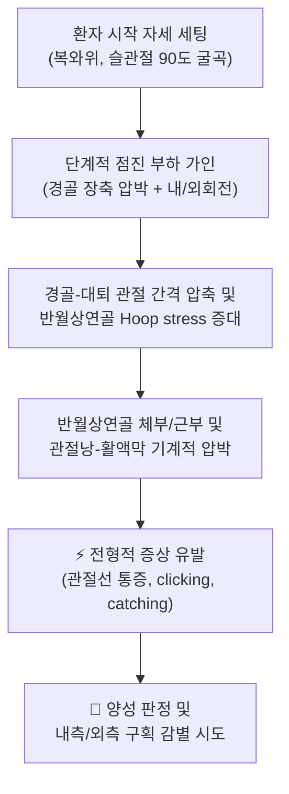
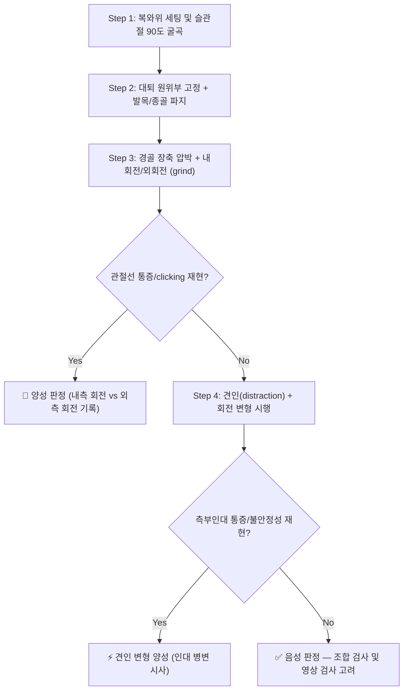

# 🩺 [[애플리 압박 검사]] (Apley Grind Test / Apley Compression Test, 阿普利壓迫檢查)

![[애플리 압박 검사_1.jpg|540]]
> [그림 1: ① 병태생리·영상 — <b>Knee MRI</b> of a patient who had a lateral meniscus root <b>tear</b>.Proton-density-weighted coronal scan (a) showed]

> **핵심 3줄 요약 (Key Summary)**:
> - 🎯 **검사 목적 & 타겟 병소**: 슬관절 [[반월상연골]](특히 [[내측 반월상연골]])의 파열·압박성 병변을 선별하기 위한 유발 검사. 검사하고자 하는 해부학적 구조물은 [[경골 고평부]]–[[대퇴과]] 사이에 개재된 반월상연골 체부 및 [[관절낭]], [[반월경골인대]](coronary ligament)이며, 회전 부하 시 반월상연골에 발생하는 전단·압박 응력이 핵심 기전이다.
> - 🔍 **검사 시행 프로토콜 & 양성 반응**: 환자를 **복와위(prone)**, 슬관절 **90° 굴곡**으로 눕히고, 검사자가 대퇴 원위부를 고정한 뒤 종골/발목을 잡아 **경골 장축 방향으로 압박(compression)을 가하면서 경골을 내회전·외회전**시킨다. 이때 **슬관절 관절선(joint line)의 통증, 딸깍거림(clicking), 걸림(catching)**이 재현되면 양성으로 판정한다. (경골을 위로 견인하면서 회전시키는 **Apley 견인(distraction) 변형**은 주로 측부인대·관절낭 병변을 평가한다.)
> - 📊 **진단 정확도(민감도·특이도) & 임상적 의의**: 제공된 논문들에서는 애플리 압박 검사 단독의 **민감도·특이도·LR+ 수치가 명시적으로 제시되어 있지 않아 본 노트에서는 수치를 '근거 미확인'으로 표기**한다. 다만 메타분석(PMID: 19960176)과 관절경 대조 연구(PMID: 40896037)의 결론적 흐름은 **"어떤 단일 이학적 검사도 반월상연골 파열을 단독으로 확진/배제할 수 없다"**는 것이며, 따라서 애플리 압박 검사는 **관절선 압통, McMurray 검사, Thessaly 검사 등과 조합한 배터리(battery)로 운용**할 때 임상적 가치가 있다. 단독으로는 Rule-In(확진)보다 **보조적 유발·병변 방향 추정**의 의미가 크다.
> - ⚠️ 위양성/위음성 요인 & 검사 금기: **급성 골절(경골 고평부·대퇴과), 완전 인대 파열에 의한 심한 불안정성, 급성 슬관절 잠김(locking), 대량 관절 삼출, 하지 심부정맥혈전증이 의심되는 경우**에는 축성 압박·회전 부하가 손상을 악화시킬 수 있어 시행을 보류하거나 최소 부하로 제한한다. 퇴행성 [[슬관절 골관절염]](PMID: 27405996), 슬개대퇴 통증, 활액막염, 슬와건/슬괵건 긴장, 후방 대퇴부 근육통은 대표적 위양성 원인이므로 국소성 근육통과의 감별이 필수다.

---

## 📌 목차
1. [검사 기본 정보 & 진단 목적 (Diagnostic Overview)](#1-검사-기본-정보--진단-목적-diagnostic-overview)
2. [해부학적 유발 메커니즘 & 생체역학적 원리 (Biomechanical Mechanism)](#2-해부학적-유발-메커니즘--생체역학적-원리-biomechanical-mechanism)
3. [표준 검사 시행 절차 (Step-by-Step Clinical Protocol)](#3-표준-검사-시행-절차-step-by-step-clinical-protocol)
4. [양성 반응 판정 기준 & 신경근/조직별 감별 맵핑 (Diagnostic Criteria & Mapping)](#4-양성-반응-판정-기준--신경근조직별-감별-맵핑-diagnostic-criteria--mapping)
5. [연관 검사군 비교 & 다단계 감별 알고리즘 (Differential Battery & Algorithm)](#5-연관-검사군-비교--다단계-감별-알고리즘-differential-battery--algorithm)
6. [양성 소견 시 한의 임상 연계 치료 전략 (Integrative Korean Medicine)](#6-양성-소견-시-한의-임상-연계-치료-전략-integrative-korean-medicine)
7. [💡 사용자 진료실 핵심 필기 & 실전 임상 팁 (원문 보존)](#7--사용자-진료실-핵심-필기--실전-임상-팁-원문-보존)
8. [출처 및 학술 참고 문헌 (References)](#8-출처-및-학술-참고-문헌-references)

---

![[아플리검사_1단계_압박회전검사_실사.jpg]]
![[아플리검사_3단계_대퇴고정_압박검사_실사.jpg]]
![[아플리검사_2단계_신연견인검사_실사.jpg]]

## 1. 검사 기본 정보 & 진단 목적 (Diagnostic Overview)

| 항목 | 상세 내용 |
| :--- | :--- |
| **검사명 (Test Name)** | Apley Grind Test (애플리 압박 검사 / 애플리 검사, Apley Compression Test) |
| **분류 (Category)** | 정형외과적 이학적 검사 · 슬관절 유발(provocative) 검사 · 반월상연골 압박 검사 |
| **타겟 병소 (Target)** | [[반월상연골]] 체부(내측/외측), [[반월경골인대]], [[관절낭]], 경골–대퇴 관절의 관절선 구조물 |
| **의심 질환 (Suspected Pathologies)** | [[반월상연골 파열]] (내측/외측), [[퇴행성 반월상연골 손상]], [[슬관절 골관절염]]에 동반된 반월상연골 병변, [[반월상연골 근부 파열]](root tear, 그림 1 참조) |
| **진단 정확도 (Diagnostic Accuracy)** | • **민감도 (Sensitivity)**: 근거 미확인 (제공 논문에서 애플리 검사 단독 수치 미제시) • **특이도 (Specificity)**: 근거 미확인 (동일) • **양성 우도비 (LR+)**: 근거 미확인 • **정성적 결론**: 제공 문헌들은 단일 이학적 검사만으로 반월상연골 파열을 진단하기 어렵다고 보고하며, 검사 조합 및 MRI/관절경 확인이 필요함을 시사 (PMID: 19960176, 40896037) |
| **시연 영상 (Video Guide)** | 제공된 영상 자료 없음 (근거 미확인) |

> **임상적 위치 짚기**: 애플리 압박 검사는 1940년대 Apley가 기술한 고전적 검사로, **"압박 + 회전 = 연골판 손상 유발 / 견인 + 회전 = 인대 손상 유발"**이라는 대원칙을 한 자세에서 두 방향으로 나누어 평가할 수 있다는 점이 특징이다. 즉, 복와위 90° 굴곡 자세 하나만으로 **연골판(압박 성분)**과 **측부인대·관절낭(견인 성분)**을 연속적으로 스크리닝할 수 있다는 실용성이 있다. 다만 슬관절 병변의 이학적 검사는 전반적으로 **검사자 간 신뢰도(inter-rater reliability)가 낮고 민감도가 제한적**이라는 한계가 반복 보고되어 왔으므로, 본 검사는 "확진 검사"가 아니라 **문진·관절선 촉진·MRI를 잇는 중간 단계의 임상 단서**로 위치시키는 것이 안전하다.

---

## 2. 해부학적 유발 메커니즘 & 생체역학적 원리 (Biomechanical Mechanism)

### 1) 해부학적 스트레스 전달 경로
* **내측 반월상연골**: 내측 반월상연골은 경골 고평부에 상대적으로 단단히 고정되어 있고 관절낭 및 심층 [[내측측부인대]](MCL)와 강하게 유착되어 있어, 경골의 회전 운동 시 **이동 여유가 적어 전단 응력(shear stress)에 취약**하다. 따라서 압박 상태에서의 회전은 내측 구획의 반월상연골에 큰 응력을 만든다.
* **외측 반월상연골**: 상대적으로 가동성이 크고(경골 부착이 느슨하며 popliteus hiatus 등으로 인해) 회전에 대한 적응력이 크다. 그러나 과도한 회전 부하나 근부(root) 병변에서는 마찬가지로 파열이 발생할 수 있다.
* **Hoop stress(환상 응력)**: 체중 부하 시 반월상연골은 콜라겐 섬유의 원주 방향 배열을 통해 압박력을 **환상 응력으로 전환**하여 접촉 면적을 늘리고 접촉 응력을 분산한다. 정상 연골판은 이 전환이 충분하지만, **퇴행·파열된 연골판은 축성 압박을 견디지 못하고 통증·마찰음을 유발**한다.
* **근부 파열(root tear)의 특수성**: 반월상연골 근부가 파열되면 환상 응력이 소실되어 **연골판의 하중 전달 기능이 급격히 저하**된다(그림 1의 MRI는 외측 반월상연골 근부 파열 예시). 이 경우 연골판 체부는 형태상 온전해 보일 수 있어 **이학적 검사에서 음성으로 나타나기 쉽다**(위음성 요인).
* **압박 vs 견인의 분기**: 동일한 90° 굴곡 자세에서 경골을 **아래로 밀면(압박)** 관절면 간 압력이 증가해 연골판 병변이 유발되고, 반대로 **위로 당기면(견인)** 관절 간격이 벌어지면서 측부인대·관절낭의 장력이 증가해 인대 병변이 유발된다.

### 2) 통증 유발의 신경생리학적 기전
* **활액막 및 관절낭 자극**: 반월상연골 주변부(red-red zone) 및 관절낭은 **유리 신경 종말(free nerve ending)**이 풍부하여, 파열된 연골판의 이동이나 관절낭 긴장만으로도 예리한 통증이 발생한다. 즉 연골판 자체의 통증(구심성)과 관절낭 자극에 의한 통증이 **혼재**한다는 점이 본 검사의 해석을 어렵게 하는 근본 이유다.
* **기계적 자극에 의한 유발**: 회전 시 파열편(torn fragment)이 관절면 사이에 끼이면(interposition) 기계적 자극과 함께 **clicking, catching, 그리고 일시적 걸림감**이 생기며, 이는 환자가 평소 호소하는 "무언가 걸리는 느낌"과 일치한다.
* **근위부·국소 근육의 방어성 긴장**: 통증 자극이 지속되면 슬괵건·슬와근의 반사적 긴장(guarding)이 유발되어 검사자가 정확한 회전 부하를 가하기 어려워지고, 이는 **위양성(후방 대퇴부 통증)과 위음성(부하 회피)을 동시에 증가**시킨다.

---

## 3. 표준 검사 시행 절차 (Step-by-Step Clinical Protocol)

### Step 1: 환자 준비 및 초기 자세 (Starting Position)
* 환자는 **복와위(엎드린 자세)**로 침대에 눕고, 검사할 측 슬관절만 **90° 굴곡**시킨다. 반대측 하지는 편안하게 신전시켜 고정한다.
* 엎드린 자세가 불가능한 환자(고령, 호흡기 질환, 임신 등)에서는 **앙와위에서 고관절·슬관절을 굴곡시킨 변형 자세**로 시행할 수 있으나, 이는 표준 프로토콜과 생체역학적 조건이 달라져 해석에 주의해야 한다.
* 검사 전 반드시 **양측 슬관절을 모두 시행하여 좌우 비교**한다. 환자가 정상측에서 느끼는 "정상적 압박감"을 기준선(baseline)으로 삼으면 위양성 판정을 줄일 수 있다.
* 검사자는 침대 옆 또는 발치에 서서 환측 종골과 발목을 확실히 잡을 수 있는 위치를 확보한다.

### Step 2: 고정 및 파지 (Stabilization & Hand Position)
* 검사자는 **한 손(또는 검사자의 무릎/대퇴부)으로 환측 대퇴 원위부 후면을 단단히 눌러 고정**한다. 이 고정이 허술하면 회전력이 고관절로 분산되어 검사 민감도가 떨어진다.
* 다른 손으로는 환자의 **종골과 발목(또는 발 전면부)**을 감싸 쥔다. 발목을 잡으면 회전 토크를 경골에 효율적으로 전달할 수 있다.

### Step 3: 1차 부하 — 압박 + 회전 (Apley Grind: Compression with Rotation)
* 검사자는 잡고 있는 발을 **아래 방향(침대 방향)으로 밀어 경골 장축을 따라 축성 압박**을 가한다. 압박 강도는 환자 체중의 일부를 검사자가 체감할 수 있을 정도로 점진적으로 증가시킨다.
* 압박을 유지한 채로 **경골을 내회전(internal rotation) → 중립 → 외회전(external rotation)** 순으로 부드럽게 돌린다.
  * 통상적으로 **경골 외회전 시 내측 구획(내측 반월상연골)**, **경골 내회전 시 외측 구획(외측 반월상연골)**의 통증을 각각 확인한다는 서술이 널리 쓰인다.
  * 다만 **구획별 회전 방향 매핑은 문헌 간 이견이 있어 본 노트에서는 '근거 미확인'으로 표기**한다. 실제 임상에서는 "어느 방향에서 통증이 유발되는지"를 있는 그대로 기록하고, 확정적 구획 판정은 MRI/관절경에 위임하는 것이 안전하다.
* **중요**: 회전은 한 번에 크게 돌리지 말고 **작은 호(arc)로 3~4회 반복**해 점진적으로 부하를 올린다. 부드러운 왕복 회전(grinding)이 급격한 단일 회전보다 안전하며 유발 반응을 판별하기 쉽다.
* 환자가 통증을 호소하면 **즉시 압박과 회전을 중단**하고, 통증의 정확한 위치(관절선 전내측/전외측/후내측/후외측)를 손끝으로 확인하여 기록한다.

### Step 4: 2차 부하 — 견인 + 회전 변형 (Apley Distraction: Distraction with Rotation)
* 1단계(압박)에서 증상이 재현되지 않은 경우, 또는 인대 병변 감별이 필요할 때 시행한다.
* 동일한 복와위 90° 굴곡 자세에서 검사자가 발목을 잡고 **경골을 위쪽(천장 방향)으로 견인**하면서 내회전·외회전을 가한다.
* 견인 상태에서는 관절 간격이 벌어지고 **측부인대·관절낭에 인장력이 집중**되므로, 이때 통증이 유발되면 **반월상연골보다는 인대·관절낭 병변을 시사**한다. (이상적으로는 압박 시 통증 + 견인 시 통증 감소 = 연골판 병변 / 압박 시 무통 + 견인 시 통증 = 인대 병변의 대조 패턴을 보인다.)

### Step 5: 즉각 반응 평가 및 부하 해제 (Release & Safety)
* 각 단계 종료 시 **부하를 완전히 제거한 뒤** 환자의 통증 강도(NRS), 통증 위치, 딸깍거림 유무, 관절 잠김 여부를 즉시 문진·촉진으로 확인한다.
* 소량의 관절 삼출이 유발되거나 환자가 얼굴을 찡그리는 경우, 이후 검사(추나·수기 치료)는 **감압·견인 위주로 전환**하고 회전 도수는 피한다.

---

## 4. 양성 반응 판정 기준 & 신경근/조직별 감별 맵핑 (Diagnostic Criteria & Mapping)

* **진정한 양성 반응 (True Positive)**:
  * 압박과 회전을 가하는 순간, 환자가 평소 느끼던 **해당 슬관절 관절선 부위의 예리한 통증**이 재현되거나, **딸깍거림(clicking)·걸림(catching)·잠김(locking) 감각**이 명확히 재현될 때.
  * 견인 변형에서는 **측부인대 주행을 따라 통증 및 관절의 불안정감**이 재현될 때.
* **음성 반응 (Negative)**:
  * 압박·회전 시 통증이 전혀 없거나, 정상적인 압박 저항감과 무릎 후면의 단순 신전감(견인감)만 존재하는 경우.
* **가양성 (False Positive) 감별**:
  * 관절선 통증 없이 **대퇴 후면 슬괵건 부위의 뻐근함, 슬와부 통증, 종아리 근육의 당김**만 발생하는 경우 → 국소 근육통/건 병변으로 감별하고 반월상연골 병변으로 해석하지 않는다.
  * 퇴행성 관절염 환자에서는 이학적 검사 소견 자체가 기능 저하와 상관성을 보이는 경우가 있어(PMID: 27405996), **연골판 파열 단독 여부를 이학적 검사만으로 판별하는 것은 어렵다**.

| 병변 조직 / 구획 | 유발 동작 (회전·부하 방향) | 전형적 통증·증상 부위 | 동반 소견 | 감별 포인트 |
| :--- | :--- | :--- | :--- | :--- |
| **[[내측 반월상연골]] 체부 파열** | 압박 + 경골 회전 시 (구획 매핑은 근거 미확인) | 슬관절 **내측 관절선** 전내측/후내측 | 딸깍거림, 계단·쪼그려 앉기 시 악화 | 관절선 압통과 병행 확인, McMurray 검사 교차 확인 |
| **[[외측 반월상연골]] 체부 파열** | 압박 + 경골 회전 시 (구획 매핑은 근거 미확인) | 슬관절 **외측 관절선** | 쪼그려 앉기·회전 시 통증, 외측 탄발 | 슬와건 병변, 장경골대(IT band) 마찰과 감별 |
| **[[반월상연골 근부 파열]] (root tear)** | 압박 + 회전에서 **음성일 수 있음** | 애매한 관절 전반 통증, 기립·보행 시 통증 | MRI에서만 확인되는 경우 다수 (그림 1) | 이학적 검사 음성이라도 지속 통증 시 MRI 필요 |
| **[[내측측부인대]] / [[외측측부인대]] 손상** | **견인 + 회전** 변형에서 유발 | 인대 주행을 따라 국소 압통 | 외반/내반 스트레스 검사 양성, 불안정감 | 압박 검사보다 견인 검사에서 반응이 두드러짐 |
| **[[슬개대퇴 통증 증후군]] / 연골연화증** | 압박+회전 시 슬개골 주변 통증 | 슬개골 주위, 슬개건 부위 | 계단 오르내리기 악화, 연발음 | 슬개 연삭 검사(grinding test), 슬개 압박 검사로 감별 |
| **[[슬관절 골관절염]] (퇴행성)** | 압박 + 회전 전반에서 광범위 통증 | 관절선 전반 및 관절 내측 | 관절 운동 범위 제한, 골극, 삼출 | 이학적 소견과 기능 저하의 상관성 주의 (PMID: 27405996) |
| **슬괵건·슬와근 긴장 (국소 근육통)** | 압박 시 대퇴 후면 통증 | 대퇴 원위부 후면, 슬와부 | 근 긴장, 압통점 | 관절선 통증이 아니면 **음성/근육성 통증으로 판정** |

---

## 5. 연관 검사군 비교 & 다단계 감별 알고리즘 (Differential Battery & Algorithm)

| 검사명 | 검사 수기 및 동작 | 병태생리적 원리 | 임상적 역할 (선별 vs 확진) |
| :--- | :--- | :--- | :--- |
| **[[애플리 압박 검사]]** (본 검사) | 복와위 90° 굴곡 + 경골 압박 + 회전 | 관절면 압력 증가 → 연골판 압박·전단 응력 유발 | 관절선 통증 재현 시 연골판 병변 **보조 단서** (특이도 의존, 수치는 근거 미확인) |
| **[[애플리 견인 검사]]** (Apley distraction) | 복와위 90° 굴곡 + 경골 견인 + 회전 | 관절 간격 확대 → 측부인대·관절낭 장력 증대 | 인대·관절낭 병변 감별 (반월상연골과의 대조 패턴) |
| **[[McMurray 검사]]** | 앙와위, 슬관절 최대 굴곡 후 신전하며 회전 | 굴곡–신전 과정에서 파열편이 관절면에 끼임 | 반월상연골 파열의 대표적 유발 검사 (병행 필수) |
| **[[관절선 압통 검사]] (Joint line tenderness)** | 슬관절 관절선을 손가락으로 직접 촉진 | 병변 부위의 국소 압통 확인 | 응급실 등 1차 평가에서 유용성이 강조됨 (PMID: 26050782) |
| **[[Thessaly 검사]]** | 기립位 한 발로 5°·20° 굴곡 회전 체중부하 | 체중부하 + 회전으로 연골판 응력 유발 | 기능적·동적 평가, 환자 자세에 따라 순응도 차이 |
| **[[MRI]] / [[관절경]]** | 영상 검사 / 관절 내 직접 시야 | 병변의 직접 해부학적 확인 | **근부 파열 등 이학적 검사 음성 병변의 확진** (그림 1 참조) |

> **다단계 감별 알고리즘 (제안)**:
> 1. **1단계 — 문진 및 관절선 촉진**: 외상력, 잠김력, 계단/쪼그려 앉기 악화 여부 확인. 관절선 압통 확인.
> 2. **2단계 — 유발 검사 배터리**: 애플리 압박 검사 + McMurray 검사 + Thessaly 검사(가능 시)를 조합. **단일 검사 결과만으로 진단하지 않는다.**
> 3. **3단계 — 감별을 위한 견인 검사**: 애플리 견인 변형, 내반/외반 스트레스 검사로 인대 병변을 분리.
> 4. **4단계 — 한의 치료 반응 평가**: 보존 치료 2~4주 후 반응이 없거나 잠김/삼출이 반복되면 **영상 검사(MRI) 의뢰**를 고려. 특히 근부 파열 의심 시 이학적 검사 음성이라도 영상 확인이 필요하다.

---

## 6. 양성 소견 시 한의 임상 연계 치료 전략 (Integrative Korean Medicine)

> ⚠️ 아래 전략은 "애플리 압박 검사 양성 = 반월상연골 병변 가능성"이라는 임상적 판단 하에 시행되는 **보존적 한방 근골격 치료의 일반 원칙**이며, 제공된 논문들에서 한의 치료 효과를 직접 검증한 근거는 **근거 미확인**이다. 급성 잠김·삼출이 심한 경우 우선 정형외과 협진을 고려한다.

* **침구 및 전침 치료 (Acupuncture & Electroacupuncture)**:
  * 국소 혈위: [[독비]](ST35), [[슬안]](EX-LE4, 내슬안·외슬안), [[양릉천]](GB34), [[혈해]](SP10), [[족삼리]](ST36), [[음릉천]](SP9), [[위중]](BL40), [[곤륜]](BL60), [[태충]](LR3), [[아시혈]](압통점).
  * 관절선 압통점 및 슬와부(견인 변형 양성 시)는 **자침 심도를 얕게** 하고 자극을 최소화한다. 급성기에는 [[전침]] 2Hz 위주의 저주파로 국소 혈류 개선 및 진통을 도모하고, 만성기에는 2~4Hz 혼합 또는 100Hz를 병용할 수 있다(자극 강도는 환자 반응에 맞춰 조절).
  * 온침·[[뜸]](간접구)을 슬안·독비 주위에 적용하면 관절 냉감과 강직 완화에 도움이 된다(화상 주의).
* **약침 요법 (Pharmacopuncture)**:
  * 관절낭 후외측·후내측 및 슬와부 압통점, 내·외슬안 주위에 [[신바로약침]] 또는 [[중성어혈약침]]을 0.2~0.5cc 단위로 소량·다점 주입하여 국소 염증성 매개체 완화 및 통증 경감을 도모한다.
  * 급성 삼출이 심한 경우 관절 내 주입은 피하고, **관절 외 주위 조직(관절낭·건·근육 부착부)**에 국한하여 시행한다.
* **추나 치료 (Chuna Therapy)**:
  * 슬관절 급성기에는 **고속저진폭(HVLA) 스러스트 및 강한 회전 도수는 금기**에 준하여 피한다.
  * 대신 **경골–대퇴 관절의 감압 견인 기법**, 슬개골 가동 추나, 대퇴사두근·슬괵건의 근막 이완 및 연부조직 도수(mobilization)를 안전하게 적용한다.
  * 골반·요추 정렬 이상이 슬관절 부하 패턴에 영향을 주는 경우 요추–골반 추나를 병행한다.
* **한약 치료 (Herbal Medicine)**:
  * **급성 외상·염증기(종창·열감·통증)**: [[영선제통음]], [[오적산]] 계열(소염진통), [[갈근탕]] 계열(근긴장 이완)을 고려.
  * **만성 퇴행·정체기(관절 강직·무력감)**: [[독활기생탕]], [[서경탕]], [[보양환오탕]] 계열로 신경·근골 영양 및 기혈 순환 촉진을 도모.
  * **어혈 정체가 뚜렷한 경우(외상 후 잠김감, 자색 반점)**: [[당귀수산]] 등 활혈거어 방제를 변증에 따라 가감(단, 항응고제 복용자는 상호작용 확인 필요).
* **생활 관리 및 재활 지도 (한의 연계)**:
  * 초기: 쪼그려 앉기, 무릎 돌리기, 계단 하강 등 **회전·심굴곡 부하를 제한**한다.
  * 회복기: 대퇴사두근 등척성 운동, 슬관절 말단 가동 범위에서의 무부하 근력 강화를 단계적으로 도입.
  * 체중 관리 및 보행 보조기(필요 시) 사용을 교육한다.

---

## 7. 💡 사용자 진료실 핵심 필기 & 실전 임상 팁 (원문 보존)

* **사용자 원문 필기 (원문 보존)**:
  * 이 노트 작성 시 **원장님의 원문 수기 필기 데이터는 제공되지 않았습니다.** 추후 진료실 필기(관찰 포인트, 특정 환자 반응 기록, 사용 혈위 노하우 등)를 입력하시면 이 항목을 **삭제하지 않고 그대로 이어서 보존**합니다.
  * (원문 입력용 자리) — `- 원문 필기: (내용 미제공)`
* **진료실 실전 노하우 & 안전 가이드**:
  1. **압박은 '점진', 회전은 '소폭 왕복'**: 갑작스러운 체중 실기(thrust)나 큰 단일 회전은 정상 연골판에도 통증을 유발해 위양성을 만들고, 급성 파열편을 악화시킬 수 있다. 3~4회 왕복 회전으로 부하를 나누어 올린다.
  2. **좌우 비교를 먼저**: 정상측을 먼저 검사하여 "정상 압박감"의 기준선을 확보한 뒤 환측을 검사하면 위양성 판정이 크게 줄어든다.
  3. **통증의 '질'을 구분하라**: 날카롭고 국소적인 관절선 통증 + 딸깍거림 ⇒ 연골판 병변 시사. 뻐근하고 광범위한 대퇴 후면 통증 ⇒ 국소 근육·건 병변. 이 두 양상을 혼동하면 과잉 진단으로 이어진다.
  4. **음성이어도 안심하지 말 것**: [[반월상연골 근부 파열]](그림 1)이나 작은 열상(radial tear)은 이학적 검사에서 음성으로 나타날 수 있다. 지속적 잠김·삼출·보행 시 통증이 있으면 MRI 의뢰를 고려한다.
  5. **조합 원칙을 지켜라**: 메타분석(PMID: 19960176)과 관절경 대조 연구(PMID: 40896037)의 취지는 "단일 검사로 확진하지 말라"는 것이다. 애플리 + McMurray + 관절선 압통을 **배터리로** 기록하고, 각 검사 결과를 노트에 개별 기재해 추적 관찰에 활용한다.
  6. **응급실·초진 세팅 팁**: 급성 외상 직후에는 통증으로 협조가 어려우므로 관절선 압통 및 관절 삼출 확인을 먼저 시행하고(PMID: 26050782), 애플리 압박 검사는 **부하를 최소화한 상태에서 마지막에** 시행한다.
  7. **퇴행성 관절염 환자 주의**: 고령 환자에서는 골관절염 자체가 이학적 검사 소견과 기능 저하에 영향을 주므로(PMID: 27405996), 양성 반응을 반월상연골 파열로 단정하지 말고 변증 및 영상 소견과 함께 종합 판단한다.

---

## 8. 출처 및 학술 참고 문헌 (References)

> 아래 문헌은 **제공된 PubMed 데이터에 한하여** 인용하였으며, 제공되지 않은 교과서·논문은 인용하지 않았다. 저자 목록은 제공된 범위까지만 기재하였다.

1. **Agresti D, Jeanmonod R (2023)**. *Apley Grind Test*. StatPearls. **PMID: 29262114**
   - **[연구 요약]**: 애플리 압박 검사의 정의·시행법·임상적 의의를 정리한 개요 문헌. 복와위 슬관절 굴곡 자세에서의 축성 압박 및 경골 회전이라는 표준 수기를 기술하고, 반월상연골 병변 평가에서의 유용성과 한계를 다룬다. **※ 제공 데이터에 본 문헌이 중복 기재되어 있어(PMID 동일) 하나로 통합하였다.**
   - **[정확도 관련]**: 본 노트 작성 시 제공된 정보에는 민감도·특이도 수치가 포함되어 있지 않아 **수치 근거 미확인**으로 표기하였다.
2. **Doherty M, Hoskins R (2015)**. *Diagnosing meniscal tears in the emergency department*. **Emerg Nurse**. **PMID: 26050782**
   - **[연구 요약]**: 응급실 환경에서 반월상연골 파열을 감별하는 임상 접근을 다룬 문헌. 이학적 검사(관절선 압통, McMurray 등 유발 검사)의 역할과 한계, 영상 검사 의뢰 기준을 논의한다. 애플리 압박 검사는 이러한 이학적 검사 배터리의 하나로 위치한다.
3. **Ockert B, Haasters F (2010)**. *[Value of the clinical examination in suspected meniscal injuries. A meta-analysis]*. **Unfallchirurg**. **PMID: 19960176**
   - **[연구 요약]**: 반월상연골 손상이 의심되는 환자에서 이학적 검사의 가치를 메타분석한 연구. **단일 이학적 검사만으로는 반월상연골 파열을 신뢰성 있게 진단하기 어렵다**는 결론을 제시하며, 검사 조합 및 추가 영상 평가의 필요성을 시사한다.
4. **Iversen MD, Price LL (2016)**. *Physical examination findings and their relationship with performance-based function in adults with knee osteoarthritis*. **BMC Musculoskelet Disord**. **PMID: 27405996**
   - **[연구 요약]**: 슬관절 골관절염 성인에서 이학적 검사 소견과 수행 기반 기능(performance-based function) 간의 관계를 분석한 연구. **퇴행성 관절염 환자에서는 이학적 검사 소견이 기능 상태와 연관**되므로, 이 집단에서 유발 검사 양성을 반월상연골 파열로 곧바로 귀속시키기 어렵다는 해석적 주의를 제공한다.
5. **Mannan M, Khalil S (2025)**. *Evaluation of the Diagnostic Accuracy of Clinical Examination for Diagnosing Medial Meniscal Injuries Using Arthroscopy*. **Cureus**. **PMID: 40896037**
   - **[연구 요약]**: **관절경을 기준 검사(reference standard)로 삼아** 내측 반월상연골 손상에 대한 이학적 검사의 진단 정확도를 평가한 연구. 이학적 검사의 정확도 한계를 실제 관절경 소견과 대조하여 제시하며, 검사 조합 및 영상 검사의 보완적 필요성을 뒷받침한다.

> **인용 시 주의**: 본 노트에서 "근거 미확인"으로 표기한 항목(애플리 압박 검사의 민감도·특이도·LR+ 수치, 구획별 회전 방향 매핑, 한의 치료의 직접적 효과)은 제공된 논문 데이터만으로는 확인할 수 없으므로, 실제 진료 및 학술 인용 시 원문을 직접 확인할 것을 권한다.

<!-- 보관 태그(1회용·링크오류, 필요시 복원): Apley -->
