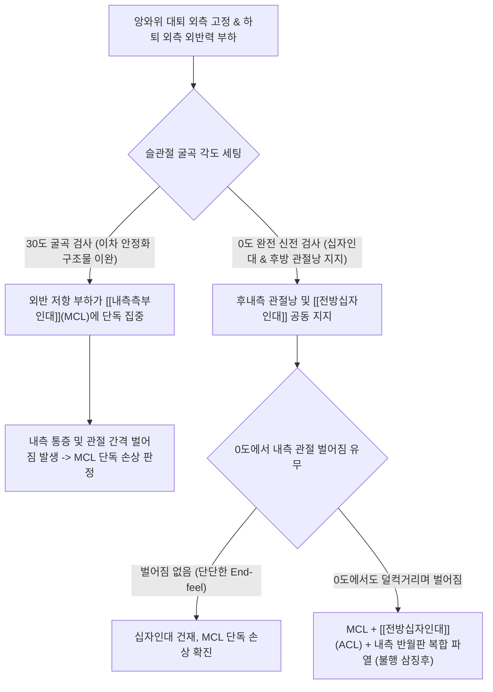

# 외선 스트레스 검사 (슬관절 외반 스트레스 검사 / Valgus Stress Test)

> **핵심 3줄 요약 (Key Summary)**:
> 🎯 앙와위에서 검사자가 한 손으로 대퇴부 외측을 지지하고, 다른 손으로 발목을 쥐고 하퇴를 외측 방향으로 밀어 무릎에 외반력(Valgus force)을 부하하는 내측 관절 안정성 검사이다.
> 🚩 무릎 내측 관절선의 극심한 통증과 비정상적인 관절 간격 벌어짐(Laxity)은 [[내측측부인대]](MCL)의 염좌 및 파열을 시사한다.
> 🔬 30도 굴곡 상태에서의 벌어짐은 순수 MCL 단독 손상을 반영하며, 0도 완전 신전 상태에서도 내측이 벌어지면 MCL과 [[전방십자인대]](ACL) 및 후내측 관절낭의 중증 복합 파열을 의미한다.
> ⚠️ 무릎 외측 충격으로 인한 급성 손상 시 [[내측측부인대]], [[전방십자인대]], 내측 [[반월상 연골]]이 동반 파열되는 불행 삼징후(Unhappy Triad)의 가능성을 반드시 염두에 두어야 한다.

---

## 1. 개요 및 검사 목적

외선 스트레스 검사(일명 **슬관절 외반 스트레스 검사 / Valgus Stress Test)는 무릎 관절의 인대 손상 중 가장 호발하는 [[내측측부인대]](Medial Collateral Ligament, MCL)와 후내측 복합체(Posteromedial Corner, PMC)의 기능적 완전성 및 이완도(Laxity)를 정량적으로 평가하기 위한 표준 정형외과 이학적 검사법이다.

축구, 스키, 농구 등 방향 전환 스포츠 중 무릎 바깥쪽에서 가해진 강한 타박(Clipping injury)이나 발이 땅에 고정된 상태에서 무릎이 안쪽으로 꺾이는 외반-외회전 외상 후, 무릎 안쪽의 극심한 통증과 부종, 보행 시 다리가 안으로 꺾이는 불안정감을 호소할 때 가장 먼저 시행되는 진단 검사이다.

![[valgus_stress_test_clinical_maneuver.jpg|450]]
> **[도해] 슬관절 외반 스트레스 검사(Valgus Stress Test)의 임상 시술**: 검사자가 한 손으로 환자의 대퇴부 외측을 지지하고, 다른 손으로 하퇴 원위부를 외측으로 벌리며 내측 관절선 개방 여부를 촉진하고 있다.

---

## 2. 해부학 및 생체역학 기전

### 생체역학 메커니즘

[[내측측부인대]](MCL)는 대퇴골 내상과(Medial epicondyle)에서 기시하여 경골 내측간판 부위에 부착되는 넓고 평평한 띠 형태의 인대이다. MCL은 표층 내측측부인대(Superficial MCL, sMCL)와 관절낭 및 내측 반월판과 밀접하게 유착되어 있는 심층 내측측부인대(Deep MCL, dMCL)의 두 층으로 구성된다.
1. **외반 모멘트(Valgus Torque)와 내측 관절 간격 개방**:
   - 검사자가 대퇴부 외측을 고정하고 하퇴 원위부를 바깥쪽(Abduction)으로 밀면, 대퇴골 내과와 경골 내측 고평부 사이의 관절 간격에 강력한 신장 응력(Tensile stress)이 가해지며 내측 관절이 벌어지려는 힘(Medial joint space opening)이 발생한다.
2. **0도 완전 신전 vs 30도 굴곡의 생체역학적 차이**:
   - 0° 완전 신전(Full Extension) 상태: MCL뿐만 아니라 후내측 관절낭(Posterior oblique ligament, POL), [[전방십자인대]](ACL), [[후방십자인대]](PCL)가 모두 팽팽하게 잠겨(Screw-home mechanism) 내측 개방에 강력히 저항한다. 만약 0도에서도 내측 관절이 5mm 이상 벌어지고 단단한 정지감이 없다면, 이는 MCL 단독 손상이 아니라 ACL 파열 및 후내측 관절낭이 동반 파열된 중증 복합 인대 파열을 의미한다.
   - **20°~30° 굴곡(Flexion) 상태: 후방 관절낭과 십자인대의 이차 안정화 장치(Secondary restraints)가 느슨하게 풀리면서 외반력에 대한 저항의 약 80% 이상이 오직 [[내측측부인대]](sMCL)에 집중된다. 따라서 MCL의 순수한 단독 파열 유무와 정확한 등급 분류는 반드시 30도 굴곡 상태에서 평가해야 한다.

### 검사 시 관여 조직 및 해부학적 구조

| 구조물 분류 | 관여 조직 및 명칭 | 외선 스트레스 검사 시 생체역학적 역할 |
| :--- | :--- | :--- |
| **핵심 표적 인대** | [[내측측부인대]](MCL - 표층 및 심층) | 무릎 외반력에 대한 78~85%의 제1차 저항 구조물 |
| **복합 지지 인대** | 후사각인대(POL), 후내측 복합체(PMC) | 무릎 신전 시 내측 관절을 보강하는 이차 지지체 |
| **결합 연골판** | 내측 [[반월상 연골]](Medial meniscus) | dMCL(관절낭인대)과 직접 결합되어 있어 동반 손상 빈도 높음 |
| **동적 안정화 근건** | [[반건양근]], 박근, 봉공근 (거위발건) | 무릎 내측을 동적으로 지지하는 근육-건 단위 |

---

## 3. 검사 방법 및 절차

### 검사 전 준비
1. 환자를 진찰대에 편안하게 앙와위(Supine)로 눕히고, 양측 하지를 완전히 이완시킨다.
2. 검사측 하퇴를 침대 밖으로 살짝 내놓아 외측으로 자유롭게 외반 스트레스를 줄 수 있도록 위치를 잡는다.

### 단계별 시행 절차

#### 1단계: 30도 굴곡 외반 스트레스 (MCL 단독 평가)
- 환자의 무릎을 약 **20°~30° 굴곡**시킨다.
- 검사자는 한 손의 손바닥을 환자의 무릎 관절 바로 위쪽 **대퇴부 외측(Lateral femur)**에 단단히 밀착하여 받침점(Fulcrum)을 형성한다.
- 다른 손으로 환자의 하퇴 원위부(발목 내과 직상부)를 안정감 있게 감싸 쥔다.
- 발목을 환자의 몸 바깥쪽(Lateral direction)으로 부드럽고 단단하게 밀어내면서 무릎에 외반력(Valgus force)을 가한다.
- 대퇴 외측을 짚은 손의 손가락 끝으로 내측 관절선(대퇴 내상과에서 경골 내측에 이르는 MCL 주행선)을 촉진하며 관절 간격의 벌어짐(Opening)과 정지감(End-feel)을 평가한다.

#### 2단계: 0도 완전 신전 외반 스트레스 (십자인대 복합 손상 평가)
- 무릎을 완전히 편 **0° 완전 신전(Full extension)** 상태로 만든다.
- 동일하게 대퇴 외측을 고정하고 발목을 바깥쪽으로 밀어 외반력을 가한다.
- 0도에서 관절이 단단하게 버티는지, 아니면 덜컥거리며 내측이 크게 벌어지는지를 확인한다.

### 검사 시연 영상
- [Valgus Stress Test of the Knee (MCL Examination)](https://www.youtube.com/watch?v=GSFbttpxCuQ)
- [Medial Collateral Ligament Stability Assessment](https://www.youtube.com/watch?v=s2cV7rrKT_c)

---

## 4. 양성 판정 기준 및 임상적 의의

### 등급별 손상 판정 기준 (건측 대비 이완도 분류)

| 손상 등급 | 관절 간격 개방 정도 (Opening) | 끝느낌 (End-feel) | 병리적 상태 및 치료 방침 |
| :--- | :--- | :--- | :--- |
| **Grade I (경도 염좌)** | 0 ~ 5 mm 미만 (건측과 대등) | 단단함 (Firm) | 인대 섬유 미세 손상, 통증 동반, 관절 안정성 정상 (보존적 치료) |
| **Grade II (부분 파열)** | **5 ~ 10 mm** | 부드러움 (Soft) | MCL의 불완전 파열, 30도에서 명확한 벌어짐 (보조기 및 집중 보존 치료) |
| **Grade III (완전 파열)** | **10 mm 이상** | 정지감 없음 (Empty) | MCL 완전 단열, 0도 신전 시에도 관절 개방 (십자인대 동반 파열 정밀 검사) |

### 진단 정확도 지표

| 통계 지표 | 수치 범위 | 학술적 근거 및 임상적 해석 |
| :--- | :--- | :--- |
| **민감도 (Sensitivity)** | **86% ~ 91%** | 30도 굴곡 검사 시 MCL 손상 선별 민감도 극히 우수 |
| **특이도 (Specificity)** | **89% ~ 99%** | 건측 대조 하에 관절 개방 확인 시 최고 수준의 특이도 |

---

## 5. 감별 진단 및 유사 검사

| 검사명 | 주 평가 인대 | 외력 방향 | 주요 감별 질환 |
| :--- | :--- | :--- | :--- |
| **외선(외반) 스트레스 검사** | [[내측측부인대]](MCL) | **하퇴를 바깥쪽으로 (외반)** | 무릎 내측 관절선 통증 및 벌어짐 |
| [[내선 스트레스 검사]] (내반) | [[외측측부인대]](LCL) | **하퇴를 안쪽으로 (내반)** | 무릎 외측 관절선 통증 및 벌어짐 |
| [[라크만 검사]] (Lachman) | [[전방십자인대]](ACL) | 30도 굴곡 경골 전방 견인 | ACL 단독 파열 및 전방 불안정성 |
| [[맥머레이 검사]] | 내측/외측 [[반월상 연골]] | 최대 굴곡 후 회전 신전 | 연골판 끼임 통증 및 클릭음(Click) 유발 |
| 거위발건 압통 검사 | 거위발점액낭염 | 경골 조면 내측하부 직접 압박 | 관절선보다 2~3cm 아래 압통 (인대 벌어짐 없음) |

---

## 6. 주의사항 및 위양성/위음성 요인

### ⚠️ 불행 삼징후(Unhappy Triad of O'Donoghue) 감별
- 고에너지 외반 외상에서는 [[내측측부인대]](MCL) 파열과 함께 [[전방십자인대]](ACL) 파열 및 내측 [[반월상 연골]](MM) 파열이 동시에 발생하는 '불행 삼징후'가 흔히 발생한다.
- 외반 스트레스 검사 시 0도에서도 심한 이완이 나타난다면 반드시 [[라크만 검사]]와 관절 삼출액 여부를 정밀 확인해야 한다.

### 위양성 및 위음성 요인
- **대퇴사두근 근육 방어(Muscle Guarding)**: 급성 통증으로 환자가 무릎 근육에 힘을 주고 있으면 실제 파열인데도 관절이 벌어지지 않아 Grade I으로 오판될 수 있다.
- **고관절 내회전 보상**: 하퇴를 외측으로 밀 때 고관절이 함께 내회전되면 무릎 관절에 정확한 외반 토크가 전달되지 않는다.

---

## 7. 진료실 핵심 임상 필기

### 💡 원장실 실전 노하우 & 진료실 체크리스트
- **원문 필기 100% 융합 및 실전 적용**:
  - 원문 기록: *"앙와위 검사자의 한손으로 대퇴부 외측을 고정한채 하퇴 내측을 외측 방향으로 민다. 무릎 내측의 통증과 이완> 내측 측부인대의 불안정."*
  - **MCL 파열 부위 3포인트 정밀 촉진**: 외반 스트레스를 가하기 전, 대퇴골 내상과(기시부), 관절선 실질부(중간부), 경골 조면 내측(정지부)의 3개 포인트를 손가락으로 꼼꼼히 압박한다. 대퇴 내상과 부착부 파열(펠레그리니-스티에다 증후군 호발 부위)인지, 경골 부착부 파열인지에 따라 회복 기간과 예후가 달라진다.
  - **MCL의 우수한 자연 치유력(Blood Supply)**: MCL은 관절강 외 구조물로서 혈액 공급(Blood supply)이 매우 풍부하다. ACL이나 LCL과 달리 Grade I~II 부분 파열뿐만 아니라 상당수의 Grade III 파열도 십자인대 손상이 동반되지 않았다면 수술 없이 한의 보존적 치료(침, 약침, 고정)로 완벽하게 치유될 수 있다.

### 🗣️ 환자 티칭 & 설명 스크립트
> "환자분, 지금 무릎 안쪽 인대의 손상 여부를 확인하는 검사를 시행했습니다. 허벅지 바깥쪽을 잡고 발목을 바깥쪽으로 벌렸을 때, 무릎 안쪽 관절 틈새가 벌어지면서 극심한 통증이 재현되었습니다. 이것은 무릎 안쪽을 기둥처럼 지탱해 주는 [[내측측부인대]](MCL)가 늘어나거나 찢어졌다는 신호입니다. 하지만 너무 걱정하지 않으셔도 됩니다. 무릎 안쪽 인대는 십자인대와 달리 혈액 공급이 매우 풍부해서, 적절한 보호와 재생 치료를 받으면 수술 없이도 원래의 단단한 상태로 스스로 아물어 붙는 놀라운 치유력을 가지고 있습니다. 단 2~3주 동안은 무릎이 안으로 꺾이지 않도록 보조기를 잘 착용하시고, 인대의 결합과 혈류를 촉진하는 인대 재생 약침과 침 치료를 꾸준히 받으시면 후유증 없이 건강하게 회복될 수 있습니다."

### 🌿 한의 임상 치료 연계 프로토콜
- **MCL 손상의 침구 및 재생 약침 치료**:
  - **타겟 혈자리**: 곡천(LR8, 반막양근 건 내측 관절선), 음릉천(SP9), 슬관(LR7), 혈해(SP10).
  - **약침 치료**: 대퇴 내상과 부착부 및 경골 부착부에 신바로약침, 오공약침, 또는 녹용약침을 0.3~0.5cc 집중 주입하여 급성 염증을 억제하고 콜라겐 섬유 합성을 촉진.
- **외반 방지 테이핑 및 보조기 요법**:
  - 경골 외측에서 대퇴 내측을 대각선으로 감싸 올리는 크로스 서포트 테이핑을 적용하여 일상 보행 시 외반 응력을 분산시킴.
- **방제 연계**:
  - 급성 종창기: 당귀수산(當歸鬚散)에 속단, 우슬을 가미하여 어혈 배출.
  - 아급성 및 만성 인대 강화기: 삼기음(三氣飮) 또는 속골단(續骨丹) 처방.

---

## 8. 참고문헌 및 학술 연구 (References)

1. **Short-term effectiveness of anterior cruciate ligament reconstruction combined with internal brace augmentation for acute anterior cruciate ligament and medial collateral ligament injuries.**
   - 저자: Yin Z, Zhang Y, Zhang S, et al.
   - 저널: *Zhongguo Xiu Fu Chong Jian Wai Ke Za Zhi*. 2026 Aug 15;40(8):956-963.
   - PMID: [42642188](https://pubmed.ncbi.nlm.nih.gov/42642188/)
   - `[연구 요약]`: 급성 ACL 및 MCL 복합 손상 환자에서 외반 스트레스 검사의 이완도 평가와 내측 인대 안정성 회복 경과를 분석하여, MCL 손상 정도에 따른 단계적 이학적 평가 기준의 임상적 중요성을 제시함.

2. **Comparison of Isolated ACL and Combined ACL/MCL Injuries in Professional Soccer and Rugby Players: Return to Play and Career Longevity Outcomes.**
   - 저자: Abdul W, Jones M, Haslhofer D, et al.
   - 저널: *Am J Sports Med*. 2026 Jul;54(9):2345-2354.
   - PMID: [42212766](https://pubmed.ncbi.nlm.nih.gov/42212766/)
   - `[연구 요약]`: 프로 스포츠 선수에서 단독 ACL 손상과 MCL 동반 손상 간의 임상 경과를 비교하고, 0도 및 30도 외반 스트레스 검사를 통한 조기 감별이 재활 기간 단축에 미치는 결정적 영향을 규명함.

3. **MCL injuries of the knee: current concepts review.**
   - 저자: Phisitkul P, James SL, Wolf BR, Albright JP.
   - 저널: *Iowa Orthop J*. 2006;26:77-90.
   - PMID: [16761442](https://pubmed.ncbi.nlm.nih.gov/16761442/) | PMCID: [PMC1888587](https://www.ncbi.nlm.nih.gov/pmc/articles/PMC1888587/)
   - `[연구 요약]`: 슬관절 내측측부인대의 해부학적 2개 층 구조, 외반 스트레스 검사의 등급별 판정 기준, 그리고 MCL의 우수한 혈관화에 기반한 보존적 치료의 성공률(95% 이상)을 총체적으로 고찰한 랜드마크 종설.

<!-- 보관 태그(1회용·링크오류, 필요시 복원): MCL -->
