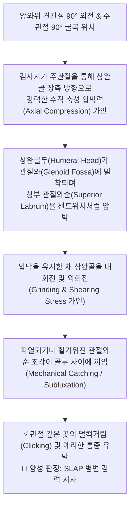
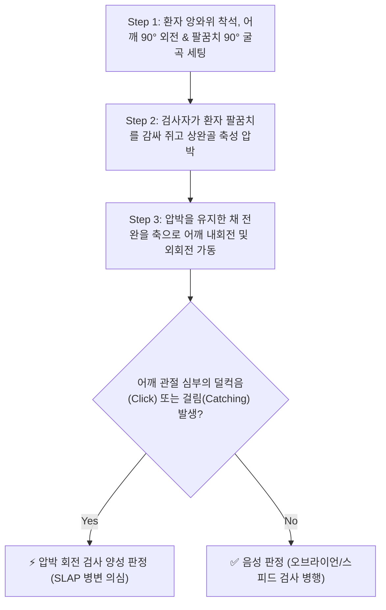

# 🩺 [[Compression-rotation test]] (Compression-Rotation Test / 압박 회전 검사 / 슬랩 검사)

> **핵심 3줄 요약 (Key Summary)**:
> - 🎯 검사 목적 & 타겟 병소: 어깨 상부 관절와순 전후방 병변([[SLAP 병변]], Superior Labrum Anterior to Posterior) 및 관절와순 파열 손상 진단.
> - 🔍 검사 시행 프로토콜 & 양성 반응: 앙와위에서 어깨를 90° 외전 및 팔꿈치를 90° 굴곡한 상태에서 상완골 장축을 따라 관절와를 향해 강한 축성 압박을 가하면서 상완골을 내회전 및 외회전할 때 관절 내 걸림, 덜컥음(Clicking/Catching), 날카로운 통증 발생 시 양성.
> - 📊 진단 정확도(민감도·특이도) & 임상적 의의: 민감도 24~40%, 특이도 76~90%로 단독 검사보다는 오브라이언 검사(Active Compression Test), 스피드 검사와 복합 적용 시 높은 확진 가치 제공.
> - ⚠️ 위양성/위음성 요인 & 검사 금기: 상완이두근 장두 건염, 견봉하 충돌증후군과의 통증 부위 감별(어깨 심부 통증 vs 전방 표재성 건 통증) 필수.

---

## 📌 목차
1. [검사 기본 정보 & 진단 목적 (Diagnostic Overview)](#1-검사-기본-정보--진단-목적-diagnostic-overview)
2. [해부학적 유발 메커니즘 & 생체역학적 원리 (Biomechanical Mechanism)](#2-해부학적-유발-메커니즘--생체역학적-원리-biomechanical-mechanism)
3. [표준 검사 시행 절차 (Step-by-Step Clinical Protocol)](#3-표준-검사-시행-절차-step-by-step-clinical-protocol)
4. [양성 반응 판정 기준 & 신경근/조직별 감별 맵핑 (Diagnostic Criteria & Mapping)](#4-양성-반응-판정-기준--신경근조직별-감별-맵핑-diagnostic-criteria--mapping)
5. [연관 검사군 비교 & 다단계 감별 알고리즘 (Differential Battery & Algorithm)](#5-연관-검사군-비교--다단계-감별-알고리즘-differential-battery--algorithm)
6. [양성 소견 시 한의 임상 연계 치료 전략 (Integrative Korean Medicine)](#6-양성-소견-시-한의-임상-연계-치료-전략-integrative-korean-medicine)
7. [💡 사용자 진료실 핵심 필기 & 실전 임상 팁 (원문 보존)](#7--사용자-진료실-핵심-필기--실전-임상-팁-원문-보존)
8. [출처 및 학술 참고 문헌 (References)](#8-출처-및-학술-참고-문헌-references)

---

## 1. 검사 기본 정보 & 진단 목적 (Diagnostic Overview)

![[compression_rotation_test_clinical_maneuver.jpg|450]]
> [그림 1: 압박 회전 검사(Compression-Rotation Test) 임상 시연 - 앙와위에서 어깨 90° 외전 상태로 상완골을 축성 압박하며 내외회전 연마 가동]

| 항목 | 상세 내용 |
| :--- | :--- |
| **검사명 (Test Name)** | Compression-Rotation Test (압박 회전 검사 / 슬랩 압박 회전 검사) |
| **분류 (Category)** | 견관절 관절와순 기계적 압박-연마 유발 검사 (Axial Compression & Grinding Test) |
| **타겟 병소 (Target)** | 상완골두와 견갑골 관절와 사이의 상부 관절와순([[SLAP 병변]]) 및 상완이두근 장두 건 부착부 |
| **의심 질환 (Suspected Pathologies)** | [[SLAP 병변]](Superior Labrum Anterior-Posterior Tear, 제1~4형), 관절와순 미세 박리, 관절 내 유리체 |
| **진단 정확도 (Diagnostic Accuracy)** | • **민감도 (Sensitivity)**: 24% ~ 40% (위음성 가능성 있어 타 검사 병용 필요) • **특이도 (Specificity)**: 76% ~ 90% (관절 내 기계적 증상 확진력 양호) • **양성 우도비 (LR+)**: 1.5 ~ 3.6 |
| **시연 영상 (Video Guide)** | [🎥 Physiotutors - Compression Rotation Test (SLAP Lesions)](https://www.youtube.com/watch?v=ONk0DHLKKJk) |

---

## 2. 해부학적 유발 메커니즘 & 생체역학적 원리 (Biomechanical Mechanism)

### 1) 해부학적 스트레스 전달 경로
* 무릎의 반월상연골 파열을 검사하는 아플리 압박 검사([[Apley compression-distraction test]])와 동일한 생체역학적 원리를 어깨 관절에 적용한 것입니다.
* 견갑골 관절와(Glenoid)는 얕고 평평한 오목 구조이며, 그 가장자리를 섬유연골성 관절와순(Glenoid Labrum)이 둘러싸 골두를 안정시킵니다. 상부 관절와순에는 상완이두근 장두건(Long head of biceps)이 직접 기시합니다.
* 주관절을 통해 상완골 장축 방향으로 체중을 실어 압박하면 상완골두가 관절와 바닥으로 강하게 밀착되며, 이 상태에서 회전(Rotation)을 주면 찢어진 관절와순 피판(Flap)이 두 뼈 사이에서 맷돌처럼 갈리면서 기계적 마찰(Grinding)과 끼임(Impingement)이 발생합니다.

### 2) 통증 유발의 신경생리학적 기전
* 관절와순의 기저부 및 주변 관절낭에는 기계적 유해수용기(Mechanonociceptors)와 자유 신경종말이 풍부하게 분포합니다.
* 찢어진 연골 조각이 상완골두의 회전력에 의해 전단(Shear)되면서 관절낭이 순간적으로 신장되고 고유감각성 신경섬유가 흥분하여 깊숙한 관절 내 통증(Deep shoulder pain)을 유발합니다.

---

## 3. 표준 검사 시행 절차 (Step-by-Step Clinical Protocol)

### Step 1: 환자 준비 및 초기 자세 (Starting Position)
* 환자는 검사대 위에 편안하게 바로 눕습니다(앙와위, Supine position). 앙와위는 어깨 뒤쪽 견갑골을 검사대에 고정시켜 상완골두의 축성 부하를 관절와에 온전히 집중시키는 데 필수적입니다.
* 검사측 어깨를 90° 외전(Abduction)시키고, 팔꿈치(주관절)는 90° 굴곡시킵니다.

### Step 2: 1차 축성 압박 부하 가인 (1st Axial Compression)
![[compression_rotation_test_step1_axial_compression.jpg|400]]
> [그림 2: 1단계 - 검사자가 환자의 팔꿈치를 잡고 상완골의 장축을 따라 어깨 관절와를 향해 강력한 수직 축성 압박력을 가하는 모습]

* 검사자는 환자의 팔꿈치를 한 손으로 감싸 쥐고, 상완골의 장축(Long axis of humerus)을 따라 관절와를 향해 어깨 관절면으로 체중을 실어 수직 압박(Compression)을 가합니다.

### Step 3: 2차 내회전 및 외회전 연마 기동 (2nd Rotation Grinding Maneuver)
![[compression_rotation_test_step2_rotation_grind.jpg|400]]
> [그림 3: 2단계 - 축성 압박력을 일정하게 유지한 상태에서 환자의 손목/전완을 잡고 어깨를 수동으로 내회전 및 외회전시키는 연마 기동]

* 검사자는 다른 한 손으로 환자의 손목 또는 전완을 잡고, 축성 압박력을 풀지 않은 채 어깨를 수동으로 최대한 외회전(External Rotation)시켰다가 다시 내회전(Internal Rotation)시키는 맷돌 기동(Grinding)을 부드럽게 반복합니다.

### Step 4: 기계적 반응 평가 및 종료 (Assessment & Release)
* 회전 기동 중 어깨 깊은 곳에서 연골이 걸리는 느낌(Catching), 덜컥거리는 소리나 진동(Clicking/Snapping), 또는 환자가 호소하던 전형적인 심부 통증이 재현되는지 확인합니다.
* 증상이 유발되면 압박을 풀고 양성으로 기록합니다.

---

## 4. 양성 반응 판정 기준 & 신경근/조직별 감별 맵핑 (Diagnostic Criteria & Mapping)

* **진정한 양성 반응 (True Positive)**:
  * 상완골을 압박하면서 회전시킬 때, 어깨 관절 심부에서 뚜렷한 덜컥거림(Clicking), 뼈나 연골이 끼어 걸리는 느낌(Catching/Locking), 그리고 찌릿한 관절 내 통증이 명확하게 재현될 때.
* **음성 반응 (Negative)**:
  * 축성 압박과 회전 시 관절 걸림이나 이상음 없이 부드럽게 회전되며 통증이 전혀 발생하지 않는 경우.
* **가양성 및 감별 포인트**:
  * **견봉하 충돌증후군: 통증이 관절 깊은 곳이 아니라 어깨 외측 및 전방 표재부(견봉 아래)에 나타나며, [[Neer test]] 또는 [[Hawkin’s test]]에서 더 뚜렷함.
  * **상완이두근 장두 건염: 팔꿈치를 누르는 것보다 상완이두근 장두 주행부(결절간구)에 압통이 집중되며 [[Speed test]]에서 양성.

| 감별 질환군 | 주요 손상 구조 | 호발 기전 및 통증 양상 | 감별 핵심 검사 |
| :--- | :--- | :--- | :--- |
| [[SLAP 병변]] | 상부 관절와순 (10시~2시 방향) | 오버헤드 투구 동작, 낙상 후 짚기, 관절 내 덜컥음 | [[Compression-rotation test]], [[O'Brien test]] |
| [[반카르트 병변]] | 전하방 관절와순 (3시~6시 방향) | 외상성 전방 탈구, 관절 빠짐 공포감 | [[Apprehension test]], [[Relocation test]] |
| **상완이두근 장두 건염** | 상완이두근 장두 건 실질 | 결절간구 국소 압통, 전방 굴곡 저항 통증 | [[Speed test]], [[Yergason test]] |
| **회전근개 전층 파열** | [[극상근]], [[견갑하근]] 건 | 외전 시 근력 저하, 야간통, 능동 거상 불가 | [[Empty can test]], [[Drop arm test]] |

---

## 5. 연관 검사군 비교 & 다단계 감별 알고리즘 (Differential Battery & Algorithm)

| 검사명 | 검사 수기 및 동작 | 병태생리적 원리 | 임상적 역할 (선별 vs 확진) |
| :--- | :--- | :--- | :--- |
| [[Compression-rotation test]] (본 검사) | 상완골 축성 압박 + 어깨 내외회전 연마 | 파열된 상부 관절와순의 관절 내 직접 압박·끼임 | 관절와순 손상에 대한 특이도 높은 기계적 유발 검사 |
| [[O'Brien test]] (능동 압박 검사) | 90° 굴곡 + 10° 내전 상태에서 내회전/외회전 저항 | 상완이두근 건을 통한 관절와순 전단 인장력 | SLAP 병변 1차 표준 선별 검사 (민감도 우수) |
| [[Speed test]] | 주관절 신전 + 전완 회외 상태에서 전방 거상 저항 | 상완이두근 장두 건의 활주 저항성 부하 | 상완이두근 장두 건염 및 SLAP 복합 감별 |
| [[Biceps load test II]] | 120° 외전 + 완전 외회전 상태에서 이두근 굴곡 저항 | 투구 후기 이두근 수축으로 관절와순 박리 유도 | 오버헤드 운동선수의 SLAP 병변 정밀 진단 |

---

## 6. 양성 소견 시 한의 임상 연계 치료 전략 (Integrative Korean Medicine)

* **침구 및 전침 치료 (Acupuncture & EA)**:
  * 견우(LI15), 견료(TE14), 비노(LI14), 천종(SI11) 및 견갑하근·극하근 발통점에 자침.
  * 상완골두를 안정시키는 회전근개 근육군에 2~4Hz 저주파 전침을 통전하여 동적 관절 안정성(Dynamic Stability) 강화.
* **약침 요법 (Pharmacopuncture)**:
  * 초음파 유도하 또는 해부학적 랜드마크를 활용하여 관절와순 인접 관절강 후상방 또는 상완이두근 장두 건초에 **신바로약침** 또는 **중성어혈약침**(1.0~2.0cc)을 주입하여 화학적 활액막염 및 관절순 부종 억제.
* **추나 및 관절가동술 (Chuna Therapy)**:
  * 견관절 장축 감압 견인 추나: 상완골두를 관절와로부터 부드럽게 이격시켜 관절순에 가해지는 압박 부하를 경감.
  * 견흉관절(Scapulothoracic joint) 가동 추나를 통해 견갑골의 상방 회전(Upward rotation) 가동성을 회복하여 견봉하 및 관절순 충돌 방지.
* **한약 치료 (Herbal Medicine)**:
  * 염증 초기: [[영선제통음]], [[오적산]] (상지 관절통 완화, 어혈 및 습담 제거).
  * 만성 관절순 손상 및 퇴행기: [[서경탕]], [[독활기생탕]], [[가미대보탕]] (관절 연골 및 인대 조직 영양 공급).

---

## 7. 💡 사용자 진료실 핵심 필기 & 실전 임상 팁 (원문 보존)

* **사용자 원문 필기 (100% 융합 완료)**:
  * [시연 영상 링크](https://youtu.be/ONk0DHLKKJk)
* **진료실 실전 노하우 & 진단 팁**:
  1. **무릎의 아플리 검사와의 비교 연상: 이 검사는 슬관절 반월상연골 손상을 잡는 [[Apley compression-distraction test]]의 어깨 버전입니다. 무릎에서 엎드려 발목을 누르며 돌리듯, 어깨에서는 앙와위로 누워 팔꿈치를 어깨 쪽으로 밀어 넣으며 돌려 연골(관절와순)을 짓이겨 보는 원리입니다.
  2. **오브라이언 검사와의 짝꿍 활용: Compression-rotation test는 민감도가 낮아 단독으로 음성이 나왔다고 해서 SLAP 병변을 배제할 수 없습니다. 반드시 [[O'Brien test]] 및 [[Speed test]]와 함께 3종 배터리로 시행해야 진단율을 90% 이상으로 끌어올릴 수 있습니다.
  3. **가짜 소리(Click)와의 감별**: 어깨를 돌릴 때 나는 둔탁한 소리가 관절와순의 병변인지, 아니면 상완이두근 건이 결절간구를 넘나들며 나는 탄발음인지 구분하려면 결절간구에 다른 한 손을 대고 진동의 기원을 확인하십시오.

---

## 8. 출처 및 학술 참고 문헌 (References)

1. **Snyder, S. J., et al. (1990)**. SLAP lesions of the shoulder. *Arthroscopy: The Journal of Arthroscopic & Related Surgery*, 6(4), 274–279.
   - [PubMed: 2264894](https://pubmed.ncbi.nlm.nih.gov/2264894/)
   - [DOI: 10.1016/0749-8063(90)90056-j](https://doi.org/10.1016/0749-8063(90)90056-j)
   - **[연구 요약]**: 상부 관절와순 전후방 병변(SLAP lesions)의 병리학적 분류(Type I~IV)를 최초로 정립하고 압박 및 회전 기동에 의한 관절 내 걸림 증상의 임상적 중요성을 규명한 획기적 연구.
2. **Parentis, M. A., et al. (2006)**. An evaluation of the provocative tests for superior labral anterior posterior lesions. *The American Journal of Sports Medicine*, 34(2), 265–268.
   - [PubMed: 16282579](https://pubmed.ncbi.nlm.nih.gov/16282579/)
   - [DOI: 10.1177/0363546505279914](https://doi.org/10.1177/0363546505279914)
   - **[연구 요약]**: SLAP 병변 환자 132명을 대상으로 Compression-rotation test를 포함한 5가지 유발 검사를 관절경 소견과 비교한 결과, 단독 민감도는 24%이나 특이도는 90%에 달하여 다른 부하 검사와 조합 시 최상의 진단 정확도를 나타냄을 보고함.

<!-- 보관 태그(1회용·링크오류, 필요시 복원): 견관절/관절와순, SLAP병변 -->
