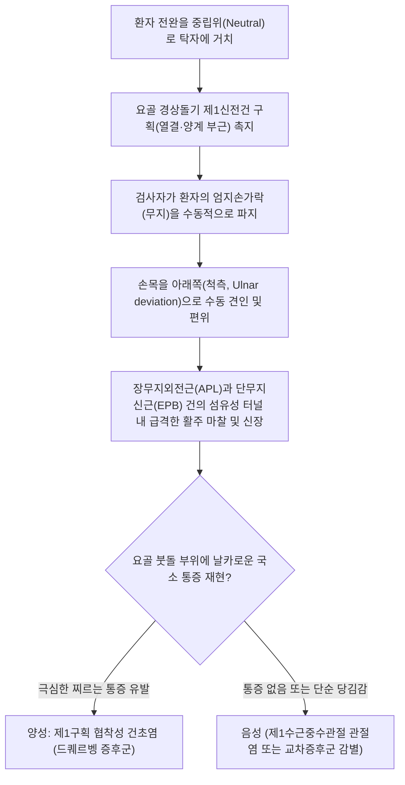

# 핀켈스타인 검사 (Finkelstein's Test)

> **핵심 3줄 요약 (Key Summary)**:
> 🎯 손목 요골 붓돌(경상돌기) 부위의 제1신전건 구획 협착성 건초염인 [[드퀘르벵 증후군]](de Quervain's Tenosynovitis)을 진단하는 표준 이학적 검사.
> 🔍 [[장무지외전근]](APL)과 [[단무지신근]](EPB)의 건(Tendon)을 수동적으로 강하게 신장시켰을 때, 요골 경상돌기 직상방에 칼로 베는 듯한 극심한 예리한 국소 통증이 유발되면 양성.
> ⚠️ 환자 스스로 엄지를 쥐고 꺾는 고전적 방법([[아이히호프 검사]])은 위양성이 높으므로, 검사자가 엄지를 잡고 단계적으로 견인·편위시키는 오리지널 핀켈스타인 4단계 프로토콜 적용이 권장됨.

---

---

## 1. 검사 개요 (Test Overview)

* **검사 목적: 손목 외측(요골측) 제1신전건 구획을 통과하는 [[장무지외전근]](Abductor Pollicis Longus, APL)과 [[단무지신근]](Extensor Pollicis Brevis, EPB) 건초(Tendon sheath)의 무균성 염증, 비후 및 협착을 유발 평가하여 [[드퀘르벵 증후군]](협착성 건초염)을 확진.
* **검사 대상**:
  * 엄지손가락을 벌리거나 뒤로 젖힐 때, 물건을 쥐거나 비틀 때 요골측 손목 통증을 호소하는 환자.
  * 산후 영유아를 안아 올리는 수유기 산모(Mom's Thumb).
  * 스마트폰 타이핑, 컴퓨터 마우스 다용자, 테니스/골프 등 수근관절 과사용 노동자.
* **소요 시간 및 준비물**: 30초~1분 소요, 별도 기구 불필요.

---

## 2. 해부학적 및 생체역학적 기전 (Anatomical & Biomechanical Mechanism)

### 2.1 제1신전건 구획(First Extensor Compartment)의 해부학
* **섬유골성 터널(Fibro-osseous Tunnel)**: 요골 경상돌기(Radial styloid process) 표면의 얕은 뼈 고랑(Sulcus)을 바닥으로 하고, 신전지대(Extensor Retinaculum)의 제1섬유성 격막이 천장을 덮어 약 1~2cm 길이의 단단한 터널을 형성함.
* **통과 건 및 근육**:
  * [[장무지외전근]](APL, Abductor Pollicis Longus): 제1중수골 기저부에 정지하여 엄지를 외전(벌림)시킴.
  * [[단무지신근]](EPB, Extensor Pollicis Brevis): 기절골 기저부에 정지하여 엄지의 중수수지관절(MCP)을 신전시킴.
* **해부학적 변이(Septum)의 임상적 중요성**:
  * 제1구획 내부에 APL과 EPB를 가르는 별도의 섬유성 격막(Subcompartment Septum)이 존재하는 경우가 인구의 30~50%에 달함.
  * 이러한 격막 변이가 있는 환자는 마찰 압력이 2배로 증가하여 보존적 치료에 저항하고 난치성으로 진행하기 쉬움.

> [해부학적 코담배갑(Anatomical Snuffbox): 외측 경계를 이루는 장무지외전근과 단무지신근 건초가 요골 붓돌 부위에서 강하게 마찰되는 위치]

### 2.2 생체역학적 통증 유발 기전 (Biomechanical Pathology)
* 손목을 척측으로 편위(Ulnar deviation)시키면 APL과 EPB 건이 단단하고 좁아진 제1신전건 구획의 활차(Pulley) 모서리를 지렛대 삼아 90도 가까이 꺾이면서 극도의 인장력(Tensile stress)과 전단 마찰력(Shear stress)을 받게 됨.
* 이미 활액막 증식(Synovial hyperplasia)과 지대 비후로 좁아진 터널 안에서 염증성 건이 꽉 끼이면서(Incarceration), 기계적 수용기를 강하게 자극하여 칼로 찌르는 듯한 날카로운 통증(Lancinating pain)이 폭발적으로 유발됨.

---

## 3. 단계별 검사 절차 (Step-by-Step Procedure)

### 1단계: 전완 중립위 및 손목 지지
* 환자를 진료대 앞에 편안히 앉히고, 주관절을 90도 굴곡하여 전완을 검사대 위에 올림.
* 손목을 엄지손가락이 위를 향하는 중립위(Neutral position: 엄지가 천장 방향)로 정렬함.

> [핀켈스타인 검사 1단계: 전완을 중립위(엄지가 상방)로 고정하여 제1신전건 구획이 바로 위로 오도록 세팅]

### 2단계: 요골 붓돌 및 제1신전건 구획 촉지
* 검사자의 손가락으로 환자의 요골 경상돌기(Radial Styloid) 직상방의 제1신전건 구획 주행선을 따라 눌러 압통(Local Tenderness) 및 건초의 비후(Thickening/Swelling) 여부를 먼저 확인.
* 한의학의 열결(LU7) 및 양계(LI5) 혈 부위의 체표 투영을 확인함.

> [핀켈스타인 검사 2단계: 검사자가 요골 경상돌기 위 제1신전건 구획을 직접 가리키며 국소 압통 부위를 확인]

### 3단계: 엄지손가락 수동 파지 (Passive Thumb Grasping)
* 환자에게 손에 힘을 완전히 빼도록 지시하고, 검사자가 환자의 엄지손가락을 한 손으로 부드럽게 감싸 쥠.
* 검사자의 반대 손은 환자의 전완 원위부를 단단히 받쳐 지지함.

> [핀켈스타인 검사 3단계: 검사자가 환자의 엄지손가락을 감싸 쥐고 수동적으로 견인할 준비]

### 4단계: 손목 수동 척측 편위 및 통증 유발
* 검사자가 엄지손가락을 잡은 손으로 손목을 아래쪽(척측 편위, Ulnar deviation) 방향으로 천천히 그리고 단호하게 당겨 내림.
* 환자에게 요골 붓돌 부위의 극심한 날카로운 통증 발생 여부를 확인함.

> [핀켈스타인 검사 4단계: 엄지손가락을 척측 방향으로 수동 편위시켜 APL과 EPB 건을 신장시키며 극심한 통증 유발 평가]

---

## 4. 양성 반응 및 임상적 해석 (Positive Sign & Clinical Interpretation)

### 4.1 양성 판정 기준
* **양성 (Positive Sign)**:
  * 수동적 척측 편위 시 요골 경상돌기 및 제1신전건 구획(열결·양계 부위)에 **칼로 베이거나 바늘로 찌르는 듯한 극심한 국소 통증(Sharp, lancinating pain)**이 유발되는 경우.
  * 심한 경우 건초의 마찰음(Crepitus)이 손끝으로 느껴지거나 환자가 비명을 지르며 반사적으로 손을 뺄 정도로 격렬한 통증을 호소함.
* **음성**:
  * 척측 편위 끝범위에서도 단순 근육의 뻐근한 당김감만 있고 예리한 건초 통증이 없는 경우.

### 4.2 오리지널 핀켈스타인 vs 아이히호프 검사 (Critical Distinction)
* **아이히호프 검사 (Eichhoff's Test - 흔히 핀켈스타인으로 오인됨)**:
  * 환자가 엄지손가락을 나머지 네 손가락 안에 말아 넣고 주먹을 쥔 상태에서, 스스로 손목을 척측으로 강하게 꺾는 방법.
  * **문제점**: 이 방법은 정상인에서도 관절낭과 건에 과도한 인장력을 가해 **위양성률(False Positive Rate)이 최대 50%**에 달함.
* **오리지널 핀켈스타인 검사 (Original Finkelstein's Test)**:
  * 해리 핀켈스타인(Harry Finkelstein, 1930)이 최초로 기술한 검사법으로, 환자가 주먹을 쥐지 않고 검사자가 엄지만을 잡고 단계적으로 신장시킴으로써 건초 고유의 염증만을 특이적으로 선별해 냄.

---

## 5. 감별 진단 (Differential Diagnosis)

| 감별 질환 | 호발 병변 위치 | 주 증상 및 유발 동작 | 핵심 감별 진단법 |
| :--- | :--- | :--- | :--- |
| [[드퀘르벵 증후군]] | 요골 경상돌기 제1신전건 구획 | 엄지 외전/신전 저항 시, 척측 편위 시 극통 | **핀켈스타인 검사 양성**, 건초 비후 |
| **제1수근중수관절(CMC) 관절염** | 엄지 기저부(대능형골-중수골 관절) | 병뚜껑 돌리기, 꼬집기(Pinch) 시 둔통 | **그라인드 검사(Grind test)** 양성, 골극 관찰 |
| **교차 증후군 (Intersection Syndrome)** | 손목 배면 요골측 4~5cm 근위부 | 제1구획(APL/EPB)과 제2구획(ECRL/ECRB) 교차부 통증 | 전완 배면 압통, 삐걱거리는 마찰음(Squeaking) |
| **바르텐베르크 증후군 (Wartenberg)** | 상완요골근과 장요측수근신근 사이 | 요골신경 천지(SBRN) 압박, 엄지 배면 저림 | 타진 시 찌릿한 저림([[티넬 징후]] 양성), 감각 저하 |
| **주상골 골절 (Scaphoid Fracture)** | 해부학적 코담배갑 바닥 | 손을 짚고 넘어지는 외상 병력 | 코담배갑(Snuffbox) 바닥 심부 압통, X-ray 주상골 뷰 |

---

## 6. 검사 신뢰도 및 통계 (Diagnostic Accuracy)

* **민감도 (Sensitivity)**: **89% ~ 92%** (매우 높음)
* **특이도 (Specificity)**: **75% ~ 88%** (비교적 높음)
* **양성우도비 (LR+)**: **3.6 ~ 7.4**
* **음성우도비 (LR-)**: **0.09 ~ 0.15** (음성일 때 드퀘르벵 증후군 배제율 매우 우수)

> [!NOTE]
> 아이히호프 방식(주먹 쥐고 꺾기)은 특이도가 50% 수준으로 떨어지는 반면, 검사자가 수동으로 조절하는 오리지널 핀켈스타인 검사는 특이도가 80% 이상으로 유지됩니다.

---

## 7. 진료실 핵심 임상 필기 (Clinical Pearls & Practice Tips)

* **아이히호프 오진 방지 임상 프로토콜**:
  * 진료실에서 환자가 "인터넷 보고 엄지 넣고 주먹 쥐어 꺾어봤는데 너무 아파요"라며 내원했을 때, 반대쪽 건강한 손도 동일하게 시켜보면 40% 이상에서 아프다고 함.
  * 반드시 검사자가 직접 엄지를 가볍게 잡고 척측 편위시키는 핀켈스타인 검사로 재평가하여 진짜 병변인지 가려내야 함.
* **초음파 하 제1구획 서브컴파트먼트(격막) 확인**:
  * 침 치료나 약침 치료에 2~3주 이상 반응하지 않고 극심한 통증이 지속되는 환자는 초음파 상 APL과 EPB 사이에 섬유성 격막이 존재하는 분리형 건초염일 가능성이 높음.
* **한의 치료 및 원내 임상 가이드**:
  * **약침 치료 (소염다당체/황련해독탕/중성어혈약침)**:
    * 요골 경상돌기 제1신전건 구획의 건초 내(Intrasheath) 또는 건 주위(Peritendinous)에 약침 0.3~0.5cc를 정밀 주입하여 활액막의 무균성 부종을 빠르게 소퇴시킴.
    * ⚠️ 건 자체(Substance of tendon)에 직접 바늘을 찌르지 않도록 건초 공간(Sheath space)에 얕은 각도로 진입하는 것이 안전함.
  * **침구 및 원리침 치료**:
    * 양계(LI5), 열결(LU7), 태연(LU9) 및 APL/EPB 근복 부위(전완 후외측 중하 1/3)에 자침하여 과긴장된 근육 톤을 다운시킴.
    * 만성 섬유화로 비후된 신전지대 밴드는 미세침도(원리침)로 부분 절개하여 감압 효과를 거둘 수 있음.
  * **스마트폰 사용 제한 및 엄지 고정 스플린트(Thumb Spica Splint)**:
    * 엄지 IP 관절과 손목을 동시에 안정화시키는 엄지 스피카 보조기를 1~2주간 착용시키고, 스마트폰 스크롤 시 엄지 대신 검지를 사용하도록 환자 티칭을 병행해야 재발을 차단할 수 있음.

---

## 8. 출처 및 현대 학술 연구 요약 (References)

* **Finkelstein H.** (1930). *Stenosing tendovaginitis at the radial styloid process.* **J Bone Joint Surg Am**, 12(3): 509-540.
  * `[연구 요약]`: 해리 핀켈스타인이 요골 경상돌기 협착성 건초염의 임상 소견과 병리 소견을 정밀 보고하며, 수동적 견인 및 편위에 의한 고유 진단법을 최초로 확립한 불후의 원저.
* **Dawson C, Mudgal CS.** (2010). *Staged description of the Finkelstein test.* **J Hand Surg Am**, 35(9): 1513-1515.
  * DOI: [10.1016/j.jhsa.2010.05.022](https://doi.org/10.1016/j.jhsa.2010.05.022) | PubMed: [PMID: 20692781](https://pubmed.ncbi.nlm.nih.gov/20692781/)
  * `[연구 요약]`: 핀켈스타인 검사를 4단계(중립위 엄지 신장 $\rightarrow$ 수동 굴곡 $\rightarrow$ 수동 척측 편위 $\rightarrow$ 엄지 견인)로 단계화하여 위양성을 최소화하고 진단 특이도를 90% 이상으로 끌어올린 혁신적 임상 논문.
* **Elliott BG.** (1992). *Finkelstein's test: a descriptive error that can produce a bad result.* **J Hand Surg Br**, 17(4): 481-482.
  * DOI: [10.1016/0266-7681(92)90209-r](https://doi.org/10.1016/0266-7681(92)90209-r) | PubMed: [PMID: 1402284](https://pubmed.ncbi.nlm.nih.gov/1402284/)
  * `[연구 요약]`: 수많은 의학 교과서에서 아이히호프(Eichhoff) 검사를 핀켈스타인 검사로 오기하고 있음을 지적하고, 이로 인한 위양성 진단 오류의 위험성을 경고한 필독 연구.

<!-- 보관 태그(1회용·링크오류, 필요시 복원): 드퀘르벵증후군, 단무지신근 -->
