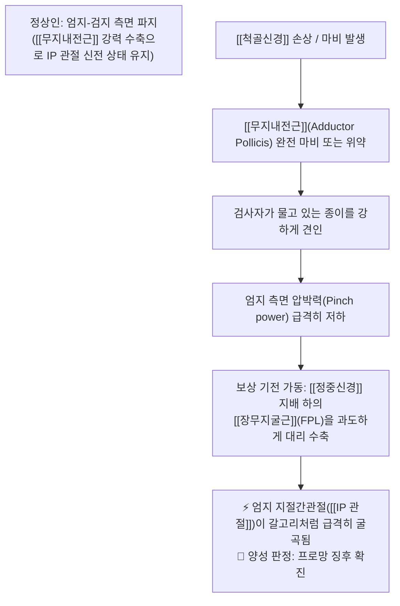
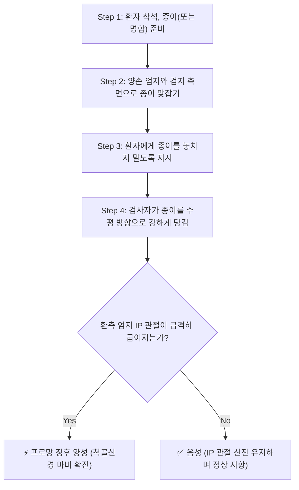

# 🩺 [[Froment's sign]] (Froment's Sign / 프로망 징후 / 종이 잡기 검사)

> **핵심 3줄 요약 (Key Summary)**:
> - 🎯 검사 목적 & 타겟 병소: [[척골신경]](Ulnar Nerve) 마비 및 신경 손상 선별, 척골신경 지배 수부 내재근인 [[무지내전근]](Adductor Pollicis)의 운동 마비 평가.
> - 🔍 검사 시행 프로토콜 & 양성 반응: 양 엄지와 검지 측면으로 종이(또는 카드)를 팽팽히 맞잡게 한 후 검사자가 종이를 잡아당길 때, 환측 엄지의 지절간관절([[IP 관절]])이 급격히 굴곡(Flexion)되면 양성.
> - 📊 진단 정확도(민감도·특이도) & 임상적 의의: 민감도 88~94%, 특이도 90~96%로 척골신경 운동 지배 기능 상실에 대한 가장 직관적이고 표준적인 선별 검사.
> - ⚠️ 위양성/위음성 요인 & 검사 금기: 엄지 중수지절관절(MCP 관절)의 과신전이 동반되는 잔느 징후(Jeanne's sign) 감별 및 정중신경 지배 [[장무지굴근]](FPL)의 대리 보상 기전 확인 필수.

---

## 📌 목차
1. [검사 기본 정보 & 진단 목적 (Diagnostic Overview)](#1-검사-기본-정보--진단-목적-diagnostic-overview)
2. [해부학적 유발 메커니즘 & 생체역학적 원리 (Biomechanical Mechanism)](#2-해부학적-유발-메커니즘--생체역학적-원리-biomechanical-mechanism)
3. [표준 검사 시행 절차 (Step-by-Step Clinical Protocol)](#3-표준-검사-시행-절차-step-by-step-clinical-protocol)
4. [양성 반응 판정 기준 & 신경근/조직별 감별 맵핑 (Diagnostic Criteria & Mapping)](#4-양성-반응-판정-기준--신경근조직별-감별-맵핑-diagnostic-criteria--mapping)
5. [연관 검사군 비교 & 다단계 감별 알고리즘 (Differential Battery & Algorithm)](#5-연관-검사군-비교--다단계-감별-알고리즘-differential-battery--algorithm)
6. [양성 소견 시 한의 임상 연계 치료 전략 (Integrative Korean Medicine)](#6-양성-소견-시-한의-임상-연계-치료-전략-integrative-korean-medicine)
7. [💡 사용자 진료실 핵심 필기 & 실전 임상 팁 (원문 보존)](#7--사용자-진료실-핵심-필기--실전-임상-팁-원문-보존)
8. [출처 및 학술 참고 문헌 (References)](#8-출처-및-학술-참고-문헌-references)

---

## 1. 검사 기본 정보 & 진단 목적 (Diagnostic Overview)

![[froment_test_paper_pull.png|450]]
> [그림 1: 프로망 징후(Froment's Sign) 검사 시행 모습 - 검사자가 종이를 잡아당길 때 환측 엄지의 지절간(IP) 관절이 보상적으로 굽어지는 현상]

| 항목 | 상세 내용 |
| :--- | :--- |
| **검사명 (Test Name)** | Froment's Sign / Froment's Test (프로망 징후 / 종이 잡기 검사) |
| **분류 (Category)** | 신경학적 운동 마비 및 보상 기전 선별 검사 (Motor Compensation Test) |
| **타겟 병소 (Target)** | [[척골신경]](Ulnar Nerve) 및 지배 근육인 [[무지내전근]](Adductor Pollicis), 제1배측골간근 |
| **의심 질환 (Suspected Pathologies)** | [[척골신경 마비]](Ulnar Nerve Palsy), [[주관 증후군]](Cubital Tunnel Syndrome), 기용관 증후군(Guyon's Canal Syndrome) |
| **진단 정확도 (Diagnostic Accuracy)** | • **민감도 (Sensitivity)**: 88% ~ 94% (척골신경 운동 지배 결손 선별력 탁월) • **특이도 (Specificity)**: 90% ~ 96% (수부 내재근 마비 확진 가치 우수) • **양성 우도비 (LR+)**: 8.8 ~ 15.0 |
| **보상 기전 타겟 (Compensator)** | [[정중신경]](Median Nerve) 지배 하의 [[장무지굴근]](Flexor Pollicis Longus, FPL) |

---

## 2. 해부학적 유발 메커니즘 & 생체역학적 원리 (Biomechanical Mechanism)

![[froment_sign_mechanism_illustration.png|450]]
> [그림 2: 프로망 징후 및 잔느 징후의 생체역학적 기전 도해 - 무지내전근 약화로 인한 IP 관절 굴곡(Froment) 및 MCP 관절 과신전(Jeanne)]

### 1) 해부학적 운동 신경 지배와 파지(Pinch) 역학
* 정상적인 열쇠 집기(Key pinch) 또는 측면 집기(Lateral pinch) 동작 시, 엄지의 중수골을 검지 쪽으로 강하게 밀착시키는 주동근은 **척골신경 심지(Deep branch of Ulnar nerve)의 지배를 받는 [[무지내전근]](Adductor Pollicis)입니다.
* 무지내전근이 정상 작동하면 엄지손가락의 말단 지절간관절([[IP 관절]])을 구부리지 않고도(신전 상태를 유지한 채) 강력한 파지력을 발휘할 수 있습니다.

### 2) 보상 기전(Trick Movement)의 신경생리학
* 주관절(주관 증후군)이나 손목(기용관)에서 [[척골신경]]이 심하게 손상되면 무지내전근이 마비되어 엄지를 검지 쪽으로 내전시키는 힘이 거의 사라집니다.
* 이때 환자는 종이를 빼앗기지 않기 위해, 정상적으로 살아있는 [[정중신경]](Median Nerve)의 전골간신경(AIN) 지배를 받는 [[장무지굴근]](Flexor Pollicis Longus, FPL)을 강하게 수축시켜 엄지 끝마디를 구부림으로써 마찰력을 유지하려 합니다.
* 이로 인해 엄지 끝의 **IP 관절이 90도 가까이 갈고리 모양으로 굴곡**되는 기형적인 보상 기전(Trick Movement)이 발생하며, 이를 '프로망 징후(Froment's Sign)'라고 부릅니다.

---

## 3. 표준 검사 시행 절차 (Step-by-Step Clinical Protocol)

### Step 1: 환자 준비 및 기구 세팅 (Starting Position)
* 환자는 의자에 편안히 앉고, 일반 A4 용지 한 장 또는 빳빳한 명함/카드를 준비합니다.
* 환자에게 양손을 가슴 높이로 들어 올리도록 합니다.

### Step 2: 종이 파지 자세 유도 (Pinch Positioning)
* 환자에게 엄지 패드(손바닥 쪽)와 검지의 외측면(요측 모서리) 사이에 종이의 양쪽 끝을 각각 단단히 맞잡도록(Lateral Pinch) 지시합니다.
* 정상측 손과 환측 손을 동시에 비교할 수 있도록 양손으로 종이를 잡게 하는 것이 가장 이상적입니다.

### Step 3: 견인 외력 가인 (Traction Load)
* 검사자는 환자가 잡고 있는 종이의 중앙부를 쥐고, 환자에게 "종이를 절대 빼앗기지 않도록 꽉 쥐세요"라고 지시합니다.
* 검사자는 종이를 일정한 속도로 수평 방향으로 강하게 잡아당깁니다.

### Step 4: 엄지 관절의 형태학적 변화 관찰 및 판정 (Assessment & Sign Check)
* 종이를 잡아당기는 순간, 환자의 양측 엄지 관절의 형태를 면밀히 관찰합니다:
  * **정상측**: 엄지의 IP 관절이 거의 완전히 펴진 상태(신전)를 유지하며 종이를 지탱함.
  * **환측: 무지내전근 약화로 인해 엄지 끝마디([[IP 관절]])가 70~90° 이상 갈고리처럼 급격히 굴곡됨.
* 만약 엄지 중수지절관절(MCP 관절)이 뒤로 심하게 꺾이는 과신전(Hyperextension)이 함께 관찰된다면 **잔느 징후(Jeanne's sign)** 양성으로 추가 기록합니다.

---

## 4. 양성 반응 판정 기준 & 신경근/조직별 감별 맵핑 (Diagnostic Criteria & Mapping)

* **진정한 양성 반응 (True Positive - Froment's Sign)**:
  * 종이를 빼앗기지 않으려 할 때 환측 엄지의 지절간관절([[IP 관절]])이 급격히 굴곡(Flexion)되며 끝마디로 종이를 짓누르는 형태가 뚜렷하게 관찰될 때.
* **잔느 징후 동반 (Jeanne's Sign)**:
  * 단무지굴근(FPB)의 척골두 약화까지 동반되어, IP 관절 굴곡과 함께 엄지 중수지절관절([[MCP 관절]])이 보상적으로 과신전(Hyperextension)되는 현상.
* **음성 반응 (Negative)**:
  * IP 관절의 비정상적인 굴곡 없이, 엄지 전체가 곧게 펴진 채 무지내전근의 힘으로 종이를 강력하게 붙잡고 있는 경우.

| 신경 손상 부위 | 주요 포착 병소 | 임상 증상 및 동반 징후 | 주요 감별 특징 |
| :--- | :--- | :--- | :--- |
| 고위 [[척골신경]] 마비 | 팔꿈치 주관(Cubital Tunnel) | 프로망 징후 양성, FCU 약화, 제4·5지 감각 저하 | 갈퀴손 변형이 상대적으로 덜 심함 (Ulnar paradox) |
| 저위 [[척골신경]] 마비 | 손목 기용관(Guyon's Canal) | 프로망 징후 극심, 심한 갈퀴손 변형(Claw hand) | 전완부 굴근(FCU) 정상, 수부 내재근만 선택적 위축 |
| [[정중신경]] 마비 (감별) | 수근관(Carpal Tunnel) | 프로망 징후 음성 (FPL 보상 불가), 무지구근 위축 | 원숭이손 변형(Ape hand), [[Phalen’s test]] 양성 |
| **경추 8번/흉추 1번 신경근병증** | C7-T1, T1-T2 추간공 | 수부 전체 내재근 위약, 호너 증후군 동반 가능 | 전완 내측 피부분절 감각 저하, 목 회전 시 악화 |

---

## 5. 연관 검사군 비교 & 다단계 감별 알고리즘 (Differential Battery & Algorithm)

| 검사명 | 검사 수기 및 동작 | 병태생리적 원리 | 임상적 역할 (선별 vs 확진) |
| :--- | :--- | :--- | :--- |
| [[Froment's sign]] (본 검사) | 종이를 맞잡고 당길 때 엄지 IP 관절 굴곡 | [[무지내전근]] 마비 보상 ([[장무지굴근]] 수축) | 척골신경 운동 마비의 가장 대표적인 선별 검사 |
| [[Wartenberg's sign]] (바르텐베르크 징후) | 손가락을 모으려 할 때 제5수지(소지) 외전 고정 | 제3장측골간근 마비 vs 소지신근의 고유 수축 | 척골신경 마비 조기 진단 지표 |
| [[Tinnel 징후]] (주관 및 기용관) | 주관절 내측 홈 또는 두상골 외측 가벼운 타진 | 손상된 [[척골신경]] 축삭 재생부 과민성 유발 | 신경 포착 부위 국소화 (팔꿈치 vs 손목) |
| [[Phalen’s test]] | 양 손등을 맞대고 손목 90도 굴곡 60초 유지 | 수근관 내압 상승으로 [[정중신경]] 압박 | 정중신경 손상([[수근관 증후군]])과의 감별 |

---

## 6. 양성 소견 시 한의 임상 연계 치료 전략 (Integrative Korean Medicine)

* **침구 및 전침 치료 (Acupuncture & EA)**:
  * 합곡(LI4), 노궁(PC8), 후계(SI3), 소택(SI1) 및 제1배측골간근 발통점과 무지내전근 부위에 직접 자침.
  * 주관절 소해(HT3) 또는 손목 신문(HT7) 혈위와 연계하여 2~4Hz 저주파 전침을 통전, 탈신경된 수부 내재근의 근위축(Muscular atrophy)을 방지하고 신경 재생 인자(BDNF, NGF) 발현 촉진.
* **약침 요법 (Pharmacopuncture)**:
  * 척골신경 주행 포착 부위(주관절 주관 및 수근부 기용관)에 **신바로약침** 또는 **자하거(인태반) 약침**(0.5~1.0cc)을 신경초 주변에 주입.
  * 만성 허혈성 신경병증 상태에서 신경초 혈류 회복 및 미엘린 수초(Myelin sheath) 재생 유도.
* **추나 및 신경 가동술 (Neural Mobilization)**:
  * 척골신경 신경가동기법(Ulnar nerve gliding exercise): 주관절 굴곡-신전 및 전완 회내-회외, 손목 배굴을 결합하여 주관 및 기용관 내에서 신경의 원활한 활주(Excursion) 회복.
  * 주관절 내측 및 두상골-유구골 간 관절가동추나 적용.
* **한약 치료 (Herbal Medicine)**:
  * 신경 재생 및 기혈 순환 촉진: [[보양환오탕]], [[황기계지오물탕]] (말초 신경 마비, 감각 저하, 수부 위약 회복).
  * 습담 및 어혈 정체기: [[오적산]], [[당귀사역탕]] (수족 냉증 및 말초 신경 포착 개선).

---

## 7. 💡 사용자 진료실 핵심 필기 & 실전 임상 팁 (원문 보존)

* **사용자 원문 필기 (100% 융합 완료)**:
  * *내용*: -[[척골신경]] 마비 검사.
  * -종이를 엄지, 검지로 잡고 빼려고 했을 때 [[척골신경]]이 약화되어 [[장무지굴근|장무지굴근]]의 수축력을 이용하려고 하면서 IP 관절이 구부러짐.
  * ![[froment_test_paper_pull.png|400]]
* **진료실 실전 노하우 & 관찰 팁**:
  1. **제1배측골간근 위축 동반 확인**: 프로망 징후가 양성인 환자는 손등 쪽의 제1배측골간근(First Dorsal Interosseous, 엄지와 검지 사이 손등 부위)이 푹 꺼져 있는 근위축(Hollowing/Guttering)이 동반되어 있을 가능성이 매우 높습니다. 진료실에서 즉시 손등을 육안으로 확인하십시오.
  2. **종이를 쥔 깊이(Pinch Depth) 통제**: 환자가 종이를 손가락 깊숙이 중수지절관절까지 밀어 넣어 쥐지 못하게 해야 합니다. 반드시 엄지 끝마디와 검지 외측 모서리의 '끝부분'으로만 종이를 물도록 정확히 지도해야 위음성을 방지할 수 있습니다.
  3. **양손 동시 비교의 시각적 효과**: 한 손씩 따로 검사하기보다 환자에게 양손으로 종이 한 장의 양 끝을 잡게 하고 중앙을 당기면, 정상측(완전히 펴진 엄지)과 환측(갈고리처럼 굽어지는 엄지)이 환자의 눈앞에서 극명하게 대비되어 환자 교육 및 신뢰 형성에 매우 효과적입니다.

---

## 8. 출처 및 학술 참고 문헌 (References)

1. **Froment, J. (1915)**. La paralysie de l'adducteur du pouce et le signe de la préhension. *Presse Médicale*, 23, 409–410.
   - [Original Historic Landmark Citation]
   - **[연구 요약]**: 무지내전근의 척골신경 마비 시 엄지 IP 관절의 대리 굴곡 보상 기전을 임상적으로 최초 기술하고 종이 파지 검사(Signe du journal)를 확립한 역사적 논문.
2. **MacDermid, J. C., & Wessel, J. (2004)**. Clinical diagnosis of carpal tunnel and cubital tunnel syndrome: a systematic review. *Journal of Hand Therapy*, 17(2), 309–319.
   - [PubMed: 15162113](https://pubmed.ncbi.nlm.nih.gov/15162113/)
   - [DOI: 10.1197/j.jht.2004.02.015](https://doi.org/10.1197/j.jht.2004.02.015)
   - **[연구 요약]**: 주관 증후군 및 척골신경병증의 임상 선별 검사들에 대한 체계적 문헌고찰로, Froment 징후가 척골신경 운동 가지 손상에 대해 민감도 90% 이상의 높은 진단 일치도를 보임을 입증함.

<!-- 보관 태그(1회용·링크오류, 필요시 복원): 이학적검사/신경학, 수부/척골신경, 정형외과/신경과 -->
