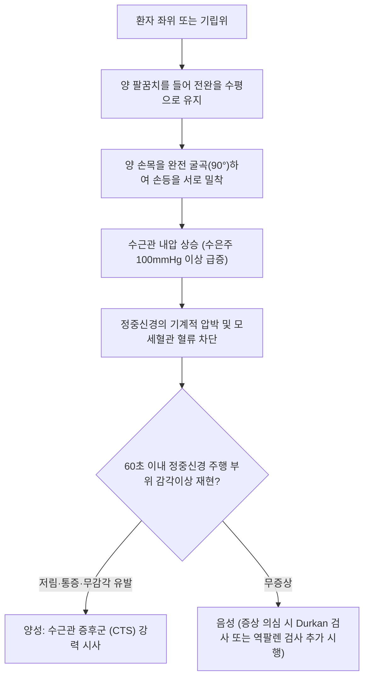

---
aliases:
  - 팔렌 검사
  - Phalen Test
  - Phalen's Test
  - 손목 굴곡 검사
  - Wrist Flexion Test
tags:
  - 근골격계
  - 이학적검사
  - 수부
  - 손목
  - 정중신경
  - 수근관증후군
title: Phalen’s test
date: 2026-09-15
출처: "PMID: 5934271"
---

# 팔렌 검사 (Phalen's Test)

> **핵심 3줄 요약 (Key Summary)**:
> 🎯 [[수근관 증후군]](Carpal Tunnel Syndrome, CTS) 환자에서 [[정중신경]](Median Nerve)의 압박 및 허혈성 자극을 유발하는 대표적인 선별 이학적 검사.
> 🔍 양측 손목을 최대 90도 굴곡시켜 손등을 서로 맞댄 상태로 60초간 유지할 때, [[정중신경]] 지배 영역(엄지, 검지, 중지 및 약지 요측 반)에 저림·무감각·작열통이 재현되면 양성.
> ⚠️ 굴곡 유지 20~30초 이내에 급격히 증상이 유발될수록 중증 신경 포착을 시사하며, [[원회내근 증후군]] 및 [[경추 추간판 탈출증]](C6-C7 신경근병증)과의 감별이 필수적임.

---

---

## 1. 검사 개요 (Test Overview)

* **검사 목적: 수근관(Carpal Tunnel) 내부를 주행하는 [[정중신경]]이 횡수근인대(굴근지대, Flexor Retinaculum)와 수근골 바닥 사이에서 기계적으로 포착 및 압박되는지 확인하여 [[수근관 증후군]]을 감별 진단.
* **검사 대상**: 손바닥 및 제1~3수지(엄지, 검지, 중지)의 저림(Numbness), 감각 둔마, 야간통(Nocturnal Paresthesia), 손가락 탈력감, 물건을 자주 떨어뜨리는 증상을 호소하는 환자.
* **소요 시간 및 준비물**: 검사용 타이머 또는 초시계 (최대 60초 측정), 별도 장비 불필요.

---

## 2. 해부학적 및 생체역학적 기전 (Anatomical & Biomechanical Mechanism)

### 2.1 수근관의 해부학적 구획 및 통과 구조물
* **수근관 바닥(Floor)과 외벽**: 주상골(Scaphoid), 대능형골(Trapezium) 결절이 요측 벽을 이루고, 두상골(Pisiform)과 유구골 갈고리(Hook of Hamate)가 척측 벽을 형성하며 깊은 쪽은 수근골 간 인대로 지지됨.
* **수근관 천장(Roof)**: 두껍고 신장성이 적은 섬유성 결합조직인 횡수근인대(굴근지대, Flexor Retinaculum)가 단단히 덮고 있음.
* **관내 통과 구조물 (총 10개 구조물)**:
  * 1개 신경: [[정중신경]](Median nerve)
  * 9개 건: [[심지굴근]](FDP) 건 4개, [[천지굴근]](FDS) 건 4개, [[장무지굴근]](FPL) 건 1개.

> [수근관 단면 해부도: 굴근지대(횡수근인대) 아래로 정중신경과 9개의 굴곡건들이 밀집하여 통과하는 터널 구조]

### 2.2 생체역학적 유발 기전 (Biomechanical Pathophysiology)
* **내압의 급격한 상승: 정상인의 수근관 내압은 중립위에서 약 2~10 mmHg에 불과하나, 손목을 90도 완전 굴곡(Hyperflexion)시키면 내압이 30~50 mmHg 이상으로 급증함. 기저 질환이 있는 [[수근관 증후군]] 환자에서는 굴곡 시 100~110 mmHg 이상까지 폭발적으로 치솟음.
* **근형태학적 압박 메커니즘**:
  1. 손목 굴곡 시 굴근지대의 근위 모서리가 정중신경 전면을 꺾어 누름(Kinking effect).
  2. [[천지굴근]] 및 [[심지굴근]]의 근육-건 이행부(Musculotendinous junction)가 수근관 근위부 내부로 밀려 들어가 관내 용적이 급감함.
  3. 상승된 관내 압력이 신경내 세동맥 및 모세혈관 혈류(Microcirculation)를 완전히 차단하여 급성 국소 신경 허혈(Acute Local Ischemia)을 야기하고, 민감해진 C-섬유 및 A-베타 감각신경 섬유에서 자발 방전(Ectopic impulse)이 촉발됨.

> [수근관 증후군 병태생리: 굴근지대 비후 및 활액막염으로 인해 정중신경이 강하게 눌리며 손가락 방사 저림 유발]

---

## 3. 단계별 검사 절차 (Step-by-Step Procedure)

### 1단계: 시작 자세 및 전완 수평 정렬
* 환자를 편안히 의자에 앉히거나 선 자세를 취하게 함.
* 양 어깨를 이완하고 팔꿈치를 90도 굴곡시켜 전완을 지면과 수평이 되도록 들어 올림.

> [팔렌 검사 1단계: 팔꿈치를 들어 올려 전완을 수평으로 맞추고 손목 굴곡 준비]

### 2단계: 양측 손등 밀착 및 90도 굴곡 유지
* 양 손목을 완전히 90도 굴곡(Maximal Flexion)시키고, 양 손등(Dorsal aspect of hands)을 서로 마주대어 강하게 밀착시킴.
* 중력과 환자 자신의 팔 무게를 이용하여 손목 굴곡 각도가 90도 미만으로 풀리지 않도록 유지하며, 시술자는 초시계로 60초간 시간을 측정함.

> [팔렌 검사 2단계: 양 손등을 맞대고 손목 90도 굴곡 상태를 60초 동안 지속 유지하여 수근관 내압 극대화]

> [교과서 표준 도해 (Phalen's test): 양 손등을 정중선에서 밀착시켜 수근관 내 정중신경을 압박하는 표준 형태]

### 3단계: 시간 경과 및 증상 유발 확인
* 60초 동안 환자에게 손가락 끝의 감각 변화를 질문함.
* 몇 초 만에 저림이나 통증이 발생하는지 발현 시점을 초 단위로 기록함.

---

## 4. 양성 반응 및 임상적 해석 (Positive Sign & Clinical Interpretation)

### 4.1 양성 판정 기준
* 양성 소견: 손목을 90도 굴곡시킨 후 60초 이내에 [[정중신경]] 고유 감각 지배 영역인 엄지, 검지, 중지, 그리고 약지의 요측 1/2에 찌릿한 저림(Paresthesia), 바늘로 찌르는 듯한 감각, 작열통(Burning pain), 무감각이 생기거나 기존 증상이 뚜렷하게 악화되는 경우.
* **중증도 평가 기준**:
  * **20초 이내 양성**: 수근관 내 기저 압력이 매우 높고 신경 압박이 고도로 진행된 중증(Severe) 단계.
  * **30~60초 양성**: 경도~중등도(Mild to Moderate) 단계.
  * **음성**: 60초간 유지해도 손가락 끝의 감각이상이나 저림이 전혀 발생하지 않는 경우.

### 4.2 변형 검사법과의 비교
* **역팔렌 검사 (Reverse Phalen's Test / Prayer Test)**:
  * 양 손바닥을 합장하듯 마주대고(기도하는 자세) 손목을 최대로 신전(Extension)시켜 60초간 유지.
  * 손목 신전 시에도 수근관 내압이 상승하며, 특히 건초염이나 활액막염이 동반된 경우 통증 민감도가 높음.
* **수근 압박 검사 (Durkan's Test / Carpal Compression Test)**:
  * 검사자의 양 엄지손가락으로 환자의 횡수근인대 직상방을 직접 30초간 6 kg/cm²의 압력으로 누르는 검사로, 팔렌 검사보다 민감도와 특이도가 통계적으로 더 우수함.

---

## 5. 감별 진단 (Differential Diagnosis)

| 감별 질환 | 주 증상 및 호발 부위 | 팔렌 검사 반응 | 핵심 감별 이학적 검사 및 진단 포인트 |
| :--- | :--- | :--- | :--- |
| [[수근관 증후군]] | 제1~3수지 및 제4수지 요측 저림, 야간 악화 | 양성 (60초 내 저림 유발)** | [[티넬 징후]](손목 타진 양성), Durkan 압박 검사 양성 |
| [[원회내근 증후군]] | 전완 전면부 통증 + 손바닥 기저부 감각 저하 | **음성** (손목 굴곡 무관) | 저항 전완 회내(Pronation) 검사 양성, 수포신경가지 감각 저하 |
| [[경추 추간판 탈출증]] (C6-C7) | 목·어깨 방사통, 상완 외측~손가락 저림 | 대개 음성** (경추성) | [[스펄링 검사]] 양성, [[경추 신연 검사]] 완화, 반사(DTR) 저하 |
| [[흉곽출구 증후군]] (TOS) | 상지 전체의 저림, 척골측(제4~5지) 우세 | 음성** (간혹 혼재) | [[애드슨 검사]], [[라이트 검사]], [[루스 검사]] 양성 |
| [[드퀘르벵 증후군]] | 요골 붓돌 부위 극심한 국소 통증 | 음성** (신경 증상 없음) | [[핀켈스타인 검사]] 양성, 엄지 신전·외전 시 건 마찰음 |

---

## 6. 검사 신뢰도 및 통계 (Diagnostic Accuracy)

* **민감도 (Sensitivity)**: **68% ~ 73%** (평균 약 69%)
* **특이도 (Specificity)**: **73% ~ 86%** (평균 약 78%)
* **양성우도비 (LR+)**: **2.6 ~ 3.5**
* **음성우도비 (LR-)**: **0.37 ~ 0.45**

> [!NOTE]
> 수근관 증후군의 단독 진단에서 팔렌 검사 하나만으로는 위양성(정상인도 과도한 굴곡 시 신경 허혈 발생) 및 위음성이 존재할 수 있습니다. 따라서 팔렌 검사 + [[티넬 징후]](Tinel's sign) + Durkan 수근 압박 검사의 3대 검사를 병합하여 양성이 나올 경우 진단 정확도가 90% 이상으로 대폭 향상됩니다.

---

## 7. 진료실 핵심 임상 필기 (Clinical Pearls & Practice Tips)

* **플릭 징후 (Flick Sign)와의 상관관계**:
  * 진료실 문진 시 "밤에 손이 저려서 깨어 손을 털면(Flick) 좀 나아지십니까?"라는 질문에 환자가 적극 동의한다면, 팔렌 검사의 양성 적중률은 93%에 육박함.
* **검사 시 보상 작용 방지 요령**:
  * 환자가 통증이나 힘듦으로 인해 어깨를 과도하게 움츠리거나 팔꿈치를 떨어뜨리면 손목 굴곡 각도가 60~70도로 줄어들어 위음성이 발생할 수 있음. 반드시 검사자가 환자의 팔꿈치 수평선과 손목 90도 각도를 지속 점검해야 함.
* **손바닥 모지구근(Thenar) 위축 확인**:
  * 팔렌 검사가 10~15초 이내에 극심한 통증으로 중단되면서, 단무지외전근(APB) 부위의 두덩근(Thenar eminence) 위축(Ape Hand Deformity)이 관찰되면 신경 손상이 운동 섬유까지 파급된 상태이므로 지체 없이 근전도 검사(EMG/NCS) 의뢰 또는 수술적 감압 고려가 필요함.
* **한의 치료 및 원내 임상 가이드**:
  * **침구 및 전침 치료: 수근관 입구의 대릉(PC7), 노궁(PC8), 내관(PC6), 극문(PC4)에 자침 후 저주파(2Hz) 전기자극을 가해 횡수근인대와 [[천지굴근]], [[심지굴근]] 건막의 섬유성 유착을 완화.
  * **중성어혈약침 / 신바로약침 국소 자입**: 횡수근인대 천층과 신경 외막 주위의 만성 활액막 무균성 염증을 감소시키기 위해 초음파 가이드 하 또는 해부학적 지표 하에 정밀 주입.
  * **야간 부목(Night Splint) 티칭**: 수근관 내압이 가장 낮은 자세는 손목 중립위~약 10~15도 신전 상태임. 수면 중 무의식적인 과굴곡을 방지하기 위해 중립위 손목 보호대를 취침 시 착용하도록 지도하면 팔렌 검사 양성 반응이 현저히 호전됨.

---

## 8. 출처 및 현대 학술 연구 요약 (References)

* **Phalen GS.** (1966). *The carpal-tunnel syndrome. Seventeen years' experience in diagnosis and treatment of six hundred fifty-four hands.* **J Bone Joint Surg Am**, 48(2): 211-228.
  * PubMed: [PMID: 5934271](https://pubmed.ncbi.nlm.nih.gov/5934271/)
  * `[연구 요약]`: 조지 팔렌 박사가 654예의 임상 데이터를 바탕으로 손목 굴곡 유발 검사의 병태생리적 기전과 진단적 유용성을 세계 최초로 체계화한 랜드마크 연구.
* **MacDermid JC, Wessel J.** (2004). *Clinical diagnosis of carpal tunnel syndrome: a systematic review.* **J Hand Ther**, 17(2): 309-319.
  * DOI: [10.1197/j.jht.2004.02.015](https://doi.org/10.1197/j.jht.2004.02.015) | PubMed: [PMID: 15162113](https://pubmed.ncbi.nlm.nih.gov/15162113/)
  * `[연구 요약]`: 팔렌 검사의 민감도(68%)와 특이도(73%)를 체계적으로 메타분석하고, Durkan 수근 압박 검사 및 신경전도검사와의 병행 필요성을 통계학적으로 입증함.
* **Gellman H, et al.** (1986). *Carpal tunnel syndrome. An evaluation of the provocative tests.* **J Bone Joint Surg Am**, 68(5): 735-737.
  * PubMed: [PMID: 3722231](https://pubmed.ncbi.nlm.nih.gov/3722231/)
  * `[연구 요약]`: 팔렌 검사 유지 시간에 따른 진단적 예민도를 비교하여, 60초 이내 증상 발현 환자의 88%에서 양측성 압박 및 신경 허혈 손상이 동반됨을 확인한 연구.