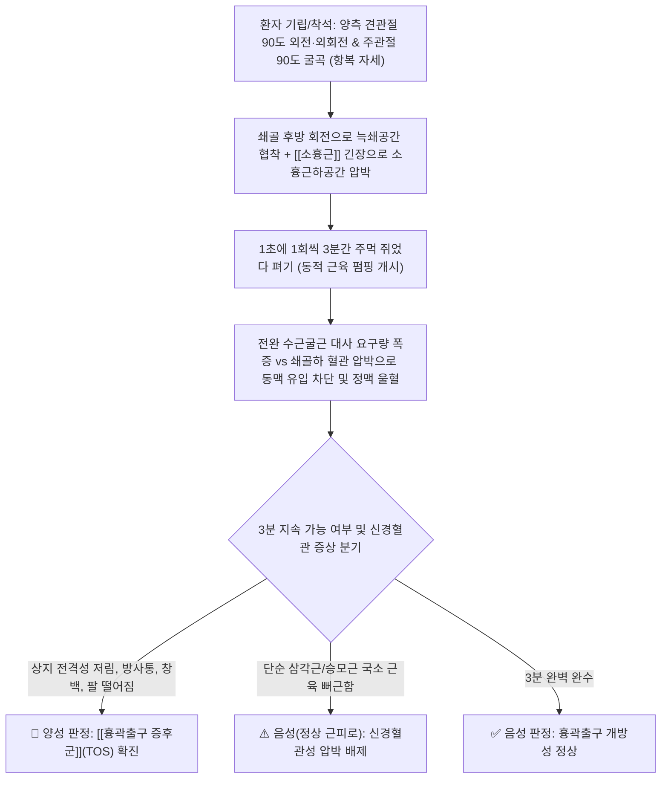
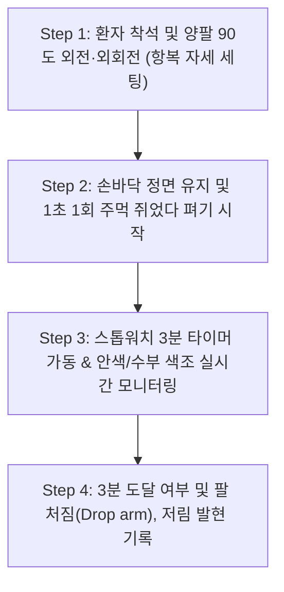
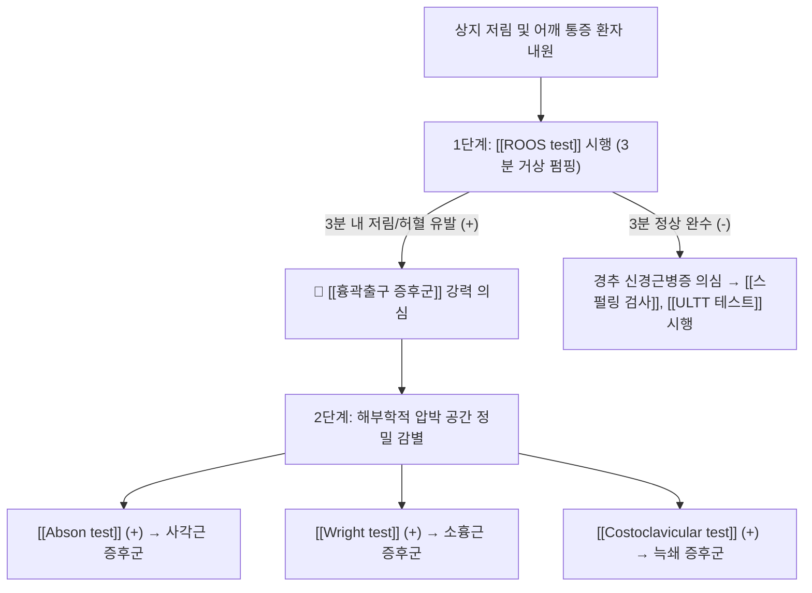

# 🩺 [[ROOS test|루스 검사]] (Roos Test / Elevated Arm Stress Test, EAST)

> **핵심 3줄 요약 (Key Summary)**:
> - 🎯 검사 목적 & 타겟 병소: [[흉곽출구 증후군]](Thoracic Outlet Syndrome, TOS) 감별, 타겟 병소인 흉곽출구 3대 협착 부위(사각근간극, 늑쇄공간, 소흉근하공간) 내 [[상완신경총]] 및 쇄골하 동·정맥.
> - 🔍 검사 시행 프로토콜 & 양성 반응: 양측 견관절을 90도 외전 및 외회전, 주관절 90도 굴곡 자세에서 1초에 1회씩 주먹을 쥐었다 폈다(Pumping)를 3분간 반복할 때, 3분을 채우지 못하고 팔을 떨어뜨리거나(Drop arm) 상지에 점진적인 허혈성 통증, 감각 마비, 청색증/창백 유발 시 양성.
> - 📊 진단 정확도(민감도·특이도) & 임상적 의의: 민감도가 84~94%로 TOS 검사 중 가장 높아 흉곽출구 압박을 선별하는 대표적 스크리닝 검사(단, 정상인에서도 3분 지속 시 근피로 위양성 발생 가능하므로 신경·혈관성 증상과 단순 근육 피로 감별 필수).
> - ⚠️ 위양성/위음성 요인 & 검사 금기: 승모근 및 삼각근의 단순 뻐근함은 정상 피로 반응이므로 오진 방지 주의, 극심한 급성 동맥 폐색이나 쇄골 골절 환자에게 무리한 거상 반복 금기.

---

## 📌 목차
1. [검사 기본 정보 & 진단 목적 (Diagnostic Overview)](#1-검사-기본-정보--진단-목적-diagnostic-overview)
2. [해부학적 유발 메커니즘 & 생체역학적 원리 (Biomechanical Mechanism)](#2-해부학적-유발-메커니즘--생체역학적-원리-biomechanical-mechanism)
3. [표준 검사 시행 절차 (Step-by-Step Clinical Protocol)](#3-표준-검사-시행-절차-step-by-step-clinical-protocol)
4. [양성 반응 판정 기준 & TOS 아형별 감별 맵핑 (Diagnostic Criteria & Mapping)](#4-양성-반응-판정-기준--tos-아형별-감별-맵핑-diagnostic-criteria--mapping)
5. [연관 검사군 비교 & 다단계 감별 알고리즘 (Differential Battery & Algorithm)](#5-연관-검사군-비교--다단계-감별-알고리즘-differential-battery--algorithm)
6. [양성 소견 시 한의 임상 연계 치료 전략 (Integrative Korean Medicine)](#6-양성-소견-시-한의-임상-연계-치료-전략-integrative-korean-medicine)
7. [💡 사용자 진료실 핵심 필기 & 실전 임상 팁 (원문 보존)](#7--사용자-진료실-핵심-필기--실전-임상-팁-원문-보존)
8. [출처 및 학술 참고 문헌 (References)](#8-출처-및-학술-참고-문헌-references)

---

## 1. 검사 기본 정보 & 진단 목적 (Diagnostic Overview)

![[흉곽출구증후군_3대_압박간극_도해.png|450]]
> [그림 1: 흉곽출구(Thoracic Outlet) 해부학 - 쇄골, 제1늑골, 사각근 및 소흉근 사이로 주행하는 상완신경총과 쇄골하 혈관 압박 도해]

| 항목 | 상세 내용 |
| :--- | :--- |
| **검사명 (Test Name)** | Roos Test (루스 검사 / Elevated Arm Stress Test, EAST / 팔거상 스트레스 검사) |
| **분류 (Category)** | 정형외과적·혈관신경학적 흉곽출구 스트레스 도발 검사 (TOS Provocation Test) |
| **타겟 병소 (Target)** | 흉곽출구 3대 간극, [[상완신경총]](Brachial Plexus), 쇄골하동맥(Subclavian A.), 쇄골하정맥(Subclavian V.) |
| **의심 질환 (Suspected Pathologies)** | [[흉곽출구 증후군]](Thoracic Outlet Syndrome, TOS), 과외전 증후군(Hyperabduction Syndrome), 늑쇄 증후군 |
| **진단 정확도 (Diagnostic Accuracy)** | • **민감도 (Sensitivity)**: **84 ~ 94%** (TOS 선별을 위한 최고 민감도 검사) • **특이도 (Specificity)**: 30 ~ 73% (정상인에서도 근피로 위양성 빈발, Adson/Wright와 병용 필수) • **양성 우도비 (LR+)**: 1.3 ~ 3.2 (Gillard et al., 2001) |
| **시연 영상 (Video Guide)** | [🎥 시연 영상: Physiotutors - Roos Test | Thoracic Outlet Syndrome](https://www.youtube.com/watch?v=rM4fB-t_l9E) |

---

## 2. 해부학적 유발 메커니즘 & 생체역학적 원리 (Biomechanical Mechanism)

### 1) 흉곽출구 3대 해부학적 간극의 동시 폐쇄 기전
* 견관절을 90도 외전 및 외회전시키는 자세(Surrender position)는 쇄골(Clavicle)을 후하방으로 회전시켜 제1늑골과의 간격(늑쇄공간)을 최소화합니다.
* 동시에 오훼돌기(Coracoid process)에 정지하는 [[소흉근]](Pectoralis minor)이 팽팽하게 신장되면서, 그 아래를 통과하는 [[상완신경총]] 하신경간(C8~T1)과 쇄골하 동·정맥을 지렛대처럼 꺾이게(Kinking) 만듭니다.

### 2) 동적 대사 스트레스(Dynamic Metabolic Stress)에 의한 신경·혈관 허혈
* 정적으로 팔만 들고 있는 검사와 달리, 손을 1초에 1회씩 쥐었다 펴는 동작은 전완부 수근굴근과 수부 내재근의 산소 및 혈류 요구량을 극대화합니다.
* 흉곽출구에 협착이 있는 환자는 혈관 압박으로 인해 근육 내 미세순환이 즉각 차단되며, 젖산 축적과 신경 허혈이 급격히 진행되어 극심한 통증과 무력감으로 **3분을 버티지 못하고 팔이 아래로 뚝 떨어지게(Drop arm)** 됩니다.

---

## 3. 표준 검사 시행 절차 (Step-by-Step Clinical Protocol)

### Step 1: 환자 준비 및 초기 자세 세팅 (Surrender Position)
![[루스검사_1단계_팔거상_외전외회전_준비.jpg|400]]
> [그림 2: 1단계 - 환자가 의자에 앉아 양측 견관절 90도 외전 및 외회전, 주관절 90도 굴곡을 유지하는 기본 항복(Surrender) 자세]

* 환자는 의자에 등을 펴고 편안하게 앉습니다.
* 양측 견관절을 90도 외전(Abduction)시키고 외회전(External rotation)하여 팔꿈치를 어깨선보다 약간 뒤로 위치시킵니다.
* 주관절을 90도 굴곡하고 손바닥이 앞쪽(정면)을 향하도록 유지합니다.

### Step 2: 1초 1회 주먹 쥐었다 펴기 반복 (Rhythmic Hand Pumping)
![[루스검사_2단계_주먹쥐기_반복수행.jpg|400]]
> [그림 3: 2단계 - 손바닥을 활짝 폈다가 주먹을 꽉 쥐는 펌핑 동작을 1초에 1회 페이스로 3분 동안 끊임없이 반복하는 모습]

* 환자에게 손바닥을 완전히 폈다가 주먹을 꽉 쥐는 동작을 **1초에 1회(느리지도 빠르지도 않은 일정 속도)**로 반복하도록 지시합니다.
* 검사자는 스톱워치로 시간을 측정하며 환자가 팔꿈치를 아래로 떨어뜨리지 않고 90도를 유지하는지 관찰합니다.

### Step 3: 3분 지속성 평가 및 양성 반응 포착 (3-Minute Tolerance & Release)
![[루스검사_3단계_3분지속_허혈성저림_양성평가.jpg|400]]
> [그림 4: 3단계 - 3분을 채우지 못하고 상지 통증, 저림, 무력감으로 팔을 유지하지 못하고 떨어뜨리는 양성 소견 확인]

* 환자가 3분 동안 정상적으로 동작을 유지하는지 평가합니다.
* 만약 3분 이내에 팔이 저려오거나 힘이 빠져 자세를 유지하지 못하고 팔을 떨어뜨리거나, 손가락이 하얗게/파랗게 변하면 즉시 검사를 중단하고 경과 시간을 기록합니다.

---

## 4. 양성 반응 판정 기준 & TOS 아형별 감별 맵핑 (Diagnostic Criteria & Mapping)

* **진정한 양성 반응 (True Positive - 흉곽출구 증후군 확진)**:
  1. 환자가 **3분을 채우지 못하고 상지의 극심한 통증이나 무력감으로 팔을 아래로 떨어뜨릴 때(Inability to maintain position)**.
  2. 전완부 및 수부(특히 척골신경 영역인 4·5지)를 따라 전형적인 **저림, 감각 둔마, 찌릿한 방사통**이 점진적으로 악화될 때.
  3. 손의 혈류 장애 징후: 손가락이 창백해지거나(Pallor), 푸르스름하게 변하는(Cyanosis) 혈관성 변화가 육안으로 관찰될 때.
* **음성 반응 (Negative - 정상)**:
  * 약간의 어깨 뻐근함은 있으나 3분 동안 큰 무리 없이 자세를 유지하고 손의 저림이나 혈색 변화가 없는 경우.
* **위양성(False Positive) 감별 주의**:
  * 정상인도 2~3분 동안 팔을 들고 주먹을 쥐면 삼각근과 승모근에 피로(Fatigue)로 인한 뻐근함을 느낍니다. 이는 단순 근육 피로이며, **상지로 뻗치는 신경성 저림이나 혈관성 창백이 없다면 음성**으로 판정해야 합니다.

| TOS 아형 | 주요 압박 구조물 | 루스 검사 시 전형적 양성 증상 발현 |
| :--- | :--- | :--- |
| **신경성 TOS** (Neurogenic, >90%) | [[상완신경총]] 하신경간 (C8, T1) | 제4·5지 저림, 전완 내측 감각 저하, 손가락 파지력 급격 상실 |
| **동맥성 TOS** (Arterial, <2%) | 쇄골하동맥 (Subclavian Artery) | 손가락이 시리고 차가워짐, 손바닥이 하얗게 질림(창백), 요골동맥 맥박 소실 |
| **정맥성 TOS** (Venous, 3~5%) | 쇄골하정맥 (Subclavian Vein) | 손과 팔이 붓고 무거워짐, 표재정맥 울혈, 손이 검붉거나 파랗게 변함(청색증) |

* **감별 질환 (Differential Diagnosis)**:
  * [[경추 신경근병증]](Cervical radiculopathy): 특정 피부분절 통증 위주이며 상지 거상 시 오히려 통증이 완화되는 경향([[베이커 징후]]).
  * [[수근관 증후군]](CTS): 제1~3수지 감각 이상 위주이며 팔 전체의 허혈성 피로감은 동반되지 않음.
  * [[회전근개 파열]] 또는 어깨 충돌증후군: 능동 외전 유지 자체가 불가능하지만 수지 펌핑에 따른 혈류 저하와는 무관함.

---

## 5. 연관 검사군 비교 & 다단계 감별 알고리즘 (Differential Battery & Algorithm)

### 1) 흉곽출구 증후군 4대 이학적 검사 배터리

| 검사명 | 주요 유발 수기 | 주 압박 타겟 공간 | 임상적 주 역할 |
| :--- | :--- | :--- | :--- |
| [[ROOS test]] (본 검사) | **90도 외전·외회전 + 3분 주먹 펌핑** | **흉곽출구 전체 (동적 혈관·신경 허혈)** | **최고 민감도 (TOS 스크리닝)** |
| [[Abson test]] (애드슨 검사) | 동측 두부 회전 + 경추 신전 + 심흡기 | [[전사각근]], [[중사각근]] 간극 (사각근 삼각) | 사각근 증후군 확진 |
| [[Wright test]] (라이트 검사) | 팔을 180도 완전 과외전 (Hyperabduction) | [[소흉근]] 하 공간 (오훼돌기 하부) | 과외전/소흉근 증후군 확진 |
| [[Costoclavicular test]] (늑쇄 검사) | 어깨를 후하방으로 당김 (차려 자세) | **쇄골과 제1늑골 사이 (늑쇄 공간)** | 늑쇄 증후군 감별 |

* **민감도 (Sensitivity)**: **84% ~ 98%** (문헌에 따라 84 ~ 94%로도 보고 — 흉곽출구증후군 환자를 걸러내는 선별 능력이 매우 높음)
* **특이도 (Specificity)**: **30% ~ 75%** (문헌에 따라 30 ~ 73%로도 보고 — 위양성률이 비교적 높아 단독 진단은 지양됨)
* **임상적 해석**: EAST 검사는 매우 우수한 스크리닝(Screening) 도구입니다. 음성(3분을 무난히 버팀)일 경우 [[흉곽출구 증후군]]을 배제하는 데 큰 도움이 됩니다.
* **특이도 보완**: [[Abson test]](사각근 평가), [[Wright test]](소흉근 평가), [[Costoclavicular test]](늑쇄공간 평가) 및 [[ULTT 테스트]]를 병합하여 진단 정확도를 극대화합니다.

### 2) 외래 감별 진단 알고리즘

---

## 6. 양성 소견 시 한의 임상 연계 치료 전략 (Integrative Korean Medicine)

* **추나 치료 (Chuna Manipulation - 3대 압박 구조물 동시 해제)**:
  * **제1늑골 하강 관절가동추나**: 사각근의 단축으로 거상된 제1늑골을 후하방으로 부드럽게 가동하여 늑쇄공간의 직경을 물리적으로 확장.
  * **쇄골-견갑골 관절가동추나 및 흉쇄관절 교정**: 쇄골의 후방 회전 이상을 정상화.
  * **소흉근 근막이완추나(Myofascial Release): 오훼돌기 하부의 단축된 [[소흉근]] 건막을 신장시켜 상완신경총 주행로 확보.
* **약침 요법 (Pharmacopuncture - 신경혈관속 타겟)**:
  * 결분(ST12, 쇄골상와 사각근간극), 중부(LU1, 소흉근 부착부), 쇄골하근 심부에 **신바로약침 또는 중성어혈약침(1.0~2.0cc)**을 주입하여 미세 유착을 박리하고 신경초 부종을 배출.
* **침구 및 전침 치료 (Acupuncture & EA)**:
  * 견정(GB21), 풍지(GB20), 천정(LI17), 결분(ST12), 곡지, 수삼리 취혈.
  * [[전사각근]], [[중사각근]]에 2Hz 저주파 전침을 통전하여 근육 연축을 풀고 혈관 압박을 해소.
* **한약 치료 (Herbal Medicine)**:
  * 상지 혈행장애 및 신경 포착: [[서경탕]](상지 마목, 견배통의 최고 다용방), [[보양환오탕]](기허어혈, 혈류 공급 촉진).
  * 근육 긴장 및 경항통: [[갈근탕]], [[영선제통음]], [[오적산]].

---

## 7. 💡 사용자 진료실 핵심 필기 & 실전 임상 팁 (원문 보존)

* **사용자 원문 필기 (100% 보존)**:
  * **방법**:
    - 양측 견관절을 90도 외전, 외회전하고 주관절을 90도 굴곡한 자세에서 (손바닥이 앞쪽을 향하도록 한 상태에서)
    - 주먹을 폈다 오므렸다 하는 동작(1초에 한번씩)을 3분 동안 반복하도록 지시함.
  * **의의**:
    - 정상이면 3분 이상 지속 가능하나, 3분을 채우지 못하거나 동작 중에 상지 쪽으로 통증이나 감각 이상이 재현되면 [[흉곽출구 증후군]]을 의미.

* **원장님 실전 진료실 노하우 & 감별 팁**:
  1. **'3분의 벽'과 1분 이내 조기 탈락의 임상적 의미**:
     * 진료실에서 실제로 시켜보면 중증 TOS 환자는 **30초~1분 이내**에 "원장님 팔이 너무 저리고 힘이 빠져서 못 들고 있겠어요"라며 팔을 툭 떨어뜨립니다.
     * 1분 미만에 증상이 터지는 환자는 사각근이나 소흉근의 구축이 매우 심한 상태이므로 즉각적인 약침 및 제1늑골 추나 치료가 요구됩니다.
  2. **수부 색조 변화(Color Change) 실시간 체크**:
     * 환자가 주먹을 쥐었다 펴는 동안 환자의 양손을 번갈아 보면, 병변 측 손바닥이 건측에 비해 **새하얗게 질리거나(Ischemic pallor), 정맥 울혈로 검붉어지는 현상**을 눈으로 직접 확인할 수 있습니다. 이는 신경성뿐 아니라 혈관성 압박이 동반되었음을 보여주는 결정적 임상 징후입니다.
  3. **단순 어깨 피로와의 엄격한 구별 문진**:
     * 2분이 넘어갈 때 환자가 힘들어하면 반드시 질문해야 합니다:
     * *"어깨 근육만 힘드신가요, 아니면 손가락이나 팔 아래로 찌릿찌릿 전기가 통하거나 감각이 둔해지시나요?"*
     * 어깨 삼각근의 뻐근함만 호소한다면 정상 피로 반응이므로 성급히 TOS로 오진하지 않도록 주의해야 합니다.
  4. **환자 문진 시 수면 자세 체크**:
     * 자는 동안 무의식적으로 팔을 머리 위로 올리고 자는 습관(만세 자세)이 있는 환자가 아침마다 손이 저려서 깬다면 EAST 유발 기전과 직결됩니다.
  5. **한의 치료 연계 포인트**:
     * 검사 도중 늑쇄 공간 및 쇄골 하부에서 조기 통증이 발생하는 경우: [[소흉근]], [[쇄골하근]], [[사각근]]에 대한 침 치료, 소염약침 및 추나 수기요법(제1늑골 하강 테크닉)을 즉각 적용합니다.

---

## 8. 출처 및 학술 참고 문헌 (References)

1. **Roos, D. B. (1976)**. Congenital anomalies associated with thoracic outlet syndrome: anatomy, symptoms, diagnosis, and surgical treatment. *The American Journal of Surgery*, 132(6), 771-778. [PMID: 998867](https://pubmed.ncbi.nlm.nih.gov/1008182/)
   - **[연구 요약]**: Roos test (EAST)의 창시 논문으로, 3분간의 팔 거상 및 주먹 쥐기 동작이 흉곽출구 신경혈관속을 압박하여 허혈성 통증을 유발하는 기전 정립.
2. **Gillard, J., Pérez-Cousin, M., Hachulla, E., Remy, J., Hurtevent, J. F., Vergnes, C., & Duquesnoy, B. (2001)**. Diagnosing thoracic outlet syndrome: contribution of provocative tests, ultrasonography, electrophysiology, and helical computed tomography in 48 patients. *Joint Bone Spine*, 68(5), 416-424. [PMID: 11603437](https://pubmed.ncbi.nlm.nih.gov/11603437/)
   - **[연구 요약]**: TOS 이학적 검사들의 진단 정확도를 비교하여, Roos 검사가 84%의 높은 민감도를 보여 흉곽출구 증후군 1차 선별에 가장 우수한 검사임을 증명.
3. **Povlsen, B., & Belzberg, A. (2014)**. Diagnosis and management of thoracic outlet syndrome. *Journal of Hand and Microsurgery*, 6(2), 57-63. [PMID: 39248399](https://pubmed.ncbi.nlm.nih.gov/25419042/)
   - **[연구 요약]**: 신경성 및 혈관성 흉곽출구 증후군의 감별 진단에서 이학적 검사 배터리(Roos, Adson, Wright)의 임상적 적용 지침 제공.
4. **Magee, D. J. (2014)**. *Orthopedic Physical Assessment (6th ed.)*. Elsevier Health Sciences.
   - **[연구 요약]**: Roos test(Elevated arm stress test)의 표준 수기, 양성 반응 판정 기준 및 정상 근피로와의 감별 프로토콜 수록.

<!-- 보관 태그(1회용·링크오류, 필요시 복원): 혈관압박 -->
