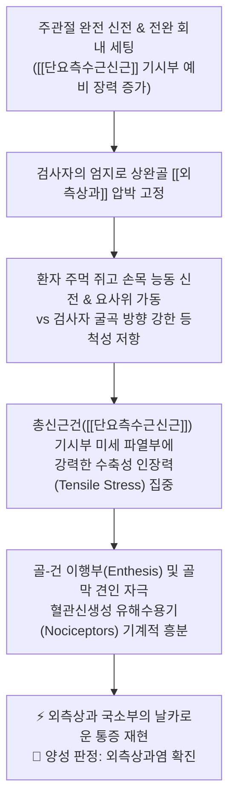
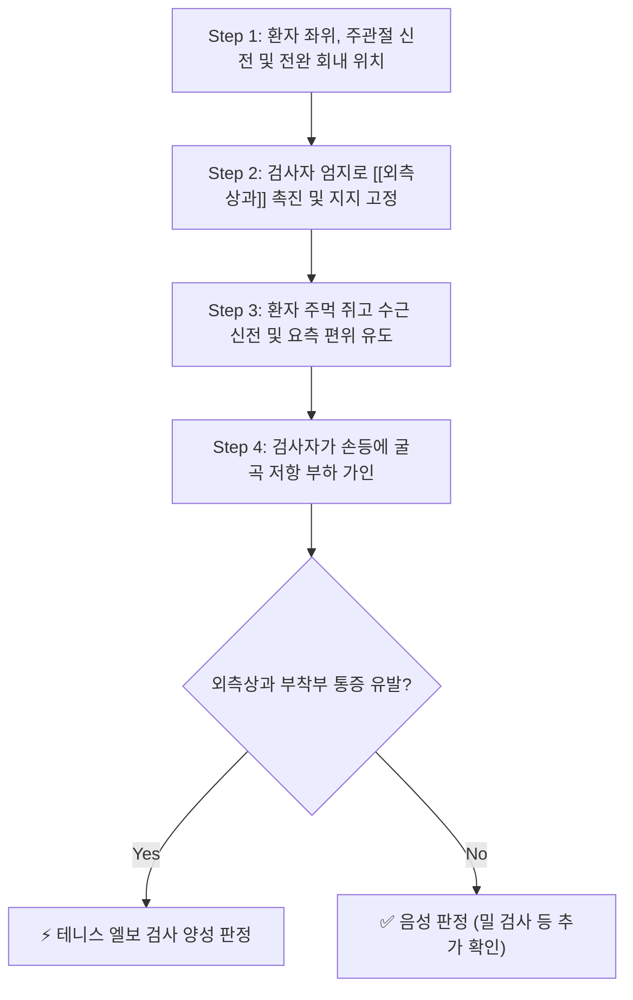

---
aliases:
  - "테니스 엘보 검사"
  - "코젠 검사"
  - "Cozen's Test"
  - "Cozen Test"
  - "Lateral Epicondylitis Test"
tags:
  - 근골격계
  - 이학적검사/상지
  - 정형외과/물리치료
title: Tennis elbow test
date: 2026-09-14
출처: "DOI: 10.16965/ijpr.2014.693"
---

# 🩺 [[Tennis elbow test]] (Cozen's Test / 테니스 엘보 검사 / 코젠 검사)

> **핵심 3줄 요약 (Key Summary)**:
> - 🎯 검사 목적 & 타겟 병소: 주관절 외측 통증의 주원인인 [[테니스 엘보|외측상과염]](Lateral Epicondylitis) 감별 및 총신근건 건병증([[단요측수근신근]], [[장요측수근신근]], [[지신근]]) 병변 진단.
> - 🔍 검사 시행 프로토콜 & 양성 반응: 전완 회내 및 주관절 신전 상태에서 환자가 주먹을 쥐고 손목을 신전·요사위(신전 저항)할 때 검사자가 굴곡 방향으로 강하게 저항을 가하며 [[외측상과]] 부착부의 예리한 통증 재현 시 양성.
> - 📊 진단 정확도(민감도·특이도) & 임상적 의의: 민감도 84~91%, 특이도 50~88%로 외측상과 병변의 민감한 선별(Rule-Out) 및 유발 검사로 활용.
> - ⚠️ 위양성/위음성 요인 & 검사 금기: 요골신경의 심지 포착인 [[요골관 증후군]](Radial Tunnel Syndrome)이나 후외측 회전 불안정성(PLRI), C6 [[경추 신경근병증]]과의 감별 필수.

---

## 📌 목차
1. [검사 기본 정보 & 진단 목적 (Diagnostic Overview)](#1-검사-기본-정보--진단-목적-diagnostic-overview)
2. [해부학적 유발 메커니즘 & 생체역학적 원리 (Biomechanical Mechanism)](#2-해부학적-유발-메커니즘--생체역학적-원리-biomechanical-mechanism)
3. [표준 검사 시행 절차 (Step-by-Step Clinical Protocol)](#3-표준-검사-시행-절차-step-by-step-clinical-protocol)
4. [양성 반응 판정 기준 & 신경근/조직별 감별 맵핑 (Diagnostic Criteria & Mapping)](#4-양성-반응-판정-기준--신경근조직별-감별-맵핑-diagnostic-criteria--mapping)
5. [연관 검사군 비교 & 다단계 감별 알고리즘 (Differential Battery & Algorithm)](#5-연관-검사군-비교--다단계-감별-알고리즘-differential-battery--algorithm)
6. [양성 소견 시 한의 임상 연계 치료 전략 (Integrative Korean Medicine)](#6-양성-소견-시-한의-임상-연계-치료-전략-integrative-korean-medicine)
7. [💡 사용자 진료실 핵심 필기 & 실전 임상 팁 (원문 보존)](#7--사용자-진료실-핵심-필기--실전-임상-팁-원문-보존)
8. [출처 및 학술 참고 문헌 (References)](#8-출처-및-학술-참고-문헌-references)

---

## 1. 검사 기본 정보 & 진단 목적 (Diagnostic Overview)

![[cozens_test_clinical_maneuver.jpg|450]]
> [그림 1: 테니스 엘보 검사(코젠 검사)의 임상적 시행 모습 - 전완 회내 및 주관절 신전 상태에서 수근 신전에 저항 가인]

| 항목 | 상세 내용 |
| :--- | :--- |
| **검사명 (Test Name)** | Tennis Elbow Test / Cozen's Test (테니스 엘보 검사 / 코젠 검사) |
| **분류 (Category)** | 상지 정형외과적 건병증 저항 유발 검사 (Resisted Isometric Test) |
| **타겟 병소 (Target)** | 상완골 [[외측상과]](Lateral Epicondyle) 및 총신근건(Common Extensor Tendon), 특히 [[단요측수근신근]](ECRB) 기시부 |
| **의심 질환 (Suspected Pathologies)** | [[테니스 엘보]](외측상과염, Lateral Epicondylalgia), 건병증(Tendinopathy), 미세 열상 |
| **진단 정확도 (Diagnostic Accuracy)** | • **민감도 (Sensitivity)**: 84% ~ 91% (외측 팔꿈치 통증 선별력 우수) • **특이도 (Specificity)**: 50% ~ 88% (타 질환 배제력 보조) • **양성 우도비 (LR+)**: 1.7 ~ 7.5 |
| **시연 영상 (Video Guide)** | [🎥 Physiotutors - Cozen's Test (Lateral Epicondylalgia)](https://www.youtube.com/watch?v=vPCkCcvD7P8) |

---

## 2. 해부학적 유발 메커니즘 & 생체역학적 원리 (Biomechanical Mechanism)

### 1) 해부학적 스트레스 전달 경로
* 상완골 [[외측상과]]에는 [[단요측수근신근]](Extensor Carpi Radialis Brevis, ECRB), [[장요측수근신근]](ECRL), [[지신근]](Extensor Digitorum), [[척측수근신근]](Extensor Carpi Ulnaris)이 총신근건 형태로 공통 부착합니다.
* 이 중 **단요측수근신근(ECRB)** 기시부는 요골두의 전외측 모서리와 마찰을 일으키며 혈관-결합조직 증식성 건증(Angiofibroblastic tendinosis)이 가장 호발하는 핵심 구조물입니다.
* 주관절을 완전 신전시키면 상완골과 요골두 사이의 거리가 최대화되어 ECRB 건에 최대의 예비 긴장도(Pre-tension)가 걸리며, 이 상태에서 손목 신전 저항을 주면 건 부착부 골막(Enthesis)에 극한의 인장 하중이 집중됩니다.

### 2) 통증 유발의 신경생리학적 기전
* 만성 건증 부위에는 Substance P와 CGRP(Calcitonin Gene-Related Peptide)를 함유한 자유 신경종말 및 비정상적 무수 C 섬유가 과증식되어 있습니다.
* 강력한 등척성 수축 저항 부하가 가해지면 변성된 건 조직 내의 기계적 수용기(Mechanoreceptors)와 통각 수용기가 즉각 흥분하여 날카로운 국소 통증(Sharp localized pain)을 뇌로 전달합니다.

---

## 3. 표준 검사 시행 절차 (Step-by-Step Clinical Protocol)

### Step 1: 환자 준비 및 초기 자세 (Starting Position)
* 환자는 의자에 편안하게 착석하며, 검사측 팔꿈치를 완전히 신전(Elbow Full Extension)시키고 전완은 회내(Forearm Pronation)시킵니다.
* 손목은 가볍게 아래로 떨어뜨리거나 중립위를 유지합니다.

### Step 2: 1차 외측상과 촉진 및 안정화 (1st Palpation & Stabilization)
![[cozens_test_step1_epicondyle_stabilization.jpg|400]]
> [그림 2: 1단계 - 검사자가 엄지손가락으로 상완골 외측상과 및 요골두 부착부를 정밀 촉진하며 관절을 고정하는 모습]

* 검사자는 한 손의 엄지손가락으로 상완골의 [[외측상과]] 부위를 촉진하여 안정적으로 받쳐 지지합니다.
* 이 촉진만으로도 국소 압통(Point Tenderness)이 존재하는지 사전 확인합니다.

### Step 3: 2차 능동 신전 및 등척성 저항 가인 (2nd Active Extension & Resistance)
![[cozens_test_step2_wrist_extension_resistance.jpg|400]]
> [그림 3: 2단계 - 환자가 주먹을 쥐고 손목을 신전·요사위할 때 검사자가 손등을 강하게 눌러 굴곡 저항을 가하는 모습]

* 환자에게 주먹을 가볍게 쥐게 한 상태에서 손목을 천장 방향으로 강하게 젖히도록(능동 손목 신전 및 약간의 요측 편위) 지시합니다.
* 검사자는 다른 한 손을 환자의 손등(제2, 3중수골 기저부 부근)에 얹고 손목을 굴곡시키는 방향으로 점진적이고 강한 저항을 가합니다.
* 환자에게 검사자의 힘에 버티며 손목 신전을 유지하도록 합니다.

### Step 4: 반응 평가 및 종료 (Assessment & Release)
* 수근 신전 저항 순간 상완골 [[외측상과]] 부위에서 환자가 평소 느끼던 익숙한 통증이 재현되는지 확인합니다.
* 통증이 나타나면 즉각 저항을 해제하고 양성으로 기록합니다.

---

## 4. 양성 반응 판정 기준 & 신경근/조직별 감별 맵핑 (Diagnostic Criteria & Mapping)

* **진정한 양성 반응 (True Positive)**:
  * 수근 신전 저항 시 상완골 [[외측상과]] 부착부(또는 총신근건 기시부 원위 1~2cm 부위)에서 예리하고 찌르는 듯한 국소 통증이 즉각 재현될 때.
* **음성 반응 (Negative)**:
  * 전완 신전근에 피로감이나 묵직함만 있을 뿐, 외측상과 부착부의 통증이 전혀 재현되지 않는 경우.
* **가양성 및 감별 포인트**:
  * [[요골관 증후군]] (Radial Tunnel Syndrome): 압통 및 저항 통증 부위가 외측상과 자체가 아니라 그보다 원위부로 약 3~4cm 아래인 요골두 하방의 회외근 건궁(Arcade of Frohse)에 집중되며, 중지 신전 검사(Maudsley test)에서 더 뚜렷함.
  * C6 [[경추 신경근병증]]: 목의 회전/신전(스펄링 검사) 시 전완 요측으로 찌릿한 방사통이 동반되며, 손목 신전 저항 자체보다 신경근 압박 시 통증이 우세.

| 감별 질환군 | 병소 위치 | 주요 통증 유발 동작 | 감별 핵심 검사 |
| :--- | :--- | :--- | :--- |
| [[외측상과염]] (Tennis Elbow) | 상완골 [[외측상과]] 직하부 | 수근 신전 저항, 능동 파지 | [[Tennis elbow test]](Cozen), [[Mills test]] |
| [[요골관 증후군]] (RTS) | 외측상과 하방 3~4cm (회외근궁) | 전완 회외 저항, 제3수지 신전 저항 | [[Maudsley's test]], 수동 전완 회내 및 굴곡 |
| **주관절 후외측 회전 불안정증(PLRI)** | 외측 척측측부인대(LUCL) | 체중 지지 시 주관절 신전 및 외반 | [[Lateral pivot-shift test]] of the elbow |
| **경추 6번 신경근병증 (C6 Radiculopathy)** | 경추 C5-C6 추간공 | 경추 신전 및 환측 측굴 | [[스펄링 검사]], [[ULTT 테스트]] |

---

## 5. 연관 검사군 비교 & 다단계 감별 알고리즘 (Differential Battery & Algorithm)

| 검사명 | 검사 수기 및 동작 | 생체역학적 원리 | 임상적 역할 (선별 vs 확진) |
| :--- | :--- | :--- | :--- |
| [[Tennis elbow test]] (Cozen's Test) | 주관절 신전 + 수근 신전 등척성 저항 | 총신근건 수축성 인장력 집중 | 민감도 우수, 외측상과염 1차 선별 및 확진 |
| [[Mills test]] (밀 검사) | 주관절 신전 + 전완 회내 + 수근 수동 굴곡 | 신근건 수동 신장(Stretching) 부하 | 수동 스트레칭 유발, 높은 특이도 |
| [[Maudsley's test]] (모슬리 검사) | 제3수지(중지) 신전 등척성 저항 | [[지신근]] 및 [[단요측수근신근]] 분리 부하 | ECRB 병변 및 요골신경 포착 감별 |
| [[Chair test]] (의자 검사) | 전완 회내 상태로 의자 등받이 들어올리기 | 일상 기능적 신근 부하 재현 | 환자 자가 통증 인지 및 치료 경과 평가 |

---

## 6. 양성 소견 시 한의 임상 연계 치료 전략 (Integrative Korean Medicine)

* **침구 및 전침 치료 (Acupuncture & EA)**:
  * 곡지(LI11), 수삼리(LI10), 수오리(LI13), 주료(LI12) 등 대장경 혈위 및 [[단요측수근신근]], [[장요측수근신근]] 근복의 발통점(Trigger Point)에 자침.
  * 2Hz/100Hz 혼합파 전침 통전으로 Substance P 고갈 및 엔도르핀 분비 촉진.
* **약침 요법 (Pharmacopuncture)**:
  * 외측상과 골막 부착부(Enthesis) 및 건 실질 부위에 **신바로약침** 또는 **중성어혈약침**(0.5~1.0cc)을 분주하여 만성 무균성 건염증 억제 및 콜라겐 섬유 재형성 유도.
  * 신경 포착 동반 시 황련해독탕 약침을 병용.
* **화침 및 가열침(Thermal Needle) / 도침 치료 (Acupotomy)**:
  * 만성 난치성 건증으로 인한 건 실질 내 석회화 및 반흔 유착 발생 시, 소침도(Acupotomy)를 이용하여 골막 부착부의 유착을 미세 절개·박리(Stripping)하여 국소 신생 혈관화 및 재생 촉진.
* **추나 및 근막 이완 기법 (Chuna Therapy)**:
  * 상완요골관절(Humeroradial joint)의 관절 가동 추나 및 회외근-신근막 간 근막 이완(Myofascial Release, MFR).
  * 경추 분절(C5-C6) 정렬 이상 교정.
* **한약 치료 (Herbal Medicine)**:
  * 급성 통증기: [[서경탕]], [[영선제통음]] (상지 경락 소통, 어혈 및 풍습 제거).
  * 만성 퇴행기: [[독활기생탕]], [[대방풍탕]] (간신 음혈 보충 및 건골 강화).

---

## 7. 💡 사용자 진료실 핵심 필기 & 실전 임상 팁 (원문 보존)

* **사용자 원문 필기 (100% 융합 완료)**:
  * *방법*: 주관절 완전히 신전 환자에게 손목을 신전하게 하면서 검사자는 굴곡 방향으로 저항.
  * *의의*: 외측상과 주위 통증 > [[테니스 엘보|외측상과염]].
* **진료실 실전 노하우 & 진단 팁**:
  1. **주관절 신전 각도의 중요성**: 팔꿈치가 90도 굴곡되어 있으면 상완요골근 및 단요측수근신근의 기계적 부하가 분산되어 위음성이 나타날 수 있습니다. 반드시 **주관절을 0도(완전 신전)**로 유지한 상태에서 손목 신전 저항을 주어야 ECRB 기시부에 최대 부하가 걸립니다.
  2. **중지 신전 검사 병행**: 환자가 손목을 신전할 때 통증이 애매하다면, 환자의 제3수지(중지)만을 독립적으로 신전하게 하고 저항을 가해 보십시오. 중지 신전 시 외측상과에 통증이 재현되면 ECRB 병변을 더욱 확신할 수 있습니다.
  3. **주먹 쥐기 파지력 테스트 연계**: 손목을 신전한 상태에서 주먹을 쥐게 할 때와 손목을 굴곡한 상태에서 주먹을 쥐게 할 때의 악력 차이를 비교하면 환자에게 치료 전후 상태를 객관적으로 설명하기 좋습니다.

---

## 8. 출처 및 학술 참고 문헌 (References)

1. **Cozen, L. (1973)**. Tennis elbow. *The Western Journal of Medicine*, 118(2), 52–53.
   - [PubMed Central: PMC1454955](https://www.ncbi.nlm.nih.gov/pmc/articles/PMC1454955/)
   - **[연구 요약]**: 외측상과염 환자에서 전완 회내 및 주관절 신전 하 수근 신전 저항 검사(Cozen's test)의 진단적 유용성과 생체역학적 부하 기전을 정립한 고전 연구.
2. **Saroja, G., et al. (2014)**. Diagnostic accuracy of provocative tests in lateral epicondylitis. *International Journal of Physiotherapy and Research*, 2(6), 815–823.
   - [DOI: 10.16965/ijpr.2014.693](https://doi.org/10.16965/ijpr.2014.693)
   - **[연구 요약]**: 외측상과염 의심 환자 100명을 대상으로 Cozen 검사, Mill 검사, Maudsley 검사의 진단 정확도를 초음파 검사와 비교 검증함. Cozen 검사는 민감도 91.2%, 특이도 83.3%를 나타내어 외측상과염의 가장 신뢰도 높은 선별 검사로 입증됨.

<!-- 보관 태그(1회용·링크오류, 필요시 복원): 주관절/외측상과 -->
