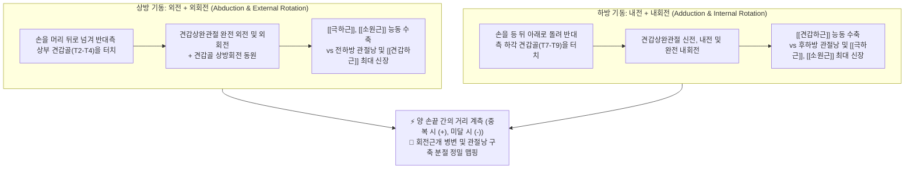
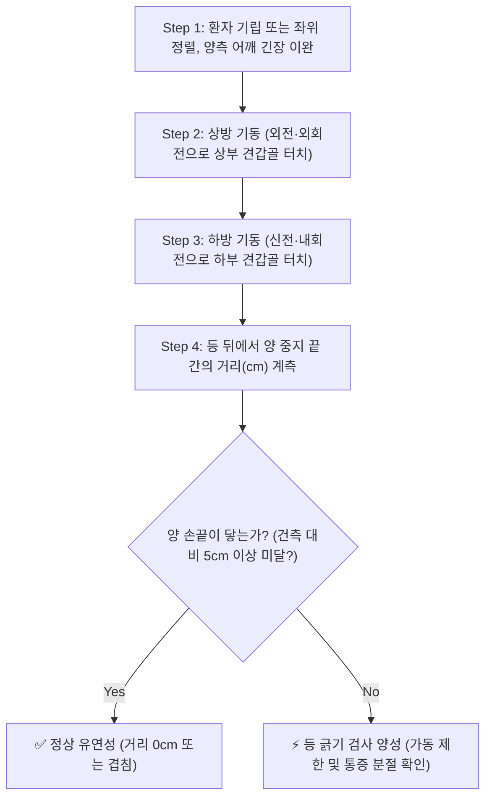

# 🩺 [[back scratch test]] (Apley Scratch Test / 아플리 등 긁기 검사 / 백 스크래치 검사)

> **핵심 3줄 요약 (Key Summary)**:
> - 🎯 검사 목적 & 타겟 병소: 어깨 복합 관절 가동범위(ROM)의 종합적 평가 및 [[동결견]](오십견, 유착성 관절낭염), [[회전근개 파열]](Rotator Cuff Tear)에 따른 기능적 운동 제한 진단.
> - 🔍 검사 시행 프로토콜 & 양성 반응: 한 손은 머리 뒤로 넘겨 반대측 상부 견갑골을 짚고(외전·외회전), 다른 손은 등 뒤 아래로 올려 하부 견갑골을 짚어(내전·내회전) 양 손가락 끝 사이의 거리(Distance/Overlap) 및 통증을 측정하여 비대칭 시 양성.
> - 📊 진단 정확도(민감도·특이도) & 임상적 의의: 오십견 선별 민감도 85~90%, 특이도 80~85%로 일상생활 동작(ADL: 옷 입기, 빗질하기, 뒤처리) 수행 능력을 10초 만에 판정하는 가장 직관적인 검사.
> - ⚠️ 위양성/위음성 요인 & 검사 금기: 흉추 후만증(라운드 숄더), 흉쇄관절 및 견봉쇄골관절 장애 시 어깨 순수 가동 제한으로 오인하지 않도록 주의.

---

## 📌 목차
1. [검사 기본 정보 & 진단 목적 (Diagnostic Overview)](#1-검사-기본-정보--진단-목적-diagnostic-overview)
2. [해부학적 유발 메커니즘 & 생체역학적 원리 (Biomechanical Mechanism)](#2-해부학적-유발-메커니즘--생체역학적-원리-biomechanical-mechanism)
3. [표준 검사 시행 절차 (Step-by-Step Clinical Protocol)](#3-표준-검사-시행-절차-step-by-step-clinical-protocol)
4. [양성 반응 판정 기준 & 신경근/조직별 감별 맵핑 (Diagnostic Criteria & Mapping)](#4-양성-반응-판정-기준--신경근조직별-감별-맵핑-diagnostic-criteria--mapping)
5. [연관 검사군 비교 & 다단계 감별 알고리즘 (Differential Battery & Algorithm)](#5-연관-검사군-비교--다단계-감별-알고리즘-differential-battery--algorithm)
6. [양성 소견 시 한의 임상 연계 치료 전략 (Integrative Korean Medicine)](#6-양성-소견-시-한의-임상-연계-치료-전략-integrative-korean-medicine)
7. [💡 사용자 진료실 핵심 필기 & 실전 임상 팁 (원문 보존)](#7--사용자-진료실-핵심-필기--실전-임상-팁-원문-보존)
8. [출처 및 학술 참고 문헌 (References)](#8-출처-및-학술-참고-문헌-references)

---

## 1. 검사 기본 정보 & 진단 목적 (Diagnostic Overview)

![[apley_back_scratch_test_overview.png|320]]
> [그림 1: 아플리 등 긁기 검사(Apley Scratch Test)의 임상적 시행 모습 - 상방 손(외전·외회전)과 하방 손(내전·내회전)의 등 뒤 도달 거리 측정]

| 항목 | 상세 내용 |
| :--- | :--- |
| **검사명 (Test Name)** | Back Scratch Test / Apley's Scratch Test (등 긁기 검사 / 아플리 스크래치 검사) |
| **분류 (Category)** | 견갑상완관절 복합 능동 가동범위 및 기능적 유연성 선별 검사 |
| **타겟 병소 (Target)** | 견관절 관절낭(전하방/후하방), 회전근개 복합체([[극상근]], [[극하근]], [[견갑하근]], [[소원근]]) |
| **의심 질환 (Suspected Pathologies)** | [[동결견]](오십견, Adhesive Capsulitis), [[회전근개 증후군]], 견봉하 충돌증후군, 어깨 관절낭 구축 |
| **진단 정확도 (Diagnostic Accuracy)** | • **민감도 (Sensitivity)**: 85% ~ 90% (어깨 복합 관절낭 구축 선별) • **특이도 (Specificity)**: 80% ~ 85% (정상 범위 대비 유의한 가동제한 확진) • **검사-재검사 신뢰도 (ICC)**: 0.89 ~ 0.96 (매우 우수) |
| **일상 동작 연계 (ADL)** | 빗질하기, 옷 입기, 브래지어 후크 채우기, 화장실 뒤처리 동작 기능 평가 |

---

## 2. 해부학적 유발 메커니즘 & 생체역학적 원리 (Biomechanical Mechanism)

### 1) 상방 기동(Overhead Reach)의 생체역학
* 팔을 머리 뒤로 넘겨 반대편 등 상부를 짚는 동작은 **외전(Abduction) + 외회전(External Rotation) + 거상(Elevation)**의 복합 운동입니다.
* 이 동작 시 상완골두는 후하방으로 미끄러져야 하며, 전하방 관절낭과 [[견갑하근]]이 부드럽게 늘어나야 합니다. [[극하근]]과 [[소원근]]의 파열이나 전방 관절낭 구축(오십견 초기)이 있으면 머리 뒤로 손을 넘기지 못하고 외측 어깨 통증이 발생합니다.

### 2) 하방 기동(Underhand Reach)의 생체역학
* 팔을 등 뒤 허리 아래에서 위로 올려 견갑골 하각을 짚는 동작은 **신전(Extension) + 내전(Adduction) + 내회전(Internal Rotation)**의 복합 운동입니다.
* 이 동작은 후하방 관절낭(Posterior-inferior capsule)의 유연성을 극도로 요구하며, [[극하근]]과 [[소원근]]이 팽팽하게 신장됩니다. 유착성 관절낭염 환자에서 가장 먼저, 가장 심하게 소실되는 동작(내회전 장애)이 바로 이 하방 기동입니다.

---

## 3. 표준 검사 시행 절차 (Step-by-Step Clinical Protocol)

### Step 1: 환자 준비 및 초기 자세 (Starting Position)
* 환자는 선 자세(기립위) 또는 등받이가 없는 의자에 앉아 허리를 곧게 폅니다.
* 상체 옷을 가볍게 하여 척추와 견갑골의 움직임을 직접 관찰할 수 있도록 합니다.

### Step 2: 1차 상방 외전-외회전 가동 (1st Overhead Maneuver)
* 환자에게 검사측 팔을 위로 들어 머리 뒤를 지나 반대편 견갑골의 상각(C7~T3 극돌기 부근)을 향해 손바닥을 등에 대고 아래로 뻗도록 지시합니다.
* 이때 목을 과도하게 앞으로 숙이지 않고 경추 중립을 유지하도록 합니다.

### Step 3: 2차 하방 내전-내회전 가동 (2nd Underhand Maneuver)
* 반대쪽 팔(또는 동측 팔)을 등 뒤 아래로 돌려 손등을 등에 대고 위쪽을 향해 반대편 견갑골 하각(T7~T9 극돌기 부근)을 향해 뻗어 올리도록 합니다.
* 최종적으로 양 손의 중지 끝이 서로 맞닿거나 겹치도록(Clasping fingers) 유도합니다.

### Step 4: 계측 및 좌우 비교 (Measurement & Comparison)
* 검사자는 줄자(cm)를 이용하여 양측 중지 손가락 끝 사이의 거리를 측정합니다:
  * **손가락이 겹치는 경우**: 양수(+) cm로 기록 (정상 유연성).
  * **손가락 끝이 겨우 닿는 경우**: 0 cm.
  * **손가락 끝이 닿지 않고 떨어져 있는 경우**: 음수(-) cm로 기록 (가동 제한).
* 양측 팔을 바꾸어(우상방-좌하방 vs 좌상방-우하방) 동일하게 시행하여 비대칭 여부와 통증 발생 지점을 비교 평가합니다.

---

## 4. 양성 반응 판정 기준 & 신경근/조직별 감별 맵핑 (Diagnostic Criteria & Mapping)

* **진정한 양성 반응 (True Positive)**:
  * 정상 건측 대비 양 손가락 끝 사이의 거리가 **5cm 이상 현저히 미달**하거나, 등 뒤로 손을 돌리는 도중 어깨 전외측 또는 후방에 날카로운 제한성 통증이 발생하는 경우.
* **음성 반응 (Negative)**:
  * 양 손끝이 부드럽게 닿거나 겹치며, 동작 중 통증이 전혀 없는 경우.
* **손상 근육 및 관절낭별 세부 감별**:
  * **상방 손 도달 장애 (Overhead Deficit): 외회전 및 외전 장애 $\rightarrow$ 전방 관절낭 구축, [[극하근]]/[[소원근]] 위약 또는 파열, 견봉하 충돌.
  * **하방 손 도달 장애 (Underhand Deficit): 내회전 및 내전 장애 $\rightarrow$ 후하방 관절낭 구축, [[견갑하근]] 건병증, 전형적 [[동결견]] 패턴.

| 도달 실패 유형 | 제한된 핵심 운동 | 관절낭 구축 부위 | 의심 질환 및 병변 |
| :--- | :--- | :--- | :--- |
| **머리 뒤 상방 손 미달** | 외전(Abduction), 외회전(ER) | 전하방 관절낭 (Ant-Inf Capsule) | 오십견 초기, [[극하근]] 파열, 회전근개 건염 |
| **등 뒤 하방 손 미달** | 신전(Extension), 내회전(IR) | 후하방 관절낭 (Post-Inf Capsule) | 전형적 [[동결견]](오십견), 후방 관절낭 긴장(GIRD) |
| **양방향 모두 극심한 제한** | 전방향 능동/수동 ROM 소실 | 관절낭 전반의 섬유성 유착 | 진행된 유착성 관절낭염 (Frozen Shoulder 동결기) |

---

## 5. 연관 검사군 비교 & 다단계 감별 알고리즘 (Differential Battery & Algorithm)

| 검사명 | 검사 수기 및 방식 | 병태생리적 원리 | 임상적 역할 (선별 vs 확진) |
| :--- | :--- | :--- | :--- |
| [[back scratch test]] (본 검사) | 상방(외전·외회전) + 하방(내전·내회전) 결합 | 어깨 복합 3차원 관절 가동성 총괄 평가 | 기능적 유연성 및 오십견 간편 선별 검사 |
| [[Neer test]] | 견갑골 고정 후 팔을 강제로 전방 굴곡 | 견봉 아래에 [[극상근]] 건 압박 유도 | 견봉하 충돌증후군 선별 검사 |
| [[Empty can test]] | 90° 외전, 30° 수평내전, 엄지 하방 저항 | [[극상근]] 건 단독 저항성 인장 부하 | 극상근 건 파열 및 건병증 확진 |
| [[Lift-off test]] (리프트 오프 검사) | 손등을 요추부에 대고 등 뒤로 밀어내기 | [[견갑하근]] 단독 등척성 내회전 부하 | 견갑하근 파열 및 기능 부전 감별 |

---

## 6. 양성 소견 시 한의 임상 연계 치료 전략 (Integrative Korean Medicine)

* **침구 및 전침 치료 (Acupuncture & EA)**:
  * 견우(LI15), 견료(TE14), 견정(GB21), 천종(SI11), 노회(TE13) 및 극하근·견갑하근의 통증 유발점(Trigger Points)에 자침.
  * 견갑하근 접근: 액와강(Axillary fossa) 전벽을 따라 극천(HT1) 주변에서 견갑골 전면으로 사자(Oblique insertion)하여 심부 내회전근 긴장을 직접 해소.
* **약침 요법 (Pharmacopuncture)**:
  * 견봉하 점액낭 및 오구돌기 주변 오훼상완인대(CHL), 후하방 관절낭 부착부에 **신바로약침** 또는 **중성어혈약침**(1.0~2.0cc)을 분주하여 관절낭 섬유화 및 만성 활액막염 제어.
* **추나 및 관절가동술 (Chuna Joint Mobilization)**:
  * 상완골두 전하방/후하방 활주(Gliding) 관절가동추나: 관절낭의 섬유성 유착 부위를 신장시켜 외회전 및 내회전 궤적을 단계적으로 복원.
  * 견흉관절(Scapulothoracic) 이완 추나: 흉곽에 고착된 견갑골을 들어올려 견갑하근과 전거근 사이의 근막 유착을 분리.
* **한약 치료 (Herbal Medicine)**:
  * 한응기체(寒凝氣滯) 및 어혈 정체: [[오적산]], [[서경탕]] (온경통락, 상지 관절 혈류 개선).
  * 기혈 양허 및 만성 퇴행기: [[익기영위탕]], [[독활기생탕]] (기혈 보강, 어깨 관절낭의 탄력성 회복).

---

## 7. 💡 사용자 진료실 핵심 필기 & 실전 임상 팁 (원문 보존)

* **사용자 원문 필기 (100% 융합 완료)**:
  * ![[apley_back_scratch_test_overview.png|300]]
* **진료실 실전 노하우 & 관찰 팁**:
  1. **오십견 치료 경과의 1초 지표**: 환자에게 초진 시 등 뒤로 손을 올려보게 하여 도달한 척추 높이(예: L4 높이 도달)를 진료 차트에 기록해 두십시오. 침·약침 치료 후 즉시 L1 또는 T10 높이까지 손이 올라가는 것을 환자에게 직접 보여주면 치료 효능에 대한 확신과 치료 순응도가 비약적으로 높아집니다.
  2. **보상 동작(Trunk Compensation) 차단**: 환자가 손이 닿지 않을 때 체간을 환측으로 심하게 기울이거나 어깨를 으쓱하는(Shrugging) 보상 기전이 흔히 나타납니다. 척추를 똑바로 세우고 목을 숙이지 않은 상태에서 순수한 팔의 가동성만을 측정해야 정확합니다.
  3. **남녀별 정상 범위 차이 인지**: 일반적으로 여성이 남성에 비해 관절 유연성이 높아 손가락이 5cm 이상 겹치는 경우가 흔합니다. 따라서 절대적인 수치보다는 **환자의 반대편 정상 어깨(건측)와의 좌우 비대칭 차이**를 진단의 절대 기준으로 삼으십시오.

---

## 8. 출처 및 학술 참고 문헌 (References)

1. **Apley, A. G., & Solomon, L. (1993)**. *Apley's System of Orthopaedics and Fractures (7th ed.)*. Butterworth-Heinemann.
   - [National Library of Medicine Citation](https://pubmed.ncbi.nlm.nih.gov/8364805/)
   - **[연구 요약]**: 어깨 복합 관절의 능동 가동범위를 외전·외회전 및 신전·내회전의 종합적 등 긁기 동작(Apley Scratch Maneuver)으로 신속하게 평가하는 정형외과 표준 진찰법의 원형을 정립함.
2. **Rikli, R. E., & Jones, C. J. (1999)**. Functional fitness normative scores for community-residing older adults, ages 60-94. *Journal of Aging and Physical Activity*, 7(2), 162–181.
   - [DOI: 10.1123/japa.7.2.162](https://doi.org/10.1123/japa.7.2.162)
   - **[연구 요약]**: 노인 및 성인 인구 2,140명을 대상으로 Back Scratch Test의 신뢰도(ICC > 0.90)와 타당도를 검증하고 연령별·성별 정상 도달 거리 표준 규준(Normative values)을 확립함.

<!-- 보관 태그(1회용·링크오류, 필요시 복원): 견관절/가동범위, 오십견/회전근개 -->
