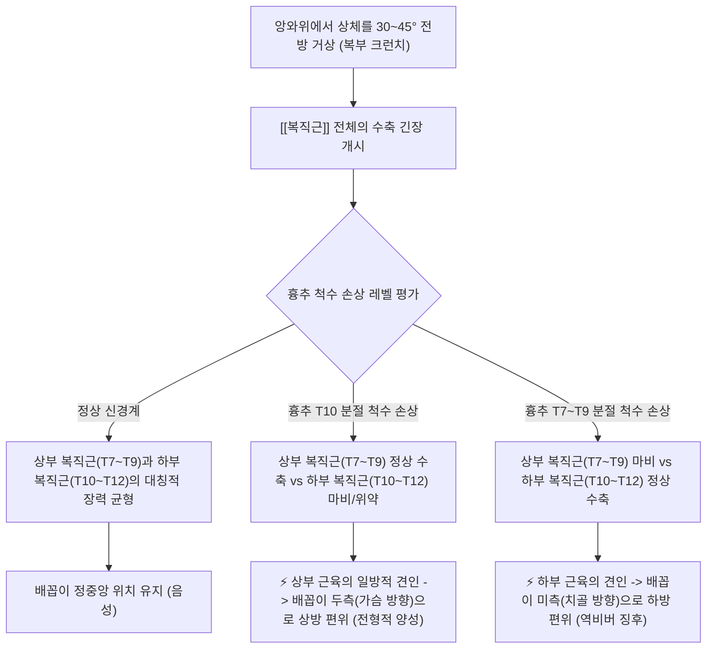
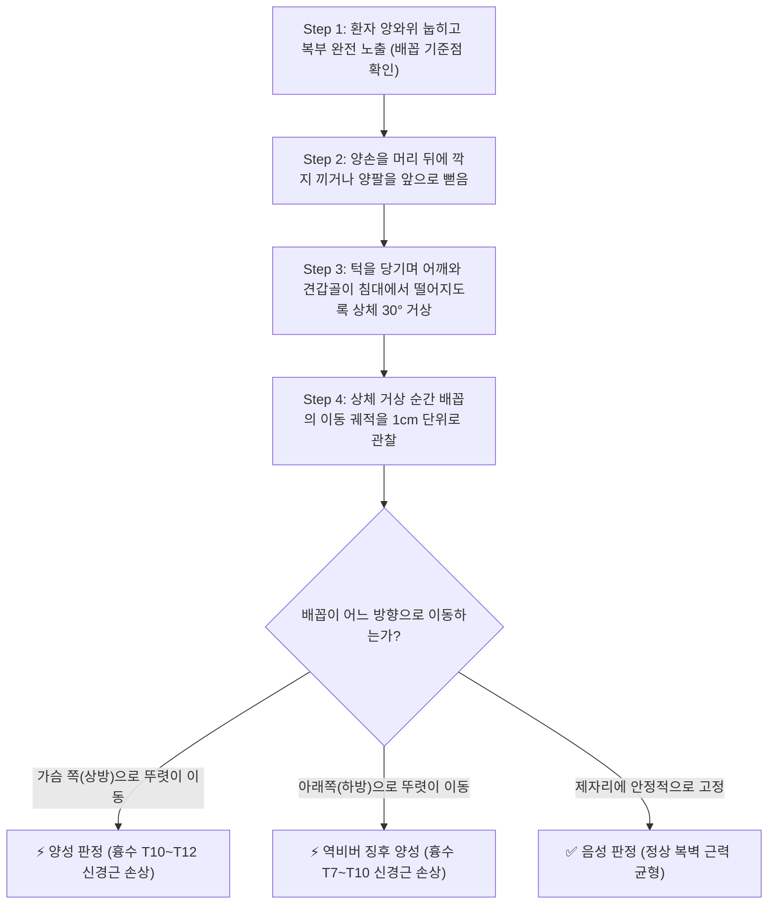

# 🩺 [[Beevor's sign]] (비버 징후)

> **핵심 3줄 요약 (Key Summary)**:
> - 🎯 검사 목적 & 타겟 병소: 흉수(Thoracic cord) 분절성 병변 레벨 국소화 및 근이영양증(FSHD) 선별, [[복직근]]의 상부(T7~T9)와 하부(T10~T12) 신경 지배 불균형 평가.
> - 🔍 검사 시행 프로토콜 & 양성 반응: 앙와위에서 양손을 머리 뒤에 깍지 끼고 상체를 30~45° 들어 올릴 때(크런치 동작), 배꼽이 가슴 쪽(상방)으로 1cm 이상 끌려 올라가면 흉수 T10~T12 병변 양성, 배꼽이 하방으로 이동하면 T7~T10 병변 양성 판정.
> - 📊 진단 정확도(민감도·특이도) & 임상적 의의: 흉추 MRI 전 침상에서 척수 압박 레벨을 T10 경계로 정밀하게 분리할 수 있는 가장 우아하고 특이도 높은 신경학적 이학적 검사임.
> - ⚠️ 위양성/위음성 요인 & 검사 금기: 심한 복부 수술 흉터, 복벽 탈장, 척추 전방전위증 환자에서 복벽 비대칭에 의한 가양성 주의, 경추/요추 급성 디스크 환자는 목 무리한 굴곡 주의.

---

## 📌 목차
1. [검사 기본 정보 & 진단 목적 (Diagnostic Overview)](#1-검사-기본-정보--진단-목적-diagnostic-overview)
2. [해부학적 유발 메커니즘 & 생체역학적 원리 (Biomechanical Mechanism)](#2-해부학적-유발-메커니즘--생체역학적-원리-biomechanical-mechanism)
3. [표준 검사 시행 절차 (Step-by-Step Clinical Protocol)](#3-표준-검사-시행-절차-step-by-step-clinical-protocol)
4. [양성 반응 판정 기준 & 흉수 분절 감별 맵핑 (Diagnostic Criteria & Mapping)](#4-양성-반응-판정-기준--흉수-분절-감별-맵핑-diagnostic-criteria--mapping)
5. [연관 검사군 비교 & 척수병증 감별 알고리즘 (Differential Battery & Algorithm)](#5-연관-검사군-비교--척수병증-감별-알고리즘-differential-battery--algorithm)
6. [양성 소견 시 한의 임상 연계 치료 전략 (Integrative Korean Medicine)](#6-양성-소견-시-한의-임상-연계-치료-전략-integrative-korean-medicine)
7. [💡 사용자 진료실 핵심 필기 & 실전 임상 팁 (원문 보존)](#7--사용자-진료실-핵심-필기--실전-임상-팁-원문-보존)
8. [출처 및 학술 참고 문헌 (References)](#8-출처-및-학술-참고-문헌-references)

---

## 1. 검사 기본 정보 & 진단 목적 (Diagnostic Overview)

![[비버징후_1단계_앙와위_시작자세_실사.png|450]]
> [그림 1: 앙와위 휴식 상태에서 배꼽의 정중선 기저 위치를 확인하는 모습]

| 항목 | 상세 내용 |
| :--- | :--- |
| **검사명 (Test Name)** | 비버 징후 (Beevor's Sign / Beevor's Test / 배꼽 편위 징후) |
| **분류 (Category)** | 척수 분절 신경학적 국소화 검사 / 신경근병증 및 근병증 감별 검사 |
| **타겟 병소 (Target)** | [[복직근]] (상부 복직근 vs 하부 복직근), 흉수 T7~T12 신경근, 척수 전각세포 |
| **의심 질환 (Suspected Pathologies)** | 흉추 척수 종양/경색, 흉추 척수염, 안면견갑상완근이영양증(FSHD), 근위축성 측삭경화증(ALS) |
| **진단 정확도 (Diagnostic Accuracy)** | • **민감도 (Sensitivity)**: 75% ~ 85% (T10 이하 척수 압박 시) • **특이도 (Specificity)**: 90% ~ 98% (배꼽 상방 편위 시 T10 레벨 확진) • **양성 우도비 (LR+)**: 7.5 ~ 18.0 |
| **시연 영상 (Video Guide)** | [🎥 시연 영상: Beevor's Sign Neurology Examination](https://www.youtube.com/watch?v=jdYZiF9lKH0) |

---

## 2. 해부학적 유발 메커니즘 & 생체역학적 원리 (Biomechanical Mechanism)

### 1) 복직근의 이중 분절 신경 지배 (Dual Segmental Innervation)
* [[복직근]](Rectus abdominis)은 해부학적으로 배꼽(Umbilicus)을 경계로 상하부가 서로 다른 늑간신경(Intercostal nerves)의 지배를 받습니다.
  * **상부 복직근 (배꼽 상방)**: 흉추 신경근 **T7, T8, T9**의 지배를 받습니다.
  * **하부 복직근 (배꼽 하방)**: 흉추 신경근 **T10, T11, T12**의 지배를 받습니다.
* 배꼽은 상부와 하부 근육의 장력이 정확히 평형을 이루는 '중립 고정점(Anchor point)' 역할을 수행합니다.

### 2) 줄다리기 역학 (Tug-of-War Kinematics)
* 상체를 들어 올리는 복근 운동 시, 상하부 근육이 마치 팽팽한 줄다리기를 하듯 배꼽을 양방향에서 잡아당깁니다.
* 만약 **T10 분절에 척수 종양이나 압박 병변**이 생기면, T10 이하를 담당하는 하부 복직근은 신경 전달이 차단되어 이완성 마비(Paresis)에 빠집니다.
* 반면 병변 상부인 T7~T9의 지배를 받는 상부 복직근은 정상적으로 강하게 수축하므로, 줄다리기에서 상부가 이겨 **배꼽이 머리/가슴 쪽(두측, Cephalad)으로 쑥 끌려 올라가는 현상**이 발생합니다.

---

## 3. 표준 검사 시행 절차 (Step-by-Step Clinical Protocol)

### Step 1: 환자 자세 및 배꼽 랜드마크 확인 (Starting Position)
* 환자를 침대에 편안히 눕힙니다 (앙와위 Supine position).
* 상의를 올려 가슴 아래부터 치골결합까지 복부 전체를 완전히 노출시킵니다.
* 환자가 힘을 빼고 숨을 쉴 때 배꼽의 정중선(Midline) 위치를 기준점으로 눈여겨봅니다.

### Step 2: 환자 손 위치 세팅 (Arm Placement)
> [그림 2: 양 무릎을 가볍게 세우고 양손을 머리 뒤로 깍지 낀 채 시작 자세를 취한 모습]

* 환자에게 양손을 머리 뒤로 가볍게 깍지 끼게 합니다 (복근이 약한 고령자의 경우 양팔을 무릎 쪽으로 앞으로 나란히 뻗게 할 수 있습니다).
* 양 무릎은 가볍게 45° 굽혀 복근 수축 시 장요근의 과도한 개입을 줄입니다.

### Step 3: 부분 상체 거상 및 배꼽 편위 관찰 (Partial Curl-up & Observation)
![[비버징후_2단계_상체거상_배꼽상방편위_실사.png|400]]
> [그림 3: 상체를 들어 올리는 순간 하부 복직근 마비로 인해 배꼽이 가슴 쪽(상방)으로 끌려 올라가는 전형적인 비버 징후 양성 모습]

* 환자에게 "고개를 들고 턱을 가슴 쪽으로 당기면서, 어깨가 침대에서 살짝 떨어질 정도로 상체를 반쯤 들어 올리세요 (가벼운 윗몸 일으키기)"라고 지시합니다.
* 상체가 들리는 찰나, 검사자는 배꼽의 움직임을 수직 및 수평 방향으로 정밀하게 관찰합니다.
* 배꼽이 위로 1cm 이상 쑥 당겨 올라가는지, 혹은 아래나 좌우 대각선으로 치우치는지 확인합니다.

---

## 4. 양성 반응 판정 기준 & 흉수 분절 감별 맵핑 (Diagnostic Criteria & Mapping)

* **전형적 비버 징후 양성 (Classic Beevor's Sign - 배꼽 상방 이동)**:
  * 상체 거상 시 **배꼽이 가슴 쪽(두측, Cephalad)으로 뚜렷하게 상방 이동**.
  * **병변 위치**: **흉추 척수 T10 ~ T12 분절 병변** (하부 복직근 위약).
* **역비버 징후 양성 (Inverted / Reverse Beevor's Sign - 배꼽 하방 이동)**:
  * 상체 거상 시 **배꼽이 치골 쪽(미측, Caudad)으로 하방 이동**.
  * **병변 위치**: **흉추 척수 T7 ~ T10 분절 병변** (상부 복직근 위약).
* **측방 편위 (Lateral Deviation)**:
  * 배꼽이 좌측 또는 우측 한쪽으로만 쏠리는 경우 $\rightarrow$ 편측성 복벽 마비 또는 해당 측 늑간신경 손상.
* **음성 반응 (Negative)**:
  * 상체를 들어 올려도 배꼽이 상하좌우로 흔들리지 않고 제자리에서 단단히 유지되는 상태.

| 배꼽 편위 방향 | 근육 불균형 상태 | 척수 및 신경 손상 레벨 | 주요 원인 질환 |
| :--- | :--- | :--- | :--- |
| **가슴 쪽 (상방 이동)** | 상부 복직근(정상) > 하부 복직근(마비) | **흉수 T10 ~ T12** | 흉수 수막종, 혈관종, 안면견갑상완근이영양증(FSHD) |
| **치골 쪽 (하방 이동)** | 상부 복직근(마비) < 하부 복직근(정상) | **흉수 T7 ~ T10** | 상부 흉수 압박, 척수염, 척추 전이암 |
| **우측 또는 좌측 (편측 이동)** | 정상 측 복벽 수축 > 마비 측 복벽 이완 | 편측성 흉추 신경근(T7~T12) | 대상포진 후 신경병증, 늑간신경 포착증 |

---

## 5. 연관 검사군 비교 & 척수병증 감별 알고리즘 (Differential Battery & Algorithm)

| 검사명 | 검사 수기 및 타겟 부위 | 신경해부학적 기전 | 주요 감별 질환 및 임상적 역할 |
| :--- | :--- | :--- | :--- |
| [[Beevor's sign]] (본 검사) | 상체 30° 거상 시 배꼽 이동 방향 관찰 | 상하부 복직근(T7~T12) 분절 장력 불균형 | 흉수 병변 레벨 국소화 (T10 기준) & FSHD 선별 |
| [[Babinski tesr]] | 족저 외측 'J'자형 자극 시 무지 배굴 | 피질척수로(Corticospinal tract) 손상 | 상위운동신경원(UMN) 병변 확진 |
| [[Hoffmann's sign]] | 중지 손톱 튕길 때 엄지 굴곡 연축 | 경수 척수(Cervical cord) 과반사 반응 | 경추 척수증(CSM) 선별 |
| **복벽 반사 (Abdominal Reflex)** | 복벽 사분면 피부를 가볍게 긁음 | T7~T12 감각-운동 척수 반사궁 | 다발성 경화증 및 척수 손상 분절 선별 |

---

## 6. 양성 소견 시 한의 임상 연계 치료 전략 (Integrative Korean Medicine)

* **영상 진단 의뢰 우선 원칙 (Imaging Priority)**:
  * 비버 징후 양성은 단순 근육통이 아니며 척수 신경근의 기질적 압박을 의미하므로, **흉추 전척수 MRI(Thoracic Spine MRI)를 긴급 의뢰**하여 척수 종양, 낭종, 다발성 경화증, 척추체 골절 등을 감별합니다.
* **한의 치료 접근 (안정기 및 재활기)**:
  * **침구 및 전침 치료**: 해당 흉추 분절의 화타협척혈(T7~T12) 및 복부 혈위(중완, 수분, 신궐, 기해, 관원, 천추)에 자침. 복벽 마비 부위에 2~4Hz 전침을 통전하여 신경 재생 및 근섬유 수축력 회복 유도.
  * **약침 요법**: 척수 분절 주변 배수혈 및 협척혈에 **신바로약침** 또는 자하거(태반) 약침을 주입하여 척수 신경근의 염증을 억제하고 신경 영양 인자 분비를 촉진.
  * **한약 치료**:
    * 척수 신경 압박 및 염증: [[영선제통음]], [[오적산]] 가감방.
    * 근이영양증 및 만성 신경근 마비: [[보양환오탕]], [[가미보중익기탕]] ([[황기]], [[당귀]], [[백출]], [[오가피]] 등 보기혈 및 근골 강화 본초 배합).

---

## 7. 💡 사용자 진료실 핵심 필기 & 실전 임상 팁 (원문 보존)

* **사용자 원문 필기 (100% 보존)**:
  * 바로 눕히고 양손을 머리 뒤에 깍지 끼고 상체를 절반쯤 들어올림. 복근운동 때의 움직임과 비슷하게 함.
  * 배꼽이 가슴쪽으로 움직이면 흉추 10~12의 신경근 장애를 말하고, 배꼽이 아래로 움직이면 흉추 7~10 사이의 신경근 장애가 있는 것.
* **진료실 실전 노하우 & 감별 팁**:
  1. **배꼽 위치 암기 비결 (T10 공식)**: 해부학적으로 **배꼽의 피부 분절(Dermatome)은 정확히 T10**입니다. 배꼽이 위로 올라간다는 것은 T10 아래(T10~12)가 마비되어 상부 근육에 끌려간다는 뜻이고, 배꼽이 아래로 내려간다는 것은 T10 위쪽(T7~9)이 마비되어 하부 근육에 끌려간다는 뜻입니다.
  2. **근이영양증(FSHD)에서의 기적의 징후**: 어깨가 자꾸 빠지고 팔을 위로 들지 못하며 얼굴 표정이 굳어지는 환자에서 비버 징후(배꼽 상방 편위)가 양성으로 나온다면, 90% 이상의 확률로 안면견갑상완근이영양증(Facioscapulohumeral muscular dystrophy)으로 진단할 수 있습니다. 신경과 전문의들도 놓치기 쉬운 명품 진찰법입니다.
  3. **목만 들어도 충분한 간이 검사법**: 상체를 절반이나 일으키지 못하는 허약한 환자의 경우, 침대에 누운 채로 **턱만 당겨서 고개만 살짝 들어 올리게(Neck flexion)** 해도 복근이 긴장하면서 배꼽이 쑥 위로 올라가는 것을 명확히 포착할 수 있습니다.

---

## 8. 출처 및 학술 참고 문헌 (References)

1. **Beevor, C. E. (1903)**. *The Croonian lectures on muscular movements and their representation in the central nervous system*. **The Lancet**, 161(4164), 1715-1724.
   - **[연구 요약]**: 영국의 신경학자 Charles Beevor가 흉수 T10 이하 척수 손상 환자에서 복벽 수축 시 배꼽이 두측으로 끌려 올라가는 현상을 최초로 발견하여 학계에 보고함.
2. **Tashiro, K. (1982)**. *Reverse Beevor's sign and lower thoracic cord lesions*. **Journal of Neurology, Neurosurgery & Psychiatry**, 45(1), 93-94. [DOI: 10.1136/jnnp.45.1.93](https://doi.org/10.1136/jnnp.45.1.93)
   - **[연구 요약]**: 상부 흉수(T7~T9) 병변 시 상부 복직근 위약으로 인해 배꼽이 하방으로 이동하는 역비버 징후(Inverted Beevor's sign)의 임상적 기전과 감별 가치를 입증함.
3. **Awerbuch, G. I., Nigro, M. A., & Wishnow, R. (1990)**. *Beevor's sign and facioscapulohumeral muscular dystrophy*. **Archives of Neurology**, 47(11), 1208-1209. [DOI: 10.1001/archneur.1990.00530110068018](https://doi.org/10.1001/archneur.1990.00530110068018)
   - **[연구 요약]**: 안면견갑상완근이영양증(FSHD) 환자의 90% 이상에서 비버 징후가 고도로 특이적인 초기 신체 징후로 관찰됨을 전향적 연구를 통해 규명함.

<!-- 보관 태그(1회용·링크오류, 필요시 복원): 안면견갑상완근이영양증 -->
