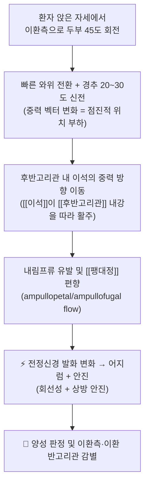
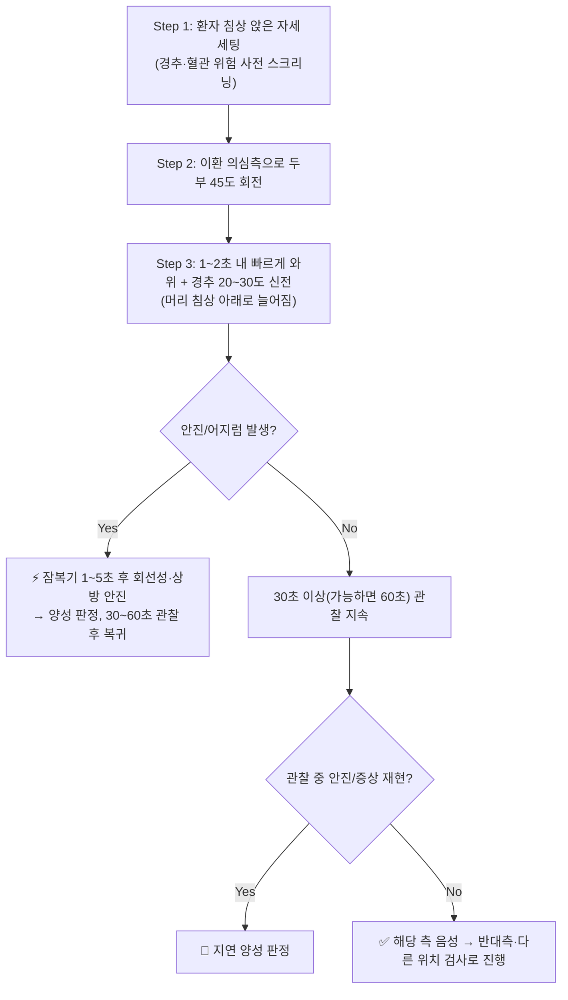

# 🩺 딕스-홀파이크 검사 (Dix-Hallpike Test / 頭位誘發眼振檢查, DH)

> **핵심 3줄 요약 (Key Summary)**:
> 🎯 [[후반고리관]](posterior semicircular canal, PSC) [[이석증 (BPPV)]]을 진단하는 대표적 **위치 유발 검사**다. 난형낭에서 이탈한 이석이 후반고리관 내강을 따라 이동하며 [[팽대정]](cupula)을 편향시켜 안진을 유발한다.
> 🔍 환자를 앉힌 뒤 검사측으로 머리를 45° 회전하고, 1~2초 내 빠르게 눕혀 경추를 20~30° 신전시킨다. 잠복기 1~5초 후 **상방(upbeating) + 회선성(torsional) 안진**이 나타나고 60초 이내 소멸하며 피로현상을 보이면 양성이다.
> 📊 양성 소견은 후반고리관 BPPV에 대해 **사실상 확진적(Rule-In)** 이며, 양성이면 즉시 [[이석정복술]]로 연결한다. 다만 음성이라고 중추성 어지럼을 배제할 수는 없다.
> ⚠️ 경추 불안정·급성 경추 골절·최근 경추 수술·추골기저동맥 부전에서는 주의 또는 금기다. 잠복기 없이 지속적·비피로성·방향전환성 안진이면 중추성 병변을 감별해야 한다.

---

## 1. 개요 및 검사 목적 (Overview)

* **검사명**: 딕스-홀파이크 검사 (Dix-Hallpike Test / Dix-Hallpike Maneuver / 頭位誘發眼振檢查)
* **목적**: 두위 변화로 유발되는 회전성 어지럼([[두위현훈]])의 원인을 감별하는 **위치 유발(positional/positioning) 검사**다. 가장 흔한 표적은 [[후반고리관]] 이석증으로, 전체 BPPV의 85~95%를 차지한다. 이석(otoconia)이 난형낭(utricle)에서 이탈해 후반고리관 내강 또는 팽대정에 위치할 때 양성이 나타난다.
* **타겟 구조물**:
  * 감각기: [[후반고리관]](Posterior semicircular canal), [[팽대정]](Cupula), [[난형낭]](Utricle)
  * 신경: [[전정신경]](Vestibular nerve), [[안구운동계]]
  * 이석: [[이석]](Otoconia)

![[딕스-홀파이크 검사_1.jpg|520]]
> [그림 1: 골미로(bony labyrinth) 해부 구조 — 후반고리관과 팽대부, 난형낭의 위치 관계]

| 항목 | 상세 내용 |
| :--- | :--- |
| **검사명 (Test Name)** | Dix-Hallpike Test / Dix-Hallpike Maneuver (딕스-홀파이크 검사, 頭位誘發眼振檢查) |
| **분류 (Category)** | 신경학적 유발 검사 → 위치 유발(positional/positioning) 검사, 전정기능 검사 |
| **타겟 병소 (Target)** | [[후반고리관]] (PSC), [[팽대정]], [[난형낭]]에서 이탈한 [[이석]], 말초 [[전정신경]] 및 [[안구운동계]] |
| **의심 질환 (Suspected Pathologies)** | [[이석증 (BPPV)]] (후반고리관 BPPV — canalolithiasis / cupulolithiasis), [[수평반고리관 이석증]], (드물게) [[전반고리관 이석증]]. 감별: [[중추성 두위현훈]], [[전정신경염]], [[메니에르병]], [[기립성 저혈압]], [[경추성 어지럼]] |
| **진단 정확도 (Diagnostic Accuracy)** | • **민감도**: 문헌 수치 미제시 — **근거 미확인** (선별보다 유발·확진 목적) • **특이도**: 문헌 수치 미제시 — **근거 미확인** • **양성 우도비(LR+)**: **근거 미확인** • 정성 평가: 양성 시 후반고리관 BPPV에 **Rule-In 가치 높음**, 음성 시 중추성 배제 불가 |
| **시연 영상 (Video Guide)** | [🎥 Physiotutors — Dix Hallpike Test / Posterior BPPV](https://youtu.be/7wMvTUPaNPo) |

### 진단 목적 상세

Dix-Hallpike 검사는 고개를 특정 방향으로 돌리고 눕혔을 때 어지럼이 재현되는지 확인하는 유발 검사로, 임상적으로 두 가지 목적을 가진다.

1. **BPPV의 확진**: 후반고리관 이석증에서 전형적인 회선성·상방 안진이 유발되면 진단적 가치가 매우 높다. 진료지침에서도 두위 변화로 유발되는 어지럼과 함께 이환측으로 향하는 회선성·상방 안진이 재현될 때 후반고리관 BPPV로 진단하도록 제시한다(Bhattacharyya 등, 2017; PMID: 28248609).
2. **급성 어지럼 환자의 감별 보조**: 응급실에서 어지럼을 호소하는 환자에서 유발성 발작성 전정증후군(t-EVS)이 의심될 때 위치 유발 검사를 시행하도록 권고된다. 어지럼의 양상만으로 진단하지 말고 유발 여부·안진·[[HINTS 검사]] 등을 체계적으로 활용해야 한다(Edlow & Carpenter, 2023; PMID: 37166022).

---

## 2. 해부학적 유발 메커니즘 (Biomechanics)

### 1) 해부학적 스트레스 전달 경로

* **중력 의존성 내림프 이동**: Dix-Hallpike 자세는 후반고리관의 공간적 방향을 중력에 대해 거의 수직으로 재정렬시킨다. 이때 관 내강에 유리되어 있던 이석 덩어리가 중력을 따라 가장 낮은 지점(팽대부 쪽)으로 활주하면서 내림프(endolymph)를 밀어낸다(Imai & Inohara, 2022; PMID: 35387740).
* **팽대정 편향과 신경 발화**: 내림프류는 팽대부 감각상피인 팽대정을 편향시키고, 이 기계적 변형이 후반고리관 팽대신경의 발화율을 변화시켜(흥분 또는 억제) 전정안구반사(VOR)를 통해 안구를 움직인다.
* **canalolithiasis 대 cupulolithiasis**: 이석이 관 내강을 자유롭게 이동하면 자세 변화 후 잠복기 → 안진 → 소멸 → 피로의 전형적 4단계 패턴이 나타난다. 이석이 팽대정에 부착된 경우에는 잠복기가 짧고 지속시간이 길며 피로가 덜한 양상을 보인다(세부 수치는 **근거 미확인**).

### 2) 증상 유발의 신경생리학적 기전

* 안진은 전정안구반사(VOR)의 직접적 출력이다. 후반고리관이 흥분하면 안구는 반대 방향으로 느리게 움직이고(서상), 중추가 이를 보상하기 위해 빠른 성분(속상)이 발생하여 **회선성 + 상방 안진**의 형태로 관찰된다.
* 잠복기(통상 1~5초)는 이석 덩어리가 관 내에서 실제로 이동을 시작하는 데 걸리는 시간에 기인하며, 피로현상은 이석이 관의 최저점에 도달해 더 이상 흐름을 만들지 못하는 기계적 소진으로 설명된다.
* 어지럼과 함께 오심·구역, 자율신경 증상(식은땀, 창백)이 동반될 수 있으며, 이는 전정 자율신경 반사의 항진에 의한 것이다.

---

## 3. 검사 시행 절차 (Step-by-Step Clinical Protocol)

### Step 0: 사전 평가 및 금기 확인 (Pre-Test Screening)

* 경추 불안정·급성 골절·후종인대 골화·최근 경추 수술력, 중증 경추증, 혈관성 고위험(추골기저동맥 부전, 경동맥 협착, 척추동맥 박리 병력), 조절되지 않는 심부전·중증 호흡기 질환, 임신 말기 등 **두부 저위 자세 유지 및 경추 신전이 위험한 조건**을 확인한다(Talmud & Coffey, 2023; PMID: 29083696).
* 환자에게 검사 중 나타날 수 있는 어지럼·오심을 미리 설명하고, 검사 중 보호를 위해 검사자가 항상 두부를 지지한다.

### Step 1: 환자 준비 및 초기 자세 (Starting Position)

![[딕스-홀파이크 검사_2.jpg|520]]
> [그림 2: Step 1 — 환자를 검사대 끝에 앉히고 검사자가 뒤에서 양손으로 두정·후두부를 안정적으로 지지한 시작 자세 (Physiotutors 시연)]

* 환자는 등받이가 있는 검사대 또는 베드 끝단에 앉힌다. 검사대를 사용하면 눕힐 때 머리가 베드 아래로 늘어질 공간이 확보된다.
* 검사자는 환자의 뒤쪽(또는 측방)에 서서 양손으로 환자의 두부(양측 두정·후두부)를 안정적으로 잡는다.

### Step 2: 두부 회전 (Head Rotation)

* 환자의 머리를 검사할 쪽(이환 의심측)으로 45° 회전시킨다. 이때 목을 과도하게 굴곡시키지 말고 중립~약간 신전 상태를 유지한다.
* 회전 각도가 부족하면 후반고리관이 중력 방향으로 제대로 정렬되지 않아 위음성이 생길 수 있다.

### Step 3: 와위 전환 + 경추 신전 (Rapid Supine Positioning with Extension)

![[딕스-홀파이크 검사_3.jpg|520]]
> [그림 3: Step 3 — 두부 회전을 유지한 채 1~2초 내에 신속히 눕혀, 머리가 침상 끝 아래로 늘어지도록 경추를 신전시킨 유발 자세. 검사자가 두부를 끝까지 지지한다 (Physiotutors 시연)]

* 회전을 유지한 채 1~2초 이내에 신속히 환자를 눕히고, 머리가 침상 끝 아래로 20~30° 정도 늘어지도록(경추 신전) 위치시킨다.
* 이 단계가 검사의 핵심 유발 동작이며, 너무 느리게 진행하면 잠복기 판정이 흐려지고 위음성이 증가한다.

### Step 4: 관찰 및 판정 (Observation & Reading)

![[딕스-홀파이크 검사_4.jpg|520]]
> [그림 4: Step 4 — 안진 관찰. 시선고정은 안진을 감쇠시키므로 Frenzel 안경 또는 적외선 안진촬영(VOG)을 사용하면 회선성 안진 검출에 유리하다 (Physiotutors 시연)]

* 유발 자세에서 최소 30초, 가능하면 60초까지 안진의 유무·방향·잠복기·지속시간·피로도를 관찰한다.
* 환자는 눈을 뜨고 검사자의 이마(정면)를 응시하게 한다. 시선고정은 안진을 감쇠시키므로 Frenzel 안경 또는 VOG 사용이 가능하면 사용한다(장비 사용에 따른 정량적 이득은 **근거 미확인**).
* 양성 시 안진의 특성으로 이환측과 이환 반고리관을 추정한다(4장 참조).
* **즉시 중단 기준**: 극심한 구역·구토, 경추 통증, 시야 흐림, 신경학적 결손(복시, 구음장애, 편측 마비, 실조) 발생 시 즉시 중단하고 중추성 병변 평가로 전환한다.

### Step 5: 복귀 및 반대측 검사 (Recovery & Contralateral Test)

* 관찰 후 환자를 서서히 앉은 자세로 복귀시킨다. 이때 역방향(반전성) 안진이 짧게 나타날 수 있는데, 이는 병태생리와 부합하는 소견이다.
* 잠시 휴식(증상 소실 확인) 후 반대측에서도 동일하게 시행하여 좌·우를 비교한다.
* 양성으로 판정되면 곧바로 [[이석정복술]](Epley 등)로 연결할 수 있다(Bhattacharyya 등, 2017; PMID: 28248609).

---

## 4. 양성 반응 판정 기준 (Diagnostic Criteria)

* **진정한 양성 반응 (True Positive)**:
  * 두부를 눕히는 동작 후 잠복기(1~5초)가 있고, 회선성 + 상방 안진이 나타나며, 60초 이내(통상 20~40초)에 소멸하고, 반복 시 피로현상(안진 감소)을 보이며, 환자가 회전성 어지럼과 오심을 호소하는 경우.
  * 회선성 안진의 상극(superior pole)이 이환측(아래로 처진 귀) 방향으로 향하는 것이 후반고리관 BPPV의 전형이며, 이환측 판정의 근거가 된다.
* **음성 반응 (Negative)**:
  * 유발 자세에서 안진이 유발되지 않는 경우. 단순히 어지럽다는 주관적 호소만 있고 안진이 관찰되지 않으면 음성으로 취급하는 것이 원칙이다.
* **가양성 (False Positive) / 중추성 감별**:
  * 잠복기 없이 즉시, 지속적으로, 피로 없이 나타나는 안진 → 중추성 병변 시사.
  * 자세를 바꿀 때마다 안진 방향이 바뀌는 방향전환성(direction-changing) 안진 → 중추성(소뇌·뇌간) 병변 시사.
  * 하방 안진(downbeating) + 회선성 → 전반고리관 BPPV 또는 중추성 병변 감별 필요(드문 형태).
  * 순수 수평성 안진이 관찰되면 수평반고리관 이석증 또는 중추성 병변을 고려하여 [[앙와위 회전검사]](Supine Roll Test)로 전환한다.
  * 국소 경추 근육통·후관절 통증만 재현되는 경우는 BPPV 양성이 아니며, [[경추성 어지럼]]으로 감별한다.

| 이환 반고리관 | Dix-Hallpike 소견(안진 특성) | 잠복기/지속시간 | 이환측 판정 단서 |
| :--- | :--- | :--- | :--- |
| **후반고리관 (PSC, 가장 흔함)** | **상방(upbeating) + 회선성(torsional)**, 상극이 이환측(아래 귀) 방향 | 잠복기 1~5초 / 통상 20~40초 이내(60초 미만), 피로성 | 안진이 더 강하게 유발되는 측 = 이환측 |
| **수평반고리관 (HSC)** | Dix-Hallpike에서는 수평성 안진이 관찰될 수 있음(진단은 주로 앙와위 회전검사) | canalolithiasis: 지속시간 짧음 / cupulolithiasis: 지속성 | 앙와위 회전검사에서 지구성(geotropic) = 관 내 이석, 원지구성(ageotropic) = 팽대정 부착 |
| **전반고리관 (ASC, 드묾)** | **하방(downbeating) + 회선성** | 잠복기 짧고 지속적일 수 있음 | 중추성 안진과의 감별이 필수 |
| **중추성(소뇌·뇌간 등)** | 방향전환성, 순수 수직성(특히 downbeat), 잠복기 없음, 피로 없음, 지속성 | 지속적(수 분 이상) | 시선고정으로 억제되지 않음, 동반 신경학적 징후 |

> **감별 포인트**: Dix-Hallpike는 말초성 위치 유발 어지럼을 확인하는 검사이며, 양성 소견의 형태(회선성+상방)가 곧 해부학적 국소화 단서가 된다. 형태가 비전형적이면 반드시 중추성 병변(특히 소뇌경색, 소뇌출혈)을 배제해야 하며, 급성 지속성 어지럼에서는 [[HINTS 검사]]와 뇌영상 판단이 별도로 필요하다(Edlow & Carpenter, 2023; PMID: 37166022).

---

## 5. 연관 검사군 비교 (Differential Battery & Algorithm)

| 검사명 | 검사 수기 및 동작 | 병태생리적 원리 | 임상적 역할 (선별 vs 확진) |
| :--- | :--- | :--- | :--- |
| [[딕스-홀파이크 검사]] (본 검사) | 앉은 자세 → 이환측 45° 회전 → 빠른 와위 + 경추 20~30° 신전 → 30~60초 관찰 | 후반고리관 내 이석의 중력 이동 → 팽대정 편향 → 회선성·상방 안진 | 후반고리관 BPPV에 대한 확진적 유발 검사(Rule-In) |
| [[앙와위 회전검사]] (Supine Roll Test, Pagnini-McClure) | 앙와위에서 두부를 좌·우로 90° 회전 | 수평반고리관 내 이석 이동 → 수평성 안진 | 수평반고리관 BPPV 진단용(본 검사보다 우선) |
| [[HINTS 검사]] (Head Impulse, Nystagmus, Test of Skew) | 자발 안진 관찰 + 두부충동검사 + 편위검사 | 전정안구반사 이상 및 중추 안구운동 경로 병변 | 급성 전정증후군의 중추성 vs 말초성 감별(선별) |
| [[두부충동검사]] (Head Impulse Test) | 검사자가 두부를 빠르게 좌우로 회전 | 반고리관-안구 반사의 보상적 서상(saccade) 여부 | 말초 전정기능 저하 선별(민감도 높음) |
| [[이석정복술]] (Epley Canalith Repositioning) | 연속적 두위 변화로 이석을 난형낭으로 이동 | 이석의 해부학적 경로 재유도 | 치료적 검사 — 시행 후 증상 소실이 진단을 지지 |
| [[Fukuda stepping test]] / 보행 검사 | 제자리 걸음 시 회전 편향 관찰 | 전정 척수로 비대칭 | 만성·보상기 전정 기능 평가 보조 |

### 다단계 감별 알고리즘

1. **어지럼의 양상 분류**: 유발성(t-EVS, 두위 변화로 촉발) / 급성 지속성(a-EVS, 수일 지속) / 만성·진행성으로 먼저 구분한다(Edlow & Carpenter, 2023; PMID: 37166022).
2. **유발성이면 → Dix-Hallpike 우선 시행**. 양성(회선성·상방 안진, 잠복기+피로)이면 후반고리관 BPPV로 진단하고 즉시 이석정복술로 연결한다.
3. **수평성 안진이 관찰되면 → 앙와위 회전검사**로 반고리관을 재분류한다.
4. **비전형적 안진(방향전환성, 순수 수직, 지속성, 비피로성)** → 중추성 병변 의심, HINTS 검사 및 뇌영상 검토.
5. **Dix-Hallpike 음성이지만 어지럼이 지속** → [[기립성 저혈압]], [[전정신경염]], [[메니에르병]], [[경추성 어지럼]], 심인성 어지럼 등을 감별한다.

---

## 6. 양성 소견 시 한의 임상 연계 치료 전략 (Integrative Korean Medicine)

> 아래 내용은 한의 임상 응용(경험적 접근)이며, 제공된 PubMed 문헌은 침·약침·추나·한약의 효과를 직접 검증한 자료가 아니다. 근거 수준 표기는 별도로 확인해야 한다(**근거 미확인**).

### 1) 이석정복술 우선 원칙 (양·한방 공통)

* 후반고리관 BPPV로 진단되면 이석정복술(canalith repositioning procedure, Epley 등)이 일차 치료이며 진료지침에서도 권고된다(Bhattacharyya 등, 2017; PMID: 28248609). 한의원에서도 정복술을 먼저 시행한 뒤 잔여 어지럼·자율신경 증상에 대해 한의 치료를 병행하는 것이 안전하다.

### 2) 침구 및 전침 치료 (Acupuncture & EA)

* **주요 혈위**: 백회(GV20), 풍지(GB20), 내관(PC6 — 오심·구역 완화), 신문(HT7 — 불안 완화), 태충(LR3), 족삼리(ST36), 풍륭(ST40 — 담(痰) 제거), 완골(SI4).
* **전침**: 풍지–백회 또는 내관–족삼리 배합에 2~4Hz 저주파 전침을 15~20분간 통전하여 전정계 과흥분 완화 및 자율신경 안정을 도모한다(정량적 효과 크기는 **근거 미확인**).
* **이침·두침**: 이침의 평형감각 영역, 두침의 훈증초(眩暈區) 자극을 병용할 수 있다.

### 3) 약침 요법 (Pharmacopuncture)

* 풍지(GB20), 완골(SI4) 및 경항부 [[협척혈]] 부위에 [[신바로약침]] 또는 [[중성어혈약침]] 0.5~1.0cc씩 소량 주입하여 경항부 근긴장 완화 및 국소 혈류 개선을 도모한다(경험적 접근, **근거 미확인**).
* 두정부·후두하부의 지나친 자극은 어지럼을 악화시킬 수 있으므로 자침 깊이와 자극량을 낮게 설정한다.

### 4) 추나 치료 (Chuna Therapy)

* 급성 어지럼이 심한 시기에는 고속저진폭(HVLA) 경추 스러스트는 금기이다.
* 경추 관절가동추나 및 경항부 근막 이완 기법, 흉추·경추 감압 견인을 안전하게 적용하여 상위 경추 기능 장애와 근긴장을 완화한다.
* 후두하 근군([[후두하근]]) 이완 후 Dix-Hallpike를 재평가하면 양성이 소실되는 경우가 있어, 경추성 요인이 동반된 환자에서 진단적·치료적으로 유용하다.

### 5) 한약 치료 (Herbal Medicine) — 변증별 접근

| 변증 | 주요 증상 양상 | 대표 처방 (예시) |
| :--- | :--- | :--- |
| **痰飮眩暈(담음현훈)** | 회전성 어지럼, 오심·구토, 두중감, 설태 후니 | [[반하백출천마탕]], [[온담탕]], [[택사탕]], [[영계출감탕]] |
| **肝陽上亢(간양상항)** | 두통·이명, 안면 홍조, 분노 시 악화, 맥현 | [[천마구등음]], [[대정환]] |
| **氣血兩虛(기혈양허)** | 만성 어지럼, 심계, 피로, 안색 창백 | [[귀비탕]], [[십전대보탕]], [[보중익기탕]] |
| **腎精不足(신정부족)** | 만성·재발성 어지럼, 요슬산연, 이명 | [[육미지황환]], [[좌귀환]] |

* 급성기에는 담음·간양 위주로, 만성·재발기에는 기혈·신정 위주로 변증을 전환하며, 이석정복술 후 잔존하는 잔여 어지럼(residual dizziness) 관리에 한약·침 치료를 병용하는 전략이 현실적이다(임상적 접근, **근거 미확인**).

### 6) 생활 지도 및 재발 예방

* 급성기 1~2주간 급격한 두위 변화(고개 숙여 머리 감기, 침대에서 급격히 돌아눕기, 치과 치료 시 장시간 후방 경추 신전)를 피하도록 교육한다.
* 재발 시 자가 시행 가능한 Brandt-Daroff 습관화 운동을 교육할 수 있다(효과 크기는 **근거 미확인**).
* 낙상 위험이 높은 고령 환자에서는 보행 보조 및 환경 정리를 함께 지도한다.

---

## 7. 💡 진료실 핵심 필기 & 실전 임상 팁

* **사용자 원문 필기 (100% 보존)**:
  * (제공된 원문 필기 없음 — 실제 진료실 필기가 확보되면 이 위치에 원문 그대로 보존하고 아래 팁과 섞지 않는다.)

* **진료실 실전 노하우 & 안전 가이드**:
  1. **두부는 반드시 검사자가 끝까지 지지한다**: 와위 전환과 복귀 과정에서 환자가 놀라 움직이면 경추에 부하가 걸린다. 특히 고령 환자는 복귀 시 두부를 손으로 받치고 천천히 일으킨다.
  2. **시선고정을 제거하라**: 밝은 조명 아래에서 눈을 뜨고 정면을 응시하면 회선성 안진이 억제되어 위음성이 늘어난다. Frenzel 안경이 없으면 안진 관찰 직전에 눈을 감지 말고 검사자 이마를 보라고 지시하고, 회선성 성분은 각막윤부(limbus)의 혈관·홍채 패턴을 기준으로 관찰한다.
  3. **잠복기를 세라**: 자세를 잡은 뒤 최소 30초는 기다린다. 3초 만에 음성이라 판단하는 것이 가장 흔한 오류다.
  4. **양측 시행 원칙**: 한쪽만 검사하고 끝내면 반대측 이석증을 놓친다. 좌·우를 모두 검사해 안진 강도를 비교하여 이환측을 정한다.
  5. **검사가 곧 치료가 되는 경우**: 양성 판정 즉시 같은 자세를 유지한 채 Epley 정복술로 이어가면 환자 부담을 줄이고 진단-치료를 한 세션에 마무리할 수 있다.
  6. **중추성 적신호 5가지**: ① 잠복기 없음 ② 60초 이상 지속 ③ 피로 없음 ④ 방향전환성 ⑤ 순수 수직(특히 하방) 안진 — 하나라도 있으면 중추성 병변을 의심하고 즉시 상급 의뢰를 고려한다.
  7. **금기 스크리닝을 루틴화**: 진료실 벽에 경추 수술력 / 골절 / 추골기저동맥 부전 / 심부전 / 임신 후기 체크리스트를 붙여두고 시행 전 확인한다.
  8. **기록 항목 표준화**: (좌/우) × (안진 방향: 상방/수평/하방) × (회선성 상극 방향) × (잠복기 초) × (지속시간 초) × (피로 여부) × (동반 증상)을 차트 템플릿으로 고정하면 재평가와 정복술 효과 판정이 쉬워진다.

---

## 8. 출처 및 학술 참고 문헌 (References)

1. **Edlow JA, Carpenter C (2023)**. *Guidelines for reasonable and appropriate care in the emergency department 3 (GRACE-3): Acute dizziness and vertigo in the emergency department*. Acad Emerg Med. [https://pubmed.ncbi.nlm.nih.gov/37166022/](https://pubmed.ncbi.nlm.nih.gov/37166022/)
   - **[연구 요약]**: 응급실 급성 어지럼·현훈 환자의 평가와 처치 권고 지침. 어지럼을 증상 양상만으로 진단하지 않도록 하고, 유발성 발작성 전정증후군(t-EVS)에서는 위치 유발 검사(Dix-Hallpike 등)를 시행하도록 권고하며, 급성 지속성 전정증후군에서는 HINTS 등 중추성 감별 도구와 영상 판단 기준을 제시한다. 본 노트에서는 검사의 임상적 위치와 중추성 배제 필요성의 근거로 인용하였다.
2. **Talmud JD, Coffey R (2023)**. *Dix-Hallpike Maneuver*. StatPearls [Internet]. [https://pubmed.ncbi.nlm.nih.gov/29083696/](https://pubmed.ncbi.nlm.nih.gov/29083696/)
   - **[연구 요약]**: Dix-Hallpike 수기의 해부학적 배경, 단계별 시행법, 양성 안진의 해석, 금기 및 주의사항을 정리한 개요 문헌. 본 노트의 시행 절차(3장)와 금기 스크리닝(7장)의 근간으로 인용하였다.
3. **Bhattacharyya N, Gubbels SP, et al. (2017)**. *Clinical Practice Guideline: Benign Paroxysmal Positional Vertigo (Update)*. Otolaryngol Head Neck Surg. [https://pubmed.ncbi.nlm.nih.gov/28248609/](https://pubmed.ncbi.nlm.nih.gov/28248609/)
   - **[연구 요약]**: BPPV 진단·치료 진료지침(개정판). 두위 변화로 유발되는 어지럼과 함께 Dix-Hallpike로 유발된 회선성·상방 안진이 있을 때 후반고리관 BPPV로 진단하도록 제시하고, 후반고리관 BPPV에 대한 이석정복술 시행을 권고한다. 본 노트에서는 진단 기준(4장)과 치료 연결(6장)의 근거로 인용하였다.
4. **Imai T, Inohara H (2022)**. *Benign paroxysmal positional vertigo*. Auris Nasus Larynx. [https://pubmed.ncbi.nlm.nih.gov/35387740/](https://pubmed.ncbi.nlm.nih.gov/35387740/)
   - **[연구 요약]**: BPPV의 병태생리(채널로리시스·큐풀로리시스), 반고리관별 임상 양상, 진단 및 정복술 원리를 정리한 종설. 본 노트에서는 이석의 중력 의존성 이동 및 팽대정 편향 기전(2장)의 근거로 인용하였다.
5. **Physiotutors (2018)**. *Dix Hallpike Test / Posterior BPPV* [시연 영상]. [https://youtu.be/7wMvTUPaNPo](https://youtu.be/7wMvTUPaNPo)
   - **[연구 요약]**: 후반고리관 BPPV를 진단하기 위한 Dix-Hallpike 수기의 실제 시연 영상(4분 50초). 검사자의 손 위치, 두부 회전 각도, 와위 전환 속도, 안진 관찰 자세를 시각적으로 확인할 수 있어 본 노트의 시행 절차 그림 2~6의 출처로 사용하였다.

> **표기 원칙 안내**: 본 노트에서 민감도·특이도·양성 우도비 등 정량적 진단 정확도 수치와 한의 치료(침·약침·추나·한약)의 효과 크기는 제공된 문헌에서 확인되지 않아 근거 미확인으로 명시하였다. 추후 원저(진단 정확도 연구, 무작위 대조시험)를 확보하면 해당 항목을 갱신한다.

<!-- 보관 태그(1회용·링크오류, 필요시 복원): 두위현훈, 전정기능검사, 후반고리관 -->
