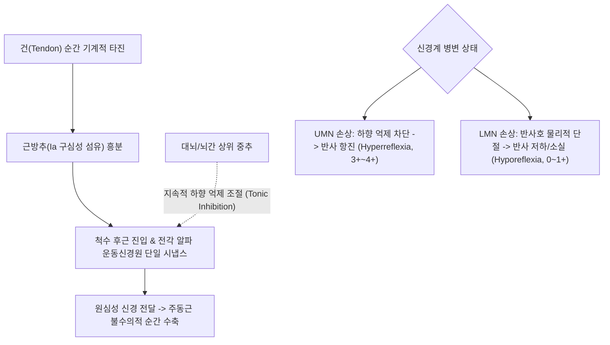

---
aliases:
  - "심부건 반사"
  - "심부건 반사 검사"
  - "DTR"
  - "Deep Tendon Reflex"
  - "신장 반사"
  - "Myotatic Reflex"
  - "DTR test"
  - "DTR 검사"
  - "Deep Tendon Reflex Test"
  - "건반사 검사"
  - "심부건 반사 실전 프로토콜"
tags:
  - 근골격계
  - 이학적검사
  - 신경계
created: "2024-01-31"
updated: "2026-09-15"
title: 심부건 반사
date: 2026-09-15
출처: "https://pubmed.ncbi.nlm.nih.gov/40524725/"
---

# 심부건 반사 (Deep Tendon Reflex, DTR)

> **핵심 3줄 요약 (Key Summary)**:
> 🎯 타진기(Reflex hammer)로 특정 근육의 건을 가볍게 두드려 근방추를 순간 신장시킴으로써 단일 시냅스 척수 반사호(Monosynaptic reflex arc)를 유발하는 신경계 필수 검사이다.
> 🚩 반사 반응의 강도는 0(소실), 1+(저하), 2+(정상), 3+(항진), 4+(간대성 경련 동반 현저한 항진)의 5단계 등급으로 분류하며, 개인차가 크므로 반드시 좌우 건측과 대조 비교해야 한다.
> 🔬 상위 운동신경원(UMN) 병변(뇌졸중, 척수증)에서는 억제성 조절 결여로 반사가 항진(Hyperreflexia)되고, 하위 운동신경원(LMN) 병변(신경근병증, 말초신경염)에서는 반사호 차단으로 저하 또는 소실(Hyporeflexia/Areflexia)된다.
> ⚠️ 환자가 긴장하여 반사가 유발되지 않을 때는 젠드라식 수기(Jendrassik maneuver, 손깍지 당기기)를 적용하여 대뇌의 억제를 일시적으로 분산시킨 후 재평가한다.

---

## 1. 개요 및 검사 목적

심부건 반사(Deep Tendon Reflex, DTR, 또는 신장 반사 / Myotatic Reflex)는 신경계 질환 및 척추 관절 질환의 위치 진단(Topical Diagnosis)에서 가장 객관적이고 재현성이 뛰어난 필수 이학적 검사법이다.

골격근의 건(Tendon)을 반사 망치(Percussion hammer)로 순간 타진할 때 발생하는 근육의 불수의적 수축 반응을 관찰함으로써, **감각 신경 섬유 $\rightarrow$ 후근 신경절 $\rightarrow$ 척수 전각 세포 $\rightarrow$ 전근 $\rightarrow$ 말초 운동신경 $\rightarrow$ 신경근 접합부 $\rightarrow$ 골격근**으로 이어지는 반사호(Reflex Arc)의 구조적 완전성을 신속하게 평가한다.

특히 경추증성 척수증(Cervical Myelopathy)이나 뇌경색과 같은 **상위 운동신경원(Upper Motor Neuron, UMN) 질환**과, 요추간판 탈출증(HIVD)이나 길랭-바레 증후군과 같은 **하위 운동신경원(Lower Motor Neuron, LMN) 질환**을 현장에서 1초 만에 감별하는 핵심 분수령이 된다.

![[dtr_overview_thumb.jpg|450]]
> **[도해] 심부건 반사(DTR) 종합 임상 검진**: 타진기를 이용한 상하지 주요 척수 분절별 건반사 유발과 반사호 신경 전달의 총괄적 평가.

---

## 2. 해부학 및 생체역학 기전

### 신경생리학적 메커니즘 (단일 시냅스 반사호)

1. **근방추(Muscle Spindle)의 자극**:
   - 건을 망치로 타진하면 근육 섬유가 순간적으로 기계적 신장(Quick stretch)을 받는다. 근복 내에 평행하게 위치한 근방추의 나선형 감각종말(Ia 구심성 신경섬유)이 이를 감지하여 활동전위를 발생시킨다.
2. **척수 단일 시냅스(Monosynaptic Connection)**:
   - 활동전위는 감각신경을 타고 척수 후근을 거쳐 해당 척수 분절로 들어간다. 척수 회백질 전각에서 개재신경(Interneuron)을 거치지 않고 직접 해당 근육을 지배하는 **알파 운동신경원(Alpha motor neuron)**과 단일 시냅스를 형성하여 흥분 신호를 전달한다.
3. **골격근의 즉각 수축 및 길항근 억제(Reciprocal Inhibition)**:
   - 알파 운동신경원을 통해 원심성 운동 신호가 방출되어 주동근이 즉각 수축하고 관절의 빠른 튐(Jerking motion)이 일어난다. 동시에 Ia 억제 개재신경을 통해 대항하는 길항근은 이완된다.
4. **상위 중추의 하행성 억제(Descending Inhibition)**:
   - 정상적인 상태에서 대뇌 피질-망상체척수로(Corticoreticulospinal tract)는 척수 반사호를 지속적으로 하향 억제(Tonic inhibition)하여 과도한 수축을 제어한다.
   - **UMN 병변**: 뇌 또는 경수 척수증으로 하행성 억제 경로가 차단되면 반사 억제가 풀리면서 병적으로 과도한 수축과 지속적인 간대성 경련(Clonus, 3+~4+)이 유발된다.
   - **LMN 병변**: 디스크 탈출증이나 말초신경염으로 구심성 감각신경 또는 원심성 운동신경 중 어느 한 곳이라도 단절되면 반사호 자체가 끊어져 반응이 약화되거나 완전히 소실(0~1+)된다.

### 상하지 주요 4대 심부건 반사 및 척수 분절

원문 임상 필기에 수록된 지표를 전면 융합한 핵심 척수 분절 매핑:

| 심부건 반사명 | 약칭 | 관여 근육군 | 담당 척수 분절 | 주요 말초 신경 | 정상 반응 |
| :--- | :--- | :--- | :--- | :--- | :--- |
| **상완이두근건 반사** | Biceps reflex | [[상완이두근]] | **C5, C6** (주로 C5) | 근피신경(Musculocutaneous) | 주관절 굴곡 및 전완 회외 |
| **상완요골근건 반사** | Brachioradialis | 상완요골근 | **C5, C6, C7** (주로 C6) | 요골신경(Radial nerve) | 전완 굴곡 및 중립위 약한 회외 |
| **상완삼두근건 반사** | Triceps reflex | [[상완삼두근]] | **C7, C8** (주로 C7) | 요골신경(Radial nerve) | 주관절 신전 |
| **슬개건 반사** | Patellar (Knee jerk) | [[대퇴사두근]] | **L3, L4** (주로 L4) | 대퇴신경(Femoral nerve) | 슬관절 신전 (하퇴 튐) |
| **아킬레스건 반사** | Achilles (Ankle jerk) | [[비복근]], [[가자미근]] | **S1, S2** (주로 S1) | 경골신경(Tibial nerve) | 족관절 족저굴곡 (발바닥 밀림) |

---

## 3. 검사 방법 및 절차

### 검사 전 준비
1. 환자의 해당 사지를 완전히 이완(Relaxation)시킨다. 근육이 조금이라도 수축하고 있으면 반사가 둔화된다.
2. 타진기(Reflex hammer)의 자루 끝을 가볍게 쥐고, 손목의 스냅(Wrist snap)을 이용하여 일정한 무게로 부드럽고 탄력 있게 타진한다.

![[Pasted image 20240131005818.png|300]]
> **[상지 타진] 상완이두근건 반사(C5-6)**: 검사자의 엄지를 환자의 이두근건 위에 얹고, 엄지 손톱 위를 타진하여 주관절 굴곡을 확인한다.

### 단계별 주요 반사 시행 절차

#### 1. 상완이두근건 반사 (Biceps Reflex, C5-C6)
- 환자의 주관절을 약 90도 굴곡시켜 전완을 검사자의 팔 위에 편안히 얹어둔다.
- 검사자의 엄지손가락을 주관절 전면 주와(Cubital fossa)의 이두근건 위에 견고하게 얹는다.
- 타진기로 검사자의 엄지손가락 손톱 부위를 경쾌하게 타진한다. 검사자 엄지 밑으로 건의 수축이 전해지며 환자의 주관절이 살짝 굴곡된다.

#### 2. 상완삼두근건 반사 (Triceps Reflex, C7-C8)
- **담당 척수 및 신경**: **C7, C8** (주로 C7, 요골신경 / Radial nerve)
- 환자의 상완을 90도 외전시키고 전완을 아래로 늘어뜨려 주관절이 완전히 이완되도록 검사자가 팔을 받쳐 든다.
- 주두(Olecranon, 팔꿈치 뼈 돌출부) 직상부 2~3cm 지점에 위치하는 [[상완삼두근]] 건을 직접 경쾌하게 타진한다.
- **정상 반응**: 삼두근이 수축하며 아래로 늘어져 있던 전완이 뒤쪽으로 툭 펴지는 주관절 신전이 나타난다.

![[Pasted image 20240131005829.png|320]]
> **[Step 2] 상완삼두근건 반사(Triceps Reflex, C7)**: 팔을 늘어뜨린 상태에서 주두 직상부 삼두근건을 타진하여 주관절 신전을 확인한다.

![[Pasted image 20240131005838.png|300]]
> **[하지 타진] 슬개건 반사(L3-4)**: 다리를 늘어뜨린 자세에서 슬개골 하단 슬개인대를 직접 타진하여 무릎 신전을 유도한다.

#### 3. 슬개건 반사 (Patellar Reflex, L3-L4)
- 환자를 진찰대 끝에 걸터앉게 하여 양다리가 바닥에 닿지 않고 공중에 자유롭게 늘어뜨려지도록 한다(또는 앙와위에서 검사자가 무릎 뒤를 받쳐 든다).
- 슬개골 바로 아래와 경골 조면 사이에 위치하는 슬개인대(Patellar tendon)의 중앙부를 타진기로 직접 가볍게 두드린다.
- 대퇴사두근이 수축하며 하퇴가 앞쪽으로 툭 튀어나가는 반응을 관찰한다.

#### 4. 아킬레스건 반사 (Achilles Reflex / Ankle Jerk, S1-S2)
- **담당 척수 및 신경**: **S1, S2** (주로 S1, 경골신경 / Tibial nerve)
- 환자를 앉히거나 무릎을 꿇게 한 상태에서, 검사자의 한 손으로 환자의 발바닥을 가볍게 밀어 **족관절을 중립위(약간의 배굴 상태)**로 유지하여 아킬레스건에 약한 기저 장력을 준다.
- 종골(발뒤꿈치 뼈) 상부 약 2~3cm 지점의 아킬레스건을 타진기로 가볍게 친다.
- **정상 반응**: [[비복근]]과 [[가자미근]]이 수축하며 검사자의 손바닥을 발바닥으로 밀어내는 족저굴곡(Plantar flexion)이 일어난다.

![[Pasted image 20240131005845.png|320]]
> **[Step 4] 아킬레스건 반사(Achilles Reflex, S1)**: 발바닥을 살짝 배굴시켜 건을 팽팽하게 만든 후 종골 상부 아킬레스건을 타진한다.

---

## 4. 양성 판정 기준 및 임상적 의의

### 심부건 반사 5단계 표준 등급 체계 (Grading System)

원문 기록: *"등급: 0 (소실) / 1 (저하) / 2 (정상) / 3 (항진) / 4 (현저한 항진)"*

| 등급 (Grade) | 임상 반응 상태 | 정량적 반응 특징 | 병태생리학적 임상 의미 |
| :---: | :--- | :--- | :--- |
| **0** | **소실 (Absent)** | 타진 시 근육 수축 및 관절 움직임 전혀 없음 | 반사호 완전 단절 (중증 말초신경염, 신경근 완전 압박) |
| **1+** | **저하 (Hypoactive)** | 미세한 근수축만 느껴지거나 관절 움직임 미약 | **하위 운동신경원(LMN) 질환**, 추간판 탈출증 신경근병증 |
| **2+** | **정상 (Normal)** | 적절한 관절 움직임을 동반하는 활기찬 수축 | 정상 생리 상태 |
| **3+** | **항진 (Hyperactive)** | 정상보다 크고 빠른 튐, 반사 영역 확대 | **상위 운동신경원(UMN) 의심**, 경추척수증 초기, 불안 |
| **4+** | **현저한 항진 (Clonus)** | **간대성 경련(Clonus)** 동반, 반복적 덜덜 떨림 | **확실한 UMN 병변 (피질척수로 완전 장애)**, 뇌졸중, 척수염 |

### UMN vs LMN 감별 매트릭스

| 감별 항목 | 상위 운동신경원 (UMN) 병변 | 하위 운동신경원 (LMN) 병변 |
| :--- | :--- | :--- |
| **대표 질환** | 뇌경색, 뇌출혈, 경추척수증, 다발성 경화증 | 요추/경추간판 탈출증, 수근관 증후군, 벨마비 |
| **심부건 반사(DTR)** | **병적 항진 (Grade 3+~4+), Clonus 동반** | **저하 또는 완전 소실 (Grade 0~1+)** |
| **병적 반사(Pathologic)** | [[바빈스키 검사]], [[호프만 징후]] 양성 출현 | 병적 반사 음성 |
| **근긴장도(Tone)** | 경직(Spasticity), 연수성 경직(Clasp-knife) | 이완(Flaccidity), 무긴장증 |
| **근위축(Atrophy)** | 불용성 위축(Disuse, 후기에 경미) | 신경인성 위축(Denervation, 조기에 심각) |

---

## 5. 감별 진단 및 유사 검사

| 검사명 | 반사 신경 경로 | 검사 자극 방식 | 감별 임상 영역 |
| :--- | :--- | :--- | :--- |
| **심부건 반사 (DTR)** | 단일 시냅스 신장 반사호 | 건(Tendon)의 기계적 타진 | 척수 분절 국소화 및 UMN/LMN 감별 |
| [[바빈스키 검사]] | 피질척수로 병적 원시 반사 | 발바닥 외측 피부 찰과 자극 | 성인에서 엄지발가락 배굴 시 **UMN 병변 확진** |
| [[호프만 징후]] | 경수 피질척수로 병적 반사 | 중지 손톱을 튕겨 순간 신전 유도 | 모지 및 시지 굴곡 시 **경추척수증 확진** |
| 표재 반사 (복벽 반사) | 다시냅스 표재 피부 반사 | 복부 피부를 핀으로 가볍게 긁음 | T7-T12 척수 병변 시 복벽 반사 소실 확인 |

### 척수 분절별 신경근 손상 감별 매트릭스

척추 질환 환자에서 DTR 결과와 근력, 감각 분절을 조합한 감별 공식:

| 신경근 레벨 | 호발 원인 질환 | 대표 심부건 반사(DTR) | 담당 주요 근육 및 근력 검사 | 고유 피부 감각 영역 |
| :---: | :--- | :--- | :--- | :--- |
| **C5** | C4-C5 추간판 탈출증 | **상완이두근건 반사 저하/소실** | [[삼각근]], 상완이두근 (어깨 외전) | 상완 외측 (견포 부위) |
| **C6** | C5-C6 추간판 탈출증 | 상완요골근건 반사 저하 | 수근 신전근 (손목 젖히기) | 전완 요측, 엄지·검지 손가락 |
| **C7** | C6-C7 추간판 탈출증 | **상완삼두근건 반사 저하/소실** | 상완삼두근, 수근 굴곡근 (손가락 펴기) | 중지(가운데 손가락) |
| **L4** | L3-L4 추간판 탈출증 | **슬개건 반사 저하/소실** | [[대퇴사두근]], [[전경골근]] (무릎 펴기) | 하퇴 내측, 족관절 내측 |
| **L5** | L4-L5 추간판 탈출증 | 고유 건반사 없음 (후경골근 가능) | 장무지신근 (엄지발가락 젖히기) | 하퇴 전외측, 발등 제1-2지 간 |
| **S1** | L5-S1 추간판 탈출증 | **아킬레스건 반사 저하/소실** | [[비복근]], [[가자미근]] (까치발 서기) | 발바닥, 발 외측연, 소지 |

---

## 6. 주의사항 및 위양성/위음성 요인

### ⚠️ 필수 대조 원칙 (Symmetry)
- 원문 강조 사항: *"정상적인 심부 건반사의 정도는 개인차가 심하므로 항상 양측을 비교해보는 것이 필수적."*
- 젊은 여성이나 마른 체형에서는 전신적으로 3+ 수준의 항진을 보이기도 하고, 고령자에서는 양측 아킬레스건 반사가 대칭적으로 1+ 저하되어 있는 경우가 흔하다. **진정한 병적 의미는 좌우 비대칭(Asymmetry)**에서 발생한다.

### 젠드라식 수기 (Jendrassik Maneuver) - 위음성 배제
- 환자가 긴장하여 반사가 전혀 나오지 않을 때(0 또는 1+), 다음과 같은 강화 기법을 적용한다:
  - **하지 검사 시**: 양손 손가락을 갈고리 모양으로 깍지 낀 채(Clasp hands), 검사자가 타진하는 순간 서로 반대 방향으로 힘껏 잡아당기도록 지시한다.
  - **상지 검사 시**: 어금니를 꽉 깨물거나 양 발목을 바닥에 세게 누르도록 지시한다.
  - 대뇌 피질의 억제 신호가 다른 곳으로 분산되어 억눌려 있던 척수 건반사가 정상적으로 활성화된다.

---

## 7. 진료실 핵심 임상 필기

### 💡 원장실 실전 노하우 & 진료실 체크리스트
- **원문 필기 100% 융합 및 실전 적용**:
  - 원문 기록: *"정상적인 심부 건반사의 정도는 개인차가 심하므로 항상 양측을 비교해보는 것이 필수적. 이두근: C5, 6 / 상완요골근: C5, 6, 7 / 삼두근: C7, 8 – 등급: 0 (소실) / 1 (저하) / 2 (정상) / 3 (항진) / 4 (현저한 항진). 상위 운동신경원 질환에서는 항진되고, 하위 운동신경원 질환에서 저하."*
  - **디스크 탈출증 레벨 즉시 감별 공식**:
    - 허리 디스크 의심 환자에서 **슬개건 반사 저하** $\rightarrow$ L3-L4 디스크(L4 신경근 압박).
    - **아킬레스건 반사 저하/소실** $\rightarrow$ L5-S1 디스크(S1 신경근 압박).
    - L4-L5 디스크(L5 신경근)는 고유한 건반사가 뚜렷하지 않으므로 후경골근건 반사를 보거나 족무지 신전 근력 저하로 평가.
  - **경추 척수증(Myelopathy)의 스텔스 징후**: 목 디스크인 줄 알고 내원했는데 상지 건반사는 저하되어 있고 오히려 하지 슬개건 반사가 4+로 덜덜 떨리며 튕겨나온다면(Inverted reflex / Hyperreflexia), 이는 단순 신경근병증이 아니라 경추 척수관이 좁아져 척수 실질이 눌리는 중증 경추척수증이므로 수술적 전원을 즉시 고려해야 한다.
- **타진기 잡는 법의 비밀 (Free Fall Strike)**: 망치를 손가락으로 꽉 쥐고 밀어치면 충격이 분산되어 반사가 안 나온다. 망치 자루 끝을 엄지와 검지로 느슨하게 쥐고, 망치 머리가 중력에 의해 자유낙하(Free fall)하듯 손목 스냅으로 툭 떨어뜨려야 근방추가 날카롭게 신장된다.
- **아킬레스건 반사 세팅 팁**: 발목을 너무 세게 위로 젖히면 건이 과긴장되어 반사가 억제된다. 발바닥에 손바닥을 대고 발목 무게만 살짝 받쳐주는 정도로 아주 부드러운 중립 텐션을 유지하는 것이 핵심이다.
- **젠드라식 수기 즉각 적용**: 무릎 반사가 안 나올 때는 환자에게 "양손 깍지 끼고 힘껏 당기세요!"(Jendrassik)라고 시키면서 치면 숨어있던 반사가 튀어나온다.

### 🗣️ 환자 티칭 & 설명 스크립트
> "환자분, 지금 고무망치로 무릎과 팔꿈치의 힘줄을 톡톡 두드려보았습니다. 이것은 뇌와 척수에서 다리로 내려가는 신경 신호의 반응 속도를 재는 검사입니다. 마치 전기 회로에 스위치를 켰을 때 전구가 즉시 켜져야 하듯, 힘줄을 치면 무릎이 부드럽게 튀어 올라야 정상입니다. 그런데 환자분의 오른쪽 무릎은 왼쪽과 비교했을 때 반사 반응이 현저히 떨어져 힘없이 축 처져 있습니다. 이것은 허리 4번 신경근 쪽이 디스크에 눌려 신경 신호의 흐름이 약해졌다는 뜻입니다. 다행히 뇌나 척수 줄기 자체의 문제는 아니므로, 눌려 있는 신경의 부종을 빼주는 약침 치료와 척추 공간을 넓혀주는 추나 견인 치료를 시행하면 신경 반사가 점차 회복될 수 있습니다."
>
> *(아킬레스건 반사 이상 시 설명 스크립트)* "환자분, 방금 팔꿈치와 무릎, 발뒤꿈치 힘줄을 차례대로 두드려보았습니다. 이것은 목과 허리에서 팔다리로 내려가는 신경 전선들이 각 마디별로 전기가 잘 통하고 있는지를 점검하는 '신경 전도 테스트'입니다. 검사 결과, 왼쪽 무릎과 발목은 아주 건강하게 반응하는데, 오른쪽 발뒤꿈치(아킬레스건) 쪽은 반사 반응이 뚝 떨어져 있습니다. 이것은 허리 5번과 꼬리뼈 사이(L5-S1)의 신경이 디스크에 눌려 전기가 약해졌다는 확실한 증거입니다. 손상된 신경 라인을 타겟으로 약침 치료와 감압 추나 치료를 병행하여 신경 흐름을 되살리겠습니다."

### 🌿 한의 임상 치료 연계 프로토콜
- **LMN 신경마비 및 반사 소실(0~1+) 한의 치료**:
  - **전침 치료(Electroacupuncture)**: 신경근 주행로의 협척혈 및 해당 근육 운동점(Motor point)에 저주파(2Hz) 연속파 전침을 걸어 축삭 재생 촉진.
  - **약침 치료**: 신경근 출구부(추간공 주변)에 중성어혈약침 또는 신바로약침을 주입하여 신경 압박 부종 해소.
- **방제 연계**:
  - 기혈허약 및 말초신경 마비: 황기계지오물탕(黃芪桂枝五物湯) 또는 오약순기산(烏藥順氣散).
  - 척수 신경 손상 후유증: 녹용 대보탕 가감방.

---

## 8. 참고문헌 및 학술 연구 (References)

1. **Assessing Diabetic Polyneuropathy Prevalence in Hospitalized Patients: A Comparative Study Using the Michigan Self-Report Questionnaire and Physical Examination Methods.**
   - 저자: EsnaAshari P, Mianehsaz E, Afarini M, et al.
   - 저널: *J Diabetes Res*. 2025;2025:8824156.
   - PMID: [40524725](https://pubmed.ncbi.nlm.nih.gov/40524725/) | DOI: [10.1155/jdr/8824156](https://doi.org/10.1155/jdr/8824156)
   - `[연구 요약]`: 당뇨병성 다발신경병증 및 말초신경 질환의 선별에서 심부건 반사(특히 아킬레스건 반사) 소실의 높은 진단적 민감도와 설문지 대비 객관적 신뢰성을 실증 분석함.

2. **Optimizing Physical Assessment in Intrathecal Baclofen Screening Trials for High-Performing Patients With Spastic Paraparesis.**
   - 저자: Kuroiwa R, Shibuya K, Nara T, et al.
   - 저널: *Neuromodulation*. 2025 Oct;28(7):1102-1110.
   - PMID: [39772339](https://pubmed.ncbi.nlm.nih.gov/39772339/) | DOI: [10.1016/j.neurom.2024.11.006](https://doi.org/10.1016/j.neurom.2024.11.006)
   - `[연구 요약]`: 척수성 경직 및 상위 운동신경원(UMN) 환자에서 심부건 반사 항진 등급(Clonus 포함)의 정량화 평가와 경직 완화 치료 효과 판정의 유효성을 검증함.

3. **Neurological Examination via Telemedicine: An Updated Review Focusing on Movement Disorders.**
   - 저자: Angelopoulou E, Koros C, Stanitsa E, et al.
   - 저널: *Medicina (Kaunas)*. 2024 Jun 9;60(6):951.
   - PMID: [38929575](https://pubmed.ncbi.nlm.nih.gov/38929575/) | DOI: [10.3390/medicina60060951](https://doi.org/10.3390/medicina60060951)
   - `[연구 요약]`: 신경학적 신체 검진에서 심부건 반사, 병적 반사, 젠드라식 수기 등의 임상적 가치와 관찰 표준화 지침을 최신 신경과 관점에서 체계적으로 정리함.

<!-- 보관 태그(1회용·링크오류, 필요시 복원): 반사검사, 척수분절, UMN, LMN -->
