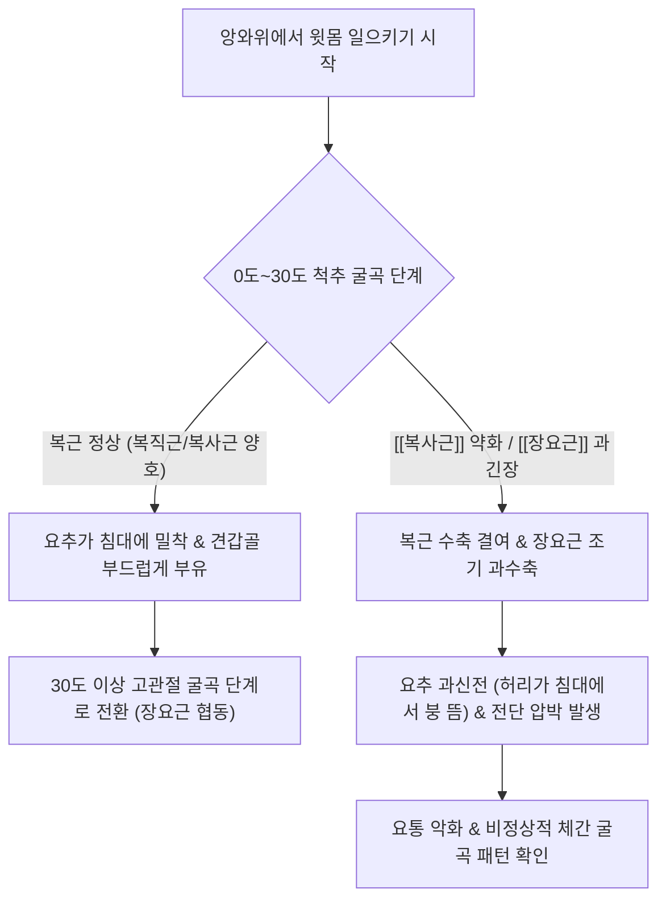

# 윗몸 일으키기 검사 (Trunk Flexion Test / 체간 굴곡근 도수근력 검사)

> **핵심 3줄 요약 (Key Summary)**:
> 🎯 앙와위에서 환자에게 상체를 굴곡하여 윗몸을 일으키게 하면서 복근군([[복직근]], [[복사근]])의 단계별 근력과 고관절 굴곡근([[장요근]])의 보상적 과활동을 평가하는 기능 검사이다.
> 🚩 윗몸을 일으킬 때 허리가 침대에서 붕 뜨며 요추 과전만(Lordosis)이 나타나는 현상은 복사근 약화와 장요근 단축·과긴장을 의미한다.
> 🔬 체간을 굴곡할 때 배꼽(Umbilicus)의 비정상적 편위가 관찰되면 흉수 신경근 병변([[비버 징후]])을 감별할 수 있다.
> ⚠️ 심한 요추간판 탈출증 환자는 무리하게 70도 이상 완전 거상을 시키면 디스크 내압이 급증하므로 견갑골 하각이 들리는 30도 컬업(Curl-up) 단계까지만 평가한다.

---

## 1. 개요 및 검사 목적

윗몸 일으키기 검사(Trunk Flexion Test, 또는 Kendall의 체간 굴곡 도수근력 검사 / Abdominal MMT)는 코어 근육의 핵심 축을 이루는 전벽 복근군([[복직근]], 외복사근, 내복사근, 복횡근)의 수축 능력과, 고관절 굴곡근인 [[장요근]](Iliopsoas) 및 [[대퇴직근]](Rectus femoris) 사이의 생체역학적 협동과 보상 패턴(Compensation Pattern)을 진단하기 위해 시행되는 이학적 검사법이다.

임상에서 만성 요통 환자의 상당수는 겉으로는 윗몸 일으키기를 수행하지만, 약화된 복근 대신 장요근을 과도하게 수축시켜 허리뼈를 앞으로 끌어당기는 치명적인 '기능이상 보상 운동(Faulty motor pattern)'을 사용한다. 본 검사는 이를 현장에서 정밀하게 감별하여 허리 손상의 원인을 찾아내고 운동 처방의 우선순위를 결정한다.

![[trunk_flexion_clinical_maneuver.jpg|450]]
> **[도해] 체간 굴곡 도수근력 검사(Trunk Flexion MMT)**: 환자가 상체를 컬업(Curl-up)하여 견갑골을 침대에서 들어 올릴 때 요추의 평평함 유지와 복근의 수축 상태를 관찰하고 있다.

---

## 2. 해부학 및 생체역학 기전

### 생체역학 메커니즘 (2단계 굴곡 역학)

인간이 누운 상태에서 윗몸을 일으키는 동작은 생체역학적으로 명확히 구분되는 **2개의 운동 단계(Two Phases)**로 진행된다:
1. **제1단계: 척추 굴곡 단계 (Curl-up Phase, 0° ~ 30°)**:
   - 동작 시작 시 흉곽을 치골 쪽으로 당겨 척추를 둥글게 굴곡시키는 단계이다.
   - **주동근: [[복직근]](Rectus abdominis)과 내·외[[복사근]](Obliques)이 강력하게 동심성 수축(Concentric contraction)한다.
   - **정상 생리**: 복근이 수축하면 요추가 평평해지며(Flattening) 침대 바닥에 빈틈없이 착 달라붙고, 견갑골 하각(Inferior angle of scapula)이 침대에서 떨어질 때까지 상체가 말려 올라간다.
2. **제2단계: 고관절 굴곡 단계 (Hip Flexion Phase, 30° ~ 70° 이상)**:
   - 견갑골이 완전히 뜬 이후 체간을 대퇴부 쪽으로 더 들어 올리는 단계이다.
   - **주동근의 전환: 복근은 더 이상 짧아지지 않고 체간의 형태를 유지하는 등척성 안정자(Isometric stabilizer)로 역할이 바뀌며, 실제 상체를 들어 올리는 주동력은 고관절 굴곡근인 [[장요근]]과 [[대퇴직근]]이 담당한다.
3. **병리적 장요근 보상 메커니즘 (Iliopsoas Dominance & Lumbar Shear)**:
   - 만약 [[복사근]]이나 복직근이 약화되어 있거나 장요근이 단축되어 있는 환자는 제1단계의 척추 굴곡을 만들지 못한다.
   - 환자는 동작이 시작되자마자 복근 대신 장요근을 무리하게 수축시킨다. 장요근의 기시부인 요추체 전외측이 전하방으로 강하게 당겨지면서 **허리가 침대에서 붕 뜨고 요추 전만이 심해지는(Lumbar Hyperextension / Anterior Pelvic Tilt) 이상 보상 패턴**이 나타난다. 이는 요추간판 후방과 후관절에 엄청난 전단 부하(Shear stress)를 가하여 요통을 급격히 악화시킨다.

### 검사 시 관여 조직 및 해부학적 구조

| 구조물 분류 | 관여 조직 및 명칭 | 윗몸 일으키기 검사 시 생체역학적 역할 |
| :--- | :--- | :--- |
| **제1단계 주동근** | [[복직근]], 외복사근, 내복사근 | 척추 굴곡, 골반 후방경사 지지, 요추 밀착 유지 |
| **제2단계 주동근** | [[장요근]], [[대퇴직근]], 봉공근 | 고관절을 굴곡시켜 체간 전체를 허벅지 쪽으로 회전 |
| **안정화 구조** | 복횡근, 흉요근막, 척추기립근 | 복압 형성 및 요추 분절의 안정성 제공 |
| **신경계 지배** | T7-T12 늑간신경, 요수 신경총(L1-L3) | 상부/하부 복근 및 장요근의 운동 신경 지배 |

---

## 3. 검사 방법 및 절차

### 검사 전 준비
1. 환자를 진찰대 위에 앙와위(Supine)로 눕힌다. 무릎을 약 90도 굽히고 발바닥을 침대에 평평하게 대도록 한다(Hook-lying posture). 무릎을 굽혀야 장요근의 기저 장력이 느슨해져 복근을 더 순수하게 평가할 수 있다.
2. 검사자는 환자의 허리 아래(요추 전만 부위)에 한 손의 손바닥을 부드럽게 밀어 넣어 둔다.

### 단계별 도수근력 등급(MMT) 평가 절차

- **Grade 5 (Normal, 정상)**:
  - 양손을 머리 뒤로 깍지 낀 상태에서, 허리로 검사자의 손을 바닥 쪽으로 단단히 누르면서 견갑골이 침대에서 완전히 떨어질 때까지 윗몸을 말아 올릴 수 있음.
- **Grade 4 (Good, 양호)**:
  - 양팔을 가슴 위에 교차하여 얹은 상태에서 요추의 뜨임 없이 견갑골을 들어 올림.
- **Grade 3 (Fair, 보통)**:
  - 원문 기록: *"팔을 앞으로 벌리고 윗몸을 일으키게 지도한다."*
  - 양팔을 앞으로 나란히 뻗은 상태에서 견갑골 하각이 뜰 때까지 윗몸을 일으킬 수 있음.
- **Grade 2 (Poor, 불량)**:
  - 팔을 앞으로 뻗었을 때 머리와 목만 들릴 뿐 견갑골 하각이 침대에서 떨어지지 못함. 기침 시에만 복근의 미약한 수축이 만져짐.
- **Grade 1 (Trace) / 0 (Zero)**:
  - 움직임은 전혀 없고 복벽의 미세한 수축선만 만져지거나(Grade 1), 수축이 전혀 없음(Grade 0).

---

## 4. 양성 판정 기준 및 임상적 의의

### 보상 패턴 및 이상 반응 판정

| 이상 반응 소견 | 병태생리 및 임상적 진단 | 조치 및 교정 방향 |
| :--- | :--- | :--- |
| **상체 거상 시 허리가 침대에서 붕 뜸** | [[복사근]] 약화 및 [[장요근]] 단축·과활동 | 고관절 굴곡근 억제, 복부 코어 심부 근육 강화 우선 |
| **상체를 올릴 때 배가 불룩하게 튀어나옴** | 복횡근 및 내복사근 기능부전 (복직근 우세) | 복압 조절 훈련 및 드로우인(Draw-in) 호흡 운동 |
| **배꼽이 위쪽(머리 쪽)으로 딸려 올라감** | [[비버 징후]](Beevor's Sign) 양성 | T10-T12 하부 복근 마비 의심 (흉수 병변 정밀 영상) |
| **상체 거상 시 요추의 극심한 통증 발생** | 요추간판 탈출증 급성기 (디스크 전단력 악화) | 윗몸 일으키기 중단, 중립 척추 플랭크/버드독 전환 |

---

## 5. 감별 진단 및 유사 검사

| 검사명 | 주 평가 대상 | 검사 동작 특성 | 감별 포인트 |
| :--- | :--- | :--- | :--- |
| **윗몸 일으키기 (Trunk Flexion)** | 복근군 근력 및 **장요근 보상 패턴** | 앙와위에서 상체를 둥글게 말아 거상 | 허리가 뜨는 보상 현상 및 복근-장요근 협동 평가 |
| [[밀그램 검사]] (Milgram) | 척수강 내압 및 복근-장요근 지구력 | 양다리를 5cm 들어 올려 30초 유지 | 상체가 아닌 **하지 거상 상태 유지 능력** 평가 |
| [[토마스 검사]] (Thomas) | [[장요근]], [[대퇴직근]] 고관절 굴곡근 단축 | 반대측 고관절 굴곡 시 검사측 대퇴 신전 상태 | 정적 상태에서 장요근의 절대적 길이 단축 측정 |
| 비버 징후 검사 | 흉수 T10 분절 신경학적 병변 | 부분적 윗몸 일으키기 시 배꼽 이동 관찰 | 흉수 종양, 근이영양증 등 신경학적 마비 선별 |

---

## 6. 주의사항 및 위양성/위음성 요인

### ⚠️ 요통 환자에게 전통적 윗몸 일으키기 금기
- 다리를 바닥에 고정하고 상체를 90도까지 완전히 일으키는 고전적 윗몸 일으키기(Sit-up)는 요추 추간판에 3,000N 이상의 엄청난 압박력과 굴곡 전단력을 부하하여 디스크 탈출증을 폭발적으로 악화시킨다.
- 진료실 검사에서는 반드시 **견갑골 하각만 들리는 30도 컬업(Curl-up)** 수준에서만 평가해야 한다.

---

## 7. 진료실 핵심 임상 필기

### 💡 원장실 실전 노하우 & 진료실 체크리스트
- **원문 필기 100% 융합 및 실전 적용**:
  - 원문 기록: *"환자를 누운 자세로 놓고, 몸통만을 구부리게 하여, 척추의 가동범위를 확인한다. 허리 굴곡 시에 허리 신전이 심하게 있는지 확인하여, [[장요근]]과 같은 고관절 굴곡근에 단축이 있는지 확인한다.(상지 거상에서 허리가 뜨는 것은 장요근 단축, 부하가 많이 걸리는 것을 의미한다.) 팔을 앞으로 벌리고 윗몸을 일으키게 지도한다. [[복사근]]이 약화되어 있으면 [[장요근]]을 사용하려고 하기에 문제로 이어질 수 있음([[복사근]] 약화 환자는 [[복사근]] 강화 운동부터)."*
  - **진료실 손바닥 감압 촉진법**: 환자의 허리 밑에 검사자의 손바닥을 넣고 "제 손을 허리로 꽉 누르면서 고개와 어깨를 살짝만 들어보세요"라고 지시한다.
    - 정상 환자는 상체를 들 때 허리가 손바닥을 더 강하게 꽉 누른다.
    - 장요근 보상 환자는 상체를 들자마자 허리가 손바닥에서 쑥 빠져나가며 손바닥 위로 터널이 뚫린다. 이 터널 현상이 나타나면 환자에게 즉시 거울이나 시각적 피드백을 주어 자신의 잘못된 허리 사용 습관을 인식시킨다.
  - **치료의 우선순위 설정**: 윗몸 일으키기 시 허리가 뜨는 환자에게 윗몸 일으키기를 운동 치료로 시키면 허리가 더 망가진다. 반드시 단축된 [[장요근]]을 약침과 스트레칭으로 먼저 풀고, 약화된 [[복사근]]과 복횡근을 활성화하는 교정 운동부터 단계적으로 처방해야 한다.

### 🗣️ 환자 티칭 & 설명 스크립트
> "환자분, 방금 누워서 상체를 살짝 들어보는 검사를 해보았습니다. 제 손이 환자분 허리 밑에 들어가 있었는데, 상체를 드는 순간 허리가 제 손을 누르지 못하고 위로 붕 떠버렸습니다. 이것은 뱃살 안쪽의 코어 근육인 [[복사근]]이 힘을 쓰지 못하고, 대신 다리와 허리를 연결하는 [[장요근]]이라는 큰 근육이 허리 뼈를 앞으로 강하게 잡아당겼기 때문입니다. 이렇게 허리가 붕 뜬 채로 허리를 구부리면 모든 체중과 충격이 허리 4-5번 디스크로 고스란히 쏠리게 됩니다. 평소에 윗몸 일으키기 운동을 하시면 허리가 더 아프셨던 이유가 바로 여기에 있습니다. 지금은 윗몸 일으키기를 절대 하시면 안 되며, 굳어 있는 장요근을 풀어주는 약침 치료와 허리를 바닥에 붙이는 기초 호흡 운동부터 시작하셔야 합니다."

### 🌿 한의 임상 치료 연계 프로토콜
- **장요근 과긴장 및 복근 불균형 침구 치료**:
  - **장요근 자침/약침 타겟**: 서혜부 충문(SP11), 기충(ST30) 주변 및 복부 황유(KI16), 천추(ST25) 심부 자침을 통해 긴장된 장요근을 이완.
  - **복사근 활성화 혈자리**: 대맥(GB26), 오추(GB27), 경문(GB25).
- **추나 요법 연계**:
  - **장요근 PIR(Post-Isometric Relaxation) 기법**: 토마스 검사 자세에서 고관절 신전 저항 수축 후 이완을 유도하여 장요근의 병적 단축을 해제.
- **운동 티칭 프로토콜**:
  - 복횡근 수축을 동반한 복부 드로우인(Abdominal Draw-in Maneuver).
  - 맥길의 컬업(McGill Curl-up): 한쪽 무릎은 세우고 다른 다리는 펴며, 양손을 허리 밑에 받쳐 허리 전만을 유지한 채 흉골만 3cm 드는 안전한 복근 운동 처방.

---

## 8. 참고문헌 및 학술 연구 (References)

1. **Charles E. Beevor's lasting contributions to neurology: More than just a sign.**
   - 저자: Pearce JM.
   - 저널: *Neurology*. 2018 Mar 13;90(11):517-520.
   - PMID: [29530958](https://pubmed.ncbi.nlm.nih.gov/29530958/) | DOI: [10.1212/WNL.0000000000005112](https://doi.org/10.1212/WNL.0000000000005112)
   - `[연구 요약]`: 윗몸 일으키기 체간 굴곡 시 상복부와 하복부 근육의 협동 운동 원리와, 하부 복근 마비 시 배꼽이 머리 쪽으로 편위되는 비버 징후의 신경학적 위치 진단 가치를 재조명함.

2. **Teaching video neuroimages: Beevor sign: when the umbilicus is pointing to neurologic disease.**
   - 저자: Eger K, Schmidt C.
   - 저널: *Neurology*. 2013 Jan 8;80(2):e14.
   - PMID: [23296136](https://pubmed.ncbi.nlm.nih.gov/23296136/) | DOI: [10.1212/WNL.0b013e31827b9148](https://doi.org/10.1212/WNL.0b013e31827b9148)
   - `[연구 요약]`: 부분적 윗몸 일으키기 동작에서 배꼽의 역동적 이동 패턴을 영상으로 기록하고, 흉수 신경근 및 안면견갑상완근이영양증(FSHD) 감별에서의 임상적 유용성을 보고함.

3. **Can Pre-Contraction of the Pelvic Floor Muscles Exceed Increases in Intra-Abdominal Pressure During Strength Exercises?**
   - 저자: Bø K, et al.
   - 저널: *Int Urogynecol J*. 2026 Jun.
   - PMID: [41762248](https://pubmed.ncbi.nlm.nih.gov/41762248/)
   - `[연구 요약]`: 체간 굴곡 및 컬업 운동 시 복압(Intra-abdominal pressure)의 상승과 복벽 근육군, 장요근, 골반저근 사이의 생체역학적 상호작용 및 요추 안정화 기전을 규명함.

<!-- 보관 태그(1회용·링크오류, 필요시 복원): 복근, 근력검사, Beevor징후 -->
