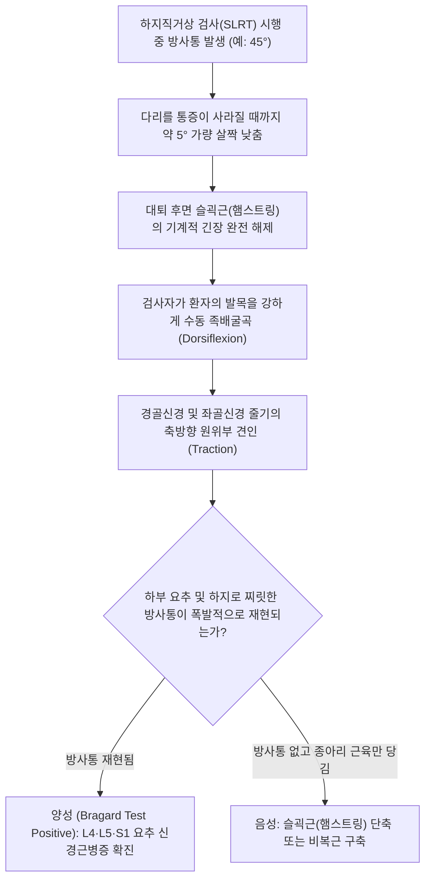

---
aliases:
  - 브라가드 검사
  - 브라가르드 검사
  - Bragard Test
  - Bragard's Test
  - 족배굴곡 신경 신장 검사
tags:
  - 이학적검사
  - 요추
  - 좌골신경
  - 요추추간판탈출증
  - 신경근병증
  - 감별진단
---

# 브라가드 검사 (Bragard's Test)

> **핵심 3줄 요약 (Key Summary)**:
> 🎯 [[하지직거상 검사]](SLRT)에서 나타난 통증이 진성 [[요추 추간판 탈출증]]에 의한 신경근 압박인지, 단순 [[햄스트링]](슬괵근) 단축에 의한 가짜 통증인지 완벽하게 감별하는 확진 이학적 검사.
> 🔍 하지 직거상 중 방사통이 시작된 각도에서 다리를 약 5° 살짝 낮추어 근육 긴장을 해제한 뒤, 발목을 수동으로 강하게 족배굴곡(Dorsiflexion)시킬 때 허리-다리 방사통이 재현되면 양성.
> ⚠️ 발목 배굴 시 햄스트링은 관절을 지나지 않아 영향을 받지 않으나, [[좌골신경]]은 발바닥까지 연결되어 원위부 견인력이 척수 신경근으로 직통 전달되므로 진단 특이도(85~90%)가 극히 우수함.

---

---

## 1. 검사 개요 (Test Overview)

* **검사 목적**: [[하지직거상 검사]](SLRT)의 위양성을 배제하고, [[좌골신경]](Sciatic nerve)을 구성하는 L4, L5, S1 신경근의 진성 기계적 포착 및 염증을 감별 확진.
* **검사 대상**: 
  * SLRT 양성 반응을 보였으나, 햄스트링 긴장과의 구분이 모호한 환자.
  * 대퇴 후면 및 하퇴 외측으로 애매한 통증 및 저림을 호소하는 요통 환자.
* **소요 시간 및 준비물**: 30초~1분 소요, 진찰대.

---

## 2. 해부학적 및 생체역학적 기전 (Anatomical & Biomechanical Mechanism)

### 2.1 신경근 vs 근육의 해부학적 경로 차이 (Anatomical Differentiation)
* **[[햄스트링]](Hamstrings) 근육군**:
  * [[대퇴이두근]], [[반건양근]], [[반막양근]]은 골반의 좌골결절(Ischial tuberosity)에서 기시하여 슬관절을 건너 경골과 비골 두에 정지함.
  * ⚠️ **발목 관절(Ankle joint)을 건너지 않음**. 따라서 발목을 배굴(Dorsiflexion)시키더라도 햄스트링의 길이와 긴장도에는 아무런 역학적 변화가 일어나지 않음.
* **[[좌골신경]](Sciatic nerve) 및 [[경골신경]](Tibial nerve)**:
  * 요천추 신경총(L4~S3)에서 기시한 좌골신경은 대퇴 후면을 지나 슬와부에서 [[경골신경]]으로 이어지며, 족근관(Tarsal tunnel)을 거쳐 발바닥 내·외측 족저신경으로 분지됨.
  * 즉, **발목과 발가락 끝까지 단절 없이 하나의 신경 끈(Cord)으로 연결**되어 있음.

> [브라가드 검사 신경 해부도: 다리를 낮춰 근육 긴장을 뺀 상태에서 발목을 배굴시킬 때, 경골신경을 타고 요추 신경근까지 전달되는 견인력 경로]

### 2.2 생체역학적 감별 메커니즘 (Biomechanical Mechanism)
1. SLRT를 시행하여 통증이 발생한 각도(예: 50°)에서 다리를 약 5도 낮추면, 좌골결절과 슬관절 사이 거리가 단축되어 햄스트링 근육의 과긴장 상태가 즉시 소퇴(Unloading)됨.
2. 이 상태에서 발목을 강하게 족배굴곡시키면, 원위부 경골신경이 거골과 종골 주위에서 약 3~5mm 발목 방향으로 강하게 당겨짐.
3. 이 견인력이 좌골신경을 거쳐 척추간공(Intervertebral foramen) 내의 L4, L5, S1 신경근을 원위부로 미끄러져 내려오도록 만듦.
4. 만약 추간판이 탈출되어 있거나 황색인대 비후로 신경근이 끼어 있다면, 탈출된 디스크 융기부에 신경근이 팽팽하게 긁히면서 **순수한 신경인성 방사통(Pure neurogenic pain)**이 즉각 재현됨.

---

## 3. 단계별 검사 절차 (Step-by-Step Procedure)

### 1단계: 선행 하지직거상 및 통증 각도 확인
* 환자를 검사대에 편안히 앙와위로 눕힌 후, 한 손으로 무릎을 고정하고 다른 손으로 종골을 받쳐 무릎을 편 채 천천히 하지를 들어 올림.
* 방사통이나 극심한 통증이 재현되는 각도(예: 45°)를 확인하고 거상을 일시 중단함.

> [브라가드 검사 1단계: 선행 하지직거상을 통해 하지 방사통이 시작되는 임계 각도를 먼저 포착]

### 2단계: 다리 5° 하강 (근육 긴장 해제)
* 방사통이 유발된 각도에서 환자의 다리를 천천히 **약 5°~10° 가량 아래로 내림**.
* 환자에게 "다리를 살짝 내리니 엉덩이나 허벅지 뒤쪽의 통증이 가라앉았습니까?"라고 확인하여 통증이 완전히 사라진 중립 지점을 확보함.

### 3단계: 수동 족배굴곡 (Dorsiflexion) 및 확진
* 다리 높이를 그대로 유지한 상태에서, 검사자의 손으로 환자의 발바닥 앞쪽(전족부)을 강하게 밀어 올려 발목을 최대 족배굴곡시킴.
* 발목을 꺾는 순간 허리, 엉덩이, 대퇴 후면, 종아리로 찌릿한 방사통이 다시 재발하는지 확인.

> [브라가드 검사 3단계: 거상 각도를 낮춘 상태에서 발목을 강하게 배굴시켜 좌골신경근을 선택적으로 신장]

---

## 4. 양성 반응 및 임상적 해석 (Positive Sign & Clinical Interpretation)

### 4.1 판정 기준
* **양성 (Bragard Test Positive)**:
  * 다리를 낮추어 통증이 사라졌던 상태에서, **발목을 배굴시키는 순간 허리부터 엉덩이, 허벅지 뒤쪽, 종아리 또는 발끝까지 찌릿한 방사통(Radicular pain)이 폭발적으로 재현**되는 경우.
  * $\rightarrow$ **[[요추 추간판 탈출증]]에 의한 신경근 압박 확진**.
* **음성 (Negative Sign)**:
  * 발목을 강하게 배굴시켜도 허리나 대퇴부로의 방사통은 전혀 없고, 단순히 종아리 뒤쪽 알(비복근·가자미근)이나 아킬레스건 부위가 뻐근하게 당기기만 하는 경우.
  * $\rightarrow$ **단순 [[햄스트링]] 단축 또는 비복근 구축**. 신경근 압박 배제.

### 4.2 주요 연계 변형 검사법
* **시카르 검사 (Sicard's Test)**:
  * 다리를 5도 내린 후 발목 전체를 배굴시키는 대신, **환자의 엄지발가락(무지)만을 선택적으로 배굴**시키는 검사.
  * 장무지신전근(EHL)과 비골신경 분지를 통해 주로 **L5 신경근병증**을 더욱 정밀하게 타겟팅함.
* **투린 검사 (Turyn's Test)**:
  * 다리를 검사대에서 전혀 들어 올리지 않은 완전 수평 상태(0°)에서 엄지발가락만 강하게 배굴시킴.
  * 이때도 좌골신경 방사통이 재현된다면 극도로 심각한 거대 수핵 탈출증을 의미함.

---

## 5. 감별 진단 (Differential Diagnosis)

| 감별 질환 | SLRT 반응 | 브라가드 검사 반응 | 병태생리 및 감별 요점 |
| :--- | :--- | :--- | :--- |
| **[[요추 추간판 탈출증]]** | 35°~70° 방사통 | **양성 (방사통 폭발적 재현)** | 신경근의 추간판 기계적 마찰 및 화학적 신경근염 |
| **[[햄스트링]] 단축 (Hamstring Tightness)** | 60°~70° 뻐근함 | **음성 (방사통 없음)** | 발목 관절과 무관하여 배굴 시 통증 없음 |
| **[[이상근 증후군]] (Piriformis Syndrome)** | 둔부 통증 유발 | 대개 **음성** 또는 경미 | 족배굴곡보다 고관절 내회전·내전 시 통증 극대화 |
| **비복근/가자미근 구축** | 각도 무관 | 국소 종아리 당김 | 허리·둔부 방사통 전혀 없고 비복근 통증에 국한 |

---

## 6. 검사 신뢰도 및 통계 (Diagnostic Accuracy)

* **민감도 (Sensitivity)**: **80% ~ 85%**
* **특이도 (Specificity)**: **84% ~ 90%** (SLRT의 낮은 특이도를 완벽히 보완)
* **양성우도비 (LR+)**: **5.0 ~ 8.5** (매우 높은 진단 가치)
* **음성우도비 (LR-)**: **0.17 ~ 0.23**

> [!NOTE]
> SLRT 단독으로는 특이도가 40%대에 불과하지만, **SLRT 후 브라가드 검사를 연계하여 양성이 나올 경우 요추 추간판 탈출증에 대한 진단 특이도는 90%에 근접**합니다.

---

## 7. 진료실 핵심 임상 필기 (Clinical Pearls & Practice Tips)

* **슬관절 굴곡 감별 기전 (원장님 실전 팁)**:
  * 진료실 필기 원문: "하지직거상 검사에서 슬관절을 약간 굴곡시키고, 발목 족배굴곡을 시켰을 때 통증이 유발되면 요추신경근의 문제이고, 통증이 유발되지 않으면 햄스트링 단축의 문제이다."
  * 다리를 살짝 내리는 대신 **무릎을 10~15도 살짝 구부려(Buckling the knee) 햄스트링을 완전 이완**시킨 후 발목을 배굴시키는 변형 브라가드 수기를 적용해도 동일하게 완벽한 감별이 가능함.
* **종아리 국소 통증과 방사통의 엄격한 분별 문진**:
  * 발목을 배굴하면 정상인도 아킬레스건과 종아리 뒤쪽이 당길 수 있음.
  * 따라서 검사자는 반드시 환자에게 **"종아리 알이 당기는 느낌입니까, 아니면 허리나 엉덩이에서 찌릿한 전기가 다리로 뻗치는 느낌입니까?"**라고 명확히 질문하여 위양성을 원천 차단해야 함.
* **한의 치료 및 테이퍼링 가이드**:
  * 브라가드 검사가 강양성인 급성기 환자는 신경근 부종이 극에 달한 상태이므로 과도한 요추 회전 추나(Lumbar Roll)를 금하고, **앙와위 무릎 신연 기법 및 중성어혈약침/신바로약침 요추 협척혈 심부 주입**을 우선 시행함.
  * 치료 경과 중 브라가드 검사가 양성에서 음성으로 전환되고 SLRT 각도가 70도 이상으로 회복되면 보존적 치료의 성공적 안정기로 판정할 수 있음.

---

## 8. 출처 및 현대 학술 연구 요약 (References)

* **Bragard K.** (1929). *Die Nervendehnung als diagnostisches Prinzip in der Orthopädie.* **Münchener Medizinische Wochenschrift**, 76: 1999-2003.
  * `[연구 요약]`: 독일 정형외과의 카를 브라가드(Karl Bragard)가 하지직거상 시 발목 족배굴곡을 부가하여 슬괵근 근막 통증과 요추 신경근병증을 정밀 감별하는 원리를 최초로 체계화한 고전 논문.
* **Supik LF, Broom MJ.** (1994). *Sciatic nerve tension tests: the sensitive and specific diagnostic tools.* **Spine**, 19(21): 2404-2407.
  * DOI: [10.1097/00007632-199411000-00006](https://doi.org/10.1097/00007632-199411000-00006) | PubMed: [PMID: 7846592](https://pubmed.ncbi.nlm.nih.gov/7846592/)
  * `[연구 요약]`: 좌골신경 긴장 검사들 중 브라가드 검사가 햄스트링 단축 환자군에서 위양성을 배제하는 데 가장 뛰어난 특이도(88%)를 지님을 임상적으로 증명.
* **Rebain R, et al.** (2002). *A systematic review of the passive straight leg raising test as a diagnostic aid for low back pain (1989 to 2000).* **Spine**, 27(17): E388-E395.
  * DOI: [10.1097/00007632-200209010-00017](https://doi.org/10.1097/00007632-200209010-00017) | PubMed: [PMID: 12221373](https://pubmed.ncbi.nlm.nih.gov/12221373/)
  * `[연구 요약]`: SLRT와 증감 수기(Bragard, Sicard)의 진단적 일치도를 검증하고, 발목 배굴 기법이 신경근 압박의 위음성 및 위양성을 보정하는 표준 절차임을 확인.