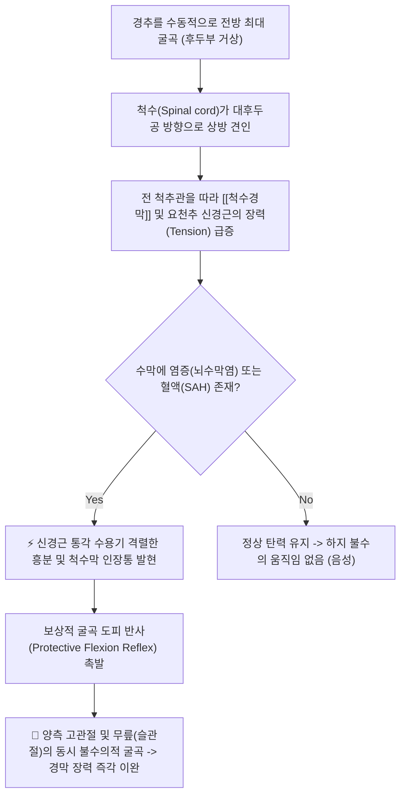
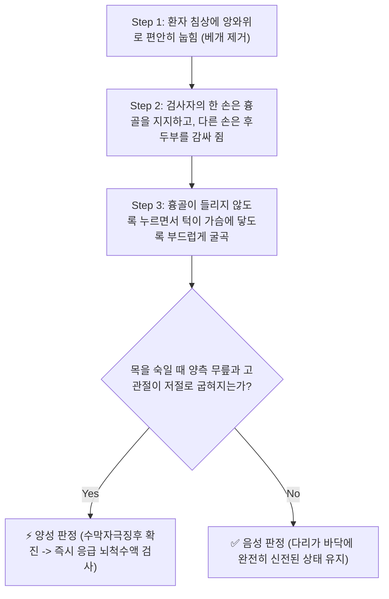

# 🩺 [[Brudzinski test]] (브루진스키 검사)

> **핵심 3줄 요약 (Key Summary)**:
> - 🎯 검사 목적 & 타겟 병소: 뇌수막염(Meningitis) 및 지주막하출혈(SAH) 환자에서 수막 자극 징후(Meningeal irritation sign) 선별, 염증에 의해 과감작된 [[뇌경막]], [[척수경막]] 및 척수 신경근의 신장 자극 평가.
> - 🔍 검사 시행 프로토콜 & 양성 반응: 앙와위 환자의 흉골을 한 손으로 지지하고 다른 손으로 후두부를 받쳐 경추를 수동 굴곡시킬 때, 척수막 인장통을 줄이기 위해 양측 고관절과 슬관절(무릎)이 불수의적으로 동시에 굴곡되면 양성 판정.
> - 📊 진단 정확도(민감도·특이도) & 임상적 의의: 민감도는 5~18%로 낮으나 특이도는 95~100%에 달하여, 양성 반응이 관찰되는 즉시 응급 뇌척수액(CSF) 검사 및 상급병원 전원이 필수적인 절대적 위험 징후임.
> - ⚠️ 위양성/위음성 요인 & 검사 금기: 경추 골절/탈구 의심자에서는 시행 절대 금기, 고령자나 면역저하자에서는 수막염이 있어도 징후가 나타나지 않는 위음성이 흔하므로 발열·두통 문진 필수.

---

## 📌 목차
1. [검사 기본 정보 & 진단 목적 (Diagnostic Overview)](#1-검사-기본-정보--진단-목적-diagnostic-overview)
2. [해부학적 유발 메커니즘 & 생체역학적 원리 (Biomechanical Mechanism)](#2-해부학적-유발-메커니즘--생체역학적-원리-biomechanical-mechanism)
3. [표준 검사 시행 절차 (Step-by-Step Clinical Protocol)](#3-표준-검사-시행-절차-step-by-step-clinical-protocol)
4. [양성 반응 판정 기준 & 수막 자극 징후 감별 맵핑 (Diagnostic Criteria & Mapping)](#4-양성-반응-판정-기준--수막-자극-징후-감별-맵핑-diagnostic-criteria--mapping)
5. [연관 검사군 비교 & 신경계 적신호 감별 알고리즘 (Differential Battery & Algorithm)](#5-연관-검사군-비교--신경계-적신호-감별-알고리즘-differential-battery--algorithm)
6. [양성 소견 시 한의 임상 응급 대처 및 진료 전략 (Emergency Protocol)](#6-양성-소견-시-한의-임상-응급-대처-및-진료-전략-emergency-protocol)
7. [💡 사용자 진료실 핵심 필기 & 실전 임상 팁 (원문 보존)](#7--사용자-진료실-핵심-필기--실전-임상-팁-원문-보존)
8. [출처 및 학술 참고 문헌 (References)](#8-출처-및-학술-참고-문헌-references)

---

## 1. 검사 기본 정보 & 진단 목적 (Diagnostic Overview)

![[브루진스키검사_1단계_경추수동굴곡_실사.png|450]]
> [그림 1: 앙와위 환자의 머리를 들어 올려 경추를 수동 굴곡시킬 때 경부 강직과 수막 인장통이 촉발되는 모습]

| 항목 | 상세 내용 |
| :--- | :--- |
| **검사명 (Test Name)** | 브루진스키 검사 (Brudzinski's Test / Brudzinski's Neck Sign, 경부 징후) |
| **분류 (Category)** | 신경학적 수막 자극 징후 유발 검사 / 뇌신경계 응급 선별 검사 |
| **타겟 병소 (Target)** | [[뇌경막]], [[척수경막]], [[지주막]], 척수 신경근(Spinal nerve roots), 척수관 |
| **의심 질환 (Suspected Pathologies)** | 세균성/바이러스성 뇌수막염(Meningitis), 지주막하출혈(SAH), 뇌막염증, 수막암종증 |
| **진단 정확도 (Diagnostic Accuracy)** | • **민감도 (Sensitivity)**: 5% ~ 18% (선별 도구 단독 사용 한계) • **특이도 (Specificity)**: 95% ~ 100% (양성 시 확진 가치 극대화) • **양성 우도비 (LR+)**: 3.5 ~ 15.0 이상 |
| **시연 영상 (Video Guide)** | [🎥 시연 영상: Brudzinski's Sign Demonstration](https://www.youtube.com/watch?v=QsXCXa_BhDw) |

---

## 2. 해부학적 유발 메커니즘 & 생체역학적 원리 (Biomechanical Mechanism)

### 1) 경수막-요수막 연속체의 종축 장력 역학 (Continuous Dural Tension)
* 뇌를 감싸고 있는 [[뇌경막]](Cranial dura)과 척수를 감싸고 있는 [[척수경막]](Spinal dura)은 대후두공(Foramen magnum)을 거쳐 천골(S2)까지 끊어지지 않고 단일한 원통형 낭(Dural sac)으로 연결되어 있습니다.
* 목을 앞으로 강하게 숙이면(경추 굴곡), 척수가 두개골 방향으로 당겨지면서 척추관 전체의 척수경막과 척수신경근(말총 포함)에 강력한 종축 신장력(Longitudinal traction)이 가해집니다.

### 2) 굴곡 도피 반사(Flexion Reflex)의 신경생리학
* 정상 상태에서는 수막 조직이 유연하게 늘어나므로 통증이나 반사적 움직임이 나타나지 않습니다.
* 그러나 세균성 감염이나 혈액 누출로 수막 전체에 염증이 번져 있으면, 경막이 1~2mm만 당겨져도 극심한 통각 신호가 척수 후각으로 쏟아져 들어옵니다.
* 중추신경계는 이 척수막 긴장을 긴급히 줄이기 위해 하지의 굴곡근 운동신경을 즉각 활성화시키는 **보상적 굴곡 도피 반사(Flexion withdrawal reflex)**를 가동합니다. 그 결과, 고관절과 무릎을 접음으로써 좌골신경과 척수경막의 긴장을 떨어뜨리려는 무조건 반사가 양측에서 일어납니다.

---

## 3. 표준 검사 시행 절차 (Step-by-Step Clinical Protocol)

### Step 1: 환자 준비 및 침상 정렬 (Starting Position)
* 환자를 침대에 똑바로 눕힙니다 (앙와위 Supine position).
* 베개를 반드시 빼서 경추가 중립 상태에 놓이도록 하고, 양다리는 무릎을 완전히 펴서 침대 바닥에 나란히 신전시킵니다.

### Step 2: 흉골 지지 및 경추 수동 굴곡 (Passive Neck Flexion Maneuver)
![[브루진스키검사_1단계_경추수동굴곡_실사.png|400]]
> [그림 2: 한 손으로 환자의 흉골을 지지하여 상체 들림을 방지하고, 다른 손으로 후두부를 받쳐 경추를 전방으로 숙이는 모습]

* 검사자는 환자의 옆에 서서, 한 손을 환자의 흉골(가슴 앞쪽) 위에 얹어 머리를 들어 올릴 때 상체 전체가 따라 올라오지 않도록 바닥 쪽으로 가볍게 누릅니다.
* 다른 한 손을 환자의 머리 뒤(후두부 Occiput)에 깊숙이 넣고 받쳐 듭니다.
* 환자의 턱이 흉골에 닿도록 부드럽지만 단호하게 목을 전방으로 수동 굴곡시킵니다.

### Step 3: 하지의 불수의적 굴곡 반응 관찰 (Involuntary Knee/Hip Flexion)
![[브루진스키검사_2단계_고관절슬관절_불수의굴곡_실사.png|400]]
> [그림 3: 목을 전방으로 굴곡시킴과 동시에 양측 무릎(슬관절)과 엉덩이(고관절)가 불수의적으로 접혀 올라오는 양성 반응]

* 목을 굽히는 동안 검사자는 환자의 하지(고관절과 무릎)를 예리하게 관찰합니다.
* 환자의 의지와 상관없이 **양측 무릎과 고관절이 반사적으로 굽혀지며 침대 위로 들어 올려지는 현상**이 나타나는지 확인합니다.

---

## 4. 양성 반응 판정 기준 & 수막 자극 징후 감별 맵핑 (Diagnostic Criteria & Mapping)

* **진정한 양성 반응 (True Positive - Brudzinski's Sign)**:
  * 목을 앞으로 굽히는 순간, **양측 고관절과 무릎이 불수의적으로 동시에 굴곡**되는 현상.
  * 환자가 목 뒤의 뻣뻣한 경부 강직(Nuchal rigidity)과 심한 두통을 동시에 호소하는 경우가 대부분입니다.
* **음성 반응 (Negative)**:
  * 턱이 가슴에 닿을 때까지 목을 완전히 굴곡시켜도 다리가 곧게 펴진 채 침대에 가만히 유지되는 경우.
* **가양성 및 국소 관절증 감별**:
  * 경추 추간판 탈출증, 후관절 증후군, 또는 경추부 근막통이 있는 환자는 목을 숙일 때 국소 목 통증을 호소할 수 있으나, **하지가 반사적으로 굽혀지는 현상은 절대 발생하지 않습니다**.

| 증상 및 징후 | 브루진스키 징후 양성 (뇌수막염/SAH) | 경추 신경근병증 ([[스펄링 검사]]) | 단순 경부 근막통증증후군 |
| :--- | :--- | :--- | :--- |
| **하지 무릎 굴곡** | **양측 무릎/고관절 불수의적 굴곡 (필수)** | 무릎 움직임 없음 | 무릎 움직임 없음 |
| **경부 굴곡 시 통증** | 척수 전체가 울리는 극심한 강직 및 두통 | 상지 신경 주행선 방사통 | 목 뒤 국소 근육 뻐근함 |
| **발열 및 전신 증상** | 고열(38°C 이상), 오한, 의식 저하, 광선공포증 | 발열 없음 | 발열 없음 |
| **Kernig 징후 동반** | 빈번하게 동반 양성 | 음성 | 음성 |

---

## 5. 연관 검사군 비교 & 신경계 적신호 감별 알고리즘 (Differential Battery & Algorithm)

| 검사명 | 검사 수기 및 동작 | 신경해부학적 기전 | 임상적 역할 (수막염 3대 검사) |
| :--- | :--- | :--- | :--- |
| [[Brudzinski test]] (본 검사) | 앙와위 경추 수동 굴곡 시 하지 굴곡 관찰 | 상부 경막 견인에 의한 하지 굴곡 반사 | 수막염/지주막하출혈 확진적 선별 (특이도 95%+) |
| **케르니히 검사 (Kernig's Test)** | 고관절 90° 굴곡 상태에서 슬관절 신전 시도 | 하부 요천추 신경근 및 경막 긴장 유발 | 슬관절 135° 이상 신전 불가 및 저항 시 양성 |
| **경부 강직 검사 (Nuchal Rigidity)** | 앙와위 턱을 흉골에 닿게 굴곡 시도 | 경부 신전근의 불수의적 강직성 경련 | 턱이 가슴에 닿지 않는 저항감 평가 |
| [[L'Hermittee sign]] | 경추 전방 굴곡 시 척추 전격통 유발 | 척수 후주(Dorsal column) 탈수초 자극 | 다발성 경화증 및 경추 척수증 감별 |

---

## 6. 양성 소견 시 한의 임상 응급 대처 및 진료 전략 (Emergency Protocol)

* **🚨 한의원 응급 전원 프로토콜 (Red Flag Action)**:
  * 브루진스키 검사 양성은 침구 치료나 추나 요법의 적응증이 절대 아니며, **생명을 위협하는 중추신경계 감염(세균성 뇌수막염) 또는 뇌출혈(지주막하출혈)의 절대적 응급 상황**입니다.
  * 즉시 119 구급대를 호출하여 상급종합병원 응급의료센터로 전원 조치해야 합니다.
  * 전원 전 활력징후(혈압, 맥박, 체온, 산소포화도)를 체크하고, 기도 확보 및 환자 의식 수준(GCS)을 지속 모니터링합니다.
* **절대적 금기 사항**:
  * 뇌압이 급격히 상승해 있을 수 있으므로 **경추 추나 스러스트(HVLA), 두경부 강한 도수 조작, 침습적 사혈 요법은 뇌탈출(Brain herniation)을 유발할 수 있어 절대 금기**입니다.

---

## 7. 💡 사용자 진료실 핵심 필기 & 실전 임상 팁 (원문 보존)

* **사용자 원문 필기 (100% 보존)**:
  * 바로 눕히고 환자의 머리를 들어올리듯 하고 흉골을 누르면서 경추를 굴곡시킴.
  * 검사 중에 환자가 무릎을 굽히면 양성 소견으로 뇌척수막 자극 증상으로 생각할 수 있음.
* **진료실 실전 노하우 & 감별 팁**:
  1. **흉골을 누르는 이유**: 머리를 들어 올릴 때 환자가 무의식적으로 어깨와 가슴을 침대에서 띄우며 경추 굴곡을 회피하려 합니다. 한 손으로 흉골을 단단히 눌러 상체를 침대에 고정해야만 척수경막에 순수한 굴곡 인장력이 정확히 걸려 다리가 튀어 올라오는 것을 확인할 수 있습니다.
  2. **골든타임 선별 팁**: 20~30대 젊은 환자가 "평생 처음 겪는 벼락 맞은 듯한 두통(Thunderclap headache)"을 호소하거나, 38도 이상의 고열과 함께 목이 굳어서 앞을 보지 못하고 빛을 눈부셔한다면(Photophobia), 침을 놓기 전에 반드시 브루진스키 검사를 1순위로 시행해야 합니다.
  3. **소아 환자에서의 민감도**: 소아 환자는 신경계 발달 특성상 성인보다 브루진스키 징후가 더욱 뚜렷하게 발현됩니다. 아이가 열이 나면서 고개를 숙일 때 무릎을 움찔거리며 접는다면 지체 없이 소아응급실로 안내하십시오.

---

## 8. 출처 및 학술 참고 문헌 (References)

1. **Thomas, K. E., Hasbun, R., Jekel, J., & Quagliarello, V. J. (2002)**. *The utility of Kernig's and Brudzinski's signs in the diagnosis of meningitis*. **Clinical Infectious Diseases**, 35(1), 46-52. [DOI: 10.1086/340979](https://doi.org/10.1086/340979)
   - **[연구 요약]**: 의심 성인 환자 297명을 전향적으로 분석하여 브루진스키 징후가 민감도는 5%로 낮으나 특이도는 95%에 달하여 양성 시 뇌수막염 확진에 결정적인 임상 도구임을 규명함.
2. **Brudzinski, J. (1909)**. *Un signe nouveau sur les membres inférieurs dans les méningites chez les enfants (signe de la nuque)*. **Archives de Médecine des Enfants**, 12, 745-752.
   - **[연구 요약]**: 소아 수막염 환자에서 경부 굴곡 시 양측 하지 고관절 및 슬관절이 불수의적으로 굴곡되는 목 반사 징후(Signe de la nuque)를 세계 최초로 기술함.
3. **Waghdhare, S., et al. (2010)**. *Accuracy of physical signs for detecting meningitis: a hospital-based diagnostic accuracy study*. **Clinical Neurology and Neurosurgery**, 112(9), 752-757. [PMID: 20627415](https://pubmed.ncbi.nlm.nih.gov/20627415/)
   - **[연구 요약]**: 병원 기반 환자군에서 브루진스키 징후, 케르니히 징후, 경부 강직의 진단 정확도를 비교하여, 브루진스키 검사가 수막 자극을 선별하는 데 가장 높은 특이도(100%)를 가짐을 보고함.