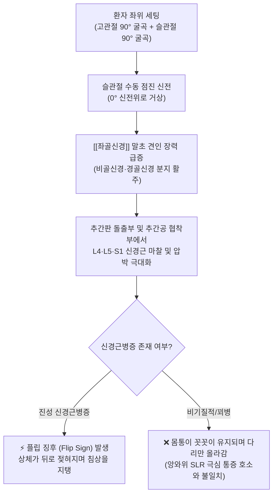
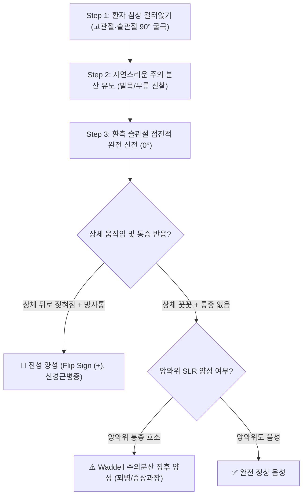

# 🩺 [[Flip test]] (플립 검사 / Seated Lasègue Test, 좌위 라세그 검사)

> **핵심 3줄 요약 (Key Summary)**:
> - 🎯 검사 목적 & 타겟 병소: 하부 요추 [[추간판 탈출증]](L4-L5, L5-S1) 및 [[척추관 협착증]]에 의한 [[좌골신경]] 및 요천추 신경근(L4, L5, S1) 기계적 압박 유발, 앙와위 [[SLR test]] 결과와의 일치도를 통한 기질적 신경병증 vs 비기질적 증상 과장(꾀병/Malingering) 감별.
> - 🔍 검사 시행 프로토콜 & 양성 반응: 환자를 침상 위에 걸터앉게 한 후 검사자가 슬관절을 점진적으로 신전시킬 때, 좌골신경 장력을 피하기 위해 상체가 뒤로 젖혀지며(Flip sign) 허리의 통증이나 하지의 방사통을 호소하면 양성.
> - 📊 진단 정확도(민감도·특이도) & 임상적 의의: 민감도(Sensitivity) 약 41~49%, 특이도(Specificity) 약 69~85%, 앙와위 [[SLR test]]에서 30° 미만 극심한 통증을 호소하던 환자가 좌위에서 무릎을 90° 완전히 펴도 몸통이 그대로 있고 통증이 없다면 Waddell 비기질적 징후 양성(증상 과장)으로 판정.
> - ⚠️ 위양성/위음성 요인 & 검사 금기: 슬괵근(Hamstrings) 단축 시 오금 당김을 방사통으로 오인하는 위양성 주의, 슬관절 굴곡 구축 또는 고관절 중증 관절염 시 검사 제한, 족관절 배굴(Bragard)을 부가하여 신경성 vs 근육성 감별 필수.

---

## 📌 목차
1. [검사 기본 정보 & 진단 목적 (Diagnostic Overview)](#1-검사-기본-정보--진단-목적-diagnostic-overview)
2. [해부학적 유발 메커니즘 & 생체역학적 원리 (Biomechanical Mechanism)](#2-해부학적-유발-메커니즘--생체역학적-원리-biomechanical-mechanism)
3. [표준 검사 시행 절차 (Step-by-Step Clinical Protocol)](#3-표준-검사-시행-절차-step-by-step-clinical-protocol)
4. [양성 반응 판정 기준 & 신경근/조직별 감별 맵핑 (Diagnostic Criteria & Mapping)](#4-양성-반응-판정-기준--신경근조직별-감별-맵핑-diagnostic-criteria--mapping)
5. [연관 검사군 비교 & 다단계 감별 알고리즘 (Differential Battery & Algorithm)](#5-연관-검사군-비교--다단계-감별-알고리즘-differential-battery--algorithm)
6. [양성 소견 시 한의 임상 연계 치료 전략 (Integrative Korean Medicine)](#6-양성-소견-시-한의-임상-연계-치료-전략-integrative-korean-medicine)
7. [💡 사용자 진료실 핵심 필기 & 실전 임상 팁 (원문 보존)](#7--사용자-진료실-핵심-필기--실전-임상-팁-원문-보존)
8. [출처 및 학술 참고 문헌 (References)](#8-출처-및-학술-참고-문헌-references)

---

## 1. 검사 기본 정보 & 진단 목적 (Diagnostic Overview)

![[좌위라세그_플립검사_1단계_좌위시작자세.jpg|450]]
> [그림 1: 플립 검사의 초기 자세 - 환자가 진찰대 가장자리에 고관절과 슬관절을 90° 굴곡하고 편안하게 걸터앉은 중립 착석 상태]

![[좌위라세그_좌골신경주행_병태해부도.jpg|450]]
> [그림 2: 좌골신경(Sciatic nerve)의 해부학적 경로와 슬관절 신전 시 요천추 신경근(L4~S1) 견인 장력 유발 기전 도해]

| 항목 | 상세 내용 |
| :--- | :--- |
| **검사명 (Test Name)** | Flip Test (플립 검사 / [[Seated Laseque test]], Seated Straight Leg Raise Test) |
| **이명 및 관련 징후** | 좌위 라세그 검사, 플립 징후(Flip sign), Waddell 주의분산 검사(Waddell Distraction Test) |
| **분류 (Category)** | 신경학적 긴장 유발 검사 (Neural Tension Test) & 비기질적 증상 감별 검사 (Nonorganic Malingering Test) |
| **타겟 병소 (Target)** | [[좌골신경]](Sciatic nerve), 요천추 신경근(L4, L5, S1), 척추 경막낭(Dural sac) |
| **의심 질환 (Suspected Pathologies)** | 하부 요추 [[추간판 탈출증]](LDH), [[척추관 협착증]], 요천추 신경근병증, 비기질적 요통(Malingering / Symptom magnification) |
| **진단 정확도 (Diagnostic Accuracy)** | • **민감도 (Sensitivity)**: 41% ~ 49% (단독 선별 가치는 앙와위 SLR보다 낮음) • **특이도 (Specificity)**: 69% ~ 85% (체간 후방 전도 동반 시 특이도 상승) • **Waddell 주의분산 일치도**: 앙와위와 30° 이상 불일치 시 꾀병 특이도 90% 이상 |
| **시연 영상 (Video Guide)** | [🎥 시연 영상: Clinically Relevant - Flip Test](https://www.youtube.com/watch?v=EWjMWJ6WFdM) |

---

## 2. 해부학적 유발 메커니즘 & 생체역학적 원리 (Biomechanical Mechanism)

### 1) 해부학적 스트레스 전달 경로
* 환자가 침상 위에 걸터앉아 고관절을 90° 굴곡한 상태에서는 대퇴 후면의 [[좌골신경]]이 이미 상당한 기초 장력을 받고 있습니다.
* 이 상태에서 검사자가 슬관절을 신전시키면, 하퇴와 족관절로 주행하던 신경 분지들이 원위부로 당겨지며 좌골신경 간 전체에 최대 견인력이 전달됩니다.
* 이때 탈출된 요추 추간판이나 비후된 황색인대가 신경근을 압박하고 있다면 극심한 신경초 허혈과 전격성 방사통이 유발됩니다.

### 2) 상체 후방 도피(Flip Reaction)의 생체역학
* 슬관절 신전에 따른 좌골신경의 팽팽한 견인 장력을 완화하기 위해 인체는 반사적으로 고관절 굴곡 각도를 줄여야만 합니다.
* 따라서 환자는 통증을 회피하기 위해 상체를 뒤로 젖히며(Trunk extension), 넘어지지 않기 위해 침상 위를 양손으로 짚는 **플립 징후(Flip sign)**를 무의식적으로 나타냅니다.
* 만약 앙와위 [[SLR test]]에서 극심한 통증을 호소했던 환자가 좌위에서 무릎을 완전히 펴도 상체를 젖히지 않고 몸통을 꼿꼿이 유지한다면, 이는 신경학적 병변이 아닌 꾀병(Malingering) 또는 비기질적 증상 과장으로 판단할 수 있습니다.

---

## 3. 표준 검사 시행 절차 (Step-by-Step Clinical Protocol)

### Step 1: 환자 준비 및 초기 자세 (Starting Position)
* 환자를 침상 위에 걸터앉게 한 후 다리를 아래로 자연스럽게 늘어뜨리도록 합니다.
* 고관절과 슬관절은 각각 90° 굴곡된 중립 착석 상태를 유지합니다.

### Step 2: 주의 분산 유도 (Distraction Technique)
* 💡 **실전 노하우**: 허리 신경 검사라는 것을 환자가 의식하지 못하도록 발목이나 반사 검사를 하는 척하며 주의를 분산시킵니다.

### Step 3: 슬관절 신전 기동 (Knee Extension)
![[좌위라세그_플립검사_2단계_슬관절신전_플립반응_실사.jpg|500]]
> [그림 3: 2단계 슬관절 신전 시 상체가 반사적으로 뒤로 젖혀지며 두 손으로 침상을 짚는 전형적인 플립 검사 양성 반응]

* 검사자는 환자의 발목을 잡고 슬관절을 점진적으로 0° 완전 신전 방향으로 들어 올립니다.

### Step 4: 체간 도피 동작 및 방사통 평가 (Evaluation of Flip Reaction)
![[플립검사_신경병증_체간후방도피_도해.jpg|450]]
> [그림 4: 플립 검사의 양성 기전 도해 - 슬관절 신전에 따른 좌골신경 장력 증가에 대항하여 체간이 뒤로 젖혀지는 회피 반응]

* **진성 신경근병증**: 상체가 뒤로 젖혀지면서(Flip) 허리의 통증이나 하지의 방사통을 호소하고 양손으로 침상을 지지합니다.
* **비기질적/꾀병 환자**: 앙와위 [[SLR test]]에서 30° 이하로 제한을 호소했음에도 불구하고, 좌위에서는 무릎이 완전히 펴져도 상체를 젖히지 않고 몸통이 그대로 유지됩니다.

---

## 4. 양성 반응 판정 기준 & 신경근/조직별 감별 맵핑 (Diagnostic Criteria & Mapping)

* **진성 양성 (True Positive / Flip Sign (+))**:
  * 슬관절을 신전시킬 때 상체가 뒤로 젖혀지면서 허리의 국소 통증이나 하지(둔부~발가락)로 뻗치는 방사통이 명확히 재현됨.
* **비기질적 징후 양성 (Waddell's Distraction Sign (+))**:
  * 앙와위 [[SLR test]]에서는 심한 통증을 호소했으나, 좌위에서는 무릎이 90° 완전 신전되어도 상체 도피 없이 편안하게 버팀 (위장 또는 과장).
* **슬괵근 단축과의 감별 (False Positive Distinction)**:
  * 방사통 없이 오금 뒤쪽만 팽팽하게 당긴다면 슬괵근 단축. 족관절 배굴(Bragard 기동)을 추가했을 때 발끝 방사통이 나타나지 않으면 음성.

| 병변 분절 | 압박 신경근 | 전형적 방사통 주행 경로 | 감각 이상 구역 | 운동 약화 근육 |
| :--- | :--- | :--- | :--- | :--- |
| **L4-L5 추간판** | [[L5 신경근]] | 둔부 외측 $\rightarrow$ 대퇴 후외측 $\rightarrow$ 하퇴 전외측 $\rightarrow$ 족배부 | 제1-2 족지 간 족배부 | 전경골근, 장무지신근 (발목/엄지 족배굴곡 약화) |
| **L5-S1 추간판** | [[S1 신경근]] | 둔부 후면 $\rightarrow$ 대퇴 후면 $\rightarrow$ 종아리 비복근 $\rightarrow$ 족저부/외측 | 족외연, 소지(5지), 족저부 | 비복근, 가자미근 (까치발 보행/족저굴곡 약화) |
| **L3-L4 추간판** | [[L4 신경근]] | 둔부 $\rightarrow$ 대퇴 전외측 $\rightarrow$ 슬관절 전내측 $\rightarrow$ 하퇴 내측 | 하퇴 내측면, 내과(Medial malleolus) | 대퇴사두근 (슬관절 신전 약화, 슬개건반사 저하) |

---

## 5. 연관 검사군 비교 & 다단계 감별 알고리즘 (Differential Battery & Algorithm)

| 검사명 | 환자 자세 | 검사 기동 및 평가 원리 | 임상적 주 진단 가치 |
| :--- | :--- | :--- | :--- |
| [[Flip test]] (본 검사) | 좌위 (Sitting) | 무릎 신전 시 상체 후방 전도(Flip) 및 방사통 관찰 | 기질적 신경근병증 확진 및 꾀병/비기질적 증상 감별 |
| [[Seated Laseque test]] | 좌위 (Sitting) | 앉은 자세에서 종아리를 들어 올릴 때 몸통 후방 쏠림 관찰 | 플립 검사와 동일한 좌위 하지직거상 검사 |
| [[SLR test]] (하지직거상) | 앙와위 (Supine) | 무릎을 편 채 다리를 들어 올려 35~70° 방사통 평가 | 가장 높은 민감도(Rule-Out)를 지닌 신경근 선별 검사 |
| [[Bragard test]] (브라가드) | 앙와위 (Supine) | SLR 양성 각도 직전에서 족관절을 수동 배굴하여 신경 추가 긴장 | 슬괵근 단순 단축과 진성 좌골신경근병증의 확진 감별 |
| [[Slump test]] (슬럼프) | 좌위 흉요추 굴곡 | 경추·흉추·요추 굴곡 + 무릎 신전 + 발목 배굴 다단계 부하 | 척추관 내 경막낭 및 신경근 유착 감별 (극대화된 민감도) |

---

## 6. 양성 소견 시 한의 임상 연계 치료 전략 (Integrative Korean Medicine)

* **침구 및 전침 치료 (Acupuncture & Electroacupuncture)**:
  * 병변 분절 요추 협척혈(L4-L5, L5-S1), 대장수(BL25), 관원수(BL26) 및 [[좌골신경]] 주행 라인의 환도(GB30), 은문(BL37), 위중(BL40), 양릉천(GB34), 현종(GB39) 자침.
  * 2~4Hz 저주파 전침을 통전하여 허혈성 신경초 주변의 미세 혈류 순환을 촉진하고 신경 부종과 통증 방전을 억제.
* **약침 요법 (Pharmacopuncture)**:
  * 신경근 출구부(추간공 외측) 및 이상근 하공 좌골신경 포착점에 신바로약침 또는 중성어혈약침(1.0~2.0cc)을 심부 주입하여 디스크 탈출 부위의 신경근 유착을 화학적으로 박리하고 염증을 진정.
* **추나 치료 (Chuna Therapy)**:
  * 급성기 플립 징후 양성 시 강한 회전 스러스트(HVLA)는 디스크 섬유륜 파열을 악화시킬 수 있으므로 절대 금기.
  * **굴곡-변위 감압 기법(Cox flexion-distraction table)** 및 요천추 축성 신연 추나를 적용하여 추간판 내 음압을 유도하고 신경근 기계적 압박을 해제.
* **한약 치료 (Herbal Medicine)**:
  * 급성 염증기 신경 부종 완화: [[영선제통음]], [[오적산]], [[대와룡환]].
  * 만성 요천추 신경 유착 및 저림 지속기: [[독활기생탕]], [[서경탕]], [[보양환오탕]] (신경 재생 촉진 및 기혈 온통).

---

## 7. 💡 사용자 진료실 핵심 필기 & 실전 임상 팁 (원문 보존)

* **사용자 원문 필기 (100% 완벽 보존)**:
  * **방법**: 환자를 침상 위에 걸터앉게 한 후 슬관절을 신전.
  * **의의**: 상체가 뒤로 젖혀지면서 허리의 통증이나 하지의 방사통을 호소하면, 하부 요추 [[추간판 탈출증]]을 의심.
* **진료실 실전 노하우 & 감별 팁**:
  1. **교묘한 주의 분산(Distraction)이 진단의 90%**:
     - 교통사고 합의, 산재 보상, 병역 판정 등에서 통증을 과장하는 환자는 앙와위 [[SLR test]] 시 20°만 살짝 들어도 표정을 일그러뜨리며 뒤틀립니다.
     - 이때 아무런 내색 없이 환자를 침상에 앉히고 "발등 맥박을 짚어보겠습니다"라며 발목을 잡고 슬며시 무릎을 90° 수평으로 펴봅니다.
     - 만약 몸통을 꼿꼿이 세운 채 편안하게 대답하거나 스마트폰을 보고 있다면, 이는 100% 비기질적 증상 과장(Waddell sign)입니다.
  2. **진성 플립(Flip)의 불가항력적 신체 반응**:
     - 진짜 수핵 탈출증 환자는 의사가 무릎을 펴는 순간 "악!" 소리와 함께 상체가 스프링처럼 뒤로 젖혀지며 두 손으로 매트리스를 짚게 됩니다.
     - 의사가 뒤에서 환자의 등을 살짝 받치고 검사하면 등을 밀어내는 강력한 체간 신전 저항력을 손끝으로 느낄 수 있습니다.
  3. **좌위 족관절 배굴(Seated Bragard)과의 즉각적 연계**:
     - 무릎을 신전한 상태에서 발목을 발등 쪽으로 배굴(Dorsiflexion)시켰을 때 방사통이 발가락 끝까지 전기가 통하듯 뻗치면 좌골신경 병변의 완벽한 쐐기 진단이 됩니다.

---

## 8. 출처 및 학술 참고 문헌 (References)

1. **Rabin, C. A., Gershater, M. A., Wang, F., et al. (2007)**. The sensitivity and specificity of the seated straight-leg raise for lumbosacral radiculopathy. *Archives of Physical Medicine and Rehabilitation*, 88(7), 840-843.
   - [PubMed 링크](https://pubmed.ncbi.nlm.nih.gov/17601463/) | [DOI 링크](https://doi.org/10.1016/j.apmr.2007.04.016)
   - **[연구 요약]**: MRI로 확인된 요천추 신경근병증 환자를 대상으로 좌위 하지직거상(SSLR)의 진단 정확도를 평가하여 민감도 41%, 특이도 69%를 보고하였으며, 앙와위 검사와의 불일치를 통한 비기질적 평가의 신뢰도를 입증함.
2. **Waddell, G., McCulloch, J. A., Kummel, E., & Venner, R. M. (1980)**. Nonorganic physical signs in low-back pain. *Spine (Phila Pa 1976)*, 5(2), 117-125.
   - [PubMed 링크](https://pubmed.ncbi.nlm.nih.gov/6446157/) | [DOI 링크](https://doi.org/10.1097/00007632-198003000-00005)
   - **[연구 요약]**: 만성 요통 환자의 기능적·비기질적 증상 과장을 판별하는 5대 Waddell 징후를 정립하였으며, 주의분산(Distraction) 하 좌위 무릎 신전과 앙와위 하지직거상 사이의 현저한 불일치를 객관적 감별 지표로 규명함.
3. **Majlesi, J., Togay, H., Unalan, H., & Toprak, S. (2008)**. The sensitivity and specificity of the Slump and the Straight Leg Raising tests in patients with lumbar disc herniation. *Journal of Clinical Rheumatology*, 14(2), 87-91.
   - [PubMed 링크](https://pubmed.ncbi.nlm.nih.gov/18391677/) | [DOI 링크](https://doi.org/10.1097/RHU.0b013e31816b2f99)
   - **[연구 요약]**: 요추 추간판 탈출증 환자에서 좌위 신경 긴장(Slump 및 Seated SLR)의 민감도(84%)와 특이도(89%)를 앙와위 검사와 비교 분석하여 좌위 유발 기전의 우수한 신경학적 재현성을 보고함.