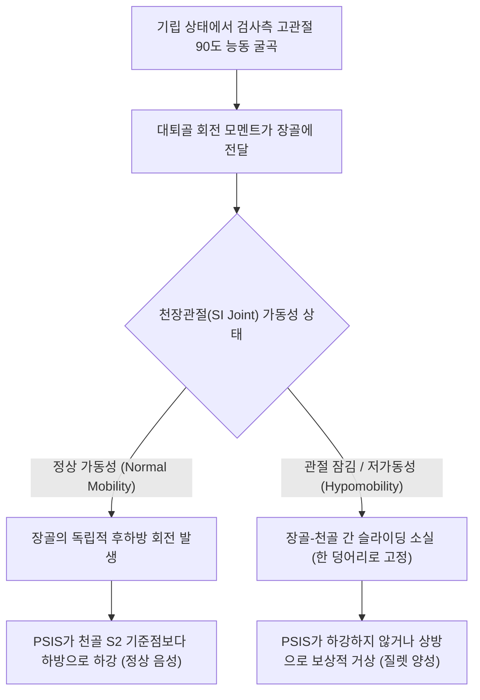

---
aliases:
  - "Gillett Test"
  - "Gillet's Test"
  - "질렛 검사"
  - "스토크 검사"
  - "Stork Test"
  - "천장관절 고정 검사"
  - "Sacral Fixation Test"
tags:
  - "이학적검사"
  - "천장관절"
  - "골반"
  - "추나요법"
  - "관절가동성"
created: "2024-02-27"
updated: "2026-09-15"
---

# 질렛 검사 (Gillett Test / Stork Test)

> **핵심 3줄 요약 (Key Summary)**:
> 🎯 기립 상태에서 검사자가 환자의 후상장골극(PSIS, 엉덩이 보조개)과 천골 중앙(S2 결절)을 엄지손가락으로 촉진한 뒤, 환자에게 한쪽 다리를 들어 고관절과 슬관절을 90도 이상 굴곡하도록 지시하는 천장관절 동적 가동성 검사이다.
> 🚩 정상적으로는 고관절 굴곡 시 장골이 천골에 대해 후하방으로 회전하여 굴곡 측 PSIS가 천골 기준점보다 아래로 하강(Inferior drop)해야 한다.
> 🔬 고관절 굴곡 시 PSIS가 아래로 내려가지 않고 고정되어 있거나 오히려 상방(Superior)으로 들려 올라간다면 천장관절의 저가동성(Hypomobility) 또는 후방 장골 고정(Joint fixation) 기능이상을 의미한다.
> ⚠️ 환자가 한 다리로 설 때 심한 둔근 약화나 전정기관 균형 장애가 있으면 골반 흔들림으로 인해 촉진 오차가 발생하므로 벽이나 의자를 가볍게 짚어 균형을 유지하도록 한다.

---

## 1. 개요 및 검사 목적

질렛 검사(Gillett Test, 벨기에 카이로프랙터 앙리 질렛(Henri Gillet)이 정립)는 일명 **황새 검사(Stork Test)** 또는 **천골 고정 검사(Sacral Fixation Test)로도 널리 불리며, 체중 부하 기립 상태에서 [[천장관절]](Sacroiliac Joint, SI Joint)의 미세한 고유 생체역학적 관절 유격과 동적 가동성(Dynamic Articular Mobility)을 평가하는 대표적인 추나·도수 이학적 검사법이다.

환자가 골반 뒤쪽의 엉덩이 보조개(Dimple) 부위에 해당하는 후상장골극(PSIS)을 지표로 삼아 한쪽 다리를 굴곡할 때, 장골(Ilium)과 천골(Sacrum) 사이의 상대적 슬라이딩 및 회전 움직임을 검사자의 엄지손가락 촉진을 통해 실시간으로 감지하여 골반 변위(장골 후하방/전상방 변위) 및 관절 기능부전을 진단한다.

![[gillett_test_anatomy_illustration.png|450]]
> **[도해] 질렛 검사의 골격 해부학 및 촉진 위치**: 검사자의 한쪽 엄지는 굴곡 측 장골의 PSIS(보조개 부위)에, 다른 쪽 엄지는 동일 높이의 천골 제2결절(S2 spinous tubercle)에 안착하여 상대적 변위를 계측한다.

---

## 2. 해부학 및 생체역학 기전

### 생체역학 메커니즘

[[천장관절]]은 강력한 인대 복합체(골간천장인대, 후천장인대, 천결절인대, 천극인대)에 의해 단단히 결합되어 있으며, 정상적인 상태에서는 약 2~4°의 미세 회전과 1~2mm의 병진 슬라이딩 운동만이 허용된다.
1. **장골의 후하방 회전(Posterior-Inferior Iliac Rotation)**:
   - 기립 자세에서 환자가 검사측 고관절을 90도 이상 능동 굴곡시키면, [[대퇴직근]] 및 [[장요근]]의 수축과 대퇴골두의 회전력에 의해 장골 전체가 시상면(Sagittal plane) 상에서 뒤쪽 아래(Posterior-inferior)로 회전(Posterior rotation)한다.
2. **정상 생리적 PSIS 하강 반응**:
   - 장골이 후방 회전하면 장골익의 후방 랜드마크인 PSIS는 천골에 비해 상대적으로 **하방(Inferior)으로 약 0.5~1.5cm 뚝 떨어지듯 이동(Drop)**하게 된다. 검사자의 굴곡측 엄지가 천골을 짚고 있는 엄지보다 명확히 아래로 내려가는 것을 촉진할 수 있다.
3. **병리적 천장관절 기능부전 (Joint Hypomobility / Fixation)**:
   - 만약 천장관절에 염증성 유착, 인대 단축, 혹은 아탈구성 관절 잠김(Subluxation fixation)이 존재하는 경우, 장골과 천골 사이의 미세 가동성이 상실되어 관절이 한 덩어리로 굳어버린다.
   - 고관절을 굴곡할 때 장골이 독립적으로 후하방 회전하지 못하고 천골을 끌고 함께 움직이거나, 체간의 회전 보상으로 인해 PSIS가 **제자리에 멈춰 있거나 오히려 상방(Superior)으로 들려 올라가는 이상 반응**이 나타난다.

### 검사 시 관여 조직 및 해부학적 구조

| 구조물 분류 | 관여 조직 및 명칭 | 질렛 검사 시 생체역학적 역할 |
| :--- | :--- | :--- |
| **핵심 관절** | [[천장관절]](SI Joint) | 장골과 천골 사이의 동적 회전-슬라이딩 가동성 축 |
| **골성 랜드마크** | 후상장골극(PSIS), 제2천추 결절(S2) | 검사자의 양 엄지손가락이 안착하는 절대적 변위 계측 지표 |
| **구동 근육군** | [[장요근]], [[대퇴직근]], [[대둔근]] | 한 다리 서기 시 지지측 둔근 안정화 및 검사측 고관절 굴곡 유도 |
| **결합 인대군** | 후천장인대, 천결절인대, 골간천장인대 | 천장관절의 과도한 이탈을 방지하고 미세 가동성을 제한 |

---

## 3. 검사 방법 및 절차

### 검사 전 준비
1. 환자를 진찰대 앞에 등을 돌리고 편안하게 기립(Standing)하도록 한다. 양발은 골반 너비로 벌리고 체중을 양다리에 균등하게 싣는다.
2. 환자가 한 발로 설 때 휘청거리지 않도록, 환자의 앞쪽에 벽이나 튼튼한 진찰대 손잡이를 가볍게 손가락 끝으로 짚어 지지할 수 있도록 환경을 조성한다.

![[gillett_test_clinical_maneuver.jpg|320]]
> **[도해] 질렛 검사 임상 시술 장면**: 검사자가 환자의 후방에 위치하여 양 엄지로 PSIS와 천골을 정밀 촉진하며 환자의 고관절 굴곡 동작을 유도하고 있다.

### 단계별 시행 절차

#### 1단계: 엉덩이 보조개(Dimple) 및 PSIS 촉진 (Step 1)
- 검사자는 환자의 뒤에 서거나 의자에 앉아 눈높이를 환자의 골반 높이에 맞춘다.
- 양손의 엄지손가락을 환자의 후상방 골반에 위치시킨다.
  - **첫 번째 엄지**: 검사하려는 쪽의 엉덩이 보조개(Dimple) 부위에 촉지되는 뼈 돌출부인 **후상장골극(PSIS)**의 최하단 경계부에 위치시킨다.
  - **두 번째 엄지**: PSIS와 수평을 이루는 중앙선 상의 **제2천추 극돌기 결절(S2 spinous tubercle)** 부위에 위치시킨다.

#### 2단계: 검사측 고관절 굴곡 지시 (Step 2)
- 환자에게 "반대쪽 다리로 체중을 지탱하면서, 검사하려는 쪽 무릎을 가슴 쪽으로 천천히 들어 올려 허벅지가 바닥과 평행(90도 이상)이 되도록 들어보세요"라고 지시한다.
- 다리가 올라가는 동안 검사자는 양 엄지손가락 사이의 수직적 거리 변화를 세밀하게 감지한다.

#### 3단계: 지지측(Standing leg) 천골 가동성 역검사 (Step 3)
- 이번에는 들어 올린 다리가 아니라, 바닥을 딛고 서 있는 지지측 다리의 천장관절 가동성을 평가할 수 있다.
- 환자가 다리를 들 때, 서 있는 쪽 다리의 PSIS와 천골을 비교하면 천골 기저부가 전방으로 끄덕임(Nutation) 운동을 하므로 천골 엄지가 상대적으로 외하방으로 이동하는지 관찰한다.

### 검사 시연 영상
- [Gillet Test Demonstration (Sacroiliac Joint Mobility Assessment)](https://www.youtube.com/watch?v=IE34vC7fhw8)
- [Stork Test & SIJ Movement Evaluation](https://www.youtube.com/watch?v=Uwfr3Hl_wzQ)

---

## 4. 양성 판정 기준 및 임상적 의의

### 판정 기준

| 검사 반응 (Response) | 임상적 진단 판정 | 골반 생체역학적 의미 |
| :--- | :--- | :--- |
| **PSIS의 명확한 하강 (0.5~1.5cm)** | **정상 (Negative)** | 천장관절의 관절면 슬라이딩 및 후하방 회전 가동성이 완전하게 보존됨 |
| **PSIS가 움직이지 않고 정지 (No drop)** | **양성 (Positive / Hypomobility)** | 천장관절의 저가동성, 관절 섬유화, 아탈구로 인한 관절 잠김(Joint Fixation) |
| **PSIS가 오히려 상방으로 거상 (Upward)** | **양성 (Positive / Severe Fixation)** | 관절이 완전히 굳어 장골이 굴곡되지 못하고 골반 전체가 보상적으로 들림 |

### 진단 정확도 및 신뢰도 지표

| 통계 지표 | 수치 범위 | 학술적 근거 및 임상적 해석 |
| :--- | :--- | :--- |
| **특이도 (Specificity)** | **79% ~ 89%** | 양성 시 천장관절 가동성 제한을 선별하는 데 우수한 특이도를 보임 |
| **민감도 (Sensitivity)** | 43% ~ 58% | 단독 통증 유발 검사가 아닌 '가동성 검사'이므로 통증성 SIJ 질환 단독 선별에는 제한적 |
| **검사자 간 신뢰도 (Inter-rater Kappa)** | 0.22 ~ 0.45 (Fair) | 촉진자의 숙련도 및 환자의 비만도(Dimple 촉진 난이도)에 영향을 받음 |

---

## 5. 감별 진단 및 유사 검사

골반 및 천장관절 질환을 평가할 때는 단일 검사에 의존하지 않고, 가동성 검사(Mobility test)와 통증 유발 검사(Pain provocation cluster)를 복합하여 감별한다.

| 검사명 | 주 측정 목적 | 검사 방식 및 원리 | 감별 포인트 |
| :--- | :--- | :--- | :--- |
| **질렛 검사** | [[천장관절]] 동적 가동성 | 기립하여 고관절 굴곡 시 PSIS 하강 여부 촉진 | 관절의 움직임 유무(잠김 vs 정상)를 평가하는 기능 검사 |
| [[패트릭 검사]] (FABER) | 천장관절 통증 및 고관절 병변 | 앙와위에서 굴곡·외전·외회전 4자 다리 압박 | 관절면에 전단 압박을 가하여 **통증 유발 여부**를 판정 |
| [[갠슬렌 검사]] (Gaenslen) | 천장관절 염증 및 인대 통증 | 침대 모서리에서 한쪽 다리 과신전, 반대측 굴곡 | 시상면에서 천장관절에 비틀림 토크를 가해 통증 유발 |
| [[요만 검사]] (Yeoman) | 전천장인대 손상 및 천장관절염 | 복와위에서 무릎 굴곡 후 고관절 과신전 | 전방 천장인대 및 관절낭의 긴장통 유발 |
| 트렌델렌버그 검사 | [[중둔근]] 근력 약화 | 한 발 서기 시 반대측 골반 낙하(Drop) 관찰 | 관절 가동성이 아닌 **둔근 지지 근력(Motor power)** 평가 |

---

## 6. 주의사항 및 위양성/위음성 요인

### 위양성(False Positive) 요인
1. **지지측 중둔근 약화(Trendelenburg 체형): 지지측 [[중둔근]]이 약하면 한 발로 서 있는 쪽의 둔근이 약하면 체간이 검사측으로 심하게 기울어지면서 골반 전체가 틸팅되어 정상인 PSIS가 하강하지 않는 것처럼 착각될 수 있다.
2. **환자의 전신 균형 불안**: 다리를 들 때 몸을 심하게 흔들면 손가락 위치가 미끄러져 오차가 발생한다.

### 위음성(False Negative) 요인
1. **피하 지방 과다 및 랜드마크 촉진 오류**: 둔부 비만이 심한 환자의 경우 PSIS 골성 융기를 정확히 짚지 못하고 표재성 지방 조직을 밀어 오판할 수 있다.
2. **고관절 90도 미만 불충분 굴곡**: 다리를 45도 정도만 살짝 들면 장골의 후방 회전이 완전히 일어나지 않아 정상 관절에서도 PSIS 하강이 명확히 관찰되지 않는다.

---

## 7. 진료실 핵심 임상 필기

### 💡 원장실 실전 노하우 & 진료실 체크리스트
- **원문 필기 100% 융합 및 실전 적용**:
  - 원문 기록: *"dimple을 짚은 상태에서 한쪽 발로 서서 오른쪽 발을 굴곡 시킨 자세. 굴곡 시킨 쪽의 PSIS가 아래로 내려가는 것이 정상적인 반응."*
  - **딤플(Dimple) 촉진의 손끝 감각**: 마른 환자는 엉덩이 보조개가 눈으로 선명히 보이지만, 살집이 있는 환자는 장골능(Iliac crest) 상단을 먼저 짚고 뒤쪽 아래로 타고 내려오면서 가장 뾰족하게 만져지는 뼈 돌출부를 찾아야 한다. 엄지손가락을 PSIS의 바로 아래쪽 모서리(Inferior ledge)에 걸쳐두어야 다리를 들 때 뼈가 아래로 쑥 내려오는 촉감을 극적으로 느낄 수 있다.
  - **추나 골반 변위(PI vs AS) 진단의 기준점**:
    - 질렛 검사에서 PSIS가 내려가지 않고 고정되어 있다면, 해당 측 장골은 **후하방 변위(PI ilium, Posterior-Inferior)** 상태로 잠겨 더 이상 후방 회전이 불가능한 상태이거나, 천장관절 전체의 아탈구 상태를 시사한다.
    - 추나 교정 시 앙와위 또는 측와위 골반 교정 기법(골반 드롭 또는 사이드 포스처 교정)의 타겟 분절을 결정하는 절대적인 임상 지표가 된다.

### 🗣️ 환자 티칭 & 설명 스크립트
> "환자분, 지금 골반 뒤쪽의 엉덩이 보조개 부위(후상장골극)를 만지면서 다리를 들어 올려보았습니다. 정상적인 골반은 다리를 들어 올릴 때 엉덩이 뼈가 뒤쪽 아래로 부드럽게 미끄러지면서 제 손가락이 1cm 정도 쑥 내려가야 합니다. 그런데 환자분의 오른쪽 골반뼈는 다리를 높이 들어도 아래로 전혀 내려가지 않고 꽉 잠겨서 굳어 있습니다. 이것을 '천장관절 저가동성(관절 잠김)'이라고 부르며, 골반이 뻣뻣하게 굳어 충격을 흡수하지 못하기 때문에 허리와 엉덩이로 만성적인 통증이 전달되는 것입니다. 굳어 있는 천장관절을 풀어주는 골반 추나 교정과 관절 인대를 강화하는 약침 치료를 받으시면 골반의 유연성이 회복되면서 엉치 통증이 시원하게 풀리게 됩니다."

### 🌿 한의 임상 치료 연계 프로토콜
- **천장관절 변위 및 잠김 추나 요법**:
  - **천장관절 교정 추나(Side-Posture SIJ Manipulation)**: 환자를 건측 측와위로 눕히고, 상측 이환부 PSIS를 접촉점으로 하여 전상방(Anterior-Superior) 또는 라인 오브 드라이브(LOD)에 맞춰 고속저진폭(HVLA) 스러스트를 가해 관절 잠김을 해제.
  - **골반 블록 SOT(Sacro-Occipital Technique)**: 급성 통증 환자에게는 복와위에서 골반 블록을 삽입하여 호흡에 따른 천골 자가 교정을 유도.
- **침구 및 약침 치료**:
  - **타겟 혈자리**: 차료(BL32), 중료(BL33), 관원수(BL26), 방광수(BL28), 포황(BL53).
  - **약침 치료**: 후천장인대 및 골간인대의 만성 염증 부위에 신바로약침 또는 중성어혈약침을 0.3~0.5cc 깊게 자입하여 인대 염증을 제거하고 관절 유연성을 증진.

---

## 8. 참고문헌 및 학술 연구 (References)

1. **Validity and Reliability of Palpatory Clinical Tests of Sacroiliac Joint Mobility: A Systematic Review and Meta-analysis.**
   - 저자: Ribeiro RP, Guerrero FG, Camargo EN.
   - 저널: *J Manipulative Physiol Ther*. 2021 May;44(4):341-352.
   - PMID: [33896601](https://pubmed.ncbi.nlm.nih.gov/33896601/) | DOI: [10.1016/j.jmpt.2021.03.003](https://doi.org/10.1016/j.jmpt.2021.03.003)
   - `[연구 요약]`: 천장관절 가동성을 평가하는 대표적인 촉진 검사(질렛 검사, 전방 굴곡 검사 등)의 진단 타당도와 신뢰도를 체계적으로 메타분석하여, 숙련된 검사자에 의한 질렛 검사의 높은 특이도(80% 이상)와 도수 치료 적응증 선별 가치를 입증함.

2. **Intraexaminer and interexaminer reliability of the Gillet test.**
   - 저자: Meijne W, van Neerbos K, Aufdemkampe G, et al.
   - 저널: *J Manipulative Physiol Ther*. 1999 Jan;22(1):4-9.
   - PMID: [10029942](https://pubmed.ncbi.nlm.nih.gov/10029942/) | DOI: [10.1016/s0161-4754(99)70098-9](https://doi.org/10.1016/s0161-4754(99)70098-9)
   - `[연구 요약]`: 질렛 검사의 검사자 내 및 검사자 간 신뢰도를 정량적으로 평가하고, PSIS의 촉진 기준점과 골반 굴곡 각도의 표준화가 신뢰도 향상에 미치는 영향을 규명함.

3. **Inter- and intra-examiner reliability of palpation for sacroiliac joint dysfunction.**
   - 저자: Carmichael JP.
   - 저널: *J Manipulative Physiol Ther*. 1987 Aug;10(4):164-71.
   - PMID: [3655566](https://pubmed.ncbi.nlm.nih.gov/3655566/)
   - `[연구 요약]`: 카이로프랙틱 임상에서 천장관절 기능이상 진단을 위해 시행되는 동적 모션 팔페이션(Motion palpation)과 질렛 검사의 재현성을 실증적으로 검증한 고전 랜드마크 연구.