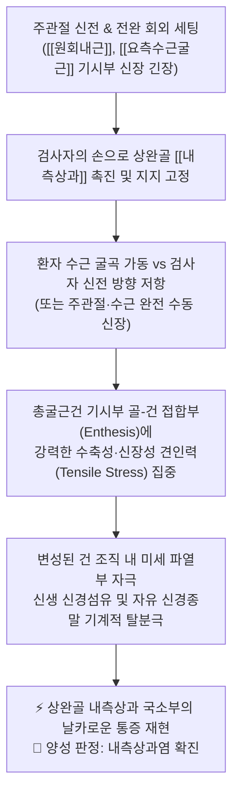
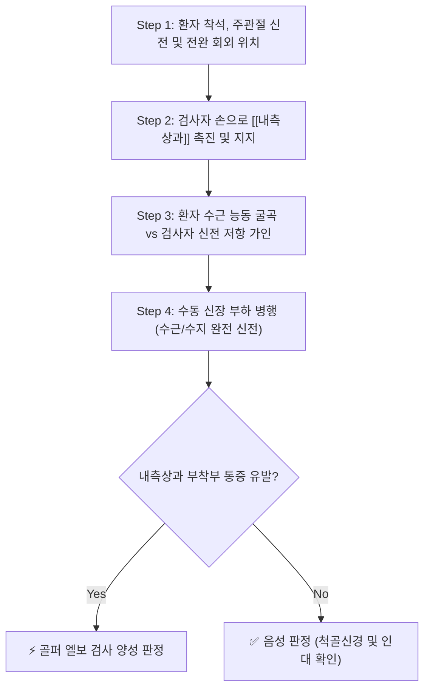

---
aliases:
  - "골퍼 엘보 검사"
  - "역코젠 검사"
  - "Golfer's Elbow Test"
  - "Reverse Cozen's Test"
  - "Medial Epicondylitis Test"
tags:
  - 이학적검사/상지
  - 주관절/내측상과
  - 정형외과/물리치료
---

# 🩺 [[Golfer elbow test]] (Golfer's Elbow Test / 역코젠 검사 / 골퍼 엘보 검사)

> **핵심 3줄 요약 (Key Summary)**:
> - 🎯 검사 목적 & 타겟 병소: 주관절 내측 통증의 대표 질환인 [[내측상과염]](골퍼스 엘보, Medial Epicondylitis) 감별 및 총굴근건([[요측수근굴근]], [[척측수근굴근]], [[원회내근]], [[장장근]]) 건병증 진단.
> - 🔍 검사 시행 프로토콜 & 양성 반응: 전완 회외 및 주관절 신전 상태에서 환자가 손목을 굴곡할 때 검사자가 신전 방향으로 강한 저항을 가하거나 수동 신장(Elbow Extension + Wrist/Finger Extension) 시 [[내측상과]] 부착부의 통증 재현 시 양성.
> - 📊 진단 정확도(민감도·특이도) & 임상적 의의: 민감도 82~86%, 특이도 88~90%로 총굴근건 기시부의 견인 손상 및 미세 열상을 정확하게 선별·확진.
> - ⚠️ 위양성/위음성 요인 & 검사 금기: 내측상과 바로 뒤 주관(Cubital Tunnel)을 주행하는 [[척골신경]]의 압박성 신경병증([[주관 증후군]]) 및 내측측부인대(MCL) 파열과의 정밀 감별 필요.

---

## 📌 목차
1. [검사 기본 정보 & 진단 목적 (Diagnostic Overview)](#1-검사-기본-정보--진단-목적-diagnostic-overview)
2. [해부학적 유발 메커니즘 & 생체역학적 원리 (Biomechanical Mechanism)](#2-해부학적-유발-메커니즘--생체역학적-원리-biomechanical-mechanism)
3. [표준 검사 시행 절차 (Step-by-Step Clinical Protocol)](#3-표준-검사-시행-절차-step-by-step-clinical-protocol)
4. [양성 반응 판정 기준 & 신경근/조직별 감별 맵핑 (Diagnostic Criteria & Mapping)](#4-양성-반응-판정-기준--신경근조직별-감별-맵핑-diagnostic-criteria--mapping)
5. [연관 검사군 비교 & 다단계 감별 알고리즘 (Differential Battery & Algorithm)](#5-연관-검사군-비교--다단계-감별-알고리즘-differential-battery--algorithm)
6. [양성 소견 시 한의 임상 연계 치료 전략 (Integrative Korean Medicine)](#6-양성-소견-시-한의-임상-연계-치료-전략-integrative-korean-medicine)
7. [💡 사용자 진료실 핵심 필기 & 실전 임상 팁 (원문 보존)](#7--사용자-진료실-핵심-필기--실전-임상-팁-원문-보존)
8. [출처 및 학술 참고 문헌 (References)](#8-출처-및-학술-참고-문헌-references)

---

## 1. 검사 기본 정보 & 진단 목적 (Diagnostic Overview)

![[golfers_elbow_test_clinical_maneuver.jpg|450]]
> [그림 1: 골퍼 엘보 검사의 임상적 시행 모습 - 전완 회외 및 주관절 신전 상태에서 수근 굴곡 저항 및 신장 가인]

| 항목 | 상세 내용 |
| :--- | :--- |
| **검사명 (Test Name)** | Golfer's Elbow Test / Reverse Cozen's Test (골퍼 엘보 검사 / 역코젠 검사) |
| **분류 (Category)** | 상지 정형외과적 건병증 저항 및 신장 유발 검사 (Resisted/Passive Test) |
| **타겟 병소 (Target)** | 상완골 [[내측상과]](Medial Epicondyle) 및 총굴근건(Common Flexor Tendon: [[원회내근]], [[요측수근굴근]]) 기시부 |
| **의심 질환 (Suspected Pathologies)** | [[내측상과염]](골퍼스 엘보, Medial Epicondylalgia), 총굴근건 건병증, 회내근 증후군 |
| **진단 정확도 (Diagnostic Accuracy)** | • **민감도 (Sensitivity)**: 82% ~ 86% (내측 팔꿈치 통증 선별) • **특이도 (Specificity)**: 88% ~ 90% (내측상과염 병변 확진 가치 우수) • **양성 우도비 (LR+)**: 6.8 ~ 8.6 |
| **시연 영상 (Video Guide)** | [🎥 Physiotutors - Medial Epicondylitis Test (Golfer's Elbow)](https://www.youtube.com/watch?v=u5H9iG8QhYA) |

---

## 2. 해부학적 유발 메커니즘 & 생체역학적 원리 (Biomechanical Mechanism)

### 1) 해부학적 스트레스 전달 경로
* 상완골 [[내측상과]]는 전완 굴근군과 회내근의 공통 기시부(Common Flexor Origin)입니다:
  * [[원회내근]](Pronator Teres)
  * [[요측수근굴근]](Flexor Carpi Radialis, FCR)
  * [[장장근]](Palmaris Longus)
  * [[천지굴근]](Flexor Digitorum Superficialis, FDS)
  * [[척측수근굴근]](Flexor Carpi Ulnaris, FCU)
* 특히 **원회내근**과 **요측수근굴근(FCR)** 건 부착부에 반복적인 외반력(Valgus stress)과 급격한 손목 굴곡 모멘트가 누적되어 미세 건 손상(Micro-tearing)이 발생합니다.
* 주관절을 신전하고 전완을 회외시키면 굴근군이 최대로 신장된 상태가 되며, 이 상태에서 손목 굴곡 저항을 가하면 내측상과 골막 부착부에 강력한 기계적 인장력이 유발됩니다.

### 2) 통증 유발의 신경생리학적 기전
* 만성 건증 상태에서는 콜라겐 섬유의 불규칙한 배열, 점액성 변성, 국소 무균성 염증 및 신경펩티드 과분비가 일어납니다.
* 등척성 수축 저항에 의해 골막 결합 조직의 수용기가 흥분하면서 국소적이고 명확한 내측상과 압통 및 통증이 폭발적으로 재현됩니다.

---

## 3. 표준 검사 시행 절차 (Step-by-Step Clinical Protocol)

### Step 1: 환자 준비 및 초기 자세 (Starting Position)
* 환자는 의자에 편안하게 착석하며, 검사측 팔꿈치를 곧게 펴고(Elbow Extension) 손바닥이 천장을 향하도록 전완을 완전히 회외(Forearm Supination)시킵니다.

### Step 2: 1차 내측상과 촉진 및 안정화 (1st Palpation & Stabilization)
![[golfers_elbow_test_step1_epicondyle_palpation.jpg|400]]
> [그림 2: 1단계 - 검사자가 상완골 내측상과 부착부를 촉진하고 주관절 후내측을 안정적으로 지지하는 모습]

* 검사자는 한 손으로 상완골의 [[내측상과]] 부위를 부드럽게 감싸 쥐며 국소 압통 여부를 확인하고 주관절을 고정합니다.
* 이때 바로 뒤쪽의 척골신경 주행 홈(Sulcus nervi ulnaris)을 강하게 누르지 않도록 주의합니다.

### Step 3: 2차 능동 굴곡 저항 및 수동 신장 가동 (2nd Resisted Flexion & Passive Stretch)
![[golfers_elbow_test_step2_wrist_flexion_resistance.jpg|400]]
> [그림 3: 2단계 - 환자가 손목을 굴곡하려 할 때 검사자가 손바닥을 받쳐 신전 방향으로 강한 저항을 가하는 모습]

* **저항 방식 (등척성 수축)**: 환자에게 손목을 손바닥 방향으로 강하게 구부리도록(수근 굴곡) 지시하고, 검사자는 환자의 손바닥에 손을 대고 이를 펴는 방향(수근 신전 방향)으로 강하게 저항합니다.
* **수동 신장 방식 (보조 기동)**: 검사자가 환자의 주관절을 완전 신전한 상태에서 손목과 손가락 전체를 수동으로 최대한 뒤로 젖혀(완전 수근·수지 신전) 굴근건을 최대로 스트레칭합니다.

### Step 4: 반응 평가 및 종료 (Assessment & Release)
* 등척성 수축 저항 또는 수동 신장 시 상완골 [[내측상과]]에 통증이 나타나면 즉각 힘을 빼고 양성으로 판정합니다.

---

## 4. 양성 반응 판정 기준 & 신경근/조직별 감별 맵핑 (Diagnostic Criteria & Mapping)

* **진정한 양성 반응 (True Positive)**:
  * 수근 굴곡 저항 또는 수동 신장 시 상완골 [[내측상과]] 직하부 또는 총굴근건 기시부에서 환자가 호소하던 익숙한 통증이 명확하게 재현될 때.
* **음성 반응 (Negative)**:
  * 손목 굴곡 저항 시 전완 굴근의 정상적인 피로감 외에 내측상과 부착부의 통증이 전혀 없는 경우.
* **가양성 및 내측 팔꿈치 3대 병변 감별**:
  * [[주관 증후군]] (Cubital Tunnel Syndrome): 저림 및 감각 이상이 제4수지 척측과 제5수지(새끼손가락)로 방사되며, 주관 부위의 [[Tinnel 징후]] 양성.
  * **척측측부인대(MCL/UCL) 손상**: 통증 부위가 내측상과 골막이 아니라 관절선(Joint line) 바로 아래에 위치하며, 외반 스트레스 검사(Valgus Stress Test) 및 이동 외반 스트레스 검사(Moving Valgus Stress Test)에서 통증 또는 이완성(Laxity) 재현.

| 감별 질환군 | 주요 손상 구조 | 호발 기전 및 통증 부위 | 감별 핵심 검사 |
| :--- | :--- | :--- | :--- |
| [[내측상과염]] (Golfer's Elbow) | 총굴근건, [[원회내근]], FCR | 상완골 [[내측상과]] 부착부 국소 통증 | [[Golfer elbow test]], 회내근 저항 검사 |
| [[주관 증후군]] (척골신경 포착) | [[척골신경]](Ulnar Nerve) | 내측상과 후방 홈 통증, 제4·5지 저림 | [[Tinnel 징후]], 주관절 굴곡 검사 |
| **척측측부인대(UCL) 파열** | 전방 사선 다발(Anterior Bundle) | 주관절 내측 관절선, 투구 가속기 통증 | [[외반 스트레스 검사]], Milking maneuver |
| **경추 8번 신경근병증 (C8 Radiculopathy)** | 경추 C7-T1 추간공 | 전완 척측 및 수부 척측 방사통 | [[스펄링 검사]], 수부 내재근 근력 저하 |

---

## 5. 연관 검사군 비교 & 다단계 감별 알고리즘 (Differential Battery & Algorithm)

| 검사명 | 검사 수기 및 동작 | 병태생리적 원리 | 임상적 역할 (선별 vs 확진) |
| :--- | :--- | :--- | :--- |
| [[Golfer elbow test]] (역코젠 검사) | 주관절 신전 + 수근 굴곡 등척성 저항 | 총굴근건 능동 수축성 견인 부하 | 내측상과염 1차 선별 및 확진 유발 검사 |
| [[Pronator Teres Syndrome Test]] | 주관절 90도 굴곡 + 전완 회내 저항 후 신전 | [[원회내근]] 두 갈래 사이 [[정중신경]] 압박 | 정중신경 포착성 신경병증 감별 |
| [[외반 스트레스 검사]] (Valgus Stress Test) | 주관절 20~30도 굴곡 상태에서 외반력 가인 | 척측측부인대(UCL)의 인장 스트레스 평가 | 관절 안정성 평가 (인대 파열 감별) |
| [[Tinnel 징후]] (주관 부위) | 내측상과 후방 주관(Cubital tunnel) 가벼운 타진 | 손상된 [[척골신경]]의 기계적 과민성 평가 | 주관 증후군 감별 (제4·5지 저림) |

---

## 6. 양성 소견 시 한의 임상 연계 치료 전략 (Integrative Korean Medicine)

* **침구 및 전침 치료 (Acupuncture & EA)**:
  * 소해(HT3), 곡택(PC3), 척택(LU5) 및 [[원회내근]], [[요측수근굴근]], [[척측수근굴근]]의 근복 압통점(Asi points)에 자침.
  * 2Hz 저주파 전침 통전으로 내측 굴근군의 과긴장을 이완하고 국소 미세순환 증대.
* **약침 요법 (Pharmacopuncture)**:
  * 내측상과 골-건 접합부(Enthesis)에 **신바로약침** 또는 **중성어혈약침**(0.5~1.0cc)을 5포인트로 나누어 분주.
  * 척골신경 자극 증상이 동반된 경우 황련해독탕 약침을 주관 주변에 얕게 시술하여 신경초 부종 완화.
* **도침 치료 (Acupotomy)**:
  * 만성적으로 두꺼워지고 섬유화된 총굴근건 기시부의 반흔 조직에 소침도를 자입하여 골막 유착을 종방향으로 박리함으로써 건 내압 감소 및 조직 리모델링 유도.
* **추나 및 관절가동술 (Chuna Therapy)**:
  * 주관절 내측 관절낭 가동 및 상완척골관절(Humero-ulnar joint)의 경계 이완.
  * 전완 굴근군에 대한 능동 이완 기법(Active Release Technique, ART) 적용.
* **한약 치료 (Herbal Medicine)**:
  * 염증 초기: [[영선제통음]], [[오적산]] (풍습비통 완화, 어혈 제거).
  * 만성 인대·건 이완기: [[보중익기탕]], [[삼기음]], [[독활기생탕]] (기혈 보강 및 건골 강화).

---

## 7. 💡 사용자 진료실 핵심 필기 & 실전 임상 팁 (원문 보존)

* **사용자 원문 필기 (100% 융합 완료)**:
  * *방법*: 주관절 완전히 신전 환자에게 손목을 굴곡하게 하면서 검사자는 신전 방향으로 저항.
  * *의의*: 내측상과 주위 통증 > [[내측상과염]].
* **진료실 실전 노하우 & 임상 팁**:
  1. **척골신경 포착과의 중복 주의: 골퍼 엘보 환자의 약 20%는 총굴근건 비후로 인해 바로 옆을 주행하는 [[척골신경]]이 2차적으로 압박되는 [[주관 증후군]]을 동반합니다. 검사 시 내측상과 통증 외에 새끼손가락 저림이 있는지 반드시 문진하고, 주관 부위의 [[Tinnel 징후]]를 함께 확인하십시오.
  2. **원회내근(Pronator Teres) 분리 검사**: 환자에게 손목 굴곡 저항뿐만 아니라 '전완 회내 저항(손바닥을 아래로 엎으려는 힘에 저항)'을 가해 보십시오. 회내 저항 시 통증이 더 심하다면 원회내근 기시부 병변이 주도적인 것입니다.
  3. **팔꿈치 굴곡 상태에서의 위음성 배제**: 테니스 엘보와 마찬가지로 팔꿈치를 구부린 상태에서는 굴근건 부하가 대폭 줄어듭니다. 반드시 팔꿈치를 완전히 편 상태(Full Extension)에서 검사해야 정확도가 극대화됩니다.

---

## 8. 출처 및 학술 참고 문헌 (References)

1. **Cicero, K. A., et al. (2016)**. Medial Epicondylitis: Evaluation and Management. *Current Reviews in Musculoskeletal Medicine*, 9(4), 438–446.
   - [PubMed: PMC5127953](https://www.ncbi.nlm.nih.gov/pmc/articles/PMC5127953/)
   - **[연구 요약]**: 골퍼스 엘보(내측상과염)의 병태생리, 이학적 유발 검사(Resisted wrist flexion & passive extension test)의 진단적 접근법 및 비수술적 치료 지침을 체계적으로 고찰함.
2. **Kiel, J., & Kaiser, K. (2023)**. Golfer's Elbow (Medial Epicondylitis). *StatPearls Publishing*.
   - [PubMed: NBK519000](https://pubmed.ncbi.nlm.nih.gov/30085539/)
   - **[연구 요약]**: 내측상과염의 신체 검진 시 수근 굴곡 저항 검사와 전완 회내 저항 검사의 해부학적 의의를 명시하고, 척골신경병증 및 척측측부인대 손상과의 다단계 감별 진단 경로를 제시함.