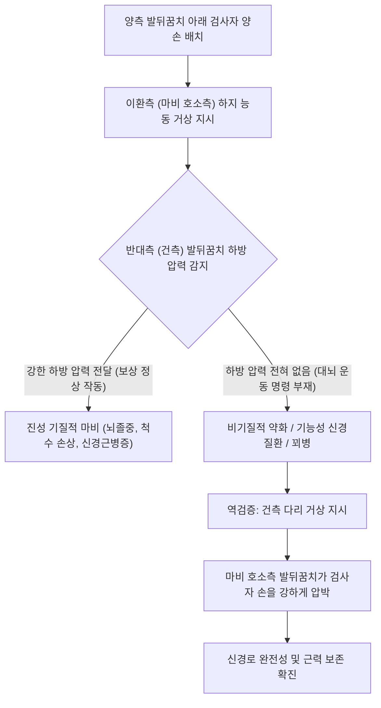

---
aliases:
  - "Hoover Test"
  - "Hoover's Sign"
  - "후버 검사"
  - "후버 징후"
  - "대측 발뒤꿈치 압력 검사"
tags:
  - "이학적검사"
  - "신경계"
  - "하지마비"
  - "비기질적약화"
  - "기능성신경질환"
  - "꾀병감별"
created: "2024-02-27"
updated: "2026-09-14"
---

# 후버 검사 (Hoover Test)

> **핵심 3줄 요약 (Key Summary)**:
> 🎯 앙와위에서 검사자가 양손으로 환자의 양쪽 발뒤꿈치(종골) 아래를 받쳐 들고, 환자에게 한쪽 다리씩 능동적으로 들어 올리도록 지시하여 반대측 발뒤꿈치의 무의식적 하방 압력을 평가하는 검사이다.
> 🚩 한쪽 다리를 들어 올릴 때 골반 안정을 위해 반대측 다리가 침대를 아래로 누르는 불수의적 짝힘(Contralateral downward pressure)의 생체역학적 원리를 이용한다.
> 🔬 약화를 호소하는 이환측 다리를 들려고 할 때 반대측 정상 발뒤꿈치에서 하방 압력이 전혀 감지되지 않거나, 건측을 들 때 마비측 발뒤꿈치가 강하게 바닥을 누른다면 기능성 신경질환(FND) 또는 꾀병(Malingering)을 강력히 시사한다.
> ⚠️ 기질적 뇌졸중이나 척수 손상 환자는 마비된 다리가 실제로 들리지 않더라도 건측 발뒤꿈치로 검사자의 손을 매우 강하게 누르는 정상 생리적 보상 반응을 보인다.

---

## 1. 개요 및 검사 목적

후버 검사(Hoover's Test, 또는 Hoover's Sign)는 미국의 내과의사 찰스 프랭클린 후버(Charles Franklin Hoover, 1865–1927)가 1908년에 고안한 신경학적 이학적 검사법이다. 주로 한쪽 하지의 급성 편마비(Hemiparesis), 하지 근력 약화, 혹은 극심한 요통으로 인해 다리를 전혀 들어 올리지 못한다고 호소하는 환자에서 **진성 기질적 신경 병변(Organic Neurological Paresis; 뇌경색, 뇌출혈, 척수 손상, 중증 요수신경근병증)**과 **비기질적 기능성 근력 약화(Functional Neurological Disorder / FND / Malingering / 꾀병)**를 객관적이고 반박할 수 없게 감별하기 위해 시행된다.

환자의 의식적인 연기나 주관적 진술을 완전히 배제하고, 인간의 뇌간과 척수 반사 수준에서 자동으로 유발되는 **불수의적 대측 신전근 보상 작용(Crossed Extensor Reflex / Involuntary Synergistic Coupling)**을 직접 손끝으로 감지하여 신경학적 진실을 밝혀낸다.

![[hoover_test_clinical_maneuver.jpg|450]]
> **[도해] 후버 검사(Hoover's Test)의 임상 시술 전경**: 검사자가 양손 손바닥으로 환자의 양측 발뒤꿈치(종골) 아래를 받친 채, 환자에게 한쪽 다리를 들어 올리도록 지시하여 반대측 손에 전해지는 하방 압력을 실시간으로 감지하고 있다.

---

## 2. 해부학 및 생체역학 기전

### 생체역학 및 신경생리학적 메커니즘

인간이 누운 상태에서 한쪽 다리를 수평면 위로 능동 거상(Straight Leg Raise)할 때, 골반의 위치를 고정하고 지레의 작용점을 형성하기 위하여 반대쪽 둔부와 다리가 침대 바닥을 강력하게 아래로 내리누르는 반대측 짝힘(Couple of force)이 발생한다.
1. **불수의적 협동 운동(Involuntary Synergy)**:
   - 한쪽 고관절 굴곡근([[장요근]], [[대퇴직근]])이 수축할 때, 반대측 고관절 신전근([[대둔근]], [[햄스트링]])이 척수 반사 및 전정척수로(Vestibulospinal tract), 망상체척수로(Reticulospinal tract)의 자동화된 신경 경로를 통해 무의식적·동시적으로 강력하게 수축한다.
2. **진성 기질적 마비 환자의 반응 (Organic Paresis)**:
   - 뇌졸중이나 척수 손상으로 인해 한쪽 다리가 완전히 마비된 환자라도, 환자가 마비된 다리를 들기 위해 진심으로 대뇌 피질에서 운동 의지(Voluntary motor drive)를 보내면, 정상인 반대측 다리의 신전근으로 신경 신호가 자동으로 전달된다.
   - 따라서 **마비된 다리는 비록 침대에서 1mm도 들리지 않더라도, 검사자가 받치고 있는 반대측 정상 발뒤꿈치는 검사자의 손바닥을 으스러지듯 강하게 아래로 내리누른다(정상 Hoover 징후 음성).**
3. **비기질적/기능성 약화 및 꾀병 환자의 반응 (Non-Organic / Malingering)**:
   - 환자가 다리를 들려고 끙끙 앓으며 얼굴을 찡그리고 복근에 힘을 주는 척하지만, 실제로는 대뇌에서 하지 굴곡을 위한 진정한 운동 명령을 내리지 않고 있다.
   - 따라서 **환자가 다리를 들려고 애쓰고 있다고 주장하는 동안에도, 검사자의 반대측 손에는 아무런 하방 압력(Downward pressure)이 감지되지 않는다(후버 징후 양성).**
4. **반대측 역검증(Reverse Hoover Test)**:
   - 이번에는 마비되지 않은 건강한 쪽 다리를 들어 올리라고 지시한다.
   - 환자가 정상 다리를 번쩍 들어 올리는 순간, 마비되었다고 주장하던 쪽 발뒤꿈치가 검사자의 손을 아주 강력하게 아래로 꽉 누르는 현상이 명확히 관찰된다. 이는 마비측 다리의 척수 신경근과 고관절 신전근 섬유가 완전히 정상적으로 작동하고 있음을 결정적으로 증명한다.

![[hoover_test_mechanism_diagram.png|380]]
> **[도해] 기질적 마비(Organic) vs 비기질적 마비(Non-organic) 기전 비교**: 정상측 거상 시(상단)와 마비측 거상 시(하단) 발뒤꿈치 하방 압력 화살표의 유무를 통해 신경학적 진정성을 명확히 판별한다.

### 검사 시 관여 조직 및 해부학적 구조

| 구조물 분류 | 관여 조직 및 명칭 | 후버 검사 시 신경생리학적 역할 |
| :--- | :--- | :--- |
| **능동 굴곡근군** | [[장요근]], [[대퇴직근]], 치골근 | 검사측 하지 거상 시 주동근으로 작용 |
| **반대측 신전근군** | [[대둔근]], [[햄스트링]] (대측) | 골반 안정을 위해 불수의적으로 수축하여 하방 압력 발생 |
| **원위부 접촉점** | 종골(Calcaneus, 발뒤꿈치) | 검사자의 손바닥에 수직 압력을 전달하는 골성 랜드마크 |
| **중추 신경로** | 피질척수로(Corticospinal), 망상체척수로 | 수의적 운동 명령 및 대측 불수의 협동 수축 매개 |

---

## 3. 검사 방법 및 절차

### 검사 전 준비
1. 환자를 진찰대에 편안하게 앙와위(Supine)로 눕히고, 양다리를 나란히 뻗어 완전히 이완시킨다.
2. 검사의 진정한 목적(반대측 발뒤꿈치 압력 측정)을 절대 미리 설명하지 않는다. 단순히 "양쪽 다리의 들어 올리는 근력을 차례로 확인해 보겠습니다"라고 자연스럽게 안내한다.

### 단계별 시행 절차

#### 1단계: 양측 종골 하부 손바닥 안착 (Step 1)
- 검사자는 침대 발치(Foot of bed)에 서서, 양손을 펴서 환자의 좌우 양측 발뒤꿈치(종골 하부) 아래에 각각 손바닥을 밀어 넣고 살짝 받쳐 든다(침대에서 약 2~3cm 거상).

#### 2단계: 이환측 하지 거상 유도 및 건측 압력 감지 (Step 2)
- 환자에게 마비나 약화를 호소하는 아픈 쪽 다리를 무릎을 편 채로 천천히 들어 올리도록 지시한다.
- 이때 검사자의 주의 집중은 들리는 다리가 아니라, **반대쪽 정상측 발뒤꿈치를 받치고 있는 손바닥**에 집중되어야 한다.
- 환자가 다리를 들려고 시도할 때 반대측 손바닥에 묵직한 하방 압력이 꽉 실리는지, 아니면 허공에 뜬 것처럼 아무런 압력이 실리지 않는지를 확인한다.

#### 3단계: 건측 하지 거상 및 이환측 압력 역검증 (Step 3)
- 이번에는 반대로 정상인 다리를 위로 들어 올려보라고 지시한다.
- 건측 다리가 올라가는 동안, **마비되었다고 주장하던 아픈 쪽 발뒤꿈치**가 검사자의 손바닥을 아래로 누르는 힘의 크기를 확인한다. 아픈 쪽 발뒤꿈치가 손바닥을 힘차게 누른다면 해당 하지의 신전 신경망은 완벽히 정상이다.

### 검사 시연 영상
- [Hoover's Sign Examination in Functional Neurological Disorder](https://www.youtube.com/watch?v=jxtmWZoG4ao)
- [Clinical Demonstration of Hoover's Test](https://www.youtube.com/watch?v=BEtLcfikzPI)

---

## 4. 양성 판정 기준 및 임상적 의의

후버 검사는 의학 역사상 가장 재현성이 뛰어나고 과학적으로 검증된 비기질적 징후 판별 검사이다.

### 임상 반응별 판정 매트릭스

| 환자 수행 동작 | 검사자 감지 반응 (대측 발뒤꿈치) | 임상적 진단 판정 |
| :--- | :--- | :--- |
| **마비측 다리 거상 시도 (거상 불능)** | **반대측 정상 발뒤꿈치에 강한 하방 압력 발생** | **기질적 마비 (진성 뇌졸중, 척수 손상, 신경마비)** |
| **마비측 다리 거상 시도 (거상 불능)** | **반대측 정상 발뒤꿈치에 하방 압력 전혀 없음** | **비기질적 약화 / 꾀병 (Hoover 징후 양성)** |
| **정상측 다리 거상 (정상 거상)** | **마비 호소측 발뒤꿈치에 강력한 하방 압력 발생** | **비기질적 약화 확진 (신경로 완전성 확인)** |

### 진단 정확도 지표

| 통계 지표 | 수치 범위 | 학술적 근거 및 임상적 해석 |
| :--- | :--- | :--- |
| **민감도 (Sensitivity)** | 63% ~ 76% | 기능성 신경학적 운동 장애(FND) 선별에서 안정적인 민감도 |
| **특이도 (Specificity)** | **93% ~ 100%** | 양성(하방 압력 결여 및 역검증 압력 확인) 시 비기질적 장애 진단 특이도 극히 우수 |
| **검사자 간 신뢰도 (Kappa)** | 0.85 ~ 0.95 | 신경과 전문의 간 일치도가 매우 높은 표준 검사 |

---

## 5. 감별 진단 및 유사 검사

후버 검사는 신체화 장애, 기능성 신경학적 장애 및 꾀병을 감별하는 여러 이학적 징후들과 상호 보완된다.

| 검사명 | 주 평가 대상 | 검사 동작 및 판정 기전 | 임상적 활용 분야 |
| :--- | :--- | :--- | :--- |
| **후버 검사** | 하지 편마비, 근력 약화 진위 | 발뒤꿈치 받치고 하지 거상 시 대측 불수의 압력 감지 | 신경과 편마비, 교통사고 후 다리 마비 주장 환자 |
| [[플립 검사]] (Flip Test) | 비기질적 좌골신경통 감별 | 앙와위 SLR 후 **좌위에서 무릎 신전**시켜 일관성 확인 | 척추 클리닉 요통·방사통 과장 환자 |
| [[번스 벤치 검사]] | 비기질적 굴곡 요통 감별 | 벤치에 무릎 꿇고 상체 숙여 바닥 터치 유도 | 요추 축성 부하 배제 상태에서의 전굴 거부 확인 |
| 바빈스키 징후 | 기질적 상위운동신경원(UMN) 병변 | 발바닥 외측 긁기 시 모지 배굴 반사 유무 | 뇌/척수 실질 손상의 객관적 물리적 지표 |
| 와델 표재성 압통 검사 | 비기질적 만성 통증 증후군 | 피부를 살짝 집어 올리거나 가볍게 스칠 때 극심한 통증 | 중추감작 및 심인성 통증 증후군 선별 |

---

## 6. 주의사항 및 위양성/위음성 요인

### 위양성(False Positive) 발생 요인
1. **반대측(건측) 고관절 신전근 마비**: 만약 반대측 다리에도 다발성 신경염, 진행성 근이영양증, 양측성 뇌병변이 있어 신전근 근력 자체가 없는 환자는 이환측을 들려고 해도 건측이 바닥을 누를 힘이 없어 위양성이 될 수 있다.
2. **지시 불이행 및 인지 장애**: 섬망, 치매, 중증 언어상실증(Aphasia) 등으로 환자가 검사자의 "다리를 들라"는 지시 자체를 이해하지 못하고 아무런 노력을 하지 않은 경우.
3. **심한 고관절 또는 둔부 통증**: 반대측 고관절에 급성 관절염, 전자부 골절, 좌골 점액낭염 등이 있어 바닥을 누를 때 극심한 통증이 발생하여 환자가 무의식적으로 누르는 것을 억제하는 경우.

### 검사 시 임상적 에티켓
- 후버 검사에서 비기질적 양성이 나왔다고 해서 환자에게 "다리에 힘 다 들어가는데 왜 거짓말하십니까?"라며 다그치거나 망신을 주어서는 안 된다. 기능성 신경질환(FND) 환자는 의식적 거짓말쟁이가 아니라, 대뇌의 소프트웨어적 네트워크 연결 오류로 인해 실제로 다리가 움직이지 않는다고 느끼는 환자일 수 있기 때문이다.

---

## 7. 진료실 핵심 임상 필기

### 💡 원장실 실전 노하우 & 진료실 체크리스트
- **원문 필기 100% 융합 및 실전 적용**:
  - 원문 기록: *"검사자의 양손으로 환자의 양쪽 발뒤꿈치를 받치고, 환자에게 한 쪽씩 발을 들어올리게 함. 기질적 요통이 있는 환자에서는 발을 들어 올릴 때 보상적으로 반대쪽 발을 내리려는 경향이 있는데, 비기질적 요통에서는 이런 보상적 움직임이 관찰되지 않음."*
  - **진료실 트릭 앤 팁 (Stealth Testing)**: 환자가 검사자의 손을 의식하지 못하게 하는 것이 결정적이다. "환자분, 지금부터 허리 신경이 다리 쪽으로 얼마나 잘 통하는지 다리를 하나씩 들어보는 검사를 하겠습니다"라고 하면서 자연스럽게 양쪽 발뒤꿈치 아래에 손을 넣는다. 환자의 시선이 올라가는 다리에 쏠려 있을 때, 검사자는 건측 손바닥에 전해지는 압력에만 온 신경을 집중한다.
  - **3단계 역검증(Reverse test)의 극적인 힘**: 마비측을 들라고 했을 때 건측 손에 아무 압력이 없다면, 즉시 "이번에는 반대쪽 좋은 다리를 한번 번쩍 들어보세요!"라고 지시한다. 환자가 좋은 다리를 들 때 마비된 다리 발뒤꿈치가 검사자의 손을 쑥 내리누르는 것을 확인한 순간, 진료의 주도권은 완전히 한의사에게 넘어온다.

### 🗣️ 환자 티칭 & 설명 스크립트 (치료적 설득 기법)
> "환자분, 방금 좋은 다리를 들어 올리실 때, 마비되어 움직이지 않는다고 하셨던 반대쪽 다리가 제 손바닥을 아주 힘차게 아래로 내리눌렀습니다. 이것은 무엇을 뜻할까요? 환자분의 뇌에서 다리로 내려가는 신경 고속도로([[좌골신경]] 및 운동신경망)는 영구적으로 끊어지거나 파괴된 것이 아니라, 완벽하게 살아있다는 결정적인 의학적 증거입니다! 다만 지금은 통증에 대한 극심한 공포와 뇌의 일시적인 신호 혼선으로 인해 스스로 들어 올리는 스위치만 잠시 꺼져 있는 상태입니다. 신경이 완전히 살아있음을 확인했으니, 전혀 두려워하실 필요가 없습니다. 이제 척추와 골반의 균형을 바로잡는 추나 치료와 감각-운동 신경을 깨우는 전침 치료를 받으시면 다리는 반드시 정상으로 돌아옵니다."

### 🌿 한의 임상 치료 연계 프로토콜
- **기능성 근력 약화 및 비기질적 마비의 한의 치료**:
  - **전침 치료(Electroacupuncture)**: 마비 호소측의 족삼리(ST36), 양릉천(GB34), 환도(GB30), 현종(GB39)에 자침 후 저주파(2Hz) 전침을 걸어 대퇴사두근과 전경골근의 눈에 보이는 실제 근수축(Visible muscle twitch)을 환자에게 직접 거울로 보여준다. "보세요, 신경과 근육이 이렇게 힘차게 뛰고 있습니다"라는 시각적 피드백(Visual Biofeedback)을 제공하면 기능성 마비의 극적인 호전을 유도할 수 있다.
  - **추나 요법**: 골반 가동 추나 및 하지 PNF(고유수용성 신경근 촉진법) 스트레칭을 통해 능동적 움직임에 대한 두려움(Kinesiophobia)을 해소.
- **방제 연계**:
  - 심신 불안 및 기허(氣虛): 보중익기탕(補中益氣湯) 또는 가미귀비탕(加味歸脾湯).
  - 경락 소통 및 신경 기능 활성화: 오약순기산(烏藥順氣散) 또는 독활기생탕(獨活寄生湯).

---

## 8. 참고문헌 및 학술 연구 (References)

1. **Hoover's sign: Clinical relevance in Neurology.**
   - 저자: Mehndiratta MM, Kumar M, Nayak R.
   - 저널: *J Postgrad Med*. 2014 Jul-Sep;60(3):297-9.
   - PMID: [25121372](https://pubmed.ncbi.nlm.nih.gov/25121372/) | DOI: [10.4103/0022-3859.138760](https://doi.org/10.4103/0022-3859.138760)
   - `[연구 요약]`: 신경과 영역에서 후버 징후(Hoover's sign)의 역사적 유래, 신경생리학적 기전(대측 불수의 협동 수축), 그리고 기능성 신경학적 장애(FND)와 기질적 편마비 감별에 있어서의 탁월한 진단적 가치와 높은 특이도를 체계적으로 집대성함.

2. **A Review and Expert Opinion on the Neuropsychiatric Assessment of Motor Functional Neurological Disorders.**
   - 저자: Perez DL, Aybek S, Popkirov S, et al.
   - 저널: *J Neuropsychiatry Clin Neurosci*. 2021 Winter;33(1):14-26.
   - PMID: [32778007](https://pubmed.ncbi.nlm.nih.gov/32778007/) | DOI: [10.1176/appi.neuropsych.19110253](https://doi.org/10.1176/appi.neuropsych.19110253)
   - `[연구 요약]`: 기능성 운동 신경 장애(Motor FND)의 진단 평가에서 후버 검사와 같은 '긍정적 진단 징후(Rule-in physical signs)'의 임상적 표준 지침을 제시하고, 환자 설명 및 치료적 커뮤니케이션 전략을 권고함.

3. **Functional limb weakness and paralysis.**
   - 저자: Stone J, Aybek S.
   - 저널: *Handb Clin Neurol*. 2016;139:213-228.
   - PMID: [27719840](https://pubmed.ncbi.nlm.nih.gov/27719840/) | DOI: [10.1016/B978-0-12-801772-2.00018-4](https://doi.org/10.1016/B978-0-12-801772-2.00018-4)
   - `[연구 요약]`: 기능성 사지 약화 환자에서의 신체 검진 지표들을 실증적으로 검토하고, 후버 검사의 음성/양성 패턴이 뇌 영상학적 이상 소견과 독립적으로 높은 진단적 신뢰성을 가짐을 입증함.