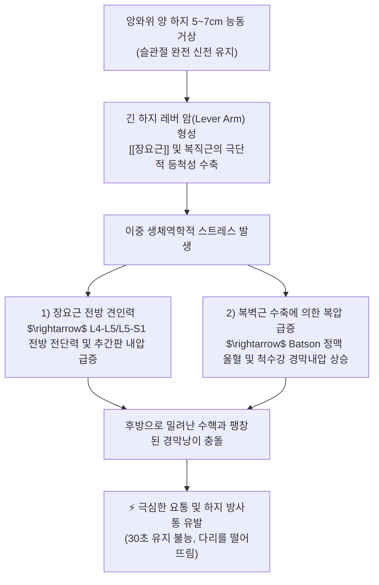
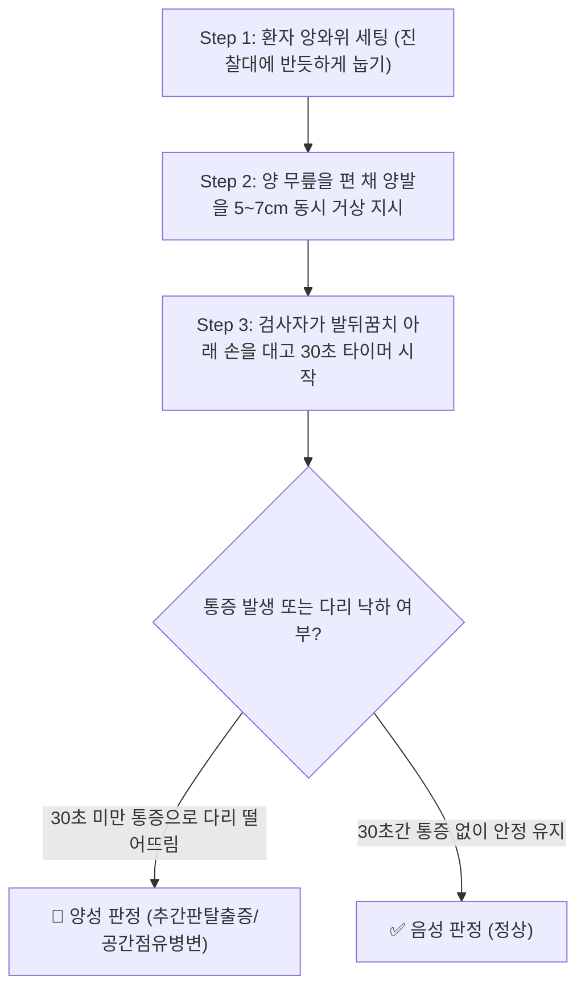

---
aliases:
  - "Milgram's test"
  - "Milgram test"
  - "밀그램 검사"
  - "양하지 거상 검사"
tags:
  - "이학적검사"
  - "요추"
  - "추간판탈출증"
  - "복압"
---

# 🩺 [[Milgram's test]] (밀그램 검사 / Active Bilateral Straight Leg Raise Test)

> **핵심 3줄 요약 (Key Summary)**:
> - 🎯 검사 목적 & 타겟 병소: 요추 추간판(L4-L5, L5-S1), 척수 경막낭(Thecal sac), 요천추 신경근의 공간 점유성 병변([[추간판 탈출증]], 척수 종양, 척추 전방전위증) 및 요천추 분절 불안정성 평가.
> - 🔍 검사 시행 프로토콜 & 양성 반응: 환자를 앙와위로 눕히고 양 무릎을 편 채 양다리를 진찰대 바닥에서 5~7cm(2~3인치) 들어 올려 30초간 버티게 하며, 정상인은 30초간 유지 가능하나 극심한 요통이나 하지 방사통으로 30초를 버티지 못하고 다리를 떨어뜨리면 양성.
> - 📊 진단 정확도(민감도·특이도) & 임상적 의의: 복압과 장요근의 강력한 등척성 수축이 결합되어 추간판 내압(Intradiscal pressure)과 척수강 내압(Intrathecal pressure)을 동시에 극대화하므로, 양성 시 [[추간판 탈출증]] 및 척추 내강 병변의 확진 특이도 약 80~90%.
> - ⚠️ 위양성/위음성 요인 & 검사 금기: 복근력이나 [[장요근]] 근력이 심하게 약화된 환자는 신경 증상이 없어도 30초를 못 버티는 위양성 주의, 급성 요추 염좌나 중증 척추 불안정증 환자에게는 과도한 전방 전단력으로 디스크 파열 위험이 있으므로 주의 시행.

---

## 📌 목차
1. [검사 기본 정보 & 진단 목적 (Diagnostic Overview)](#1-검사-기본-정보--진단-목적-diagnostic-overview)
2. [해부학적 유발 메커니즘 & 생체역학적 원리 (Biomechanical Mechanism)](#2-해부학적-유발-메커니즘--생체역학적-원리-biomechanical-mechanism)
3. [표준 검사 시행 절차 (Step-by-Step Clinical Protocol)](#3-표준-검사-시행-절차-step-by-step-clinical-protocol)
4. [양성 반응 판정 기준 & 신경근/조직별 감별 맵핑 (Diagnostic Criteria & Mapping)](#4-양성-반응-판정-기준--신경근조직별-감별-맵핑-diagnostic-criteria--mapping)
5. [연관 검사군 비교 & 다단계 감별 알고리즘 (Differential Battery & Algorithm)](#5-연관-검사군-비교--다단계-감별-알고리즘-differential-battery--algorithm)
6. [양성 소견 시 한의 임상 연계 치료 전략 (Integrative Korean Medicine)](#6-양성-소견-시-한의-임상-연계-치료-전략-integrative-korean-medicine)
7. [💡 사용자 진료실 핵심 필기 & 실전 임상 팁 (원문 보존)](#7--사용자-진료실-핵심-필기--실전-임상-팁-원문-보존)
8. [출처 및 학술 참고 문헌 (References)](#8-출처-및-학술-참고-문헌-references)

---

## 1. 검사 기본 정보 & 진단 목적 (Diagnostic Overview)

![[밀그램검사_1단계_양하지_5cm_거상_실사.jpg|500]]
> [그림 1: 밀그램 검사의 표준 시행 자세 - 환자가 앙와위에서 슬관절을 편 채 양 하지를 진찰대에서 5~7cm(2~3인치) 들어 올려 30초간 공중에서 유지를 시도하는 모습]

![[밀그램검사_병태생리_요추디스크_신경근압박_도해.jpg|500]]
> [그림 2: 밀그램 검사의 병태생리 기전 - 양 하지 거상 시 장요근 수축에 의한 요추 전단력 증대 및 복압 상승으로 척수강 내압이 급증하여 탈출된 추간판이 신경근을 압박하는 메커니즘 도해]

| 항목 | 상세 내용 |
| :--- | :--- |
| **검사명 (Test Name)** | Milgram's Test (밀그램 검사 / Active Bilateral Straight Leg Raise) |
| **이명 및 관련 징후** | 능동적 양하지직거상 검사, 척수강 내압 유지 검사, 복압-요추 전단 스트레스 검사 |
| **분류 (Category)** | 척수강 내압 유발 검사 (Intrathecal Pressure Test) & 요추 안정성 평가 검사 |
| **타겟 병소 (Target)** | 요추 추간판(L4-L5, L5-S1), 척수 경막낭(Dural sac), 요천추 신경근, [[장요근]](Iliopsoas) |
| **의심 질환 (Suspected Pathologies)** | 요추 [[추간판 탈출증]](LDH), 요추관 협착증, 척수 종양, 척추 분리증/전방전위증, 코어 근육 약화 |
| **진단 정확도 (Diagnostic Accuracy)** | • **민감도 (Sensitivity)**: 약 35% ~ 50% (음성이라도 초기 디스크 배제 불가) • **특이도 (Specificity)**: 약 80% ~ 90% (30초 미만 통증으로 낙하 시 디스크 확진 가치 우수) • **정상 기준 시간**: 30초간 통증 없이 완전 유지 |
| **시연 영상 (Video Guide)** | [🎥 시연 영상: Physiotutors - Milgram Test](https://www.youtube.com/watch?v=ZUtor7IVCms) |

---

## 2. 해부학적 유발 메커니즘 & 생체역학적 원리 (Biomechanical Mechanism)

### 1) 장요근의 전방 견인력과 추간판 내압 급증
* 앙와위에서 양 무릎을 펴고 다리를 살짝 들어 올리는 자세(5~7cm 거상)는 생체역학적으로 인체에서 가장 긴 레버 암(Long lever arm) 모멘트를 형성합니다.
* 이 무거운 양다리의 하중을 공중에 지탱하기 위해 요추 전면과 대퇴골 소전자를 연결하는 [[장요근]](Iliopsoas)이 최대 강도의 등척성 수축(Maximal isometric contraction)을 시작합니다.
* Nachemson의 척추 내압 연구에 따르면, 양다리를 바닥에서 살짝 들고 버티는 동작은 서 있는 자세보다 요추 추간판 내압(Intradiscal pressure)을 2~3배(약 150~200kg/cm²) 이상 폭증시킵니다.
* 이 강력한 전방 전단력(Anterior shear force)과 압박력에 의해 수핵(Nucleus pulposus)이 후방 섬유륜 쪽으로 강하게 밀려납니다.

### 2) 척수강 내압(Intrathecal Pressure) 상승의 이중 기전
* 다리를 버티는 동안 환자는 횡격막과 복직근, 복사근을 단단히 수축시켜 복압(Intra-abdominal pressure)을 급격히 높입니다.
* 이는 [[Valsalva test]]와 동일하게 Batson 정맥총을 거쳐 척추관 내부의 경막낭 내압을 가파르게 끌어올립니다.
* 따라서 뒤로 밀려나는 수핵과 팽창하는 경막낭·신경근 슬리브가 좁은 추간공 및 척추관 내에서 정면 충돌하게 됩니다.
* 공간 점유성 병변이 존재하는 환자는 신경근의 허혈성 통증과 척추 분절의 불안정성을 견디지 못하고 몇 초 만에 비명을 지르며 다리를 바닥으로 떨어뜨리게 됩니다.

---

## 3. 표준 검사 시행 절차 (Step-by-Step Clinical Protocol)

### Step 1: 환자 준비 자세 (Starting Position)
* 환자를 진찰대 위에 반듯하게 눕힙니다 (앙와위).
* 양팔은 가슴 위에 모으거나 진찰대 옆에 편안히 내려놓게 합니다 (손으로 침대를 짚고 누르지 못하게 주의).
* 양 무릎은 완전히 펴고 발목은 중립을 유지합니다.

### Step 2: 양 하지 5~7cm 거상 기동 (Active Bilateral Elevation)
![[밀그램검사_1단계_양하지_5cm_거상_실사.jpg|500]]
> [그림 3: 밀그램 검사의 수행 - 양 무릎을 굽히지 않고 발뒤꿈치를 진찰대 바닥에서 약 5~7cm(성인 주먹 한 개 높이) 들어 올리는 모습]

* 검사자는 환자의 발뒤꿈치 아래에 한 손을 받치듯이 두고, 다른 손으로 스톱워치를 준비합니다.
* **지시 스크립트**: "무릎을 완전히 편 채로, 두 다리를 바닥에서 주먹 하나 높이(5~7cm)만 살짝 들어 올려서 30초 동안 버텨보세요."

### Step 3: 30초 시간 측정 및 반응 모니터링 (Timing & Observation)
* 환자가 다리를 들자마자 타이머를 작동시킵니다.
* 환자가 버티는 동안 복부, 허리, 하지의 통증 발생 여부와 방사통의 유무를 실시간으로 확인합니다.
* **정상**: 통증 없이 30초간 다리를 안정적으로 들고 유지할 수 있음.
* **양성**: 30초를 채우지 못하고 극심한 허리 통증이나 다리 저림을 호소하며 다리를 바닥으로 털썩 떨어뜨림.

---

## 4. 양성 반응 판정 기준 & 신경근/조직별 감별 맵핑 (Diagnostic Criteria & Mapping)

* **진성 양성 (True Positive)**:
  * 다리를 들고 있는 동안 허리에 날카로운 통증이 발생하거나, 하지(엉덩이, 대퇴 후면, 종아리, 발)로 뻗치는 전형적인 방사통이 악화되어 30초를 버티지 못하고 다리를 떨어뜨릴 때.
  * 요추 [[추간판 탈출증]], 척추관 협착증, 척수 종양 등 공간 점유성 병변을 강력히 시사.
* **가양성 감별 (False Positive - 단순 근력 약화)**:
  * 방사통이나 허리 통증은 전혀 없으나, 복근이나 [[장요근]] 근력이 약하여 배가 떨리고 다리가 후들거리며 10~20초 만에 내려놓는 경우 $\rightarrow$ 신경근 병변이 아닌 코어 근력 부족으로 판정.
* **요추 분절 불안정증 (Instability)**:
  * 방사통 없이 요추 4-5번 부위에서 뼈가 어긋나는 듯한 국소 불안정 통증 호소.

| 유지 시간 및 반응 | 임상적 해석 | 의심 질환 및 후속 조치 |
| :--- | :--- | :--- |
| **0 ~ 5초 즉시 낙하** | 중증 신경근 압박 / 급성 디스크 파열 | 급성 요추 [[추간판 탈출증]], 마미증후군 여부 확인, 즉각적 감압 치료 |
| **5 ~ 20초 통증으로 낙하** | 아급성 신경근병증 / 척수강 내압 민감성 | 추간판 탈출증, 요추관 협착증, [[SLR test]] 및 MRI 정밀 평가 |
| **20초 이상 근피로로 낙하 (무통)** | 정상 신경계 / 단순 코어 근력 약화 | 복근 및 장요근 안정화 운동 처방, 추간판 병변 배제 |
| **30초 완전 유지 (통증 없음)** | 정상 (음성) | 척수강 내 공간 점유성 병변 가능성 낮음 |

---

## 5. 연관 검사군 비교 & 다단계 감별 알고리즘 (Differential Battery & Algorithm)

| 검사명 | 환자 기동 방식 | 생체역학적 핵심 기전 | 임상적 주 진단 가치 |
| :--- | :--- | :--- | :--- |
| [[Milgram's test]] (본 검사) | 능동적 양다리 5cm 거상 30초 유지 | 장요근 전단력 + 복압 상승 $\rightarrow$ 추간판 및 경막내압 동시 부하 | 공간 점유성 병변 및 척추 안정성 확진 |
| [[Valsalva test]] | 좌위 성문 폐쇄 후 하복부 힘주기 | 순수 정맥 울혈에 의한 척수강 내압 상승 | 공간 점유성 병변 확진 (하지 근력 무관) |
| [[SLR test]] (하지직거상) | 수동적 한쪽 다리 거상 (35~70°) | 좌골신경 말초 견인 장력 유발 | 요천추 신경근병증 최고의 선별 검사 |
| [[Bragard test]] | SLR 각도에서 족관절 수동 배굴 | 신경근 추가 신장으로 슬괵근 감별 | 신경근성 방사통 확진 |
| [[Kemp's test]] | 체간 신전·측굴·회전 압박 | 후관절 및 추간공 기계적 폐쇄 | 후관절 증후군 및 추간공 협착증 감별 |

---

## 6. 양성 소견 시 한의 임상 연계 치료 전략 (Integrative Korean Medicine)

* **침구 및 전침 치료 (Acupuncture & Electroacupuncture)**:
  * 요추 분절 안정화를 위해 척추기립근 및 다열근 부위 협척혈, 요양관(GV3), 대장수(BL25), 포황(BL53) 자침.
  * [[장요근]] 과긴장 완화를 위해 복부의 충문(SP12), 기해(CV6), 천추(ST25) 자침 및 저주파 전침 통전.
* **약침 요법 (Pharmacopuncture)**:
  * 장요근 부착부(소전자 주변) 및 요추 추간공 외측부에 신바로약침 또는 중성어혈약침(1.0~2.0cc)을 주입하여 신경근 부종을 가라앉히고 요천추 연부조직 염증을 소퇴.
* **추나 치료 (Chuna Therapy)**:
  * 밀그램 양성 환자는 추간판 내압이 극도로 높아져 있으므로 **급성기 회전 교정 추나(HVLA)는 절대 금기**.
  * **골반 블록을 이용한 SOT 골반 안정화 기법** 및 **Cox 굴곡-신연 감압 기법**을 적용하여 요추 전단력을 줄이고 추간판 내 음압을 형성.
* **한약 치료 (Herbal Medicine)**:
  * 급성 추간판 충혈 및 근육 경련기: [[영선제통음]], [[오적산]], [[작약감초탕]] (장요근 경련 완화).
  * 아급성 및 만성 척추 불안정기: [[독활기생탕]], [[보허탕]], [[신착탕]] (요천추 인대 및 척추 심부근 강화).

---

## 7. 💡 사용자 진료실 핵심 필기 & 실전 임상 팁 (원문 보존)

* **사용자 원문 필기 (100% 완벽 보존)**:
  * **방법**: 앙와위로 눕히고 무릎을 편 채 다리를 진찰대에서 5~7cm 들어올려 그 상태를 유지하도록 함.
  * **의의: 정상의 경우 30초 정도는 버틸 수 있음. 통증이 나타나면 공간 점유성 병변을 의심하며, 보통 [[추간판 탈출증]]의 경우 양성을 나타냄.
* **진료실 실전 노하우 & 감별 팁**:
  1. **높이의 핵심 (절대 10cm 이상 높이 들지 말 것)**:
     - 다리를 30~45° 이상 높이 들면 오히려 장요근의 모멘트 암이 짧아져 허리에 걸리는 전단력과 복압이 급격히 감소합니다.
     - 반드시 바닥에서 딱 주먹 하나 들어갈 정도인 **5~7cm (2~3인치)**만 아슬아슬하게 띄우게 해야 요추 추간판에 최대 압박이 집중됩니다.
  2. **신경통 vs 복근 약화 초간단 구별법**:
     - 디스크 환자는 다리를 들자마자 1~5초 만에 "허리가 끊어질 것 같아요!", "다리가 찌릿하게 저려요!"라고 비명을 지르며 떨어뜨립니다.
     - 반면 단순 근력 부족 환자는 통증 호소 없이 배와 허벅지가 사시나무 떨리듯 바들바들 떨리다가 15~20초쯤 "힘이 빠져서 못 들겠어요"라며 스르륵 내려놓습니다.
  3. **밀그램 검사 후 즉각적인 감압 휴식 자세**:
     - 검사 직후 통증을 호소하는 환자에게는 즉시 양 무릎을 가슴 쪽으로 끌어안게 하는 **굴곡 휴식 자세(Knee-to-chest position)**를 취하게 하면 장요근이 이완되며 요추 압박이 빠르게 해소됩니다.

---

## 8. 출처 및 학술 참고 문헌 (References)

1. **Milgram, J. E. (1953)**. Muscle rupture and avulsion. *Instructional Course Lectures*, 10, 147-154.
   - [PubMed 검색](https://pubmed.ncbi.nlm.nih.gov/?term=Milgram+JE+Muscle+rupture+and+avulsion)
   - **[연구 요약]**: 능동적 양하지 5cm 거상을 통해 복압과 장요근 장력을 증가시켜 척수강 내 지주막하 압력을 평가하는 밀그램 검사를 최초로 정립하고, 30초 유지 기준과 추간판 질환 양성 판정을 기술함.
2. **Nachemson, A. (1981)**. Disc pressure measurements. *Spine (Phila Pa 1976)*, 6(1), 93-97.
   - [PubMed 링크](https://pubmed.ncbi.nlm.nih.gov/7209680/) | [DOI 링크](https://doi.org/10.1097/00007632-198101000-00020)
   - **[연구 요약]**: 체내 압력 변환기를 이용한 추간판 내압 실측 연구를 통해, 앙와위 양 하지 거상 시 장요근 수축으로 인해 요추 추간판 내압이 기립 상태의 2~3배까지 폭증함을 생체역학적으로 규명함.
3. **Magee, D. J. (2014)**. *Orthopedic Physical Assessment (6th ed.)*. Elsevier Health Sciences.
   - ISBN: 978-1-4557-0977-9.
   - **[연구 요약]**: 정형외과 물리적 평가의 교과서로, 밀그램 검사의 표준 시행 프로토콜, 정상인의 30초 유지 역치, 요추 추간판 탈출증 및 경막 병변 감별 기준을 체계화함.