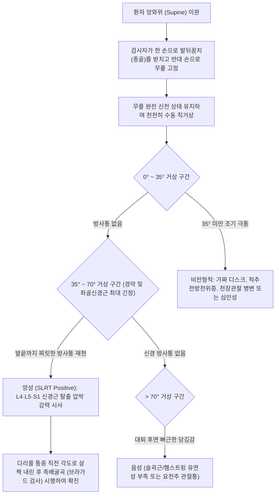

---
aliases:
  - 하지직거상 검사
  - 하지 직거상 검사
  - SLRT
  - Straight Leg Raise Test
  - 라세그 검사
  - Lasegue Test
tags:
  - 이학적검사
  - 요추
  - 좌골신경
  - 요추추간판탈출증
  - 신경근병증
  - 척추
---

# 하지직거상 검사 (Straight Leg Raise Test, SLRT)

> **핵심 3줄 요약 (Key Summary)**:
> 🎯 [[요추 추간판 탈출증]](Lumbar Herniated Intervertebral Disc, HIVD) 및 [[좌골신경통]](Sciatica) 환자에서 L4, L5, S1 신경근(Nerve root)의 기계적 압박 및 경막 긴장도를 평가하는 가장 대표적인 선별 이학적 검사.
> 🔍 무릎을 완전히 편 상태로 하지를 수동 거상할 때, **35°~70° 구간**에서 허리에서 둔부·대퇴 후면을 거쳐 종아리·발끝까지 찌릿하게 뻗치는 전형적인 방사통(Radicular pain)이 재현되면 양성.
> ⚠️ 70° 이상에서 발생하는 뻐근한 당김은 단순 [[햄스트링]](Hamstrings) 근막 긴장이며, 35° 미만에서의 통증은 위양성 또는 심인성/천장관절 병변을 시사하므로 [[브라가드 검사]](Bragard test)와의 병행 감별이 필수적임.

---

---

## 1. 검사 개요 (Test Overview)

* **검사 목적**: L4-L5, L5-S1 부위의 추간판 탈출 또는 골극에 의해 [[좌골신경]](Sciatic nerve)을 구성하는 L4, L5, S1 신경근이 기계적으로 압박·견인되는지 평가하여 [[요추 추간판 탈출증]]을 진단.
* **검사 대상**: 요통(Low back pain)과 함께 둔부, 허벅지 뒤쪽, 종아리 외측 또는 발바닥으로 뻗치는 저림·통증·감각 저하를 호소하는 환자.
* **소요 시간 및 준비물**: 1~2분 소요, 진찰대(Examination table), 각도기(Goniometer, 선택사항).

---

## 2. 해부학적 및 생체역학적 기전 (Anatomical & Biomechanical Mechanism)

### 2.1 좌골신경근의 해부학적 주행 및 고정점
* **신경근의 기원**: L4, L5, S1, S2, S3 척수신경 앞가지(Ventral rami)가 합쳐져 인체에서 가장 굵은 [[좌골신경]](Sciatic nerve)을 형성함.
* **주행 및 고정점**:
  * 근위부 고정: 척추간공(Intervertebral foramen)을 빠져나온 신경근은 경막낭(Dural sac) 및 황색인대(Ligamentum flavum) 주변 결합조직에 단단히 부착됨.
  * 원위부 주행: 대좌골공(Greater sciatic foramen)을 통해 [[이상근]](Piriformis) 하방으로 빠져나와 대퇴 후면의 [[대퇴이두근]], [[반건양근]], [[반막양근]] 사이를 지나 슬와부에서 [[경골신경]]과 [[총비골신경]]으로 분지됨.

> [천골신경총 및 좌골신경 기원 해부도(Gray829): L4~S3 신경근이 합류하여 좌골결절과 대전자 사이를 주행하는 경로]

### 2.2 거상 각도별 경막 및 신경근의 생체역학적 이동 (Critical Range)

> [하지직거상 각도별 병태생리: 0~35°(경막 이완 구간), 35~70°(추간판 위 좌골신경근 최대 긴장 구간), >70°(햄스트링 및 관절 통증 구간)]

1. **0° ~ 35° (Taking up slack / Slack Phase)**:
   * 좌골신경의 원위부 여유분(Slack)이 펴지는 단계로, 신경근이나 척수 경막(Dura)에는 유의미한 긴장력이나 이동이 발생하지 않음.
   * 이 각도에서 심한 통증을 호소한다면 급성 추간판 탈출증보다는 천장관절염, 척추전방전위증, 고관절 병변 또는 심인성(Malingering/Hoover test 필요)을 시사함.
2. **35° ~ 70° (Tension over Intervertebral Discs / Radicular Phase)**:
   * L4, L5, S1 신경근이 척추간공을 통해 바깥쪽 및 원위부로 약 2~6mm 가량 최대로 활주(Excursion)하며 팽팽하게 당겨지는 핵심 구간.
   * 추간판이 탈출되어 신경근이 이미 부종을 겪고 있거나 디스크 융기에 걸려 있는 경우, 신경근의 축방향 긴장력이 폭발적으로 증가하여 환자의 고유 피부분절(Dermatome)을 따라 종아리와 발끝까지 찌릿한 전격성 방사통이 촉발됨.
3. **> 70° (Joint & Muscle Strain Phase)**:
   * 신경근은 이미 최대 신장 길이에 도달하여 더 이상 이동하지 않음.
   * 70도 이상에서 느껴지는 허벅지 뒤쪽의 뻐근한 통증은 대부분 [[반건양근]], [[반막양근]], [[대퇴이두근]] 등 [[햄스트링]]의 유연성 한계에 의한 근막 신장통이거나 요천추 후관절의 압박통임.

> [하지직거상 각도 호(0°~90°): 35도에서 70도 사이의 방사통 발생 여부가 디스크 탈출증 진단의 핵심]

---

## 3. 단계별 검사 절차 (Step-by-Step Procedure)

### 1단계: 환자 앙와위 시작 자세 및 이완
* 환자를 검사대 위에 반듯하게 눕히고(Supine position), 베개는 낮게 받쳐 경추 과굴곡을 방지함.
* 양 다리를 편안하게 펴고 골반이 비틀리지 않도록 정렬함. 환자에게 다리의 힘을 완전히 빼도록 안심시킴.

> [하지직거상검사 1단계: 환자를 편안히 눕히고 양 무릎을 신전시킨 상태에서 검사 준비]

### 2단계: 종골 파지 및 슬관절 고정
* 검사자는 환자의 환측 발뒤꿈치(종골, Calcaneus) 아래를 한 손으로 부드럽게 감싸 쥠.
* 검사자의 반대 손은 환자의 슬개골 직상방(대퇴사두근 원위부)을 가볍게 얹어 검사 도중 무릎이 구부러지는(Flexion compensation) 것을 방지함.

> [교과서 표준 절차: 무릎 상방을 고정하고 종골을 받쳐 무릎 굴곡 보상을 차단하며 천천히 수동 거상]

### 3단계: 천천히 수동 직거상 및 각도 측정
* 무릎을 완전히 편 상태를 유지하며 환자의 다리를 천천히 수직 방향으로 들어 올림.
* 환자에게 "다리를 올릴 때 허리나 다리 쪽으로 통증이 생기면 즉시 말씀해 주십시오"라고 안내함.
* 통증이나 저림이 시작되는 순간 거상을 멈추고, 검사대와 하지 사이의 거상 각도(Degree)를 정밀하게 기록함.

> [하지직거상검사 3단계: 다리를 수동 거상하며 방사통 발현 각도를 정밀 측정하고 양측을 반드시 비교]

### 4단계: 감별 확진 추가 수기 (브라가드 검사 & 네리 징후)
* **[[브라가드 검사]](Bragard Test)**: 방사통이 시작된 각도에서 다리를 5도 가량 살짝 내려 통증이 사라지게 한 뒤, 발목을 강하게 족배굴곡(Dorsiflexion)시킴. 통증이 다시 폭발적으로 나타나면 신경근병증 확진.
* **[[네리 징후]](Neri's Sign)**: 다리를 든 상태에서 환자의 고개를 수동으로 굴곡(Neck flexion)시켜 경막 전체를 위쪽으로 당겼을 때 요하지 방사통이 악화되는지 확인.

> [브라가드 검사 연계: 다리를 살짝 내린 후 발목을 배굴시켜 좌골신경을 선택적으로 신장]

> [네리 징후 연계: 경추 굴곡을 통해 척수 경막낭을 견인하여 신경근 긴장도를 추가 유발]

---

## 4. 양성 반응 및 임상적 해석 (Positive Sign & Clinical Interpretation)

### 4.1 진성 양성 (True Positive) 판정 기준
* **양성 (SLRT Positive)**:
  * **35° ~ 70° 각도 범위**에서 다리를 들어 올릴 때, 허리나 엉덩이에서 시작하여 허벅지 뒤쪽, 오금, 종아리, 발가락 끝까지 뻗어나가는 **전형적인 전격성 방사통(Shooting radicular pain)이나 심한 저림**이 환자가 평소 앓던 증상과 동일하게 재현되는 경우.
* **위양성 (False Positive / Hamstring Tightness)**:
  * 방사통 없이 단순히 허벅지 뒤쪽(오금 부위)이 팽팽하게 당기거나 뻐근한 느낌(Tightness)만 호소하는 경우 $\rightarrow$ 슬괵근 단축.
* **교차 하지직거상 검사 (Crossed SLRT / Well-leg SLRT)**:
  * 건강한 쪽(건측) 다리를 들어 올렸을 때, 아픈 쪽(환측) 다리에 극심한 방사통이 재현되는 현상.
  * 민감도는 25~30%로 낮으나, **특이도가 90~97%**에 달하여 심한 중심성 또는 거대 추간판 탈출증(Axillary herniation)을 강력히 시사함.

---

## 5. 감별 진단 (Differential Diagnosis)

| 질환 구분 | SLRT 반응 및 특징 | 브라가드(Bragard) 검사 | 핵심 감별 요점 |
| :--- | :--- | :--- | :--- |
| **[[요추 추간판 탈출증]]** | **35°~70°에서 명확한 방사통** | **양성 (발목 배굴 시 방사통 재현)** | 전형적인 피부분절 감각 저하, 기침·배변 시 통증 악화 |
| **[[척추관 협착증]]** | 대개 **음성** (정상 각도 거상 가능) | 음성 | 신경인성 간헐적 파행(Claudication), 허리 후굴 시 악화 |
| **[[이상근 증후군]]** | 둔부 통증 위주, 60° 전후 통증 | 음성 또는 미약 | [[FAIR 검사]] 양성, 좌골신경 출구부 압통, 이상근 스트레칭 시 악화 |
| **천장관절 증후군** | 70° 이상 골반 회전 시 둔부 통증 | 음성 | [[패트릭 검사]](FABER) 양성, 천장관절선 직접 압통 |
| **슬괵근(햄스트링) 구축** | 70° 부근 대퇴 후면 뻐근한 당김 | 음성 (배굴 무관) | 무릎을 살짝 구부리면 통증 즉시 소실, 신경 증상 무 |

---

## 6. 검사 신뢰도 및 통계 (Diagnostic Accuracy)

* **민감도 (Sensitivity)**: **85% ~ 92%** (매우 높음 - 우수한 선별 검사)
* **특이도 (Specificity)**: **41% ~ 45%** (상대적으로 낮음 - 위양성 빈발)
* **양성우도비 (LR+)**: **1.5 ~ 1.7**
* **음성우도비 (LR-)**: **0.19 ~ 0.25** (음성일 때 디스크 배제율 우수)

> [!IMPORTANT]
> SLRT는 **민감도가 극히 높아 디스크 탈출증을 배제(Rule-out)하는 선별 검사로는 최적**이지만, 햄스트링 단축이나 천장관절 문제로 인한 위양성이 흔해 단독 확진용으로는 특이도가 떨어집니다. 따라서 반드시 **[[브라가드 검사]](특이도 약 85%) 및 교차 SLRT(특이도 약 95%)**를 병합해야만 진단 정확도를 완성할 수 있습니다.

---

## 7. 진료실 핵심 임상 필기 (Clinical Pearls & Practice Tips)

### 7.1 반응 양상에 따른 디스크 예후 및 병기 판정 7단계 (원장님 핵심 프로토콜)
1. **음성 반응 (각도 제한 없음, 무증상)**:
   * 디스크 탈출 크기가 매우 작거나(Bulging), 이미 탈출된 수핵이 흡수·안정화된 단계.
2. **동통호(Painful Arc)가 있고 각도 제한은 없음**:
   * 특정 각도(예: 45도 부근)에서만 살짝 찌릿하고 끝까지 거상 가능함 $\rightarrow$ 디스크 크기가 작고 신경 유착이 경미하여 예후가 매우 양호함.
3. **동통호가 있고 종말 가동범위 제한 동반**:
   * 통증 구간을 지나 더 올리려 하면 저항이 걸림 $\rightarrow$ 초기 염증성 부종이 동반된 상태로 침상 안정 및 소염 치료 요망.
4. **통증 발생 + 각도 제한 현저 + 신경학적 결손(감각/근력) 없음**:
   * 탈출된 수핵의 부피는 크나 신경 전도 장애까지는 초래하지 않음 $\rightarrow$ 적극적인 한의 보존적 치료(침·약침·추나)로 90% 이상 완치 가능.
5. **통증 극심 + 30도 이하 현저한 제한 + 신경학적 결손(족하수, 모지신전력 약화, DTR 소실)**:
   * 신경근이 심하게 짓눌려 운동 섬유까지 손상된 상태 $\rightarrow$ 마미증후군(Cauda equina) 징후 확인 및 정밀 MRI 촬영, 신경외과 수술 의뢰 고려.
6. **SLRT는 음성인데 하지 감각 마비 및 근력 약화 잔존**:
   * 만성 신경 압박으로 인해 감각 수용기가 마비된 허혈성 신경근 위축 상태 $\rightarrow$ 통증이 없다고 나은 것이 아니므로 주의.
7. **통증은 없으나 가동 범위가 40~50도에서 뻣뻣하게 멈춤**:
   * 만성 염증 후 섬유성 결손으로 인한 신경근-경막 외막 유착(Adhesion)이 원인.

### 7.2 진료실 실전 테크닉 및 환자 지도 팁
* **무릎 굴곡 보상 방지 노하우**:
  * 환자는 통증을 회피하기 위해 다리를 올리는 순간 무릎을 살짝 굽히거나 반대쪽 엉덩이를 띄우려는 보상 작용(Compensation)을 씁니다. 시술자의 손으로 슬개골 상부를 단단히 지지하여 무릎이 1도라도 굽혀지지 않게 통제해야 정확한 신경 긴장도가 유발됩니다.
* **한의 치료 및 원내 임상 가이드**:
  * **신바로약침 / 중성어혈약침 협척혈 정밀 주입**:
    * SLRT 양성 각도가 낮을수록 신경근 주위의 화학적 염증과 부종이 심한 상태입니다. 해당 요추 분절(L4-L5, L5-S1) 요추 협척혈(Ex-B2) 및 대장수, 관원수 부위에 심부 침 직자를 통해 약침 1.0~2.0cc를 주입하여 국소 염증 물질(TNF-α, IL-6)을 배출시킵니다.
  * **환도, 위중, 곤륜 배혈 및 저주파 전침**:
    * 좌골신경 주행 경로의 요혈인 환도(GB30), 은문(BL37), 위중(BL40), 승산(BL57), 곤륜(BL60)에 자침 후 2Hz 전침 자극을 가해 신경근 유착을 풀고 신경성 혈류를 개선합니다.
  * **추나치료(신연 요법 - Cox Distraction)**:
    * 굴곡-신연 테이블을 이용하여 요추 추간판의 음압을 형성하고 척추간공을 넓혀 신경근 감압을 유도합니다.

---

## 8. 출처 및 현대 학술 연구 요약 (References)

* **Devillé WL, et al.** (2000). *The test of Lasègue: systematic review of the accuracy in predicting herniated discs.* **Spine**, 25(9): 1140-1147.
  * DOI: [10.1097/00007632-200005010-00016](https://doi.org/10.1097/00007632-200005010-00016) | PubMed: [PMID: 10788860](https://pubmed.ncbi.nlm.nih.gov/10788860/)
  * `[연구 요약]`: 하지직거상 검사(라세그 검사)의 진단 정확도를 메타분석하여, 요추 추간판 탈출증 진단 시 민감도 91%, 특이도 52%를 확인하고, 선별 검사로서의 독보적 임상 가치를 확립한 논문.
* **Breig A, Troup JD.** (1979). *Biomechanical considerations in the straight-leg-raising test. Cadaveric and clinical studies of the movements of the spinal cord and nerve roots.* **Spine**, 4(3): 242-250.
  * DOI: [10.1097/00007632-197905000-00010](https://doi.org/10.1097/00007632-197905000-00010) | PubMed: [PMID: 462311](https://pubmed.ncbi.nlm.nih.gov/462311/)
  * `[연구 요약]`: 카데바 및 임상 실험을 통해 하지 거상 각도에 따른 척수 및 신경근의 실제 이동 거리를 계측하여, 35~70도 구간에서 신경근이 추간판 위를 활주하며 최대 긴장을 받는다는 생체역학적 기전을 규명.
* **van der Windt DA, et al.** (2010). *Physical examination for lumbar radiculopathy due to disc herniation in patients with low-back pain.* **Cochrane Database Syst Rev**, 2010(2): CD007431.
  * DOI: [10.1002/14651858.CD007431.pub2](https://doi.org/10.1002/14651858.CD007431.pub2) | PubMed: [PMID: 20166095](https://pubmed.ncbi.nlm.nih.gov/20166095/)
  * `[연구 요약]`: 코크란 리뷰를 통해 요추 신경근병증의 이학적 검사들을 종합 평가하고, SLRT의 높은 민감도와 교차 SLRT의 높은 특이도의 상호보완적 결합을 권고함.