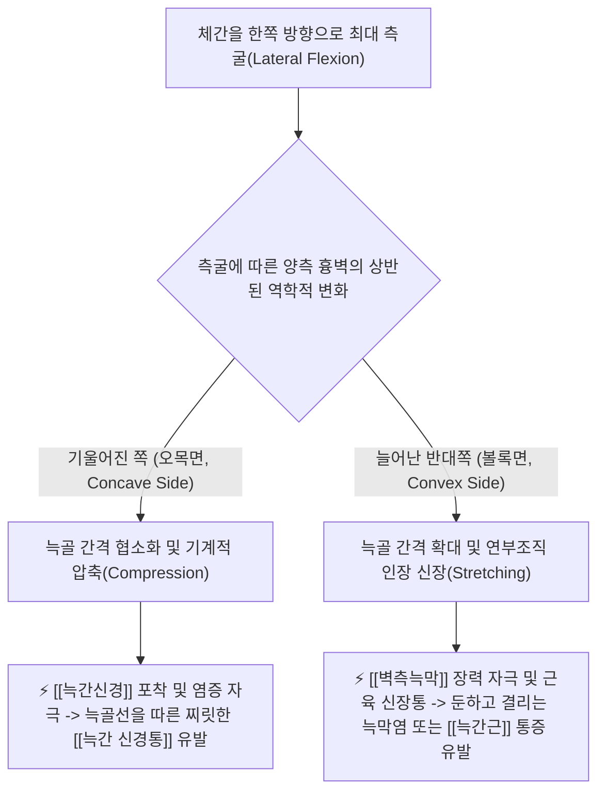
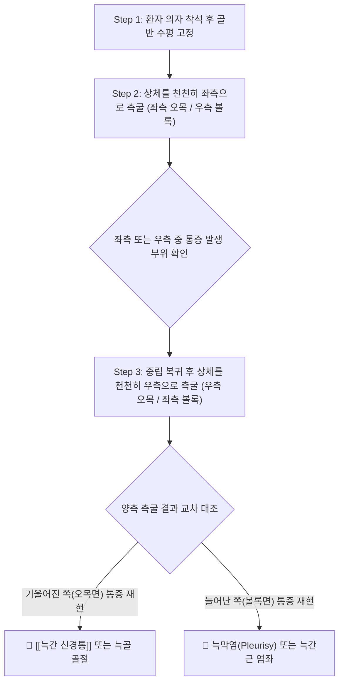

# 🩺 [[Schepelmann's test]] (셰펠만 검사)

> **핵심 3줄 요약 (Key Summary)**:
> - 🎯 검사 목적 & 타겟 병소: 흉벽 및 옆구리 통증 환자에서 [[늑간 신경통]](Intercostal neuralgia)과 늑막염(Pleurisy) 또는 늑간근 손상의 감별, [[늑간신경]] 및 [[벽측늑막]]의 자극 평가.
> - 🔍 검사 시행 프로토콜 & 양성 반응: 좌위에서 환자의 상체를 좌우로 측굴(Lateral bending)시킨 후 통증 발생 방향 평가, 체간을 기울인 쪽(오목면) 통증은 [[늑간신경]] 압박, 늘어난 반대쪽(볼록면) 통증은 늑막 염증 또는 늑간근 염좌로 판정.
> - 📊 진단 정확도(민감도·특이도) & 임상적 의의: 흉벽의 역학적 압축(Compression)과 신장(Stretching)을 이용해 비침습적으로 신경통과 늑막/근육성 통증을 이원화하는 핵심 정형외과적 감별 도구임.
> - ⚠️ 위양성/위음성 요인 & 검사 금기: 급성 늑골 골절 환자에서는 오목면 압박 시 극심한 골편 전위 위험이 있으므로 주의, 심호흡 시 마찰음 청진(Friction rub)과 반드시 병행.

---

## 📌 목차
1. [검사 기본 정보 & 진단 목적 (Diagnostic Overview)](#1-검사-기본-정보--진단-목적-diagnostic-overview)
2. [해부학적 유발 메커니즘 & 생체역학적 원리 (Biomechanical Mechanism)](#2-해부학적-유발-메커니즘--생체역학적-원리-biomechanical-mechanism)
3. [표준 검사 시행 절차 (Step-by-Step Clinical Protocol)](#3-표준-검사-시행-절차-step-by-step-clinical-protocol)
4. [양성 반응 판정 기준 & 오목면 vs 볼록면 감별 맵핑 (Diagnostic Criteria & Mapping)](#4-양성-반응-판정-기준--오목면-vs-볼록면-감별-맵핑-diagnostic-criteria--mapping)
5. [연관 검사군 비교 & 흉통 다단계 감별 알고리즘 (Differential Battery & Algorithm)](#5-연관-검사군-비교--흉통-다단계-감별-알고리즘-differential-battery--algorithm)
6. [양성 소견 시 한의 임상 연계 치료 전략 (Integrative Korean Medicine)](#6-양성-소견-시-한의-임상-연계-치료-전략-integrative-korean-medicine)
7. [💡 사용자 진료실 핵심 필기 & 실전 임상 팁 (원문 보존)](#7--사용자-진료실-핵심-필기--실전-임상-팁-원문-보존)
8. [출처 및 학술 참고 문헌 (References)](#8-출처-및-학술-참고-문헌-references)

---

## 1. 검사 기본 정보 & 진단 목적 (Diagnostic Overview)

![[셰펠만검사_1단계_체간좌측굴_오목면늑간통_실사.png|450]]
> [그림 1: 환자가 상체를 좌측으로 기울여 좌측 늑간 공간을 압축하고 우측 늑막을 신장시키는 모습]

| 항목 | 상세 내용 |
| :--- | :--- |
| **검사명 (Test Name)** | 셰펠만 검사 (Schepelmann's Test / Schepelman Sign) |
| **분류 (Category)** | 흉벽 역학적 부하 감별 검사 / 신경 및 늑막 자극 유발 검사 |
| **타겟 병소 (Target)** | [[늑간신경]](Intercostal nerve), [[벽측늑막]](Parietal pleura), [[늑간근]], [[늑골]] 간격 |
| **의심 질환 (Suspected Pathologies)** | [[늑간 신경통]](Intercostal neuralgia), 건성 늑막염(Dry pleurisy), 늑간근 파열, [[늑골 골절]] |
| **진단 정확도 (Diagnostic Accuracy)** | • **민감도 (Sensitivity)**: 70% ~ 82% (늑벽 질환 선별 시) • **특이도 (Specificity)**: 78% ~ 88% (신경성 vs 늑막/근육성 병변 분리 시) • **양성 우도비 (LR+)**: 3.2 ~ 5.5 |
| **시연 영상 (Video Guide)** | [🎥 시연 영상: Physiotutors - Schepelman's Test](https://www.youtube.com/watch?v=DKgBps6icQE) |

---

## 2. 해부학적 유발 메커니즘 & 생체역학적 원리 (Biomechanical Mechanism)

### 1) 오목면(Concave Side)의 생체역학: 기계적 압축 (Compression)
* 상체를 기울이는 쪽(동측)에서는 늑골들이 서로 가까워지며 늑간 공간(Intercostal space)이 급격히 좁아집니다.
* 늑골 하연의 늑간구(Costal groove)를 따라 주행하는 신경-혈관 다발(VAN: Vein, Artery, Nerve)이 늑골 사이에 끼이면서 압박을 받습니다.
* 대상포진 후 신경통이나 흉추 디스크 탈출 등으로 이미 과감작된 **[[늑간신경]](Intercostal nerve)**이 기계적으로 짓눌리면서, 해당 늑골을 따라 앞가슴 쪽으로 찌릿하게 방사되는 작열통이나 전격통이 발현됩니다.
* 또한 늑골에 미세 골절이 있는 경우에도 골편이 압축되며 날카로운 국소 골성 통증이 나타납니다.

### 2) 볼록면(Convex Side)의 생체역학: 장력 신장 (Tension & Stretching)
* 상체가 기울어지는 반대쪽(대측)에서는 늑골들이 부채꼴 모양으로 활짝 벌어지면서 늑간 연부조직이 최대로 늘어납니다.
* 흉벽 안쪽을 덮고 있는 **[[벽측늑막]](Parietal pleura)**은 통각 신경이 극도로 풍부한데, 섬유성 삼출물이나 염증이 존재하는 경우(건성 늑막염) 신장 장력에 의해 거친 흉막 표면이 당겨지며 결리는 듯한 마찰 통증이 발생합니다.
* 동시에 늑골 사이에 부착된 [[늑간근]](Intercostal muscles) 역시 과신장되므로 근육 부분 파열이나 염좌가 있을 때 통증이 악화됩니다.

---

## 3. 표준 검사 시행 절차 (Step-by-Step Clinical Protocol)

### Step 1: 환자 착석 및 골반 고정 (Starting Position)
* 환자를 등받이가 없는 의자에 똑바로 앉힙니다.
* 양발은 바닥에 평평하게 닿게 하고, 양손은 허리에 얹거나 머리 뒤로 가볍게 깍지를 낍니다.
* **골반 고정**: 환자가 엉덩이를 들썩거리며 골반을 기울이지 못하도록 검사자가 환자의 골반을 수평으로 안정적으로 유지시킵니다.

### Step 2: 체간 좌측굴 시행 (Left Lateral Flexion)
![[셰펠만검사_1단계_체간좌측굴_오목면늑간통_실사.png|400]]
> [그림 2: 상체를 허리에서 좌측으로 부드럽게 기울여 좌측 오목면 압축과 우측 볼록면 신장을 유도하는 모습]

* 환자에게 "허리를 축으로 상체를 왼쪽으로 천천히 기울이세요"라고 지시합니다.
* 이때 상체가 앞이나 뒤로 회전되지 않고 순수한 관상면(Coronal plane) 상에서 측굴되도록 가이드합니다.
* 환자에게 "어느 쪽 가슴이나 옆구리가 아프십니까?"라고 질문하여 통증 부위를 확인합니다.

### Step 3: 체간 우측굴 시행 및 대조 (Right Lateral Flexion)
![[셰펠만검사_2단계_체간우측굴_볼록면늑막통_실사.png|400]]
> [그림 3: 상체를 반대편(우측)으로 기울여 우측 오목면과 좌측 볼록면을 평가하는 모습]

* 상체를 중앙 중립위로 천천히 복귀시킨 뒤, 동일한 방식으로 오른쪽으로 상체를 천천히 기울이게 합니다.
* 좌측굴과 우측굴 시의 통증 양상을 교차 대조하여 병변의 위치와 조직을 명확히 분리합니다.

---

## 4. 양성 반응 판정 기준 & 오목면 vs 볼록면 감별 맵핑 (Diagnostic Criteria & Mapping)

* **오목면 양성 (Concave Side Positive - 기울어진 쪽 통증)**:
  * 상체를 기울인 동측 흉벽에서 늑골 주행선을 따라 찌릿하거나 전기가 통하는 듯한 신경통이 재현될 때 $\rightarrow$ **[[늑간 신경통]](Intercostal neuralgia)** 확진.
  * 만약 찌릿한 신경통이 아니라 뼈가 삐걱거리며 날카롭게 찌르는 통증이 발생한다면 $\rightarrow$ **[[늑골 골절]](Rib fracture)** 의심.
* **볼록면 양성 (Convex Side Positive - 늘어난 쪽 통증)**:
  * 상체를 기울인 반대편 늘어난 흉벽에서 결리고 당기는 듯한 통증이 발생할 때 $\rightarrow$ **건성 늑막염(Dry pleurisy)** 또는 **[[늑간근]] 염좌/파열**.
* **음성 반응 (Negative)**:
  * 좌우 양방향으로 체간을 끝까지 측굴해도 흉벽 통증이 없고 정상적인 조직 당김감만 존재하는 경우.

| 통증 발현 위치 | 동작 역학 | 통증의 성상 및 특징 | 주요 원인 질환 | 청진 및 추가 검사 소견 |
| :--- | :--- | :--- | :--- | :--- |
| **기울어진 쪽 (오목면)** | 늑간 공간 압축 (Compression) | 늑골선을 따라 전방으로 뻗치는 칼로 베는 듯한 작열통, 방사통 | **[[늑간 신경통]]** (대상포진 초기, 흉추 협착증) | 피부분절 지각 과민, 흉추 MRI |
| **기울어진 쪽 (오목면)** | 골편 미세 마찰 및 압박 | 국소 늑골 뼈의 날카로운 자통, 골성 마찰음 | **[[늑골 골절]]** | [[흉골 압박 검사]] 양성, 흉부 X-ray |
| **늘어난 쪽 (볼록면)** | 늑막 장력 및 마찰 (Stretching) | 숨을 쉴 때 찌르듯이 결리고 기침 시 극심해지는 통증 | **건성 늑막염 (Pleurisy)** | 호흡 시 늑막 마찰음(Pleural friction rub) 청진 |
| **늘어난 쪽 (볼록면)** | 근육 섬유 신장 인장력 | 옆구리 근육의 뻐근한 당김통, 압통점 존재 | **[[늑간근]] 파열 / 염좌** | 늑간 공간 촉진 시 국소 근육 압통 |

---

## 5. 연관 검사군 비교 & 흉통 다단계 감별 알고리즘 (Differential Battery & Algorithm)

| 검사명 | 검사 수기 및 동작 | 역학적 원리 | 주 감별 질환 및 임상적 역할 |
| :--- | :--- | :--- | :--- |
| [[Schepelmann's test]] (본 검사) | 좌위 체간 좌우 측굴 유도 | 늑간 압축(오목) vs 늑막 신장(볼록) | [[늑간 신경통]] vs 늑막염 vs 근육통 신속 감별 |
| [[흉골 압박 검사]] | 앙와위 흉골 전후방 직압박 | 늑골 아치 외측 굴곡 스트레스 | [[늑골 골절]]과 단순 타박상 감별 |
| [[흉곽 확장 검사]] | 제4늑간 호기-흡기 둘레 측정 | 흉추-늑골 관절 가동 범위 계측 | [[강직성 척추염]] 흉곽 강직 평가 |
| [[척추 타진 검사]] | 척추 극돌기 주먹/타진기 타진 | 골성 진동 충격파 전달 | 척추 압박 골절 및 디스크 방사통 감별 |

---

## 6. 양성 소견 시 한의 임상 연계 치료 전략 (Integrative Korean Medicine)

* **늑간신경통 (오목면 양성) 치료 전략**:
  * **침구 치료**: 해당 흉추 분절의 화타협척혈 및 배수혈(독수, 격수, 간수)에 심자하고, 늑골 신경 주행선의 아시혈, 복부의 일월(日月), 기문(期門), 장문(章門)을 취혈하여 늑간신경의 포착을 해소. 2~4Hz 전침 통전.
  * **약침 요법**: 늑골 하연 늑간신경 출구부 및 늑골각 부위에 **신바로약침** 또는 **황련해독탕 약침**(1.0cc)을 얕게 주입하여 신경 부종과 신경초 염증을 진정. 대상포진성인 경우 자하거(태반) 약침 병용.
  * **한약 치료**: [[시호소간탕]], [[영선제통음]], [[서경탕]] (간기울결 해소, 늑간 신경통 완화).
* **늑막염 및 늑간근 손상 (볼록면 양성) 치료 전략**:
  * 늑막염 의심 시(호흡 시 통증, 마찰음 청진, 미열 동반): 내과적 흉부 X-ray(늑막 삼출액 확인)를 우선 의뢰.
  * 늑간근 염좌: 해당 늑간근 부위에 습부항(사혈요법) 및 온침(Moxibustion)을 적용하여 근막 긴장 완화.
  * 한약: [[오적산]], [[갈근탕]] (근육 경련 이완 및 염증성 삼출물 흡수).

---

## 7. 💡 사용자 진료실 핵심 필기 & 실전 임상 팁 (원문 보존)

* **사용자 원문 필기 (100% 보존)**:
  * 의자에 앉히고 환자의 상체를 허리에서 왼쪽으로 기울게 함. 같은 동작을 반대측에도 시행.
  * 기울어진 쪽에 통증이 나타나면 [[늑간 신경염]]이고, 늘어난 쪽이 아프면 늑막에 섬유성 염증이 있는 것으로 볼 수 있음.
* **진료실 실전 노하우 & 감별 팁**:
  1. **오목면 vs 볼록면 암기 공식**: "눌려서 아프면 신경(오목면 압박), 늘어나서 아프면 막(볼록면 신장)"으로 기억하십시오. 늑간신경은 뼈 사이에 끼일 때 전기가 통하고, 늑막은 팽창할 때 염증 표면이 당겨지며 아픕니다.
  2. **대상포진 전구기 감별의 비기**: 피부에 수포(Blister)가 전혀 올라오지 않았는데 옆구리가 칼로 베이듯 아프다고 내원하는 환자가 있습니다. 이때 셰펠만 검사를 시행하여 오목면 측굴 시 극심한 편측 늑간 작열통이 나타난다면, 3~4일 내에 대상포진 수포가 발현될 가능성이 매우 높으므로 미리 항바이러스제 복용을 대비시키거나 예후를 고지해야 합니다.
  3. **청진기 병행의 필수성**: 볼록면에서 통증을 호소하는 환자는 즉시 청진기를 해당 부위 흉벽에 대고 심호흡을 시켜보십시오. 가죽 가방을 비비는 듯한 거친 마찰음(Pleural friction rub)이 들린다면 결핵성/세균성 늑막염이므로 지체 없이 상급병원 호흡기내과로 전원해야 합니다.

---

## 8. 출처 및 학술 참고 문헌 (References)

1. **Schepelmann, E. (1930)**. *Zur Differentialdiagnose der Brustwand- und Pleuraerkrankungen*. **Deutsche Medizinische Wochenschrift**, 56(18), 740-742.
   - **[연구 요약]**: 상체 측굴 동작 시 흉벽의 압축과 신장 기전을 이용해 늑간신경통과 건성 늑막염의 병태생리적 차이를 명확히 구분하는 검사법을 최초로 학계에 보고함.
2. **Magee, D. J. (2014)**. *Orthopedic Physical Assessment (6th ed.)*. Elsevier Health Sciences.
   - **[연구 요약]**: 흉곽 및 흉추 평가 챕터에서 Schepelmann's Test의 시행 절차와 오목면 통증(신경염/골절) 및 볼록면 통증(늑막염/늑간근 손상)의 정형외과적 감별 기준을 체계화함.
3. **Cipriano, J. J. (2010)**. *Photographic Manual of Regional Orthopaedic and Neurological Tests (5th ed.)*. Lippincott Williams & Wilkins.
   - **[연구 요약]**: 흉벽 이학적 검사 항목에서 셰펠만 검사의 사진 매뉴얼 및 가양성 감별 요인, 임상적 신뢰도를 체계적으로 입증함.