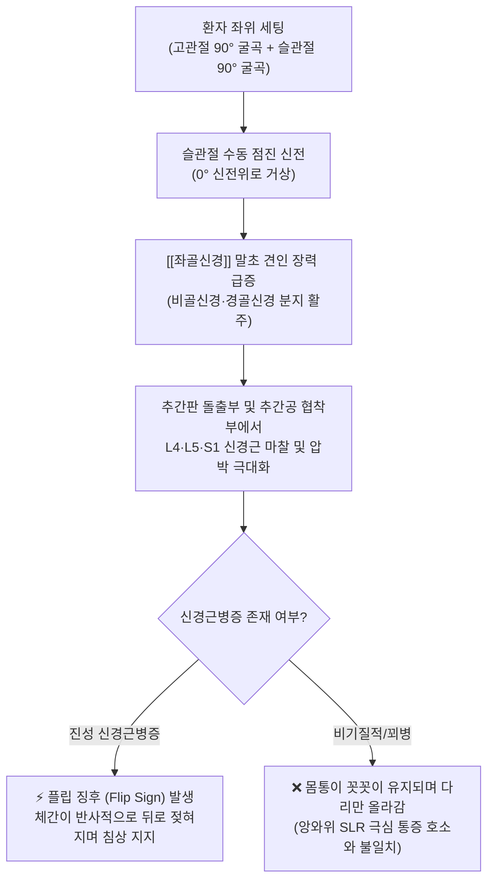
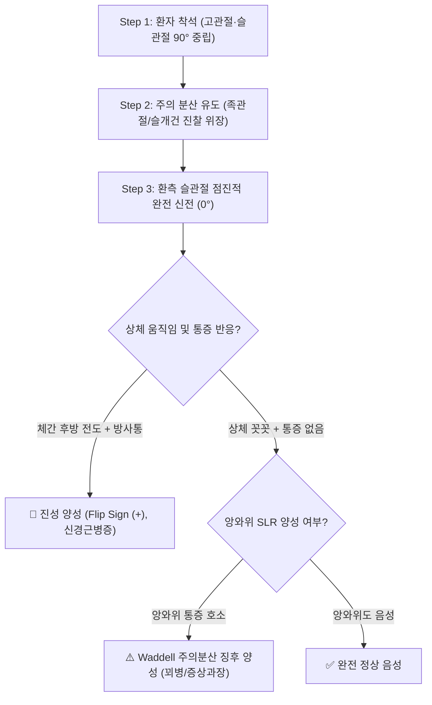

---
aliases:
  - "Seated Laseque test"
  - "Seated Lasègue Test"
  - "좌위 라세그 검사"
  - "좌위 하지직거상 검사"
tags:
  - "이학적검사"
  - "요추"
  - "좌골신경통"
  - "신경근병증"
---

# 🩺 [[Seated Laseque test]] (좌위 라세그 검사 / Flip test, Seated SLR)

> **핵심 3줄 요약 (Key Summary)**:
> - 🎯 검사 목적 & 타겟 병소: 하부 요추 [[추간판 탈출증]](L4-L5, L5-S1) 및 [[척추관 협착증]]에 의한 [[좌골신경]] 및 요천추 신경근(L4, L5, S1) 기계적 포착 유발, 앙와위 [[SLR test]] 결과와의 일치도를 통한 기질적 신경병증 vs 비기질적 증상 과장(꾀병/Malingering) 감별.
> - 🔍 검사 시행 프로토콜 & 양성 반응: 환자를 침상 가장자리에 걸터앉힌(고관절 90° 굴곡) 상태에서 검사자가 환측 슬관절을 점진적으로 0°까지 수동 신전시키며, 좌골신경 장력 급증 시 환자가 통증을 회피하기 위해 상체를 뒤로 젖히며 손으로 침상을 짚는 전형적인 플립 징후(Flip sign) 및 하지 방사통 재현 시 양성.
> - 📊 진단 정확도(민감도·특이도) & 임상적 의의: 민감도(Sensitivity) 약 41~49%, 특이도(Specificity) 약 69~85%, 앙와위 [[SLR test]]에서 30° 미만 극심한 통증을 호소하던 환자가 좌위에서 무릎을 90° 완전히 펴도 몸통이 그대로 있고 통증이 없다면 Waddell 비기질적 징후 양성(증상 과장)으로 판정.
> - ⚠️ 위양성/위음성 요인 & 검사 금기: 슬괵근(Hamstrings) 구축 환자에서 단순 무릎 뒤 당김을 방사통으로 오인하는 위양성 주의, 슬관절 굴곡 구축 또는 고관절 중증 관절염 시 검사 제한, 족관절 배굴(Bragard)을 부가하여 신경성 vs 근육성 감별 필수.

---

## 📌 목차
1. [검사 기본 정보 & 진단 목적 (Diagnostic Overview)](#1-검사-기본-정보--진단-목적-diagnostic-overview)
2. [해부학적 유발 메커니즘 & 생체역학적 원리 (Biomechanical Mechanism)](#2-해부학적-유발-메커니즘--생체역학적-원리-biomechanical-mechanism)
3. [표준 검사 시행 절차 (Step-by-Step Clinical Protocol)](#3-표준-검사-시행-절차-step-by-step-clinical-protocol)
4. [양성 반응 판정 기준 & 신경근/조직별 감별 맵핑 (Diagnostic Criteria & Mapping)](#4-양성-반응-판정-기준--신경근조직별-감별-맵핑-diagnostic-criteria--mapping)
5. [연관 검사군 비교 & 다단계 감별 알고리즘 (Differential Battery & Algorithm)](#5-연관-검사군-비교--다단계-감별-알고리즘-differential-battery--algorithm)
6. [양성 소견 시 한의 임상 연계 치료 전략 (Integrative Korean Medicine)](#6-양성-소견-시-한의-임상-연계-치료-전략-integrative-korean-medicine)
7. [💡 사용자 진료실 핵심 필기 & 실전 임상 팁 (원문 보존)](#7--사용자-진료실-핵심-필기--실전-임상-팁-원문-보존)
8. [출처 및 학술 참고 문헌 (References)](#8-출처-및-학술-참고-문헌-references)

---

## 1. 검사 기본 정보 & 진단 목적 (Diagnostic Overview)

![[좌위라세그_플립검사_1단계_좌위시작자세.jpg|450]]
> [그림 1: 좌위 라세그·플립 검사의 초기 세팅 - 환자가 진찰대 가장자리에 고관절과 슬관절을 각각 90° 굴곡하고 자연스럽게 걸터앉은 중립 착석 상태]

![[좌위라세그_좌골신경주행_병태해부도.jpg|450]]
> [그림 2: 좌골신경(Sciatic nerve)의 주행 경로와 요천추 신경근(L4~S1) 압박 및 슬관절 신전에 따른 견인 장력 발생 부위 도해]

| 항목 | 상세 내용 |
| :--- | :--- |
| **검사명 (Test Name)** | Seated Lasègue Test (좌위 라세그 검사 / [[Flip test]], Seated Straight Leg Raise Test / SSLR) |
| **이명 및 관련 징후** | 플립 검사(Flip Test), 주의분산 하지직거상 검사(Distraction SLR), Waddell 주의분산 징후(Waddell Distraction Sign) |
| **분류 (Category)** | 신경학적 긴장 유발 검사 (Neural Tension Test) & 비기질적 증상 감별 검사 (Nonorganic Malingering Test) |
| **타겟 병소 (Target)** | [[좌골신경]](Sciatic nerve), 요천추 신경근(L4, L5, S1), 경막낭(Dural sac) |
| **의심 질환 (Suspected Pathologies)** | 하부 요추 [[추간판 탈출증]](LDH), [[척추관 협착증]], 요천추 신경근병증, 비기질적 요통(Malingering / Symptom magnification) |
| **진단 정확도 (Diagnostic Accuracy)** | • **민감도 (Sensitivity)**: 41% ~ 49% (단독 선별 가치는 앙와위 SLR보다 낮음) • **특이도 (Specificity)**: 69% ~ 85% (플립 징후 동반 시 특이도 상승) • **Waddell 주의분산 일치도**: 앙와위와 30° 이상 차이 발생 시 꾀병 특이도 90% 이상 |
| **시연 영상 (Video Guide)** | [🎥 시연 영상: Clinically Relevant - Flip Test](https://www.youtube.com/watch?v=EWjMWJ6WFdM) |

---

## 2. 해부학적 유발 메커니즘 & 생체역학적 원리 (Biomechanical Mechanism)

### 1) 해부학적 스트레스 전달 경로
* 환자가 의자나 진찰대에 앉아 있는 자세(Sitting)는 이미 고관절이 90° 굴곡되어 있어 대퇴 후면의 [[좌골신경]]이 팽팽한 기초 긴장(Pre-tension) 상태를 유지합니다.
* 이 상태에서 무릎(슬관절)을 90° 굴곡에서 0° 신전으로 펴 올리면, 종아리 및 발목으로 주행하는 경골신경과 총비골신경이 말초로 강하게 당겨집니다.
* 이 당김력은 근위부 좌골신경 간(Sciatic trunk)과 대퇴골 대전자-좌골결절 사이 간극을 거쳐 요추 추간공 내의 L4, L5, S1 신경근을 원위부 방향으로 최대 2~6mm 활주·견인시킵니다.
* 탈출된 추간판(Disc herniation)이나 골극, 비후된 황색인대가 신경근을 압박하고 있을 경우 극심한 신경 마찰과 압박성 허혈이 발생합니다.

### 2) 플립 징후(Flip Sign)의 생체역학적 회피 반사
* 무릎이 펴지는 순간 신경근에 가해지는 견인 장력을 완화하기 위해 환자는 무의식적으로 고관절의 굴곡 각도를 90°에서 45°~30°로 급격히 줄여야만 합니다.
* 따라서 환자는 상체를 뒤로 확 젖히며(Trunk extension), 체중을 뒤로 실어 양손으로 침상 바닥을 짚으며 몸통이 뒤로 넘어가는 듯한 회피 동작인 **플립 징후(Flip sign)**를 반사적으로 나타냅니다.
* 이는 단순 통증 호소가 아닌, 척수 반사 수준의 신경 기계적 회피 동작이므로 위조하기 매우 어렵습니다.

---

## 3. 표준 검사 시행 절차 (Step-by-Step Clinical Protocol)

### Step 1: 환자 준비 및 착석 자세 (Starting Position)
* 환자는 양발을 바닥에 자연스럽게 늘어뜨리고 진찰대 가장자리에 바르게 걸터앉습니다.
* 고관절과 슬관절은 편안하게 90° 굴곡 상태를 유지합니다.
* 검사자는 환자의 옆이나 앞에 위치하여 환자의 무릎과 발목을 지지합니다.

### Step 2: 자연스러운 주의 분산 유도 (Distraction Technique)
* 💡 **실전 핵심 기법**: 환자에게 "다리를 들어 올려 허리 신경 검사를 하겠다"고 미리 알리지 않습니다.
* 대신 "발목 관절을 확인하겠습니다", "무릎 힘줄 반사를 체크하겠습니다", 또는 "신발이나 양말을 벗기겠습니다"라며 시선을 발목이나 무릎 쪽으로 유도합니다.

### Step 3: 슬관절 점진적 수동 신전 (Passive Knee Extension)
![[좌위라세그_플립검사_2단계_슬관절신전_플립반응_실사.jpg|500]]
> [그림 3: 2단계 슬관절 신전 시 환자가 통증을 견디지 못하고 상체를 뒤로 젖히며 양손으로 진찰대를 지탱하는 전형적인 플립 징후(Flip sign)]

* 검사자는 환자의 발목 후면(아킬레스건 부위)을 한 손으로 받치고, 다른 한 손은 슬개골 상부에 가볍게 얹어 대퇴사두근의 수축 여부를 촉진합니다.
* 환자의 무릎을 천천히 90° 굴곡에서 0° 완전 신전 방향으로 들어 올립니다.

### Step 4: 체간 도피 동작 및 방사통 평가 (Evaluation of Flip Reaction)
![[플립검사_신경병증_체간후방도피_도해.jpg|450]]
> [그림 4: 정상인 vs 신경근병증 환자의 좌위 슬관절 신전 반응 - 우측의 신경근병증 환자는 좌골신경 장력을 피하기 위해 체간을 후방으로 도피시킴]

* 무릎이 펴지는 과정에서 환자의 상체(몸통) 자세 변화를 주시합니다:
  * **진성 신경근병증**: 무릎이 45°~70° 이상 펴지면서 환자가 심한 하지 방사통과 함께 상체를 뒤로 급격히 젖히고(플립), 두 손으로 침상을 짚으며 저항합니다.
  * **비기질적/꾀병 환자: 앙와위 [[SLR test]]에서 20~30°만 올려도 비명을 지르던 환자가, 좌위에서 주의가 분산된 채 무릎이 90° 수평(고관절 90° + 슬관절 0°)으로 완전히 펴져도 몸통이 꼿꼿이 유지되고 별다른 고통을 표현하지 않습니다.

---

## 4. 양성 반응 판정 기준 & 신경근/조직별 감별 맵핑 (Diagnostic Criteria & Mapping)

* **진성 신경근병증 양성 (True Positive / Flip Sign (+))**:
  * 무릎을 펴는 순간 둔부에서 시작하여 대퇴 후면, 하퇴 외측/후면, 족부로 뻗치는 전형적인 날카로운 방사통이 재현됨.
  * 환자가 신경 견인통을 회피하기 위해 상체를 뒤로 확 젖히며 진찰대를 짚는 **체간 후방 도피(플립 징후)**가 관찰됨.
* **비기질적 징후 양성 (Waddell's Distraction Sign (+))**:
  * 앙와위 [[SLR test]]에서는 매우 낮은 각도(예: 30° 이하)에서 극심한 방사통을 주장했으나, 좌위에서는 무릎이 90° 완전 신전(고관절 90° 굴곡 상태이므로 앙와위 90° 거상과 역학적으로 동일)되었음에도 몸통이 그대로 있고 아무런 신경 증상을 호소하지 않음.
* **단순 근육통 / 슬괵근 구축 (False Positive Distinction)**:
  * 방사통이나 플립 반응 없이, 오직 무릎 뒤 오금(Popliteal fossa) 부위가 팽팽하게 당기는 느낌만 호소하는 경우. 발목을 저측굴곡(Plantarflexion)시키면 즉시 편해지고 배굴(Dorsiflexion) 시 신경 증상이 악화되는 지를 통해 감별.

| 병변 분절 | 압박 신경근 | 전형적 방사통 주행 경로 | 감각 이상 구역 | 운동 약화 근육 |
| :--- | :--- | :--- | :--- | :--- |
| **L4-L5 추간판** | [[L5 신경근]] | 둔부 외측 $\rightarrow$ 대퇴 후외측 $\rightarrow$ 하퇴 전외측 $\rightarrow$ 족배부 | 제1-2 족지 간 족배부 | 전경골근, 장무지신근 (발목/엄지 족배굴곡 약화) |
| **L5-S1 추간판** | [[S1 신경근]] | 둔부 후면 $\rightarrow$ 대퇴 후면 $\rightarrow$ 종아리 비복근 $\rightarrow$ 족저부/외측 | 족외연, 소지(5지), 족저부 | 비복근, 가자미근 (까치발 보행/족저굴곡 약화) |
| **L3-L4 추간판** | [[L4 신경근]] | 둔부 $\rightarrow$ 대퇴 전외측 $\rightarrow$ 슬관절 전내측 $\rightarrow$ 하퇴 내측 | 하퇴 내측면, 내과(Medial malleolus) | 대퇴사두근 (슬관절 신전 약화, 슬개건반사 저하) |

---

## 5. 연관 검사군 비교 & 다단계 감별 알고리즘 (Differential Battery & Algorithm)

| 검사명 | 환자 자세 | 검사 기동 및 평가 원리 | 임상적 주 진단 가치 |
| :--- | :--- | :--- | :--- |
| [[Seated Laseque test]] (본 검사) | 좌위 (Sitting) | 무릎 수동 신전 시 체간 후방 전도(Flip) 및 방사통 관찰 | 기질적 신경근병증 확진 및 꾀병/비기질적 증상 감별 |
| [[SLR test]] (하지직거상) | 앙와위 (Supine) | 무릎을 편 채 다리를 수직으로 들어 올려 35~70° 방사통 평가 | 가장 높은 민감도(Rule-Out)를 지닌 신경근 선별 검사 |
| [[Bragard test]] (브라가드) | 앙와위 (Supine) | SLR 양성 각도 직전에서 족관절을 수동 배굴하여 신경 추가 긴장 | 슬괵근 단순 단축과 진성 좌골신경근병증의 확진 감별 |
| [[Slump test]] (슬럼프) | 좌위 흉요추 굴곡 | 경추·흉추·요추 굴곡 + 무릎 신전 + 발목 배굴 다단계 부하 | 척추관 내 경막낭 및 신경근 유착 감별 (극대화된 민감도) |
| [[Well leg SLRT]] (건측 하지직거상) | 앙와위 (Supine) | 아프지 않은 건강한 다리를 들어 올릴 때 환측 방사통 재현 | 거대 중심성 디스크 및 액와부(Axillary) 파열 초고특이도 확진 |

---

## 6. 양성 소견 시 한의 임상 연계 치료 전략 (Integrative Korean Medicine)

* **침구 및 전침 치료 (Acupuncture & Electroacupuncture)**:
  * 병변 분절 요추 협척혈(L4-L5, L5-S1), 대장수(BL25), 관원수(BL26) 및 [[좌골신경]] 주행 라인의 환도(GB30), 은문(BL37), 위중(BL40), 양릉천(GB34), 현종(GB39) 자침.
  * 2~4Hz 저주파 전침을 통전하여 허혈성 신경초 주변의 미세 혈류 순환을 촉진하고 신경 부종과 이소성 통증 방전을 억제.
* **약침 요법 (Pharmacopuncture)**:
  * 신경근 출구부(추간공 외측) 및 이상근 하공 좌골신경 포착점에 신바로약침 또는 중성어혈약침(1.0~2.0cc)을 심부 주입하여 디스크 탈출 부위의 신경근 유착을 화학적으로 박리하고 신경 염증 반응을 진정.
* **추나 치료 (Chuna Therapy)**:
  * 급성기 플립 징후 양성 시 강한 회전 스러스트(HVLA)는 디스크 섬유륜 파열을 악화시킬 수 있으므로 절대 금기.
  * **굴곡-변위 감압 기법(Cox flexion-distraction table)** 및 요천추 축성 신연 추나를 적용하여 추간판 내 음압을 유도하고 신경근 기계적 압박을 해제.
* **한약 치료 (Herbal Medicine)**:
  * 급성 염증기 신경 부종 완화: [[영선제통음]], [[오적산]], [[대와룡환]].
  * 만성 요천추 신경 유착 및 저림 지속기: [[독활기생탕]], [[서경탕]], [[보양환오탕]] (신경 재생 촉진 및 기혈 온통).

---

## 7. 💡 사용자 진료실 핵심 필기 & 실전 임상 팁 (원문 보존)

* **사용자 원문 필기 (100% 완벽 보존)**:
  * **방법**: 앉은 자세에서 한 쪽씩 앞으로 종아리를 들어 올리게 함.
  * **의의**: 신경근병증이 있는 환자는 아픈 쪽 다리를 들어 올릴 때는 몸통이 뒤로 쏠림. 몸통이 그대로 있으면서 다리를 들어 올릴 때는 꾀병으로 생각됨.
* **진료실 실전 노하우 & 감별 팁**:
  1. **교묘한 주의 분산(Distraction)이 진단의 90%**:
     - 교통사고 합의, 산재 보상, 병역 판정 등에서 통증을 과장하는 환자는 앙와위 [[SLR test]] 시 20°만 살짝 들어도 표정을 일그러뜨리며 뒤틀립니다.
     - 이때 아무런 내색 없이 환자를 침상에 앉히고 "발등 맥박을 짚어보겠습니다"라며 발목을 잡고 슬며시 무릎을 90° 수평으로 펴봅니다.
     - 만약 몸통을 꼿꼿이 세운 채 편안하게 대답하거나 스마트폰을 보고 있다면, 이는 100% 비기질적 증상 과장(Waddell sign)입니다.
  2. **진성 플립(Flip)의 불가항력적 신체 반응**:
     - 진짜 수핵 탈출증 환자는 의사가 무릎을 펴는 순간 "악!" 소리와 함께 상체가 스프링처럼 뒤로 젖혀지며 두 손으로 매트리스를 짚게 됩니다.
     - 의사가 뒤에서 환자의 등을 살짝 받치고 검사하면 등을 밀어내는 강력한 체간 신전 저항력을 손끝으로 느낄 수 있습니다.
  3. **좌위 족관절 배굴(Seated Bragard)과의 즉각적 연계**:
     - 무릎을 신전한 상태에서 발목을 발등 쪽으로 배굴(Dorsiflexion)시켰을 때 방사통이 발가락 끝까지 전기가 통하듯 뻗치면 좌골신경 병변의 완벽한 쐐기 진단이 됩니다.

---

## 8. 출처 및 학술 참고 문헌 (References)

1. **Rabin, C. A., Gershater, M. A., Wang, F., et al. (2007)**. The sensitivity and specificity of the seated straight-leg raise for lumbosacral radiculopathy. *Archives of Physical Medicine and Rehabilitation*, 88(7), 840-843.
   - [PubMed 링크](https://pubmed.ncbi.nlm.nih.gov/17601463/) | [DOI 링크](https://doi.org/10.1016/j.apmr.2007.04.016)
   - **[연구 요약]**: MRI로 확인된 요천추 신경근병증 환자를 대상으로 좌위 하지직거상(SSLR)의 진단 정확도를 평가하여 민감도 41%, 특이도 69%를 보고하였으며, 앙와위 검사와의 불일치를 통한 비기질적 평가의 신뢰도를 입증함.
2. **Waddell, G., McCulloch, J. A., Kummel, E., & Venner, R. M. (1980)**. Nonorganic physical signs in low-back pain. *Spine (Phila Pa 1976)*, 5(2), 117-125.
   - [PubMed 링크](https://pubmed.ncbi.nlm.nih.gov/6446157/) | [DOI 링크](https://doi.org/10.1097/00007632-198003000-00005)
   - **[연구 요약]**: 만성 요통 환자의 기능적·비기질적 증상 과장을 판별하는 5대 Waddell 징후를 정립하였으며, 주의분산(Distraction) 하 좌위 무릎 신전과 앙와위 하지직거상 사이의 현저한 불일치를 객관적 감별 지표로 규명함.
3. **Majlesi, J., Togay, H., Unalan, H., & Toprak, S. (2008)**. The sensitivity and specificity of the Slump and the Straight Leg Raising tests in patients with lumbar disc herniation. *Journal of Clinical Rheumatology*, 14(2), 87-91.
   - [PubMed 링크](https://pubmed.ncbi.nlm.nih.gov/18391677/) | [DOI 링크](https://doi.org/10.1097/RHU.0b013e31816b2f99)
   - **[연구 요약]**: 요추 추간판 탈출증 환자에서 좌위 신경 긴장(Slump 및 Seated SLR)의 민감도(84%)와 특이도(89%)를 앙와위 검사와 비교 분석하여 좌위 유발 기전의 우수한 신경학적 재현성을 보고함.