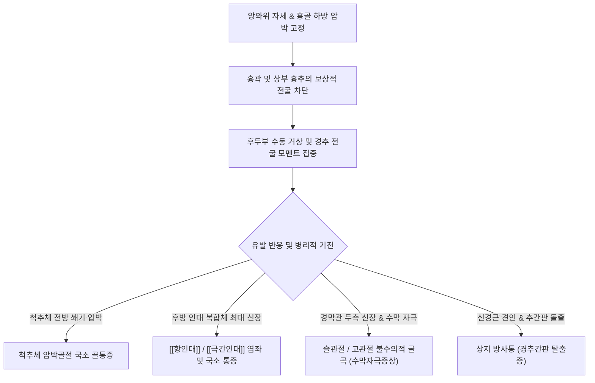

---
aliases:
  - "Soto-Hall Test"
  - "소토-홀 검사"
  - "소토홀 검사"
  - "흉골 압박 경추 전굴 검사"
tags:
  - "이학적검사"
  - "경추"
  - "흉추"
  - "인대손상"
  - "골절"
  - "수막자극징후"
created: "2024-02-27"
updated: "2026-09-14"
---

# 소토-홀 검사 (Soto-Hall Test)

> **핵심 3줄 요약 (Key Summary)**:
> 🎯 환자를 앙와위로 눕히고 한 손으로 흉골을 하방 압박하여 흉곽 굴곡을 차단한 상태에서, 다른 손으로 환자의 후두부를 받쳐 경추를 수동적으로 전굴(flexion)시키는 유발 검사이다.
> 🚩 경추 및 상부 흉추의 국소 통증 유발은 [[항인대]], [[극간인대]] 등 후방 인대 복합체 손상이나 척추체 압박골절을 시사하며, 방사통은 추간판 탈출증을 의미한다.
> 🔬 경추 굴곡 시 불수의적으로 슬관절 및 고관절을 굽히는 반응은 수막자극징후([[부르진스키 징후]] 양상)를 강력히 시사한다.
> ⚠️ 고열, 오한, 극심한 두통을 동반하면서 경추 굴곡 시 다리를 굽히거나 심한 경부 강직이 나타나면 급성 뇌수막염 및 중추신경계 감염을 의심하는 즉각적인 레드플래그이다.

---

## 1. 개요 및 검사 목적

소토-홀 검사(Soto-Hall Test)는 주로 [[경추]] 및 상부 [[흉추]] 영역의 골격계 병변(척추체 압박골절, 후방 관절돌기 손상), 후방 지지 연부조직(인대 및 근막)의 파열이나 염좌, 그리고 척수 경막의 신경학적 긴장을 감별하기 위해 고안된 정형외과 및 신경학적 이학적 검사법이다.

환자가 앙와위(Supine)로 누운 상태에서 단순히 머리를 들어 올리면 경추뿐만 아니라 흉추와 요추, 골반까지 연쇄적으로 굴곡되어 국소적인 병변 부위에 충분한 인장력(Tension)과 압박력(Compression)이 집중되지 않는다. 소토-홀 검사는 검사자가 환자의 **흉골(Sternum)을 하방으로 단단히 압박 고정**함으로써 흉곽과 흉추의 굴곡 보상 운동을 완벽히 차단하고, 순수한 경추 및 상부 흉추의 전굴 모멘트를 극대화하여 미세한 인대 손상과 잠재적 골절, 나아가 수막 자극 상태를 민감하게 탐지해 낸다.

![[soto_hall_clinical_maneuver.jpg|450]]
> **[도해] 소토-홀 검사(Soto-Hall Test)의 임상 시술 장면**: 검사자의 한 손이 환자의 흉골을 하방으로 안정되게 압박 고정하여 체간의 연쇄적 굴곡을 차단하고, 다른 손으로 후두부를 받쳐 경추를 최대 전굴시키며 통증 및 하지 굴곡 반사를 유발한다.

---

## 2. 해부학 및 생체역학 기전

### 생체역학 메커니즘

경추가 전굴(Flexion)될 때 척추 단위에서는 상반된 두 가지 기계적 응력이 발생한다:
1. **전방 척추체 압박 응력(Anterior Compression Force)**: 경추체 전방과 추간판 전면부에 강력한 쐐기형 압박력이 부하된다. 만약 골다공증성 또는 외상성으로 척추체 전방 피질골의 미세골절이나 압박골절(Compression fracture)이 존재할 경우 극심한 국소 골성 압통이 유발된다.
2. **후방 인대 복합체 인장 응력(Posterior Tension Band Stress)**: 척추 극돌기 사이를 잇는 [[항인대]](Ligamentum nuchae), [[극간인대]](Interspinous ligament), [[극상인대]](Supraspinous ligament), 황색인대(Ligamentum flavum) 및 후방 관절낭이 극도로 신장된다. 편타 손상(Whiplash)이나 과굴곡 손상으로 이들 후방 인대가 부분 파열되었거나 염좌가 발생한 경우, 흉골 고정으로 인해 장력이 분산되지 못하고 손상 부위에 집중되어 날카로운 국소 열상통이 재현된다.
3. **신경축 및 척수 경막 견인력(Dural Traction & Meningeal Tension)**: 경추 전굴은 후두골 대후두공에서부터 척수강 전체의 경막관(Dural sac)을 두측(Cephalad)으로 강하게 끌어당긴다. 중추신경계 감염이나 지주막하 출혈로 인해 경막이 염증성 자극을 받고 있는 경우, 신경근 장력 완화를 위해 척수 하단을 이완시키려는 척수성 방어 반사가 발동하여 양측 고관절과 슬관절을 무의식적으로 굴곡시키게 된다([[부르진스키 징후]]와 동일 기전).

### 검사 시 관여 조직 및 해부학적 구조

| 구조물 분류 | 관여 조직 및 명칭 | 소토-홀 검사 시 생체역학적 반응 |
| :--- | :--- | :--- |
| **인대 조직** | [[항인대]], [[극간인대]], [[극상인대]], 황색인대 | 경추 굴곡 시 최대 장력 부하, 손상 부위 국소 통증 유발 |
| **골격 구조** | [[경추]] (C1-C7), 상부 [[흉추]] (T1-T4), 흉골 | 흉골 고정 지지점 형성, 척추체 전방에 수직 압박력 부하 |
| **신경계** | 경수 신경근, 척수 경막(Dura mater) | 경막 신장 스트레스 발생, 신경근 포착 시 상지 방사통 발현 |
| **근육군** | [[두반극근]], [[경장근]], [[두장근]], [[승모근]] | 경추 후방 신전근군의 수동 신장 및 긴장도 반영 |

---

## 3. 검사 방법 및 절차

### 검사 전 준비
1. 환자를 진찰대 위에 편안한 앙와위(Supine)로 눕히고, 베개나 경추 지지대를 완전히 제거하여 목이 중립 자세(Neutral position)가 되도록 한다.
2. 환자에게 긴장을 풀고 이완하도록 안내하며, 머리를 들어 올릴 때 특정 부위의 통증이나 하지의 움직임이 나타나면 즉시 알리도록 설명한다.

### 단계별 시행 절차

#### 1단계: 흉골 압박 고정 (Sternum Stabilization)
- 검사자는 환자의 측면에 서서, 한 손의 손바닥(Palm)을 환자의 흉골체(Sternum) 중앙에 평평하게 얹는다.
- 환자가 호흡을 내쉴 때 흉골을 침대 방향으로 단단히 하방 압박하여 흉곽의 거상이나 상부 흉추의 전방 굴곡이 일어나지 않도록 고정한다.

![[soto_hall_step1_sternum_stabilization.jpg|320]]
> **[Step 1] 흉골 압박 고정**: 흉골체 중앙을 손바닥으로 부드럽고 단단하게 하방 지지하여 흉곽의 굴곡 보상 동작을 차단한다.

#### 2단계: 수동적 경추 전굴 (Passive Cervical Flexion)
- 검사자의 다른 손으로 환자의 후두부(Occiput)를 안정감 있게 감싸 쥔다.
- 흉골을 누르고 있는 손의 고정을 확고히 유지한 채, 후두부를 천천히 들어 올려 환자의 턱이 흉골에 닿도록 경추를 수동적으로 최대 전굴(Passive Flexion)시킨다.
- 경추가 굴곡되는 동안 환자의 통증 발생 지점(Level), 통증의 양상(국소성 vs 방사성), 그리고 양측 하지의 무의식적 굴곡 반응을 세밀히 관찰한다.

![[soto_hall_step2_neck_flexion.jpg|320]]
> **[Step 2] 경추 수동 전굴 및 반응 관찰**: 흉골 고정을 유지하며 후두부를 거상하여 경추를 최대로 굴곡시키고, 국소 통증 및 슬관절 굴곡 유무를 평가한다.

### 검사 시연 영상
- [Soto-Hall Test Demonstration (Chiropractic & Orthopedic Examination)](https://www.youtube.com/watch?v=H8pEbZm5Ww4)
- [Cervical Sprain & Meningeal Assessment](https://www.youtube.com/watch?v=pjPu7Ayx2W8)

---

## 4. 양성 판정 기준 및 임상적 의의

소토-홀 검사는 유발되는 임상적 양상에 따라 병변의 성격을 명확하게 감별할 수 있는 다목적 검사이다.

### 양성 반응 및 감별 질환

| 검사 반응 (Response) | 의심 병변 및 질환 | 병태생리학적 기전 |
| :--- | :--- | :--- |
| **국소 경추부/흉추부 예리한 통증** | 경추·흉추 인대 염좌, [[항인대]] 파열 | 후방 인대 복합체 장력 부하 및 미세 손상 부위 신장 |
| **척추체 전방 둔통 및 심부 압통** | 경추 또는 흉추 압박골절 | 척추체 전방 피질골 쐐기 압박력 집중에 의한 골막 통증 |
| **경추 굴곡 시 슬관절·고관절 불수의 굴곡** | 수막자극증상 ([[부르진스키 징후]]) | 척수 경막 신장에 의한 척수 반사성 하지 굴곡 회피 반응 |
| **상지(팔·손가락)로 뻗치는 전격성 방사통** | 경추간판 탈출증, 경수신경근병증 | 신경근 슬리브 및 경막 견인으로 인한 신경근 포착 악화 |
| **후두부에서 등·둔부로의 전격통** | [[레르미트 징후]](L'Hermitte's sign) | 경수 탈수초성 병변(다발성 경화증, 경추척수증) |

### 진단 정확도 지표

| 통계 지표 | 수치 범위 | 임상적 해석 |
| :--- | :--- | :--- |
| **민감도 (Sensitivity)** | 65% ~ 78% | 경추 후방 인대 손상 및 골절 선별 검사로서 양호한 민감도 |
| **특이도 (Specificity)** | 70% ~ 85% | 흉골 고정을 통해 흉추 보상을 배제하므로 단순 굴곡보다 특이도 우수 |
| **수막자극징후 감별 민감도** | 약 60% (Brudzinski 상관) | 고전적 경부 강직 검사보다 흉곽 고정 하에 경막 장력이 집중됨 |

---

## 5. 감별 진단 및 유사 검사

소토-홀 검사는 경추의 전굴 기전을 활용하는 다른 신경학적·정형외과적 유발 검사들과 함께 종합적으로 비교 평가해야 한다.

| 검사명 | 주 검사 목적 및 표적 구조 | 검사 동작의 핵심 차이점 | 임상적 감별 포인트 |
| :--- | :--- | :--- | :--- |
| **소토-홀 검사** | 경추 후방 인대 손상, 흉추 압박골절, 수막 자극 | **흉골을 손바닥으로 압박 고정**한 상태에서 경추 전굴 | 흉골 고정으로 흉곽 굴곡 배제, 국소 인대 및 척추체 부하 집중 |
| [[부르진스키 징후]] | 뇌수막염, 지주막하 출혈 (수막자극) | 흉골 고정 없이 후두부를 수동 전굴 | 양측 고관절 및 슬관절의 굴곡 반사 유발에 집중 |
| [[레르미트 징후]] | 다발성 경화증, 경추척수증 (경수 병변) | 좌위 또는 앙와위에서 능동적/수동적 경추 급격 굴곡 | 척추를 타고 내려가는 감전되는 듯한 전격통(Electric shock) 유발 |
| [[스펄링 검사]] | 경추간판 탈출증, 추간공 협착증 | 경추 신전, 측굴, 회전 후 축성 압박 부하 | 굴곡이 아닌 **신전-측굴-압박**을 통해 추간공을 협소화 |
| [[발살바 검사]] | 척수강 내 공간점유병변, 수핵 탈출증 | 복압을 주어 척수강 내압을 상승시킴 | 경추 굴곡 기계적 스트레스가 아닌 정맥압 상승에 의한 통증 |

---

## 6. 주의사항 및 위양성/위음성 요인

### ⚠️ 필수 안전 수칙 및 금기증
1. **불안정성 경추 골절 의심 환자**: 고에너지 교통사고, 낙상 등 급성 외상 환자에서 경추 골절이나 아탈구(Subluxation)가 의심되는 경우, 경추를 수동 굴곡시키는 행위 자체가 척수 손상(Spinal cord injury)을 유발할 수 있으므로 방사선 검사(X-ray, CT) 확인 전까지 검사를 절대 금기한다.
2. **급성 경추성 현훈 및 추골동맥 부전**: 경추를 과도하게 굴곡시킬 때 어지럼증, 안진, 구역감이 동반되는 환자는 추골뇌저동맥 순환 장애 여부를 확인해야 한다.

### 위양성(False Positive) 요인
- [[승모근]], [[두판상근]], [[경판상근]] 등 경추 후면 근육의 극심한 근막통증증후군(MPS)이나 급성 근육 긴장: 근육의 신장통이 인대 손상 통증으로 오인될 수 있다.
- 흉골부 압박 통증: 검사자가 흉골을 지나치게 강하게 누르면 늑연골염(Tietze 증후군)이나 흉골 타박 환자에서 흉골 자체의 국소 통증이 유발될 수 있다.

### 위음성(False Negative) 요인
- 환자가 경부 근육을 과도하게 긴장시켜 수동적 전굴을 방어(Muscle guarding)하는 경우 경추 후방 인대에 충분한 장력이 걸리지 않아 음성으로 나타날 수 있다.

---

## 7. 진료실 핵심 임상 필기

### 💡 원장실 실전 노하우 & 진료실 체크리스트
- **원문 필기 100% 융합 및 실전 착안점**:
  - 원문 기록: *"환자를 앙와위로 눕히고 목을 전굴시키며 흉골을 눌러줌. 국소통증은 경추부 후방 인대의 손상을 의심하며, 무릎을 굽힌다면 수막자극증상을 의심할 수 있음. 레드플래그: 경추 굴곡 했을 때 슬관절을 굴곡하려고 하면 수막자극 증상을 의심할 수 있다. 열이나 오한이 동반될 수 있다."*
  - **흉골 압박의 핵심 디테일**: 흉골을 누를 때 환자의 호흡 주기를 맞추는 것이 핵심이다. 환자가 숨을 완전히 내쉬었을 때(호기 말) 흉골이 가라앉는 타이밍에 손바닥으로 부드럽게 고정해야 늑연골의 불필요한 압박통을 예방하고 흉추 굴곡을 완벽히 봉쇄할 수 있다.
  - **인대 통증 vs 근육 통증 촉진 감별**: 소토-홀 검사에서 국소 통증이 나타난 분절을 기억한 후, 경추를 다시 중립으로 두고 해당 분절의 극돌기 사이(극간 부위)를 엄지손가락으로 깊게 압박해 본다. 극돌기 사이 심부 압통이 예리하게 나타나면 [[극간인대]] 및 [[항인대]]의 실질적 염좌로 확진할 수 있다.

### 🚩 레드플래그 즉각 전원 기준
- **수막자극징후(Meningeal Sign) 및 감염**:
  - 소토-홀 검사 시 환자가 저항할 수 없이 양쪽 무릎을 번쩍 들어 올리는 현상이 관찰되면서, **38℃ 이상의 고열, 오한, 쪼개질 듯한 박동성 두통, 눈부심(Photophobia)**이 동반되는 경우.
  - 급성 세균성/바이러스성 뇌수막염(Meningitis) 또는 지주막하 출혈(SAH)의 전형적 경고 신호이므로 일체의 한의원 치료를 중단하고 상급병원 응급실로 즉시 이송 의뢰해야 한다.
- **척추 골수염 및 경막하 농양**:
  - 최근 침습적 시술 병력이나 면역저하자가 야간 안정 시에도 극심한 통증과 체중 감소를 호소하는 경우.

### 🗣️ 환자 티칭 & 설명 스크립트
> "환자분, 지금 제가 가슴뼈를 살짝 누르고 머리를 앞으로 숙여보는 검사를 진행했습니다. 가슴뼈를 누른 이유는 허리나 등이 굽혀지는 것을 막고, 목 뒤쪽의 인대와 뼈에만 힘이 실리도록 집중시키기 위함입니다. 고개를 숙일 때 목 뒤 특정 마디에서 찌르는 통증이 발생한 것은, 목뼈를 뒤에서 단단히 잡아주는 [[항인대]]에 염좌나 미세 손상이 생겼다는 뜻입니다. 다행히 다리가 저절로 굽혀지는 신경계 과민 반응은 없으므로, 손상된 인대 부위를 타겟으로 [[약침]] 치료와 인대 강화 침 치료를 시행하면 안정적으로 회복될 수 있습니다."

### 🌿 한의 임상 치료 연계 프로토콜
- **급성기 항인대·극간인대 염좌** ([[항인대]], [[극간인대]] 손상):
  - **침구 치료**: 손상 분절 극돌기 직하부 풍부(GV16), 대추(GV14), 천주(BL10), 경추 협척혈(EX-B2) 자침.
  - **약침 치료**: 중성어혈약침 또는 소염약침을 극간인대 및 관절돌기 주변에 0.1~0.2cc씩 분할 주입하여 급성 염증과 부종을 배출.
  - **추나 요법**: 급성 인대 손상기에는 고속저진폭(HVLA) 경추 교정기법을 엄격히 금기하며, 경추의 경점성 근막 이완(Myofascial Release) 및 견인 치료(Traction) 위주로 부드럽게 시술.
- **방제 연계**:
  - 급성기 경항부 강직 및 인대 손상: [[갈근탕]](葛根湯) 또는 서경탕(舒經湯) 가감방.
  - 어혈성 통증 지속 시: 당귀수산(當歸鬚散)에 속단, 두충을 가미하여 인대 건골 강화 도모.

---

## 8. 참고문헌 및 학술 연구 (References)

1. **Failure properties of cervical spinal ligaments under fast strain rate deformations.**
   - 저자: Yoganandan N, Kumaresan S, Pintar FA.
   - 저널: *Spine (Phila Pa 1976)*. 2007 Jan 1;32(1):E7-13.
   - PMID: [17202883](https://pubmed.ncbi.nlm.nih.gov/17202883/) | DOI: [10.1097/01.brs.0000251016.92059.61](https://doi.org/10.1097/01.brs.0000251016.92059.61)
   - `[연구 요약]`: 고속 변형 하에서 경추 인대 복합체([[항인대]], 극간인대, 황색인대)의 생체역학적 파열 특성을 규명한 사체 연구로, 급격한 경추 굴곡 시 후방 인대 장력 밴드의 파열 역치와 임상적 손상 메커니즘을 규명함.

2. **From Brudzinski to Jamil: Unveiling Classical and Emerging Clinical Signs of Meningitis.**
   - 저자: Jamil RT, et al.
   - 저널: *Cureus*. 2025 Sep.
   - PMID: [41141093](https://pubmed.ncbi.nlm.nih.gov/41141093/)
   - `[연구 요약]`: 경추 전굴 시 유발되는 수막자극징후의 고전적 징후([[부르진스키 징후]])와 변형 검사법들의 신경해부학적 기전을 고찰하고, 척수 경막 견인에 따른 슬관절·고관절 반사성 굴곡의 임상적 선별 가치를 제시함.

3. **Accuracy of physical signs for detecting meningitis: a hospital-based diagnostic accuracy study.**
   - 저자: Nakao JH, et al.
   - 저널: *Clin Neurol Neurosurg*. 2010 Nov;112(9):789-94.
   - PMID: [20615607](https://pubmed.ncbi.nlm.nih.gov/20615607/) | DOI: [10.1016/j.clineuro.2010.06.014](https://doi.org/10.1016/j.clineuro.2010.06.014)
   - `[연구 요약]`: 급성 경부 전굴 검사 및 수막 자극 검사들의 뇌수막염 감별 진단 정확도를 평가하여, 개별 검사의 민감도는 제한적이나 경부 강직과 하지 굴곡 징후가 동반될 때의 높은 특이도를 보고함.