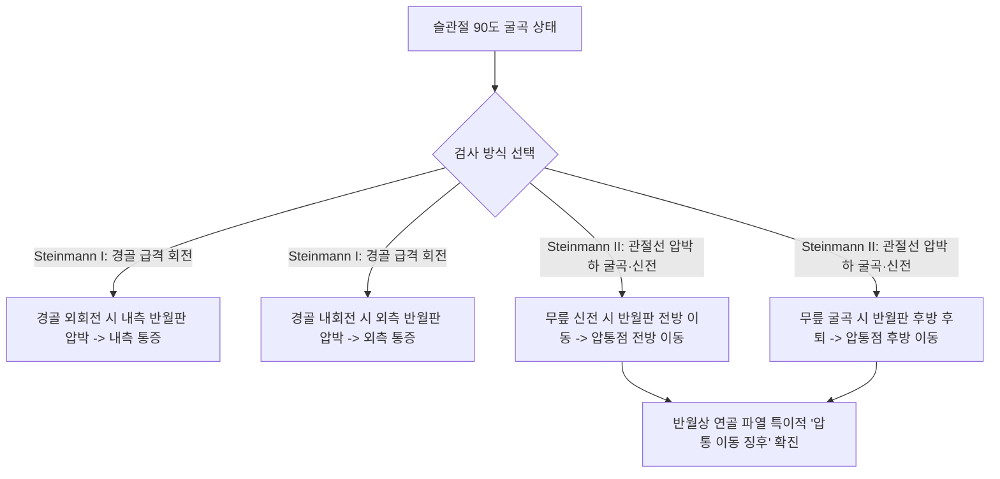

---
aliases:
  - "Steinmann Test"
  - "Steinmann's Sign"
  - "슈타인만 검사"
  - "스타인만 검사"
  - "반월상연골 압통 이동 검사"
  - "Moving Tenderness Test"
tags:
  - "이학적검사"
  - "슬관절"
  - "반월상연골"
  - "무릎통증"
  - "관절선압통"
created: "2024-01-22"
updated: "2026-09-15"
---

# 슈타인만 검사 (Steinmann Test)

> **핵심 3줄 요약 (Key Summary)**:
> 🎯 슬관절을 굴곡한 상태에서 경골을 강제로 내회전·외회전시키거나(Steinmann I), 관절선 압통을 누른 채 무릎을 굴곡·신전시켜 압통점의 전후 이동을 확인하는(Steinmann II) 반월상 연골 파열 정밀 검사이다.
> 🚩 경골 외회전 시 내측 관절선 통증은 내측 반월판 손상을, 내회전 시 외측 관절선 통증은 외측 반월판 손상을 시사한다.
> 🔬 무릎을 신전할 때 압통점이 전방으로 이동하고 굴곡할 때 후방으로 이동하는 **압통 이동 징후(Moving Tenderness)**는 측부인대 손상과 반월상 연골 파열을 구별하는 가장 결정적인 병리적 특징이다.
> ⚠️ 퇴행성 관절염으로 인한 골극 형성이나 활액막염에서도 회전통이 유발될 수 있으므로 [[맥머레이 검사]], [[아플리 압박-신연 검사]]와 함께 복합 평가해야 한다.

---

## 1. 개요 및 검사 목적

슈타인만 검사(Steinmann Test, 스위스 외과의사 프리츠 슈타인만(Fritz Steinmann, 1872–1932) 고안)는 무릎 관절 내의 충격 흡수 구조물인 [[반월상 연골]](Meniscus, 내측 및 외측 반월판)의 파열, 변성 및 기능 손상을 진단하기 위해 개발된 고전적이면서도 매우 정밀한 정형외과 이학적 검사법이다.

임상적으로 슈타인만 검사는 두 가지 단계적 검사(Steinmann I & Steinmann II)로 구성된다:
1. **제1검사(Steinmann I)**: 앙와위 또는 좌위에서 슬관절을 90도 굴곡한 상태로 경골을 급격히 비트는 **회전력(Torsional force)**을 가하여 손상된 반월판 연골편에 압박과 끼임 통증을 유발한다.
2. **제2검사(Steinmann II - Moving Tenderness Test)**: 슬관절의 굴곡과 신전 각도 변화에 따라 반월상 연골체가 대퇴과와 경골 고평부 사이에서 전후로 미끄러져 움직이는 생체역학적 동적 궤적을 이용하여, **국소 압통점(Tender point)이 앞뒤로 물리적으로 이동하는 현상**을 감지해 낸다.

![[Pasted image 20240122015344.png|450]]
> **[원문 교과서 도해] 슈타인만 검사(Steinmann Test)의 복합 양상**: 좌측(좌위 경골 회전 유발 도해)과 우측(앙와위 슬관절 회전 및 관절선 촉진 임상 실사).

---

## 2. 해부학 및 생체역학 기전

### 생체역학 메커니즘

반월상 연골은 대퇴과(Femoral condyle)와 경골 고평부(Tibial plateau) 사이에 위치하는 섬유연골성 쐐기 구조물로, 관절 운동 시 고정되어 있지 않고 대퇴과의 전후 롤링(Rolling)과 글라이딩(Gliding) 운동에 맞춰 함께 움직인다.
1. **Steinmann I (회전 전단 응력 기전)**:
   - 슬관절 90도 굴곡 상태에서 경골을 **외회전(External rotation)**시키면, 내측 경골 고평부가 전외측으로 회전하면서 대퇴 내과가 내측 반월상 연골 후각부를 강력하게 압박한다. 이때 내측 반월판에 파열이 존재하면 날카로운 관절선 통증이 유발된다.
   - 반대로 경골을 **내회전(Internal rotation)**시키면 대퇴 외과가 외측 반월상 연골 전외측부를 전단 압박하여 외측 관절선 통증을 유발한다.
2. **Steinmann II (반월판의 동적 전후 이동 기전 - Moving Tenderness)**:
   - **슬관절 신전(Extension) 시**: 대퇴골이 전방으로 미끄러지면서 반월상 연골을 앞으로 밀어내므로, **반월판의 실질과 파열편이 관절의 전방(Anterior)으로 이동**한다. 따라서 검사자가 관절선을 누르고 있을 때 압통점이 앞쪽으로 따라 나오는 것이 명확히 느껴진다.
   - **슬관절 굴곡(Flexion) 시**: 반월상 연골은 대퇴과 후방 회전 및 슬와근, 반막양근 건의 당김에 의해 **관절의 후방(Posterior)으로 후퇴**한다. 따라서 눌렀을 때 아픈 통증 지점이 무릎 뒤쪽으로 깊숙이 이동한다.
   - 인대 손상과의 감별 포인트: 만약 측부인대([[내측측부인대]], [[외측측부인대]])나 관절낭 자체의 단순 염좌라면 인대의 부착부는 뼈에 단단히 고정되어 있으므로 무릎을 굽히거나 펴도 압통의 위치가 절대 변하지 않는다. 오직 움직이는 연골판(Meniscus) 파열에서만 압통점이 앞뒤로 이동(Moving Tenderness)한다.

### 검사 시 관여 조직 및 해부학적 구조

| 구조물 분류 | 관여 조직 및 명칭 | 슈타인만 검사 시 생체역학적 반응 |
| :--- | :--- | :--- |
| **핵심 표적 조직** | 내측 반월상 연골(MM), 외측 반월상 연골(LM) | 경골 회전 시 압박력 부하, 신전 시 전방 이동, 굴곡 시 후방 이동 |
| **관절선 랜드마크** | 대퇴-경골 관절선(Joint line) | 손가락 촉진을 통해 압통의 유무 및 위치 이동을 감지하는 기준선 |
| **회전 구동 골격** | 경골(Tibia), 대퇴골(Femur) | 회전 토크를 가하여 연골판 파열편을 압착 |
| **동적 견인 근육** | [[슬와근]](Popliteus), [[반막양근]] | 무릎 굴곡 시 외측/내측 반월판을 후방으로 끌어당기는 동적 지지대 |

---

## 3. 검사 방법 및 절차

### 검사 전 준비
1. 환자를 진찰대에 앙와위(Supine)로 편안히 눕히거나, 다리를 진찰대 밖으로 늘어뜨린 좌위(Seated) 자세를 취하게 한다.
2. 환자의 무릎 관절 주위 근육([[대퇴사두근]], [[햄스트링]])을 완전히 이완시키도록 안내한다.

![[steinmann_test_clinical_palpation.jpg|320]]
> **[Step 1] Steinmann I (회전 검사)**: 무릎을 90도 굴곡한 상태에서 발목을 쥐고 경골을 외회전/내회전시키며 관절선 통증을 촉진한다.

### 단계별 시행 절차

#### Steinmann I 시행 절차 (회전 압박 유발)
- 검사자는 한 손으로 환자의 발목과 발뒤꿈치를 안정적으로 감싸 쥔다.
- 다른 손의 엄지와 검지는 무릎의 내측 및 외측 관절선(Joint line)에 가볍게 대어 관절의 비틀림과 덜컥거림(Click)을 감지할 준비를 한다.
- 슬관절을 90도 굴곡한 상태에서, 하퇴(경골)를 외측으로 빠르게 외회전(External rotation)시킨다 $\rightarrow$ 내측 관절선 통증 유발 여부 확인.
- 이어서 경골을 내측으로 빠르게 내회전(Internal rotation)시킨다 $\rightarrow$ 외측 관절선 통증 유발 여부 확인.

![[steinmann_test_diagram.png|300]]
> **[Step 2] Steinmann II (압통 이동 검사)**: 관절선 압통점을 엄지로 누른 상태에서 무릎을 펴고 굽힐 때 손가락 밑에서 통증 부위가 앞뒤로 이동하는지 확인한다.

#### Steinmann II 시행 절차 (동적 압통 이동 확인)
- 슬관절을 90도 굴곡한 상태에서 내측 또는 외측 관절선을 따라 엄지손가락으로 압박하여 가장 극심한 국소 압통점(Point tenderness)을 찾는다.
- 해당 압통점에 엄지손가락을 밀착하여 누른 상태를 유지하면서, 검사자의 다른 손으로 무릎을 천천히 신전(Extension)시킨다.
- 무릎이 펴질 때 압통점이 엄지손가락 아래에서 **앞쪽(전방)으로 미끄러져 이동**하는지 확인한다.
- 다시 무릎을 천천히 굴곡(Flexion)시키면서, 압통점이 **뒤쪽(후방)으로 후퇴**하는지 확인한다.

### 검사 시연 영상
- [Steinmann Test for Meniscal Tears](https://www.youtube.com/watch?v=kZm5VEHKMPQ)
- [Meniscus Examination: Joint Line Tenderness & Steinmann Sign](https://www.youtube.com/watch?v=GSFbttpxCuQ)

---

## 4. 양성 판정 기준 및 임상적 의의

### 판정 기준

| 검사 세부 유형 | 양성 반응 (Positive Finding) | 진단적 판정 및 임상적 의미 |
| :--- | :--- | :--- |
| **Steinmann I** | 경골 외회전 시 내측 관절선 통증 | **내측 반월상 연골(Medial Meniscus) 파열** |
| **Steinmann I** | 경골 내회전 시 외측 관절선 통증 | **외측 반월상 연골(Lateral Meniscus) 파열** |
| **Steinmann II** | 신전 시 전방 이동, 굴곡 시 후방 이동 | **반월상 연골 파열 확진 (Moving Tenderness 징후)** |
| **음성 대조군** | 굴곡·신전 시에도 압통점 위치 불변 | 측부인대 염좌, 관절낭염, 활액막염 (연골판 손상 배제) |

### 진단 정확도 지표

| 통계 지표 | 수치 범위 | 학술적 근거 및 임상적 해석 |
| :--- | :--- | :--- |
| **민감도 (Sensitivity)** | 68% ~ 78% | 단순 관절선 압통보다 회전 및 이동 동반 시 높은 민감도 |
| **특이도 (Specificity)** | **82% ~ 90%** | Steinmann II의 압통 이동 확인 시 인대 손상 배제 특이도 매우 우수 |
| **복합 검진 정확도** | 88% 이상 | 맥머레이 + 아플리 + 슈타인만 3종 병행 시 관절경 일치율 극대화 |

---

## 5. 감별 진단 및 유사 검사

반월상 연골 손상을 감별하기 위한 대표적인 슬관절 이학적 검사들과 비교 분석한다.

| 검사명 | 주요 평가 기전 | 검사 동작 특성 | 슈타인만 검사와의 감별 포인트 |
| :--- | :--- | :--- | :--- |
| **슈타인만 검사** | 경골 회전 + **압통점의 전후 이동** | 90도 굴곡 회전 및 연속적 굴곡-신전 압통 추적 | 유일하게 **연골판의 물리적 전후 이동(Moving Tenderness)**을 직접 촉진 |
| [[맥머레이 검사]] | 연골판 후각부 파열편의 관절 내 끼임 | 최대 굴곡에서 회전 및 외반/내반을 주며 신전 | 관절선에서의 둔탁한 **탄발음(Click/Thud)** 및 잠김(Catching) 감지 |
| [[아플리 압박-신연 검사]] | 축성 압박 vs 신연에 따른 통증 역전 | 복와위에서 무릎 90도 굴곡 후 압박/견인 회전 | 인대 손상(신연 시 통증)과 연골판 손상(압박 시 통증)을 기계적 분리 |
| 테살리 검사 (Thessaly) | 체중 부하 상태에서의 동적 연골 비틀림 | 한 발로 서서 무릎 20도 굴곡 후 체간 회전 | 체중 부하 기능성 검사로서 가장 높은 민감도 보유 |

---

## 6. 주의사항 및 위양성/위음성 요인

### 위양성(False Positive) 요인
1. **슬관절 퇴행성 골관절염(OA) 및 변연부 골극(Osteophytes)**: 관절 변연에 튀어나온 뼈 돌출부를 누르면 반월판 파열이 없어도 심한 압통이 유발될 수 있다.
2. **거위발건염(Pes Anserinus Tendinitis)**: 경골 내측 관절선 하부 2~3cm 부위의 염증성 통증이 내측 반월판 통증으로 오인될 수 있으나, 거위발건염은 무릎 굴곡·신전 시 통증 위치가 이동하지 않는다.

### 위음성(False Negative) 요인
1. **급성 혈관절증(Hemarthrosis) 및 관절강 삼출액**: 무릎 내부의 심한 붓기로 인해 관절선 촉진 시 연골판 압박이 정확히 이루어지지 않을 수 있다.
2. **환자의 대퇴사두근 긴장(Guarding)**: 무릎을 펴고 굽힐 때 환자가 다리에 힘을 꽉 주고 있으면 연골판의 자유로운 전후 이동이 방해받는다.

---

## 7. 진료실 핵심 임상 필기

### 💡 원장실 실전 노하우 & 진료실 체크리스트
- **원문 필기 100% 융합 및 실전 적용**:
  - 원문 기록: *"- 슬관절 반월판 검사, ![[Pasted image 20240122015344.png]]"*
  - **맥머레이 검사가 애매할 때 슈타인만 II가 구원투수**: 맥머레이 검사에서 뚜렷한 클릭음(Click)이 들리지 않고 환자가 그저 아프다고만 할 때, 슈타인만 II 검사를 즉시 적용한다. 관절선에 엄지를 대고 무릎을 천천히 펴면서 "손가락이 닿는 통증 부위가 앞으로 튀어나오는 느낌이 드시나요?"라고 물어본다. 환자가 "어, 무릎 펼 때 아픈 부위가 앞으로 찌릿하고 밀려나와요!"라고 답하면 의심의 여지 없이 반월상 연골 손상이다.
  - **퇴행성 파열 vs 외상성 파열의 촉진 차이**: 젊은 층의 스포츠 외상성 파열은 Steinmann I 회전 시 날카로운 칼로 베는 듯한 통증(Sharp pain)을 호소하며, 중장년층의 퇴행성 수평 파열은 Steinmann II에서 묵직한 뻐근함과 함께 전방 이동감이 뚜렷하게 관찰된다.

### 🗣️ 환자 티칭 & 설명 스크립트
> "환자분, 지금 무릎 안쪽의 연골판 틈새를 손가락으로 누른 상태에서 무릎을 굽혔다 폈다 해보았습니다. 우리 무릎 사이에는 충격을 흡수해 주는 초승달 모양의 물렁뼈인 [[반월상 연골]]이 들어 있습니다. 이 연골판은 고정되어 있는 것이 아니라, 무릎을 펼 때는 앞으로 미끄러져 나오고 무릎을 굽힐 때는 뒤로 숨는 특성이 있습니다. 방금 무릎을 펼 때 아픈 부위가 앞으로 쑥 밀려나오고 굽힐 때 뒤로 들어가는 것이 손끝과 환자분의 감각으로 확인되었습니다. 이것은 뼈나 바깥쪽 인대가 아니라 관절 속에 있는 연골판에 찢어짐이나 손상이 생겼다는 결정적인 증거입니다. 당분간 쪼그려 앉거나 무릎을 비트는 동작을 엄격히 피하시고, 연골 주변의 염증을 가라앉히는 봉약침과 관절 활액 순환 침 치료를 집중적으로 진행해야 합니다."

### 🌿 한의 임상 치료 연계 프로토콜
- **반월상 연골 손상의 침구 및 봉약침 치료**:
  - **타겟 혈자리**: 내슬안(EX-LE4), 외슬안(독비, ST35), 음릉천(SP9), 양릉천(GB34), 곡천(LR8).
  - **봉약침(Apitoxin) 치료**: 관절선 파열 의심 부위 및 연골판 변연부에 BV(10%~20%) 약침을 0.1~0.2cc 분할 주입하여 강력한 멜리틴 항염증 작용과 미세혈관 신생을 유도하여 반월판 적색대(Red zone)의 자가 치유를 촉진.
- **추나 요법 및 견인 치료**:
  - **슬관절 장축 견인 및 활주 교정(Knee Joint Traction & Mobilization)**: 슬관절에 과도한 압박이 걸리지 않도록 대퇴골과 경골 사이의 관절 간격을 일시적으로 넓혀주는 장축 견인 수기 요법을 시행하여 파열편의 기계적 자극을 최소화.
- **한약 처방 연계**:
  - 관절 삼출액 및 부종 급성기: 대강활탕(大羌活湯) 또는 방기황기탕(防己黃芪湯) 가감방.
  - 만성 퇴행성 연골 마모기: 독활기생탕(獨活寄生湯)에 녹용, 우슬, 오가피를 가미하여 연골 기질 보강.

---

## 8. 참고문헌 및 학술 연구 (References)

1. **Using a combination of three clinical tests for detecting meniscal tears increases the accuracy of the clinical examination.**
   - 저자: Mahnik A, Mahnik S, Hrabac P, et al.
   - 저널: *J Sports Med Phys Fitness*. 2024 Jul;64(7):689-696.
   - PMID: [38916089](https://pubmed.ncbi.nlm.nih.gov/38916089/) | DOI: [10.23736/S0022-4707.24.15783-6](https://doi.org/10.23736/S0022-4707.24.15783-6)
   - `[연구 요약]`: 반월상 연골 파열 진단에서 관절선 압통, 맥머레이 검사, 슈타인만 검사를 조합한 복합 검진 배터리의 진단 정확도를 관절경 소견과 비교 분석하여, 복합 적용 시 특이도 90% 이상의 탁월한 임상적 신뢰성을 보고함.

2. **Evaluation of clinical tests and magnetic resonance imaging for knee meniscal injuries: correlation with video arthroscopy.**
   - 저자: Antunes LC, Souza JMG, Cerqueira NB, et al.
   - 저널: *Rev Bras Ortop*. 2017 Sep-Oct;52(5):585-591.
   - PMID: [29085812](https://pubmed.ncbi.nlm.nih.gov/29085812/) | DOI: [10.1016/j.rboe.2017.08.016](https://doi.org/10.1016/j.rboe.2017.08.016)
   - `[연구 요약]`: 슬관절 반월판 손상 환자에서 MRI 영상과 다양한 이학적 검사(슈타인만, 맥머레이 등)의 진단적 일치도를 관절경 비디오 검사와 대조하여 이학적 검사의 비용 효과적 선별 가치를 검증함.

3. **Meniscal lesions in the anterior cruciate insufficient knee: the accuracy of clinical evaluation.**
   - 저자: Pookarnjanamorakot C, Korsantirat T, Woratanarat P.
   - 저널: *J Med Assoc Thai*. 2004 Jun;87(6):618-23.
   - PMID: [15279338](https://pubmed.ncbi.nlm.nih.gov/15279338/)
   - `[연구 요약]`: 전방십자인대 손상이 동반된 복합 슬관절 손상에서 반월판 파열을 진단할 때 슈타인만 징후 및 관절선 압통 평가의 민감도와 위양성 요인을 체계적으로 분석함.